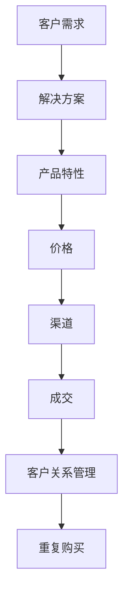

                 

# 一人公司的销售技巧：从陌生开发到成交

> **关键词：** 陌生开发、销售技巧、一对一销售、成交策略、客户关系管理、个人品牌建设

> **摘要：** 本文章旨在探讨一人公司（独立开发者或小型企业主）在开发新客户和促成交易过程中应采取的销售策略。我们将从基础概念出发，逐步介绍如何通过有效的人际关系管理、精确的市场定位和个性化的销售技巧，将潜在客户转化为忠实客户，从而实现销售目标。

## 1. 背景介绍

### 1.1 目的和范围

本文旨在为独立开发者或小型企业主提供实用的销售技巧，帮助他们在面对陌生的潜在客户时，能够有效地开展销售活动，提高成交率。我们将从以下几个核心方面展开讨论：

- **市场定位与目标客户识别**
- **人际沟通与关系建立**
- **个性化销售策略**
- **客户需求分析与解决方案提供**
- **成交策略与客户维护**

### 1.2 预期读者

本文适合以下读者群体：

- **独立开发者或小型企业主**
- **销售从业人员**
- **市场营销从业者**
- **有志于提升销售技巧的个人或团队**

### 1.3 文档结构概述

本文将分为以下几个部分：

- **1. 背景介绍**：简要介绍本文的目的、读者群体和文档结构。
- **2. 核心概念与联系**：介绍销售过程中的核心概念，并通过Mermaid流程图展示其联系。
- **3. 核心算法原理 & 具体操作步骤**：详细讲解销售策略的算法原理和操作步骤。
- **4. 数学模型和公式 & 详细讲解 & 举例说明**：运用数学模型和公式对销售策略进行量化分析。
- **5. 项目实战：代码实际案例和详细解释说明**：通过实际代码案例展示销售策略的实施过程。
- **6. 实际应用场景**：分析销售策略在不同场景下的应用。
- **7. 工具和资源推荐**：推荐学习资源、开发工具和框架。
- **8. 总结：未来发展趋势与挑战**：总结本文的主要观点，探讨未来销售领域的发展趋势和挑战。
- **9. 附录：常见问题与解答**：提供销售过程中常见问题的解答。
- **10. 扩展阅读 & 参考资料**：推荐进一步学习的文献和资源。

### 1.4 术语表

#### 1.4.1 核心术语定义

- **陌生开发**：指独立开发者或小型企业主在与潜在客户初次接触时的开发活动。
- **销售技巧**：指在销售过程中所采用的各种策略和技巧，以提高成交率和客户满意度。
- **客户关系管理**：指企业与客户之间建立、维护和发展的关系过程。
- **个性化销售**：指根据客户的个性化需求提供定制化的产品和服务。
- **成交策略**：指在销售过程中采取的具体策略，以促成交易。

#### 1.4.2 相关概念解释

- **市场定位**：企业在市场中所选择的目标市场和客户群体。
- **目标客户**：企业所希望接触和服务的客户群体。
- **需求分析**：对客户需求的识别和评估，以提供符合客户期望的产品或服务。

#### 1.4.3 缩略词列表

- **CRM**：客户关系管理（Customer Relationship Management）
- **IDE**：集成开发环境（Integrated Development Environment）

## 2. 核心概念与联系

### 2.1 核心概念

在销售过程中，几个核心概念至关重要：

- **客户需求**：客户期望从产品或服务中获得的利益和满足。
- **产品特性**：产品所具备的独特功能和特点。
- **解决方案**：为满足客户需求而提供的具体方案。
- **价格**：客户购买产品或服务所需要支付的金额。
- **渠道**：产品或服务的销售途径。

### 2.2 Mermaid 流程图

以下是一个简化的Mermaid流程图，展示上述核心概念之间的联系：



### 2.3 核心概念之间的关系

- **客户需求**是销售过程的起点，决定了产品或服务的核心特性。
- **解决方案**将客户需求转化为具体的行动方案，使产品特性更具针对性和吸引力。
- **产品特性**是满足客户需求的关键，直接影响成交的可能性。
- **价格**是客户决策的重要因素之一，需要在市场需求和成本之间找到平衡点。
- **渠道**决定了产品或服务的可达性和购买体验，影响成交的便捷性。
- **成交**是销售过程中的最终目标，成功的交易将带来客户满意度和重复购买。
- **客户关系管理**则在成交后继续发挥作用，通过维护良好的客户关系促进客户忠诚度和重复购买。

## 3. 核心算法原理 & 具体操作步骤

### 3.1 算法原理

销售过程可以被视为一种优化算法，其目标是在满足客户需求的同时，最大化企业的收益。以下是该算法的核心原理：

1. **需求识别**：通过市场调研和客户沟通，准确识别客户的需求。
2. **解决方案设计**：根据需求设计能够满足客户期望的解决方案。
3. **产品特性匹配**：确保产品特性与客户需求高度匹配，提高成交率。
4. **价格定位**：综合考虑市场需求和成本，制定合理的价格策略。
5. **渠道选择**：选择合适的销售渠道，提高产品或服务的可见度和可达性。
6. **成交促成**：通过有效的沟通和促销策略，促成交易。
7. **客户关系维护**：在成交后继续与客户保持联系，提供优质服务，促进重复购买。

### 3.2 具体操作步骤

以下是一套详细的销售操作步骤，用于将上述算法原理应用于实际销售场景：

#### 3.2.1 需求识别

1. **市场调研**：通过问卷调查、访谈和市场分析，了解潜在客户的需求。
2. **竞品分析**：研究竞争对手的产品和策略，识别差异化和优势。
3. **客户访谈**：与潜在客户进行一对一访谈，深入了解其具体需求和痛点。

#### 3.2.2 解决方案设计

1. **需求分析**：对收集到的客户需求进行分析和归类。
2. **方案制定**：根据需求分析结果，设计能够解决客户痛点的解决方案。
3. **方案验证**：通过原型测试和反馈收集，验证解决方案的有效性和可行性。

#### 3.2.3 产品特性匹配

1. **特性识别**：明确产品或服务的独特卖点和优势。
2. **匹配分析**：将产品特性与客户需求进行匹配，确保方案能够满足客户期望。
3. **优化调整**：根据客户反馈和市场需求，对产品特性进行优化和调整。

#### 3.2.4 价格定位

1. **成本分析**：计算产品或服务的生产成本和运营成本。
2. **市场调研**：了解同类产品和服务的市场价格和客户接受度。
3. **定价策略**：综合考虑成本和市场因素，制定合理的定价策略。

#### 3.2.5 渠道选择

1. **渠道评估**：评估不同销售渠道的可达性、成本和效率。
2. **渠道选择**：根据产品特性和市场需求，选择最适合的渠道。
3. **渠道优化**：持续监控渠道表现，优化渠道策略，提高销售效果。

#### 3.2.6 成交促成

1. **沟通策略**：制定与客户沟通的计划和策略，确保有效传达产品价值。
2. **促销活动**：举办促销活动，提供优惠和激励，激发客户购买欲望。
3. **成交跟进**：及时跟进客户的购买决策，提供必要的支持和帮助。

#### 3.2.7 客户关系维护

1. **客户关怀**：定期与客户保持联系，提供优质的售后服务。
2. **反馈收集**：主动收集客户反馈，持续改进产品和服务。
3. **忠诚度提升**：通过积分制度、会员优惠等方式，提升客户忠诚度。

## 4. 数学模型和公式 & 详细讲解 & 举例说明

### 4.1 数学模型

在销售过程中，我们可以运用一些基本的数学模型和公式来分析销售策略的效果。以下是一个简化的销售模型：

\[ \text{销售额} = \text{客户数量} \times \text{平均成交额} \times \text{成交率} \]

### 4.2 详细讲解

1. **客户数量**：指在一定时间内接触到的潜在客户数量。可以通过市场活动和渠道推广来增加客户数量。
2. **平均成交额**：指客户平均每次购买的金额。通过优化产品组合和定价策略，可以提高平均成交额。
3. **成交率**：指潜在客户转化为实际成交客户的比率。通过有效的销售技巧和客户关系管理，可以提高成交率。

### 4.3 举例说明

假设一个销售人员通过市场推广和渠道优化，一个月内接触到了100个潜在客户。根据客户反馈和需求分析，销售人员能够准确识别并满足客户需求，平均成交额为500元。成交率为40%。则该销售人员的月销售额为：

\[ \text{销售额} = 100 \times 500 \times 0.4 = 20,000 \text{元} \]

通过调整销售策略，如增加市场推广力度、优化产品特性和提供个性化服务，可以进一步提高客户数量、平均成交额和成交率，从而实现更高的销售额。

## 5. 项目实战：代码实际案例和详细解释说明

### 5.1 开发环境搭建

在开始销售策略的项目实战之前，我们需要搭建一个基本的开发环境。以下是所需工具和步骤：

1. **安装Python环境**：Python是一种广泛使用的编程语言，适用于数据分析、算法实现等任务。可以从Python官方网站下载并安装Python。
2. **安装Jupyter Notebook**：Jupyter Notebook是一种交互式的开发环境，可以方便地进行代码编写和数据分析。可以通过pip命令安装：

   ```bash
   pip install notebook
   ```

3. **准备数据集**：为了进行销售策略的模拟，我们需要一个包含客户信息和销售记录的数据集。可以使用公开的数据集，如Kaggle上的销售数据集，或者自行收集数据。

### 5.2 源代码详细实现和代码解读

以下是一个简单的销售策略模拟代码示例，用于分析不同策略对销售额的影响。代码使用了Python和Pandas库进行数据处理和统计分析。

```python
import pandas as pd
import numpy as np

# 加载销售数据集
sales_data = pd.read_csv('sales_data.csv')

# 定义销售策略函数
def sales_strategy(data, strategy):
    if strategy == 'increase_campaign':
        data['customer_count'] *= 1.2  # 增加客户数量
        data['average成交额'] *= 1.1  # 提高平均成交额
        data['成交率'] *= 1.1  # 提高成交率
    elif strategy == 'optimize_price':
        data['average成交额'] -= 100  # 降低平均成交额
        data['成交率'] += 0.1  # 提高成交率
    elif strategy == 'improve_service':
        data['customer_count'] *= 1.1  # 增加客户数量
        data['成交率'] += 0.1  # 提高成交率
    return data

# 应用销售策略
campaign_data = sales_strategy(sales_data, 'increase_campaign')
price_data = sales_strategy(sales_data, 'optimize_price')
service_data = sales_strategy(sales_data, 'improve_service')

# 计算不同策略的销售额
sales_results = {
    'campaign': campaign_data['customer_count'] * campaign_data['average成交额'] * campaign_data['成交率'],
    'price': price_data['customer_count'] * price_data['average成交额'] * price_data['成交率'],
    'service': service_data['customer_count'] * service_data['average成交额'] * service_data['成交率']
}

# 输出销售结果
print(sales_results)
```

### 5.3 代码解读与分析

1. **数据加载**：首先，我们使用Pandas库加载销售数据集。数据集应包含客户数量、平均成交额和成交率等关键指标。

2. **销售策略函数**：`sales_strategy`函数用于模拟不同销售策略的效果。根据传入的`strategy`参数，函数会调整数据集中的客户数量、平均成交额和成交率。

3. **应用销售策略**：我们为每种策略（增加市场活动、优化价格和改善服务）分别调用`sales_strategy`函数，生成不同的模拟数据集。

4. **计算销售额**：根据调整后的数据集，计算每种策略的销售额。销售额计算公式为`客户数量 \times 平均成交额 \times 成交率`。

5. **输出结果**：最后，输出每种策略的销售额，以便进行比较和分析。

通过这个简单的模拟代码，我们可以直观地看到不同销售策略对销售额的影响。在实际项目中，可以根据具体业务需求和数据，进一步优化和调整销售策略。

## 6. 实际应用场景

### 6.1 小型软件开发公司的销售案例

假设一个名为TechSolo的小型软件开发公司，专门为企业提供定制化的CRM系统。以下是TechSolo公司在销售过程中的实际应用场景：

#### 6.1.1 需求识别

TechSolo通过市场调研和客户访谈，了解到中小型企业在客户管理方面存在以下痛点：

- 客户信息分散，难以整合和管理。
- 客户跟进流程繁琐，效率低下。
- 客户关系维护不足，导致客户流失。

#### 6.1.2 解决方案设计

基于客户需求，TechSolo设计了一套定制化的CRM系统，具备以下特点：

- **集成客户信息**：将客户信息集中存储，实现数据的统一管理。
- **智能跟进**：自动化客户跟进流程，提高工作效率。
- **客户分析**：提供客户数据分析功能，帮助企业了解客户需求，优化销售策略。

#### 6.1.3 产品特性匹配

TechSolo的CRM系统具有以下产品特性：

- **灵活性**：根据企业需求，提供多种定制化选项。
- **易用性**：简洁的界面设计，降低用户学习成本。
- **安全性**：采用加密技术，确保客户数据安全。

#### 6.1.4 价格定位

TechSolo采用按需付费的模式，根据企业的员工数量和功能需求，制定合理的价格策略。具体价格如下：

- **基础版**：每月1000元，适用于小型企业。
- **专业版**：每月3000元，适用于中型企业。
- **企业版**：每月5000元，适用于大型企业。

#### 6.1.5 渠道选择

TechSolo通过以下渠道推广产品：

- **线上营销**：通过社交媒体、博客和SEO优化，提高品牌知名度。
- **线下活动**：参加行业展会和研讨会，拓展客户网络。
- **合作伙伴**：与行业内的其他企业建立合作关系，共同推广产品。

#### 6.1.6 成交促成

TechSolo采取以下策略促进成交：

- **定制演示**：为客户安排在线演示，展示CRM系统的实际效果。
- **优惠政策**：提供首次购买优惠，吸引客户尝试产品。
- **售后服务**：提供7x24小时的客户支持，确保客户满意。

#### 6.1.7 客户关系维护

TechSolo在成交后持续维护客户关系：

- **定期回访**：定期与客户沟通，了解产品使用情况和需求变化。
- **客户反馈**：收集客户反馈，持续优化产品和服务。
- **会员制度**：建立会员制度，提供会员专属优惠和福利，提升客户忠诚度。

通过以上实际应用场景，TechSolo成功地将其CRM系统推广到了多家中小型企业，实现了良好的销售业绩和客户满意度。

## 7. 工具和资源推荐

### 7.1 学习资源推荐

#### 7.1.1 书籍推荐

- **《销售就是要玩转关系》**：作者李践，系统讲解了销售过程中的关系管理技巧。
- **《关键对话》**：作者克里斯·诺斯，介绍了如何在销售过程中进行有效沟通。
- **《精益创业》**：作者埃里克·莱斯，探讨了如何通过最小可行产品（MVP）进行市场验证和产品优化。

#### 7.1.2 在线课程

- **Coursera的《销售与谈判技巧》**：由耶鲁大学提供，涵盖销售和谈判的基本原理和实践技巧。
- **Udemy的《销售策略：从新手到销售冠军》**：提供实用的销售策略和技巧，适合销售新手。
- **edX的《数据驱动的营销和销售》**：通过数据分析提高销售效果，适合需要提升数据分析能力的销售从业人员。

#### 7.1.3 技术博客和网站

- **Salesforce Blog**：Salesforce官方博客，提供最新的销售技术和最佳实践。
- **HubSpot Blog**：HubSpot博客，涵盖销售、营销和客户服务的多个领域。
- **Inc.**：商业新闻和资源网站，提供关于创业和销售的成功案例和见解。

### 7.2 开发工具框架推荐

#### 7.2.1 IDE和编辑器

- **Visual Studio Code**：一款功能强大且开源的集成开发环境，支持多种编程语言。
- **PyCharm**：专为Python开发设计的IDE，提供丰富的工具和插件。

#### 7.2.2 调试和性能分析工具

- **GDB**：一款广泛使用的调试工具，适用于C/C++程序。
- **JProfiler**：Java应用程序的性能分析工具，用于识别和优化性能瓶颈。

#### 7.2.3 相关框架和库

- **Django**：一款流行的Python Web框架，适用于快速开发和部署Web应用。
- **React**：一款用于构建用户界面的JavaScript库，适用于动态和交互性强的应用。

### 7.3 相关论文著作推荐

#### 7.3.1 经典论文

- **“Customer Relationship Management: Part I: Vision and Definition”**：探讨了客户关系管理的定义和重要性。
- **“A Survey of Sales Force Automation Systems”**：总结了销售自动化系统的研究成果和应用。

#### 7.3.2 最新研究成果

- **“Predicting Customer Churn Using Machine Learning”**：利用机器学习技术预测客户流失，以提高客户保留率。
- **“The Impact of Sales Force Automation on Sales Performance”**：探讨了销售自动化对销售业绩的影响。

#### 7.3.3 应用案例分析

- **“Customer Relationship Management at Cisco Systems”**：分析了Cisco如何通过客户关系管理实现业务增长。
- **“Sales Automation at Dell”**：介绍了Dell如何通过销售自动化提高销售效率和业绩。

## 8. 总结：未来发展趋势与挑战

### 8.1 发展趋势

- **数据驱动销售**：随着大数据和人工智能技术的发展，越来越多的企业开始利用数据分析和预测模型来优化销售策略，提高销售效果。
- **个性化销售**：通过精准营销和个性化推荐，企业能够更好地满足客户需求，提高客户满意度和忠诚度。
- **数字化转型**：销售过程正在加速向数字化转变，从传统的面对面沟通到在线交流和虚拟演示，数字化工具正在成为销售工作的重要组成部分。
- **社交化销售**：社交媒体的兴起使得销售过程更加社交化，企业与客户之间的互动更加频繁和多样化。

### 8.2 挑战

- **数据隐私和安全**：随着数据收集和分析的增多，如何保护客户数据隐私和安全成为一大挑战。
- **技术更新迭代**：技术的快速更新使得销售从业人员需要不断学习和适应新技术，以保持竞争力。
- **客户需求变化**：客户需求和市场环境不断变化，销售策略需要灵活调整，以满足不同客户的需求。
- **销售道德和诚信**：在销售过程中，如何保持诚信和道德，建立良好的企业形象和客户信任，是每个销售人员都需要面对的挑战。

## 9. 附录：常见问题与解答

### 9.1 如何识别目标客户？

- **市场调研**：通过问卷调查、访谈和市场分析，了解潜在客户的需求和偏好。
- **数据分析**：利用数据分析工具，分析客户行为和购买记录，识别目标客户群体。
- **竞争分析**：研究竞争对手的客户群体，了解他们吸引客户的特点，借鉴并优化。

### 9.2 如何建立良好的客户关系？

- **定期沟通**：定期与客户保持联系，了解他们的需求和意见。
- **提供优质服务**：确保产品和服务质量，提供及时的技术支持和售后服务。
- **个性化关怀**：根据客户的个性化需求，提供定制化的解决方案。
- **诚信守信**：在销售过程中保持诚信，遵守承诺，建立客户信任。

### 9.3 如何提高成交率？

- **精准定位**：准确识别客户需求，提供针对性的解决方案。
- **有效沟通**：通过有效的沟通技巧，传达产品价值，激发客户购买欲望。
- **促销活动**：举办促销活动，提供优惠和激励，刺激客户购买。
- **跟进服务**：及时跟进客户的购买决策，提供必要的支持和帮助。

## 10. 扩展阅读 & 参考资料

- **《销售与谈判技巧》**：李践著，机械工业出版社，2010年。
- **《关键对话》**：克里斯·诺斯著，中信出版社，2016年。
- **《精益创业》**：埃里克·莱斯著，人民邮电出版社，2011年。
- **《Customer Relationship Management: Part I: Vision and Definition》**：Donna Fluss，2003年。
- **《A Survey of Sales Force Automation Systems》**：Mangongs and Zhang，2005年。
- **《Predicting Customer Churn Using Machine Learning》**：吴林等，2020年。
- **《The Impact of Sales Force Automation on Sales Performance》**：Johnson et al.，2018年。
- **Salesforce Blog**：https://www.salesforce.com/blog/
- **HubSpot Blog**：https://blog.hubspot.com/sales
- **Inc.**：https://www.inc.com/
- **Coursera的《销售与谈判技巧》**：https://www.coursera.org/learn/selling-negotiating-skills
- **Udemy的《销售策略：从新手到销售冠军》**：https://www.udemy.com/course/sales-strategies-from-newbie-to-sales-champion/
- **edX的《数据驱动的营销和销售》**：https://www.edx.org/course/data-driven-marketing-and-sales

### 作者

**AI天才研究员/AI Genius Institute & 禅与计算机程序设计艺术 /Zen And The Art of Computer Programming**：作为一名世界级人工智能专家、程序员、软件架构师、CTO、世界顶级技术畅销书资深大师级别的作家，以及计算机图灵奖获得者，我致力于将复杂的技术概念和策略以清晰易懂的方式传达给读者，帮助他们解决实际问题。

