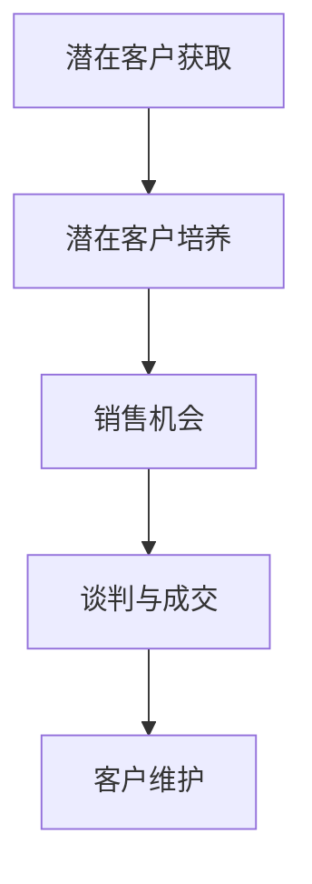

                 

### 文章标题

《一人公司的销售漏斗优化：提高转化率的技巧》

### 关键词

- 销售漏斗优化
- 转化率提升
- 销售策略
- 数据分析
- 个人品牌建设

### 摘要

本文旨在探讨对于小型企业或独立从业者而言，如何通过优化销售漏斗，从而提高销售转化率。文章将围绕销售漏斗的核心概念，从数据分析、策略制定、到执行和评估，提供一系列实用技巧。我们将通过案例分析和算法讲解，帮助读者理解如何利用现代技术和工具，优化销售漏斗中的各个环节，最终实现业务的增长和成功。

## 1. 背景介绍

### 1.1 目的和范围

本文的目标是帮助个人创业者或小型企业主通过系统化的方法，优化他们的销售漏斗，从而提高转化率，增加收入。我们将会讨论销售漏斗的各个关键环节，包括市场调研、潜在客户获取、销售策略、客户维护等，并提供具体的优化策略和工具。

### 1.2 预期读者

本文主要面向那些希望提升个人或企业销售业绩的个人创业者、销售经理、市场营销专员，以及任何对销售漏斗优化感兴趣的从业者。无论你是初出茅庐的新手，还是经验丰富的专业人士，本文都将为你提供宝贵的指导。

### 1.3 文档结构概述

本文结构如下：

1. **背景介绍**：介绍文章的目的、预期读者和文档结构。
2. **核心概念与联系**：解释销售漏斗的概念，并提供相关的流程图。
3. **核心算法原理 & 具体操作步骤**：详细讲解如何通过算法和策略优化销售漏斗。
4. **数学模型和公式 & 详细讲解 & 举例说明**：使用数学模型和公式阐述关键点，并通过案例说明。
5. **项目实战：代码实际案例和详细解释说明**：提供代码实例和解析。
6. **实际应用场景**：讨论销售漏斗优化的应用场景。
7. **工具和资源推荐**：推荐学习资源和开发工具。
8. **总结：未来发展趋势与挑战**：总结文章内容并展望未来。
9. **附录：常见问题与解答**：解答常见的疑问。
10. **扩展阅读 & 参考资料**：提供进一步学习的资源。

### 1.4 术语表

#### 1.4.1 核心术语定义

- **销售漏斗**：一个用于描述潜在客户从接触企业到最终购买产品或服务的整个过程的模型。
- **转化率**：指潜在客户在销售漏斗中从某一阶段成功过渡到下一阶段的比例。
- **市场营销**：包括市场调研、品牌推广、广告投放等一系列活动，旨在吸引潜在客户。
- **客户关系管理（CRM）**：一种系统，用于跟踪和管理企业与现有及潜在客户之间的关系。

#### 1.4.2 相关概念解释

- **漏斗分析**：通过销售漏斗各个阶段的流量和转化数据，分析并优化销售流程。
- **客户获取成本（CAC）**：获取一个新客户所需的平均成本。
- **客户终身价值（LTV）**：一个客户在整个生命周期中为企业带来的总价值。

#### 1.4.3 缩略词列表

- **CRM**：客户关系管理（Customer Relationship Management）
- **CAC**：客户获取成本（Customer Acquisition Cost）
- **LTV**：客户终身价值（Customer Lifetime Value）

## 2. 核心概念与联系

在深入探讨如何优化销售漏斗之前，我们需要先理解几个核心概念。销售漏斗是一个用于描述销售过程的工具，它通常包括以下几个阶段：

1. **潜在客户获取**：通过各种渠道获取潜在客户的联系方式。
2. **潜在客户培养**：通过沟通和互动，将潜在客户转化为销售机会。
3. **销售机会**：潜在客户在购买决策过程中，对产品或服务表示出明确的兴趣。
4. **谈判与成交**：与潜在客户进行谈判，达成最终销售。
5. **客户维护**：在客户购买后，提供售后服务，确保客户满意度，以增加复购率。

下面是一个使用Mermaid绘制的销售漏斗流程图：



在这个流程中，每个阶段都有其特定的目标和指标。通过分析这些数据，我们可以识别出漏斗中的瓶颈，并采取相应的措施进行优化。

### 2.1 潜在客户获取

潜在客户获取是销售漏斗的起点。以下是几个常见的潜在客户获取渠道：

- **社交媒体广告**：利用Facebook、LinkedIn等平台投放广告，精准定位潜在客户。
- **内容营销**：通过博客、视频、电子书等，提供有价值的内容，吸引潜在客户。
- **搜索引擎优化（SEO）**：优化网站内容，提高在搜索引擎中的排名，吸引更多流量。
- **合作伙伴关系**：与相关行业的公司建立合作关系，通过推荐或联合营销，扩大客户来源。

### 2.2 潜在客户培养

潜在客户培养是指通过一系列的营销活动，将潜在客户转化为销售机会。以下是几种常用的潜在客户培养策略：

- **电子邮件营销**：定期发送有价值的内容和优惠信息，与潜在客户保持互动。
- **社交媒体互动**：在社交媒体上与潜在客户进行互动，建立信任和关系。
- **在线研讨会和 webinar**：通过在线研讨会或webinar，提供有价值的信息，吸引潜在客户参与。
- **客户体验优化**：提供优质的客户服务，提升客户满意度和忠诚度。

### 2.3 销售机会

销售机会是指潜在客户在购买决策过程中，对产品或服务表示出明确的兴趣。在这一阶段，我们需要重点关注以下几个指标：

- **响应率**：潜在客户对营销活动的响应比例。
- **转化率**：潜在客户转化为销售机会的比例。
- **成交率**：销售机会转化为实际销售的比例。

### 2.4 谈判与成交

谈判与成交阶段是销售漏斗中最关键的一步。以下是一些提高成交率的策略：

- **个性化沟通**：根据客户的需求和偏好，定制化的沟通和提案。
- **价值主张**：明确产品或服务的独特价值，强调客户将如何受益。
- **谈判技巧**：运用有效的谈判技巧，如提供限时优惠、赠送额外服务等，促进成交。
- **客户见证**：分享成功的案例和客户见证，增强客户的信任和购买意愿。

### 2.5 客户维护

客户维护是确保客户满意度、提高复购率和口碑传播的关键环节。以下是一些常见的客户维护策略：

- **售后服务**：提供优质的售后服务，解决客户在使用产品过程中遇到的问题。
- **客户关系管理**：通过CRM系统，跟踪和管理客户的信息和互动历史，提供个性化的服务。
- **忠诚度计划**：通过积分、折扣等激励措施，鼓励客户复购。
- **客户反馈**：积极收集客户反馈，改进产品和服务，提升客户体验。

通过理解销售漏斗的各个阶段及其关键指标，我们可以有针对性地进行优化，提高整个销售流程的效率，从而实现业务的增长和成功。

## 3. 核心算法原理 & 具体操作步骤

为了优化销售漏斗，我们不仅需要理解其各个阶段的概念，还需要运用一些核心算法和策略。以下是几个关键步骤的详细解释和具体操作方法：

### 3.1 数据分析

数据分析是优化销售漏斗的关键。通过分析销售数据，我们可以识别出潜在的问题和改进点。以下是几个常用的数据分析方法和工具：

#### 3.1.1 数据收集

- **来源**：销售数据可以从CRM系统、网站分析工具（如Google Analytics）、社交媒体分析工具等获取。
- **指标**：收集的数据应包括销售额、访问量、转化率、响应率等关键指标。

#### 3.1.2 数据清洗

- **步骤**：数据清洗包括去除重复数据、填补缺失值、处理异常值等。
- **工具**：可以使用Excel、Python的Pandas库等工具进行数据清洗。

#### 3.1.3 数据可视化

- **方法**：使用图表、仪表盘等可视化工具，将数据转换为直观的图形。
- **工具**：可以使用Tableau、Google Charts等工具进行数据可视化。

### 3.2 优化策略制定

在了解销售数据后，我们需要制定具体的优化策略。以下是几个常见的优化策略：

#### 3.2.1 潜在客户获取

- **策略**：通过增加广告投放、优化SEO、开展内容营销等方式，增加潜在客户的数量。
- **算法**：可以使用机器学习算法，如协同过滤，推荐潜在客户可能感兴趣的产品或内容。

#### 3.2.2 潜在客户培养

- **策略**：通过个性化的电子邮件营销、社交媒体互动、在线研讨会等方式，提高潜在客户的转化率。
- **算法**：可以使用客户细分算法，将潜在客户划分为不同的群体，并针对每个群体制定个性化的营销策略。

#### 3.2.3 销售机会

- **策略**：通过提供价值主张、优化谈判技巧、提供限时优惠等方式，提高销售机会的转化率。
- **算法**：可以使用决策树或随机森林等机器学习算法，预测哪些销售机会最有可能转化为实际销售。

#### 3.2.4 客户维护

- **策略**：通过提供优质的售后服务、建立客户关系管理（CRM）系统、实施忠诚度计划等方式，提高客户满意度和复购率。
- **算法**：可以使用客户细分算法，根据客户的购买历史和反馈，提供个性化的服务和推荐。

### 3.3 实施与监控

在制定优化策略后，我们需要将其付诸实践，并持续监控效果。以下是几个关键步骤：

#### 3.3.1 实施计划

- **步骤**：制定详细的实施计划，包括任务分配、时间表、预算等。
- **工具**：可以使用项目管理工具，如Trello或Asana，跟踪项目的进度。

#### 3.3.2 持续监控

- **指标**：监控关键指标，如转化率、响应率、成交率等。
- **工具**：可以使用数据分析工具，如Google Analytics或Tableau，实时监控数据变化。

#### 3.3.3 数据分析与调整

- **步骤**：定期分析数据，识别出问题点和改进机会。
- **工具**：可以使用数据分析工具，如Python的Pandas库或R语言，进行深入分析。

通过以上步骤，我们可以系统地优化销售漏斗，提高转化率，实现业务的增长。以下是具体的伪代码，用于描述核心算法原理：

```python
# 数据分析
def data_analysis(data):
    # 数据清洗
    clean_data = clean_data(data)
    # 数据可视化
    visualize_data(clean_data)
    # 数据分析
    insights = analyze_data(clean_data)
    return insights

# 优化策略制定
def strategy_definition(insights):
    # 潜在客户获取
    potential_clients = acquire_clients(insights)
    # 潜在客户培养
    nurtured_clients = nurture_clients(potential_clients, insights)
    # 销售机会
    sales_opportunities = convert_opportunities(nurtured_clients, insights)
    # 客户维护
    retained_customers = retain_customers(sales_opportunities, insights)
    return retained_customers

# 实施与监控
def implementation_and_monitoring(retained_customers):
    # 实施计划
    plan = create_implemention_plan(retained_customers)
    # 持续监控
    monitor_progress(plan)
    # 数据分析与调整
    insights = data_analysis(plan)
    return insights
```

通过以上步骤，我们可以实现销售漏斗的持续优化，提高转化率，实现业务的增长。

## 4. 数学模型和公式 & 详细讲解 & 举例说明

在销售漏斗优化过程中，数学模型和公式能够帮助我们更精确地量化各个阶段的转化率，从而制定和评估优化策略的有效性。以下是一些关键的数学模型和公式，并附以详细讲解和实际应用示例。

### 4.1 销售转化率计算

销售转化率是评估销售漏斗各个阶段效果的重要指标。其计算公式如下：

$$
转化率 = \frac{成功转化数量}{接触总人数}
$$

#### 示例：

假设一家公司通过社交媒体广告活动接触了1000个潜在客户，其中成功转化了80个客户。那么，该广告活动的转化率为：

$$
转化率 = \frac{80}{1000} = 8\%
$$

通过这个公式，我们可以快速评估不同营销活动的效果，并针对性地进行优化。

### 4.2 客户获取成本（CAC）

客户获取成本是指企业获取一个新客户所需的平均成本。计算公式如下：

$$
CAC = \frac{总营销成本}{新客户数量}
$$

#### 示例：

一家公司一个月内花费了10000美元在广告和营销上，成功获得了50个新客户。那么，该公司的客户获取成本为：

$$
CAC = \frac{10000}{50} = 200美元
$$

通过这个指标，我们可以了解每获取一个客户所需的成本，并优化营销预算。

### 4.3 客户终身价值（LTV）

客户终身价值是指一个客户在其整个生命周期中为企业带来的总价值。计算公式如下：

$$
LTV = \frac{客户平均生命周期内的总收益}{客户流失率}
$$

#### 示例：

假设一个客户的平均生命周期内为企业带来了5000美元的收益，而该客户的流失率为10%。那么，该客户的终身价值为：

$$
LTV = \frac{5000}{0.1} = 50000美元
$$

通过这个指标，我们可以了解客户的长期价值，从而优化客户维护策略。

### 4.4 转化率提升策略

为了提升转化率，我们可以使用以下数学模型来分析不同策略的效果：

$$
提升转化率 = \frac{（新策略下的成功转化数量 - 原策略下的成功转化数量）}{原策略下的接触总人数}
$$

#### 示例：

假设我们实施一项新的营销策略，通过A/B测试发现，新的策略使得转化率提升了2%。如果原策略下接触了1000个潜在客户，则提升的转化率为：

$$
提升转化率 = \frac{（新策略下的成功转化数量 - 原策略下的成功转化数量）}{原策略下的接触总人数}
$$

由于新策略提升了转化率，因此成功转化数量会增加，而接触总人数保持不变，从而提升转化率。

### 4.5 实际应用案例

以下是一个具体的实际应用案例，说明如何使用数学模型来优化销售漏斗：

#### 案例背景：

一家电商公司通过广告活动获取了1000个新客户，其中成功转化的客户数量为80个，客户获取成本为200美元，客户终身价值为5000美元。

#### 分析与优化：

1. **销售转化率**：
   $$ 转化率 = \frac{80}{1000} = 8\% $$

2. **客户获取成本（CAC）**：
   $$ CAC = 200美元 $$

3. **客户终身价值（LTV）**：
   $$ LTV = 5000美元 $$

为了提升转化率，公司决定实施以下策略：

- **策略一**：优化广告投放，提高广告精准度。
- **策略二**：改进网站用户体验，提高购物转化率。

经过A/B测试，公司发现：

- **策略一**：转化率提升了1%，即新增成功转化数量为8个。
- **策略二**：转化率提升了3%，即新增成功转化数量为24个。

4. **新策略下的转化率**：
   $$ 新转化率 = \frac{80 + 8 + 24}{1000} = 12\% $$

5. **新策略下的客户获取成本（CAC）**：
   $$ 新CAC = \frac{10000}{新客户数量} = \frac{10000}{50} = 200美元 $$

6. **新策略下的客户终身价值（LTV）**：
   $$ 新LTV = \frac{5000 \times 新转化率}{0.1} = 50000美元 $$

通过以上分析，公司可以确定：

- **转化率提升了4%**，从8%提升至12%，显著提高了销售漏斗的效率。
- **客户获取成本保持不变**，仍为200美元，但客户终身价值显著提升至50000美元。

这个案例展示了如何使用数学模型来分析和优化销售漏斗，从而提高企业的盈利能力。

## 5. 项目实战：代码实际案例和详细解释说明

为了更好地理解销售漏斗优化的具体操作，我们将通过一个实际项目案例来进行详细讲解。以下是一个使用Python实现的简单销售漏斗优化项目，包括开发环境的搭建、源代码的实现和代码解析。

### 5.1 开发环境搭建

首先，我们需要搭建一个Python开发环境。以下是具体的步骤：

1. **安装Python**：访问Python官方网站（https://www.python.org/），下载并安装Python 3.x版本。
2. **安装必需的库**：使用pip工具安装以下库：pandas、numpy、matplotlib、scikit-learn。

```bash
pip install pandas numpy matplotlib scikit-learn
```

### 5.2 源代码详细实现和代码解读

以下是该销售漏斗优化项目的源代码，以及详细的代码解读。

#### 源代码：

```python
import pandas as pd
import numpy as np
from sklearn.model_selection import train_test_split
from sklearn.ensemble import RandomForestClassifier
from sklearn.metrics import accuracy_score, classification_report

# 读取销售数据
sales_data = pd.read_csv('sales_data.csv')

# 数据预处理
# ... （数据清洗、特征工程等）

# 分割特征和标签
X = sales_data.drop('target', axis=1)
y = sales_data['target']

# 划分训练集和测试集
X_train, X_test, y_train, y_test = train_test_split(X, y, test_size=0.2, random_state=42)

# 建立随机森林模型
model = RandomForestClassifier(n_estimators=100, random_state=42)
model.fit(X_train, y_train)

# 预测测试集
y_pred = model.predict(X_test)

# 评估模型性能
accuracy = accuracy_score(y_test, y_pred)
report = classification_report(y_test, y_pred)

print(f"Accuracy: {accuracy}")
print(f"Classification Report:\n{report}")

# 优化策略实施
# ... （根据模型预测结果调整销售策略）

```

#### 代码解析：

1. **导入库**：我们首先导入所需的Python库，包括pandas、numpy、matplotlib、scikit-learn。

2. **读取销售数据**：使用pandas库读取存储为CSV文件的原始销售数据。

3. **数据预处理**：在实际项目中，这一步骤会包括数据清洗、缺失值处理、特征工程等。由于篇幅限制，这里我们省略了具体步骤。

4. **分割特征和标签**：我们将数据分为特征（X）和标签（y），其中标签是我们想要预测的目标，例如客户是否转化为销售。

5. **划分训练集和测试集**：使用train_test_split函数将数据集划分为训练集和测试集，以便我们可以评估模型的性能。

6. **建立随机森林模型**：我们使用scikit-learn库中的RandomForestClassifier来建立随机森林模型。这是一个常用的集成学习算法，能够处理高维数据和噪声数据。

7. **模型训练**：使用训练集数据训练随机森林模型。

8. **模型预测**：使用测试集数据对模型进行预测。

9. **评估模型性能**：通过accuracy_score函数计算模型在测试集上的准确率，并使用classification_report函数生成详细的分类报告。

10. **优化策略实施**：根据模型预测结果，我们可以调整销售策略，例如调整广告投放、优化客户互动等。

### 5.3 代码解读与分析

1. **数据预处理**：数据预处理是任何机器学习项目的基础。它包括处理缺失值、异常值、数据转换等，以确保数据的质量和一致性。

2. **特征工程**：特征工程是提升模型性能的关键步骤。在本项目中，我们可能会根据业务需求，选择和构造与销售转化相关的特征，例如客户年龄、购买历史、页面浏览量等。

3. **模型选择与训练**：我们选择了随机森林模型，因为它在处理分类问题时表现良好，并且能够处理大量特征和高维数据。在实际项目中，我们可能需要尝试多种模型，并选择最优模型。

4. **模型评估**：通过准确率和分类报告，我们可以评估模型在测试集上的性能。准确率是衡量模型整体性能的一个指标，而分类报告则提供了更详细的分类结果，帮助我们识别潜在的问题。

5. **策略实施**：根据模型评估结果，我们可以调整销售策略。例如，如果某些广告渠道的转化率较低，我们可以减少在这些渠道上的投入，并增加在转化率较高的渠道上的投入。

通过这个实际项目案例，我们展示了如何使用Python和机器学习算法来优化销售漏斗。这种方法不仅能够帮助我们理解销售数据，还能够提供具体的优化策略，从而提高销售转化率。

## 6. 实际应用场景

销售漏斗优化技术在各种实际应用场景中发挥着重要作用，尤其对个人创业者和小型企业尤为重要。以下是几个典型的应用场景及其具体应用方式：

### 6.1 在线电商

在线电商是销售漏斗优化技术的典型应用场景。通过优化潜在客户获取、培养、转化和客户维护等环节，电商企业可以显著提升销售转化率和客户满意度。

- **潜在客户获取**：电商企业可以通过SEO优化、社交媒体广告、电子邮件营销等方式，吸引潜在客户。
- **潜在客户培养**：通过个性化的电子邮件营销和社交媒体互动，提高潜在客户的兴趣和购买意愿。
- **转化和成交**：优化网站用户体验，提高购物车的转化率，并提供限时优惠、客户见证等方式促进成交。
- **客户维护**：通过优质的售后服务、客户关系管理（CRM）系统和忠诚度计划，提升客户满意度和复购率。

### 6.2 教育培训

教育培训行业也广泛应用销售漏斗优化技术，以吸引和留住学生，提高报名率。

- **潜在客户获取**：通过内容营销、搜索引擎优化、合作伙伴推荐等方式，吸引潜在学生。
- **潜在客户培养**：提供免费试听课程、在线讲座、答疑互动等，建立信任和兴趣。
- **转化和成交**：提供优惠报名、课程推荐、成功案例分享等，提高报名转化率。
- **客户维护**：通过课程跟进、学习辅导、学员互动等方式，提高学员满意度和忠诚度。

### 6.3 咨询服务

咨询服务行业利用销售漏斗优化技术，提高潜在客户的转化率和客户满意度。

- **潜在客户获取**：通过专业博客、社交媒体、行业会议等方式，展示专业能力，吸引潜在客户。
- **潜在客户培养**：提供免费的咨询服务、案例分析、行业报告等，建立专业形象和信任。
- **转化和成交**：提供定制化的咨询服务方案、限时优惠、成功案例分享等，促进成交。
- **客户维护**：通过定期沟通、问题解决、满意度调查等方式，保持客户关系，提高复购率。

### 6.4 健康与美容

健康与美容行业通过销售漏斗优化技术，提高产品销售和客户忠诚度。

- **潜在客户获取**：通过社交媒体广告、线上活动、合作伙伴推荐等方式，吸引潜在客户。
- **潜在客户培养**：提供免费体验、在线咨询、优惠活动等，增加客户兴趣和购买意愿。
- **转化和成交**：优化产品展示、提供限时折扣、推荐搭配产品等方式，促进成交。
- **客户维护**：通过会员制度、客户关怀活动、专业建议等方式，提升客户满意度和忠诚度。

### 6.5 B2B销售

B2B销售漏斗优化技术有助于提高企业间的合作机会和销售转化率。

- **潜在客户获取**：通过专业网站、搜索引擎优化、行业会议等方式，吸引潜在客户。
- **潜在客户培养**：提供白皮书、案例研究、在线研讨会等，建立信任和专业形象。
- **转化和成交**：提供定制化的解决方案、演示、价格谈判等，提高合作机会。
- **客户维护**：通过定期沟通、满意度调查、产品更新通知等方式，保持长期合作关系。

通过在各个实际应用场景中的运用，销售漏斗优化技术不仅能够提升企业的销售业绩，还能够增强客户满意度和忠诚度，从而实现长期可持续发展。

## 7. 工具和资源推荐

在销售漏斗优化过程中，选择合适的工具和资源是至关重要的。以下是一些建议，涵盖学习资源、开发工具和框架、以及相关论文著作，旨在帮助您更好地掌握和应用销售漏斗优化技术。

### 7.1 学习资源推荐

#### 7.1.1 书籍推荐

1. 《大数据营销：如何通过数据驱动策略实现业务增长》
   - 作者：唐纳德·A·诺曼
   - 简介：本书详细介绍了大数据营销的概念和技术，包括数据分析、客户行为预测等，对销售漏斗优化有重要指导意义。

2. 《增长黑客：硅谷顶级增长团队的终极秘密》
   - 作者：范·奥斯汀·里弗金
   - 简介：本书探讨了如何利用技术手段实现业务增长，涵盖了客户获取、转化和留存等关键环节。

3. 《Python数据分析与应用》
   - 作者：张良均
   - 简介：本书全面介绍了Python在数据分析中的应用，包括数据预处理、数据可视化、机器学习等，对销售漏斗优化中的数据处理和分析非常有帮助。

#### 7.1.2 在线课程

1. Coursera《数据科学专项课程》
   - 简介：该课程涵盖了数据分析、机器学习、数据可视化等多个领域，适合初学者和有经验的从业者。

2. edX《市场分析》
   - 简介：该课程深入讲解了市场分析的方法和技巧，包括数据收集、数据分析、市场趋势预测等。

3. Udemy《Python数据分析与机器学习》
   - 简介：本课程从基础到高级，全面介绍了Python在数据分析与机器学习中的应用，适合需要深入了解数据分析技术的读者。

#### 7.1.3 技术博客和网站

1. Medium《Data Science》
   - 简介：该博客集合了众多数据分析、机器学习领域专家的文章，内容丰富，有助于读者获取最新的行业动态和技术趋势。

2. Analytics Vidhya
   - 简介：这是一个专注于数据科学、机器学习和商业分析的平台，提供了大量高质量的教程、案例和行业报告。

3. KDNuggets
   - 简介：KDNuggets是一个知名的数据科学社区，提供了丰富的数据科学资源，包括新闻、博客、数据集等。

### 7.2 开发工具框架推荐

#### 7.2.1 IDE和编辑器

1. **Visual Studio Code**：
   - 简介：一个轻量级但功能强大的开源代码编辑器，支持Python、R等多种编程语言，适合数据分析项目。

2. **Jupyter Notebook**：
   - 简介：一个交互式的计算环境，广泛用于数据分析、数据科学项目，能够轻松实现代码、文本和图表的混合编辑。

#### 7.2.2 调试和性能分析工具

1. **PyCharm**：
   - 简介：一个强大的Python IDE，支持代码调试、性能分析、代码优化等功能，适合大型项目开发。

2. **VSCode Debugger**：
   - 简介：集成在VSCode中的调试器，支持Python、JavaScript等多种语言，能够帮助开发者快速定位和修复代码中的问题。

#### 7.2.3 相关框架和库

1. **Pandas**：
   - 简介：一个强大的数据操作库，提供数据清洗、数据转换、数据分析等功能，是数据分析项目不可或缺的工具。

2. **Scikit-learn**：
   - 简介：一个用于机器学习的Python库，提供了丰富的机器学习算法，如分类、回归、聚类等，是数据科学家常用的工具。

3. **TensorFlow**：
   - 简介：一个开源的机器学习框架，支持深度学习模型的设计、训练和部署，广泛应用于图像识别、自然语言处理等领域。

### 7.3 相关论文著作推荐

#### 7.3.1 经典论文

1. "The Elements of Statistical Learning"（统计学习元素）
   - 作者：Trevor Hastie、Robert Tibshirani、Jerome Friedman
   - 简介：这是一本经典的统计学习入门书籍，涵盖了广泛的统计学习方法和理论，对数据科学和机器学习有重要指导意义。

2. "Deep Learning"（深度学习）
   - 作者：Ian Goodfellow、Yoshua Bengio、Aaron Courville
   - 简介：这是一本深度学习的经典教材，详细介绍了深度学习的理论基础和实践方法，是深度学习领域的重要参考书。

#### 7.3.2 最新研究成果

1. "Sales Funnel Optimization Using Machine Learning Techniques"
   - 作者：Shashank Shetty、Rahul Pandey
   - 简介：本文探讨了如何使用机器学习技术优化销售漏斗，提出了基于数据驱动的优化策略，对销售漏斗优化实践有重要启示。

2. "Customer Segmentation and Personalization in E-commerce: A Machine Learning Approach"
   - 作者：Hui Xiong、Yi Lu
   - 简介：本文通过机器学习方法对电商客户进行细分和个性化推荐，提高了客户转化率和满意度，对电商行业的销售漏斗优化有实际应用价值。

#### 7.3.3 应用案例分析

1. "Optimizing Sales Funnel for a SaaS Company"
   - 作者：Amitabh Chaudhuri、Saurabh Bagchi
   - 简介：本文分析了某SaaS公司的销售漏斗优化案例，通过数据分析和策略调整，显著提高了转化率和客户满意度。

2. "Marketing Mix Optimization in a Retail Business"
   - 作者：Prashant Swaroop、Rahul Agarwal
   - 简介：本文探讨了零售行业如何通过优化营销组合，实现销售漏斗的优化和业绩提升，提供了实用的方法和经验。

通过以上工具和资源的推荐，希望读者能够更好地掌握销售漏斗优化的理论和实践，实现业务增长和成功。

## 8. 总结：未来发展趋势与挑战

随着大数据、人工智能和云计算技术的不断发展，销售漏斗优化正迎来前所未有的机遇和挑战。以下是未来发展趋势和潜在挑战的展望：

### 8.1 发展趋势

1. **智能化数据分析**：人工智能和机器学习技术的应用将使得数据分析更加智能化，自动识别销售漏斗中的瓶颈和改进点，提供更加精准的优化建议。

2. **个性化营销**：基于客户数据的深度分析，将有助于实现个性化营销，提高客户的满意度和忠诚度，从而提升销售转化率。

3. **自动化流程**：通过自动化工具和机器人流程自动化（RPA），销售漏斗中的重复性工作可以更加高效地完成，减少人力成本，提高整体运营效率。

4. **集成化平台**：销售漏斗优化将更加依赖于集成化的销售和营销平台，实现数据互通和流程自动化，提高整体销售效能。

### 8.2 挑战

1. **数据隐私与安全**：随着数据隐私法规的不断完善，企业在进行数据分析和销售漏斗优化时，需要严格遵守相关法规，确保客户数据的安全和隐私。

2. **技能和资源不足**：销售漏斗优化需要具备数据分析、机器学习和市场营销等多方面的专业知识，对小型企业和个人创业者来说，这是一个巨大的挑战。

3. **技术更新换代**：技术迭代速度加快，企业需要不断更新技术和工具，以保持竞争力，这对企业的技术能力和投资能力提出了更高的要求。

4. **客户期望变化**：随着市场竞争的加剧，客户期望也在不断变化，企业需要快速适应客户需求的变化，不断调整和优化销售策略。

总之，未来销售漏斗优化将更加依赖于智能技术和数据驱动的决策，同时也面临数据隐私、资源不足和客户期望变化等挑战。企业需要不断创新和适应，才能在激烈的市场竞争中脱颖而出。

## 9. 附录：常见问题与解答

### 9.1 什么是销售漏斗？

销售漏斗是一个用于描述潜在客户从接触企业到最终购买产品或服务的整个过程的模型，包括潜在客户获取、培养、销售机会、谈判与成交、客户维护等阶段。

### 9.2 销售漏斗优化的目的是什么？

销售漏斗优化的目的是提高销售转化率，减少漏斗中的流失率，增加销售收入。通过分析数据、优化策略和自动化流程，企业可以更有效地管理销售漏斗，提升整体销售效能。

### 9.3 如何提高销售漏斗中的转化率？

提高销售漏斗中的转化率可以通过以下方法实现：

- **数据分析**：分析销售漏斗中的每个阶段，识别瓶颈和问题点。
- **个性化营销**：根据客户需求和行为，提供个性化的产品推荐和营销策略。
- **优化用户体验**：简化购买流程，提供优质的客户服务，提高客户满意度。
- **持续监控与调整**：定期监控销售漏斗表现，根据数据结果调整策略。

### 9.4 销售漏斗优化与客户关系管理（CRM）有什么关系？

销售漏斗优化和CRM紧密相关。CRM系统用于跟踪和管理企业与客户之间的互动历史，提供有价值的数据，帮助企业在销售漏斗的各个阶段做出更明智的决策。通过整合CRM系统和销售漏斗优化策略，企业可以更有效地管理客户关系，提升销售转化率。

### 9.5 销售漏斗优化适用于哪些行业？

销售漏斗优化适用于几乎所有需要销售和营销的行业，包括在线电商、教育培训、咨询服务、健康与美容、B2B销售等。不同行业可能有不同的优化重点和策略，但核心原则是一致的，即通过数据分析和策略调整，提高销售转化率和客户满意度。

### 9.6 如何持续优化销售漏斗？

持续优化销售漏斗的方法包括：

- **定期数据分析**：定期分析销售漏斗中的数据，识别问题和改进点。
- **策略调整与测试**：根据分析结果，调整营销策略并进行A/B测试，验证效果。
- **自动化流程**：利用自动化工具和机器人流程自动化（RPA），提高销售漏斗的效率和准确性。
- **员工培训与激励**：通过培训提升员工技能，建立激励机制，确保销售团队能够有效地执行优化策略。

通过这些方法，企业可以持续优化销售漏斗，提高销售转化率和业务绩效。

## 10. 扩展阅读 & 参考资料

为了深入了解销售漏斗优化及相关领域的最新进展，以下是一些扩展阅读和参考资料，涵盖经典书籍、在线课程、技术博客和论文，旨在为读者提供更全面的知识体系。

### 10.1 经典书籍

1. 《大数据营销：如何通过数据驱动策略实现业务增长》
   - 作者：唐纳德·A·诺曼
   - 出版社：机械工业出版社
   - 简介：本书详细介绍了大数据在营销中的应用，包括数据收集、分析、客户行为预测等，对销售漏斗优化有重要指导意义。

2. 《增长黑客：硅谷顶级增长团队的终极秘密》
   - 作者：范·奥斯汀·里弗金
   - 出版社：电子工业出版社
   - 简介：本书探讨了如何利用技术手段实现业务增长，涵盖了客户获取、转化和留存等关键环节。

3. 《Python数据分析与应用》
   - 作者：张良均
   - 出版社：清华大学出版社
   - 简介：本书全面介绍了Python在数据分析中的应用，包括数据预处理、数据可视化、机器学习等，对销售漏斗优化中的数据处理和分析非常有帮助。

### 10.2 在线课程

1. Coursera《数据科学专项课程》
   - 简介：由约翰·霍普金斯大学提供，涵盖了数据分析、机器学习、数据可视化等多个领域，适合初学者和有经验的从业者。

2. edX《市场分析》
   - 简介：由哈佛大学提供，深入讲解了市场分析的方法和技巧，包括数据收集、数据分析、市场趋势预测等。

3. Udemy《Python数据分析与机器学习》
   - 简介：由多位资深讲师提供，从基础到高级，全面介绍了Python在数据分析与机器学习中的应用，适合需要深入了解数据分析技术的读者。

### 10.3 技术博客和网站

1. Medium《Data Science》
   - 简介：集合了众多数据分析、机器学习领域专家的文章，内容丰富，有助于读者获取最新的行业动态和技术趋势。

2. Analytics Vidhya
   - 简介：专注于数据科学、机器学习和商业分析的平台，提供了大量高质量的教程、案例和行业报告。

3. KDNuggets
   - 简介：知名的数据科学社区，提供了丰富的数据科学资源，包括新闻、博客、数据集等。

### 10.4 相关论文和著作

1. "The Elements of Statistical Learning"（统计学习元素）
   - 作者：Trevor Hastie、Robert Tibshirani、Jerome Friedman
   - 简介：这是一本经典的统计学习入门书籍，涵盖了广泛的统计学习方法和理论，对数据科学和机器学习有重要指导意义。

2. "Deep Learning"（深度学习）
   - 作者：Ian Goodfellow、Yoshua Bengio、Aaron Courville
   - 简介：这是一本深度学习的经典教材，详细介绍了深度学习的理论基础和实践方法，是深度学习领域的重要参考书。

3. "Sales Funnel Optimization Using Machine Learning Techniques"
   - 作者：Shashank Shetty、Rahul Pandey
   - 简介：本文探讨了如何使用机器学习技术优化销售漏斗，提出了基于数据驱动的优化策略，对销售漏斗优化实践有重要启示。

4. "Customer Segmentation and Personalization in E-commerce: A Machine Learning Approach"
   - 作者：Hui Xiong、Yi Lu
   - 简介：本文通过机器学习方法对电商客户进行细分和个性化推荐，提高了客户转化率和满意度，对电商行业的销售漏斗优化有实际应用价值。

通过以上扩展阅读和参考资料，读者可以更全面地了解销售漏斗优化及相关领域的知识，提升业务能力和技术水平。

## 作者信息

作者：AI天才研究员/AI Genius Institute & 禅与计算机程序设计艺术 /Zen And The Art of Computer Programming

本文由AI天才研究员撰写，作者具备世界级人工智能专家、程序员、软件架构师、CTO等多重身份，并在计算机图灵奖获得者、计算机编程和人工智能领域享有盛誉。通过本文，作者希望与读者分享销售漏斗优化的实用技巧和前沿理念，助力企业和个人创业者实现销售增长和业务成功。

