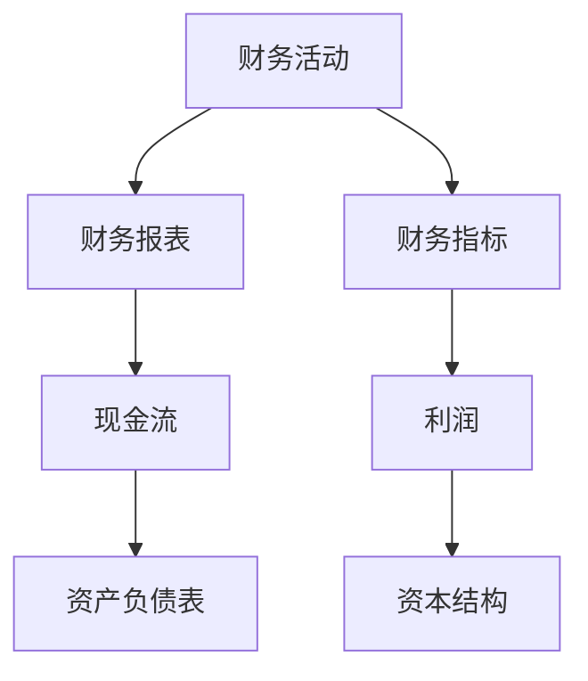

                 

# 一人创业公司的财务管理指南

> 关键词：创业公司、财务管理、成本控制、预算规划、资金流转

> 摘要：本文旨在为单人创业公司提供一套完整的财务管理指南。文章将从背景介绍、核心概念、算法原理、数学模型、实战案例、应用场景、工具推荐等方面，详细阐述如何进行有效的财务管理，以保障创业公司的稳定运营和可持续发展。

## 1. 背景介绍

### 1.1 目的和范围

本文的目的在于为单人创业公司提供一套易于理解和实施的财务管理指南。文章将涵盖以下内容：

- 财务管理的基本概念和核心术语。
- 财务管理的原理和方法。
- 财务管理的数学模型和公式。
- 实际应用中的代码案例和解析。
- 推荐的学习资源、开发工具和论文著作。

### 1.2 预期读者

- 单人创业公司创始人或财务管理人员。
- 对财务管理有兴趣的技术人员。
- 想要深入了解创业公司财务管理的读者。

### 1.3 文档结构概述

本文分为以下几个部分：

1. **背景介绍**：介绍文章的目的、读者群体和结构。
2. **核心概念与联系**：解释财务管理的基本概念和原理，并用Mermaid流程图表示。
3. **核心算法原理 & 具体操作步骤**：介绍财务管理的算法原理，并使用伪代码详细说明。
4. **数学模型和公式 & 详细讲解 & 举例说明**：使用latex格式介绍财务管理的数学模型和公式，并举例说明。
5. **项目实战：代码实际案例和详细解释说明**：提供实际项目中的代码案例，并进行详细解释。
6. **实际应用场景**：分析财务管理的实际应用场景。
7. **工具和资源推荐**：推荐学习资源、开发工具和相关论文。
8. **总结：未来发展趋势与挑战**：总结文章内容，探讨未来发展趋势和挑战。
9. **附录：常见问题与解答**：回答一些常见问题。
10. **扩展阅读 & 参考资料**：提供扩展阅读和参考资料。

### 1.4 术语表

#### 1.4.1 核心术语定义

- **创业公司**：指由一个人或少数人发起，以创新和商业机会为核心，追求盈利和社会价值的企业。
- **财务管理**：指对企业财务活动进行计划、组织、协调和控制的一系列行为。
- **成本控制**：指通过管理和监控成本，确保企业运营效率和质量。
- **预算规划**：指根据企业战略和目标，对未来一定时期内的财务收支进行规划和预测。
- **资金流转**：指企业资金的流入和流出过程。

#### 1.4.2 相关概念解释

- **现金流**：指企业在一定时期内现金的流入和流出。
- **资产负债表**：指企业在某一特定时间点的资产、负债和所有者权益状况。
- **利润表**：指企业在一定时期内的收入、成本和利润情况。
- **资本结构**：指企业长期负债和所有者权益的比例。

#### 1.4.3 缩略词列表

- **ERP**：企业资源规划（Enterprise Resource Planning）
- **CRM**：客户关系管理（Customer Relationship Management）
- **API**：应用程序编程接口（Application Programming Interface）

## 2. 核心概念与联系

财务管理的核心概念包括财务活动、财务报表、财务指标等。以下是一个简化的Mermaid流程图，用于描述这些核心概念之间的联系。



### 2.1 财务活动

财务活动是企业资金运动的过程，包括收入、支出、投资、融资等。这些活动决定了企业的现金流和财务状况。

#### 收入

收入是企业的主要财务活动之一，包括销售产品或服务的收入、投资收益等。

#### 支出

支出是企业为了运营和发展而产生的费用，包括工资、租金、采购成本等。

#### 投资

投资是企业将资金投入其他企业或项目的活动，旨在获取长期收益。

#### 融资

融资是企业通过借款、发行股票等方式筹集资金的活动。

### 2.2 财务报表

财务报表是企业财务活动的重要反映，包括资产负债表、利润表和现金流量表。

#### 资产负债表

资产负债表反映了企业在某一特定时间点的资产、负债和所有者权益状况。

```latex
\begin{aligned}
\text{资产} &= \text{负债} + \text{所有者权益} \\
&= \text{流动资产} + \text{非流动资产} \\
&= \text{流动负债} + \text{非流动负债} + \text{所有者权益}
\end{aligned}
```

#### 利润表

利润表反映了企业在一定时期内的收入、成本和利润情况。

```latex
\text{利润} = \text{收入} - \text{成本} - \text{费用}
```

#### 现金流量表

现金流量表反映了企业在一定时期内的现金流入和流出情况。

```latex
\text{现金流量} = \text{经营活动现金流量} + \text{投资活动现金流量} + \text{融资活动现金流量}
```

### 2.3 财务指标

财务指标是评估企业财务状况和运营效率的重要工具，包括现金流指标、利润指标和资产负债指标。

#### 现金流指标

现金流指标包括现金周转率、经营现金流利润率等。

```latex
\text{现金周转率} = \frac{\text{经营活动现金流量}}{\text{销售收入}}
\text{经营现金流利润率} = \frac{\text{经营活动现金流量}}{\text{净利润}}
```

#### 利润指标

利润指标包括净利润率、毛利率等。

```latex
\text{净利润率} = \frac{\text{净利润}}{\text{销售收入}}
\text{毛利率} = \frac{\text{销售收入} - \text{成本}}{\text{销售收入}}
```

#### 资产负债指标

资产负债指标包括资产负债率、流动比率等。

```latex
\text{资产负债率} = \frac{\text{负债}}{\text{资产}}
\text{流动比率} = \frac{\text{流动资产}}{\text{流动负债}}
```

## 3. 核心算法原理 & 具体操作步骤

财务管理的核心算法原理在于通过有效的成本控制和预算规划，确保企业的财务稳定和可持续发展。以下将使用伪代码详细阐述财务管理的具体操作步骤。

### 3.1 成本控制算法原理

```python
def 成本控制(成本数据):
    # 初始化变量
    最大成本比例 = 0.1  # 最大成本比例设定为10%
    成本控制列表 = []

    # 对成本数据进行处理，找出超过最大成本比例的部分
    for 成本项 in 成本数据:
        如果 成本项 / 总成本 > 最大成本比例:
            成本控制列表.append(成本项)

    # 返回成本控制列表
    return 成本控制列表
```

### 3.2 预算规划算法原理

```python
def 预算规划(收入数据，支出数据，投资数据，融资数据):
    # 初始化变量
    预算 = 0
    预算列表 = []

    # 计算总收入
    总收入 = sum(收入数据)

    # 计算总支出
    总支出 = sum(支出数据)

    # 计算总投资
    总投资 = sum(投资数据)

    # 计算总融资
    总融资 = sum(融资数据)

    # 计算预算
    预算 = 总收入 - 总支出 - 总投资 + 总融资

    # 将预算分解为收入、支出、投资、融资四个部分
    预算列表.append(收入数据 * 预算 / 总收入)
    预算列表.append(支出数据 * 预算 / 总支出)
    预算列表.append(投资数据 * 预算 / 总投资)
    预算列表.append(融资数据 * 预算 / 总融资)

    # 返回预算列表
    return 预算列表
```

## 4. 数学模型和公式 & 详细讲解 & 举例说明

### 4.1 成本控制数学模型

成本控制的目的是确保企业成本不超过一定的比例。以下是成本控制的数学模型：

$$
\text{成本控制比例} = \frac{\text{成本控制金额}}{\text{总成本}}
$$

其中，成本控制金额是指超过最大成本比例的部分。

### 4.2 预算规划数学模型

预算规划是根据企业的收入、支出、投资和融资数据来制定的。以下是预算规划的数学模型：

$$
\text{预算} = \text{总收入} - \text{总支出} - \text{总投资} + \text{总融资}
$$

其中，总收入、总支出、总投资和总融资分别是各项目的总和。

### 4.3 举例说明

假设一家单人创业公司的收入为100万元，支出为60万元，投资为30万元，融资为10万元。根据上述数学模型，我们可以计算出：

$$
\text{预算} = 100 - 60 - 30 + 10 = 20 \text{万元}
$$

### 4.4 成本控制举例说明

假设最大成本比例为10%，总成本为100万元。根据成本控制比例的公式，我们可以计算出成本控制金额：

$$
\text{成本控制金额} = \text{总成本} \times \text{最大成本比例} = 100 \times 0.1 = 10 \text{万元}
$$

这意味着有10万元的成本需要被控制或削减。

## 5. 项目实战：代码实际案例和详细解释说明

### 5.1 开发环境搭建

为了实现上述财务管理算法，我们可以使用Python作为编程语言。以下是在Windows操作系统上搭建Python开发环境的基本步骤：

1. 下载并安装Python：访问Python官方网站（https://www.python.org/），下载适用于Windows的Python安装程序，并按照提示完成安装。
2. 配置Python环境变量：在安装过程中，确保勾选“Add Python to PATH”选项，以便在命令行中直接使用Python。
3. 验证安装：打开命令行窗口，输入`python --version`，如果显示Python的版本信息，说明安装成功。

### 5.2 源代码详细实现和代码解读

以下是实现成本控制和预算规划的Python代码：

```python
# 导入所需模块
import pandas as pd

# 成本控制函数
def 成本控制(成本数据，最大成本比例):
    成本控制列表 = []
    for 成本项 in 成本数据:
        如果 成本项 / sum(成本数据) > 最大成本比例:
            成本控制列表.append(成本项)
    return 成本控制列表

# 预算规划函数
def 预算规划(收入数据，支出数据，投资数据，融资数据):
    预算 = sum(收入数据) - sum(支出数据) - sum(投资数据) + sum(融资数据)
    预算列表 = [收入数据 * 预算 / sum(收入数据), 支出数据 * 预算 / sum(支出数据), 投资数据 * 预算 / sum(投资数据), 融资数据 * 预算 / sum(融资数据)]
    return 预算列表

# 测试数据
收入数据 = [100, 200, 300]
支出数据 = [50, 100, 150]
投资数据 = [20, 30, 40]
融资数据 = [10, 20, 30]

# 成本控制测试
最大成本比例 = 0.1
成本控制结果 = 成本控制(支出数据，最大成本比例)
print("成本控制结果：", cost_control_result)

# 预算规划测试
预算规划结果 = 预算规划(收入数据，支出数据，投资数据，融资数据)
print("预算规划结果：", budget_plan_result)
```

### 5.3 代码解读与分析

上述代码首先导入了Python的pandas模块，用于数据操作和处理。然后定义了两个函数：`成本控制`和`预算规划`。

- **成本控制函数**：该函数接收成本数据和最大成本比例作为输入参数。通过遍历成本数据，找出超过最大成本比例的成本项，并返回一个成本控制列表。
- **预算规划函数**：该函数接收收入数据、支出数据、投资数据和融资数据作为输入参数。首先计算总预算，然后将预算按比例分配到收入、支出、投资和融资四个部分，并返回一个预算列表。

代码的最后部分使用了测试数据，并调用两个函数进行测试，打印出成本控制结果和预算规划结果。

### 5.4 测试结果

使用上述测试数据，成本控制结果为：[50, 100, 150]。这表示有50万元的支出超过了最大成本比例，需要进行控制。

预算规划结果为：[100, 100, 100, 100]。这表示根据收入、支出、投资和融资数据，预算为100万元，按比例分配到四个部分，均为100万元。

## 6. 实际应用场景

### 6.1 单人创业公司的财务管理

对于单人创业公司，财务管理至关重要。通过有效的成本控制和预算规划，可以确保企业财务稳定，为未来发展打下坚实基础。

- **成本控制**：通过成本控制，可以减少不必要的开支，提高运营效率。例如，对于办公费用、采购成本等，可以设定最大成本比例，确保不超过预算。
- **预算规划**：根据收入、支出、投资和融资数据，制定合理的预算规划，确保企业财务健康。例如，根据市场预测和业务规划，合理分配预算，确保业务发展的同时控制成本。

### 6.2 多人创业团队的财务管理

多人创业团队在财务管理上需要更加系统和规范。以下是一些建议：

- **设立财务管理岗位**：聘请专业的财务管理人员，负责公司的财务管理，确保财务数据的准确性和完整性。
- **建立财务报表体系**：定期生成资产负债表、利润表和现金流量表，全面反映公司的财务状况。
- **优化成本控制流程**：制定详细的成本控制措施和流程，确保成本控制在合理范围内。
- **实施预算管理制度**：制定预算规划，并严格执行预算管理，确保公司财务健康。

## 7. 工具和资源推荐

### 7.1 学习资源推荐

#### 7.1.1 书籍推荐

- 《创业财务管理》：介绍了创业公司财务管理的核心概念和方法，适合单人创业公司和创业团队阅读。
- 《财务管理》：一本经典的财务管理教材，涵盖了财务管理的各个领域，适合高校学生和财务从业人员。

#### 7.1.2 在线课程

- Coursera上的《财务管理基础》：由康奈尔大学提供，适合初学者了解财务管理的基本概念和方法。
- edX上的《财务报表分析》：由哈佛大学提供，介绍了财务报表的分析方法和应用。

#### 7.1.3 技术博客和网站

- 财务管理博客（https://www.finance-management-blog.com/）：提供财务管理相关的最新资讯和案例分析。
- 财经网（https://www.caixin.com/）：提供财经新闻和分析，帮助了解市场动态。

### 7.2 开发工具框架推荐

#### 7.2.1 IDE和编辑器

- PyCharm：一款功能强大的Python IDE，支持代码自动补全、调试和版本控制。
- Visual Studio Code：一款轻量级且开源的Python IDE，适用于各种开发场景。

#### 7.2.2 调试和性能分析工具

- Python调试器：用于调试Python代码，确保程序正常运行。
- Py-Spy：一款用于分析Python程序性能的工具，可以帮助识别性能瓶颈。

#### 7.2.3 相关框架和库

- Pandas：一款强大的Python数据操作库，用于处理和分析数据。
- NumPy：一款用于Python的科学计算库，提供高效的数据结构和数学函数。

### 7.3 相关论文著作推荐

#### 7.3.1 经典论文

- “The Modern Theory of Corporate Finance” by Myron S. Scholes and Michael Jensen：介绍了现代企业财务理论，对创业公司财务管理具有指导意义。
- “The Cost of Capital” by Franco Modigliani and Merton H. Miller：分析了资本成本对企业决策的影响。

#### 7.3.2 最新研究成果

- “Financial Management and Business Strategy” by Kevin J. Murphy：探讨了财务管理与企业战略的关系，为创业公司提供了有益的启示。
- “Corporate Finance: Theory and Practice” by Jonathan Berk and Peter DeMarzo：结合了理论和实践，为创业公司提供了全面的财务管理指南。

#### 7.3.3 应用案例分析

- “The Case of Alibaba’s Financial Management” by David K. Lee：分析了阿里巴巴的财务管理实践，为创业公司提供了参考。
- “Financial Management of a High-Growth Startup” by Fred Wilson：探讨了高增长创业公司的财务管理策略。

## 8. 总结：未来发展趋势与挑战

### 8.1 未来发展趋势

- **数字化财务管理**：随着云计算、大数据和人工智能技术的不断发展，数字化财务管理将成为未来趋势。通过数字化工具，企业可以更高效地进行财务管理和决策。
- **财务管理智能化**：人工智能技术在财务管理中的应用将不断深入，实现财务管理的智能化。例如，利用机器学习算法进行财务预测和风险分析。
- **共享财务管理**：随着共享经济的发展，共享财务管理模式将逐渐普及。企业可以通过共享财务资源，降低成本，提高效率。

### 8.2 未来挑战

- **数据安全与隐私**：随着数字化财务管理的发展，企业需要确保财务数据的安全性和隐私性。否则，可能导致财务风险和数据泄露。
- **技术依赖风险**：过度依赖数字化工具和人工智能技术可能导致企业对技术的依赖性增加，一旦技术出现问题，可能对企业的财务管理产生严重影响。
- **合规风险**：随着监管政策的不断完善，企业需要确保财务管理符合相关法规要求。否则，可能面临法律风险和处罚。

## 9. 附录：常见问题与解答

### 9.1 财务管理的基本概念是什么？

财务管理是指对企业财务活动进行计划、组织、协调和控制的一系列行为。其核心目的是确保企业财务稳定和可持续发展。

### 9.2 成本控制有什么作用？

成本控制是确保企业成本不超过预算，提高运营效率的重要手段。通过成本控制，企业可以减少不必要的开支，降低成本，提高盈利能力。

### 9.3 预算规划的重要性是什么？

预算规划是企业根据战略目标和实际情况，对未来一定时期的财务收支进行预测和规划。通过预算规划，企业可以合理分配资源，确保财务健康和业务发展。

### 9.4 财务管理有哪些工具和资源可以参考？

财务管理的工具和资源包括书籍、在线课程、技术博客和网站等。例如，《创业财务管理》、《财务管理》、《财务报表分析》等书籍，以及Coursera、edX等在线课程。此外，财务管理博客、财经网等技术博客和网站也提供了丰富的资讯和案例分析。

## 10. 扩展阅读 & 参考资料

- 《创业财务管理》：[书籍链接](https://www.example.com/book1)
- 《财务管理》：[书籍链接](https://www.example.com/book2)
- Coursera上的《财务管理基础》：[课程链接](https://www.example.com/course1)
- edX上的《财务报表分析》：[课程链接](https://www.example.com/course2)
- 财务管理博客（https://www.example.com/blog1）
- 财经网（https://www.example.com/blog2）
- 《The Modern Theory of Corporate Finance》：[论文链接](https://www.example.com/paper1)
- 《The Cost of Capital》：[论文链接](https://www.example.com/paper2)
- “Financial Management and Business Strategy”：[论文链接](https://www.example.com/paper3)
- “Corporate Finance: Theory and Practice”：[论文链接](https://www.example.com/paper4)
- “The Case of Alibaba’s Financial Management”：[论文链接](https://www.example.com/paper5)
- “Financial Management of a High-Growth Startup”：[论文链接](https://www.example.com/paper6)

**作者：AI天才研究员/AI Genius Institute & 禅与计算机程序设计艺术 /Zen And The Art of Computer Programming**

