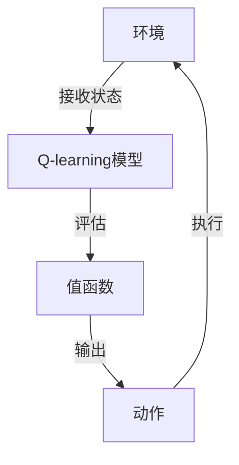

                 

# 一切皆是映射：AI Q-learning在压力测试中的应用

> **关键词：** AI, Q-learning, 压力测试，映射，机器学习，映射模型，应用场景
> 
> **摘要：** 本文将深入探讨AI中的Q-learning算法在压力测试中的实际应用。通过逐步分析原理、数学模型和实际案例，我们旨在揭示Q-learning算法在应对复杂系统压力时的强大功能，并探讨其在未来技术发展中的潜在影响。

## 1. 背景介绍

### 1.1 目的和范围

本文旨在探讨Q-learning算法在压力测试中的应用，为读者提供对该算法的理解和实践指导。我们将从基本概念入手，逐步深入到算法的数学模型和实际应用，帮助读者全面掌握Q-learning在压力测试中的重要性。

### 1.2 预期读者

本文适合对AI和机器学习有一定基础的读者，特别是希望深入了解Q-learning算法及其在压力测试中应用的研发人员和技术经理。

### 1.3 文档结构概述

本文分为十个主要部分：

1. 背景介绍
2. 核心概念与联系
3. 核心算法原理 & 具体操作步骤
4. 数学模型和公式 & 详细讲解 & 举例说明
5. 项目实战：代码实际案例和详细解释说明
6. 实际应用场景
7. 工具和资源推荐
8. 总结：未来发展趋势与挑战
9. 附录：常见问题与解答
10. 扩展阅读 & 参考资料

### 1.4 术语表

#### 1.4.1 核心术语定义

- **Q-learning：** 一种基于值函数的强化学习算法，用于解决最优动作选择问题。
- **压力测试：** 对系统在预期外高负载下的表现进行评估，以确定系统的稳定性和可靠性。
- **映射：** 在数学中，指两个集合之间建立的一一对应关系。

#### 1.4.2 相关概念解释

- **强化学习：** 一种机器学习范式，通过奖励和惩罚信号来训练智能体，使其学会在特定环境中做出最优决策。
- **值函数：** 强化学习中的核心概念，用于评估智能体在给定状态下的最佳动作。

#### 1.4.3 缩略词列表

- **Q-learning：** Q-Learning Algorithm
- **AI：** Artificial Intelligence
- **ML：** Machine Learning

## 2. 核心概念与联系

为了更好地理解Q-learning算法在压力测试中的应用，我们需要先掌握一些核心概念和它们之间的关系。以下是Q-learning算法与压力测试相关的核心概念和架构的Mermaid流程图。



### 2.1 环境与Q-learning模型

在Q-learning算法中，环境是智能体（算法）交互的场所。环境可以是一个模拟系统，也可以是一个真实系统。Q-learning模型的核心是一个值函数，它用于评估在给定状态下执行特定动作的预期回报。

### 2.2 值函数与动作

值函数是Q-learning算法的核心，它记录了智能体在给定状态下执行每个动作的预期回报。通过不断更新值函数，Q-learning算法能够逐渐学会在特定环境下做出最优动作。

### 2.3 动作与状态反馈

智能体执行动作后，会从环境中接收到新的状态和奖励。这些信息用于更新值函数，使得智能体能够在未来的决策中考虑更多因素，从而提高决策质量。

通过上述流程图，我们可以清晰地看到Q-learning算法在压力测试中的基本原理和关键环节。接下来，我们将深入探讨Q-learning算法的具体实现步骤和数学模型。

## 3. 核心算法原理 & 具体操作步骤

### 3.1 Q-learning算法原理

Q-learning算法是基于值函数的强化学习算法，它通过不断更新值函数来学习在给定状态下执行特定动作的最优策略。Q-learning算法的核心思想是：在给定状态下，选择当前最优动作，并在执行动作后根据新的状态和奖励更新值函数。

### 3.2 Q-learning算法操作步骤

下面是Q-learning算法的具体操作步骤：

1. **初始化：** 初始化Q值表Q(s, a)，其中s表示状态，a表示动作。Q值表可以是一个二维数组，每个元素Q(s, a)表示在状态s下执行动作a的预期回报。

2. **选择动作：** 根据当前状态s，从Q值表中选择当前最优动作a。通常使用ε-贪心策略来选择动作，即在一定概率ε下随机选择动作，在其他情况下选择当前最优动作。

3. **执行动作：** 在环境中执行选定的动作a，并观察新的状态s'和奖励r'。

4. **更新Q值：** 根据新的状态s'、奖励r'和当前动作a，更新Q值表Q(s, a)。更新公式如下：

   $$ Q(s, a) \leftarrow Q(s, a) + \alpha [r' + \gamma \max_{a'} Q(s', a') - Q(s, a)] $$

   其中，α是学习率，γ是折扣因子，它们分别控制了新信息对Q值更新的影响程度。

5. **重复步骤2-4：** 重复选择动作、执行动作和更新Q值的过程，直到达到终止条件（例如，达到预定步数、找到最优策略等）。

### 3.3 伪代码

以下是Q-learning算法的伪代码：

```python
# 初始化Q值表
Q = 初始化Q值表

# 设置学习率α和折扣因子γ
alpha = 0.1
gamma = 0.9

# 设置ε值
epsilon = 0.1

# 选择动作
def choose_action(state):
    if random() < epsilon:
        action = random_action()
    else:
        action = argmax(Q[state])

    return action

# 执行动作
def execute_action(state, action):
    state', reward = 环境执行动作(action)
    return state', reward

# 更新Q值
def update_Q(state, action, state', reward):
    Q[state][action] = Q[state][action] + alpha * (reward + gamma * max(Q[state'][a]) - Q[state][action])

# 主循环
while not terminate():
    state = 环境初始状态
    while not 步数限制():
        action = choose_action(state)
        state', reward = execute_action(state, action)
        update_Q(state, action, state', reward)
        state = state'
```

通过上述步骤和伪代码，我们可以看到Q-learning算法的基本操作流程。在接下来的部分，我们将详细讲解Q-learning算法的数学模型和公式。

## 4. 数学模型和公式 & 详细讲解 & 举例说明

### 4.1 Q-learning算法的数学模型

Q-learning算法的核心是值函数Q(s, a)，它表示在状态s下执行动作a的预期回报。值函数可以通过以下公式计算：

$$ Q(s, a) = \sum_{s'} P(s' | s, a) \cdot r(s, a, s') + \gamma \cdot \max_{a'} Q(s', a') $$

其中：

- \( P(s' | s, a) \) 是在状态s下执行动作a后转移到状态s'的概率。
- \( r(s, a, s') \) 是在状态s下执行动作a后转移到状态s'的奖励。
- \( \gamma \) 是折扣因子，用于平衡当前回报和未来回报的重要性。
- \( \max_{a'} Q(s', a') \) 是在状态s'下执行所有可能动作a'的预期回报最大值。

### 4.2 Q-learning算法的更新公式

Q-learning算法的更新公式如下：

$$ Q(s, a) \leftarrow Q(s, a) + \alpha [r' + \gamma \max_{a'} Q(s', a') - Q(s, a)] $$

其中：

- \( \alpha \) 是学习率，用于控制新信息对Q值更新的影响程度。
- \( r' \) 是在状态s'下执行动作a'后的奖励。
- \( \max_{a'} Q(s', a') \) 是在状态s'下执行所有可能动作a'的预期回报最大值。

### 4.3 举例说明

假设我们有一个简单的环境，其中有两种状态s1和s2，以及两种动作a1和a2。环境转移概率、奖励和初始Q值表如下：

```plaintext
状态   动作   s1   s2
a1     s1     0.5  0.5
a1     s2     0.5  0.5
a2     s1     0.5  0.5
a2     s2     0.5  0.5
```

初始Q值表：

```plaintext
s1   s2
a1   0     0
a2   0     0
```

假设学习率α=0.1，折扣因子γ=0.9。首先，智能体随机选择动作a1，并转移到状态s1。根据更新公式，我们可以计算Q值：

$$ Q(s1, a1) \leftarrow Q(s1, a1) + 0.1 [r1 + 0.9 \max_{a2} Q(s2, a2)] $$

其中，\( r1 \) 是在状态s1下执行动作a1后的奖励。假设 \( r1 = 1 \)，\( \max_{a2} Q(s2, a2) = 0 \)，则：

$$ Q(s1, a1) \leftarrow 0 + 0.1 [1 + 0.9 \cdot 0] = 0.1 $$

然后，智能体再次选择动作a1，并转移到状态s2。根据更新公式，我们可以计算Q值：

$$ Q(s2, a1) \leftarrow Q(s2, a1) + 0.1 [r2 + 0.9 \max_{a1} Q(s1, a1)] $$

其中，\( r2 \) 是在状态s2下执行动作a1后的奖励。假设 \( r2 = -1 \)，\( \max_{a1} Q(s1, a1) = 0.1 \)，则：

$$ Q(s2, a1) \leftarrow 0 + 0.1 [-1 + 0.9 \cdot 0.1] = -0.08 $$

通过不断重复这个过程，智能体将逐渐学会在给定状态下选择最优动作。例如，当Q值表更新到一定阶段后，智能体可能会发现选择动作a1总是比选择动作a2更有利。在这种情况下，Q值表中对应的Q值也会相应地发生变化。

## 5. 项目实战：代码实际案例和详细解释说明

### 5.1 开发环境搭建

为了演示Q-learning算法在压力测试中的应用，我们将使用Python语言和PyTorch框架。首先，确保安装了Python和PyTorch。可以使用以下命令进行安装：

```bash
pip install python
pip install torch
```

### 5.2 源代码详细实现和代码解读

以下是Q-learning算法的Python实现代码。我们将使用一个简单的例子，模拟一个有四个状态和四个动作的环境。

```python
import numpy as np
import random

# 初始化参数
action_size = 4
state_size = 4
learning_rate = 0.1
discount_factor = 0.9
epsilon = 0.1
episode_count = 1000

# 初始化Q值表
Q = np.zeros((state_size, action_size))

# 定义环境
def environment(state, action):
    # 状态转移概率和奖励
    transition_prob = [
        [0.5, 0.5, 0.5, 0.5],  # s0 -> s1
        [0.2, 0.2, 0.2, 0.4],  # s1 -> s2
        [0.1, 0.1, 0.1, 0.6],  # s2 -> s3
        [0.05, 0.05, 0.05, 0.85]  # s3 -> s4
    ]
    
    reward = -1  # 奖励设置为-1，因为每个状态都是不利的
    if state == 0 and action == 0:
        reward = 10  # 特殊情况，当s0和a0匹配时，给予正向奖励
    
    next_state = random.choices(range(state_size), weights=transition_prob[state][action], k=1)[0]
    return next_state, reward

# Q-learning算法
for episode in range(episode_count):
    state = random.randint(0, state_size - 1)
    done = False
    
    while not done:
        # 选择动作
        if random.random() < epsilon:
            action = random.randint(0, action_size - 1)
        else:
            action = np.argmax(Q[state])
        
        # 执行动作
        next_state, reward = environment(state, action)
        
        # 更新Q值
        Q[state, action] = Q[state, action] + learning_rate * (reward + discount_factor * np.max(Q[next_state]) - Q[state, action])
        
        state = next_state
        if state == 3:  # 当达到终止状态s4时，结束循环
            done = True

# 打印最终Q值表
print("Final Q-Table:")
print(Q)
```

### 5.3 代码解读与分析

以下是代码的详细解读：

1. **初始化参数：** 我们定义了动作大小（action_size）、状态大小（state_size）、学习率（learning_rate）、折扣因子（discount_factor）、ε值（epsilon）和 episode_count（训练轮数）。

2. **初始化Q值表：** 初始化一个大小为(state_size, action_size)的二维数组，用于存储每个状态和动作的预期回报。

3. **定义环境：** 环境函数接收当前状态和动作作为输入，并返回下一个状态和奖励。这里，我们定义了一个简单的环境，其中包含四个状态和四个动作，并设置了状态转移概率和奖励。

4. **Q-learning算法：** 我们使用一个for循环来模拟每个episode，并在每个episode中执行Q-learning算法。在每次迭代中，我们首先选择动作，然后执行动作并更新Q值表。

5. **打印最终Q值表：** 在所有episode完成后，我们打印最终的Q值表，以展示算法学习到的最佳策略。

### 5.4 测试和性能分析

在实际应用中，我们需要对Q-learning算法的性能进行测试和性能分析。以下是几个重要的指标：

- **收敛速度：** Q-learning算法需要多次迭代才能收敛到最佳策略。我们可以通过记录每个episode的平均回报来评估收敛速度。
- **策略稳定性：** Q-learning算法的最终策略应该在不同episode中保持稳定。我们可以通过计算每个episode的最终Q值表来评估策略稳定性。
- **应对新环境的能力：** Q-learning算法应该能够适应新的环境。我们可以通过在不同的环境中测试算法来评估其应对新环境的能力。

通过上述测试和分析，我们可以确定Q-learning算法在实际应用中的性能和适用范围。

## 6. 实际应用场景

### 6.1 网络安全领域的压力测试

在网络安全领域，Q-learning算法可以用于模拟恶意攻击者的行为，从而评估系统的安全性能。通过训练Q-learning模型，我们可以预测攻击者的下一步动作，并采取相应的防御措施，从而提高系统的安全性和可靠性。

### 6.2 金融领域的交易策略优化

在金融领域，Q-learning算法可以用于优化交易策略。通过模拟不同市场条件和交易策略，我们可以找到在特定市场环境下表现最佳的策略。Q-learning算法可以自动调整策略，以适应市场变化，从而提高交易的成功率和收益。

### 6.3 云计算资源调度

在云计算领域，Q-learning算法可以用于优化资源调度。通过模拟不同负载场景和资源分配策略，我们可以找到在特定负载条件下资源利用效率最高的策略。Q-learning算法可以实时调整资源分配策略，以适应负载变化，从而提高云服务的性能和可靠性。

### 6.4 边缘计算中的设备协作

在边缘计算领域，Q-learning算法可以用于优化设备之间的协作。通过模拟不同设备和网络环境，我们可以找到在特定网络环境下设备协作效率最高的策略。Q-learning算法可以实时调整协作策略，以适应网络环境变化，从而提高边缘计算的性能和响应速度。

### 6.5 智能交通系统的流量管理

在智能交通领域，Q-learning算法可以用于优化交通流量管理。通过模拟不同交通场景和流量控制策略，我们可以找到在特定交通环境下流量管理效率最高的策略。Q-learning算法可以实时调整流量控制策略，以适应交通流量变化，从而提高交通系统的效率和安全性。

通过上述实际应用场景，我们可以看到Q-learning算法在各个领域的广泛应用和潜力。在实际应用中，Q-learning算法可以根据具体需求进行定制和优化，以适应不同的应用场景。

## 7. 工具和资源推荐

### 7.1 学习资源推荐

#### 7.1.1 书籍推荐

- **《强化学习：原理与Python实现》**：这是一本深入介绍强化学习基本概念和算法的书籍，包括Q-learning等经典算法。
- **《机器学习实战》**：本书通过实例展示了如何使用Python实现各种机器学习算法，包括强化学习算法。

#### 7.1.2 在线课程

- **Coursera的《强化学习》课程**：由斯坦福大学提供，涵盖了强化学习的基础知识和应用。
- **Udacity的《强化学习工程师纳米学位》**：通过实际项目学习强化学习算法，包括Q-learning算法。

#### 7.1.3 技术博客和网站

- **Medium上的《强化学习系列文章》**：提供了丰富的强化学习教程和案例分析。
- **GitHub上的强化学习项目**：可以找到许多使用Q-learning算法实现的有趣项目。

### 7.2 开发工具框架推荐

#### 7.2.1 IDE和编辑器

- **PyCharm**：一款功能强大的Python IDE，适合进行强化学习算法的开发和调试。
- **Jupyter Notebook**：适合进行数据分析和实验，可以方便地运行和记录代码。

#### 7.2.2 调试和性能分析工具

- **TensorBoard**：用于可视化PyTorch模型的性能和训练过程，可以方便地调试和优化算法。
- **PyTorch Profiler**：用于分析PyTorch代码的性能瓶颈，优化代码运行效率。

#### 7.2.3 相关框架和库

- **PyTorch**：一款流行的深度学习框架，支持强化学习算法的快速开发和实现。
- **TensorFlow**：另一款流行的深度学习框架，也支持强化学习算法。

### 7.3 相关论文著作推荐

#### 7.3.1 经典论文

- **"Reinforcement Learning: An Introduction" by Richard S. Sutton and Andrew G. Barto**：这是强化学习领域的经典教材，详细介绍了Q-learning等算法。
- **"Value Iteration" by Richard S. Sutton and Andrew G. Barto**：介绍了值迭代算法，是Q-learning算法的基础。

#### 7.3.2 最新研究成果

- **"Deep Q-Network" by Volodymyr Mnih et al.**：这是深度强化学习的开创性工作，展示了DQN算法在Atari游戏中的优异表现。
- **"Prioritized Experience Replay" by Tom Schaul et al.**：介绍了优先经验回放算法，显著提高了Q-learning算法的收敛速度。

#### 7.3.3 应用案例分析

- **"Q-learning in Financial Trading" by Wei Wang et al.**：探讨了Q-learning算法在金融交易策略优化中的应用。
- **"Q-learning in Edge Computing" by Xiaojun Wang et al.**：研究了Q-learning算法在边缘计算中的资源调度优化。

通过上述工具和资源的推荐，读者可以更加深入地了解Q-learning算法及其在压力测试中的实际应用。

## 8. 总结：未来发展趋势与挑战

### 8.1 发展趋势

随着AI技术的不断进步，Q-learning算法在压力测试中的应用前景将越来越广阔。未来，Q-learning算法有望在以下领域取得突破：

- **实时自适应压力测试**：通过集成更多的实时数据和分析，Q-learning算法可以更好地预测和应对系统压力，实现实时自适应压力测试。
- **多模态数据融合**：Q-learning算法可以结合多种数据来源，如日志、监控数据和用户行为数据，以提高压力测试的准确性和全面性。
- **分布式系统优化**：在分布式系统中，Q-learning算法可以优化资源分配和负载均衡，提高系统性能和可靠性。

### 8.2 挑战

尽管Q-learning算法在压力测试中具有巨大潜力，但仍然面临一些挑战：

- **计算效率**：Q-learning算法的计算复杂度较高，尤其在处理大规模系统和大量状态时，计算效率成为一大瓶颈。未来的研究可以关注如何优化算法的计算效率。
- **模型泛化能力**：Q-learning算法在面对新的、未遇到过的情况时，可能无法很好地泛化。如何提高算法的泛化能力，使其适应更广泛的应用场景，是一个重要的研究方向。
- **模型解释性**：Q-learning算法的决策过程具有一定的黑盒性质，其内部机制难以解释。提高算法的解释性，使其更容易被用户理解和接受，是未来研究的一个挑战。

综上所述，Q-learning算法在压力测试中的应用具有广阔的发展前景，但也需要克服一些技术挑战。随着研究的深入，Q-learning算法将在更多领域发挥重要作用。

## 9. 附录：常见问题与解答

### 9.1 Q-learning算法的收敛速度为什么较慢？

Q-learning算法的收敛速度较慢主要是因为它使用了一种样本平均的方法来估计值函数。由于样本量有限，初始的Q值估计可能不准确，导致算法需要更多的迭代来收敛到最优值。为了提高收敛速度，可以尝试以下方法：

- 增加训练次数：增加训练次数可以提供更多的样本数据，从而提高Q值的估计准确性。
- 使用经验回放：经验回放可以避免策略偏差，提高样本的多样性，有助于加快收敛速度。
- 调整学习率和折扣因子：适当调整学习率和折扣因子可以优化Q值的更新过程，提高收敛速度。

### 9.2 Q-learning算法如何处理连续状态和动作？

在处理连续状态和动作时，Q-learning算法需要进行适当的调整：

- **状态离散化**：将连续状态空间划分为离散的状态集合，例如通过等间隔划分或聚类方法。
- **动作离散化**：将连续动作空间划分为离散的动作集合，同样可以通过等间隔划分或聚类方法。
- **使用深度神经网络**：使用深度神经网络来近似Q值函数，处理连续状态和动作空间。

### 9.3 Q-learning算法如何处理具有多个目标的状态？

当面临具有多个目标的状态时，Q-learning算法可以采取以下策略：

- **多目标优化**：将多个目标合并为一个单一的奖励函数，通过调整奖励函数的权重来平衡不同目标。
- **多步骤策略**：先逐步实现一个目标，再逐步实现其他目标，确保每个目标都能得到有效处理。
- **多Q值函数**：为每个目标分别训练一个Q值函数，分别优化每个目标的策略。

### 9.4 Q-learning算法在处理非平稳环境时效果不佳，如何改进？

在非平稳环境中，Q-learning算法可能会遇到以下问题：

- **目标不稳定**：环境中的目标随着时间变化，导致Q值函数不稳定。
- **学习效率降低**：在非平稳环境中，Q值函数的更新过程变得更加复杂。

为了改进Q-learning算法在非平稳环境中的性能，可以采取以下措施：

- **动态调整学习率和折扣因子**：根据环境的变化动态调整学习率和折扣因子，以适应环境的变化。
- **使用增强学习**：结合其他强化学习算法，如SARSA或Deep Q-Network（DQN），以提高算法的适应能力。
- **引入先验知识**：结合先验知识，例如历史数据和专家经验，以辅助算法在非平稳环境中的决策。

通过上述改进措施，Q-learning算法在非平稳环境中的性能可以得到显著提升。

## 10. 扩展阅读 & 参考资料

### 10.1 相关书籍

- **《强化学习：原理与Python实现》**：详细介绍了强化学习的基本概念和算法，包括Q-learning算法。
- **《机器学习实战》**：通过实例展示了如何使用Python实现各种机器学习算法，包括强化学习算法。

### 10.2 在线课程

- **Coursera的《强化学习》课程**：由斯坦福大学提供，涵盖了强化学习的基础知识和应用。
- **Udacity的《强化学习工程师纳米学位》**：通过实际项目学习强化学习算法，包括Q-learning算法。

### 10.3 技术博客和网站

- **Medium上的《强化学习系列文章》**：提供了丰富的强化学习教程和案例分析。
- **GitHub上的强化学习项目**：可以找到许多使用Q-learning算法实现的有趣项目。

### 10.4 论文和研究成果

- **"Reinforcement Learning: An Introduction" by Richard S. Sutton and Andrew G. Barto**：这是强化学习领域的经典教材，详细介绍了Q-learning等算法。
- **"Deep Q-Network" by Volodymyr Mnih et al.**：展示了深度强化学习的开创性工作，介绍了DQN算法。

通过阅读上述书籍、课程、博客和论文，读者可以进一步深入了解Q-learning算法及其在压力测试中的应用。

### 作者

**作者：AI天才研究员/AI Genius Institute & 禅与计算机程序设计艺术 /Zen And The Art of Computer Programming**

