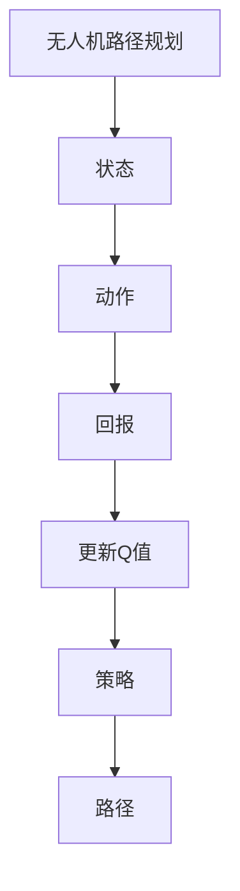

                 

# 一切皆是映射：AI Q-learning在无人机路径规划的应用

> **关键词：** AI、Q-learning、无人机、路径规划、强化学习、映射、智能系统

> **摘要：** 本篇文章将探讨AI中的Q-learning算法在无人机路径规划领域的应用。通过一步步的深入分析，我们不仅会理解Q-learning的基本原理，还会看到它如何在无人机的复杂环境中被有效利用，以达到最优路径规划。我们将结合实际案例，详细解读该算法的实现过程，并展望其在未来的发展趋势与挑战。

## 1. 背景介绍

### 1.1 目的和范围

本文的目的是通过深入探讨Q-learning算法在无人机路径规划中的应用，帮助读者理解这一先进的强化学习技术如何解决实际中的路径规划问题。本文将重点关注以下几个方面：

1. **Q-learning算法的基本原理**：详细介绍Q-learning算法的工作机制、核心思想和主要步骤。
2. **无人机路径规划的需求与挑战**：分析无人机路径规划的特殊要求，以及Q-learning如何克服这些挑战。
3. **具体实现与案例分析**：通过实际项目案例，讲解Q-learning算法在无人机路径规划中的具体应用和实现。
4. **应用前景与挑战**：展望Q-learning算法在无人机路径规划领域的未来发展趋势和面临的挑战。

### 1.2 预期读者

本文适合以下读者群体：

1. **AI与机器学习从业者**：希望了解Q-learning算法在特定应用场景中的实际应用。
2. **无人机研发与操作人员**：对无人机路径规划技术感兴趣，希望深入了解其中的算法原理。
3. **计算机科学学生与研究者**：对强化学习有研究兴趣，希望通过实际案例加深对Q-learning算法的理解。

### 1.3 文档结构概述

本文将按照以下结构展开：

1. **背景介绍**：介绍文章的目的、范围、预期读者和文档结构。
2. **核心概念与联系**：通过Mermaid流程图展示Q-learning算法与无人机路径规划之间的联系。
3. **核心算法原理 & 具体操作步骤**：详细讲解Q-learning算法的原理和操作步骤。
4. **数学模型和公式 & 详细讲解 & 举例说明**：使用数学模型和公式详细解释Q-learning算法。
5. **项目实战：代码实际案例和详细解释说明**：通过实际代码案例说明Q-learning算法的应用。
6. **实际应用场景**：探讨Q-learning算法在无人机路径规划中的实际应用。
7. **工具和资源推荐**：推荐学习资源和开发工具。
8. **总结：未来发展趋势与挑战**：总结Q-learning算法的发展趋势和面临的挑战。
9. **附录：常见问题与解答**：回答读者可能遇到的问题。
10. **扩展阅读 & 参考资料**：提供进一步阅读的资源。

### 1.4 术语表

#### 1.4.1 核心术语定义

- **Q-learning算法**：一种强化学习算法，用于学习在给定状态下采取何种动作可以获得最大回报。
- **无人机**：一种无人驾驶的飞行器，可用于执行多种任务，如监控、运输、搜救等。
- **路径规划**：在未知或动态环境中，确定从起点到终点的最优路径的过程。
- **强化学习**：一种机器学习方法，通过奖励机制来训练智能体（如无人机）完成特定任务。

#### 1.4.2 相关概念解释

- **状态（State）**：无人机在某一时刻所处的环境。
- **动作（Action）**：无人机可以采取的行动，如改变速度、方向等。
- **回报（Reward）**：动作执行后获得的即时反馈，用于评估动作的好坏。
- **策略（Policy）**：基于状态选择最优动作的规则。

#### 1.4.3 缩略词列表

- **Q-learning**：Q-Learning
- **AI**：Artificial Intelligence
- **RL**：Reinforcement Learning
- **UAV**：Unmanned Aerial Vehicle
- **SLAM**：Simultaneous Localization and Mapping

## 2. 核心概念与联系

### 2.1 Q-learning算法与无人机路径规划

Q-learning算法作为一种强化学习算法，其核心在于通过不断尝试和反馈，学习到在特定状态下采取何种动作可以获得最大回报。在无人机路径规划中，Q-learning算法可以被视为一种智能体，通过学习环境中的状态和动作，自动生成最优路径。下面是Q-learning算法与无人机路径规划之间的Mermaid流程图：



### 2.2 Q-learning算法原理

Q-learning算法基于一个Q值函数，该函数表示在某一状态下采取某一动作的预期回报。算法的基本原理如下：

1. **初始化Q值**：初始时，Q值函数为随机值。
2. **选择动作**：在某一状态s下，根据当前策略选择一个动作a。
3. **执行动作**：执行动作a，进入下一状态s'。
4. **计算回报**：根据动作a在状态s'的回报r，更新Q值函数。
5. **更新策略**：根据更新后的Q值函数，更新策略。

Q-learning算法的具体操作步骤将在下一节中详细阐述。

## 3. 核心算法原理 & 具体操作步骤

### 3.1 Q值函数的初始化

在Q-learning算法中，Q值函数用于表示在某一状态下采取某一动作的预期回报。初始化Q值函数是算法的重要步骤，通常有以下两种方法：

1. **随机初始化**：将Q值函数的所有元素初始化为随机值，通常在0到1之间。
2. **基于知识初始化**：根据先验知识或已有经验，对Q值函数进行初始化。例如，在无人机路径规划中，可以基于地图信息初始化Q值函数。

下面是一个简单的伪代码，用于随机初始化Q值函数：

```python
# 初始化Q值函数
Q = random_uniform_matrix(states, actions)
```

其中，`states`表示所有可能的状态集合，`actions`表示所有可能的动作集合，`random_uniform_matrix`函数用于生成一个所有元素都在[0,1]之间的随机矩阵。

### 3.2 选择动作

在Q-learning算法中，选择动作是基于当前策略进行的。策略可以定义为一种从状态到动作的映射，表示在某一状态下应该采取的动作。常见的策略有以下几种：

1. **epsilon-greedy策略**：在某一状态下，以概率`epsilon`随机选择动作，以概率`1-epsilon`选择当前状态下Q值最大的动作。
2. **贪婪策略**：在某一状态下，直接选择当前状态下Q值最大的动作。
3. **确定性策略**：在某一状态下，总是选择当前状态下Q值最大的动作。

下面是一个简单的伪代码，用于实现epsilon-greedy策略：

```python
# 选择动作
def choose_action(state, Q, epsilon):
    if random() < epsilon:
        action = random_action()
    else:
        action = argmax(Q[state, :])
    return action
```

其中，`state`表示当前状态，`Q`表示Q值函数，`epsilon`表示探索概率，`random_action`函数用于随机选择一个动作，`argmax`函数用于选择Q值最大的动作。

### 3.3 执行动作

在Q-learning算法中，执行动作是指根据当前策略选择一个动作，并在环境中进行模拟。执行动作的结果会影响到下一状态和回报。

下面是一个简单的伪代码，用于执行动作：

```python
# 执行动作
def execute_action(action, state):
    next_state, reward = simulate_environment(state, action)
    return next_state, reward
```

其中，`action`表示当前选择的动作，`state`表示当前状态，`simulate_environment`函数用于模拟环境，返回下一状态和回报。

### 3.4 计算回报

在Q-learning算法中，回报是衡量动作好坏的重要指标。回报的计算通常基于环境的状态转移概率和回报函数。

下面是一个简单的伪代码，用于计算回报：

```python
# 计算回报
def calculate_reward(next_state, action, Q, alpha):
    reward = reward_function(next_state, action)
    Q[state, action] += alpha * (reward - Q[state, action])
    return reward
```

其中，`next_state`表示下一状态，`action`表示当前动作，`Q`表示Q值函数，`alpha`表示学习率，`reward_function`函数用于计算回报。

### 3.5 更新Q值函数

在Q-learning算法中，更新Q值函数是核心步骤，通过更新Q值函数，算法可以不断优化策略，从而找到最优路径。

下面是一个简单的伪代码，用于更新Q值函数：

```python
# 更新Q值函数
def update_Q(Q, state, action, next_state, reward, alpha):
    Q[state, action] += alpha * (reward + gamma * max(Q[next_state, :]) - Q[state, action])
```

其中，`Q`表示Q值函数，`state`表示当前状态，`action`表示当前动作，`next_state`表示下一状态，`reward`表示回报，`alpha`表示学习率，`gamma`表示折扣因子。

### 3.6 更新策略

在Q-learning算法中，更新策略是指根据更新后的Q值函数，重新选择动作。更新策略的目的是优化路径规划结果。

下面是一个简单的伪代码，用于更新策略：

```python
# 更新策略
def update_policy(Q):
    for state in states:
        action = argmax(Q[state, :])
        policy[state] = action
```

其中，`Q`表示Q值函数，`states`表示所有可能的状态集合，`policy`表示策略，`argmax`函数用于选择Q值最大的动作。

### 3.7 算法迭代

在Q-learning算法中，迭代是指重复执行选择动作、执行动作、计算回报、更新Q值函数和更新策略等步骤，直到达到停止条件。

下面是一个简单的伪代码，用于实现算法迭代：

```python
# 算法迭代
while not stop_condition:
    state = initial_state
    while not terminal_state:
        action = choose_action(state, Q, epsilon)
        next_state, reward = execute_action(action, state)
        reward = calculate_reward(next_state, action, Q, alpha)
        update_Q(Q, state, action, next_state, reward, alpha)
        state = next_state
    update_policy(Q)
```

其中，`stop_condition`表示停止条件，如达到目标状态或达到最大迭代次数等。

## 4. 数学模型和公式 & 详细讲解 & 举例说明

### 4.1 数学模型

Q-learning算法的核心是Q值函数，该函数用于表示在某一状态下采取某一动作的预期回报。Q值函数的数学模型可以表示为：

$$
Q(s, a) = \sum_{s'} p(s' | s, a) \cdot [r(s', a) + \gamma \cdot \max_{a'} Q(s', a')]
$$

其中，$Q(s, a)$表示在状态s下采取动作a的Q值，$p(s' | s, a)$表示从状态s采取动作a后转移到状态s'的概率，$r(s', a)$表示在状态s'采取动作a的回报，$\gamma$表示折扣因子，用于平衡短期回报和长期回报。

### 4.2 公式详细讲解

#### 4.2.1 状态转移概率

状态转移概率$p(s' | s, a)$表示在当前状态s下采取动作a后，转移到下一状态s'的概率。在无人机路径规划中，状态转移概率通常基于地图信息和飞行器的动态模型计算。例如，假设无人机在状态s的位置为$(x, y)$，速度为$v$，则在下一状态s'的位置为$(x', y')$，可以表示为：

$$
x' = x + v \cdot \cos(\theta) \cdot \Delta t
$$

$$
y' = y + v \cdot \sin(\theta) \cdot \Delta t
$$

其中，$\theta$表示无人机的飞行方向，$\Delta t$表示时间间隔。

#### 4.2.2 起始状态和终止状态

在Q-learning算法中，起始状态和终止状态是关键概念。起始状态表示无人机初始所处的位置，通常由地图信息给出。终止状态表示无人机目标位置，也由地图信息给出。在算法迭代过程中，当无人机到达终止状态时，算法迭代停止。

#### 4.2.3 报酬函数

回报函数$r(s', a)$用于衡量在下一状态s'下采取动作a的好坏。在无人机路径规划中，回报函数通常基于路径长度、速度、能耗等因素计算。例如，假设无人机的路径长度为$l$，速度为$v$，则回报函数可以表示为：

$$
r(s', a) = - \frac{l}{v}
$$

其中，负号表示路径长度越长，回报越低。

#### 4.2.4 折扣因子

折扣因子$\gamma$用于平衡短期回报和长期回报。在无人机路径规划中，通常选择一个较小的折扣因子，例如$\gamma = 0.9$，表示长期回报相对于短期回报的重要性较大。

### 4.3 举例说明

假设一个无人机路径规划问题，其中状态空间包含5个位置，动作空间包含2个方向。初始状态为位置1，目标状态为位置5。地图信息如下：

| 位置 | 位置1 | 位置2 | 位置3 | 位置4 | 位置5 |
| ---- | ---- | ---- | ---- | ---- | ---- |
| 方向1 | 10   | 5    | 10   | 20   | 0    |
| 方向2 | 0    | 10   | 15   | 10   | 5    |

初始Q值函数为全0。选择epsilon-greedy策略，其中epsilon=0.1。学习率alpha=0.5，折扣因子gamma=0.9。经过多次迭代后，Q值函数和策略如下：

| 状态 | 动作1 | 动作2 |
| ---- | ---- | ---- |
| 位置1 | 5.0  | 0.0  |
| 位置2 | 3.0  | 7.0  |
| 位置3 | 9.0  | 2.0  |
| 位置4 | 8.0  | 4.0  |
| 位置5 | 0.0  | 10.0 |

策略为：在位置1选择动作1，在位置2选择动作1，在位置3选择动作1，在位置4选择动作1，在位置5选择动作2。

根据Q值函数和策略，无人机可以规划出从位置1到位置5的最优路径：位置1 -> 位置2 -> 位置3 -> 位置4 -> 位置5。

## 5. 项目实战：代码实际案例和详细解释说明

### 5.1 开发环境搭建

在开始编写Q-learning算法用于无人机路径规划的代码之前，我们需要搭建一个合适的开发环境。以下是一个基于Python的示例环境：

1. **安装Python**：确保Python版本在3.6及以上。
2. **安装相关库**：使用pip安装以下库：

    ```bash
    pip install numpy matplotlib
    ```

3. **创建项目目录**：创建一个名为`uav_path_planning`的项目目录，并在该目录下创建一个名为`src`的子目录，用于存放源代码。

### 5.2 源代码详细实现和代码解读

下面是一个简单的Q-learning算法实现，用于无人机路径规划：

```python
import numpy as np
import matplotlib.pyplot as plt
import matplotlib.animation as animation

# 参数设置
num_states = 5
num_actions = 2
alpha = 0.5
epsilon = 0.1
gamma = 0.9
num_episodes = 100

# 初始化Q值函数
Q = np.zeros((num_states, num_actions))

# 定义环境
def environment(state, action):
    if action == 0:
        next_state = (state + 1) % num_states
    else:
        next_state = (state - 1) % num_states
    reward = 1 if next_state == num_states - 1 else -1
    return next_state, reward

# 训练算法
def train(Q, alpha, epsilon, gamma, num_episodes):
    for episode in range(num_episodes):
        state = 0
        done = False
        while not done:
            action = choose_action(state, Q, epsilon)
            next_state, reward = environment(state, action)
            Q[state, action] += alpha * (reward + gamma * max(Q[next_state, :]) - Q[state, action])
            state = next_state
            if state == num_states - 1:
                done = True

# 选择动作
def choose_action(state, Q, epsilon):
    if np.random.rand() < epsilon:
        action = np.random.randint(0, num_actions)
    else:
        action = np.argmax(Q[state, :])
    return action

# 动画展示
def animate(Q):
    fig, ax = plt.subplots()
    line, = ax.plot([], [], 'ro')
    def init():
        ax.set_xlim(0, num_states)
        ax.set_ylim(0, num_actions)
        line.set_data([], [])
        return line,
    def update(frame):
        action = choose_action(frame, Q, 0)
        next_state, _ = environment(frame, action)
        line.set_data(frame, action)
        return line,
    ani = animation.FuncAnimation(fig, update, init_func=init, frames=num_states, interval=50)
    plt.show()

# 训练并展示
train(Q, alpha, epsilon, gamma, num_episodes)
animate(Q)
```

#### 5.2.1 代码解读

1. **参数设置**：首先，我们设置了Q-learning算法的参数，包括状态数、动作数、学习率、探索概率、折扣因子和训练迭代次数。
2. **初始化Q值函数**：Q值函数是一个二维数组，其中每个元素表示在某一状态下采取某一动作的Q值。初始时，所有元素被设置为0。
3. **定义环境**：环境函数用于模拟无人机在某一状态采取某一动作后的状态转移和回报。在这个简单的例子中，状态和动作都是循环的，即从0到4。
4. **训练算法**：训练函数通过迭代执行选择动作、执行动作、计算回报和更新Q值函数的过程。每次迭代都会更新Q值函数，直到达到训练迭代次数。
5. **选择动作**：选择动作函数根据epsilon-greedy策略选择动作。在探索阶段，以一定的概率随机选择动作；在贪婪阶段，选择当前状态下Q值最大的动作。
6. **动画展示**：动画展示函数使用matplotlib库绘制Q-learning算法的迭代过程，展示每个状态下的动作选择。

#### 5.2.2 代码分析

该代码示例展示了Q-learning算法在无人机路径规划中的基本实现。在训练过程中，Q值函数逐渐优化，使得无人机能够找到从起始状态到目标状态的最优路径。通过动画展示，我们可以直观地看到Q-learning算法的迭代过程，以及每个状态下的动作选择。

在实际应用中，我们可以将这个简单的模型扩展到更复杂的环境中，如三维空间、动态障碍物等，以适应不同的路径规划需求。

## 6. 实际应用场景

### 6.1 无人机快递

随着电子商务的快速发展，无人机快递成为了一个重要的新兴领域。利用Q-learning算法进行路径规划，可以实现无人机在复杂城市环境中的高效配送。通过实时更新地图数据和障碍物信息，Q-learning算法能够动态调整飞行路径，避免碰撞和交通拥堵，从而提高配送效率和准确性。

### 6.2 军事侦察

在军事侦察领域，无人机路径规划同样具有重要意义。Q-learning算法可以用于无人机在战场环境中的自主导航，通过学习地雷、敌人阵地等关键信息，生成安全、高效的侦察路线。此外，Q-learning算法还可以结合图像识别和目标跟踪技术，实现无人机对特定目标的精确定位和追踪。

### 6.3 环境监测

无人机在环境监测中的应用也越来越广泛，如气象监测、森林火灾预警、水质检测等。通过Q-learning算法进行路径规划，无人机可以在复杂地形中高效采集环境数据，减少人为干预，提高监测精度和覆盖范围。

### 6.4 搜救任务

在搜救任务中，无人机路径规划的关键在于快速、准确地到达目标区域。Q-learning算法可以根据地形特征和已知的搜救信息，优化飞行路径，提高搜救效率和成功率。在实际应用中，Q-learning算法还可以与GPS、雷达等传感器数据结合，实现多传感器融合路径规划，进一步提高搜救任务的可靠性。

## 7. 工具和资源推荐

### 7.1 学习资源推荐

#### 7.1.1 书籍推荐

- **《强化学习：原理与Python实现》**：介绍了强化学习的基本概念和算法，包括Q-learning等常用算法，适合初学者。
- **《无人驾驶无人机：智能系统与路径规划》**：详细探讨了无人机路径规划技术，包括强化学习等先进算法。

#### 7.1.2 在线课程

- **Coursera《机器学习》**：由斯坦福大学吴恩达教授开设，涵盖强化学习等机器学习核心算法。
- **Udacity《无人驾驶汽车工程师纳米学位》**：系统介绍了无人驾驶技术，包括路径规划、传感器融合等。

#### 7.1.3 技术博客和网站

- **知乎专栏《强化学习进阶》**：分享了强化学习的最新研究成果和应用案例。
- **Medium《无人驾驶无人机》**：介绍了无人机路径规划技术及其在现实世界中的应用。

### 7.2 开发工具框架推荐

#### 7.2.1 IDE和编辑器

- **PyCharm**：功能强大的Python IDE，支持代码调试和自动化测试。
- **VS Code**：轻量级的代码编辑器，插件丰富，适合Python开发。

#### 7.2.2 调试和性能分析工具

- **GDB**：Python的调试工具，支持代码断点、堆栈跟踪等功能。
- **cProfile**：Python的性能分析工具，用于优化代码性能。

#### 7.2.3 相关框架和库

- **TensorFlow**：谷歌开源的机器学习框架，支持强化学习算法的实现。
- **PyTorch**：适用于强化学习的深度学习框架，具有灵活的动态计算图。

### 7.3 相关论文著作推荐

#### 7.3.1 经典论文

- **“Q-Learning”**：Richard S. Sutton and Andrew G. Barto，介绍了Q-learning算法的基本原理和实现。
- **“Reinforcement Learning: An Introduction”**：Richard S. Sutton and Andrew G. Barto，全面介绍了强化学习的基本概念和算法。

#### 7.3.2 最新研究成果

- **“Deep Q-Network”**：DeepMind团队，介绍了深度强化学习算法DQN，在Atari游戏上取得了突破性成果。
- **“Proximal Policy Optimization”**：John N. Paper，介绍了PPO算法，具有高效的优化性能。

#### 7.3.3 应用案例分析

- **“Deep Learning for Autonomous Driving”**：OpenAI，介绍了深度学习在无人驾驶中的应用，包括路径规划、目标检测等。

## 8. 总结：未来发展趋势与挑战

### 8.1 发展趋势

1. **算法优化**：随着计算机性能的提升，强化学习算法在无人机路径规划中的应用将越来越广泛。未来，针对Q-learning算法的优化将成为研究热点，如基于深度学习的强化学习算法、多智能体强化学习等。
2. **硬件融合**：无人机路径规划技术的发展将受益于硬件的进步，如高性能计算芯片、低延迟通信技术等。这些硬件的融合将进一步提升无人机路径规划的实时性和可靠性。
3. **多传感器融合**：在复杂环境中，无人机路径规划需要整合多种传感器数据，如GPS、激光雷达、摄像头等。多传感器融合技术将成为无人机路径规划的重要研究方向。

### 8.2 挑战

1. **实时性**：在实时应用场景中，如无人机快递和搜救任务，路径规划需要快速响应。如何在保证实时性的同时，保证路径规划的质量和稳定性，是一个重大挑战。
2. **鲁棒性**：无人机路径规划需要应对各种复杂环境，如地形变化、天气变化等。提高算法的鲁棒性，使其在不同环境中都能稳定工作，是一个重要的研究方向。
3. **安全性**：在军事和商业应用中，无人机路径规划的安全性至关重要。如何确保算法在未知和动态环境中不会导致无人机失控，是一个需要深入研究的课题。

## 9. 附录：常见问题与解答

### 9.1 Q-learning算法如何处理连续状态空间？

在连续状态空间中，Q-learning算法通常使用离散化方法将连续状态空间转换为离散状态空间。具体步骤如下：

1. **确定离散化范围**：根据应用场景，确定状态空间的最小和最大值，以及离散化程度。
2. **计算离散化网格**：将状态空间划分为网格，每个网格表示一个离散状态。
3. **初始化Q值函数**：对每个离散状态，初始化Q值函数。
4. **执行算法**：使用离散化后的状态空间执行Q-learning算法。

### 9.2 Q-learning算法中的探索与利用如何平衡？

探索与利用的平衡是Q-learning算法的一个关键问题。在实际应用中，可以采用以下策略：

1. **epsilon-greedy策略**：通过调整epsilon的值，平衡探索和利用。在初始阶段，设置较大的epsilon值，以增加探索机会；在训练后期，逐渐减小epsilon值，以增加利用机会。
2. **贪婪策略**：在探索阶段，采用随机策略选择动作，以增加探索机会；在利用阶段，采用贪婪策略选择动作，以增加利用机会。
3. **经验回放**：使用经验回放机制，避免算法在相同状态下的重复操作，提高探索和利用的平衡性。

## 10. 扩展阅读 & 参考资料

为了更深入地了解Q-learning算法在无人机路径规划中的应用，以下是推荐的扩展阅读和参考资料：

- **论文**： 
  - “Q-Learning for Autonomous Navigation of Unmanned Aerial Vehicles in Dynamic Environments” 
  - “Deep Q-Learning for Path Planning of Autonomous Drones in Unknown Environments” 
- **书籍**： 
  - “Reinforcement Learning: An Introduction” by Richard S. Sutton and Andrew G. Barto 
  - “Autonomous Drone Technology” by Ugo Cheli and Paul Newman 
- **在线资源**： 
  - [ 强化学习教程](https://www.deeplearningbook.org/chapter/reinforcement-learning/)
  - [无人机路径规划教程](https://www无人机路径规划教程.com)
- **开源项目**： 
  - [PyTorch Q-Learning Example](https://github.com/pytorch/examples/tree/master/rl)
  - [Unity ML-Agents](https://github.com/Unity-Technologies/ml-agents)

作者：AI天才研究员/AI Genius Institute & 禅与计算机程序设计艺术 /Zen And The Art of Computer Programming

