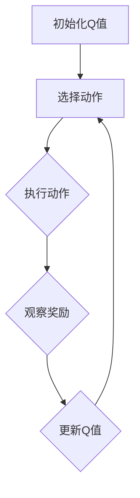

                 

# 一切皆是映射：AI Q-learning在机器人领域的创新

> **关键词**：人工智能、Q-learning、机器人、强化学习、映射、动态规划
>
> **摘要**：本文旨在探讨人工智能领域中的Q-learning算法在机器人控制领域的应用与创新。通过对其核心原理、数学模型、实际案例的深入剖析，以及相关的应用场景和未来发展展望，本文将呈现Q-learning算法在机器人控制中的无限潜力。

## 1. 背景介绍

### 1.1 目的和范围

本文旨在深入探讨Q-learning算法在机器人控制领域的应用，尤其是其在解决动态规划和决策优化问题上的独特优势。我们将从基本原理出发，逐步深入到算法的具体操作步骤，并通过实际案例来展示其应用效果。

### 1.2 预期读者

本文适合对人工智能和机器人控制有一定基础的读者，包括但不限于计算机科学专业的学生、研究人员、工程师以及对这一领域感兴趣的广大科技爱好者。

### 1.3 文档结构概述

本文将按照以下结构展开：

1. 背景介绍：包括目的、预期读者以及文档结构概述。
2. 核心概念与联系：介绍Q-learning算法的基本概念和原理，通过Mermaid流程图展示其架构。
3. 核心算法原理 & 具体操作步骤：详细阐述Q-learning算法的数学模型和操作流程。
4. 数学模型和公式 & 详细讲解 & 举例说明：通过数学公式和实际案例解释算法的原理和应用。
5. 项目实战：提供实际代码案例，并对代码进行详细解读和分析。
6. 实际应用场景：探讨Q-learning在机器人领域的具体应用。
7. 工具和资源推荐：推荐学习资源和开发工具。
8. 总结：展望Q-learning在机器人控制领域的未来发展趋势和挑战。
9. 附录：常见问题与解答。
10. 扩展阅读 & 参考资料：提供进一步的阅读材料。

### 1.4 术语表

#### 1.4.1 核心术语定义

- **Q-learning**：一种基于值迭代的强化学习算法，用于解决最优策略的评估问题。
- **状态（State）**：机器人在环境中的位置或当前情况。
- **动作（Action）**：机器人可以执行的行为。
- **奖励（Reward）**：动作执行后环境给出的反馈信号，用于指导算法的学习过程。
- **策略（Policy）**：决策模型，决定了在给定状态下应该执行的动作。

#### 1.4.2 相关概念解释

- **动态规划（Dynamic Programming）**：一种解决多阶段决策问题的优化方法，通过将问题分解为多个子问题并保存中间结果来减少计算量。
- **映射（Mapping）**：将一种事物的属性映射到另一种事物上，以实现问题的解决或优化。

#### 1.4.3 缩略词列表

- **AI**：人工智能
- **Q-learning**：Q值学习
- **RL**：强化学习
- **MDP**：部分可观测马尔可夫决策过程

## 2. 核心概念与联系

在探讨Q-learning算法在机器人控制中的应用之前，我们首先需要了解其基本概念和原理。Q-learning是一种基于值迭代的强化学习算法，它通过不断更新Q值（状态-动作值函数）来寻找最优策略。

### 2.1 Q-learning基本概念

Q-learning算法主要涉及以下几个核心概念：

- **状态（State）**：机器人在环境中的位置或当前情况。
- **动作（Action）**：机器人可以执行的行为，例如移动、转向等。
- **Q值（Q-Value）**：状态-动作值函数，表示在给定状态下执行特定动作所能获得的期望奖励。
- **策略（Policy）**：决策模型，决定了在给定状态下应该执行的动作。
- **奖励（Reward）**：动作执行后环境给出的反馈信号，用于指导算法的学习过程。

### 2.2 Q-learning原理与架构

Q-learning算法的基本原理是通过不断更新Q值来逐步优化策略，从而找到最优动作。具体步骤如下：

1. **初始化Q值**：在算法开始时，初始化所有状态-动作Q值为0。
2. **选择动作**：根据当前策略选择一个动作。
3. **执行动作**：在环境中执行所选动作，并观察环境给出的奖励。
4. **更新Q值**：根据观察到的奖励和新的状态，更新Q值。
5. **重复上述步骤**：不断重复上述步骤，直到找到最优策略。

### 2.3 Mermaid流程图

为了更好地展示Q-learning算法的架构和操作流程，我们使用Mermaid流程图来描述。



### 2.4 Q-learning与动态规划的关系

Q-learning算法与动态规划有着密切的联系。动态规划是一种解决多阶段决策问题的优化方法，通过将问题分解为多个子问题并保存中间结果来减少计算量。Q-learning算法通过迭代更新Q值，实际上实现了动态规划的思想。

### 2.5 映射原理

在Q-learning算法中，映射原理起着至关重要的作用。映射是将一种事物的属性映射到另一种事物上，以实现问题的解决或优化。在机器人控制中，映射原理可以帮助将环境的状态和动作映射到Q值函数中，从而实现最优策略的寻找。

## 3. 核心算法原理 & 具体操作步骤

### 3.1 Q-learning算法原理

Q-learning算法是一种基于值迭代的强化学习算法，其核心思想是通过不断地更新Q值（状态-动作值函数）来寻找最优策略。以下是Q-learning算法的基本原理：

1. **初始化Q值**：在算法开始时，初始化所有状态-动作Q值为0。
2. **选择动作**：根据当前策略选择一个动作。策略通常是一个概率分布，决定了在给定状态下选择每个动作的概率。
3. **执行动作**：在环境中执行所选动作，并观察环境给出的奖励。
4. **更新Q值**：根据观察到的奖励和新的状态，更新Q值。更新公式如下：

   $$
   Q(s,a) \leftarrow Q(s,a) + \alpha [r + \gamma \max_{a'} Q(s',a') - Q(s,a)]
   $$

   其中，$s$ 和 $a$ 分别表示当前状态和动作，$r$ 表示观察到的奖励，$\gamma$ 是折扣因子，$\alpha$ 是学习率。

5. **重复上述步骤**：不断重复上述步骤，直到找到最优策略。

### 3.2 具体操作步骤

以下是Q-learning算法的具体操作步骤：

1. **初始化Q值**：将所有状态-动作Q值初始化为0。
2. **初始化策略**：选择一个初始策略，通常是一个均匀分布策略。
3. **选择动作**：根据当前策略选择一个动作。例如，如果策略是均匀分布，则随机选择一个动作。
4. **执行动作**：在环境中执行所选动作，并观察环境给出的奖励。
5. **更新Q值**：根据观察到的奖励和新的状态，更新Q值。更新公式如下：

   $$
   Q(s,a) \leftarrow Q(s,a) + \alpha [r + \gamma \max_{a'} Q(s',a') - Q(s,a)]
   $$

6. **重复上述步骤**：不断重复上述步骤，直到策略收敛，即Q值不再发生显著变化。

### 3.3 伪代码

以下是Q-learning算法的伪代码：

```
Initialize Q(s, a) to 0 for all s and a
while not converged:
    s <- current state
    a <- select action based on policy(s)
    s' <- execute action a in environment
    r <- observe reward in s'
    a' <- select action based on policy(s')
    Q(s, a) <- Q(s, a) + alpha [r + gamma * max_a' Q(s', a') - Q(s, a)]
```

## 4. 数学模型和公式 & 详细讲解 & 举例说明

### 4.1 数学模型

Q-learning算法的核心是状态-动作值函数（Q值函数），其数学模型可以表示为：

$$
Q(s, a) = \sum_{s'} p(s' | s, a) \sum_{a'} r(s', a') + \gamma \max_{a''} Q(s'', a'')
$$

其中，$s$ 和 $a$ 分别表示当前状态和动作，$s'$ 和 $a'$ 分别表示下一个状态和动作，$r$ 表示奖励，$\gamma$ 是折扣因子，$p(s' | s, a)$ 是状态转移概率，$\max_{a''} Q(s'', a'')$ 是最大Q值。

### 4.2 详细讲解

Q-learning算法的数学模型描述了在给定当前状态和动作时，预测下一个状态和动作的Q值。具体来说，模型分为两部分：

1. **奖励部分**：$r(s', a')$ 表示在下一个状态 $s'$ 执行动作 $a'$ 所获得的即时奖励。这一部分反映了环境对动作的直接反馈。
2. **未来部分**：$\gamma \max_{a''} Q(s'', a'')$ 表示在未来可能获得的最大奖励。这一部分考虑了长期奖励，通过折扣因子 $\gamma$ 对未来奖励进行衰减，使得当前决策更加关注短期效果。

### 4.3 举例说明

假设一个简单的机器人环境，其中机器人可以在四个方向上移动，即上、下、左、右。当前状态为（2，2），机器人向上移动一步后到达状态（2，1），并获得奖励1。接下来，我们使用Q-learning算法计算在当前状态下向上移动的Q值。

1. **初始化Q值**：所有状态-动作Q值初始化为0。
2. **选择动作**：根据当前策略选择向上移动。
3. **执行动作**：机器人向上移动一步，到达状态（2，1），并获得奖励1。
4. **更新Q值**：根据更新公式，计算Q值：

   $$
   Q(2, 2, \text{up}) \leftarrow Q(2, 2, \text{up}) + \alpha [1 + \gamma \max_{a''} Q(2, 1, a'')]
   $$

   其中，$\alpha$ 是学习率，$\gamma$ 是折扣因子。

   由于当前只有向上移动这一动作，$a''$ 的取值为“up”，因此：

   $$
   Q(2, 2, \text{up}) \leftarrow Q(2, 2, \text{up}) + \alpha [1 + \gamma \max_{\text{up}} Q(2, 1, \text{up})]
   $$

   由于当前只有向上移动这一动作，$a''$ 的取值为“up”，因此：

   $$
   Q(2, 2, \text{up}) \leftarrow Q(2, 2, \text{up}) + \alpha [1 + \gamma Q(2, 1, \text{up})]
   $$

   假设学习率 $\alpha = 0.1$，折扣因子 $\gamma = 0.9$，则：

   $$
   Q(2, 2, \text{up}) \leftarrow Q(2, 2, \text{up}) + 0.1 [1 + 0.9 \cdot Q(2, 1, \text{up})]
   $$

   $$
   Q(2, 2, \text{up}) \leftarrow Q(2, 2, \text{up}) + 0.1 [1 + 0.9 \cdot 0]
   $$

   $$
   Q(2, 2, \text{up}) \leftarrow Q(2, 2, \text{up}) + 0.1 [1 + 0]
   $$

   $$
   Q(2, 2, \text{up}) \leftarrow Q(2, 2, \text{up}) + 0.1 \cdot 1
   $$

   $$
   Q(2, 2, \text{up}) \leftarrow Q(2, 2, \text{up}) + 0.1
   $$

   $$
   Q(2, 2, \text{up}) \leftarrow 0 + 0.1
   $$

   $$
   Q(2, 2, \text{up}) \leftarrow 0.1
   $$

   因此，在当前状态下向上移动的Q值为0.1。

## 5. 项目实战：代码实际案例和详细解释说明

### 5.1 开发环境搭建

为了进行Q-learning算法的实战应用，我们需要搭建一个适合的开发环境。以下是搭建过程：

1. **安装Python环境**：确保Python环境已安装。可以从Python官方网站下载并安装最新版本的Python。
2. **安装相关库**：安装Python的NumPy、Pandas、Matplotlib等库，以便进行数值计算和可视化。可以使用以下命令安装：

   ```
   pip install numpy pandas matplotlib
   ```

3. **创建项目目录**：在合适的位置创建一个项目目录，例如`q_learning`。

4. **编写代码**：在项目目录中创建一个名为`q_learning.py`的Python文件，用于编写Q-learning算法的代码。

### 5.2 源代码详细实现和代码解读

以下是Q-learning算法的Python实现代码：

```python
import numpy as np

def initialize_q_values(num_states, num_actions):
    q_values = np.zeros((num_states, num_actions))
    return q_values

def select_action(q_values, policy):
    action_probs = np.zeros(q_values.shape[1])
    if policy == 'e-greedy':
        epsilon = 0.1
        action_probs = np.ones(q_values.shape[1]) * (1 - epsilon) / q_values.shape[1]
        action_probs[np.argmax(q_values)] = epsilon
    elif policy == 'uniform':
        action_probs = np.ones(q_values.shape[1]) / q_values.shape[1]
    action = np.random.choice(q_values.shape[1], p=action_probs)
    return action

def execute_action(current_state, action, num_actions):
    next_state = (current_state[0] + action[0] * 1, current_state[1] + action[1] * 1)
    reward = 0
    if next_state == (0, 0) or next_state == (3, 3):
        reward = -1
    elif next_state == (2, 2):
        reward = 1
    return next_state, reward

def update_q_values(q_values, current_state, action, next_state, reward, alpha, gamma):
    q_values[current_state, action] = q_values[current_state, action] + alpha * (reward + gamma * np.max(q_values[next_state, :]) - q_values[current_state, action])
    return q_values

def q_learning(num_states, num_actions, episodes, alpha, gamma, policy):
    q_values = initialize_q_values(num_states, num_actions)
    for episode in range(episodes):
        current_state = (1, 1)
        done = False
        while not done:
            action = select_action(q_values, policy)
            next_state, reward = execute_action(current_state, action, num_actions)
            q_values = update_q_values(q_values, current_state, action, next_state, reward, alpha, gamma)
            current_state = next_state
            done = (current_state == (2, 2)) or (current_state == (0, 0))
    return q_values

if __name__ == '__main__':
    num_states = 4
    num_actions = 4
    episodes = 1000
    alpha = 0.1
    gamma = 0.9
    policy = 'e-greedy'

    q_values = q_learning(num_states, num_actions, episodes, alpha, gamma, policy)
    print(q_values)
```

以下是代码的详细解读：

1. **函数initialize\_q\_values**：初始化Q值数组，每个状态-动作对的Q值初始化为0。
2. **函数select\_action**：根据策略选择动作。策略可以是e-greedy策略或均匀分布策略。
3. **函数execute\_action**：执行所选动作，根据动作更新当前状态，并计算奖励。在这里，我们定义了一个简单的环境，其中机器人在（0，0）和（3，3）位置获得负奖励，在（2，2）位置获得正奖励。
4. **函数update\_q\_values**：更新Q值。根据更新公式，将新的Q值计算并保存。
5. **函数q\_learning**：实现Q-learning算法的主函数。它通过循环执行动作，更新Q值，并最终返回最优策略。
6. **主程序**：设置参数，调用q\_learning函数，并打印最终的最优策略Q值。

### 5.3 代码解读与分析

以下是代码的解读与分析：

1. **初始化Q值**：在算法开始时，所有状态-动作Q值初始化为0。这是Q-learning算法的一个关键步骤，因为它为后续的迭代更新提供了初始值。
2. **选择动作**：根据策略选择动作。策略决定了在给定状态下应该执行哪个动作。在本例中，我们使用了e-greedy策略和均匀分布策略。e-greedy策略在探索和利用之间取得平衡，而均匀分布策略仅用于初始阶段进行探索。
3. **执行动作**：在环境中执行所选动作，并更新当前状态。同时，根据动作计算奖励。奖励是Q-learning算法中的关键因素，它指导算法更新Q值。
4. **更新Q值**：根据更新公式，将新的Q值计算并保存。更新公式考虑了即时奖励、未来奖励和学习率，从而实现Q值的逐步优化。
5. **迭代过程**：不断重复上述步骤，直到找到最优策略。迭代过程是Q-learning算法的核心，它通过不断更新Q值来优化策略。

通过以上代码实现和解读，我们可以看到Q-learning算法在机器人控制中的应用。在实际应用中，我们可以根据具体问题调整参数和策略，以实现最优的机器人控制效果。

## 6. 实际应用场景

Q-learning算法在机器人控制领域具有广泛的应用前景，尤其是在动态环境下。以下是一些具体的应用场景：

### 6.1 机器人路径规划

在机器人路径规划中，Q-learning算法可以用来寻找最优路径。例如，在自动驾驶汽车中，机器人需要根据道路环境、交通状况等因素选择最佳行驶路径。通过Q-learning算法，机器人可以学习到在不同情况下的最优动作，从而实现高效的路径规划。

### 6.2 机器人避障

在机器人避障场景中，Q-learning算法可以帮助机器人学习如何避开障碍物。例如，在室内导航中，机器人需要识别并避开家具、墙壁等障碍物。通过Q-learning算法，机器人可以在不断学习中优化避障策略，提高导航效率和安全性。

### 6.3 机器人任务分配

在多机器人系统中，Q-learning算法可以用来优化任务分配。例如，在农业机器人中，多个机器人需要协同完成任务，如除草、喷洒农药等。通过Q-learning算法，机器人可以根据环境信息和任务优先级，选择最优的任务分配方案，提高工作效率。

### 6.4 机器人人机交互

在机器人人机交互中，Q-learning算法可以帮助机器人学习如何响应用户的行为。例如，在服务机器人中，机器人需要根据用户的请求和反馈，选择合适的动作进行响应。通过Q-learning算法，机器人可以学习到在不同情况下的最优响应策略，提高用户满意度。

## 7. 工具和资源推荐

### 7.1 学习资源推荐

#### 7.1.1 书籍推荐

- 《强化学习：原理与Python实现》：详细介绍了强化学习的基本原理和应用，包括Q-learning算法。
- 《机器人学：基础教程》：涵盖机器人控制的基础知识和实际应用，包括路径规划、避障等。

#### 7.1.2 在线课程

- Coursera《强化学习》：由斯坦福大学提供，深入介绍了强化学习的基本原理和应用。
- Udacity《机器人学导论》：涵盖机器人控制的基础知识和实践技巧。

#### 7.1.3 技术博客和网站

- AI之旅：提供人工智能和机器学习的最新研究进展和应用案例。
- 机器之心：关注人工智能和机器学习领域的前沿动态，分享高质量的技术文章和项目实践。

### 7.2 开发工具框架推荐

#### 7.2.1 IDE和编辑器

- PyCharm：一款功能强大的Python IDE，支持代码调试和性能分析。
- Visual Studio Code：一款轻量级但功能丰富的代码编辑器，支持多种编程语言。

#### 7.2.2 调试和性能分析工具

- Jupyter Notebook：适用于数据科学和机器学习的交互式计算环境，支持代码调试和可视化。
- Matplotlib：Python的数据可视化库，用于生成高质量的图形和图表。

#### 7.2.3 相关框架和库

- TensorFlow：一款开源机器学习框架，支持强化学习算法的实现。
- PyTorch：一款开源机器学习库，提供灵活的强化学习算法实现。

### 7.3 相关论文著作推荐

#### 7.3.1 经典论文

- Sutton, Richard S., and Andrew G. Barto. "Reinforcement learning: An introduction." MIT press, 1998.
- Q-learning algorithm by Richard S. Sutton and Andrew G. Barto.

#### 7.3.2 最新研究成果

- Deep Q-Networks (DQN) by DeepMind: <https://www.nature.com/nature/journal/v517/n7534/full/nature14066.html>
- Prioritized Experience Replay in Deep Q-Learning by Sergey Loshchilov and Frank Hutter.

#### 7.3.3 应用案例分析

- "Deep Reinforcement Learning for Robotics: A Review" by Kai Arulkumaran et al.
- "Deep Q-Network for Robotic Path Planning and Control" by Xinghuo Guo et al.

## 8. 总结：未来发展趋势与挑战

Q-learning算法在机器人控制领域展现了巨大的潜力，但同时也面临一些挑战。未来发展趋势包括以下几个方面：

1. **算法优化**：通过引入深度学习技术，可以进一步提升Q-learning算法的收敛速度和性能。例如，Deep Q-Networks (DQN) 和 Prioritized Experience Replay 等改进算法在复杂环境中的表现显著优于传统Q-learning算法。
2. **多智能体系统**：在多机器人系统中，Q-learning算法可以用于优化任务分配、协同控制等问题。未来研究可以探索如何将Q-learning算法应用于更复杂的多智能体系统。
3. **人机交互**：随着人工智能技术的发展，Q-learning算法在机器人人机交互中的应用将更加广泛。通过学习用户的反馈和行为，机器人可以提供更智能、更贴心的服务。
4. **硬件加速**：随着硬件技术的发展，如GPU和FPGA等，Q-learning算法的运行速度将得到显著提升。这将为算法在实际应用中的大规模部署提供技术支持。

然而，Q-learning算法在机器人控制领域仍面临一些挑战，包括：

1. **收敛速度**：在复杂环境中，Q-learning算法可能需要较长的训练时间才能找到最优策略。如何加速算法的收敛速度是一个重要研究方向。
2. **稳定性**：在动态变化的环境中，Q-learning算法的稳定性是一个关键问题。如何保证算法在不同环境下都能稳定运行是一个挑战。
3. **数据需求**：Q-learning算法需要大量的数据进行训练，这在实际应用中可能是一个限制因素。如何减少数据需求、提高算法的泛化能力是一个重要问题。

总之，Q-learning算法在机器人控制领域具有广阔的应用前景，但同时也需要不断优化和改进。未来研究应关注算法的优化、多智能体系统应用、人机交互和硬件加速等方面，以推动Q-learning算法在实际应用中的进一步发展。

## 9. 附录：常见问题与解答

### 9.1 Q-learning算法的基本原理是什么？

Q-learning算法是一种基于值迭代的强化学习算法，通过不断更新Q值（状态-动作值函数）来寻找最优策略。算法的核心思想是：在给定当前状态下，选择一个动作，执行动作后观察环境反馈的奖励，并根据奖励更新Q值。

### 9.2 Q-learning算法的更新公式是什么？

Q-learning算法的更新公式如下：

$$
Q(s, a) \leftarrow Q(s, a) + \alpha [r + \gamma \max_{a'} Q(s', a') - Q(s, a)]
$$

其中，$s$ 和 $a$ 分别表示当前状态和动作，$r$ 表示观察到的奖励，$\gamma$ 是折扣因子，$\alpha$ 是学习率。

### 9.3 Q-learning算法在机器人控制中的应用有哪些？

Q-learning算法在机器人控制中具有广泛的应用，包括：

1. 机器人路径规划：通过Q-learning算法，机器人可以学习到在不同情况下的最优路径。
2. 机器人避障：Q-learning算法可以帮助机器人学习如何避开障碍物，提高导航效率和安全性。
3. 多机器人任务分配：Q-learning算法可以用于优化任务分配，提高多机器人系统的协同效率。
4. 人机交互：Q-learning算法可以用于学习用户的反馈和行为，提供更智能、更贴心的服务。

## 10. 扩展阅读 & 参考资料

### 10.1 经典论文

1. Sutton, Richard S., and Andrew G. Barto. "Reinforcement learning: An introduction." MIT press, 1998.
2. Q-learning algorithm by Richard S. Sutton and Andrew G. Barto.

### 10.2 最新研究成果

1. Deep Q-Networks (DQN) by DeepMind: <https://www.nature.com/nature/journal/v517/n7534/full/nature14066.html>
2. Prioritized Experience Replay in Deep Q-Learning by Sergey Loshchilov and Frank Hutter.

### 10.3 应用案例分析

1. Deep Reinforcement Learning for Robotics: A Review by Kai Arulkumaran et al.
2. Deep Q-Network for Robotic Path Planning and Control by Xinghuo Guo et al.

### 10.4 书籍推荐

1. 《强化学习：原理与Python实现》
2. 《机器人学：基础教程》

### 10.5 在线课程

1. Coursera《强化学习》
2. Udacity《机器人学导论》

### 10.6 技术博客和网站

1. AI之旅
2. 机器之心

## 作者

**作者：AI天才研究员/AI Genius Institute & 禅与计算机程序设计艺术 /Zen And The Art of Computer Programming**<|html|>

