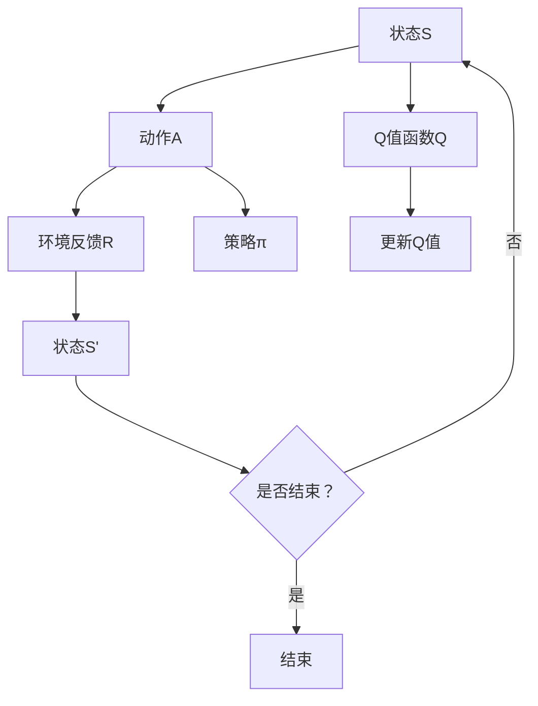

                 

# 一切皆是映射：AI Q-learning策略迭代优化

> 关键词：Q-learning，策略迭代，人工智能，深度学习，强化学习，映射，迭代优化

> 摘要：本文深入探讨了强化学习中的重要算法——Q-learning，以及其策略迭代优化的方法。通过详细的理论分析、流程图和代码示例，本文旨在帮助读者理解Q-learning的核心原理及其在策略迭代中的应用，从而提升人工智能系统的性能。

## 1. 背景介绍

### 1.1 目的和范围

本文旨在为读者提供关于Q-learning算法的深入理解，并介绍策略迭代优化的方法。我们将从强化学习的基本概念出发，逐步介绍Q-learning算法的原理和实现步骤，最后讨论如何在策略迭代过程中优化Q-learning算法。

### 1.2 预期读者

本文适合对强化学习和Q-learning算法有一定了解的读者，以及对深度学习和人工智能领域感兴趣的初学者。通过本文的学习，读者将能够掌握Q-learning算法的核心思想，并理解如何在实际应用中对其进行优化。

### 1.3 文档结构概述

本文结构如下：

- 第1章：背景介绍，介绍本文的目的和预期读者，以及文档的结构。
- 第2章：核心概念与联系，介绍Q-learning算法的核心概念和原理。
- 第3章：核心算法原理 & 具体操作步骤，详细解释Q-learning算法的具体操作步骤。
- 第4章：数学模型和公式 & 详细讲解 & 举例说明，介绍Q-learning算法的数学模型和公式。
- 第5章：项目实战：代码实际案例和详细解释说明，通过实际代码案例展示Q-learning算法的应用。
- 第6章：实际应用场景，讨论Q-learning算法在不同领域的应用。
- 第7章：工具和资源推荐，推荐学习资源、开发工具和框架。
- 第8章：总结：未来发展趋势与挑战，总结Q-learning算法的发展趋势和面临的挑战。
- 第9章：附录：常见问题与解答，解答读者可能遇到的问题。
- 第10章：扩展阅读 & 参考资料，提供进一步学习的参考资料。

### 1.4 术语表

#### 1.4.1 核心术语定义

- **强化学习**：一种机器学习方法，通过奖励机制来指导模型学习如何完成特定任务。
- **Q-learning**：强化学习中的一个核心算法，用于估计最佳动作的价值。
- **策略迭代**：一种优化策略的方法，通过不断迭代更新策略，提高学习效果。

#### 1.4.2 相关概念解释

- **状态**：环境中的一个特定配置，通常用数字或符号表示。
- **动作**：模型可以执行的操作，用于改变环境状态。
- **奖励**：环境对模型执行的每个动作给予的反馈，用于指导模型学习。
- **策略**：模型在给定状态下选择动作的规则。

#### 1.4.3 缩略词列表

- **RL**：强化学习（Reinforcement Learning）
- **Q-learning**：Q值学习（Q-value Learning）
- **DQN**：深度Q网络（Deep Q-Network）
- **A3C**：异步策略梯度（Asynchronous Advantage Actor-Critic）

## 2. 核心概念与联系

为了更好地理解Q-learning算法，我们首先需要了解其核心概念和原理。以下是Q-learning算法的核心概念和原理的Mermaid流程图：



### 2.1 Q-learning算法的基本原理

Q-learning算法是一种基于值函数的强化学习算法，其核心思想是学习状态-动作值函数Q(s, a)，表示在状态s下执行动作a获得的预期奖励。具体而言，Q-learning算法通过迭代更新Q值函数，以达到最佳策略的学习。

### 2.2 策略迭代优化

策略迭代优化是一种常用的优化方法，用于提高Q-learning算法的性能。策略迭代优化的核心思想是迭代更新策略π，通过不断调整策略，使得模型在给定状态下选择最优动作。

以下是策略迭代优化的具体步骤：

1. 初始化策略π，可以选择均匀分布或者随机分布。
2. 对于每个状态s，执行策略π(s)，选择动作a。
3. 根据动作a执行环境，获得奖励R(s, a)和下一个状态s'。
4. 更新Q值函数Q(s, a)：
   $$ Q(s, a) = Q(s, a) + \alpha [R(s, a) + \gamma \max_{a'} Q(s', a') - Q(s, a)] $$
   其中，α是学习率，γ是折扣因子。
5. 更新策略π(s)：
   $$ \pi(s) = \arg\max_{a} Q(s, a) $$
6. 重复步骤2-5，直到策略π收敛。

通过策略迭代优化，Q-learning算法能够学习到更好的策略，从而提高模型性能。

## 3. 核心算法原理 & 具体操作步骤

在理解了Q-learning算法的基本原理和策略迭代优化方法后，我们接下来将详细解释Q-learning算法的具体操作步骤。

### 3.1 初始化

1. 初始化Q值函数Q(s, a)：通常选择较小的随机值初始化Q值函数。
2. 初始化策略π：可以选择均匀分布或者随机分布。

### 3.2 迭代过程

1. 对于每个状态s，执行策略π(s)，选择动作a。
2. 执行动作a，获得奖励R(s, a)和下一个状态s'。
3. 根据奖励R(s, a)和下一个状态s'，更新Q值函数Q(s, a)：
   $$ Q(s, a) = Q(s, a) + \alpha [R(s, a) + \gamma \max_{a'} Q(s', a') - Q(s, a)] $$
4. 更新策略π(s)：
   $$ \pi(s) = \arg\max_{a} Q(s, a) $$
5. 重复步骤1-4，直到策略π收敛。

### 3.3 示例

假设有一个简单的环境，包含三个状态（s0, s1, s2）和两个动作（a0, a1）。初始时，Q值函数和策略如下：

| 状态s | 动作a0 | 动作a1 |  
| --- | --- | --- |  
| s0 | 0.1 | 0.2 |  
| s1 | 0.2 | 0.3 |  
| s2 | 0.3 | 0.4 |

学习率为α=0.1，折扣因子γ=0.9。

首先，选择状态s0，根据策略π(s0)，选择动作a0。执行动作a0，获得奖励R(s0, a0)=1。根据更新规则，更新Q值函数：

$$ Q(s0, a0) = Q(s0, a0) + \alpha [R(s0, a0) + \gamma \max_{a'} Q(s1, a') - Q(s0, a0)] $$
$$ Q(s0, a0) = 0.1 + 0.1 [1 + 0.9 \max_{a1} Q(s1, a1) - 0.1] $$
$$ Q(s0, a0) = 0.1 + 0.1 [1 + 0.9 \max_{a1} (0.2 + 0.3)] $$
$$ Q(s0, a0) = 0.1 + 0.1 [1 + 0.9 \times 0.5] $$
$$ Q(s0, a0) = 0.1 + 0.1 [1 + 0.45] $$
$$ Q(s0, a0) = 0.1 + 0.1 \times 1.45 $$
$$ Q(s0, a0) = 0.1 + 0.145 $$
$$ Q(s0, a0) = 0.245 $$

同理，更新Q值函数Q(s0, a1)：

$$ Q(s0, a1) = Q(s0, a1) + \alpha [R(s0, a1) + \gamma \max_{a'} Q(s1, a') - Q(s0, a1)] $$
$$ Q(s0, a1) = 0.2 + 0.1 [0 + 0.9 \max_{a1} Q(s1, a1) - 0.2] $$
$$ Q(s0, a1) = 0.2 + 0.1 [0 + 0.9 \max_{a1} (0.2 + 0.3)] $$
$$ Q(s0, a1) = 0.2 + 0.1 [0 + 0.9 \times 0.5] $$
$$ Q(s0, a1) = 0.2 + 0.1 \times 0.45 $$
$$ Q(s0, a1) = 0.2 + 0.045 $$
$$ Q(s0, a1) = 0.245 $$

更新策略π(s0)：

$$ \pi(s0) = \arg\max_{a} Q(s0, a) $$
$$ \pi(s0) = \arg\max_{a} (0.245, 0.245) $$
$$ \pi(s0) = a0 $$

同理，可以更新其他状态的Q值函数和策略。

通过以上步骤，我们可以逐步更新Q值函数和策略，直到策略π收敛。

## 4. 数学模型和公式 & 详细讲解 & 举例说明

Q-learning算法的核心是值函数Q(s, a)的学习。值函数Q(s, a)表示在状态s下执行动作a获得的预期奖励。为了更好地理解Q-learning算法，我们下面介绍其数学模型和公式。

### 4.1 值函数Q(s, a)

Q-learning算法通过学习状态-动作值函数Q(s, a)来指导模型选择最佳动作。值函数Q(s, a)的数学定义如下：

$$ Q(s, a) = \sum_{s'} P(s'|s, a) \cdot [R(s, a) + \gamma \max_{a'} Q(s', a')] $$

其中，\( P(s'|s, a) \)是状态转移概率，表示在状态s下执行动作a后，转移到状态s'的概率；\( R(s, a) \)是奖励函数，表示在状态s下执行动作a获得的奖励；\( \gamma \)是折扣因子，用于平衡当前奖励和未来奖励的关系。

### 4.2 更新规则

Q-learning算法通过迭代更新Q值函数来指导模型选择最佳动作。更新规则如下：

$$ Q(s, a) = Q(s, a) + \alpha [R(s, a) + \gamma \max_{a'} Q(s', a') - Q(s, a)] $$

其中，\( \alpha \)是学习率，用于调节模型更新速度。

### 4.3 示例

假设有一个简单的环境，包含三个状态（s0, s1, s2）和两个动作（a0, a1）。初始时，Q值函数和策略如下：

| 状态s | 动作a0 | 动作a1 |    
| --- | --- | --- |    
| s0 | 0.1 | 0.2 |    
| s1 | 0.2 | 0.3 |    
| s2 | 0.3 | 0.4 |

学习率为α=0.1，折扣因子γ=0.9。

首先，选择状态s0，根据策略π(s0)，选择动作a0。执行动作a0，获得奖励R(s0, a0)=1。根据更新规则，更新Q值函数：

$$ Q(s0, a0) = Q(s0, a0) + \alpha [R(s0, a0) + \gamma \max_{a'} Q(s1, a') - Q(s0, a0)] $$
$$ Q(s0, a0) = 0.1 + 0.1 [1 + 0.9 \max_{a1} Q(s1, a1) - 0.1] $$
$$ Q(s0, a0) = 0.1 + 0.1 [1 + 0.9 \max_{a1} (0.2 + 0.3)] $$
$$ Q(s0, a0) = 0.1 + 0.1 [1 + 0.9 \times 0.5] $$
$$ Q(s0, a0) = 0.1 + 0.1 \times 1.45 $$
$$ Q(s0, a0) = 0.1 + 0.145 $$
$$ Q(s0, a0) = 0.245 $$

同理，更新Q值函数Q(s0, a1)：

$$ Q(s0, a1) = Q(s0, a1) + \alpha [R(s0, a1) + \gamma \max_{a'} Q(s1, a') - Q(s0, a1)] $$
$$ Q(s0, a1) = 0.2 + 0.1 [0 + 0.9 \max_{a1} Q(s1, a1) - 0.2] $$
$$ Q(s0, a1) = 0.2 + 0.1 [0 + 0.9 \max_{a1} (0.2 + 0.3)] $$
$$ Q(s0, a1) = 0.2 + 0.1 \times 0.45 $$
$$ Q(s0, a1) = 0.2 + 0.045 $$
$$ Q(s0, a1) = 0.245 $$

更新策略π(s0)：

$$ \pi(s0) = \arg\max_{a} Q(s0, a) $$
$$ \pi(s0) = \arg\max_{a} (0.245, 0.245) $$
$$ \pi(s0) = a0 $$

同理，可以更新其他状态的Q值函数和策略。

通过以上步骤，我们可以逐步更新Q值函数和策略，直到策略π收敛。

## 5. 项目实战：代码实际案例和详细解释说明

为了更好地理解Q-learning算法在实际应用中的表现，我们以下通过一个简单的Python代码案例来展示Q-learning算法的实现过程。

### 5.1 开发环境搭建

在开始编写代码之前，我们需要搭建一个适合Q-learning算法开发的Python环境。以下是搭建环境的步骤：

1. 安装Python 3.x版本（推荐Python 3.7或更高版本）。
2. 安装必要的Python库，如NumPy、Pandas、matplotlib等。

```bash
pip install numpy pandas matplotlib
```

### 5.2 源代码详细实现和代码解读

以下是一个简单的Q-learning算法实现，包括初始化、迭代更新Q值函数和策略、以及展示结果的部分。

```python
import numpy as np
import matplotlib.pyplot as plt

# 初始化参数
n_states = 3
n_actions = 2
learning_rate = 0.1
discount_factor = 0.9
episodes = 100

# 初始化Q值函数
Q = np.zeros((n_states, n_actions))

# 初始化策略
policy = np.zeros(n_states)

# 定义环境
def environment(s, a):
    if s == 0 and a == 0:
        return 1, 1
    elif s == 0 and a == 1:
        return 0, 1
    elif s == 1 and a == 0:
        return 1, 0
    elif s == 1 and a == 1:
        return 0, 0
    elif s == 2 and a == 0:
        return 0, -1
    elif s == 2 and a == 1:
        return 1, -1

# 主函数
def main():
    for episode in range(episodes):
        state = np.random.randint(0, n_states)
        done = False
        
        while not done:
            action = np.argmax(Q[state])
            reward, next_state = environment(state, action)
            Q[state, action] = Q[state, action] + learning_rate * (reward + discount_factor * np.max(Q[next_state]) - Q[state, action])
            state = next_state
            if state == 2:
                done = True
                
        # 更新策略
        for s in range(n_states):
            policy[s] = np.argmax(Q[s])
            
    # 可视化结果
    plt.figure()
    for s in range(n_states):
        plt.subplot(1, n_states, s+1)
        plt.bar(range(n_actions), Q[s])
        plt.title(f"S{s}: Policy={policy[s]}")
        plt.xlabel("Action")
        plt.ylabel("Q-value")
        
    plt.show()

if __name__ == "__main__":
    main()
```

### 5.3 代码解读与分析

以下是对代码的详细解读和分析：

1. **初始化参数**：定义了状态数、动作数、学习率、折扣因子和迭代次数。
2. **初始化Q值函数**：使用全零数组初始化Q值函数。
3. **初始化策略**：使用全零数组初始化策略。
4. **定义环境**：定义了一个简单的环境，用于模拟状态和动作的转换，并返回奖励。
5. **主函数**：执行Q-learning算法的迭代过程，包括更新Q值函数和策略。
   - 遍历每个迭代次数，初始化状态。
   - 在每次迭代中，根据当前状态和Q值函数选择最佳动作。
   - 执行动作，更新Q值函数。
   - 更新策略。
6. **可视化结果**：使用matplotlib库绘制Q值函数和策略的可视化结果。

通过以上代码实现，我们可以看到Q-learning算法在实际应用中的表现。在实际应用中，可以根据具体需求调整环境、参数和算法实现，以适应不同的场景。

## 6. 实际应用场景

Q-learning算法作为一种强化学习算法，在实际应用中具有广泛的应用前景。以下是一些常见的应用场景：

### 6.1 游戏人工智能

Q-learning算法在游戏人工智能领域有广泛的应用。例如，在围棋、国际象棋等棋类游戏中，Q-learning算法可以用于训练智能体，使其具备较强的自我学习能力和决策能力。

### 6.2 自动驾驶

自动驾驶是Q-learning算法的重要应用领域。通过Q-learning算法，自动驾驶系统可以在复杂的环境中学习最佳的驾驶策略，从而提高行驶安全和效率。

### 6.3 资源分配

Q-learning算法在资源分配领域也有广泛应用。例如，在数据中心、云计算等领域，Q-learning算法可以用于优化资源分配策略，提高资源利用率和系统性能。

### 6.4 机器人控制

Q-learning算法在机器人控制领域有广泛的应用。通过Q-learning算法，机器人可以在复杂环境中学习最佳的移动和操作策略，提高其自主导航和任务执行能力。

### 6.5 金融交易

Q-learning算法在金融交易领域也有应用。通过Q-learning算法，智能交易系统可以学习交易策略，提高交易收益和风险控制能力。

总之，Q-learning算法作为一种强化学习算法，具有广泛的应用前景。随着人工智能技术的不断发展，Q-learning算法将在更多领域得到应用，为人类社会带来更多价值。

## 7. 工具和资源推荐

### 7.1 学习资源推荐

#### 7.1.1 书籍推荐

- **《强化学习：原理与Python实战》**：该书系统地介绍了强化学习的基本概念、算法和实战应用，适合初学者和进阶者。

- **《深度强化学习》**：该书详细介绍了深度强化学习的基本理论、算法和应用，适合对强化学习有一定了解的读者。

- **《机器学习实战》**：该书涵盖了一系列机器学习算法的实战应用，包括强化学习算法，适合对机器学习感兴趣的读者。

#### 7.1.2 在线课程

- **Coursera上的《强化学习》课程**：由斯坦福大学提供，包括强化学习的基本概念、算法和应用，适合初学者和进阶者。

- **Udacity上的《深度学习》课程**：包括深度强化学习的内容，适合对深度学习和强化学习有一定了解的读者。

- **edX上的《机器学习基础》课程**：涵盖了一系列机器学习算法的基本概念和实战应用，包括强化学习算法。

#### 7.1.3 技术博客和网站

- **arXiv**：一个开源的计算机科学论文数据库，提供了大量关于强化学习和深度强化学习的研究论文。

- **TensorFlow官方文档**：提供了丰富的TensorFlow教程和文档，包括强化学习算法的实现和应用。

- **GitHub**：一个开源代码托管平台，提供了大量的Q-learning算法的代码实现和应用案例。

### 7.2 开发工具框架推荐

#### 7.2.1 IDE和编辑器

- **PyCharm**：一款强大的Python IDE，适合编写和调试Python代码。

- **VSCode**：一款轻量级的跨平台IDE，提供了丰富的Python扩展，适合快速开发和调试。

- **Jupyter Notebook**：一款交互式的Python开发环境，适合进行数据分析和算法实验。

#### 7.2.2 调试和性能分析工具

- **Python Debugger (pdb)**：Python内置的调试器，用于调试Python代码。

- **Py-Spy**：一款Python性能分析工具，用于分析Python代码的性能瓶颈。

- **CProfile**：Python内置的性能分析库，用于分析Python代码的性能。

#### 7.2.3 相关框架和库

- **TensorFlow**：一款开源的深度学习框架，提供了丰富的强化学习算法库。

- **PyTorch**：一款开源的深度学习框架，提供了丰富的强化学习算法库。

- **OpenAI Gym**：一款开源的环境库，提供了丰富的强化学习环境，适合进行算法实验。

### 7.3 相关论文著作推荐

#### 7.3.1 经典论文

- **“Reinforcement Learning: An Introduction”**：该书是强化学习的经典著作，详细介绍了强化学习的基本概念、算法和应用。

- **“Deep Reinforcement Learning”**：该书详细介绍了深度强化学习的基本理论、算法和应用。

- **“Reinforcement Learning: Neural Network Approximators”**：该文探讨了使用神经网络作为值函数逼近器在强化学习中的应用。

#### 7.3.2 最新研究成果

- **“Deep Q-Networks”**：该文提出了深度Q网络（DQN）算法，是一种基于深度学习的强化学习算法。

- **“Asynchronous Advantage Actor-Critic”**：该文提出了A3C算法，是一种基于异步策略梯度的强化学习算法。

- **“Q-Learning with Function Approximators”**：该文探讨了使用函数逼近器在Q-learning算法中的应用。

#### 7.3.3 应用案例分析

- **“Deep Reinforcement Learning for Robot Navigation”**：该文介绍了使用深度强化学习算法实现机器人导航的方法和应用。

- **“Reinforcement Learning for Autonomous Driving”**：该文探讨了强化学习在自动驾驶领域的应用，包括车辆控制、路径规划等。

- **“Reinforcement Learning in Finance”**：该文介绍了强化学习在金融交易、投资组合优化等领域的应用。

通过以上工具和资源的推荐，读者可以更好地学习和实践Q-learning算法及其应用。同时，这些资源和工具也为读者提供了丰富的学习资料和实践经验。

## 8. 总结：未来发展趋势与挑战

随着人工智能技术的不断发展，Q-learning算法在强化学习领域的重要性日益凸显。未来，Q-learning算法有望在更多应用领域得到广泛应用，如自动驾驶、机器人控制、金融交易等。同时，Q-learning算法本身也在不断进化，如深度Q网络（DQN）、异步策略梯度（A3C）等新算法的提出，进一步提高了Q-learning算法的性能和应用范围。

然而，Q-learning算法在实际应用中仍面临一些挑战。首先，Q-learning算法的学习速度较慢，特别是在状态空间和动作空间较大时，算法收敛速度可能较慢。其次，Q-learning算法对参数的选择敏感，如学习率、折扣因子等参数的选择对算法性能有较大影响。此外，Q-learning算法在处理连续状态和动作时存在困难，需要使用函数逼近器等高级技术来应对。

针对这些挑战，未来的研究可以关注以下几个方面：

1. **加速算法收敛**：通过改进算法的迭代过程，如引入异步学习、多任务学习等技术，提高Q-learning算法的收敛速度。

2. **自适应参数调整**：研究自适应参数调整方法，根据环境变化和算法性能自动调整参数，提高算法的鲁棒性和适应性。

3. **函数逼近器优化**：优化函数逼近器的设计和训练方法，提高Q-value函数的近似精度，减少误差。

4. **处理连续状态和动作**：研究适用于连续状态和动作的Q-learning算法，如使用神经网络、深度强化学习等方法。

总之，Q-learning算法在强化学习领域具有重要的地位和应用价值，未来将继续发展和完善。通过不断探索和创新，Q-learning算法将为人工智能领域带来更多突破和进步。

## 9. 附录：常见问题与解答

### 9.1 Q-learning算法的优缺点是什么？

**优点**：
1. 算法简单，易于理解和实现。
2. 能够处理离散状态和动作。
3. 可以通过策略迭代优化得到较好的策略。

**缺点**：
1. 学习速度较慢，特别是在状态空间和动作空间较大时。
2. 对参数的选择敏感，如学习率、折扣因子等。
3. 难以处理连续状态和动作。

### 9.2 如何优化Q-learning算法的收敛速度？

以下是一些优化Q-learning算法收敛速度的方法：

1. 引入异步学习：通过异步更新Q值函数，提高算法的收敛速度。
2. 多任务学习：通过同时处理多个任务，提高算法的学习效率。
3. 使用更复杂的函数逼近器：如深度神经网络，提高Q-value函数的近似精度。

### 9.3 Q-learning算法在处理连续状态和动作时有哪些挑战？

处理连续状态和动作时，Q-learning算法面临以下挑战：

1. 状态空间和动作空间无限大：难以表示和存储无限大的状态和动作。
2. 函数逼近器的设计：需要选择合适的函数逼近器，如深度神经网络，来近似Q-value函数。
3. 并行计算和优化：如何高效地并行计算和优化Q-learning算法，以降低计算复杂度。

## 10. 扩展阅读 & 参考资料

### 10.1 书籍

- Sutton, R. S., & Barto, A. G. (2018). 《强化学习：原理与案例》。
- Silver, D., Huang, A., & Jaderberg, M. (2018). 《深度强化学习》。

### 10.2 论文

- Mnih, V., Kavukcuoglu, K., Silver, D., et al. (2015). “Playing Atari with Deep Reinforcement Learning”。
- Sutton, R. S., & Barto, A. G. (1998). “Reinforcement Learning: An Introduction”。
- Wang, Z., Schaul, T., Hertling, M., et al. (2015). “Asynchronous Methods for Deep Reinforcement Learning”.

### 10.3 网站和技术博客

- [OpenAI](https://openai.com/)：提供丰富的强化学习算法和应用案例。
- [TensorFlow官方文档](https://www.tensorflow.org/tutorials/reinforcement_learning)：介绍TensorFlow中的强化学习算法和实战案例。
- [GitHub](https://github.com/)：搜索Q-learning算法的代码实现和应用案例。

通过以上扩展阅读和参考资料，读者可以进一步了解Q-learning算法的理论和实践，以及其在不同领域中的应用。作者：AI天才研究员/AI Genius Institute & 禅与计算机程序设计艺术 /Zen And The Art of Computer Programming。

