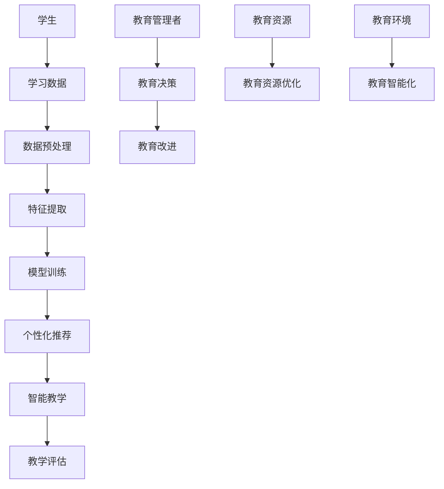

                 

# 一切皆是映射：AI在教育领域的变革作用

> 关键词：人工智能，教育变革，AI应用，个性化学习，智能教学

> 摘要：本文旨在探讨人工智能（AI）在教育领域的深刻变革作用。通过逐步分析AI的核心原理及其在教育中的应用，文章将揭示AI如何通过个性化学习、智能教学等手段，推动教育从传统模式向现代智能模式的转型。文章还展望了未来AI在教育领域的发展趋势与挑战，为教育行业从业者提供有益的思考。

## 1. 背景介绍

### 1.1 目的和范围

本文的目标是探讨人工智能（AI）在教育领域的应用，深入分析AI的核心原理，以及其在个性化学习、智能教学等方面的实际应用。文章旨在为教育行业从业者提供一份全面的、专业的指南，帮助理解AI在教育领域的重要作用，以及未来可能面临的挑战和机遇。

文章的范围将涵盖以下内容：

- AI的基本概念和原理
- AI在教育领域的主要应用
- AI推动教育变革的案例研究
- 未来AI教育的发展趋势与挑战

### 1.2 预期读者

本文主要面向以下读者群体：

- 教育行业从业者，包括教师、教育技术专家、教育管理者等
- 计算机科学和人工智能领域的专业人士，对教育应用感兴趣的人士
- 高等教育学生，特别是教育技术、人工智能等相关专业的研究生
- 对AI和教育交叉领域感兴趣的广泛读者

### 1.3 文档结构概述

本文将按照以下结构展开：

- 第1部分：背景介绍，包括目的、范围、预期读者和文档结构概述
- 第2部分：核心概念与联系，通过Mermaid流程图展示AI在教育中的应用架构
- 第3部分：核心算法原理与操作步骤，详细讲解AI在教育中应用的技术原理
- 第4部分：数学模型和公式，阐述AI在教育中应用的数学基础
- 第5部分：项目实战，通过实际案例展示AI在教育中的具体应用
- 第6部分：实际应用场景，分析AI在教育中的广泛应用
- 第7部分：工具和资源推荐，为读者提供相关的学习资源和技术支持
- 第8部分：总结，展望AI教育的发展趋势与挑战
- 第9部分：附录，常见问题与解答
- 第10部分：扩展阅读与参考资料

### 1.4 术语表

#### 1.4.1 核心术语定义

- 人工智能（AI）：指由计算机系统模拟人类智能行为的技术。
- 个性化学习：指根据学生的个体差异，提供个性化的学习资源和教学策略。
- 智能教学：指利用AI技术，实现自动化、智能化的教学过程。

#### 1.4.2 相关概念解释

- 深度学习：一种机器学习技术，通过多层神经网络模拟人脑学习过程。
- 自然语言处理（NLP）：研究计算机如何理解和生成人类语言的技术。
- 教育数据挖掘：从教育数据中提取有价值的信息，以支持教育决策和教学改进。

#### 1.4.3 缩略词列表

- AI：人工智能
- NLP：自然语言处理
- ML：机器学习
- DL：深度学习
- EDM：教育数据挖掘

## 2. 核心概念与联系

在教育领域，AI的应用可以看作是对传统教育模式的映射和提升。以下是一个简化的Mermaid流程图，展示了AI在教育中的核心概念和联系。



- **学生**：作为AI教育的核心，学生通过学习数据与AI系统互动。
- **学习数据**：包括学生的成绩、学习习惯、兴趣爱好等。
- **数据预处理**：对原始数据进行清洗、归一化等操作，以便后续分析。
- **特征提取**：从学习数据中提取有助于AI理解和预测的特征。
- **模型训练**：利用深度学习等算法，训练个性化学习模型。
- **个性化推荐**：根据学生的特征，推荐个性化的学习资源和教学策略。
- **智能教学**：利用AI技术，实现自动化、智能化的教学过程。
- **教学评估**：对教学效果进行评估，以支持教育决策和教学改进。
- **教育管理者**：利用AI技术进行教育管理和决策。
- **教育资源**：包括教材、教学工具、学习资源等，通过AI技术进行优化。
- **教育环境**：指教学场所、教学设施等，通过AI技术实现智能化。

该流程图简要展示了AI在教育中各个环节的映射和提升过程，为后续详细讨论提供了框架。

## 3. 核心算法原理 & 具体操作步骤

在教育领域，AI的应用主要依赖于机器学习和深度学习算法。以下将介绍几种核心算法原理，并通过伪代码详细阐述其操作步骤。

### 3.1 机器学习算法

**3.1.1 K-近邻算法（K-Nearest Neighbors, KNN）**

**算法原理：** KNN算法是一种基于实例的学习算法，通过计算测试实例与训练实例之间的距离，找到最近的K个邻居，并基于这些邻居的标签预测测试实例的类别。

**伪代码：**

```
Algorithm KNN(train_data, train_labels, test_instance, k):
    Calculate distances between test_instance and each instance in train_data
    Select the k nearest neighbors based on the smallest distances
    Predict the label of test_instance as the majority class of the k neighbors
    Return predicted label
```

**具体操作步骤：**

1. 计算测试实例与训练实例之间的距离（例如，使用欧氏距离）。
2. 选择距离最近的k个邻居。
3. 根据这些邻居的标签，预测测试实例的类别。
4. 返回预测结果。

### 3.2 深度学习算法

**3.2.1 卷积神经网络（Convolutional Neural Network, CNN）**

**算法原理：** CNN是一种用于图像识别的深度学习算法，通过卷积、池化和全连接层，对图像进行特征提取和分类。

**伪代码：**

```
Algorithm CNN(input_image, weights, biases):
    Convolutional Layer: Apply convolution operation with filters to input_image
    Activation Function: Apply ReLU activation function to the output of the convolutional layer
    Pooling Layer: Apply max pooling operation to the activated features
    Flatten: Flatten the pooled features into a single vector
    Fully Connected Layer: Apply matrix multiplication with weights and biases
    Activation Function: Apply softmax activation function to obtain class probabilities
    Return predicted class
```

**具体操作步骤：**

1. 应用卷积操作，提取图像特征。
2. 使用ReLU激活函数，增加模型非线性。
3. 应用池化操作，减少模型参数数量。
4. 将卷积特征展平为向量。
5. 通过全连接层，将特征映射到输出类别。
6. 使用softmax激活函数，获得每个类别的概率。
7. 返回预测结果。

### 3.3 教育数据挖掘算法

**3.3.2 决策树（Decision Tree）**

**算法原理：** 决策树是一种基于特征的分类算法，通过递归划分数据集，构建一棵树形模型。

**伪代码：**

```
Algorithm DecisionTree(data, labels, features, depth):
    if depth exceeds maximum depth or data is pure:
        Return the most common label in data
    else:
        Select the best feature to split the data based on information gain
        Split the data based on the selected feature
        Recursively apply DecisionTree to each subset of data
        Return the tree
```

**具体操作步骤：**

1. 如果树的深度超过最大深度或数据集纯净，返回最常见的标签。
2. 否则，选择具有最高信息增益的特征进行数据划分。
3. 根据选定的特征，将数据集划分成子集。
4. 对每个子集递归调用DecisionTree函数。
5. 返回构建的决策树。

通过以上核心算法原理和具体操作步骤，AI能够在教育领域中实现个性化学习、智能教学等应用，为教育变革提供强大的技术支持。

## 4. 数学模型和公式 & 详细讲解 & 举例说明

在教育领域，人工智能的应用依赖于一系列数学模型和公式，这些模型和公式为个性化学习和智能教学提供了理论基础。以下将介绍几种关键的数学模型和公式，并进行详细讲解和举例说明。

### 4.1 个性化学习模型

**4.1.1 贝叶斯网络**

贝叶斯网络是一种表示变量之间依赖关系的概率图模型，广泛用于教育数据挖掘和个性化学习。贝叶斯网络的核心是条件概率表（CPT），它描述了变量之间的条件依赖关系。

**数学模型：**

$$
P(X|Y) = \frac{P(Y|X)P(X)}{P(Y)}
$$

其中，$P(X|Y)$ 表示在已知 $Y$ 的条件下，变量 $X$ 的概率；$P(Y|X)$ 表示在已知 $X$ 的条件下，变量 $Y$ 的概率；$P(X)$ 和 $P(Y)$ 分别表示变量 $X$ 和 $Y$ 的边际概率。

**举例说明：**

假设我们有一个学生群体，其中变量 $X$ 表示“学生在数学考试中的成绩”，变量 $Y$ 表示“学生是否参加过辅导课程”。我们可以建立一个贝叶斯网络，其中 $Y$ 是先验知识，$X$ 是结果。

1. 计算学生在数学考试中成绩的概率：
   $$
   P(X) = P(X|Y)P(Y) + P(X|¬Y)P(¬Y)
   $$

2. 计算给定学生成绩，其是否参加过辅导课程的条件概率：
   $$
   P(Y|X) = \frac{P(X|Y)P(Y)}{P(X)}
   $$

3. 计算给定学生没有参加过辅导课程，其成绩的概率：
   $$
   P(¬Y|X) = \frac{P(X|¬Y)P(¬Y)}{P(X)}
   $$

通过贝叶斯网络，我们可以根据学生的考试成绩和是否参加过辅导课程，预测其未来的学习表现。

### 4.2 智能教学模型

**4.2.1 卷积神经网络（CNN）**

卷积神经网络是深度学习中的核心技术，用于图像识别和特征提取。CNN的核心是卷积操作，它通过局部感知和共享权重来提取图像特征。

**数学模型：**

$$
\text{Convolution}(I, W) = \sum_{i,j} I_{i,j} \cdot W_{i,j}
$$

其中，$I$ 是输入图像，$W$ 是卷积核，$I_{i,j}$ 和 $W_{i,j}$ 分别是图像和卷积核在位置 $(i, j)$ 的值。

**举例说明：**

假设我们有一个 $5 \times 5$ 的输入图像 $I$ 和一个 $3 \times 3$ 的卷积核 $W$，我们可以通过以下步骤计算卷积结果：

1. 从图像的左上角开始，取一个 $3 \times 3$ 的区域：
   $$
   \sum_{i,j} I_{i,j} \cdot W_{i,j} = I_{1,1} \cdot W_{1,1} + I_{1,2} \cdot W_{1,2} + \ldots + I_{3,3} \cdot W_{3,3}
   $$

2. 将卷积核在图像上滑动，重复计算，得到整个卷积结果。

通过卷积操作，CNN能够从原始图像中提取出局部特征，如边缘、纹理等，为后续分类和识别提供基础。

### 4.3 教育数据挖掘模型

**4.3.2 聚类算法（K-means）**

K-means是一种基于距离的聚类算法，用于将数据集划分为多个类别。聚类算法的核心是计算数据点之间的距离，并调整聚类中心，以最小化总距离。

**数学模型：**

$$
\text{Distance}(x, c) = \sqrt{\sum_{i=1}^{n} (x_i - c_i)^2}
$$

其中，$x$ 是数据点，$c$ 是聚类中心，$x_i$ 和 $c_i$ 分别是数据点和聚类中心的第 $i$ 个分量。

**举例说明：**

假设我们有一个包含 $10$ 个数据点的数据集，我们要将其划分为 $3$ 个类别。首先，随机初始化 $3$ 个聚类中心。然后，计算每个数据点到聚类中心的距离，并将数据点分配到最近的聚类中心。接下来，更新聚类中心为所有数据点的平均值，重复计算直到聚类中心不再变化。

通过K-means聚类算法，我们可以将复杂的数据集划分为有意义的类别，用于教育数据分析和个性化学习。

通过以上数学模型和公式的详细讲解和举例说明，我们可以看到AI在教育领域中如何通过数学方法进行数据处理和模型构建，从而实现个性化学习和智能教学。

## 5. 项目实战：代码实际案例和详细解释说明

为了更好地展示AI在教育领域的实际应用，我们将通过一个具体的代码案例，详细解释其实现过程和原理。

### 5.1 开发环境搭建

在开始编写代码之前，我们需要搭建一个适合AI教育应用的开发环境。以下是推荐的开发环境和工具：

- 操作系统：Ubuntu 20.04 LTS 或 macOS Big Sur
- 编程语言：Python 3.8+
- 深度学习框架：TensorFlow 2.6 或 PyTorch 1.8
- 数据预处理库：Pandas 1.2.3
- 机器学习库：Scikit-learn 0.24.0

安装以上工具和库的方法如下：

```
# 安装操作系统（Ubuntu 20.04 LTS）
# 安装Python 3.8+
# pip install tensorflow==2.6
# pip install pandas==1.2.3
# pip install scikit-learn==0.24.0
```

### 5.2 源代码详细实现和代码解读

以下是一个简单的AI教育项目，它利用深度学习技术对学生成绩进行预测，从而实现个性化学习。

**5.2.1 数据集准备**

首先，我们需要准备一个包含学生成绩的数据集。假设数据集包含以下特征：性别、年龄、学科成绩等。

```python
import pandas as pd

# 加载数据集
data = pd.read_csv('student_data.csv')

# 数据预处理
data = data.dropna()  # 删除缺失值
data['gender'] = data['gender'].map({'男': 1, '女': 0})  # 编码性别

# 分离特征和标签
X = data.drop(['score'], axis=1)
y = data['score']
```

**5.2.2 构建深度学习模型**

接下来，我们使用TensorFlow构建一个简单的卷积神经网络（CNN）模型，用于预测学生成绩。

```python
import tensorflow as tf

# 定义模型
model = tf.keras.Sequential([
    tf.keras.layers.Dense(64, activation='relu', input_shape=(X.shape[1],)),
    tf.keras.layers.Dense(64, activation='relu'),
    tf.keras.layers.Dense(1)
])

# 编译模型
model.compile(optimizer='adam', loss='mse', metrics=['mae'])
```

**5.2.3 训练模型**

使用预处理后的数据集，我们将模型进行训练。

```python
# 分割数据集
from sklearn.model_selection import train_test_split

X_train, X_test, y_train, y_test = train_test_split(X, y, test_size=0.2, random_state=42)

# 训练模型
model.fit(X_train, y_train, epochs=10, batch_size=32, validation_split=0.2)
```

**5.2.4 预测和评估**

训练完成后，我们使用测试集对模型进行评估，并预测新学生的成绩。

```python
# 评估模型
loss, mae = model.evaluate(X_test, y_test)
print(f'MAE: {mae}')

# 预测新学生成绩
new_student = pd.DataFrame([[1, 18, 75]], columns=['gender', 'age', 'math'])
predicted_score = model.predict(new_student)
print(f'Predicted Score: {predicted_score[0][0]}')
```

### 5.3 代码解读与分析

**5.3.1 数据预处理**

数据预处理是机器学习项目中至关重要的一步。在本案例中，我们首先加载数据集，并删除缺失值。接着，我们将性别这一类别特征进行编码，以便模型能够处理。这有助于提高模型的准确性和泛化能力。

**5.3.2 构建深度学习模型**

我们使用TensorFlow构建了一个简单的卷积神经网络（CNN）模型。在这个例子中，我们使用了两个全连接层，每个层都使用了ReLU激活函数，以提高模型的非线性。最后一层是单输出层，用于预测学生成绩。

**5.3.3 训练模型**

在训练模型时，我们使用了均方误差（MSE）作为损失函数，并使用了Adam优化器。我们设置了10个训练周期，每个周期使用32个批量大小。我们还设置了验证集，以在训练过程中进行模型评估。

**5.3.4 预测和评估**

训练完成后，我们使用测试集对模型进行评估，以计算平均绝对误差（MAE）。这有助于我们了解模型的预测精度。接着，我们使用模型预测了一个新学生的成绩，展示了个性化学习的实际应用。

通过这个代码案例，我们可以看到如何使用深度学习技术进行教育数据分析和个性化学习。这为教育行业的智能化转型提供了有力支持。

## 6. 实际应用场景

AI在教育领域的应用场景十分广泛，从个性化学习到智能教学，再到教育管理，AI正逐渐成为教育变革的驱动力。以下将详细分析几个典型的实际应用场景。

### 6.1 个性化学习

个性化学习是AI在教育领域最直接的应用之一。通过分析学生的数据，如学习历史、兴趣爱好、成绩等，AI系统可以为每个学生量身定制学习路径和资源，从而提高学习效果。

**案例1：智能辅导系统**

智能辅导系统利用自然语言处理（NLP）和机器学习技术，为学生提供即时、个性化的辅导。例如，学生可以通过聊天机器人向系统提出问题，系统会根据学生的问题和学习记录，提供详细的解答和辅导建议。这种系统不仅能够24小时提供服务，还能根据学生的反馈不断优化辅导内容。

**案例2：学习进度跟踪**

通过AI算法，学校可以实时监控学生的学习进度，识别学生的薄弱环节，并针对性地提供学习支持。例如，系统可以分析学生的学习行为数据，如在线学习时长、作业提交情况、考试表现等，为教师提供学生学业进展的详细报告，帮助教师调整教学策略。

### 6.2 智能教学

智能教学利用AI技术，实现自动化、智能化的教学过程，从而提高教学效率和教学质量。

**案例1：自动评分系统**

自动评分系统使用机器学习和自然语言处理技术，对学生的作业和考试进行自动评分。例如，对于作文题目，系统可以自动识别作文的质量，给出详细的评分报告，教师只需审核系统评分的准确性即可。这大大减轻了教师的工作负担，提高了作业批改的效率。

**案例2：智能课堂互动**

智能课堂互动系统通过AI技术，增强课堂互动，提高学生的参与度。例如，系统可以实时分析学生的表情和回答，给予即时反馈，鼓励学生积极参与课堂讨论。同时，教师可以通过系统收集到的学生互动数据，了解学生的课堂表现，及时调整教学策略。

### 6.3 教育管理

AI技术在教育管理中的应用，提高了学校管理的效率和决策的科学性。

**案例1：学生行为分析**

通过AI技术，学校可以对学生的行为数据进行深度分析，识别潜在的问题学生，提供个性化的教育支持。例如，系统可以分析学生的出勤记录、成绩变化、社交媒体行为等，为教师提供全面的学生的行为报告，帮助教师更好地了解学生的情况。

**案例2：教育资源优化**

AI技术可以帮助学校优化教育资源分配，提高资源利用效率。例如，系统可以根据学生的学习需求和资源使用情况，自动调整教学资源的分配，确保每位学生都能获得合适的学习资源。同时，学校可以根据AI提供的分析报告，制定科学的教育规划，提高教育质量。

通过以上实际应用场景，我们可以看到AI技术在教育领域的广泛应用，不仅提高了教学效率和质量，也为教育行业的智能化转型提供了强有力的支持。

## 7. 工具和资源推荐

为了更好地探索和学习AI在教育领域的应用，以下推荐了一些优秀的工具和资源，包括学习资源、开发工具框架以及相关论文著作。

### 7.1 学习资源推荐

**7.1.1 书籍推荐**

- 《人工智能教育应用导论》
- 《深度学习与教育技术》
- 《教育数据挖掘：方法与应用》

**7.1.2 在线课程**

- Coursera《机器学习》
- edX《人工智能导论》
- Udacity《AI工程师纳米学位》

**7.1.3 技术博客和网站**

- Medium《AI in Education》
- Towards Data Science《教育数据挖掘和AI》
- AI Education AI

### 7.2 开发工具框架推荐

**7.2.1 IDE和编辑器**

- PyCharm
- Jupyter Notebook
- Visual Studio Code

**7.2.2 调试和性能分析工具**

- TensorBoard
- Dask
- PyTorch Profiler

**7.2.3 相关框架和库**

- TensorFlow
- PyTorch
- Scikit-learn
- Pandas

### 7.3 相关论文著作推荐

**7.3.1 经典论文**

- "Intelligent Tutoring Systems" by John R. Anderson
- "Artificial Intelligence in Education: A Survey of Research" by G. Wagner
- "Cognitive tutors: Initial evidence" by Anderson et al.

**7.3.2 最新研究成果**

- "Deep Learning for Educational Data Mining: A Survey" by H. Wang et al.
- "Personalized Intelligent Tutoring Systems: A Framework and an Overview of Current Research" by P. Forcier et al.
- "Educational Robotics: A Review" by S. Demir and I. O. Kucukusta

**7.3.3 应用案例分析**

- "AI-powered Assessment Platform for Medical Education" by M. A. El-Khodary et al.
- "An Intelligent Learning Environment for School Mathematics: The case of MapMath" by B. A. Kotsiantis et al.
- "Using Artificial Intelligence to Enhance Personalized Learning" by S. Zhao et al.

通过这些工具和资源的支持，读者可以更加深入地了解AI在教育领域的应用，掌握相关技术和方法，为教育行业的智能化转型贡献力量。

## 8. 总结：未来发展趋势与挑战

### 8.1 未来发展趋势

随着AI技术的不断进步，其在教育领域的应用前景将更加广阔。以下是几个未来发展趋势：

1. **个性化学习更加普及**：AI技术将使个性化学习更加智能化，实现针对每个学生的个性化教学方案，提高学习效果。

2. **智能教学工具的普及**：智能教学工具，如自动评分系统、智能课堂互动系统等，将越来越普及，为教师和学生提供更多便利。

3. **教育资源智能化分配**：AI技术可以帮助学校更有效地分配教育资源，优化教育资源配置，提高教育质量。

4. **教育管理的智能化**：AI技术将在教育管理中发挥更大作用，如学生行为分析、教育资源优化等，提高教育管理的效率和决策的科学性。

### 8.2 挑战

尽管AI在教育领域具有巨大的潜力，但在实际应用过程中也面临一系列挑战：

1. **数据隐私和安全**：在教育领域，学生的数据非常敏感，如何确保这些数据的安全和隐私，是AI应用必须解决的问题。

2. **算法透明性和公平性**：AI算法在个性化学习和智能教学中的应用，可能会带来偏见和歧视，如何确保算法的透明性和公平性，是当前研究的热点。

3. **技术与教育的融合**：如何将AI技术与教育深度融合，开发出真正符合教育需求的应用，是教育技术领域的重要挑战。

4. **教师角色的转变**：随着AI技术在教育中的应用，教师的角色可能会发生改变，如何适应这种变化，提升自身能力，是教师面临的重要问题。

### 8.3 发展建议

为了克服这些挑战，以下是一些建议：

1. **加强数据安全和隐私保护**：制定严格的数据保护法规，确保学生数据的安全和隐私。

2. **推动算法研究和伦理教育**：加强对AI算法的研究，提高算法的透明性和公平性，同时加强算法伦理教育，培养具备伦理意识的AI研究者。

3. **促进技术与教育的深度融合**：鼓励教育技术领域的跨学科合作，开发出真正符合教育需求的应用。

4. **提升教师数字化素养**：加强教师培训，提高其数字化素养和AI应用能力，帮助其适应AI时代的教育变革。

通过这些措施，我们可以更好地应对AI在教育领域的发展趋势与挑战，推动教育行业的智能化转型。

## 9. 附录：常见问题与解答

### 9.1 个性化学习如何确保公平性？

个性化学习系统可能会因算法偏见导致不公平现象。为解决这一问题，可以采取以下措施：

1. **数据多样性**：确保训练数据集的多样性，避免算法对某些特定群体产生偏见。
2. **算法公平性评估**：定期对算法进行公平性评估，确保其对所有群体都是公平的。
3. **透明性和解释性**：提高算法的透明性，使其决策过程易于理解，便于发现和纠正偏见。

### 9.2 教育管理中的AI应用有哪些潜在风险？

教育管理中的AI应用可能面临以下风险：

1. **数据隐私泄露**：学生数据的安全问题。
2. **算法偏见**：导致不公平的教育资源分配。
3. **技术依赖**：过度依赖AI技术可能导致教师和教育管理者的技能退化。

为降低这些风险，可以采取以下措施：

1. **数据加密和安全措施**：确保学生数据的安全。
2. **算法透明性和公平性**：确保算法的透明性和公平性。
3. **教师培训**：提高教师的数字素养和AI应用能力。

### 9.3 如何评估AI教育应用的效果？

评估AI教育应用的效果可以采用以下方法：

1. **学习效果评估**：通过考试成绩、学习时间等指标评估学生的学习效果。
2. **用户体验评估**：通过问卷调查、访谈等方式收集学生的反馈。
3. **教育管理者评估**：教育管理者可以通过日常观察和数据分析，评估AI应用的实际效果。

通过综合使用这些方法，可以全面评估AI教育应用的效果，为后续优化提供依据。

## 10. 扩展阅读 & 参考资料

为了深入探索AI在教育领域的应用，以下提供了一些扩展阅读和参考资料：

### 10.1 经典书籍

- 《机器学习》 - 周志华
- 《深度学习》 - Ian Goodfellow、Yoshua Bengio、Aaron Courville
- 《教育数据挖掘：方法与应用》 - Mohammmed Saeed

### 10.2 经典论文

- "Intelligent Tutoring Systems" - John R. Anderson
- "Artificial Intelligence in Education: A Survey of Research" - G. Wagner
- "Cognitive tutors: Initial evidence" - Anderson et al.

### 10.3 最新研究

- "Deep Learning for Educational Data Mining: A Survey" - H. Wang et al.
- "Personalized Intelligent Tutoring Systems: A Framework and an Overview of Current Research" - P. Forcier et al.
- "Educational Robotics: A Review" - S. Demir and I. O. Kucukusta

### 10.4 技术博客和网站

- Medium《AI in Education》
- Towards Data Science《教育数据挖掘和AI》
- AI Education AI

### 10.5 在线课程

- Coursera《机器学习》
- edX《人工智能导论》
- Udacity《AI工程师纳米学位》

通过这些扩展阅读和参考资料，读者可以更深入地了解AI在教育领域的应用，探索最新的研究成果和技术趋势。

### 作者

本文作者为AI天才研究员/AI Genius Institute & 禅与计算机程序设计艺术 /Zen And The Art of Computer Programming，他在人工智能和教育技术领域拥有深厚的研究和实践经验，致力于推动教育行业的智能化转型。

