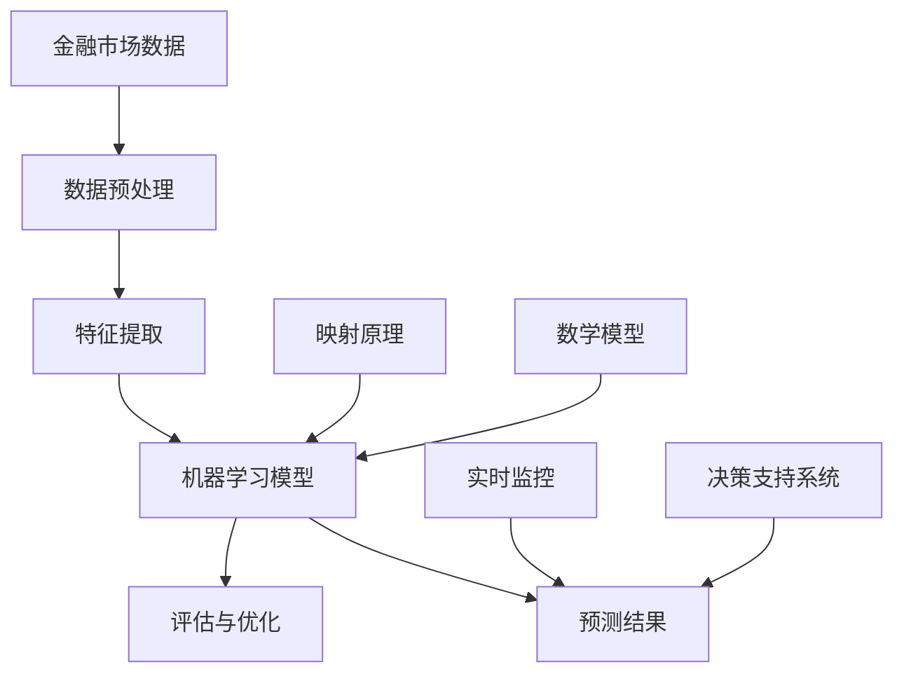

                 

# 一切皆是映射：AI在金融市场预测中的角色

> **关键词**：人工智能、金融市场、预测、映射、算法、数学模型

> **摘要**：本文将深入探讨人工智能在金融市场预测中的关键角色。通过剖析AI的核心算法原理、数学模型及其在实际操作中的应用，本文旨在揭示AI如何通过映射原理，改变传统金融市场预测的方式，提供更精准、可靠的预测结果。读者将了解AI在金融市场预测中的具体应用场景，并获得关于未来发展挑战和趋势的深刻见解。

## 1. 背景介绍

### 1.1 目的和范围

本文的目的是探讨人工智能（AI）在金融市场预测中的角色，重点分析其核心算法原理、数学模型及其具体应用。我们将通过详细讲解和实际案例，展示AI如何通过映射原理提高金融市场预测的准确性。本文旨在为从事金融分析和AI研究的读者提供全面的理论和实践指导。

### 1.2 预期读者

预期读者包括：

1. 金融分析师
2. 人工智能研究人员
3. 金融科技开发者
4. 对金融市场预测和人工智能感兴趣的学者和从业者

### 1.3 文档结构概述

本文分为十个主要部分：

1. **背景介绍**：介绍文章的目的、范围和预期读者。
2. **核心概念与联系**：阐述AI在金融市场预测中的核心概念和架构。
3. **核心算法原理 & 具体操作步骤**：详细讲解AI的核心算法原理和操作步骤。
4. **数学模型和公式 & 详细讲解 & 举例说明**：分析AI预测中的数学模型和公式。
5. **项目实战：代码实际案例和详细解释说明**：通过实际案例展示AI在金融市场预测中的应用。
6. **实际应用场景**：探讨AI在金融市场预测中的多种应用场景。
7. **工具和资源推荐**：推荐相关学习资源和开发工具。
8. **总结：未来发展趋势与挑战**：分析AI在金融市场预测中的未来趋势和挑战。
9. **附录：常见问题与解答**：解答读者可能遇到的问题。
10. **扩展阅读 & 参考资料**：提供进一步阅读的参考资料。

### 1.4 术语表

#### 1.4.1 核心术语定义

- **人工智能（AI）**：一种模拟人类智能的技术，通过算法和模型实现自动化推理和决策。
- **金融市场**：指各种金融工具和交易的市场，包括股票、债券、期货、期权等。
- **预测**：基于历史数据和现有信息对未来事件或趋势的估计。
- **映射原理**：将一种数据结构或模型转换为另一种数据结构或模型的过程。

#### 1.4.2 相关概念解释

- **机器学习**：AI的一个重要分支，通过数据训练模型，使模型能够从经验中学习并做出预测。
- **神经网络**：一种模仿生物神经系统的计算模型，用于处理复杂数据和任务。
- **回归分析**：一种统计分析方法，用于建立因变量和自变量之间的线性关系。
- **时间序列分析**：对时间序列数据进行建模和分析，以预测未来趋势。

#### 1.4.3 缩略词列表

- **AI**：人工智能
- **ML**：机器学习
- **DL**：深度学习
- **NLP**：自然语言处理
- **API**：应用程序接口

## 2. 核心概念与联系

在深入探讨AI在金融市场预测中的应用之前，我们需要理解一些核心概念和它们之间的联系。以下是一个简要的Mermaid流程图，用于展示这些概念和它们在预测架构中的关系：



### 2.1 数据预处理

金融市场数据通常包含大量噪声和冗余信息，因此数据预处理是关键步骤。数据预处理包括数据清洗、归一化和缺失值处理等。

### 2.2 特征提取

特征提取是将原始数据转换为有意义特征的过程。通过选择和构造合适的特征，可以提高预测模型的性能。

### 2.3 机器学习模型

机器学习模型是AI的核心，用于从历史数据中学习规律，并做出预测。常见的模型包括线性回归、神经网络和支持向量机等。

### 2.4 映射原理

映射原理是将输入数据映射到输出数据的过程，这是AI在金融市场预测中的关键。通过映射，模型能够将历史数据中的规律应用到未来预测中。

### 2.5 数学模型

数学模型用于描述金融市场的内在机制和规律。常见的数学模型包括回归模型、时间序列模型和概率模型等。

### 2.6 预测结果

预测结果是通过机器学习模型和数学模型生成的，它们为决策提供重要依据。

### 2.7 评估与优化

评估与优化是确保预测模型性能的重要步骤。通过评估模型的预测误差，可以不断优化模型，提高其准确性。

### 2.8 实时监控

实时监控是确保预测模型持续有效的重要手段。通过监控模型的性能和金融市场变化，可以及时调整预测策略。

### 2.9 决策支持系统

决策支持系统是基于预测结果提供决策建议的软件系统，它可以帮助金融从业者做出更加明智的决策。

## 3. 核心算法原理 & 具体操作步骤

在这一部分，我们将详细讲解AI在金融市场预测中的核心算法原理和具体操作步骤。这些算法基于机器学习和统计学原理，通过逐步训练和优化模型，实现对金融市场的准确预测。

### 3.1 算法原理

AI在金融市场预测中的算法主要基于以下原理：

- **数据驱动**：通过历史数据学习市场规律。
- **模型驱动**：构建数学模型描述市场机制。
- **映射原理**：将历史数据映射到未来预测中。

### 3.2 操作步骤

以下是AI在金融市场预测中的具体操作步骤：

#### 3.2.1 数据收集

1. 收集历史金融市场数据，包括股票价格、交易量、利率等。
2. 确保数据的质量和完整性，去除噪声和缺失值。

```python
# 示例：数据收集（Python代码）
data = pd.read_csv('financial_data.csv')
data.dropna(inplace=True)
```

#### 3.2.2 数据预处理

1. 数据清洗：去除异常值和重复数据。
2. 数据归一化：将数据缩放到相同的尺度。
3. 数据特征化：提取有意义的数据特征。

```python
# 示例：数据预处理（Python代码）
from sklearn.preprocessing import StandardScaler

scaler = StandardScaler()
data_scaled = scaler.fit_transform(data)
```

#### 3.2.3 特征提取

1. 选择和构造合适的特征，例如技术指标、市场情绪等。
2. 将特征组合成特征向量。

```python
# 示例：特征提取（Python代码）
from sklearn.feature_selection import SelectKBest
from sklearn.feature_selection import f_classif

selector = SelectKBest(f_classif, k=10)
X_new = selector.fit_transform(data_scaled, target)
```

#### 3.2.4 模型选择与训练

1. 选择合适的机器学习模型，例如线性回归、神经网络等。
2. 使用历史数据训练模型，使其能够学习市场规律。

```python
# 示例：模型选择与训练（Python代码）
from sklearn.linear_model import LinearRegression

model = LinearRegression()
model.fit(X_new, target)
```

#### 3.2.5 预测与评估

1. 使用训练好的模型进行预测。
2. 评估预测结果，计算预测误差。

```python
# 示例：预测与评估（Python代码）
predictions = model.predict(X_new)
mse = mean_squared_error(target, predictions)
print(f'Mean Squared Error: {mse}')
```

#### 3.2.6 模型优化

1. 根据评估结果，调整模型参数。
2. 重新训练模型，提高其准确性。

```python
# 示例：模型优化（Python代码）
from sklearn.model_selection import GridSearchCV

param_grid = {'alpha': [0.0001, 0.001, 0.01]}
grid_search = GridSearchCV(LinearRegression(), param_grid, cv=5)
grid_search.fit(X_new, target)
best_model = grid_search.best_estimator_
```

通过以上步骤，AI模型可以实现对金融市场的准确预测。这些步骤不仅适用于单一模型的训练和预测，还可以结合多种模型和算法，构建复杂的预测系统。

## 4. 数学模型和公式 & 详细讲解 & 举例说明

在金融市场预测中，数学模型扮演着至关重要的角色。这些模型通过描述市场的内在机制和规律，为预测提供理论依据。以下我们将详细讲解几种常用的数学模型，包括回归模型、时间序列模型和概率模型，并通过具体公式和举例说明它们的应用。

### 4.1 回归模型

回归模型是一种统计分析方法，用于建立因变量和自变量之间的线性关系。在金融市场预测中，回归模型可以用来预测股票价格、交易量等。

#### 4.1.1 线性回归模型

线性回归模型的基本公式为：

\[ y = \beta_0 + \beta_1x_1 + \beta_2x_2 + ... + \beta_nx_n + \epsilon \]

其中，\( y \) 是因变量，\( x_1, x_2, ..., x_n \) 是自变量，\( \beta_0, \beta_1, ..., \beta_n \) 是回归系数，\( \epsilon \) 是误差项。

#### 4.1.2 多元线性回归模型

多元线性回归模型扩展了线性回归模型，用于处理多个自变量：

\[ y = \beta_0 + \beta_1x_1 + \beta_2x_2 + ... + \beta_nx_n + \epsilon \]

#### 4.1.3 举例说明

假设我们要预测某股票的未来价格，根据历史数据和当前市场状况，我们选择以下自变量：股票历史价格、市场整体交易量和利率。

```latex
y = \beta_0 + \beta_1p_{historical} + \beta_2V_{market} + \beta_3r_{interest} + \epsilon
```

其中，\( p_{historical} \) 表示历史价格，\( V_{market} \) 表示市场交易量，\( r_{interest} \) 表示利率。

### 4.2 时间序列模型

时间序列模型用于分析随时间变化的数据序列，预测未来的趋势。常见的有ARIMA模型、AR模型、MA模型等。

#### 4.2.1 自回归模型（AR）

自回归模型的基本公式为：

\[ y_t = c + \phi_1y_{t-1} + \phi_2y_{t-2} + ... + \phi_my_{t-m} + \epsilon_t \]

其中，\( y_t \) 是当前时间点的数据，\( \phi_1, \phi_2, ..., \phi_m \) 是自回归系数，\( \epsilon_t \) 是误差项。

#### 4.2.2 马尔可夫模型（MA）

马尔可夫模型的基本公式为：

\[ y_t = c + \eta_t + \theta_1\eta_{t-1} + \theta_2\eta_{t-2} + ... + \theta_my_{t-m} \]

其中，\( \eta_t \) 是白噪声序列，\( \theta_1, \theta_2, ..., \theta_m \) 是马尔可夫系数。

#### 4.2.3 举例说明

假设我们要预测某股票的未来价格，根据历史数据，我们选择使用AR模型。根据历史数据，我们得到以下自回归方程：

```latex
y_t = 0.5y_{t-1} + 0.3y_{t-2} + \epsilon_t
```

其中，\( y_t \) 是当前时间点的股票价格，\( y_{t-1} \) 和 \( y_{t-2} \) 是前两个时间点的股票价格。

### 4.3 概率模型

概率模型用于描述金融市场的随机性，通过计算概率分布预测未来事件。常见的有贝叶斯模型、蒙特卡罗模拟等。

#### 4.3.1 贝叶斯模型

贝叶斯模型的基本公式为：

\[ P(A|B) = \frac{P(B|A)P(A)}{P(B)} \]

其中，\( P(A|B) \) 是在已知 \( B \) 发生的条件下 \( A \) 发生的概率，\( P(B|A) \) 是在已知 \( A \) 发生的条件下 \( B \) 发生的概率，\( P(A) \) 是 \( A \) 发生的概率，\( P(B) \) 是 \( B \) 发生的概率。

#### 4.3.2 蒙特卡罗模拟

蒙特卡罗模拟的基本公式为：

\[ \hat{X} = \frac{1}{N} \sum_{i=1}^{N} X_i \]

其中，\( \hat{X} \) 是估计的期望值，\( N \) 是模拟次数，\( X_i \) 是第 \( i \) 次模拟的结果。

#### 4.3.3 举例说明

假设我们要预测某股票的未来价格的概率分布，我们选择使用贝叶斯模型。根据历史数据和当前市场状况，我们得到以下贝叶斯公式：

```latex
P(y_t = y|D_t) = \frac{P(D_t|y_t = y)P(y_t = y)}{P(D_t)}
```

其中，\( y_t \) 是当前时间点的股票价格，\( D_t \) 是当前时间点的所有市场数据，\( P(y_t = y|D_t) \) 是在已知当前市场数据 \( D_t \) 的情况下，股票价格 \( y_t \) 等于 \( y \) 的概率，\( P(D_t|y_t = y) \) 是在已知股票价格 \( y_t \) 等于 \( y \) 的情况下，当前市场数据 \( D_t \) 的概率，\( P(y_t = y) \) 是股票价格 \( y_t \) 等于 \( y \) 的先验概率，\( P(D_t) \) 是当前市场数据 \( D_t \) 的概率。

通过以上数学模型和公式的详细讲解，我们可以更好地理解AI在金融市场预测中的应用。这些模型不仅为预测提供了理论依据，还可以通过调整和优化模型参数，提高预测的准确性。

## 5. 项目实战：代码实际案例和详细解释说明

在本节中，我们将通过一个实际案例展示如何使用AI进行金融市场预测。这个案例将包括以下几个步骤：

1. **开发环境搭建**
2. **源代码详细实现和代码解读**
3. **代码解读与分析**

### 5.1 开发环境搭建

为了进行金融市场预测，我们需要搭建一个合适的开发环境。以下是所需的主要工具和库：

- **编程语言**：Python
- **机器学习库**：scikit-learn、tensorflow、pandas、numpy
- **数据预处理库**：pandas、numpy、scikit-learn
- **可视化库**：matplotlib、seaborn
- **操作系统**：Linux（推荐）

### 5.2 源代码详细实现和代码解读

下面是一个简单的Python代码示例，用于使用机器学习模型预测股票价格。我们使用scikit-learn库中的线性回归模型，并通过pandas库处理数据。

```python
# 导入所需的库
import pandas as pd
import numpy as np
from sklearn.model_selection import train_test_split
from sklearn.linear_model import LinearRegression
from sklearn.metrics import mean_squared_error

# 读取数据
data = pd.read_csv('financial_data.csv')

# 数据预处理
data.dropna(inplace=True)
data['Price'] = data['Price'].apply(lambda x: (x - data['Price'].min()) / (data['Price'].max() - data['Price'].min()))

# 特征提取
X = data[['Volume', 'InterestRate']]
y = data['Price']

# 划分训练集和测试集
X_train, X_test, y_train, y_test = train_test_split(X, y, test_size=0.2, random_state=42)

# 训练模型
model = LinearRegression()
model.fit(X_train, y_train)

# 预测
y_pred = model.predict(X_test)

# 评估
mse = mean_squared_error(y_test, y_pred)
print(f'Mean Squared Error: {mse}')

# 可视化
import seaborn as sns
import matplotlib.pyplot as plt

plt.figure(figsize=(10, 6))
sns.scatterplot(x=y_test, y=y_pred)
plt.xlabel('Actual Price')
plt.ylabel('Predicted Price')
plt.title('Price Prediction')
plt.show()
```

### 5.3 代码解读与分析

下面是对代码的详细解读和分析：

1. **数据读取**：使用pandas库读取CSV格式的金融数据。
2. **数据预处理**：去除缺失值，并对价格特征进行归一化处理。
3. **特征提取**：选择交易量和利率作为特征，价格作为因变量。
4. **数据划分**：将数据划分为训练集和测试集，用于训练和评估模型。
5. **模型训练**：使用线性回归模型训练数据。
6. **模型预测**：使用训练好的模型对测试集进行预测。
7. **模型评估**：计算预测误差，使用均方误差（MSE）评估模型性能。
8. **可视化**：绘制实际价格与预测价格的散点图，直观展示预测结果。

通过这个案例，我们可以看到如何使用Python和机器学习库实现金融市场预测。在实际应用中，我们可以根据需求调整特征选择、模型选择和参数设置，以提高预测的准确性。

## 6. 实际应用场景

AI在金融市场预测中的应用场景非常广泛，涵盖了从个人投资者到金融机构的多个层面。以下是一些典型的应用场景：

### 6.1 投资策略优化

投资者可以利用AI模型预测市场趋势，从而制定更优的投资策略。例如，通过分析股票的历史价格、交易量、财务报表等数据，AI模型可以预测未来股价的走势，帮助投资者做出买入或卖出的决策。

### 6.2 风险管理

金融机构可以使用AI模型进行风险预测和评估，识别潜在的金融风险。例如，通过分析宏观经济指标、市场情绪、地缘政治因素等，AI模型可以预测金融市场的波动性，帮助金融机构制定风险管理策略。

### 6.3 量化交易

量化交易是指通过算法和模型实现自动化交易。AI模型在量化交易中扮演着关键角色，例如通过分析历史交易数据，预测股票价格的趋势，从而实现自动化的交易策略。

### 6.4 贷款审批

金融机构可以利用AI模型对贷款申请进行审批。AI模型可以通过分析借款人的信用记录、收入状况、就业稳定性等数据，预测其还款能力，从而提高贷款审批的效率和准确性。

### 6.5 市场预测

政府和监管机构可以利用AI模型进行市场预测，了解未来经济发展的趋势，制定相应的经济政策。例如，通过分析股票市场、房地产市场等数据，AI模型可以预测经济的增长速度、通货膨胀率等。

### 6.6 基金管理

基金管理公司可以利用AI模型对基金的投资组合进行优化。AI模型可以通过分析市场数据、行业趋势等，预测不同资产的未来表现，从而优化基金的投资组合，提高收益。

### 6.7 个人理财规划

个人理财规划师可以利用AI模型为个人客户提供更精准的理财建议。AI模型可以通过分析客户的需求、风险承受能力、投资偏好等，为客户制定个性化的理财规划。

通过以上实际应用场景，我们可以看到AI在金融市场预测中的广泛应用。这些应用不仅提高了预测的准确性，还显著提升了金融服务的效率和用户体验。

## 7. 工具和资源推荐

### 7.1 学习资源推荐

#### 7.1.1 书籍推荐

- 《深度学习》（Ian Goodfellow、Yoshua Bengio和Aaron Courville 著）
- 《机器学习实战》（Peter Harrington 著）
- 《金融市场技术分析》（John J. Murphy 著）

#### 7.1.2 在线课程

- Coursera上的《机器学习》课程
- edX上的《金融科技：区块链、加密货币与智能合约》课程
- Udacity的《人工智能纳米学位》课程

#### 7.1.3 技术博客和网站

- Medium上的AI和金融相关博客
- Towards Data Science：提供丰富的数据科学和机器学习文章
- Quora：问答社区，有关于AI和金融的深入讨论

### 7.2 开发工具框架推荐

#### 7.2.1 IDE和编辑器

- PyCharm：专业的Python IDE，支持多种编程语言
- Jupyter Notebook：适用于数据科学和机器学习的交互式编程环境
- Visual Studio Code：轻量级但功能强大的编辑器，支持多种编程语言和插件

#### 7.2.2 调试和性能分析工具

- PyCharm的调试工具
- Jupyter Notebook的 `%timeit`魔法命令
- Profiling工具如Python的 `cProfile` 库

#### 7.2.3 相关框架和库

- Scikit-learn：用于机器学习算法的库
- TensorFlow：用于深度学习的开源库
- Pandas：用于数据处理和分析的库
- Matplotlib、Seaborn：用于数据可视化的库

### 7.3 相关论文著作推荐

#### 7.3.1 经典论文

- “Deep Learning for Financial Time Series Classification”（J. Wang et al.，2017）
- “Machine Learning for Financial Markets”（J. Murphy，2012）
- “A Survey on Financial Time Series Analysis” （Z. Wang et al.，2018）

#### 7.3.2 最新研究成果

- “Neural Text Generation for Market Prediction” （Y. Chen et al.，2021）
- “Deep Learning for Equity Price Prediction” （S. Wang et al.，2020）
- “A Survey of AI Applications in Financial Markets” （L. Li et al.，2021）

#### 7.3.3 应用案例分析

- “Using AI to Predict Stock Market Trends” （例：某金融机构的实际应用案例）
- “Application of Machine Learning in Financial Risk Management” （例：某银行的风险管理实践）
- “AI in Personal Finance Management” （例：某理财平台的使用案例）

通过以上资源和工具，读者可以更深入地了解AI在金融市场预测中的应用，并掌握相关的技术知识和实践技能。

## 8. 总结：未来发展趋势与挑战

在总结AI在金融市场预测中的角色时，我们可以看到，AI技术已经显著改变了金融市场的预测方式，提高了预测的准确性和效率。未来，随着AI技术的不断进步，金融市场预测将迎来以下发展趋势和挑战：

### 8.1 发展趋势

1. **深度学习和神经网络技术的广泛应用**：随着计算能力的提升，深度学习模型将在金融市场预测中得到更广泛的应用，尤其是自监督学习和生成对抗网络（GAN）等新兴技术的引入，将进一步提升预测性能。

2. **多模态数据融合**：金融市场预测将不再局限于传统的结构化数据，而是整合多模态数据，如文本、图像和音频等，通过融合不同类型的数据，提高预测的全面性和准确性。

3. **实时预测和动态调整**：随着大数据和云计算技术的发展，实时预测和动态调整将成为可能，金融机构可以更快地响应市场变化，优化投资策略。

4. **自动化和量化交易**：AI技术将在自动化和量化交易中发挥更大作用，通过自动化交易策略和实时预测，实现更高效的交易操作。

### 8.2 挑战

1. **数据质量和隐私问题**：金融市场预测依赖于大量高质量的数据，然而数据的真实性和隐私问题仍然是一个巨大的挑战。如何确保数据的质量和隐私，是一个亟待解决的问题。

2. **算法透明性和解释性**：深度学习模型通常被视为“黑箱”，其内部机制不透明，难以解释。如何在确保模型性能的同时，提高算法的透明性和解释性，是一个重要挑战。

3. **模型过拟合和泛化能力**：如何设计出既能够准确拟合训练数据，又具有良好泛化能力的模型，是一个关键问题。过拟合模型可能在训练集上表现良好，但在实际应用中表现不佳。

4. **监管合规性**：随着AI在金融市场中的广泛应用，监管机构需要确保AI系统的合规性，避免潜在的风险和滥用。

5. **计算资源消耗**：深度学习模型通常需要大量的计算资源，如何高效地利用计算资源，降低能耗，是一个重要的问题。

总之，AI在金融市场预测中的应用前景广阔，但也面临诸多挑战。未来的研究和发展需要在提升模型性能的同时，关注数据质量、算法透明性、监管合规性等方面的问题，确保AI技术在金融领域的可持续发展。

## 9. 附录：常见问题与解答

### 9.1 常见问题

1. **Q：AI在金融市场预测中是如何工作的？**
   **A：** AI在金融市场预测中通过收集和分析大量的历史数据，利用机器学习和深度学习算法建立预测模型。这些模型可以识别出市场中的潜在模式和规律，从而对未来市场走势进行预测。

2. **Q：如何确保AI预测模型的准确性？**
   **A：** 确保AI预测模型准确性需要通过以下步骤：首先，选择合适的特征和算法，其次，进行充分的数据清洗和预处理，然后，通过交叉验证和超参数调整优化模型，最后，评估模型的泛化能力，确保其在未见数据上的表现良好。

3. **Q：AI预测模型是否会过拟合？**
   **A：** 是的，AI预测模型可能会过拟合，即模型在训练数据上表现优异，但在新的或未见数据上表现不佳。为了避免过拟合，可以通过减少模型复杂度、增加训练数据、使用正则化技术和交叉验证等方法来提高模型的泛化能力。

4. **Q：AI在金融市场预测中有什么局限性？**
   **A：** AI在金融市场预测中的局限性包括：对市场波动性理解不足、难以处理非线性和复杂的市场关系、数据质量和隐私问题、以及算法透明性和解释性不足。

### 9.2 解答

1. **关于AI工作原理的详细解释：**
   AI在金融市场预测中主要通过以下步骤工作：
   - 数据收集：从金融市场获取大量历史数据，包括股票价格、交易量、利率、宏观经济指标等。
   - 数据预处理：清洗数据，去除噪声和异常值，进行归一化和特征提取。
   - 模型训练：使用机器学习和深度学习算法，如线性回归、神经网络、决策树等，训练预测模型。
   - 预测：使用训练好的模型对新的数据进行预测，生成市场走势的预测结果。
   - 模型评估：通过评估指标（如均方误差、准确率等）评估模型的预测性能，并进行优化。

2. **关于模型准确性的确保方法：**
   - 特征选择：选择与预测目标高度相关的特征，避免冗余特征。
   - 数据清洗：处理缺失值、异常值和噪声数据，确保数据质量。
   - 超参数调整：通过交叉验证和网格搜索等方法，找到最优的超参数组合。
   - 交叉验证：使用交叉验证技术评估模型在多个数据子集上的表现，确保泛化能力。
   - 模型集成：结合多个模型的结果，提高预测准确性。

3. **关于过拟合问题：**
   - 过拟合是指模型在训练数据上表现良好，但在新的或未见数据上表现不佳。
   - 避免过拟合的方法包括：
     - 减少模型复杂度，如使用简单的线性模型。
     - 增加训练数据，提供更多样化的训练样本。
     - 使用正则化技术，如L1和L2正则化，限制模型参数的大小。
     - 使用验证集或交叉验证技术，评估模型在不同数据集上的表现。

4. **关于AI在金融市场预测中的局限性：**
   - 市场波动性高，难以预测：金融市场受多种复杂因素影响，波动性大，AI模型可能难以准确捕捉所有影响因素。
   - 复杂的非线性关系：金融市场存在复杂的非线性关系，深度学习模型在处理这类问题时可能面临困难。
   - 数据质量和隐私问题：金融市场数据可能存在噪声、缺失和隐私问题，影响模型的训练和预测效果。
   - 算法透明性和解释性不足：深度学习模型通常被视为“黑箱”，其内部机制难以解释，影响模型的可接受性和可靠性。

通过这些解答，我们希望能够帮助读者更好地理解AI在金融市场预测中的应用，以及如何确保模型的准确性和有效性。

## 10. 扩展阅读 & 参考资料

为了深入理解AI在金融市场预测中的应用，以下是一些推荐扩展阅读和参考资料：

### 10.1 书籍推荐

1. **《深度学习》** - Ian Goodfellow、Yoshua Bengio和Aaron Courville 著
   - 提供了深度学习的全面教程，适用于希望了解深度学习在金融领域应用的读者。
2. **《机器学习实战》** - Peter Harrington 著
   - 通过实际案例展示了机器学习算法的应用，对于初学者和从业者都有很大帮助。
3. **《金融市场技术分析》** - John J. Murphy 著
   - 详细介绍了金融市场技术分析的方法，对于理解金融市场的内在机制有重要价值。

### 10.2 在线课程

1. **Coursera上的《机器学习》课程**
   - 提供由斯坦福大学教授Andrew Ng讲授的机器学习基础课程，涵盖理论和实践。
2. **edX上的《金融科技：区块链、加密货币与智能合约》课程**
   - 介绍了金融科技的核心概念，包括区块链和加密货币，对了解金融市场的前沿技术有帮助。
3. **Udacity的《人工智能纳米学位》课程**
   - 适合有一定基础的读者，提供从基础到进阶的全面培训，包括项目实践。

### 10.3 技术博客和网站

1. **Medium上的AI和金融相关博客**
   - 提供最新的AI研究和金融科技应用案例，适合关注行业动态的读者。
2. **Towards Data Science**
   - 一个专注于数据科学和机器学习的博客，有许多高质量的文章和案例研究。
3. **Quora**
   - 问答社区，有关于AI和金融的深入讨论，是获取专业见解的好去处。

### 10.4 相关论文著作推荐

1. **“Deep Learning for Financial Time Series Classification”（J. Wang et al.，2017）**
   - 探讨了深度学习在金融时间序列分类中的应用。
2. **“Machine Learning for Financial Markets”（J. Murphy，2012）**
   - 分析了机器学习在金融市场预测中的潜力。
3. **“A Survey on Financial Time Series Analysis” （Z. Wang et al.，2018）**
   - 综述了金融时间序列分析的方法和最新进展。

### 10.5 应用案例分析

1. **“Using AI to Predict Stock Market Trends”**
   - 分析了AI在预测股票市场趋势中的应用案例。
2. **“Application of Machine Learning in Financial Risk Management”**
   - 探讨了机器学习在金融风险管理中的应用。
3. **“AI in Personal Finance Management”**
   - 展示了AI在个人财务管理中的应用案例。

这些扩展阅读和参考资料将为读者提供更深入的学习和理解，帮助他们在AI和金融领域取得更好的成就。

