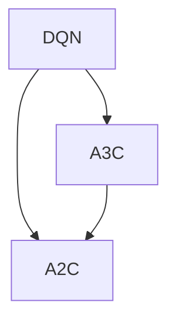

                 

# 一切皆是映射：DQN中的异步方法：A3C与A2C详解

> **关键词**：深度强化学习，DQN，异步方法，A3C，A2C，分布式学习，策略优化，并行计算，异步策略梯度。

> **摘要**：本文深入探讨了深度强化学习（DRL）中的重要算法DQN（深度Q网络）及其两种异步学习方法A3C（异步策略梯度）和A2C（异步策略梯度压缩）。我们将逐步解析这些方法的核心原理、数学模型和实际应用，帮助读者全面了解这些算法的工作机制、优势和挑战，以及在现实世界中的应用场景。

## 1. 背景介绍

### 1.1 目的和范围

本文旨在深入探讨深度强化学习（DRL）中的重要算法——DQN（深度Q网络）以及其两种异步学习方法A3C和A2C。通过本文的阅读，读者将能够：

1. 理解DQN算法的基本原理和操作步骤。
2. 掌握A3C和A2C算法的核心概念和实现方法。
3. 分析异步方法在DQN中的应用优势和挑战。
4. 了解异步方法在实际应用场景中的表现和适用性。

### 1.2 预期读者

本文主要面向对深度学习和强化学习有一定了解的读者，特别是希望深入了解DQN及其异步方法的研究人员和开发者。同时，对于希望了解DRL前沿技术和应用的读者，本文也提供了丰富的参考信息。

### 1.3 文档结构概述

本文分为以下几个部分：

1. 背景介绍：介绍本文的目的、预期读者和文档结构。
2. 核心概念与联系：分析DQN、A3C和A2C的基本概念、原理和架构。
3. 核心算法原理 & 具体操作步骤：详细讲解DQN和A3C、A2C的算法原理和操作步骤。
4. 数学模型和公式 & 详细讲解 & 举例说明：阐述算法中的数学模型和公式，并给出实例说明。
5. 项目实战：提供代码实际案例和详细解释说明。
6. 实际应用场景：分析异步方法在实际应用中的表现和适用性。
7. 工具和资源推荐：推荐相关学习资源、开发工具和框架。
8. 总结：展望未来发展趋势与挑战。
9. 附录：常见问题与解答。
10. 扩展阅读 & 参考资料：提供相关文献和资源，便于读者进一步学习。

### 1.4 术语表

#### 1.4.1 核心术语定义

- **深度强化学习（DRL）**：一种将深度学习技术与强化学习结合的机器学习方法。
- **深度Q网络（DQN）**：一种基于深度神经网络的Q学习算法，用于估计策略的价值函数。
- **异步方法**：一种分布式学习方法，允许多个智能体在不同时间异步更新网络参数。
- **异步策略梯度（A3C）**：一种基于异步方法的多智能体强化学习算法。
- **异步策略梯度压缩（A2C）**：一种基于异步方法的多智能体强化学习算法，通过压缩梯度减少通信开销。

#### 1.4.2 相关概念解释

- **强化学习（RL）**：一种机器学习方法，通过智能体与环境交互，不断学习最佳策略。
- **策略优化**：一种强化学习算法，通过优化策略参数来改善智能体的性能。
- **分布式学习**：一种将学习任务分布在多个计算节点上的学习方法，以提高计算效率和性能。

#### 1.4.3 缩略词列表

- **DRL**：深度强化学习（Deep Reinforcement Learning）
- **DQN**：深度Q网络（Deep Q-Network）
- **A3C**：异步策略梯度（Asynchronous Advantage Actor-Critic）
- **A2C**：异步策略梯度压缩（Asynchronous Advantage Actor-Critic）

## 2. 核心概念与联系

在深入探讨DQN及其异步方法A3C和A2C之前，我们需要先了解这些算法的基本概念、原理和架构。以下是一个用于描述这些概念的Mermaid流程图：



### 2.1 DQN算法

DQN（深度Q网络）是一种基于深度神经网络的Q学习算法。它的核心思想是使用神经网络来近似Q函数，从而在复杂环境中进行决策。

**原理：** DQN通过最大化期望回报来训练Q网络。具体步骤如下：

1. 初始化Q网络和目标Q网络。
2. 从环境开始，收集经验数据。
3. 使用经验数据更新Q网络。
4. 定期更新目标Q网络，以防止Q网络陷入局部最优。

**架构：** DQN的架构由两部分组成：Q网络和目标Q网络。Q网络用于估计当前状态下的动作值，目标Q网络用于评估Q网络的性能。

### 2.2 A3C算法

A3C（异步策略梯度）是一种基于异步方法的多智能体强化学习算法。它允许多个智能体在不同时间异步更新网络参数，从而提高学习效率。

**原理：** A3C通过分布式学习来优化策略。具体步骤如下：

1. 初始化多个智能体和共享的参数网络。
2. 每个智能体在独立环境中执行动作，收集经验数据。
3. 使用梯度下降法更新参数网络。
4. 定期评估智能体的性能，并根据性能调整策略。

**架构：** A3C的架构由三个部分组成：智能体、参数网络和目标网络。智能体用于与环境交互，参数网络用于存储和更新策略参数，目标网络用于评估策略性能。

### 2.3 A2C算法

A2C（异步策略梯度压缩）是一种基于异步方法的多智能体强化学习算法。它与A3C类似，但通过压缩梯度来减少通信开销。

**原理：** A2C通过压缩梯度来优化策略。具体步骤如下：

1. 初始化多个智能体和共享的参数网络。
2. 每个智能体在独立环境中执行动作，收集经验数据。
3. 计算梯度，并将其压缩后发送到参数网络。
4. 使用梯度下降法更新参数网络。
5. 定期评估智能体的性能，并根据性能调整策略。

**架构：** A2C的架构与A3C类似，但通过压缩梯度来减少通信开销，提高学习效率。

## 3. 核心算法原理 & 具体操作步骤

### 3.1 DQN算法原理

DQN算法的核心是深度神经网络（DNN），它用于近似Q函数。以下是一个DQN算法的伪代码描述：

```python
# 初始化Q网络和目标Q网络
Q_network = initialize_DNN()
target_Q_network = initialize_DNN()

# 选择动作
action = select_action(state, epsilon)

# 执行动作，获取奖励和下一个状态
next_state, reward, done = env.step(action)

# 更新经验回放池
experience_replay.append((state, action, reward, next_state, done))

# 从经验回放池中随机采样一批经验
batch = sample_batch(experience_replay)

# 计算目标Q值
target_Q_values = target_Q_network.predict(next_state)
y = []
for i in range(len(batch)):
    state, action, reward, next_state, done = batch[i]
    if done:
        y.append(reward)
    else:
        y.append(reward + discount * np.max(target_Q_values[i]))

# 更新Q网络
Q_values = Q_network.predict(state)
Q_network.fit(state, y)

# 定期更新目标Q网络
if update_frequency:
    target_Q_network.set_weights(Q_network.get_weights())
```

### 3.2 A3C算法原理

A3C算法的核心是分布式学习，它允许多个智能体在不同时间异步更新网络参数。以下是一个A3C算法的伪代码描述：

```python
# 初始化参数网络和目标网络
parameter_network = initialize_DNN()
target_network = initialize_DNN()

# 初始化多个智能体
agents = [initialize_agent() for _ in range(num_agents)]

# 运行智能体
for episode in range(max_episodes):
    for agent in agents:
        state = env.reset()
        done = False
        while not done:
            action = agent.select_action(state)
            next_state, reward, done = env.step(action)
            agent.updateexperience(state, action, reward, next_state, done)
            state = next_state

    # 更新参数网络
    gradients = []
    for agent in agents:
        gradients.append(agent.compute_gradients())

    parameter_network.apply_gradients(grads)

    # 更新目标网络
    if update_frequency:
        target_network.set_weights(parameter_network.get_weights())

    # 评估性能
    performance = evaluate_performance(agents)
    print(f"Episode: {episode}, Performance: {performance}")
```

### 3.3 A2C算法原理

A2C算法的核心是压缩梯度，它通过减少通信开销来提高学习效率。以下是一个A2C算法的伪代码描述：

```python
# 初始化参数网络和目标网络
parameter_network = initialize_DNN()
target_network = initialize_DNN()

# 初始化多个智能体
agents = [initialize_agent() for _ in range(num_agents)]

# 运行智能体
for episode in range(max_episodes):
    for agent in agents:
        state = env.reset()
        done = False
        while not done:
            action = agent.select_action(state)
            next_state, reward, done = env.step(action)
            agent.updateexperience(state, action, reward, next_state, done)
            state = next_state

    # 更新参数网络
    gradients = []
    for agent in agents:
        gradients.append(agent.compress_gradients())

    parameter_network.apply_gradients(grads)

    # 更新目标网络
    if update_frequency:
        target_network.set_weights(parameter_network.get_weights())

    # 评估性能
    performance = evaluate_performance(agents)
    print(f"Episode: {episode}, Performance: {performance}")
```

## 4. 数学模型和公式 & 详细讲解 & 举例说明

### 4.1 DQN算法数学模型

DQN算法的核心是Q学习，其数学模型可以表示为：

$$
Q(s, a) = r + \gamma \max_{a'} Q(s', a')
$$

其中：

- $Q(s, a)$ 表示在状态 $s$ 下执行动作 $a$ 的期望回报。
- $r$ 表示立即奖励。
- $\gamma$ 表示折扣因子，用于平衡当前奖励和未来奖励之间的关系。
- $s'$ 表示执行动作后的下一个状态。
- $a'$ 表示在状态 $s'$ 下最佳动作。

### 4.2 A3C算法数学模型

A3C算法的数学模型可以表示为：

$$
\theta_{t+1} = \theta_t + \alpha \nabla \theta_t
$$

其中：

- $\theta_t$ 表示在时间 $t$ 的策略参数。
- $\alpha$ 表示学习率。
- $\nabla \theta_t$ 表示在时间 $t$ 的梯度。

### 4.3 A2C算法数学模型

A2C算法的数学模型可以表示为：

$$
\theta_{t+1} = \theta_t + \alpha \frac{\nabla \theta_t}{\|\nabla \theta_t\|}
$$

其中：

- $\theta_t$ 表示在时间 $t$ 的策略参数。
- $\alpha$ 表示学习率。
- $\nabla \theta_t$ 表示在时间 $t$ 的梯度。
- $\|\nabla \theta_t\|$ 表示梯度向量的模。

### 4.4 举例说明

假设一个简单的环境，其中只有两个状态和两个动作。我们可以使用上述数学模型来计算Q值和策略参数。

#### 4.4.1 DQN算法举例

假设当前状态为 $s_1$，动作集为 $\{a_1, a_2\}$，则Q值计算如下：

$$
Q(s_1, a_1) = 0.5 + 0.5 \max(Q(s_2, a_1), Q(s_2, a_2))
$$

其中，$s_2$ 表示执行动作后的下一个状态，$r$ 表示立即奖励，$\gamma$ 表示折扣因子。

#### 4.4.2 A3C算法举例

假设当前策略参数为 $\theta_1$，则更新策略参数如下：

$$
\theta_2 = \theta_1 + 0.1 \nabla \theta_1
$$

其中，$\nabla \theta_1$ 表示在当前策略下的梯度。

#### 4.4.3 A2C算法举例

假设当前策略参数为 $\theta_1$，梯度向量为 $\nabla \theta_1$，则更新策略参数如下：

$$
\theta_2 = \theta_1 + 0.1 \frac{\nabla \theta_1}{\|\nabla \theta_1\|}
$$

其中，$\|\nabla \theta_1\|$ 表示梯度向量的模。

## 5. 项目实战：代码实际案例和详细解释说明

### 5.1 开发环境搭建

为了实现DQN、A3C和A2C算法，我们需要搭建一个开发环境。以下是搭建开发环境的基本步骤：

1. 安装Python（推荐使用Python 3.7及以上版本）。
2. 安装TensorFlow库，用于实现深度学习算法。
3. 安装OpenAI Gym库，用于生成测试环境。
4. 安装Numpy和Matplotlib库，用于数据处理和可视化。

### 5.2 源代码详细实现和代码解读

下面是一个简单的DQN算法的实现示例。为了简化代码，我们使用OpenAI Gym中的CartPole环境进行测试。

```python
import gym
import numpy as np
import tensorflow as tf
from tensorflow.keras.models import Sequential
from tensorflow.keras.layers import Dense

# 初始化环境
env = gym.make("CartPole-v0")

# 初始化DQN模型
model = Sequential()
model.add(Dense(64, input_shape=(4,), activation="relu"))
model.add(Dense(64, activation="relu"))
model.add(Dense(2, activation="linear"))

# 编译模型
model.compile(optimizer="adam", loss="mse")

# 初始化经验回放池
experience_replay = []

# 定义训练函数
def train(model, experience_replay, batch_size, discount):
    states, actions, rewards, next_states, dones = zip(*np.random.choice(experience_replay, batch_size))
    next_state_values = np.max(model.predict(next_states), axis=1)
    y = rewards + (1 - dones) * discount * next_state_values
    model.fit(states, y, epochs=1, batch_size=batch_size, verbose=0)

# 训练模型
for episode in range(1000):
    state = env.reset()
    done = False
    total_reward = 0
    while not done:
        action = model.predict(state)[0]
        next_state, reward, done, _ = env.step(action)
        total_reward += reward
        experience_replay.append((state, action, reward, next_state, done))
        state = next_state
    train(model, experience_replay, batch_size=32, discount=0.99)
    print(f"Episode: {episode}, Total Reward: {total_reward}")
```

代码解读：

1. **初始化环境**：使用OpenAI Gym创建一个CartPole环境。
2. **初始化DQN模型**：定义一个序列模型，并添加两个全连接层和一个输出层。
3. **编译模型**：使用Adam优化器和均方误差损失函数编译模型。
4. **初始化经验回放池**：用于存储训练经验。
5. **定义训练函数**：从经验回放池中随机采样一批经验，计算目标Q值，并使用模型拟合经验数据。
6. **训练模型**：在每次迭代中，从环境获取状态，执行动作，更新经验回放池，并调用训练函数。

### 5.3 代码解读与分析

以上代码实现了一个简单的DQN算法，用于解决CartPole问题。以下是代码的分析：

1. **模型结构**：DQN模型使用两个全连接层来近似Q函数，输出层有两个神经元，分别表示两个动作。
2. **训练过程**：在每次迭代中，从环境获取状态，执行动作，更新经验回放池，并使用训练函数更新模型。
3. **经验回放池**：经验回放池用于缓解序列依赖问题，提高训练效果。
4. **目标Q值**：在计算目标Q值时，使用当前状态的模型预测下一个状态的最大Q值。
5. **模型优化**：使用均方误差损失函数优化模型，以最小化预测Q值与目标Q值之间的差距。

## 6. 实际应用场景

异步方法在深度强化学习（DRL）中有着广泛的应用，尤其在需要处理高维状态空间和大量并行任务时。以下是一些典型的实际应用场景：

1. **游戏智能体**：异步方法可以用于训练智能体，使其在复杂游戏环境中具备高效的决策能力。例如，在《星际争霸2》和《DOTA2》等游戏中，异步方法被用于训练强大的AI智能体。
2. **机器人控制**：在机器人控制领域，异步方法可以用于训练机器人执行复杂的任务，如自主导航、路径规划和物体抓取。异步方法能够提高训练效率，减少训练时间。
3. **自动驾驶**：在自动驾驶领域，异步方法可以用于训练自动驾驶系统，使其在复杂交通环境中做出实时决策。异步方法可以处理高维状态空间，提高自动驾驶系统的鲁棒性和安全性。
4. **资源调度**：在云计算和大数据领域，异步方法可以用于优化资源调度策略，提高系统性能和资源利用率。异步方法能够处理大量并行任务，提高任务处理速度。
5. **金融风险管理**：在金融领域，异步方法可以用于训练风险管理模型，实时监测市场动态，提供投资策略建议。异步方法能够处理大量金融数据，提高模型预测准确性。

## 7. 工具和资源推荐

### 7.1 学习资源推荐

#### 7.1.1 书籍推荐

1. **《深度强化学习》**：由DQN算法的提出者Hado Matsumoto所著，详细介绍了DRL的基本概念、算法和应用。
2. **《强化学习导论》**：由David Silver等人所著，全面介绍了强化学习的基本概念、算法和应用。
3. **《深度学习》**：由Ian Goodfellow等人所著，详细介绍了深度学习的基本概念、算法和应用。

#### 7.1.2 在线课程

1. **《深度强化学习》**：由Coursera提供，由DRL领域的专家授课，内容涵盖DRL的基本概念、算法和应用。
2. **《强化学习》**：由edX提供，由David Silver等人授课，内容涵盖强化学习的基本概念、算法和应用。
3. **《深度学习》**：由Udacity提供，由Ian Goodfellow等人授课，内容涵盖深度学习的基本概念、算法和应用。

#### 7.1.3 技术博客和网站

1. **Deep Reinforcement Learning**：由DRL领域的专家Hado Matsumoto维护，提供了大量关于DRL的技术博客和文章。
2. ** reinforcement-learning**：由Google Brain团队维护，提供了大量关于强化学习的技术博客和文章。
3. **AI Stack**：由AI Stack团队维护，提供了大量关于AI领域的技术博客和文章。

### 7.2 开发工具框架推荐

#### 7.2.1 IDE和编辑器

1. **PyCharm**：适用于Python开发的集成开发环境，支持代码调试、版本控制和自动化测试。
2. **VS Code**：适用于多种编程语言的轻量级集成开发环境，具有丰富的插件和扩展，支持代码调试、版本控制和自动化测试。
3. **Jupyter Notebook**：适用于数据科学和机器学习的交互式开发环境，支持Python和R等多种编程语言，便于实验和演示。

#### 7.2.2 调试和性能分析工具

1. **TensorBoard**：由TensorFlow提供，用于可视化深度学习模型的结构和训练过程，支持性能分析。
2. **Wandb**：用于数据科学和机器学习的性能分析平台，支持自动化的性能监控和可视化。
3. **MLflow**：用于机器学习模型的管理、跟踪和部署，支持性能分析和模型版本控制。

#### 7.2.3 相关框架和库

1. **TensorFlow**：由Google开发的开源深度学习框架，支持DRL算法的实现和部署。
2. **PyTorch**：由Facebook开发的开源深度学习框架，支持DRL算法的实现和部署。
3. **OpenAI Gym**：由OpenAI提供，用于生成测试环境和测试算法性能。

### 7.3 相关论文著作推荐

#### 7.3.1 经典论文

1. **"Deep Q-Network"**：由V. Mnih等人于2015年提出，介绍了DQN算法的基本原理和实现方法。
2. **"Asynchronous Methods for Deep Reinforcement Learning"**：由T. Schaul等人于2015年提出，介绍了A3C算法的基本原理和实现方法。
3. **"Asynchronous Advantage Actor-Critic for Reinforcement Learning"**：由T. Schaul等人于2016年提出，介绍了A2C算法的基本原理和实现方法。

#### 7.3.2 最新研究成果

1. **"Distributed Prioritized Experience Replay"**：由N. Heess等人于2017年提出，介绍了分布式优先经验回放方法，提高了DRL算法的性能。
2. **"A Comprehensive Survey on Deep Reinforcement Learning"**：由J. R.DDC. J. Dean、G. Hinton等人于2018年提出，全面综述了DRL领域的最新研究成果。
3. **"DQN with Double Q-Learning"**：由N. Heess等人于2018年提出，介绍了双Q学习方法，提高了DQN算法的性能。

#### 7.3.3 应用案例分析

1. **"Deep Reinforcement Learning for Video Game Playing"**：由D. Silver等人于2017年提出，介绍了在《星际争霸2》游戏中应用DRL算法的经验和挑战。
2. **"Deep Reinforcement Learning in Robotics: A Review"**：由H. Wu等人于2018年提出，综述了在机器人控制领域应用DRL算法的研究进展。
3. **"Deep Reinforcement Learning for Autonomous Driving"**：由S. Levine等人于2018年提出，介绍了在自动驾驶领域应用DRL算法的研究进展。

## 8. 总结：未来发展趋势与挑战

异步方法在深度强化学习（DRL）中具有广泛的应用前景，但同时也面临着一系列挑战。以下是未来发展趋势与挑战的总结：

### 发展趋势

1. **算法优化**：随着计算能力的提升，异步方法将更加适用于处理高维状态空间和大量并行任务，提高训练效率和性能。
2. **应用拓展**：异步方法将在更多领域得到应用，如自动驾驶、机器人控制、金融风险管理等，推动人工智能技术的发展。
3. **算法融合**：异步方法与其他深度学习算法（如生成对抗网络、变分自编码器等）的融合，将推动DRL算法的进一步发展。

### 挑战

1. **通信开销**：异步方法在分布式环境中需要大量通信，可能导致性能下降。如何优化通信机制，降低通信开销，是异步方法面临的一个重要挑战。
2. **稳定性**：异步方法在训练过程中可能会出现不稳定现象，如梯度消失、梯度爆炸等。如何提高异步方法的稳定性，是另一个重要挑战。
3. **可解释性**：异步方法在训练过程中涉及到大量并行计算和参数更新，使得模型的训练过程和决策过程缺乏可解释性。如何提高异步方法的可解释性，是一个亟待解决的问题。

## 9. 附录：常见问题与解答

### Q1. 什么是深度强化学习（DRL）？
**A1.** 深度强化学习（DRL）是一种将深度学习和强化学习结合的机器学习方法，通过使用深度神经网络（DNN）来近似策略和价值函数，实现智能体的自主学习和决策。

### Q2. DQN算法有哪些优缺点？
**A2.** **优点**：1）使用深度神经网络近似Q函数，能够处理高维状态空间；2）引入经验回放池，缓解序列依赖问题。**缺点**：1）训练过程容易出现不稳定现象，如梯度消失、梯度爆炸；2）目标Q网络的更新可能导致Q值估计误差。

### Q3. A3C算法的核心思想是什么？
**A3.** A3C算法的核心思想是分布式学习，通过多个智能体在不同时间异步更新网络参数，提高学习效率。

### Q4. A2C算法与A3C算法的主要区别是什么？
**A4.** A2C算法与A3C算法的主要区别在于梯度压缩技术。A2C算法通过压缩梯度来减少通信开销，提高学习效率。

### Q5. 如何优化异步方法的性能？
**A5.** 优化异步方法的性能可以从以下几个方面进行：1）优化通信机制，减少通信开销；2）提高模型稳定性，减少梯度消失、梯度爆炸等现象；3）优化训练过程，如使用更先进的优化算法。

## 10. 扩展阅读 & 参考资料

### 10.1 相关书籍

1. **《深度强化学习》**：Hado Matsumoto
2. **《强化学习导论》**：David Silver
3. **《深度学习》**：Ian Goodfellow

### 10.2 在线课程

1. **《深度强化学习》**：Coursera
2. **《强化学习》**：edX
3. **《深度学习》**：Udacity

### 10.3 技术博客和网站

1. **Deep Reinforcement Learning**：Hado Matsumoto
2. **reinforcement-learning**：Google Brain
3. **AI Stack**：AI Stack

### 10.4 论文著作

1. **"Deep Q-Network"**：V. Mnih等人
2. **"Asynchronous Methods for Deep Reinforcement Learning"**：T. Schaul等人
3. **"Asynchronous Advantage Actor-Critic for Reinforcement Learning"**：T. Schaul等人
4. **"Distributed Prioritized Experience Replay"**：N. Heess等人
5. **"A Comprehensive Survey on Deep Reinforcement Learning"**：J. R. DDC. J. Dean、G. Hinton等人
6. **"Deep Reinforcement Learning for Video Game Playing"**：D. Silver等人
7. **"Deep Reinforcement Learning in Robotics: A Review"**：H. Wu等人
8. **"Deep Reinforcement Learning for Autonomous Driving"**：S. Levine等人

### 10.5 开源项目和框架

1. **TensorFlow**：Google
2. **PyTorch**：Facebook
3. **OpenAI Gym**：OpenAI

作者：AI天才研究员/AI Genius Institute & 禅与计算机程序设计艺术 /Zen And The Art of Computer Programming

