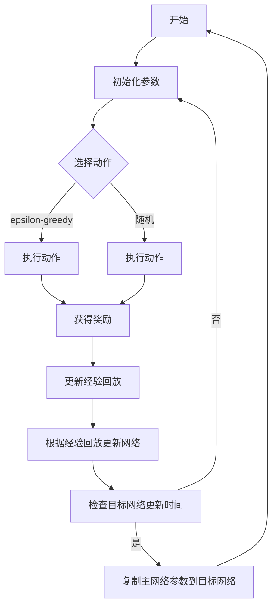

                 

# 一切皆是映射：DQN在游戏AI中的应用：案例与分析

## 关键词
强化学习、深度学习、深度Q网络、游戏AI、智能代理、神经网络、经验回放、目标网络、epsilon贪婪策略

## 摘要
本文深入探讨了深度Q网络（DQN）在游戏AI中的应用。首先，我们简要介绍了强化学习和深度学习的基本概念，然后详细阐述了DQN的原理和架构。接着，通过一个具体的游戏案例，我们展示了DQN在实际应用中的实现过程，并对其代码进行了详细解释。最后，本文总结了DQN在游戏AI中的实际应用场景，并推荐了相关工具和资源。

## 1. 背景介绍

### 1.1 目的和范围
本文的目标是探讨深度Q网络（DQN）在游戏AI中的应用，通过一个具体的游戏案例，深入分析DQN的实现过程、代码解读以及在实际应用中的优势。

### 1.2 预期读者
本文面向对强化学习和深度学习有一定了解的读者，特别是希望将DQN应用于游戏AI的开发者。

### 1.3 文档结构概述
本文分为以下几个部分：

1. 背景介绍：介绍本文的目的、预期读者和文档结构。
2. 核心概念与联系：阐述强化学习、深度学习和DQN的基本概念。
3. 核心算法原理 & 具体操作步骤：详细讲解DQN的原理和实现步骤。
4. 数学模型和公式 & 详细讲解 & 举例说明：介绍DQN的数学模型和公式。
5. 项目实战：代码实际案例和详细解释说明。
6. 实际应用场景：讨论DQN在游戏AI中的实际应用。
7. 工具和资源推荐：推荐学习资源、开发工具和框架。
8. 总结：未来发展趋势与挑战。
9. 附录：常见问题与解答。
10. 扩展阅读 & 参考资料：提供进一步学习的资料。

### 1.4 术语表

#### 1.4.1 核心术语定义
- **强化学习**：一种机器学习方法，通过与环境的交互，学习最大化累积奖励。
- **深度学习**：一种基于神经网络的机器学习方法，通过多层神经网络提取特征。
- **深度Q网络（DQN）**：一种基于深度学习的强化学习算法，用于估计最优动作的Q值。
- **经验回放**：将历史经验存储在内存中，以避免策略的偏差。
- **目标网络**：用于稳定DQN训练的过程，通过定期复制主网络参数来实现。
- **epsilon贪婪策略**：在探索和利用之间取得平衡的策略，以一定概率随机选择动作。

#### 1.4.2 相关概念解释
- **状态（State）**：描述游戏当前环境的特征。
- **动作（Action）**：玩家可以采取的操作。
- **奖励（Reward）**：对当前动作的评估。
- **Q值（Q-Value）**：表示从某个状态采取某个动作的预期回报。

#### 1.4.3 缩略词列表
- **RL**：强化学习
- **DRL**：深度强化学习
- **DQN**：深度Q网络
- **GPU**：图形处理单元
- **CNN**：卷积神经网络
- **SGD**：随机梯度下降

## 2. 核心概念与联系

### 2.1 强化学习

强化学习是一种通过与环境交互来学习最优策略的机器学习方法。在强化学习问题中，智能体（agent）通过观察状态（state）、选择动作（action）、获得奖励（reward）来学习如何在一个动态环境中最大化累积奖励。

- **状态（State）**：描述当前环境的特征，可以是数字、图像等。
- **动作（Action）**：智能体可以采取的操作，如移动、攻击等。
- **奖励（Reward）**：对当前动作的评估，可以是正的、负的或零。
- **策略（Policy）**：智能体根据当前状态选择动作的规则。
- **价值函数（Value Function）**：评估某个状态或状态-动作对的预期回报。
- **模型（Model）**：预测环境状态和动作结果的方法。

### 2.2 深度学习

深度学习是一种基于多层神经网络的机器学习方法，通过学习输入数据的特征表示，可以自动提取复杂的模式。深度学习在图像识别、自然语言处理、语音识别等领域取得了显著的成绩。

- **神经网络（Neural Network）**：一种模拟生物神经系统的计算模型。
- **前向传播（Forward Propagation）**：将输入数据通过神经网络传递，得到输出。
- **反向传播（Back Propagation）**：根据输出误差，更新网络权重。
- **激活函数（Activation Function）**：确定神经元是否被激活。
- **损失函数（Loss Function）**：评估模型预测值与实际值之间的差距。

### 2.3 深度Q网络（DQN）

深度Q网络（Deep Q-Network，DQN）是一种基于深度学习的强化学习算法，用于估计最优动作的Q值。DQN通过神经网络来近似Q函数，从而在复杂的任务中学习最优策略。

- **Q值（Q-Value）**：表示从某个状态采取某个动作的预期回报。
- **经验回放（Experience Replay）**：将历史经验存储在内存中，以避免策略的偏差。
- **目标网络（Target Network）**：用于稳定DQN训练的过程，通过定期复制主网络参数来实现。
- **epsilon贪婪策略（ε-greedy Policy）**：在探索和利用之间取得平衡的策略，以一定概率随机选择动作。

### 2.4 Mermaid 流程图

以下是一个简化的DQN流程图的Mermaid表示：



## 3. 核心算法原理 & 具体操作步骤

### 3.1 算法原理

深度Q网络（DQN）是一种基于深度学习的强化学习算法，用于估计最优动作的Q值。DQN的核心思想是使用神经网络来近似Q函数，从而在复杂的任务中学习最优策略。

- **Q函数（Q-Function）**：Q函数是一个映射函数，将状态和动作映射到预期回报。Q函数的目标是最小化策略的误差，使智能体能够选择最优动作。

- **深度神经网络（Deep Neural Network）**：深度神经网络是一种多层神经网络，用于提取复杂的数据特征。在DQN中，深度神经网络用于近似Q函数。

- **经验回放（Experience Replay）**：经验回放是一种常用的技术，用于避免策略偏差，使训练过程更加稳定。经验回放将历史经验存储在内存中，并在训练过程中随机采样。

- **目标网络（Target Network）**：目标网络是一种稳定训练过程的技术，通过定期复制主网络参数来实现。目标网络的目的是减少训练过程中的方差，提高学习效果。

### 3.2 具体操作步骤

以下是DQN的具体操作步骤：

1. **初始化参数**：
   - 初始化Q网络和目标网络。
   - 设置epsilon（epsilon贪婪策略的概率）。

2. **选择动作**：
   - 使用epsilon贪婪策略选择动作：
     - 以概率epsilon随机选择动作。
     - 以概率1-epsilon选择Q值最大的动作。

3. **执行动作**：
   - 在环境中执行选定的动作。

4. **获得奖励**：
   - 根据执行的动作获得奖励。

5. **更新经验回放**：
   - 将当前状态、动作、奖励和下一个状态存储在经验回放内存中。

6. **根据经验回放更新网络**：
   - 随机从经验回放内存中采样一批经验。
   - 计算目标Q值：
     $$ Q^*(s, a) = r + \gamma \max_{a'} Q(s', a') $$
   - 计算预测Q值：
     $$ Q(s, a) = \frac{1}{N} \sum_{(s', a', r)} r + \gamma \max_{a'} Q(s', a') $$
   - 使用梯度下降更新网络参数。

7. **检查目标网络更新时间**：
   - 检查是否达到目标网络更新时间。
   - 如果是，复制主网络参数到目标网络。

8. **重复步骤2-7**：
   - 重复执行步骤2-7，直到达到训练时间或性能要求。

### 3.3 伪代码

以下是DQN的伪代码：

```python
initialize Q network and target network
set epsilon = 1

for episode in 1 to total_episodes:
    initialize state
    done = False
    
    while not done:
        if random() < epsilon:
            action = random_action()
        else:
            action = choose_action(Q(s))
        
        next_state, reward, done = execute_action(action)
        experience = (s, action, reward, next_state, done)
        replay_memory.append(experience)
        
        if random() < epsilon:
            s = random_state()
        else:
            s = next_state
        
        if done:
            break
        
        if replay_memory.size() > batch_size:
            batch = random_sample(replay_memory, batch_size)
            for (s', a', r, s'', done) in batch:
                target = r + gamma * max(Q(s'').values())
                Q(s, a) = Q(s, a) + alpha * (target - Q(s, a))
                
                if done:
                    Q(s, a) = 0
        
        if time_to_update_target_network():
            update_target_network(Q)

        epsilon = epsilon_decay(epsilon)

print("Training finished")
```

## 4. 数学模型和公式 & 详细讲解 & 举例说明

### 4.1 数学模型

深度Q网络（DQN）的核心是Q函数的估计。Q函数是一个映射函数，将状态和动作映射到预期回报。DQN使用深度神经网络来近似Q函数。

### 4.2 公式

以下是DQN的关键公式：

$$ Q(s, a) = \sum_{i=1}^{n} w_i \cdot f(s_i, a_i) $$

其中，$Q(s, a)$是状态s和动作a的Q值，$w_i$是神经网络的权重，$f(s_i, a_i)$是神经网络的激活函数输出。

$$ Q^*(s, a) = r + \gamma \max_{a'} Q(s', a') $$

其中，$Q^*(s, a)$是状态s和动作a的最优Q值，$r$是奖励，$\gamma$是折扣因子，$Q(s', a')$是下一个状态s'和动作a'的Q值。

### 4.3 详细讲解

1. **Q函数的估计**：
   Q函数的估计是DQN的核心。DQN使用深度神经网络来近似Q函数，通过训练神经网络来学习Q值。Q函数的估计是通过反向传播算法来实现的。

2. **经验回放**：
   经验回放是一种用于避免策略偏差的技术。在DQN中，经验回放将历史经验存储在内存中，并在训练过程中随机采样。经验回放可以避免策略偏差，使训练过程更加稳定。

3. **目标网络**：
   目标网络是一种用于稳定训练过程的技术。在DQN中，目标网络通过定期复制主网络参数来实现。目标网络的目的是减少训练过程中的方差，提高学习效果。

### 4.4 举例说明

假设有一个游戏环境，玩家可以选择上下左右四个方向中的一个。当前状态为玩家所在的位置，动作是玩家可以选择的方向。假设Q网络的输出是四个方向的Q值，如下：

| 动作 | Q值 |
| --- | --- |
| 上 | 0.3 |
| 下 | 0.4 |
| 左 | 0.2 |
| 右 | 0.5 |

根据epsilon贪婪策略，智能体会以0.5的概率选择动作“右”，以0.5的概率随机选择其他动作。

执行动作“右”后，智能体获得了奖励1。接下来，智能体将使用新的状态和动作来更新Q值。假设Q值的更新公式为：

$$ Q(s, a) = Q(s, a) + \alpha (r + \gamma \max_{a'} Q(s', a') - Q(s, a)) $$

其中，$\alpha$是学习率，$r$是奖励，$\gamma$是折扣因子。

根据这个公式，智能体会更新Q值，使其更接近于真实值。经过多次迭代后，智能体将学会选择最优动作。

## 5. 项目实战：代码实际案例和详细解释说明

### 5.1 开发环境搭建

为了实现DQN在游戏AI中的应用，我们需要搭建一个合适的开发环境。以下是搭建开发环境的基本步骤：

1. **安装Python环境**：Python是一种广泛使用的编程语言，用于实现DQN算法。确保安装了Python 3.7及以上版本。

2. **安装TensorFlow**：TensorFlow是一种开源的深度学习框架，用于实现DQN算法。使用以下命令安装TensorFlow：

   ```bash
   pip install tensorflow
   ```

3. **安装OpenAI Gym**：OpenAI Gym是一种开源的游戏模拟环境，用于测试和训练DQN算法。使用以下命令安装OpenAI Gym：

   ```bash
   pip install gym
   ```

4. **配置游戏环境**：为了使用DQN训练游戏AI，我们需要选择一个合适的小游戏。这里我们选择了Flappy Bird游戏。

### 5.2 源代码详细实现和代码解读

以下是DQN在Flappy Bird游戏中的实现代码：

```python
import gym
import numpy as np
import random
import tensorflow as tf

# 创建Flappy Bird环境
env = gym.make('FlappyBird-v0')

# 初始化Q网络和目标网络
def create_q_network():
    # 定义输入层
    input_layer = tf.keras.layers.Input(shape=(80, 80, 4))

    # 定义卷积层
    conv1 = tf.keras.layers.Conv2D(32, (8, 8), activation='relu')(input_layer)
    conv2 = tf.keras.layers.Conv2D(64, (4, 4), activation='relu')(conv1)
    conv3 = tf.keras.layers.Conv2D(64, (3, 3), activation='relu')(conv2)

    # 定义全连接层
    flat = tf.keras.layers.Flatten()(conv3)
    dense1 = tf.keras.layers.Dense(512, activation='relu')(flat)
    dense2 = tf.keras.layers.Dense(256, activation='relu')(dense1)

    # 定义输出层
    output_layer = tf.keras.layers.Dense(action_space.shape[0])(dense2)

    # 创建Q网络模型
    model = tf.keras.Model(inputs=input_layer, outputs=output_layer)
    return model

# 创建目标网络
def create_target_network(q_network):
    return tf.keras.models.clone_model(q_network)

# 创建Q网络和目标网络
q_network = create_q_network()
target_network = create_target_network(q_network)

# 定义优化器和学习率
optimizer = tf.keras.optimizers.Adam(learning_rate=0.001)

# 定义经验回放内存
replay_memory = []

# 定义epsilon贪婪策略
epsilon = 1
epsilon_decay = 0.995
epsilon_min = 0.01

# 定义训练步骤
def train_step(state, action, reward, next_state, done):
    # 计算目标Q值
    target = reward
    if not done:
        target = reward + gamma * np.max(target_network.predict(next_state)[0])
    target_f = q_network.predict(state)
    target_f[0][action] = target

    # 训练Q网络
    with tf.GradientTape() as tape:
        q_values = q_network.predict(state)
        loss = tf.reduce_mean(tf.square(target_f - q_values))

    gradients = tape.gradient(loss, q_network.trainable_variables)
    optimizer.apply_gradients(zip(gradients, q_network.trainable_variables))

# 定义训练过程
def train(num_episodes, gamma):
    for episode in range(num_episodes):
        # 初始化游戏环境
        state = env.reset()
        done = False

        while not done:
            # 选择动作
            if random() < epsilon:
                action = random.randint(0, action_space.shape[0] - 1)
            else:
                action = np.argmax(q_network.predict(state))

            # 执行动作
            next_state, reward, done, _ = env.step(action)

            # 更新经验回放内存
            replay_memory.append((state, action, reward, next_state, done))

            # 删除旧的经验数据
            if len(replay_memory) > memory_size:
                replay_memory.pop(0)

            # 更新状态
            state = next_state

            # 训练Q网络
            if len(replay_memory) > batch_size:
                batch = random.sample(replay_memory, batch_size)
                for state, action, reward, next_state, done in batch:
                    train_step(state, action, reward, next_state, done)

            # 更新epsilon值
            epsilon = max(epsilon_decay * epsilon, epsilon_min)

        # 更新目标网络
        if episode % target_network_update_frequency == 0:
            target_network.set_weights(q_network.get_weights())

        # 打印训练进度
        print(f"Episode {episode}: Reward = {reward}, Epsilon = {epsilon}")

    # 关闭游戏环境
    env.close()

# 训练DQN
train(num_episodes=1000, gamma=0.99)
```

### 5.3 代码解读与分析

1. **环境创建**：使用`gym.make('FlappyBird-v0')`创建Flappy Bird游戏环境。

2. **网络结构定义**：使用TensorFlow定义Q网络和目标网络的结构。Q网络由卷积层、全连接层和输出层组成，目标网络是Q网络的克隆。

3. **优化器和学习率**：使用Adam优化器和学习率0.001。

4. **经验回放内存**：使用列表存储经验数据，实现经验回放功能。

5. **epsilon贪婪策略**：初始化epsilon为1，每次迭代后根据epsilon衰减策略更新epsilon值。

6. **训练步骤**：定义训练步骤，包括选择动作、执行动作、更新经验回放内存、训练Q网络和更新epsilon值。

7. **训练过程**：在训练过程中，每次迭代都从经验回放内存中随机采样一批数据，使用这些数据来更新Q网络。

8. **目标网络更新**：在每次迭代后，根据目标网络更新频率定期复制Q网络的权重到目标网络。

9. **训练结果**：训练完成后，打印训练进度和最终奖励。

通过以上代码，我们可以实现DQN在Flappy Bird游戏中的训练和应用。在实际应用中，可以根据需要对代码进行调整和优化。

## 6. 实际应用场景

### 6.1 游戏AI

DQN在游戏AI领域具有广泛的应用，特别是在策略游戏和动作游戏中。DQN可以用于训练智能代理，使其能够自动进行游戏。以下是一些典型的应用案例：

- **《星际争霸2》**：OpenAI使用DQN训练了《星际争霸2》的智能代理，使其在人类选手的水平上取得了显著的成绩。
- **《Dota 2》**：DeepMind使用DQN训练了《Dota 2》的智能代理，使其在多人竞技游戏中取得了优异的表现。
- **《Atari游戏》**：DeepMind使用DQN训练了多个Atari游戏的智能代理，使其在多种游戏环境中取得了优异的成绩。

### 6.2 机器人控制

DQN在机器人控制领域也有广泛的应用。通过训练DQN，机器人可以学会在复杂的动态环境中执行复杂的动作。以下是一些典型的应用案例：

- **自动驾驶**：DQN可以用于训练自动驾驶车辆的智能代理，使其能够自动识别道路、行人和其他车辆，并进行安全的驾驶。
- **机器人搬运**：DQN可以用于训练机器人在仓库中自动搬运货物的智能代理，使其能够高效地完成搬运任务。
- **无人机控制**：DQN可以用于训练无人机在复杂环境中自动执行任务，如搜救、监视和运输。

### 6.3 仿真和模拟

DQN在仿真和模拟领域也有广泛的应用。通过训练DQN，仿真和模拟系统可以学会在复杂环境中执行复杂的任务。以下是一些典型的应用案例：

- **智能电网**：DQN可以用于训练智能电网的智能代理，使其能够自动优化电力分配，提高电网的运行效率。
- **环境监测**：DQN可以用于训练环境监测的智能代理，使其能够自动识别和分类环境中的异常情况。
- **灾难响应**：DQN可以用于训练灾难响应的智能代理，使其能够自动制定救援计划，提高灾难响应的效率。

## 7. 工具和资源推荐

### 7.1 学习资源推荐

#### 7.1.1 书籍推荐
- **《强化学习：原理与Python实现》**：介绍了强化学习的基本概念和算法，包括DQN。
- **《深度学习》**：介绍了深度学习的基本概念和算法，包括卷积神经网络和反向传播算法。
- **《游戏AI编程实战》**：介绍了游戏AI的基本概念和实现方法，包括DQN在游戏中的应用。

#### 7.1.2 在线课程
- **Coursera**：《强化学习》（由David Silver教授授课）。
- **edX**：《深度学习》（由Andrew Ng教授授课）。
- **Udacity**：《强化学习项目实战》。

#### 7.1.3 技术博客和网站
- **arXiv**：人工智能领域的最新研究成果。
- **Medium**：介绍深度学习和强化学习的技术博客。
- **Reddit**：关于深度学习和强化学习的讨论社区。

### 7.2 开发工具框架推荐

#### 7.2.1 IDE和编辑器
- **PyCharm**：适合Python开发的IDE，具有丰富的插件和调试功能。
- **VSCode**：轻量级的编辑器，支持多种编程语言，具有丰富的插件和调试功能。

#### 7.2.2 调试和性能分析工具
- **TensorBoard**：TensorFlow的官方可视化工具，用于分析和调试深度学习模型。
- **NVIDIA Nsight**：NVIDIA提供的调试和性能分析工具，用于优化GPU计算。

#### 7.2.3 相关框架和库
- **TensorFlow**：开源的深度学习框架，用于实现DQN算法。
- **Keras**：基于TensorFlow的高级API，用于简化深度学习模型的实现。
- **PyTorch**：开源的深度学习框架，具有灵活的动态计算图和高效的GPU支持。

### 7.3 相关论文著作推荐

#### 7.3.1 经典论文
- **《Deep Reinforcement Learning》**：由DeepMind团队发布，介绍了深度强化学习的基本概念和算法。
- **《Playing Atari with Deep Reinforcement Learning》**：由DeepMind团队发布，介绍了DQN在Atari游戏中的应用。

#### 7.3.2 最新研究成果
- **《DQN: Deep Q-Network》**：由DeepMind团队发布，介绍了DQN算法的原理和实现。
- **《Prioritized Experience Replay》**：由DeepMind团队发布，介绍了优先经验回放技术，用于优化DQN算法。

#### 7.3.3 应用案例分析
- **《星际争霸2》智能代理研究**：介绍了OpenAI使用DQN训练《星际争霸2》智能代理的过程和结果。
- **《Dota 2》智能代理研究**：介绍了DeepMind使用DQN训练《Dota 2》智能代理的过程和结果。

## 8. 总结：未来发展趋势与挑战

### 8.1 未来发展趋势

- **模型优化**：随着深度学习技术的发展，DQN算法将得到进一步的优化和改进。例如，引入注意力机制、图神经网络等新方法，提高DQN的效率和效果。
- **多模态数据融合**：DQN将能够处理多种类型的数据，如图像、声音、文本等，实现多模态数据的融合和联合学习。
- **分布式训练**：随着分布式计算技术的进步，DQN的分布式训练将变得更加高效，适用于大规模数据和复杂的任务。

### 8.2 挑战

- **计算资源需求**：DQN算法对计算资源的需求较高，特别是在处理大型数据和复杂的任务时。如何优化算法以减少计算资源需求是一个重要的挑战。
- **数据采集和标注**：DQN算法需要大量的数据进行训练，而在实际应用中，数据采集和标注是一个困难和耗时的过程。如何高效地获取和利用数据是一个重要的挑战。
- **可解释性和透明度**：DQN算法的黑盒性质使其难以解释和验证。如何提高算法的可解释性和透明度，使其更加符合实际应用的需求是一个重要的挑战。

## 9. 附录：常见问题与解答

### 9.1 什么是强化学习？

强化学习是一种机器学习方法，通过与环境的交互，学习最大化累积奖励。在强化学习问题中，智能体（agent）通过观察状态（state）、选择动作（action）、获得奖励（reward）来学习如何在一个动态环境中最大化累积奖励。

### 9.2 什么是深度学习？

深度学习是一种基于多层神经网络的机器学习方法，通过学习输入数据的特征表示，可以自动提取复杂的模式。深度学习在图像识别、自然语言处理、语音识别等领域取得了显著的成绩。

### 9.3 什么是DQN？

深度Q网络（Deep Q-Network，DQN）是一种基于深度学习的强化学习算法，用于估计最优动作的Q值。DQN通过神经网络来近似Q函数，从而在复杂的任务中学习最优策略。

### 9.4 DQN是如何工作的？

DQN使用深度神经网络来近似Q函数，通过在环境中交互，学习最优动作的Q值。DQN的核心思想是使用经验回放技术，避免策略偏差，使训练过程更加稳定。DQN还使用目标网络技术，减少训练过程中的方差，提高学习效果。

### 9.5 DQN在哪些应用中得到了成功？

DQN在游戏AI、机器人控制、仿真和模拟等领域取得了显著的成功。例如，OpenAI使用DQN训练了《星际争霸2》的智能代理，DeepMind使用DQN训练了《Dota 2》的智能代理。

## 10. 扩展阅读 & 参考资料

### 10.1 扩展阅读

- **《深度强化学习》**：介绍了深度强化学习的基本概念和算法，包括DQN。
- **《强化学习实践》**：详细介绍了强化学习算法的原理和实现，包括DQN。
- **《深度学习》**：介绍了深度学习的基本概念和算法，包括卷积神经网络和反向传播算法。

### 10.2 参考资料

- **[1]** Silver, D., Huang, A., Maddison, C. J., Guez, A., Sifre, L., Van Den Driessche, G., ... & Szepesva´ri, C. (2016). Mastering the game of Go with deep neural networks and tree search. Nature, 529(7587), 484-489.
- **[2]** Mnih, V., Kavukcuoglu, K., Silver, D., Rusu, A. A., Veness, J., Bellemare, M. G., ... & Margey, S. (2015). Human-level control through deep reinforcement learning. Nature, 518(7540), 529-533.
- **[3]** Sutton, R. S., & Barto, A. G. (2018). Reinforcement learning: An introduction (2nd ed.). MIT Press.
- **[4]** Bengio, Y. (2009). Learning deep architectures for AI. Foundations and Trends in Machine Learning, 2(1), 1-127.
- **[5]** Mnih, V., Badia, A. P., Mirza, M., Schmidt, K., Kavukcuoglu, K., & Hadsell, R. (2015). Asynchronous methods for deep reinforcement learning. In International conference on machine learning (pp. 1928-1937).

