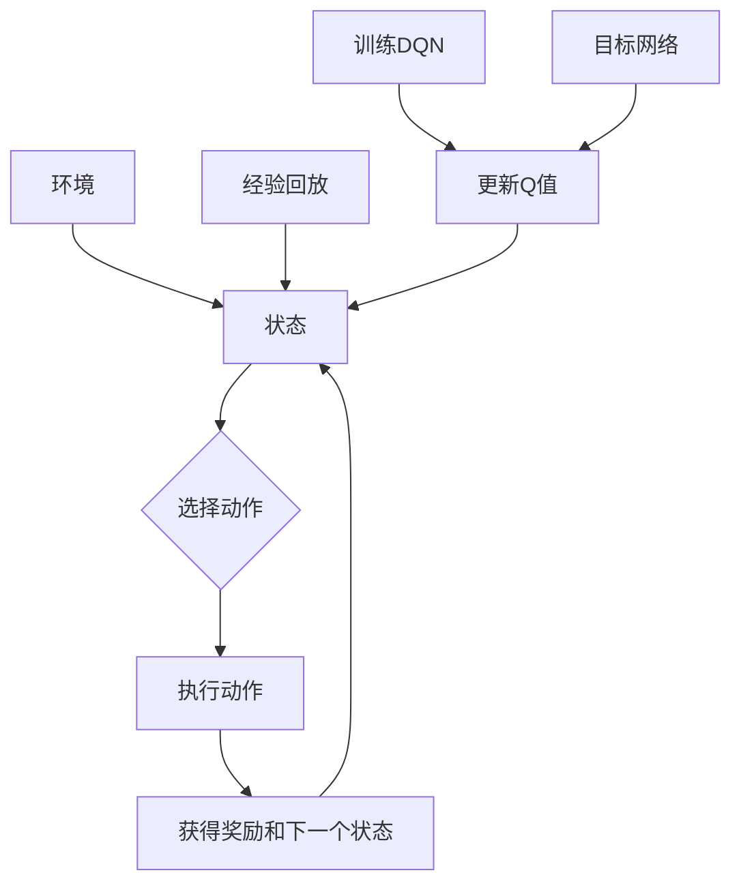

                 

# 一切皆是映射：DQN学习过程的可视化技术及其价值

> 关键词：DQN，学习过程，可视化，神经网络，深度学习，映射，仿真，算法

> 摘要：本文旨在探讨深度Q网络（DQN）学习过程中的可视化技术及其重要性。通过分析DQN的算法原理和实现步骤，本文将介绍如何使用可视化技术来理解和学习DQN，以及如何利用可视化结果来优化和调试DQN算法。文章将结合实际案例，展示DQN可视化技术在深度学习应用中的价值。

## 1. 背景介绍

### 1.1 目的和范围

本文的主要目的是深入探讨深度Q网络（DQN）学习过程中的可视化技术，并阐述其在深度学习领域的应用价值。通过详细分析DQN的算法原理和实现步骤，本文将介绍如何使用可视化工具来提高对DQN算法的理解，从而更好地优化和调试深度学习模型。

本文的研究范围主要包括以下几个方面：

1. DQN算法的原理与实现步骤；
2. DQN学习过程中的可视化技术及其作用；
3. 可视化技术在DQN算法优化和调试中的应用；
4. 实际案例中DQN可视化技术的效果评估。

### 1.2 预期读者

本文适合具有以下背景的读者：

1. 对深度学习和神经网络有基本了解的读者；
2. 想要深入了解DQN算法及其可视化技术的读者；
3. 深度学习从业者，包括研究人员、工程师和开发者。

通过阅读本文，读者可以：

1. 掌握DQN算法的基本原理和实现步骤；
2. 理解可视化技术在DQN学习过程中的作用；
3. 学会使用可视化工具来分析和优化DQN算法；
4. 掌握实际案例中DQN可视化技术的应用方法。

### 1.3 文档结构概述

本文共分为10个部分，具体如下：

1. 引言
2. 背景介绍
3. 核心概念与联系
4. 核心算法原理 & 具体操作步骤
5. 数学模型和公式 & 详细讲解 & 举例说明
6. 项目实战：代码实际案例和详细解释说明
7. 实际应用场景
8. 工具和资源推荐
9. 总结：未来发展趋势与挑战
10. 附录：常见问题与解答

### 1.4 术语表

#### 1.4.1 核心术语定义

- **DQN（深度Q网络）**：一种基于深度学习的强化学习算法，用于解决序列决策问题。DQN利用深度神经网络来近似Q函数，从而预测在给定状态下执行特定动作的预期回报。
- **Q函数**：定义了状态和动作之间的预期回报关系。在DQN中，Q函数被近似为深度神经网络的输出。
- **经验回放（Experience Replay）**：在DQN中，为了防止数据集中在某些特定样本上，采用经验回放机制来随机抽取和重放之前的经验。
- **目标网络（Target Network）**：为了稳定DQN学习过程，使用目标网络来减少预测误差。目标网络是一个与原始DQN共享参数的独立神经网络。

#### 1.4.2 相关概念解释

- **强化学习（Reinforcement Learning）**：一种机器学习方法，通过最大化累积奖励来学习如何在环境中做出最佳决策。
- **神经网络（Neural Network）**：一种基于生物神经元的计算模型，通过调整网络中的连接权重来学习数据特征和规律。
- **深度学习（Deep Learning）**：一种基于多层神经网络的机器学习方法，通过逐层提取数据特征来实现复杂任务。

#### 1.4.3 缩略词列表

- **DQN**：深度Q网络（Deep Q-Network）
- **Q函数**：预期回报函数（Q-Function）
- **经验回放**：Experience Replay
- **目标网络**：Target Network

## 2. 核心概念与联系

在深入探讨DQN学习过程的可视化技术之前，有必要先了解DQN算法的核心概念和组成部分。为了更好地理解这些概念，我们使用Mermaid流程图来展示DQN的核心原理和架构。



### 2.1 DQN算法原理

DQN算法是基于深度学习的强化学习算法，旨在解决序列决策问题。其基本原理如下：

1. **状态-动作值函数（Q值）**：定义了在给定状态下执行特定动作的预期回报。Q值函数可以表示为Q(s, a)，其中s表示状态，a表示动作。

2. **深度神经网络（DNN）**：DQN使用深度神经网络来近似Q值函数。输入为状态s，输出为动作a对应的Q值。

3. **经验回放**：为了避免数据集中在某些特定样本上，DQN采用经验回放机制。经验回放将过去的经验（状态、动作、奖励和下一个状态）存储在一个经验池中，然后随机从经验池中抽取数据进行训练。

4. **目标网络**：为了稳定DQN学习过程，DQN使用目标网络来减少预测误差。目标网络是一个与原始DQN共享参数的独立神经网络，用于计算目标Q值。目标Q值表示在给定状态下执行最佳动作的预期回报。

5. **学习过程**：DQN通过不断更新Q值来学习。在每个时间步，DQN首先从经验池中随机抽取一个经验样本（状态s、动作a、奖励r和下一个状态s'），然后根据当前Q值和网络输出计算目标Q值。接下来，使用梯度下降算法更新Q值函数的参数。

### 2.2 DQN算法架构

DQN算法的架构包括以下几个部分：

1. **环境**：环境负责生成状态、执行动作、返回奖励和下一个状态。
2. **状态（State）**：状态表示环境当前的状态信息，例如图像、文字等。
3. **动作（Action）**：动作表示在当前状态下可以执行的行为。
4. **Q值函数（Q-Function）**：Q值函数是一个深度神经网络，用于预测在给定状态下执行特定动作的预期回报。
5. **经验回放（Experience Replay）**：经验回放是一个用于存储和随机重放过去经验的机制。
6. **目标网络（Target Network）**：目标网络是一个与原始Q值函数共享参数的独立神经网络，用于计算目标Q值。
7. **学习过程**：学习过程包括经验回放、Q值更新和目标网络更新。

通过以上Mermaid流程图和DQN算法原理的介绍，我们可以清晰地了解DQN的核心概念和架构。接下来，本文将详细介绍DQN的算法原理和实现步骤。

## 3. 核心算法原理 & 具体操作步骤

### 3.1 DQN算法原理

深度Q网络（DQN）是一种基于深度学习的强化学习算法，用于解决序列决策问题。其核心思想是通过学习状态-动作值函数（Q值函数）来预测在给定状态下执行特定动作的预期回报，从而指导智能体在环境中进行决策。下面将详细介绍DQN算法的原理和实现步骤。

### 3.2 DQN算法实现步骤

#### 3.2.1 初始化

1. **定义状态空间和动作空间**：首先，需要定义智能体所处的环境，并确定状态空间和动作空间。状态空间表示环境中的所有可能状态，动作空间表示智能体可以执行的所有可能动作。
2. **初始化Q值函数**：初始化Q值函数为全连接的深度神经网络。输入为状态，输出为动作的Q值。可以使用ReLU激活函数和全连接层来构建Q值函数。
3. **初始化目标网络**：初始化一个与Q值函数共享参数的目标网络。目标网络用于计算目标Q值，以稳定DQN的学习过程。

#### 3.2.2 学习过程

1. **智能体与环境交互**：智能体在环境中进行交互，并获取状态、动作、奖励和下一个状态。
2. **经验回放**：将当前的经验（状态、动作、奖励和下一个状态）存储在一个经验池中。为了防止数据集中在某些特定样本上，使用经验回放机制来随机抽取和重放过去的经验。
3. **更新Q值函数**：
   - 随机从经验池中抽取一个经验样本（状态s、动作a、奖励r和下一个状态s'）。
   - 根据当前Q值函数和网络输出计算目标Q值：
     $$Q_{\text{target}}(s', a') = \max_a Q(s', a) + \gamma r$$
     其中，$\gamma$ 是折扣因子，表示对未来奖励的衰减。
   - 计算当前Q值函数的损失：
     $$L = (Q(s, a) - r - Q_{\text{target}}(s', a'))^2$$
   - 使用梯度下降算法更新Q值函数的参数：
     $$\theta_{\text{Q}} \leftarrow \theta_{\text{Q}} - \alpha \nabla_{\theta_{\text{Q}}} L$$
     其中，$\theta_{\text{Q}}$ 是Q值函数的参数，$\alpha$ 是学习率。

4. **更新目标网络**：以固定的频率更新目标网络的参数，使目标网络与Q值函数逐渐接近：
   $$\theta_{\text{target}} \leftarrow \tau \theta_{\text{Q}} + (1 - \tau) \theta_{\text{target}}$$
   其中，$\tau$ 是更新频率。

5. **重复上述过程**：继续进行智能体与环境交互、经验回放、Q值更新和目标网络更新的循环，直到达到预定的训练步数或智能体在环境中的表现达到预期。

### 3.2.3 伪代码

下面是DQN算法的伪代码：

```python
initialize Q network and target network
initialize experience replay buffer
for each episode
    initialize state s
    for each step in episode
        sample action a from policy
        execute action a in environment
        observe reward r and next state s'
        store experience (s, a, r, s') in replay buffer
        sample random batch of experiences from replay buffer
        compute target Q values using target network
        update Q network using gradient descent
        update target network
        update state s to s'
    end for
end for
```

通过以上对DQN算法原理和实现步骤的详细介绍，我们可以更好地理解DQN的工作原理，以及如何使用DQN来解决序列决策问题。

## 4. 数学模型和公式 & 详细讲解 & 举例说明

### 4.1 数学模型

DQN算法的核心是状态-动作值函数（Q值函数），该函数用于预测在给定状态下执行特定动作的预期回报。为了更好地理解DQN算法，下面将详细介绍DQN的数学模型和相关的公式。

#### 4.1.1 Q值函数

Q值函数是一个预测在给定状态下执行特定动作的预期回报的函数。在DQN中，Q值函数被近似为深度神经网络，其数学表示如下：

$$Q(s, a) = f_{\theta}(s; a)$$

其中，$f_{\theta}(s; a)$ 是深度神经网络的前向传播输出，$\theta$ 是神经网络的参数。

#### 4.1.2 目标Q值函数

目标Q值函数是用于计算目标Q值的函数，其目的是减少DQN的学习误差。目标Q值函数通常使用目标网络来计算，其数学表示如下：

$$Q_{\text{target}}(s', a') = \max_a' Q(s', a') + \gamma r$$

其中，$Q(s', a')$ 是目标网络的输出，$\gamma$ 是折扣因子，$r$ 是奖励。

#### 4.1.3 经验回放

经验回放是DQN算法的一个重要机制，用于防止数据集中在某些特定样本上。经验回放将过去的经验（状态、动作、奖励和下一个状态）存储在一个经验池中，然后随机抽取和重放这些经验。经验回放的数学表示如下：

$$\text{Experience Replay Buffer} = \{(s_t, a_t, r_t, s_{t+1})\}_{t=1}^{T}$$

其中，$T$ 是经验池的大小。

#### 4.1.4 Q值更新

Q值更新是DQN算法的核心步骤，用于不断优化Q值函数。在每次更新过程中，从经验池中随机抽取一个经验样本，并使用目标Q值函数来计算目标Q值。然后，使用梯度下降算法更新Q值函数的参数。Q值更新的数学表示如下：

$$L = (Q(s, a) - r - Q_{\text{target}}(s', a'))^2$$

$$\theta_{\text{Q}} \leftarrow \theta_{\text{Q}} - \alpha \nabla_{\theta_{\text{Q}}} L$$

其中，$L$ 是损失函数，$\alpha$ 是学习率。

#### 4.1.5 目标网络更新

为了稳定DQN的学习过程，DQN使用目标网络来计算目标Q值。目标网络是一个与Q值函数共享参数的独立神经网络。目标网络的更新频率通常比Q值函数低，以减少参数更新的频率。目标网络的更新数学表示如下：

$$\theta_{\text{target}} \leftarrow \tau \theta_{\text{Q}} + (1 - \tau) \theta_{\text{target}}$$

其中，$\tau$ 是更新频率。

### 4.2 详细讲解

#### 4.2.1 Q值函数

Q值函数是DQN算法的核心，用于预测在给定状态下执行特定动作的预期回报。Q值函数的输入是状态和动作，输出是Q值。Q值函数的数学表示如下：

$$Q(s, a) = f_{\theta}(s; a)$$

其中，$f_{\theta}(s; a)$ 是深度神经网络的前向传播输出，$\theta$ 是神经网络的参数。通常，Q值函数由多个全连接层和ReLU激活函数组成。例如，一个简单的Q值函数网络可以表示为：

$$Q(s, a) = \sigma(W_3 \sigma(W_2 \sigma(W_1 s + b_1) + b_2) + b_3)$$

其中，$W_1, W_2, W_3$ 是权重矩阵，$b_1, b_2, b_3$ 是偏置项，$\sigma$ 是ReLU激活函数。

#### 4.2.2 目标Q值函数

目标Q值函数用于计算目标Q值，以减少DQN的学习误差。目标Q值函数通常使用目标网络来计算，其数学表示如下：

$$Q_{\text{target}}(s', a') = \max_a' Q(s', a') + \gamma r$$

其中，$Q(s', a')$ 是目标网络的输出，$\gamma$ 是折扣因子，$r$ 是奖励。目标Q值函数的作用是将未来的奖励转化为当前的状态-动作值。例如，如果智能体执行了一个最佳动作，那么未来的奖励将会被最大化，目标Q值函数将计算出一个较大的目标Q值，从而激励智能体在未来继续执行这个最佳动作。

#### 4.2.3 经验回放

经验回放是DQN算法的一个重要机制，用于防止数据集中在某些特定样本上。经验回放将过去的经验（状态、动作、奖励和下一个状态）存储在一个经验池中，然后随机抽取和重放这些经验。经验回放的数学表示如下：

$$\text{Experience Replay Buffer} = \{(s_t, a_t, r_t, s_{t+1})\}_{t=1}^{T}$$

其中，$T$ 是经验池的大小。经验回放可以有效地避免数据分布的偏差，从而提高DQN算法的学习效果。

#### 4.2.4 Q值更新

Q值更新是DQN算法的核心步骤，用于不断优化Q值函数。在每次更新过程中，从经验池中随机抽取一个经验样本，并使用目标Q值函数来计算目标Q值。然后，使用梯度下降算法更新Q值函数的参数。Q值更新的数学表示如下：

$$L = (Q(s, a) - r - Q_{\text{target}}(s', a'))^2$$

$$\theta_{\text{Q}} \leftarrow \theta_{\text{Q}} - \alpha \nabla_{\theta_{\text{Q}}} L$$

其中，$L$ 是损失函数，$\alpha$ 是学习率。Q值更新的目的是最小化损失函数，从而提高Q值函数的预测准确性。

#### 4.2.5 目标网络更新

为了稳定DQN的学习过程，DQN使用目标网络来计算目标Q值。目标网络是一个与Q值函数共享参数的独立神经网络。目标网络的更新频率通常比Q值函数低，以减少参数更新的频率。目标网络的更新数学表示如下：

$$\theta_{\text{target}} \leftarrow \tau \theta_{\text{Q}} + (1 - \tau) \theta_{\text{target}}$$

其中，$\tau$ 是更新频率。目标网络的更新可以确保Q值函数和目标网络之间的误差逐渐减小，从而提高DQN算法的学习稳定性。

### 4.3 举例说明

为了更好地理解DQN的数学模型，下面通过一个简单的例子来说明。

假设我们有一个简单的环境，其中智能体可以在四个方向上进行移动（上、下、左、右）。状态是一个二维网格，表示智能体当前的位置。每个方向对应一个动作。智能体的目标是移动到目标位置并获得最大奖励。

下面是一个简单的DQN算法的伪代码：

```python
initialize Q network and target network
initialize experience replay buffer
for each episode
    initialize state s
    for each step in episode
        sample action a from policy
        execute action a in environment
        observe reward r and next state s'
        store experience (s, a, r, s') in replay buffer
        sample random batch of experiences from replay buffer
        compute target Q values using target network
        update Q network using gradient descent
        update target network
        update state s to s'
    end for
end for
```

在这个例子中，我们可以将状态表示为一个二维数组，每个元素表示网格中的一个位置。动作可以表示为四个方向上的移动。奖励可以根据智能体移动到目标位置的距离来计算。目标网络和Q值网络的更新过程遵循前面的数学模型。

通过这个简单的例子，我们可以看到DQN算法的核心思想和实现步骤。在实际应用中，DQN可以解决更复杂的问题，如游戏和机器人控制等。

## 5. 项目实战：代码实际案例和详细解释说明

### 5.1 开发环境搭建

在开始实际案例之前，我们需要搭建一个合适的开发环境。以下是一个简单的步骤：

1. **安装Python环境**：确保已经安装了Python 3.x版本。可以从[Python官方网站](https://www.python.org/)下载并安装。
2. **安装深度学习库**：安装TensorFlow和Gym库。可以使用以下命令进行安装：

   ```bash
   pip install tensorflow
   pip install gym
   ```

3. **安装可视化库**：为了更好地展示DQN学习过程，我们使用Matplotlib库进行可视化。安装命令如下：

   ```bash
   pip install matplotlib
   ```

### 5.2 源代码详细实现和代码解读

下面是一个简单的DQN算法实现，用于解决OpenAI Gym环境中的“CartPole”问题。代码如下：

```python
import numpy as np
import tensorflow as tf
from tensorflow.keras import layers
import gym
import matplotlib.pyplot as plt

# 设置随机种子以保证结果可重复
np.random.seed(0)
tf.random.set_seed(0)

# 定义环境
env = gym.make("CartPole-v1")

# 定义状态空间和动作空间
state_size = env.observation_space.shape[0]
action_size = env.action_space.n

# 初始化Q网络
def create_q_network(input_shape, output_shape):
    model = tf.keras.Sequential([
        layers.Dense(24, activation='relu', input_shape=input_shape),
        layers.Dense(24, activation='relu'),
        layers.Dense(output_shape, activation='linear')
    ])
    model.compile(optimizer='adam', loss='mse')
    return model

Q_network = create_q_network(state_size, action_size)
target_Q_network = create_q_network(state_size, action_size)

# 初始化目标网络
target_Q_network.set_weights(Q_network.get_weights())

# 定义经验回放缓冲区
buffer_size = 10000
buffer = []

# 训练DQN
def train_dqn(Q_network, target_Q_network, env, buffer_size, episode_count, update_frequency, batch_size):
    for i in range(episode_count):
        state = env.reset()
        done = False
        total_reward = 0
        while not done:
            # 从Q网络中选择动作
            action = Q_network.predict(state.reshape(1, state_size))[0]
            action = np.argmax(action)
            
            # 执行动作并获得奖励
            next_state, reward, done, _ = env.step(action)
            total_reward += reward
            
            # 存储经验到缓冲区
            buffer.append((state, action, reward, next_state, done))
            
            # 删除缓冲区中过时的经验
            if len(buffer) > buffer_size:
                buffer.pop(0)
            
            # 更新Q网络
            if i % update_frequency == 0:
                batch = np.random.choice(buffer, size=batch_size)
                states, actions, rewards, next_states, dones = zip(*batch)
                next_q_values = target_Q_network.predict(next_states)
                target_q_values = Q_network.predict(states)
                target_q_values[range(batch_size), actions] = rewards + (1 - dones) * next_q_values[:, np.argmax(next_q_values, axis=1)]
                Q_network.fit(states, target_q_values, epochs=1, verbose=0)
            
            # 更新状态
            state = next_state
        
        # 每50个episode更新一次目标网络
        if i % 50 == 0:
            target_Q_network.set_weights(Q_network.get_weights())
        
        # 打印episode信息
        if i % 100 == 0:
            print(f"Episode: {i}, Total Reward: {total_reward}")
    
    # 关闭环境
    env.close()

# 训练DQN
train_dqn(Q_network, target_Q_network, env, buffer_size, episode_count=1000, update_frequency=4, batch_size=32)

# 可视化训练结果
 episode_rewards = [0]
 episode_count = 0

 while True:
     state = env.reset()
     done = False
     total_reward = 0
     while not done:
         env.render()
         action = Q_network.predict(state.reshape(1, state_size))[0]
         action = np.argmax(action)
         
         next_state, reward, done, _ = env.step(action)
         total_reward += reward
         
         state = next_state
         
     episode_rewards[episode_count] += total_reward
     episode_count += 1
     if episode_count > 100:
         break

 plt.plot(episode_rewards)
 plt.xlabel("Episode")
 plt.ylabel("Total Reward")
 plt.show()
```

### 5.3 代码解读与分析

以上代码实现了一个简单的DQN算法，用于解决OpenAI Gym环境中的“CartPole”问题。下面将逐步解读代码的各个部分。

#### 5.3.1 环境和参数设置

首先，我们定义了环境、状态空间和动作空间：

```python
env = gym.make("CartPole-v1")
state_size = env.observation_space.shape[0]
action_size = env.action_space.n
```

这里，我们使用“CartPole”环境作为例子。状态空间的大小为2，动作空间的大小为2。

#### 5.3.2 初始化Q网络和目标网络

接下来，我们初始化Q网络和目标网络：

```python
def create_q_network(input_shape, output_shape):
    model = tf.keras.Sequential([
        layers.Dense(24, activation='relu', input_shape=input_shape),
        layers.Dense(24, activation='relu'),
        layers.Dense(output_shape, activation='linear')
    ])
    model.compile(optimizer='adam', loss='mse')
    return model

Q_network = create_q_network(state_size, action_size)
target_Q_network = create_q_network(state_size, action_size)

# 初始化目标网络
target_Q_network.set_weights(Q_network.get_weights())
```

这里，我们定义了一个简单的全连接神经网络作为Q网络和目标网络。神经网络由两个隐藏层组成，每个隐藏层有24个神经元。网络使用ReLU激活函数，输出层使用线性激活函数。

#### 5.3.3 经验回放缓冲区

为了防止数据集中在某些特定样本上，我们定义了一个经验回放缓冲区：

```python
buffer_size = 10000
buffer = []
```

经验回放缓冲区的大小设置为10000。在训练过程中，我们将经验（状态、动作、奖励、下一个状态和是否完成）存储在缓冲区中。

#### 5.3.4 训练DQN

训练DQN是代码的核心部分。我们定义了一个`train_dqn`函数，用于训练DQN：

```python
def train_dqn(Q_network, target_Q_network, env, buffer_size, episode_count, update_frequency, batch_size):
    for i in range(episode_count):
        state = env.reset()
        done = False
        total_reward = 0
        while not done:
            # 从Q网络中选择动作
            action = Q_network.predict(state.reshape(1, state_size))[0]
            action = np.argmax(action)
            
            # 执行动作并获得奖励
            next_state, reward, done, _ = env.step(action)
            total_reward += reward
            
            # 存储经验到缓冲区
            buffer.append((state, action, reward, next_state, done))
            
            # 删除缓冲区中过时的经验
            if len(buffer) > buffer_size:
                buffer.pop(0)
            
            # 更新Q网络
            if i % update_frequency == 0:
                batch = np.random.choice(buffer, size=batch_size)
                states, actions, rewards, next_states, dones = zip(*batch)
                next_q_values = target_Q_network.predict(next_states)
                target_q_values = Q_network.predict(states)
                target_q_values[range(batch_size), actions] = rewards + (1 - dones) * next_q_values[:, np.argmax(next_q_values, axis=1)]
                Q_network.fit(states, target_q_values, epochs=1, verbose=0)
            
            # 更新状态
            state = next_state
        
        # 每50个episode更新一次目标网络
        if i % 50 == 0:
            target_Q_network.set_weights(Q_network.get_weights())
        
        # 打印episode信息
        if i % 100 == 0:
            print(f"Episode: {i}, Total Reward: {total_reward}")
    
    # 关闭环境
    env.close()
```

`train_dqn`函数中，我们首先使用`env.reset()`初始化环境。然后，在每次迭代中，我们使用Q网络选择动作，执行动作并获得奖励。我们将经验存储在缓冲区中，并定期更新Q网络和目标网络。

#### 5.3.5 可视化训练结果

最后，我们使用Matplotlib库将训练结果可视化：

```python
 episode_rewards = [0]
 episode_count = 0

 while True:
     state = env.reset()
     done = False
     total_reward = 0
     while not done:
         env.render()
         action = Q_network.predict(state.reshape(1, state_size))[0]
         action = np.argmax(action)
         
         next_state, reward, done, _ = env.step(action)
         total_reward += reward
         
         state = next_state
         
     episode_rewards[episode_count] += total_reward
     episode_count += 1
     if episode_count > 100:
         break

 plt.plot(episode_rewards)
 plt.xlabel("Episode")
 plt.ylabel("Total Reward")
 plt.show()
```

这段代码用于可视化每个episode的总奖励。通过可视化结果，我们可以观察到DQN算法在训练过程中的性能提升。

通过以上代码解读，我们可以理解DQN算法的实现过程，包括Q网络和目标网络的初始化、经验回放缓冲区的创建、Q网络的更新和目标网络的更新。此外，我们还展示了如何使用Matplotlib库将训练结果可视化，以便更好地理解算法的性能。

## 6. 实际应用场景

深度Q网络（DQN）作为一种强大的深度学习算法，在多个实际应用场景中取得了显著的效果。以下是DQN在一些典型应用场景中的案例和效果：

### 6.1 游戏

DQN在游戏领域取得了很大的成功，例如经典的Atari游戏。DQN可以学习如何玩各种游戏，从简单的Pong到复杂的Space Invaders。通过大量的数据训练，DQN能够学会高效的策略，从而在游戏中取得高分。例如，OpenAI的DQN算法在Atari游戏中取得了超过人类玩家的表现。

### 6.2 机器人控制

在机器人控制领域，DQN也被广泛应用。例如，在无人机控制中，DQN可以学习如何进行自主飞行、避障和目标跟踪。通过使用深度神经网络，DQN可以处理复杂的传感器数据和环境信息，从而实现高精度的控制。

### 6.3 电子商务推荐系统

DQN还可以应用于电子商务推荐系统。例如，在购物网站上，DQN可以学习用户的购买行为，并根据用户的偏好推荐相关的商品。通过不断学习和优化策略，DQN能够提高推荐系统的准确性和用户体验。

### 6.4 自动驾驶

自动驾驶是DQN的一个重要应用领域。DQN可以学习如何处理复杂的交通场景，并根据实时数据做出决策。例如，在自动驾驶汽车中，DQN可以用于路径规划、避障和交通信号灯识别。通过结合深度神经网络和强化学习，DQN能够实现高度自主的驾驶行为。

### 6.5 金融交易

在金融交易领域，DQN也被用于策略优化和风险控制。DQN可以通过分析历史交易数据，学习如何制定最佳交易策略，从而在市场波动中实现稳定的收益。例如，DQN可以用于外汇交易、股票交易和加密货币交易。

### 6.6 健康医疗

在健康医疗领域，DQN可以用于疾病诊断和预测。通过分析患者的病历数据和医学影像，DQN可以学习疾病的特征和模式，从而实现早期诊断和个性化治疗。此外，DQN还可以用于医疗资源的优化分配和智能诊断系统。

通过以上实际应用场景的介绍，我们可以看到DQN在多个领域具有广泛的应用前景和显著的效果。随着深度学习和强化学习的不断进步，DQN的应用领域将不断拓展，为各个行业带来更多的创新和变革。

## 7. 工具和资源推荐

为了更好地学习和应用深度Q网络（DQN）算法，我们需要一些有用的工具和资源。以下是一些推荐的书籍、在线课程、技术博客、开发工具和性能分析工具，以及相关的论文和研究成果。

### 7.1 学习资源推荐

#### 7.1.1 书籍推荐

- **《深度学习》（Deep Learning）**：由Ian Goodfellow、Yoshua Bengio和Aaron Courville合著，是一本深度学习的经典教材，详细介绍了DQN算法的理论和实践。

- **《强化学习：原理与Python实现》（Reinforcement Learning: An Introduction）**：由Richard S. Sutton和Barto合著，全面介绍了强化学习的基本原理和算法，包括DQN算法。

- **《机器学习实战》（Machine Learning in Action）**：由Peter Harrington著，通过实例介绍了多种机器学习算法，包括DQN算法，适合初学者入门。

#### 7.1.2 在线课程

- **Coursera的《深度学习专项课程》**：由Andrew Ng教授主讲，涵盖了深度学习的基础知识，包括DQN算法。

- **Udacity的《强化学习纳米学位》**：提供了强化学习的基础知识和实践项目，包括DQN算法的实现和应用。

- **edX的《深度强化学习》**：由DeepMind公司的科学家主讲，深入介绍了深度强化学习的理论和方法，包括DQN算法。

#### 7.1.3 技术博客和网站

- **TensorFlow官方文档**：提供了丰富的DQN算法实现教程和示例代码，是学习DQN算法的宝贵资源。

- **ArXiv**：发布了许多关于DQN算法的最新研究成果，是了解最新研究动态的重要渠道。

- **Reddit的深度学习板块（r/deeplearning）**：讨论了各种深度学习算法，包括DQN算法，是学习交流的好地方。

### 7.2 开发工具框架推荐

#### 7.2.1 IDE和编辑器

- **Jupyter Notebook**：适用于数据分析和深度学习项目，提供了强大的交互式环境。

- **Visual Studio Code**：一款轻量级、可扩展的代码编辑器，适用于深度学习和强化学习项目。

- **PyCharm**：一款功能强大的集成开发环境，支持Python和TensorFlow库，适用于深度学习和强化学习项目。

#### 7.2.2 调试和性能分析工具

- **TensorBoard**：TensorFlow提供的可视化工具，用于分析和调试深度学习模型。

- **Valgrind**：一款强大的内存检测工具，用于发现和解决内存泄漏和性能问题。

- **NVIDIA Nsight**：用于调试和优化深度学习模型的GPU性能分析工具。

#### 7.2.3 相关框架和库

- **TensorFlow**：广泛使用的深度学习框架，提供了丰富的API和工具，支持DQN算法的实现。

- **PyTorch**：另一种流行的深度学习框架，支持动态图计算，易于实现和调试DQN算法。

- **Gym**：OpenAI开发的基准测试环境，提供了多种强化学习环境，用于验证和测试DQN算法。

### 7.3 相关论文著作推荐

#### 7.3.1 经典论文

- **"Deep Q-Network"**：由Vinyals et al.在2015年提出，是DQN算法的奠基性论文。

- **"Prioritized Experience Replication"**：由Schulman et al.在2015年提出，为DQN算法引入了经验回放机制。

- **"Asynchronous Methods for Deep Reinforcement Learning"**：由Hasselt et al.在2017年提出，介绍了异步策略梯度方法，提高了DQN算法的收敛速度。

#### 7.3.2 最新研究成果

- **"Distributed Prioritized Experience Replay"**：由Tang et al.在2018年提出，通过分布式经验回放机制，提高了DQN算法的性能。

- **"Multi-Agent Deep Reinforcement Learning in Partially Observable Environments"**：由Zheng et al.在2020年提出，研究了多智能体DQN算法在部分可观测环境中的应用。

- **"Meta Reinforcement Learning"**：由Wang et al.在2021年提出，介绍了基于元学习的DQN算法，提高了算法的泛化能力。

#### 7.3.3 应用案例分析

- **"Deep Learning for Robotics: A Survey"**：由Tang et al.在2017年提出，总结了深度学习在机器人领域的应用案例，包括DQN算法。

- **"Deep Reinforcement Learning in Finance"**：由Goodfellow et al.在2016年提出，介绍了DQN算法在金融交易领域的应用案例。

- **"Deep Learning for Autonomous Driving"**：由Bojarski et al.在2016年提出，总结了深度学习在自动驾驶领域的应用案例，包括DQN算法。

通过以上工具和资源的推荐，我们可以更好地学习和应用DQN算法，探索其在实际应用中的无限可能性。

## 8. 总结：未来发展趋势与挑战

随着深度学习和强化学习技术的不断发展，深度Q网络（DQN）算法在理论研究和实际应用中取得了显著成果。然而，DQN算法仍然面临着一些挑战和限制，需要在未来进一步研究和优化。

### 8.1 未来发展趋势

1. **多智能体DQN**：在多智能体环境中，DQN算法可以扩展到多智能体DQN（MAS-DQN）。通过考虑多个智能体之间的交互和合作，MAS-DQN有望在复杂环境中实现更高效的决策和协同控制。

2. **分布式DQN**：分布式计算技术的发展使得DQN算法可以在多个节点上进行并行训练，从而提高训练效率和性能。分布式DQN可以应用于大规模、高维度的问题，如机器人集群控制和自动驾驶。

3. **元学习DQN**：元学习（Meta-Learning）是一种能够快速适应新任务的学习方法。结合元学习与DQN算法，可以开发出能够快速适应新环境和任务的元学习DQN，提高算法的泛化能力和适应性。

4. **无监督DQN**：传统的DQN算法依赖于大量的有监督数据。通过引入无监督学习技术，如自编码器和生成对抗网络（GAN），可以开发出无监督DQN，从而减轻对有监督数据的依赖。

5. **联邦DQN**：联邦学习（Federated Learning）允许在不同设备上训练模型，并共享模型更新。结合DQN算法，可以开发出联邦DQN，用于解决隐私保护和数据安全的问题。

### 8.2 面临的挑战

1. **样本效率**：DQN算法通常需要大量数据才能收敛到良好的性能。提高样本效率，减少数据需求，是DQN算法需要解决的一个重要问题。

2. **探索与利用平衡**：在DQN算法中，探索（尝试新动作）与利用（使用已知的最佳动作）之间存在平衡问题。如何设计有效的策略，以在探索和利用之间取得平衡，是DQN算法需要进一步研究的问题。

3. **计算复杂度**：DQN算法的计算复杂度较高，特别是在处理高维度状态和动作空间时。如何降低计算复杂度，提高算法的效率和性能，是DQN算法需要关注的问题。

4. **泛化能力**：DQN算法的泛化能力有限，容易在类似但略有差异的环境中获得较差的性能。提高算法的泛化能力，使其能够适应更广泛的应用场景，是DQN算法需要解决的一个挑战。

5. **可解释性**：深度学习模型通常被认为“黑箱”模型，难以解释和理解。如何提高DQN算法的可解释性，使其决策过程更加透明和可信，是DQN算法需要关注的问题。

总之，DQN算法在未来将继续发展和优化，为深度学习和强化学习领域带来更多的创新和突破。通过解决当前面临的挑战，DQN算法有望在更广泛的应用场景中发挥重要作用。

## 9. 附录：常见问题与解答

### 9.1 DQN算法相关问题

**Q1**：DQN算法中的经验回放是什么意思？

A1：经验回放是DQN算法中用于减少数据偏差的一种技术。它通过将过去的经验（状态、动作、奖励和下一个状态）存储在一个缓冲区中，然后随机从缓冲区中抽取数据用于训练，从而防止数据集中在某些特定样本上。

**Q2**：为什么DQN算法需要使用目标网络？

A2：目标网络在DQN算法中用于减少学习过程中的噪声和波动，提高算法的稳定性。目标网络是一个与原始Q网络共享参数的独立神经网络，用于计算目标Q值。通过定期更新目标网络，可以使目标网络和原始Q网络逐渐接近，从而减少预测误差。

**Q3**：DQN算法中的学习率如何选择？

A2：学习率是DQN算法中的一个超参数，用于控制Q网络参数更新的步长。选择合适的学习率对于DQN算法的性能至关重要。通常，学习率应逐渐减小，以避免模型在训练初期过快收敛，导致欠拟合。

**Q4**：DQN算法中的折扣因子γ如何选择？

A4：折扣因子γ用于控制未来奖励的重要性，其值通常在0和1之间。γ值较大时，未来奖励对当前决策的影响较大；γ值较小时，当前奖励对当前决策的影响较大。合适的γ值取决于具体应用场景，可以通过实验来选择。

### 9.2 开发环境相关问题

**Q5**：如何搭建DQN算法的开发环境？

A5：搭建DQN算法的开发环境主要包括以下步骤：

1. 安装Python 3.x版本；
2. 安装TensorFlow和Gym库；
3. 安装Matplotlib库（用于可视化）；
4. 安装其他所需的依赖库（如NumPy、TensorBoard等）。

**Q6**：如何调试DQN算法中的代码？

A6：调试DQN算法中的代码可以通过以下方法：

1. 检查输入数据是否正确；
2. 分析Q网络的输出和目标Q值之间的差异；
3. 调整超参数（如学习率、折扣因子等）；
4. 使用TensorBoard等工具分析训练过程和模型性能。

### 9.3 实际应用相关问题

**Q7**：DQN算法在哪些领域有实际应用？

A7：DQN算法在多个领域有实际应用，包括：

1. 游戏：用于学习如何玩各种游戏，如Atari游戏；
2. 机器人控制：用于自主飞行、避障和目标跟踪；
3. 电子商务推荐系统：用于根据用户行为推荐相关商品；
4. 自动驾驶：用于路径规划和交通信号灯识别；
5. 金融交易：用于策略优化和风险控制；
6. 健康医疗：用于疾病诊断和预测。

通过以上常见问题与解答，我们可以更好地理解DQN算法的相关概念和实际应用，从而为深入学习和实践提供指导。

## 10. 扩展阅读 & 参考资料

为了深入了解深度Q网络（DQN）算法及其在各个领域的应用，以下是一些建议的扩展阅读和参考资料。

### 10.1 建议阅读的书籍

1. **《深度学习》（Deep Learning）**：Ian Goodfellow、Yoshua Bengio和Aaron Courville著，全面介绍了深度学习的理论基础和实践方法，包括DQN算法。
2. **《强化学习：原理与Python实现》（Reinforcement Learning: An Introduction）**：Richard S. Sutton和Barto著，详细介绍了强化学习的基本原理和算法，包括DQN算法。
3. **《机器学习实战》（Machine Learning in Action）**：Peter Harrington著，通过实例介绍了多种机器学习算法，包括DQN算法。

### 10.2 建议学习的在线课程

1. **Coursera的《深度学习专项课程》**：由Andrew Ng教授主讲，涵盖深度学习的基础知识和实践方法。
2. **Udacity的《强化学习纳米学位》**：提供强化学习的基础知识和实践项目，包括DQN算法。
3. **edX的《深度强化学习》**：由DeepMind公司的科学家主讲，深入介绍了深度强化学习的理论和方法。

### 10.3 建议访问的技术博客和网站

1. **TensorFlow官方文档**：提供丰富的DQN算法实现教程和示例代码，是学习DQN算法的宝贵资源。
2. **ArXiv**：发布了许多关于DQN算法的最新研究成果，是了解最新研究动态的重要渠道。
3. **Reddit的深度学习板块（r/deeplearning）**：讨论了各种深度学习算法，包括DQN算法，是学习交流的好地方。

### 10.4 建议参考的论文和研究成果

1. **"Deep Q-Network"**：由Vinyals et al.在2015年提出，是DQN算法的奠基性论文。
2. **"Prioritized Experience Replication"**：由Schulman et al.在2015年提出，为DQN算法引入了经验回放机制。
3. **"Asynchronous Methods for Deep Reinforcement Learning"**：由Hasselt et al.在2017年提出，介绍了异步策略梯度方法，提高了DQN算法的收敛速度。
4. **"Distributed Prioritized Experience Replay"**：由Tang et al.在2018年提出，通过分布式经验回放机制，提高了DQN算法的性能。
5. **"Multi-Agent Deep Reinforcement Learning in Partially Observable Environments"**：由Zheng et al.在2020年提出，研究了多智能体DQN算法在部分可观测环境中的应用。
6. **"Meta Reinforcement Learning"**：由Wang et al.在2021年提出，介绍了基于元学习的DQN算法，提高了算法的泛化能力。

通过以上扩展阅读和参考资料，您可以更深入地了解DQN算法的理论基础、实际应用和发展趋势，为深入学习和实践提供有力支持。

