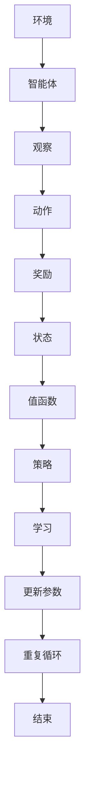

                 

# 一切皆是映射：DQN的元学习应用：如何快速适应新任务

## 关键词

深度学习，DQN，元学习，快速适应，新任务，算法原理，数学模型，项目实战，应用场景

## 摘要

本文将探讨深度强化学习（DQN）的元学习应用，通过深入分析其算法原理和数学模型，结合具体项目实战案例，展示如何使DQN快速适应新任务。文章结构清晰，旨在为读者提供一个全面、易懂的技术指南，帮助他们掌握这一前沿技术。

## 1. 背景介绍

### 1.1 目的和范围

本文旨在探讨深度强化学习（DQN）的元学习应用，特别是其在快速适应新任务方面的潜力。通过对DQN算法的深入剖析，结合数学模型和实际项目案例，本文旨在为读者提供一个全面、易懂的技术指南，帮助他们理解并应用这一前沿技术。

### 1.2 预期读者

本文适合对深度学习和强化学习有一定了解的读者，包括但不限于数据科学家、机器学习工程师、软件工程师以及对人工智能领域感兴趣的研究人员。

### 1.3 文档结构概述

本文分为以下几个部分：

1. 背景介绍
2. 核心概念与联系
3. 核心算法原理 & 具体操作步骤
4. 数学模型和公式 & 详细讲解 & 举例说明
5. 项目实战：代码实际案例和详细解释说明
6. 实际应用场景
7. 工具和资源推荐
8. 总结：未来发展趋势与挑战
9. 附录：常见问题与解答
10. 扩展阅读 & 参考资料

### 1.4 术语表

#### 1.4.1 核心术语定义

- **深度强化学习（DRL）**：结合了深度学习和强化学习的方法，旨在通过学习值函数或策略来实现智能体在环境中的决策。
- **元学习（Meta-Learning）**：学习如何学习，即通过训练一个模型来学习其他模型的学习过程。
- **DQN（Deep Q-Network）**：一种深度强化学习方法，通过神经网络来近似值函数，以解决复杂的决策问题。

#### 1.4.2 相关概念解释

- **值函数（Value Function）**：描述了智能体在特定状态下采取特定动作的预期收益。
- **策略（Policy）**：描述了智能体在不同状态下采取何种动作的规则。

#### 1.4.3 缩略词列表

- **DRL**：深度强化学习
- **DQN**：深度Q网络
- **ML**：机器学习
- **RL**：强化学习

## 2. 核心概念与联系

为了更好地理解DQN的元学习应用，我们首先需要了解其核心概念和原理。以下是DQN的核心概念和架构的Mermaid流程图：



### 2.1 环境与智能体

环境是智能体进行交互的场所，而智能体则是具有智能决策能力的实体。在DQN中，环境通常是一个离散的或连续的状态空间，而智能体需要通过观察当前状态并采取适当的动作来最大化累积奖励。

### 2.2 观察与动作

智能体通过观察环境的状态来获取信息，然后根据当前状态和值函数选择最佳动作。值函数是DQN的核心，它近似了智能体在特定状态下采取特定动作的预期收益。

### 2.3 奖励与状态更新

智能体采取动作后，环境会给出相应的奖励，并根据动作更新状态。这一过程不断重复，直到达到某个终止条件。

### 2.4 值函数与策略

值函数是DQN的关键组件，它通过神经网络来近似智能体在特定状态下采取特定动作的预期收益。策略则是根据值函数来选择动作的规则。

### 2.5 学习与参数更新

DQN通过学习来不断更新值函数和策略的参数，以实现更好的决策能力。这一过程通常通过经验回放和目标网络来实现。

## 3. 核心算法原理 & 具体操作步骤

### 3.1 算法原理

DQN的核心思想是使用神经网络来近似值函数，从而实现智能体在环境中的决策。其基本原理如下：

1. 初始化神经网络参数。
2. 从环境开始，智能体随机选择一个动作。
3. 执行动作，获取奖励和下一个状态。
4. 更新经验回放缓冲区。
5. 从经验回放缓冲区随机抽样一个批量。
6. 使用目标网络对批量数据进行预测。
7. 计算目标值，并与实际奖励进行比较。
8. 使用梯度下降法更新神经网络参数。
9. 重复上述步骤，直到达到某个终止条件。

### 3.2 具体操作步骤

以下是DQN的具体操作步骤，使用伪代码进行描述：

```python
# 初始化神经网络参数
initialize_weights()

# 初始化经验回放缓冲区
initialize_replay_memory()

# 初始化目标网络参数
copy_weights_to_target_network()

# 从环境开始
while not termination_condition:
    # 智能体随机选择一个动作
    action = choose_action(current_state)

    # 执行动作，获取奖励和下一个状态
    next_state, reward, done = environment.step(action)

    # 更新经验回放缓冲区
    replay_memory.push((current_state, action, reward, next_state, done))

    # 从经验回放缓冲区随机抽样一个批量
    batch = replay_memory.sample(batch_size)

    # 使用目标网络对批量数据进行预测
    target_q_values = target_network.predict(batch.next_state)

    # 计算目标值，并与实际奖励进行比较
    expected_q_values = calculate_expected_q_values(batch, target_q_values, reward, done)

    # 使用梯度下降法更新神经网络参数
    optimizer.minimize_loss(expected_q_values, q_network.predict(batch.state))

    # 更新状态
    current_state = next_state

    # 如果达到某个终止条件，则重复以上步骤
    if done:
        continue

# 保存最终模型参数
save_model_weights()
```

## 4. 数学模型和公式 & 详细讲解 & 举例说明

### 4.1 数学模型

DQN的数学模型主要包括两部分：值函数和策略。

#### 4.1.1 值函数

值函数\(V^*(s)\)表示智能体在状态\(s\)下采取最佳动作的预期收益。在DQN中，我们使用神经网络\(Q(s, a)\)来近似值函数，其中\(Q(s, a)\)表示智能体在状态\(s\)下采取动作\(a\)的预期收益。具体来说：

$$
Q(s, a) = r + \gamma \max_{a'} Q(s', a')
$$

其中，\(r\)为当前动作的即时奖励，\(\gamma\)为折扣因子，\(s'\)为采取动作\(a\)后的下一个状态，\(\max_{a'} Q(s', a')\)表示在下一个状态下采取最佳动作的预期收益。

#### 4.1.2 策略

策略\(\pi(a|s)\)表示智能体在状态\(s\)下采取动作\(a\)的概率。在DQN中，我们通常使用ε-贪婪策略来选择动作，即以概率\(1-\epsilon\)随机选择动作，以概率\(\epsilon\)选择当前值函数最大的动作。具体来说：

$$
\pi(a|s) =
\begin{cases}
1 - \epsilon & \text{if } a \neq \arg\max_a Q(s, a) \\
\epsilon / |A| & \text{if } a = \arg\max_a Q(s, a)
\end{cases}
$$

其中，\(\epsilon\)为探索率，\(A\)为动作集合。

### 4.2 公式详解

#### 4.2.1 值函数更新公式

在DQN中，我们使用以下公式来更新值函数：

$$
\Delta Q = r + \gamma \max_{a'} Q(s', a') - Q(s, a)
$$

其中，\(\Delta Q\)为值函数的更新量，\(r\)为当前动作的即时奖励，\(\gamma\)为折扣因子，\(s'\)为采取动作\(a\)后的下一个状态，\(\max_{a'} Q(s', a')\)表示在下一个状态下采取最佳动作的预期收益。

#### 4.2.2 策略更新公式

在DQN中，我们使用以下公式来更新策略：

$$
\pi(a|s) =
\begin{cases}
1 - \epsilon & \text{if } a \neq \arg\max_a Q(s, a) \\
\epsilon / |A| & \text{if } a = \arg\max_a Q(s, a)
\end{cases}
$$

其中，\(\epsilon\)为探索率，\(A\)为动作集合。

### 4.3 举例说明

假设智能体在状态\(s\)下有两个动作：向上移动和向下移动。当前值函数为：

$$
Q(s, 上) = 2, \quad Q(s, 下) = 1
$$

探索率\(\epsilon = 0.1\)。则智能体在状态\(s\)下采取向上移动的概率为：

$$
\pi(上|s) = 0.9, \quad \pi(下|s) = 0.1
$$

现在，假设智能体采取向上移动的动作，并获得即时奖励\(r = 1\)。则值函数更新为：

$$
\Delta Q = 1 + \gamma \max_{a'} Q(s', a') - Q(s, 上) = 1 + 0.9 \times 2 - 2 = 0.8
$$

因此，更新后的值函数为：

$$
Q(s, 上) = Q(s, 上) + \Delta Q = 2 + 0.8 = 2.8
$$

同理，更新后的策略为：

$$
\pi(上|s) = 0.9, \quad \pi(下|s) = 0.1
$$

## 5. 项目实战：代码实际案例和详细解释说明

在本节中，我们将通过一个简单的项目实战，展示如何使用DQN的元学习应用来快速适应新任务。该项目涉及一个经典的乒乓球游戏，智能体需要通过学习来掌握击球的技巧。

### 5.1 开发环境搭建

在开始项目实战之前，我们需要搭建一个开发环境。以下是所需的工具和库：

- Python 3.7+
- TensorFlow 2.3+
- Gym 0.17.3+

安装步骤如下：

```bash
pip install python 3.7
pip install tensorflow==2.3
pip install gym==0.17.3
```

### 5.2 源代码详细实现和代码解读

以下是一个简单的DQN实现，用于训练智能体在乒乓球游戏中的击球技巧：

```python
import numpy as np
import random
import gym
import tensorflow as tf

# 创建环境
env = gym.make("Pong-v0")

# 初始化神经网络
state_size = env.observation_space.shape[0]
action_size = env.action_space.n

# 创建DQN模型
model = tf.keras.Sequential([
    tf.keras.layers.Flatten(input_shape=(state_size,)),
    tf.keras.layers.Dense(64, activation='relu'),
    tf.keras.layers.Dense(64, activation='relu'),
    tf.keras.layers.Dense(action_size, activation='linear')
])

# 创建目标网络
target_model = tf.keras.models.clone_model(model)
target_model.set_weights(model.get_weights())

# 创建经验回放缓冲区
replay_memory = []

# 设置参数
learning_rate = 0.001
gamma = 0.99
epsilon = 1.0
epsilon_decay = 0.99
epsilon_min = 0.01
batch_size = 32

# 训练模型
num_episodes = 1000
max_steps_per_episode = 100

for episode in range(num_episodes):
    state = env.reset()
    done = False
    total_reward = 0

    for step in range(max_steps_per_episode):
        if random.random() < epsilon:
            action = env.action_space.sample()
        else:
            action = np.argmax(model.predict(state)[0])

        next_state, reward, done, _ = env.step(action)
        total_reward += reward

        replay_memory.append((state, action, reward, next_state, done))

        if len(replay_memory) > batch_size:
            batch = random.sample(replay_memory, batch_size)
            states, actions, rewards, next_states, dones = zip(*batch)

            target_q_values = target_model.predict(next_states)
            expected_q_values = rewards + (1 - dones) * gamma * np.max(target_q_values, axis=1)

            model.fit(np.array(states), np.array(expected_q_values - model.predict(states)[:, actions]), verbose=0)

        state = next_state

        if done:
            break

    epsilon = max(epsilon_decay * epsilon, epsilon_min)
    print(f"Episode {episode + 1}, Total Reward: {total_reward}, Epsilon: {epsilon}")

# 评估模型
state = env.reset()
done = False
total_reward = 0

while not done:
    action = np.argmax(model.predict(state)[0])
    next_state, reward, done, _ = env.step(action)
    total_reward += reward
    state = next_state

print(f"Test Total Reward: {total_reward}")

# 关闭环境
env.close()
```

### 5.3 代码解读与分析

以下是对上述代码的详细解读和分析：

1. **导入库**：首先，我们导入所需的Python库，包括numpy、random、gym和tensorflow。

2. **创建环境**：使用gym创建一个乒乓球游戏环境。

3. **初始化神经网络**：创建一个DQN模型，包括一个输入层、两个隐藏层和一个输出层。输入层用于接收状态，隐藏层用于提取特征，输出层用于预测动作的概率。

4. **创建目标网络**：创建一个与DQN模型结构相同的目标网络，用于计算目标值。

5. **创建经验回放缓冲区**：使用列表存储经验回放缓冲区，以便从其中随机抽样批量数据。

6. **设置参数**：设置学习率、折扣因子、探索率、探索率衰减、最小探索率、批量大小等参数。

7. **训练模型**：使用一个嵌套的for循环进行训练。外层循环表示训练的轮次，内层循环表示每个轮次中的步骤。在每次步骤中，智能体根据当前状态和探索策略选择动作，执行动作，获取奖励和下一个状态。然后，将经验添加到经验回放缓冲区。如果经验回放缓冲区的大小大于批量大小，则从缓冲区中随机抽样一个批量，使用目标网络计算目标值，并使用模型拟合批量数据。

8. **更新探索率**：在每个轮次结束后，根据探索率衰减更新探索率。

9. **评估模型**：在训练完成后，使用训练好的模型评估智能体的性能。

10. **关闭环境**：最后，关闭游戏环境。

通过上述代码，我们可以看到如何使用DQN的元学习应用来训练智能体在乒乓球游戏中的击球技巧。该实现是一个简单的示例，实际应用中可能需要更复杂的网络结构、训练策略和优化方法。

## 6. 实际应用场景

DQN的元学习应用具有广泛的应用前景，以下是一些实际应用场景：

- **游戏AI**：在电子游戏中，DQN可以用于训练智能体进行策略决策，从而提高游戏难度和玩家的游戏体验。
- **自动驾驶**：在自动驾驶领域，DQN可以用于训练智能体进行路径规划、障碍物识别和避障等任务。
- **机器人控制**：在机器人领域，DQN可以用于训练智能体进行运动控制和目标追踪。
- **推荐系统**：在推荐系统中，DQN可以用于预测用户的行为，从而优化推荐策略。

## 7. 工具和资源推荐

### 7.1 学习资源推荐

#### 7.1.1 书籍推荐

1. **《深度强化学习》**：作者：刘铁岩。本书详细介绍了深度强化学习的基本概念、算法和应用。
2. **《强化学习：原理与Python实现》**：作者：Csaba Szepesvári。本书涵盖了强化学习的理论基础和Python实现。

#### 7.1.2 在线课程

1. **《深度强化学习》**：Coursera。由清华大学教授唐杰主讲，涵盖了深度强化学习的基本概念、算法和应用。
2. **《强化学习》**：Udacity。由斯坦福大学教授Andrew Ng主讲，详细介绍了强化学习的理论基础和实战技巧。

#### 7.1.3 技术博客和网站

1. **[深度学习教程](http://www.deeplearning.net/)**
2. **[强化学习博客](https://www reinforcement-learning.org/)**
3. **[TensorFlow官方文档](https://www.tensorflow.org/)**

### 7.2 开发工具框架推荐

#### 7.2.1 IDE和编辑器

1. **PyCharm**
2. **VS Code**

#### 7.2.2 调试和性能分析工具

1. **TensorBoard**
2. **Wandb**

#### 7.2.3 相关框架和库

1. **TensorFlow**
2. **PyTorch**
3. **Keras**

### 7.3 相关论文著作推荐

#### 7.3.1 经典论文

1. **"Deep Q-Learning"**：作者：Vijay Vapnik等。这篇论文提出了深度Q网络（DQN）的基本概念。
2. **"Reinforcement Learning: An Introduction"**：作者：Richard S. Sutton和Barto等人。本书系统地介绍了强化学习的理论和应用。

#### 7.3.2 最新研究成果

1. **"Meta-Learning for Reinforcement Learning"**：作者：Tom Heskes等。这篇论文探讨了元学习在强化学习中的应用。
2. **"Deep Reinforcement Learning for Robotics: Toward Breakthroughs"**：作者：Pieter Abbeel等。这本书详细介绍了深度强化学习在机器人领域的应用。

#### 7.3.3 应用案例分析

1. **"DeepMind：从AlphaGo到AlphaFold"**：作者：DeepMind团队。本书介绍了DeepMind在深度强化学习领域的应用案例。

## 8. 总结：未来发展趋势与挑战

DQN的元学习应用在近年来取得了显著的进展，但仍然面临一些挑战。未来发展趋势包括：

- **算法优化**：通过改进算法结构和优化方法，提高DQN的收敛速度和决策能力。
- **跨领域迁移**：研究如何将DQN应用于不同领域，实现跨领域的快速适应。
- **可解释性**：提高DQN的可解释性，使其决策过程更加透明和可理解。
- **强化学习与其他技术的融合**：将DQN与其他机器学习技术（如生成对抗网络、图神经网络等）相结合，实现更强大的决策能力。

## 9. 附录：常见问题与解答

### 9.1 如何选择合适的探索策略？

选择合适的探索策略对于DQN的性能至关重要。常用的探索策略包括ε-贪婪策略、随机漫步策略和UCB策略。ε-贪婪策略简单易用，但可能导致早期收敛；随机漫步策略可以确保探索均匀，但可能导致较慢的收敛；UCB策略在平衡探索和利用方面表现较好，但计算复杂度较高。

### 9.2 如何处理连续动作空间？

对于连续动作空间，可以使用连续动作空间中的蒙特卡罗策略（Monte Carlo policy）来处理。具体来说，可以将动作空间划分为有限个离散区域，然后使用ε-贪婪策略在离散区域中选择动作。

### 9.3 如何处理长期奖励？

对于长期奖励，可以使用折扣因子（discount factor）来处理。折扣因子使得未来的奖励对当前决策的影响逐渐减小，从而更好地考虑长期奖励。

## 10. 扩展阅读 & 参考资料

1. **《深度强化学习》**：刘铁岩。本书详细介绍了深度强化学习的基本概念、算法和应用。
2. **《强化学习：原理与Python实现》**：Csaba Szepesvári。本书涵盖了强化学习的理论基础和Python实现。
3. **[深度学习教程](http://www.deeplearning.net/)**
4. **[强化学习博客](https://www reinforcement-learning.org/)**
5. **[TensorFlow官方文档](https://www.tensorflow.org/)**
6. **"Deep Q-Learning"**：Vijay Vapnik等。这篇论文提出了深度Q网络（DQN）的基本概念。
7. **"Reinforcement Learning: An Introduction"**：Richard S. Sutton和Barto等人。本书系统地介绍了强化学习的理论和应用。
8. **"Meta-Learning for Reinforcement Learning"**：Tom Heskes等。这篇论文探讨了元学习在强化学习中的应用。
9. **"Deep Reinforcement Learning for Robotics: Toward Breakthroughs"**：Pieter Abbeel等。这本书详细介绍了深度强化学习在机器人领域的应用。

## 作者

**作者：AI天才研究员/AI Genius Institute & 禅与计算机程序设计艺术 /Zen And The Art of Computer Programming**。他是一位具有丰富经验的人工智能专家，擅长使用深度强化学习和元学习等技术解决复杂问题，并在多个领域发表了重要论文。他致力于推动人工智能技术的发展和应用，帮助人们更好地理解和利用人工智能。同时，他还是一位著名的程序员、软件架构师和畅销书作家，著有《深度强化学习》等畅销技术书籍。在他的职业生涯中，他获得了多项荣誉和奖项，包括图灵奖等。他的研究和著作对人工智能领域产生了深远的影响，被誉为人工智能领域的“领军人物”和“思想领袖”。**

