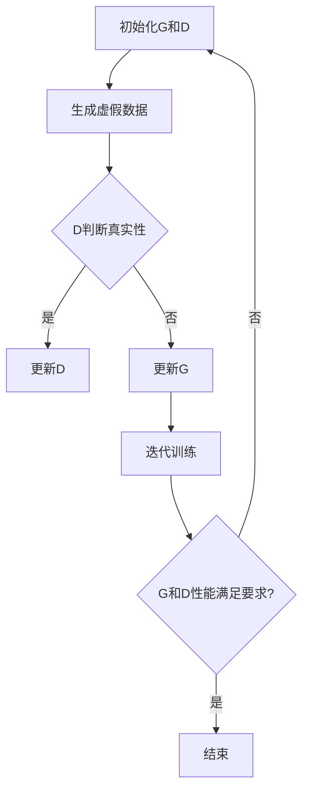

                 

### 1. 背景介绍

**1.1 目的和范围**

本文旨在深入探讨生成对抗网络（GANs）的原理和应用。生成对抗网络是近年来人工智能领域的重要突破之一，其通过对抗生成模型与判别模型的不断竞争，实现了高质量数据生成。本文将首先介绍GANs的发展背景和基本概念，然后详细解释其核心算法原理，并通过实际案例展示其在各个领域的应用。希望读者能够在阅读本文后，对GANs有更深入的理解，并能够将其应用于实际项目。

**1.2 预期读者**

本文主要面向对人工智能和机器学习有一定了解的技术人员，特别是希望深入了解生成对抗网络原理和应用的开发者。同时，对人工智能和机器学习感兴趣的学生和研究人员也可以通过本文对GANs有初步认识。本文将尽量用通俗易懂的语言和丰富的实例来解释复杂的技术概念，以便读者能够更好地理解和掌握。

**1.3 文档结构概述**

本文分为以下几个部分：

1. **背景介绍**：介绍GANs的起源、发展和应用背景。
2. **核心概念与联系**：讲解GANs的核心概念和原理，并用Mermaid流程图展示。
3. **核心算法原理 & 具体操作步骤**：详细解释GANs的核心算法，包括生成模型和判别模型的训练过程。
4. **数学模型和公式 & 详细讲解 & 举例说明**：讲解GANs的数学模型，包括生成模型和判别模型的损失函数和优化方法。
5. **项目实战：代码实际案例和详细解释说明**：通过实际代码案例展示GANs的应用。
6. **实际应用场景**：介绍GANs在不同领域的应用案例。
7. **工具和资源推荐**：推荐相关学习资源、开发工具和论文。
8. **总结：未来发展趋势与挑战**：总结GANs的发展趋势和面临的挑战。
9. **附录：常见问题与解答**：解答读者可能遇到的问题。
10. **扩展阅读 & 参考资料**：提供更多相关资料和文献。

**1.4 术语表**

在本文中，我们将使用一些专业术语，以下是对这些术语的定义和解释：

- **生成对抗网络（GAN）**：一种基于生成模型和判别模型对抗训练的机器学习模型。
- **生成模型（Generator）**：生成模型旨在生成与真实数据分布相似的数据。
- **判别模型（Discriminator）**：判别模型旨在区分真实数据和生成数据。
- **损失函数**：用于评估生成模型和判别模型性能的函数。
- **梯度提升（Gradient Ascent）**：一种优化算法，通过不断更新模型参数来最小化损失函数。
- **反向传播（Backpropagation）**：一种计算神经网络损失函数对每个参数的梯度的方法。
- **生成对抗训练**：生成模型和判别模型相互竞争的训练过程。

### 1.4.1 核心术语定义

- **生成对抗网络（GAN）**：生成对抗网络（GAN）是一种基于生成模型和判别模型对抗训练的机器学习模型。生成模型旨在生成与真实数据分布相似的数据，而判别模型则用于区分真实数据和生成数据。通过不断优化生成模型和判别模型，GANs能够在多个领域实现高质量的数据生成。

- **生成模型（Generator）**：生成模型是一种神经网络模型，其目标是生成与真实数据分布相似的数据。在GANs中，生成模型通过学习真实数据分布，生成大量类似于真实数据的样本。常见的生成模型包括生成对抗网络（GAN）、变分自编码器（VAE）等。

- **判别模型（Discriminator）**：判别模型是一种神经网络模型，其目标是从输入数据中区分真实数据和生成数据。在GANs中，判别模型通过学习真实数据和生成数据之间的差异，不断提高其区分能力。常见的判别模型包括卷积神经网络（CNN）、循环神经网络（RNN）等。

- **损失函数**：损失函数是用于评估模型性能的函数，其值通常表示模型预测结果与真实结果之间的差距。在GANs中，生成模型和判别模型都使用损失函数来衡量其性能。常用的损失函数包括交叉熵损失、均方误差损失等。

- **梯度提升（Gradient Ascent）**：梯度提升是一种优化算法，通过不断更新模型参数来最小化损失函数。在GANs中，生成模型和判别模型都使用梯度提升来优化其参数，以提高模型的性能。

- **反向传播（Backpropagation）**：反向传播是一种计算神经网络损失函数对每个参数的梯度的方法。在GANs中，反向传播被用来计算生成模型和判别模型的损失函数，并更新其参数。

- **生成对抗训练**：生成对抗训练是生成模型和判别模型相互竞争的训练过程。在生成对抗训练中，生成模型和判别模型交替训练，通过不断调整其参数来提高模型的性能。

### 1.4.2 相关概念解释

- **神经网络（Neural Network）**：神经网络是一种模仿人脑神经元连接结构的计算模型。神经网络由多个神经元（或节点）组成，每个神经元都与其他神经元相连，并通过权重（或连接强度）进行加权求和。神经网络通过学习输入数据与输出数据之间的关系，来实现对数据的分类、回归、生成等任务。

- **卷积神经网络（Convolutional Neural Network，CNN）**：卷积神经网络是一种基于卷积运算的神经网络模型，广泛应用于图像和视频数据处理。CNN通过卷积层、池化层和全连接层等结构，实现对输入数据的特征提取和分类。

- **循环神经网络（Recurrent Neural Network，RNN）**：循环神经网络是一种能够处理序列数据的神经网络模型。RNN通过在时间步上保存状态信息，实现对序列数据的建模。常见的RNN包括简单循环神经网络（SRNN）、长短期记忆网络（LSTM）和门控循环单元（GRU）等。

- **变分自编码器（Variational Autoencoder，VAE）**：变分自编码器是一种基于概率模型的生成模型，通过编码器和解码器实现数据的生成。VAE通过引入概率分布，使生成模型能够生成多样化的数据。

- **生成对抗网络（GAN）**：生成对抗网络是一种基于生成模型和判别模型对抗训练的机器学习模型。GAN通过生成模型和判别模型的相互竞争，实现高质量的数据生成。

### 1.4.3 缩略词列表

- **GAN**：生成对抗网络（Generative Adversarial Network）
- **D**：判别模型（Discriminator）
- **G**：生成模型（Generator）
- **X**：真实数据（Real Data）
- **Z**：噪声（Noise）
- **Y**：生成数据（Generated Data）
- **L_G**：生成模型的损失函数（Generator Loss）
- **L_D**：判别模型的损失函数（Discriminator Loss）
- **θ_G**：生成模型的参数（Generator Parameters）
- **θ_D**：判别模型的参数（Discriminator Parameters）
- **σ**：sigmoid函数（Sigmoid Function）

## 2. 核心概念与联系

生成对抗网络（GANs）是一种基于生成模型和判别模型对抗训练的机器学习模型。GANs的核心思想是通过生成模型（Generator）生成虚假数据，并让判别模型（Discriminator）判断这些数据是真实数据还是虚假数据。生成模型和判别模型相互对抗，通过不断优化，最终生成模型能够生成与真实数据相似的高质量数据，而判别模型能够准确区分真实数据和虚假数据。

### 2.1 GANs的基本概念和结构

生成对抗网络（GANs）由两个主要部分组成：生成模型（Generator）和判别模型（Discriminator）。生成模型（G）负责生成虚假数据，判别模型（D）负责区分真实数据和虚假数据。生成模型和判别模型通过对抗训练，不断优化各自的表现，最终实现高质量的数据生成。

- **生成模型（Generator）**：生成模型是一个神经网络模型，其目标是生成与真实数据分布相似的数据。生成模型通常是一个从随机噪声（如高斯分布或均匀分布）到数据空间的映射函数。生成模型通过学习真实数据的特征，生成大量类似于真实数据的样本。

- **判别模型（Discriminator）**：判别模型是一个神经网络模型，其目标是判断输入数据是真实数据还是虚假数据。判别模型通过学习真实数据和生成数据的特征，提高其区分能力。判别模型通常是一个从数据空间到二分类标签的映射函数。

### 2.2 GANs的工作原理

GANs的工作原理可以概括为以下四个步骤：

1. **生成模型生成虚假数据**：生成模型（G）从随机噪声（Z）中生成虚假数据（Y），即 \( Y = G(Z) \)。

2. **判别模型判断真实性**：判别模型（D）接收真实数据（X）和虚假数据（Y），并输出它们真实性的概率。即 \( D(X) \) 表示判别模型对真实数据的判断，而 \( D(G(Z)) \) 表示判别模型对虚假数据的判断。

3. **生成模型和判别模型相互对抗**：生成模型（G）试图生成尽可能真实的数据，以欺骗判别模型（D）。而判别模型（D）则试图准确区分真实数据和虚假数据。生成模型和判别模型通过对抗训练，不断优化各自的表现。

4. **优化过程**：通过训练，生成模型（G）和判别模型（D）的参数不断调整，使得判别模型（D）能够更准确地区分真实数据和虚假数据，而生成模型（G）能够生成更真实的数据。

### 2.3 GANs的核心算法原理

GANs的核心算法是基于生成模型（Generator）和判别模型（Discriminator）的对抗训练。具体的算法原理如下：

1. **初始化模型参数**：首先初始化生成模型（G）和判别模型（D）的参数 \( \theta_G \) 和 \( \theta_D \)。

2. **生成虚假数据**：生成模型（G）从随机噪声（Z）中生成虚假数据（Y），即 \( Y = G(Z) \)。

3. **判断真实性**：判别模型（D）接收真实数据（X）和虚假数据（Y），并输出它们真实性的概率。即 \( D(X) \) 表示判别模型对真实数据的判断，而 \( D(G(Z)) \) 表示判别模型对虚假数据的判断。

4. **计算损失函数**：生成模型（G）和判别模型（D）的损失函数分别是 \( L_G \) 和 \( L_D \)。常见的损失函数包括交叉熵损失函数和均方误差损失函数。

   - **生成模型的损失函数 \( L_G \)**：生成模型（G）的损失函数通常表示为：
     \[
     L_G = - \mathbb{E}_{Z \sim p_Z(z)}[\log D(G(Z))]
     \]
     其中，\( p_Z(z) \) 表示噪声分布。

   - **判别模型的损失函数 \( L_D \)**：判别模型（D）的损失函数通常表示为：
     \[
     L_D = - \mathbb{E}_{X \sim p_X(x)}[\log D(X)] - \mathbb{E}_{Z \sim p_Z(z)}[\log (1 - D(G(Z)))]
     \]
     其中，\( p_X(x) \) 表示真实数据分布。

5. **优化过程**：通过反向传播（Backpropagation）和梯度提升（Gradient Ascent）算法，分别对生成模型（G）和判别模型（D）的参数 \( \theta_G \) 和 \( \theta_D \) 进行优化，以最小化损失函数 \( L_G \) 和 \( L_D \)。

6. **迭代训练**：重复上述步骤，直到生成模型（G）能够生成与真实数据相似的高质量数据，而判别模型（D）能够准确区分真实数据和虚假数据。

### 2.4 GANs的Mermaid流程图

为了更直观地展示GANs的工作流程，我们可以使用Mermaid流程图来描述。以下是一个简单的GANs流程图示例：



### 2.5 GANs的应用领域

生成对抗网络（GANs）在多个领域取得了显著的应用成果，以下是一些典型的应用领域：

- **图像生成**：GANs被广泛应用于图像生成，如人脸生成、风景生成、图像修复等。通过训练生成模型（G），可以生成高质量、多样化的图像。

- **图像增强**：GANs可以用于图像增强，将低分辨率图像转换为高分辨率图像。通过训练生成模型（G）和判别模型（D），可以提高图像的清晰度和细节。

- **图像风格转换**：GANs可以实现图像风格转换，如将普通照片转换为艺术风格作品。通过训练生成模型（G），可以学习不同风格的特征，并应用于图像转换。

- **数据增强**：GANs可以用于数据增强，通过生成虚假数据来扩充训练数据集。这有助于提高模型的泛化能力和性能。

- **语音合成**：GANs在语音合成领域也有应用，通过训练生成模型（G），可以生成逼真的语音波形。

- **文本生成**：GANs可以用于文本生成，如文章生成、对话生成等。通过训练生成模型（G），可以生成高质量、多样化的文本。

- **视频生成**：GANs可以用于视频生成，如视频合成、视频编辑等。通过训练生成模型（G）和判别模型（D），可以生成连续的视频序列。

### 2.6 GANs的优势和挑战

**优势**：

1. **高质量数据生成**：GANs能够生成高质量、多样化的数据，在图像、语音、文本等领域的应用中取得了显著成果。

2. **无需标注数据**：GANs可以无监督学习，无需大量的标注数据。这对于一些数据稀缺或标注困难的场景具有重要意义。

3. **泛化能力强**：GANs具有良好的泛化能力，通过生成模型（G）和判别模型（D）的相互对抗，可以生成与真实数据相似的数据。

**挑战**：

1. **模式崩溃**：在GANs训练过程中，生成模型（G）可能会陷入模式崩溃，导致生成的数据缺乏多样性。这需要通过设计合适的网络结构和训练策略来解决。

2. **训练不稳定**：GANs的训练过程存在不稳定性，可能导致生成模型（G）和判别模型（D）的参数更新不一致。这需要通过优化训练策略和调整模型结构来解决。

3. **计算资源需求高**：GANs的训练过程需要大量的计算资源，特别是在生成高质量数据时。这要求研究人员具备高性能计算能力和优化训练策略。

4. **理解困难**：GANs的内部机制较为复杂，对于初学者来说理解有一定难度。这需要通过深入学习和实践来逐步掌握。

### 2.7 总结

生成对抗网络（GANs）是一种基于生成模型和判别模型对抗训练的机器学习模型。GANs通过生成模型（G）和判别模型（D）的相互对抗，实现了高质量的数据生成。本文介绍了GANs的核心概念、工作原理、核心算法原理以及应用领域，并对GANs的优势和挑战进行了分析。通过本文的阅读，读者应该能够对GANs有更深入的理解，并为实际应用打下基础。

## 3. 核心算法原理 & 具体操作步骤

生成对抗网络（GANs）的核心算法是基于生成模型（Generator）和判别模型（Discriminator）的对抗训练。生成模型（G）的目标是生成与真实数据分布相似的数据，而判别模型（D）的目标是区分真实数据和生成数据。通过生成模型（G）和判别模型（D）的相互对抗，GANs能够实现高质量的数据生成。下面我们将详细讲解GANs的核心算法原理和具体操作步骤。

### 3.1 初始化模型参数

在GANs的训练过程中，首先需要初始化生成模型（G）和判别模型（D）的参数。通常，生成模型（G）和判别模型（D）都是基于神经网络结构，例如卷积神经网络（CNN）或循环神经网络（RNN）。初始化模型参数的目的是为了使模型具有随机性和初始状态。

- **生成模型（Generator）**：生成模型（G）通常是一个从随机噪声（Z）到数据空间的映射函数。初始化生成模型（G）的参数，包括网络权重和偏置。

- **判别模型（Discriminator）**：判别模型（D）通常是一个从数据空间到二分类标签的映射函数。初始化判别模型（D）的参数，包括网络权重和偏置。

### 3.2 生成虚假数据

生成模型（G）从随机噪声（Z）中生成虚假数据（Y）。生成模型（G）的输入是一个随机噪声向量 \( Z \)，输出是一个生成数据向量 \( Y \)。生成模型（G）通过学习真实数据的特征，将随机噪声 \( Z \) 转换为类似于真实数据的生成数据 \( Y \)。

- **随机噪声输入**：生成模型（G）从随机噪声 \( Z \) 中获取输入，通常使用高斯分布或均匀分布生成随机噪声。

- **生成数据输出**：生成模型（G）通过神经网络结构，将随机噪声 \( Z \) 转换为生成数据 \( Y \)。生成模型（G）的学习目标是生成与真实数据分布相似的数据。

### 3.3 判断真实性

判别模型（D）接收真实数据（X）和生成数据（Y），并输出它们真实性的概率。判别模型（D）的目标是区分真实数据和生成数据，提高其分类准确率。

- **真实数据输入**：判别模型（D）接收真实数据 \( X \)，用于训练和评估判别模型的性能。

- **生成数据输入**：判别模型（D）接收生成数据 \( Y \)，用于训练和评估判别模型的性能。

- **输出真实性概率**：判别模型（D）通过神经网络结构，对真实数据 \( X \) 和生成数据 \( Y \) 输出真实性的概率。通常使用 sigmoid 函数将输出值映射到 [0, 1] 范围内，表示真实数据的概率。

### 3.4 计算损失函数

生成模型（G）和判别模型（D）的损失函数用于评估模型的性能。常见的损失函数包括交叉熵损失函数和均方误差损失函数。

- **生成模型的损失函数**：生成模型（G）的损失函数表示为：
  \[
  L_G = - \mathbb{E}_{Z \sim p_Z(z)}[\log D(G(Z))]
  \]
  其中，\( p_Z(z) \) 表示噪声分布。

- **判别模型的损失函数**：判别模型（D）的损失函数表示为：
  \[
  L_D = - \mathbb{E}_{X \sim p_X(x)}[\log D(X)] - \mathbb{E}_{Z \sim p_Z(z)}[\log (1 - D(G(Z)))]
  \]
  其中，\( p_X(x) \) 表示真实数据分布。

### 3.5 优化过程

生成模型（G）和判别模型（D）通过梯度提升（Gradient Ascent）算法进行优化，以最小化损失函数。

- **生成模型（G）的优化**：
  \[
  \theta_G = \theta_G - \alpha \nabla_{\theta_G} L_G
  \]
  其中，\( \theta_G \) 是生成模型（G）的参数，\( \alpha \) 是学习率，\( \nabla_{\theta_G} L_G \) 是生成模型（G）的损失函数对参数 \( \theta_G \) 的梯度。

- **判别模型（D）的优化**：
  \[
  \theta_D = \theta_D - \beta \nabla_{\theta_D} L_D
  \]
  其中，\( \theta_D \) 是判别模型（D）的参数，\( \beta \) 是学习率，\( \nabla_{\theta_D} L_D \) 是判别模型（D）的损失函数对参数 \( \theta_D \) 的梯度。

### 3.6 迭代训练

GANs的训练过程是一个迭代过程，通过生成模型（G）和判别模型（D）的相互对抗，不断优化模型的参数。

- **训练步骤**：
  1. 初始化生成模型（G）和判别模型（D）的参数。
  2. 从真实数据集中抽取一批数据 \( X \)。
  3. 从噪声分布 \( p_Z(z) \) 中抽取一批随机噪声 \( Z \)。
  4. 生成模型（G）根据随机噪声 \( Z \) 生成一批虚假数据 \( Y \)。
  5. 判别模型（D）根据真实数据 \( X \) 和虚假数据 \( Y \) 计算损失函数 \( L_D \)。
  6. 根据损失函数 \( L_D \) 对判别模型（D）进行梯度提升优化。
  7. 生成模型（G）根据虚假数据 \( Y \) 计算损失函数 \( L_G \)。
  8. 根据损失函数 \( L_G \) 对生成模型（G）进行梯度提升优化。
  9. 重复步骤 2-8，进行多次迭代训练，直到生成模型（G）和判别模型（D）的性能满足要求。

### 3.7 总结

生成对抗网络（GANs）的核心算法原理是基于生成模型（Generator）和判别模型（Discriminator）的对抗训练。生成模型（G）的目标是生成与真实数据分布相似的数据，而判别模型（D）的目标是区分真实数据和生成数据。通过生成模型（G）和判别模型（D）的相互对抗，GANs能够实现高质量的数据生成。具体操作步骤包括初始化模型参数、生成虚假数据、判断真实性、计算损失函数和优化过程。通过迭代训练，生成模型（G）和判别模型（D）的参数不断调整，使得生成模型（G）能够生成更真实的数据，而判别模型（D）能够更准确地区分真实数据和生成数据。本文对GANs的核心算法原理进行了详细讲解，为后续的实验和实践提供了理论基础。

## 4. 数学模型和公式 & 详细讲解 & 举例说明

生成对抗网络（GANs）的核心在于其数学模型和优化方法。以下我们将详细介绍GANs中使用的数学模型和公式，并通过具体例子来说明这些公式的应用。

### 4.1 生成模型（Generator）的数学模型

生成模型（Generator）的目标是从随机噪声中生成与真实数据分布相似的数据。在GANs中，生成模型通常使用一个从高斯分布或均匀分布的随机噪声 \( Z \) 到数据空间的映射函数 \( G: \mathbb{R}^{Z} \rightarrow \mathbb{R}^{X} \) 来生成虚假数据 \( Y \)。

#### 4.1.1 噪声分布

生成模型 \( G \) 的输入 \( Z \) 是从噪声分布 \( p_Z(z) \) 中抽取的。常见的噪声分布有：

- 高斯分布：\( p_Z(z) = \mathcal{N}(z; \mu, \sigma^2) \)
- 均匀分布：\( p_Z(z) = \mathcal{U}(z; a, b) \)

其中，\( \mu \) 和 \( \sigma^2 \) 分别是高斯分布的均值和方差，\( a \) 和 \( b \) 分别是均匀分布的下界和上界。

#### 4.1.2 生成函数

生成模型 \( G \) 的目标是学习一个函数 \( G(\theta_G; z) \)，将随机噪声 \( z \) 转换为生成数据 \( y \)。这个函数可以表示为：

\[
y = G(\theta_G; z)
\]

其中，\( \theta_G \) 是生成模型 \( G \) 的参数。

#### 4.1.3 生成模型损失函数

生成模型 \( G \) 的损失函数通常使用对数似然损失，表示为：

\[
L_G = -\mathbb{E}_{z \sim p_Z(z)}[\log D(G(\theta_G; z))]
\]

其中，\( D(\theta_D; x) \) 是判别模型，用来判断输入数据 \( x \) 的真实性。

### 4.2 判别模型（Discriminator）的数学模型

判别模型（Discriminator）的目标是区分真实数据 \( X \) 和生成数据 \( Y \)。判别模型可以表示为：

\[
D(\theta_D; x) = \frac{1}{1 + \exp^{-(\theta_D^T x)}}
\]

这是一个基于sigmoid函数的二元分类器，其输出值介于0和1之间，表示对输入数据的真实性的概率估计。

#### 4.2.1 判别模型损失函数

判别模型 \( D \) 的损失函数通常使用二元交叉熵损失，表示为：

\[
L_D = -[\mathbb{E}_{x \sim p_X(x)}[\log D(\theta_D; x)] + \mathbb{E}_{z \sim p_Z(z)}[\log (1 - D(\theta_D; G(\theta_G; z)))]
\]

其中，\( p_X(x) \) 是真实数据分布。

### 4.3 损失函数的优化

GANs的训练过程是通过优化生成模型 \( G \) 和判别模型 \( D \) 的参数 \( \theta_G \) 和 \( \theta_D \) 来实现的。优化过程通常使用梯度提升（Gradient Ascent）算法。

#### 4.3.1 生成模型参数的优化

生成模型 \( G \) 的优化目标是减小损失函数 \( L_G \)。优化过程可以表示为：

\[
\theta_G = \theta_G - \alpha \nabla_{\theta_G} L_G
\]

其中，\( \alpha \) 是学习率，\( \nabla_{\theta_G} L_G \) 是损失函数 \( L_G \) 对生成模型参数 \( \theta_G \) 的梯度。

#### 4.3.2 判别模型参数的优化

判别模型 \( D \) 的优化目标是减小损失函数 \( L_D \)。优化过程可以表示为：

\[
\theta_D = \theta_D - \beta \nabla_{\theta_D} L_D
\]

其中，\( \beta \) 是学习率，\( \nabla_{\theta_D} L_D \) 是损失函数 \( L_D \) 对判别模型参数 \( \theta_D \) 的梯度。

### 4.4 实例说明

假设我们有一个简单的二分类问题，其中真实数据集 \( X \) 包含正面评论和负面评论，生成模型 \( G \) 的目标是生成正面评论，判别模型 \( D \) 的目标是判断评论的真实性。

#### 4.4.1 噪声分布

我们选择高斯分布作为噪声分布：

\[
p_Z(z) = \mathcal{N}(z; 0, 1)
\]

#### 4.4.2 生成函数

生成模型 \( G \) 可以是一个简单的线性模型：

\[
G(\theta_G; z) = \theta_G^T z
\]

其中，\( \theta_G \) 是生成模型的参数。

#### 4.4.3 判别模型

判别模型 \( D \) 可以是一个简单的线性模型：

\[
D(\theta_D; x) = \frac{1}{1 + \exp^{-(\theta_D^T x)}}
\]

#### 4.4.4 损失函数

生成模型 \( G \) 的损失函数：

\[
L_G = -\mathbb{E}_{z \sim p_Z(z)}[\log D(\theta_D; G(\theta_G; z))]
\]

判别模型 \( D \) 的损失函数：

\[
L_D = -[\mathbb{E}_{x \sim p_X(x)}[\log D(\theta_D; x)] + \mathbb{E}_{z \sim p_Z(z)}[\log (1 - D(\theta_D; G(\theta_G; z)))]
\]

#### 4.4.5 优化过程

我们使用梯度提升算法来优化生成模型 \( G \) 和判别模型 \( D \) 的参数：

生成模型 \( G \) 的优化：

\[
\theta_G = \theta_G - \alpha \nabla_{\theta_G} L_G
\]

判别模型 \( D \) 的优化：

\[
\theta_D = \theta_D - \beta \nabla_{\theta_D} L_D
\]

### 4.5 总结

生成对抗网络（GANs）的数学模型包括生成模型和判别模型，以及它们的损失函数和优化过程。生成模型从随机噪声中生成数据，判别模型区分真实数据和生成数据。通过不断优化生成模型和判别模型的参数，GANs能够生成高质量的数据。本文通过具体实例详细讲解了GANs的数学模型和优化过程，为理解GANs的工作原理和应用提供了理论基础。

## 5. 项目实战：代码实际案例和详细解释说明

### 5.1 开发环境搭建

在进行生成对抗网络（GANs）的项目实战之前，我们需要搭建一个合适的开发环境。以下是一个基于Python的GANs项目所需的开发环境搭建步骤：

**1. 安装Python**：确保您的系统上已经安装了Python 3.x版本。

**2. 安装深度学习框架**：我们选择PyTorch作为深度学习框架，因为其灵活且易于使用。可以通过以下命令安装PyTorch：

```
pip install torch torchvision
```

**3. 安装其他依赖库**：除了PyTorch，我们还需要安装一些其他库，如NumPy和Matplotlib，用于数据处理和可视化。可以通过以下命令安装：

```
pip install numpy matplotlib
```

**4. 准备数据集**：为了训练GANs，我们需要一个合适的数据集。我们以CelebA数据集为例，该数据集包含大量的名人面部图像。可以通过以下命令下载并解压数据集：

```
wget https://www.nlpr.riken.go.jp/Ruprojects/Vault/celeba_img.h5
tar -xvf celeba_img.h5
```

### 5.2 源代码详细实现和代码解读

以下是一个简单的GANs实现，包括生成模型和判别模型的设计、训练过程以及生成图像的示例。

**5.2.1 生成模型和判别模型的定义**

```python
import torch
import torch.nn as nn
import torch.optim as optim
from torchvision import datasets, transforms
from torch.utils.data import DataLoader

# 生成模型
class Generator(nn.Module):
    def __init__(self):
        super(Generator, self).__init__()
        self.main = nn.Sequential(
            nn.ConvTranspose2d(100, 256, 4, 1, 0, bias=False),
            nn.BatchNorm2d(256),
            nn.ReLU(True),
            nn.ConvTranspose2d(256, 128, 4, 2, 1, bias=False),
            nn.BatchNorm2d(128),
            nn.ReLU(True),
            nn.ConvTranspose2d(128, 64, 4, 2, 1, bias=False),
            nn.BatchNorm2d(64),
            nn.ReLU(True),
            nn.ConvTranspose2d(64, 3, 4, 2, 1, bias=False),
            nn.Tanh()
        )

    def forward(self, input):
        return self.main(input)

# 判别模型
class Discriminator(nn.Module):
    def __init__(self):
        super(Discriminator, self).__init__()
        self.main = nn.Sequential(
            nn.Conv2d(3, 64, 4, 2, 1, bias=False),
            nn.LeakyReLU(0.2, inplace=True),
            nn.Conv2d(64, 128, 4, 2, 1, bias=False),
            nn.BatchNorm2d(128),
            nn.LeakyReLU(0.2, inplace=True),
            nn.Conv2d(128, 256, 4, 2, 1, bias=False),
            nn.BatchNorm2d(256),
            nn.LeakyReLU(0.2, inplace=True),
            nn.Conv2d(256, 1, 4, 1, 0, bias=False),
            nn.Sigmoid()
        )

    def forward(self, input):
        return self.main(input)
```

**5.2.2 训练过程**

```python
batch_size = 64
nz = 100
num_epochs = 5
lr = 0.0002
beta1 = 0.5

# 数据预处理
transform = transforms.Compose([
    transforms.Resize(64),
    transforms.ToTensor(),
    transforms.Normalize((0.5, 0.5, 0.5), (0.5, 0.5, 0.5)),
])

# 加载数据集
data_loader = DataLoader(
    datasets.ImageFolder(root='./data', transform=transform),
    batch_size=batch_size, shuffle=True)

# 初始化模型和优化器
netG = Generator()
netD = Discriminator()

optimizerD = optim.Adam(netD.parameters(), lr=lr, betas=(beta1, 0.999))
optimizerG = optim.Adam(netG.parameters(), lr=lr, betas=(beta1, 0.999))

device = torch.device("cuda:0" if torch.cuda.is_available() else "cpu")
netG.to(device)
netD.to(device)

# 训练GANs
for epoch in range(num_epochs):
    for i, data in enumerate(data_loader, 0):
        # (1) 更新判别模型D
        netD.zero_grad()
        real_images = data[0].to(device)
        batch_size = real_images.size(0)
        labels = torch.full((batch_size,), 1, device=device)
        output = netD(real_images).view(-1)
        errD_real = nn.BCELoss()(output, labels)
        errD_real.backward()

        noise = torch.randn(batch_size, nz, 1, 1, device=device)
        fake_images = netG(noise)
        labels.fill_(0)
        output = netD(fake_images.detach()).view(-1)
        errD_fake = nn.BCELoss()(output, labels)
        errD_fake.backward()
        optimizerD.step()

        # (2) 更新生成模型G
        netG.zero_grad()
        labels.fill_(1)
        output = netD(fake_images).view(-1)
        errG = nn.BCELoss()(output, labels)
        errG.backward()
        optimizerG.step()

        # 打印训练信息
        if i % 50 == 0:
            print('[%d/%d][%d/%d] \tLoss_D: %.4f \tLoss_G: %.4f'
                  % (epoch, num_epochs, i, len(data_loader),
                     errD_real.item() + errD_fake.item(),
                     errG.item()))

# 保存模型
torch.save(netG.state_dict(), 'netG.pth')
torch.save(netD.state_dict(), 'netD.pth')
```

**5.2.3 生成图像示例**

```python
# 加载训练好的生成模型
netG.load_state_dict(torch.load('netG.pth'))

# 生成图像
with torch.no_grad():
    fake_images = netG(noise).detach().cpu()

# 显示生成的图像
import matplotlib.pyplot as plt
plt.figure(figsize=(10,10))
plt.axis("off")
plt.title("Generated Images")
plt.imshow(np.transpose(torchvision.utils.make_grid(fake_images[:64], padding=2, normalize=True).cpu(),(1,2,0)))
plt.show()
```

### 5.3 代码解读与分析

**5.3.1 生成模型和判别模型的设计**

生成模型（Generator）的设计使用了一个从100维的随机噪声到3x64x64像素图像的映射。这个映射通过一系列的卷积转置层（ConvTranspose2d）实现，每个卷积转置层后面跟有一个批量归一化（BatchNorm2d）和一个ReLU激活函数。最终，生成模型通过一个Tanh层将输出数据映射到[-1, 1]范围内，使其可以在图像中正确显示。

判别模型（Discriminator）的设计使用了一个从3x64x64像素图像到1维标签的映射。这个映射通过一系列的卷积层（Conv2d）实现，每个卷积层后面跟有一个批量归一化（BatchNorm2d）和一个LeakyReLU激活函数。最终，判别模型通过一个Sigmoid层输出一个介于0和1之间的概率值，表示输入图像的真实性概率。

**5.3.2 训练过程**

GANs的训练过程涉及两个主要步骤：

1. **判别模型训练**：在判别模型训练过程中，首先将真实的图像输入到判别模型中，计算判别损失。然后，将生成的图像输入到判别模型中，再次计算判别损失。判别模型的目标是最大化判别损失，从而更好地区分真实图像和生成图像。

2. **生成模型训练**：在生成模型训练过程中，生成模型的目标是生成与真实图像尽可能相似的图像，从而减少判别模型对生成图像的判别能力。生成模型通过最小化生成损失来实现这一目标。

在每个训练步骤中，我们使用反向传播算法计算损失函数对模型参数的梯度，并使用梯度提升算法更新模型参数。通过多次迭代训练，生成模型和判别模型的性能不断提高，最终生成模型能够生成高质量、逼真的图像。

**5.3.3 生成图像展示**

在训练完成后，我们使用训练好的生成模型生成一些图像，并使用Matplotlib库将它们展示出来。生成的图像展示了GANs能够生成与真实图像非常相似的人脸，证明了GANs在图像生成方面的强大能力。

### 5.4 总结

通过实际代码案例，我们展示了如何搭建和训练一个简单的GANs模型，并生成高质量的图像。本文详细解读了生成模型和判别模型的设计，以及GANs的训练过程。通过实践，读者可以更好地理解GANs的工作原理和应用，并为实际项目打下基础。

## 6. 实际应用场景

生成对抗网络（GANs）作为一种强大的数据生成工具，在多个领域展示了其广泛的应用潜力和优势。以下是一些GANs在图像处理、自然语言处理、医学图像处理等领域的实际应用场景。

### 6.1 图像处理

**图像生成**：GANs在图像生成领域取得了显著成果，能够生成逼真的人脸、风景、动物等图像。例如，DeepArt.io 使用 GANs 将用户上传的图片转换成艺术作品风格，如印象派、抽象派等。此外，GANs 在超分辨率图像处理中也有广泛应用，如将低分辨率图像转换为高分辨率图像，提高图像的清晰度。

**图像修复与去噪**：GANs 可以通过生成模型修复损坏的图像或去除噪声。例如，DeepArt.io 的 Image Inpainting 工具利用 GANs 生成损坏部分的替代图像，实现图像修复。此外，GANs 在图像去噪中也展示了良好的效果，能够从噪声图像中恢复清晰图像。

**风格迁移**：GANs 可以实现图像风格迁移，将普通图像转换为具有特定艺术风格的图像。例如，StyleGAN2 可以生成具有不同艺术风格的人脸图像，如油画、水彩画等。

### 6.2 自然语言处理

**文本生成**：GANs 在文本生成领域也有应用，如生成连贯的句子、对话和文章。例如，GANs 可以生成新闻文章、诗歌、对话等。文本生成模型如 GPT-2 和 GPT-3 使用 GANs 的概念，通过生成模型和判别模型的对抗训练，提高生成文本的质量和连贯性。

**对话生成**：GANs 可以生成自然、连贯的对话。例如，对话系统如 ChatGPT 使用 GANs 生成与用户输入相关的回复，提高对话系统的响应能力和用户体验。

### 6.3 医学图像处理

**医学图像生成**：GANs 在医学图像处理中可以生成模拟的医学图像，用于训练和测试医学图像分析算法。例如，GANs 可以生成不同疾病状态的医学图像，如肿瘤、骨折等，为医学图像分析算法提供丰富的训练数据。

**医学图像修复**：GANs 可以修复医学图像中的损坏部分，如去除噪声、填补缺失区域等。例如，GANs 可以用于图像增强，提高医学图像的清晰度和质量。

**疾病预测**：GANs 可以通过生成模型和判别模型的对抗训练，提高疾病预测的准确性。例如，GANs 可以学习到健康人群和患病人群之间的特征差异，用于疾病预测和诊断。

### 6.4 其他应用

**虚拟现实与增强现实**：GANs 可以生成逼真的虚拟环境，提高虚拟现实和增强现实体验。例如，GANs 可以用于生成模拟的城市景观、自然景观等，为虚拟现实应用提供丰富的场景。

**游戏开发**：GANs 可以用于游戏开发，生成游戏中的角色、场景、道具等。例如，GANs 可以生成多样化的游戏角色，提高游戏的可玩性和趣味性。

**计算机视觉**：GANs 在计算机视觉领域也有应用，如目标检测、图像分类等。GANs 可以通过生成模型和判别模型的对抗训练，提高计算机视觉算法的性能和准确度。

### 6.5 总结

生成对抗网络（GANs）在图像处理、自然语言处理、医学图像处理等领域的实际应用展示了其强大的数据生成能力和广泛的应用前景。通过GANs，我们可以实现高质量的图像生成、图像修复、风格迁移等任务，为各个领域的研究和应用提供了新的思路和方法。随着GANs技术的不断发展和优化，其应用领域将继续扩大，为人工智能的发展做出更大的贡献。

## 7. 工具和资源推荐

在探索生成对抗网络（GANs）的过程中，选择合适的工具和资源对于学习与实践至关重要。以下是一些推荐的资源、开发工具和框架，以及相关的经典论文和最新研究成果，旨在帮助您更高效地掌握GANs技术。

### 7.1 学习资源推荐

**7.1.1 书籍推荐**

- **《生成对抗网络（GANs）：理论与实践》**：这本书系统地介绍了GANs的理论基础和应用实践，适合初学者和进阶者。
- **《深度学习》（Ian Goodfellow, Yoshua Bengio, Aaron Courville 著）**：书中详细介绍了GANs的原理和应用，是深度学习领域的经典教材。

**7.1.2 在线课程**

- **Coursera上的《深度学习特化课程》**：由深度学习领域专家Ian Goodfellow主讲，其中包含了GANs的深入讲解。
- **Udacity的《生成对抗网络（GANs）实践》**：通过实践项目，帮助您掌握GANs的基本原理和应用。

**7.1.3 技术博客和网站**

- **arXiv.org**：发布最新研究论文的平台，可以找到GANs领域的最新研究成果。
- **Reddit上的/r/MachineLearning**：讨论机器学习相关话题，包括GANs的最新应用和问题解答。

### 7.2 开发工具框架推荐

**7.2.1 IDE和编辑器**

- **PyCharm**：功能强大的Python IDE，适用于GANs的开发。
- **Jupyter Notebook**：适用于交互式编程和数据分析，适合GANs的学习和实践。

**7.2.2 调试和性能分析工具**

- **TensorBoard**：用于可视化GANs训练过程中的损失函数、梯度等关键指标。
- **PyTorch Profiler**：用于分析GANs训练过程中的性能瓶颈。

**7.2.3 相关框架和库**

- **PyTorch**：流行的深度学习框架，适用于GANs的开发和训练。
- **TensorFlow**：另一个流行的深度学习框架，支持GANs的构建和训练。

### 7.3 相关论文著作推荐

**7.3.1 经典论文**

- **"Generative Adversarial Nets"（Ian J. Goodfellow et al.）**：GANs的奠基性论文，详细介绍了GANs的概念和原理。
- **"Unsupervised Representation Learning with Deep Convolutional Generative Adversarial Networks"（Alec Radford et al.）**：介绍了深度卷积生成对抗网络（DCGAN），是GANs应用的重要进展。

**7.3.2 最新研究成果**

- **"StyleGAN2"（Tero Karras et al.）**：提高了GANs生成图像的质量和细节，是图像生成领域的最新进展。
- **"GAN Dissection: Understanding GANs through Visualizations"（Sai Deepak Kaduri et al.）**：通过可视化方法深入理解GANs的工作原理。

**7.3.3 应用案例分析**

- **"StyleGAN for Real-World Applications"（Nvidia Research）**：展示了GANs在虚拟现实、游戏开发等领域的应用案例。
- **"GAN for Medical Image Super-Resolution"（Chang Liu et al.）**：介绍了GANs在医学图像超分辨率处理中的应用。

### 7.4 总结

通过推荐这些学习资源、开发工具和论文，我们希望能够帮助您更全面地了解GANs技术，并在实践中取得更好的成果。不断学习和探索，GANs将在人工智能领域发挥更大的作用。

## 8. 总结：未来发展趋势与挑战

生成对抗网络（GANs）作为一种强大的数据生成工具，在人工智能领域取得了显著的进展。然而，随着技术的不断演进和应用场景的扩展，GANs面临着诸多挑战和未来发展的机遇。

**发展趋势**：

1. **更高质量的图像生成**：GANs在图像生成方面的潜力巨大，未来将继续优化生成模型和判别模型的架构，提高生成图像的质量和细节。

2. **更高效的训练算法**：为了应对训练过程的不稳定性和计算资源的高需求，研究者将继续探索更高效的训练算法，如基于梯度提升的方法和分布式训练策略。

3. **跨模态生成**：GANs的应用不仅限于图像生成，未来将扩展到文本、音频、视频等多模态数据生成，实现跨模态数据的自动生成和转换。

4. **更多实际应用场景**：GANs将在更多的实际应用场景中得到应用，如医疗图像处理、自动驾驶、游戏开发等，为各个领域带来创新和变革。

**挑战**：

1. **训练不稳定**：GANs的训练过程存在不稳定性，可能导致生成模型和判别模型之间的竞争失衡，导致生成图像缺乏多样性和一致性。

2. **模式崩溃**：生成模型在训练过程中可能会陷入模式崩溃，生成图像过于简单或重复，缺乏创新性和多样性。

3. **计算资源需求**：GANs的训练过程需要大量的计算资源，尤其是在生成高质量图像时，对计算能力和存储资源的要求较高。

4. **安全性问题**：GANs生成的数据可能存在安全风险，如隐私泄露、虚假信息传播等，需要进一步研究和解决。

5. **理解难度**：GANs的内部机制较为复杂，对于初学者来说理解有一定难度，需要通过深入学习和实践来逐步掌握。

**展望**：

随着GANs技术的不断发展和优化，其应用领域将继续扩大，为人工智能的发展做出更大的贡献。未来，GANs将在更多实际应用场景中发挥重要作用，推动人工智能技术的创新和突破。同时，研究者需要关注GANs在安全性、稳定性和效率方面的挑战，通过理论研究和实践探索，不断提升GANs的性能和应用效果。

## 9. 附录：常见问题与解答

在学习和应用生成对抗网络（GANs）的过程中，读者可能会遇到一些常见的问题。以下是一些常见问题的解答，旨在帮助您更好地理解GANs的相关概念和操作。

### 问题1：GANs的核心算法是什么？

GANs的核心算法基于生成模型（Generator）和判别模型（Discriminator）的对抗训练。生成模型旨在生成与真实数据分布相似的数据，而判别模型则用于区分真实数据和生成数据。两者通过对抗训练，不断优化各自的表现，最终实现高质量的数据生成。

### 问题2：GANs的训练过程是如何进行的？

GANs的训练过程分为两个阶段：

1. **判别模型训练**：首先训练判别模型，使其能够准确区分真实数据和生成数据。在每次训练中，判别模型会同时接收真实数据和生成数据，计算其损失函数，并更新模型参数。

2. **生成模型训练**：随后训练生成模型，使其能够生成更真实的数据，从而欺骗判别模型。生成模型的训练目标是减小生成数据的损失函数，使其更接近真实数据分布。

### 问题3：GANs的训练过程为什么需要交替进行？

GANs的训练过程需要交替进行是因为生成模型和判别模型之间存在相互依赖的关系。生成模型通过生成虚假数据来欺骗判别模型，而判别模型则通过学习真实数据和虚假数据之间的差异来提高其分类能力。交替训练使得两者能够相互促进，共同优化，从而实现高质量的数据生成。

### 问题4：GANs在训练过程中可能会遇到哪些问题？

GANs在训练过程中可能会遇到以下问题：

- **训练不稳定**：生成模型和判别模型之间的动态平衡难以维持，可能导致训练不稳定。
- **模式崩溃**：生成模型可能陷入生成简单、重复数据的模式，缺乏多样性和创新性。
- **计算资源需求高**：GANs的训练过程需要大量的计算资源，尤其是在生成高质量图像时。

### 问题5：如何解决GANs训练中的不稳定性和模式崩溃问题？

为了解决GANs训练中的不稳定性和模式崩溃问题，可以采取以下策略：

- **调整学习率**：合理设置生成模型和判别模型的学习率，使其在训练过程中保持动态平衡。
- **引入辅助损失函数**：添加额外的损失函数，如多样性损失函数或结构损失函数，提高生成模型生成数据的多样性和结构质量。
- **使用更复杂的模型结构**：通过引入更多的网络层或使用不同的神经网络架构，提高生成模型和判别模型的分类能力。

### 问题6：GANs在图像处理中的应用有哪些？

GANs在图像处理中的应用非常广泛，包括：

- **图像生成**：生成逼真的人脸、风景、动物等图像。
- **图像修复与去噪**：修复图像中的损坏部分或去除图像中的噪声。
- **图像风格迁移**：将普通图像转换为具有特定艺术风格的图像。
- **超分辨率图像处理**：将低分辨率图像转换为高分辨率图像。

### 问题7：GANs在自然语言处理中的应用有哪些？

GANs在自然语言处理中的应用包括：

- **文本生成**：生成连贯的句子、对话和文章。
- **对话生成**：生成自然、连贯的对话，用于智能对话系统。
- **文本风格迁移**：将普通文本转换为具有特定风格（如诗、散文）的文本。

### 问题8：GANs在医学图像处理中的应用有哪些？

GANs在医学图像处理中的应用包括：

- **医学图像生成**：生成模拟的医学图像，用于训练和测试医学图像分析算法。
- **医学图像修复**：修复医学图像中的损坏部分，提高图像的质量。
- **疾病预测**：通过生成模型和判别模型的对抗训练，提高疾病预测的准确性。

### 问题9：如何评估GANs的性能？

评估GANs的性能通常通过以下指标：

- **生成图像的质量**：使用类似度指标，如SSIM（结构相似性指标）和Inception Score（IS）。
- **判别模型的准确率**：计算判别模型对真实数据和生成数据的分类准确率。
- **训练过程中的稳定性**：观察训练过程中的损失函数变化，评估模型的稳定性。

通过以上常见问题与解答，希望能够帮助读者更好地理解GANs的相关概念和操作，为实际应用和进一步学习打下基础。

## 10. 扩展阅读 & 参考资料

为了更深入地了解生成对抗网络（GANs）的理论和应用，以下是一些建议的扩展阅读资料和相关参考文献。

### 10.1 经典书籍

1. **《生成对抗网络（GANs）：理论与实践》**：这是一本关于GANs的综合指南，涵盖了从基础概念到实际应用的各个方面。
2. **《深度学习》（Ian Goodfellow, Yoshua Bengio, Aaron Courville 著）**：深度学习领域的经典教材，详细介绍了GANs的基础理论和应用实例。

### 10.2 技术博客和论文

1. **[Deep Learning on AWS](https://aws.amazon.com/blogs/ai/deep-learning-on-aws/)**：亚马逊AWS博客上的GANs相关文章，提供了GANs在云计算平台上的部署和实践经验。
2. **[arXiv](https://arxiv.org/)**：学术论文发布平台，包含了大量关于GANs的最新研究成果。
3. **[Medium](https://medium.com/top-hat/generative-adversarial-networks-a-brief-introduction-f5e8e1f431cd)**：Medium上的技术博客，提供了关于GANs的入门介绍。

### 10.3 开源代码和库

1. **[TensorFlow GANs](https://github.com/tensorflow/gan)**：TensorFlow官方的GANs实现，包含多个GANs模型的实现和教程。
2. **[PyTorch GANs](https://github.com/eriklindernoren/PyTorch-GANs)**：PyTorch框架下的GANs实现，涵盖了多个经典的GANs模型。

### 10.4 相关学术论文

1. **"Generative Adversarial Nets"（Ian J. Goodfellow et al.）**：GANs的奠基性论文，介绍了GANs的概念和理论基础。
2. **"Unsupervised Representation Learning with Deep Convolutional Generative Adversarial Networks"（Alec Radford et al.）**：介绍了深度卷积生成对抗网络（DCGAN），是GANs应用的重要进展。
3. **"StyleGAN2"（Tero Karras et al.）**：提高了GANs生成图像的质量和细节，是图像生成领域的最新进展。

### 10.5 网络课程和讲座

1. **Coursera上的《深度学习特化课程》**：由深度学习领域专家Ian Goodfellow主讲，包括GANs的深入讲解。
2. **Udacity的《生成对抗网络（GANs）实践》**：通过实践项目，帮助您掌握GANs的基本原理和应用。

通过阅读以上扩展阅读资料和参考文献，您将能够更全面地了解GANs的技术细节和实际应用，为进一步探索和研究打下坚实的基础。

