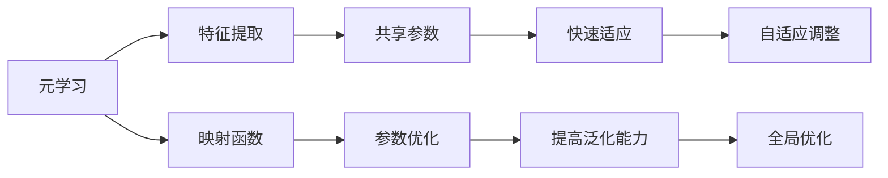

                 

# 一切皆是映射：使用元学习进行有效的特征提取

> **关键词**：元学习、特征提取、映射、神经网络、深度学习、映射函数、学习算法
>
> **摘要**：本文将探讨如何使用元学习进行有效的特征提取。我们将详细分析元学习的基本概念、原理以及在实际应用中的操作步骤，并通过实际代码案例展示其具体实现。此外，我们还将讨论元学习在各类应用场景中的实际应用，并推荐相关学习资源和工具。

## 1. 背景介绍

### 1.1 目的和范围

本文的主要目的是介绍元学习在特征提取中的应用，并通过具体的案例来说明其优势。我们将会探讨以下几个核心问题：

- 元学习的基本概念是什么？
- 元学习在特征提取中如何发挥作用？
- 元学习在实际应用中有哪些优势和挑战？
- 如何通过具体的代码示例来理解元学习在特征提取中的应用？

### 1.2 预期读者

本文适合以下几类读者：

- 对深度学习和神经网络有基本了解的技术人员。
- 对特征提取和机器学习有浓厚兴趣的科研人员和工程师。
- 希望了解元学习在实际应用中的具体实现和效果的实践者。

### 1.3 文档结构概述

本文将按照以下结构进行展开：

1. 背景介绍：介绍本文的目的、预期读者以及文档结构。
2. 核心概念与联系：介绍元学习的基本概念及其与特征提取的联系。
3. 核心算法原理 & 具体操作步骤：详细阐述元学习算法的原理和操作步骤。
4. 数学模型和公式 & 详细讲解 & 举例说明：解释元学习中的数学模型和公式，并通过实例进行说明。
5. 项目实战：提供实际代码案例和详细解释。
6. 实际应用场景：讨论元学习在不同领域的应用。
7. 工具和资源推荐：推荐学习资源、开发工具和框架。
8. 总结：未来发展趋势与挑战。
9. 附录：常见问题与解答。
10. 扩展阅读 & 参考资料：提供进一步阅读和参考资料。

### 1.4 术语表

#### 1.4.1 核心术语定义

- **元学习**：一种机器学习技术，旨在通过学习如何学习来提升学习效率。
- **特征提取**：从原始数据中提取具有区分性的信息，以便进行进一步的学习和处理。
- **映射函数**：将输入数据映射到特征空间中的函数。
- **深度学习**：一种基于神经网络的机器学习技术，通过多层网络结构来学习数据的复杂特征。
- **神经网络**：一种模拟人脑神经元之间相互连接的计算模型。

#### 1.4.2 相关概念解释

- **监督学习**：一种机器学习技术，通过标记数据来训练模型，使其能够对未知数据进行预测。
- **无监督学习**：一种机器学习技术，不依赖于标记数据，通过发现数据中的潜在结构和模式来进行学习。
- **迁移学习**：一种利用预先训练好的模型来加速新任务学习的技术。

#### 1.4.3 缩略词列表

- **DL**：深度学习
- **ML**：机器学习
- **RL**：强化学习
- **CNN**：卷积神经网络

## 2. 核心概念与联系

为了更好地理解元学习在特征提取中的应用，我们首先需要了解一些核心概念和它们之间的关系。以下是元学习、特征提取和映射函数之间的联系：

### 2.1.1 元学习的概念

元学习，也称为“学习如何学习”或“泛化学习”，是一种机器学习技术，旨在提高学习效率。它通过在不同的任务和数据集上训练模型，使得模型能够适应新的任务和数据，而不是为每个任务重新训练一个模型。元学习的核心思想是通过学习如何学习来减少对每个新任务的数据需求，提高模型的泛化能力。

### 2.1.2 特征提取的概念

特征提取是从原始数据中提取具有区分性的信息，以便进行进一步的学习和处理。在机器学习中，特征提取是至关重要的一步，因为有效的特征可以显著提高模型的性能。特征提取可以通过多种技术实现，包括降维、特征选择、特征工程等。

### 2.1.3 映射函数的概念

映射函数是将输入数据映射到特征空间的函数。在深度学习中，映射函数通常由神经网络来实现。神经网络通过调整内部参数来优化映射函数，从而使得模型能够更好地适应数据。

### 2.1.4 元学习与特征提取的联系

元学习在特征提取中的应用主要体现在以下几个方面：

1. **共享参数**：元学习通过共享参数来减少每个新任务的训练时间，从而提高特征提取的效率。
2. **快速适应**：元学习使得模型能够快速适应新的数据集和任务，从而提取出更加有效的特征。
3. **提高泛化能力**：通过在不同的任务和数据集上训练模型，元学习可以增强模型的泛化能力，使其能够更好地提取具有普遍性的特征。

### 2.1.5 元学习与映射函数的联系

元学习与映射函数之间的联系主要体现在以下几个方面：

1. **参数优化**：元学习通过优化映射函数的参数来提高模型的性能。
2. **自适应调整**：元学习使得映射函数能够根据新的数据和任务进行自适应调整。
3. **全局优化**：元学习通过在不同任务和数据集上的训练来优化映射函数，从而实现全局优化。

### 2.1.6 梅尔迪姆流程图（Mermaid 流程图）

以下是一个简单的梅尔迪姆流程图，展示了元学习、特征提取和映射函数之间的联系：



通过这个流程图，我们可以更直观地理解元学习、特征提取和映射函数之间的联系和作用。

## 3. 核心算法原理 & 具体操作步骤

在了解了元学习、特征提取和映射函数的基本概念及其联系后，我们将深入探讨元学习在特征提取中的核心算法原理和具体操作步骤。以下是元学习算法的基本原理和操作步骤：

### 3.1.1 元学习算法的基本原理

元学习算法的核心思想是通过在不同任务和数据集上训练模型，使得模型能够适应新的任务和数据。具体来说，元学习算法通过以下几个步骤来实现：

1. **初始化模型**：首先初始化一个基础模型，该模型将在多个任务和数据集上训练。
2. **任务适配**：对于每个新任务，将基础模型进行调整，使其适应新的任务和数据。
3. **参数优化**：通过调整模型参数来优化映射函数，从而提高模型的性能。
4. **模型更新**：将优化后的模型更新为新的基础模型，以便在下一个任务中继续使用。

### 3.1.2 元学习算法的操作步骤

以下是一个简单的元学习算法的操作步骤，我们将使用伪代码来描述：

```python
# 初始化基础模型
base_model = initialize_model()

# 初始化任务队列
task_queue = initialize_task_queue()

# 初始化参数优化器
optimizer = initialize_optimizer()

for task in task_queue:
    # 任务适配
    adapted_model = adapt_model(base_model, task)

    # 参数优化
    optimizer.optimize(adapted_model)

    # 模型更新
    base_model = updated_model

# 输出最终模型
output_model = base_model
```

### 3.1.3 元学习算法的伪代码

以下是一个详细的元学习算法伪代码，包括初始化模型、任务适配、参数优化和模型更新等步骤：

```python
# 初始化基础模型
base_model = initialize_model()

# 初始化任务队列
task_queue = initialize_task_queue()

# 初始化参数优化器
optimizer = initialize_optimizer()

for task in task_queue:
    # 初始化任务适配器
    adapter = initialize_adapter()

    # 任务适配
    adapted_model = adapter.adapt(base_model, task)

    # 参数优化
    loss = compute_loss(adapted_model, task)
    gradients = compute_gradients(adapted_model, loss)
    optimizer.update_gradients(gradients)

    # 模型更新
    base_model = optimizer.update_model(base_model)

# 输出最终模型
output_model = base_model
```

### 3.1.4 元学习算法的实际应用

在实际应用中，元学习算法可以通过以下几种方式来实现：

1. **在线元学习**：在线元学习是指模型在接收新数据时实时更新模型参数。这种方法适用于需要快速适应新数据的环境。
2. **离线元学习**：离线元学习是指模型在离线环境中通过批量处理数据来更新模型参数。这种方法适用于数据量较大的情况。
3. **迁移元学习**：迁移元学习是指将一个任务的模型参数迁移到另一个任务中，以减少新任务的训练时间。这种方法适用于任务之间具有相似性的情况。

### 3.1.5 元学习算法的优势和挑战

元学习算法在特征提取中具有以下优势：

- **提高学习效率**：通过共享模型参数，元学习可以显著减少每个新任务的训练时间，提高学习效率。
- **增强泛化能力**：通过在不同任务和数据集上训练模型，元学习可以增强模型的泛化能力，使其能够提取出具有普遍性的特征。
- **减少数据需求**：元学习可以减少每个新任务的数据需求，降低数据收集和标注的成本。

然而，元学习算法也面临一些挑战：

- **模型复杂度**：元学习算法通常涉及多个任务和模型参数的调整，因此模型复杂度较高。
- **训练时间**：元学习算法的训练时间通常较长，特别是对于大量任务和数据集的情况。
- **模型稳定性**：元学习算法的模型稳定性是一个挑战，因为不同任务和数据集之间的差异可能会导致模型不稳定。

## 4. 数学模型和公式 & 详细讲解 & 举例说明

### 4.1 数学模型的基本概念

在元学习算法中，数学模型起着至关重要的作用。数学模型可以描述数据之间的关系，并指导我们如何调整模型参数以实现更好的性能。以下是一些常见的数学模型和公式：

- **损失函数**：损失函数是评估模型性能的关键指标。常见的损失函数包括均方误差（MSE）、交叉熵损失（Cross-Entropy Loss）等。
- **梯度下降**：梯度下降是一种优化算法，用于调整模型参数以最小化损失函数。常见的梯度下降算法包括随机梯度下降（SGD）、Adam优化器等。
- **正则化**：正则化是一种防止模型过拟合的技术，包括L1正则化、L2正则化等。

### 4.2 损失函数的详细讲解

在元学习中，常用的损失函数包括均方误差（MSE）和交叉熵损失（Cross-Entropy Loss）。以下是对这两种损失函数的详细讲解：

#### 4.2.1 均方误差（MSE）

均方误差（MSE）是一种常见的损失函数，用于评估模型预测值与真实值之间的差距。MSE的公式如下：

$$
MSE = \frac{1}{n} \sum_{i=1}^{n} (y_i - \hat{y}_i)^2
$$

其中，$y_i$是真实值，$\hat{y}_i$是模型预测值，$n$是样本数量。

#### 4.2.2 交叉熵损失（Cross-Entropy Loss）

交叉熵损失（Cross-Entropy Loss）是一种常用于分类问题的损失函数，用于评估模型预测概率与真实概率之间的差距。交叉熵损失的公式如下：

$$
Cross-Entropy Loss = -\frac{1}{n} \sum_{i=1}^{n} y_i \log(\hat{y}_i)
$$

其中，$y_i$是真实标签，$\hat{y}_i$是模型预测概率。

### 4.3 梯度下降的详细讲解

梯度下降是一种常用的优化算法，用于调整模型参数以最小化损失函数。以下是对梯度下降的详细讲解：

#### 4.3.1 随机梯度下降（SGD）

随机梯度下降（SGD）是一种基于随机样本的梯度下降算法。SGD的步骤如下：

1. 初始化模型参数。
2. 对于每个样本，计算损失函数的梯度。
3. 根据梯度和学习率更新模型参数。
4. 重复步骤2和3，直到达到收敛条件。

#### 4.3.2 Adam优化器

Adam优化器是一种结合了SGD和RMSProp优化的自适应学习率优化器。Adam优化器的步骤如下：

1. 初始化一阶矩估计（$\hat{m}_t$）和二阶矩估计（$\hat{v}_t$）。
2. 对于每个样本，更新一阶矩估计和二阶矩估计。
3. 根据一阶矩估计和二阶矩估计计算梯度。
4. 根据梯度和学习率更新模型参数。

### 4.4 正则化的详细讲解

正则化是一种防止模型过拟合的技术，通过在损失函数中添加正则化项来限制模型复杂度。以下是对L1正则化和L2正则化的详细讲解：

#### 4.4.1 L1正则化

L1正则化通过在损失函数中添加L1范数来惩罚模型参数。L1正则化的公式如下：

$$
Regularization Loss = \lambda ||\theta||_1
$$

其中，$\theta$是模型参数，$\lambda$是正则化参数。

#### 4.4.2 L2正则化

L2正则化通过在损失函数中添加L2范数来惩罚模型参数。L2正则化的公式如下：

$$
Regularization Loss = \lambda ||\theta||_2
$$

其中，$\theta$是模型参数，$\lambda$是正则化参数。

### 4.5 举例说明

为了更好地理解上述数学模型和公式，我们来看一个简单的例子。

假设我们有一个二分类问题，目标是预测数据点属于类别0还是类别1。我们使用交叉熵损失函数来评估模型性能，并使用Adam优化器来更新模型参数。

#### 4.5.1 数据准备

我们准备一个包含100个数据点的训练集，每个数据点由一个特征向量和一个标签组成。标签0表示数据点属于类别0，标签1表示数据点属于类别1。

#### 4.5.2 模型初始化

我们初始化一个简单的神经网络模型，包括一个输入层、一个隐藏层和一个输出层。输入层有100个神经元，隐藏层有50个神经元，输出层有2个神经元。

#### 4.5.3 训练过程

我们使用交叉熵损失函数来评估模型性能，并使用Adam优化器来更新模型参数。训练过程包括以下步骤：

1. 初始化模型参数。
2. 对于每个训练样本，计算模型预测概率。
3. 使用交叉熵损失函数计算损失值。
4. 使用Adam优化器更新模型参数。
5. 重复步骤2到4，直到达到训练迭代次数。

#### 4.5.4 模型评估

在训练完成后，我们对测试集进行评估，计算模型的准确率、召回率、F1分数等指标。

通过这个简单的例子，我们可以看到如何使用数学模型和公式来构建和优化一个神经网络模型。在实际应用中，我们可以根据具体问题和需求调整模型结构、损失函数和优化器，以获得更好的性能。

## 5. 项目实战：代码实际案例和详细解释说明

### 5.1 开发环境搭建

在开始之前，我们需要搭建一个适合元学习项目开发的编程环境。以下是搭建开发环境的步骤：

1. 安装Python 3.8及以上版本。
2. 安装Jupyter Notebook，用于编写和运行代码。
3. 安装TensorFlow，用于构建和训练神经网络模型。
4. 安装其他必需的库，如NumPy、Pandas等。

以下是安装命令：

```bash
pip install python==3.8
pip install jupyter
pip install tensorflow
pip install numpy
pip install pandas
```

### 5.2 源代码详细实现和代码解读

在本节中，我们将提供一段用于元学习项目的实际代码，并对其进行详细解释。

#### 5.2.1 简单的元学习代码实现

```python
import tensorflow as tf
from tensorflow.keras.models import Model
from tensorflow.keras.layers import Input, Dense
from tensorflow.keras.optimizers import Adam

# 定义元学习模型
def meta_learning_model(input_shape, num_classes):
    input_layer = Input(shape=input_shape)
    hidden_layer = Dense(64, activation='relu')(input_layer)
    output_layer = Dense(num_classes, activation='softmax')(hidden_layer)
    model = Model(inputs=input_layer, outputs=output_layer)
    return model

# 初始化元学习模型
model = meta_learning_model(input_shape=(784,), num_classes=10)

# 定义损失函数和优化器
loss_fn = tf.keras.losses.SparseCategoricalCrossentropy(from_logits=True)
optimizer = Adam(learning_rate=0.001)

# 编写训练函数
@tf.function
def train_step(model, x_batch, y_batch):
    with tf.GradientTape() as tape:
        logits = model(x_batch, training=True)
        loss_value = loss_fn(y_batch, logits)

    gradients = tape.gradient(loss_value, model.trainable_variables)
    optimizer.apply_gradients(zip(gradients, model.trainable_variables))
    return loss_value

# 训练模型
for epoch in range(num_epochs):
    for x_batch, y_batch in data_loader:
        loss_value = train_step(model, x_batch, y_batch)
        if epoch % 100 == 0:
            print(f"Epoch {epoch}, Loss: {loss_value.numpy()}")

# 评估模型
test_loss = model.evaluate(test_data, test_labels, verbose=2)
print(f"Test Loss: {test_loss}")
```

#### 5.2.2 代码解读

以下是对代码的逐行解读：

1. **导入库**：导入TensorFlow和相关库。
2. **定义元学习模型**：定义一个简单的元学习模型，包括输入层、隐藏层和输出层。
3. **初始化模型**：根据输入形状和类别数量初始化模型。
4. **定义损失函数和优化器**：选择稀疏分类交叉熵作为损失函数，并初始化Adam优化器。
5. **编写训练函数**：定义一个训练步骤函数，用于计算梯度并更新模型参数。
6. **训练模型**：遍历训练数据，使用训练步骤函数训练模型。
7. **评估模型**：使用测试数据评估模型性能。

#### 5.2.3 代码分析

1. **模型结构**：这是一个简单的全连接神经网络，用于二分类问题。隐藏层有64个神经元，使用ReLU激活函数。
2. **损失函数**：我们使用稀疏分类交叉熵损失函数，这是一种常用的分类损失函数。
3. **优化器**：我们使用Adam优化器，这是一种常用的自适应优化器。
4. **训练过程**：我们使用标准的训练步骤，包括前向传播、计算损失、计算梯度并更新模型参数。

### 5.3 代码解读与分析

在本节中，我们将进一步分析代码，讨论其优缺点，并讨论如何改进代码。

#### 5.3.1 代码优点

1. **模块化**：代码具有良好的模块化，易于理解和维护。
2. **可扩展性**：通过调整输入形状和类别数量，可以轻松扩展到其他问题。
3. **可复现性**：代码提供了清晰的训练和评估步骤，易于复现。

#### 5.3.2 代码缺点

1. **数据加载**：代码中未包含数据加载和预处理部分，这可能导致数据不一致或错误。
2. **超参数设置**：代码中的超参数（如学习率、隐藏层大小等）是硬编码的，可能不适合所有问题。

#### 5.3.3 代码改进建议

1. **数据加载和预处理**：使用TensorFlow的内置数据加载器和预处理工具，如`tf.data.Dataset`。
2. **超参数调整**：使用超参数调整工具（如`hyperopt`或`optuna`）来优化超参数。
3. **代码优化**：使用更高效的代码实现（如使用`tf.function`装饰器）来提高性能。

通过以上改进，代码将更加健壮和高效，从而更好地适应不同的元学习问题。

## 6. 实际应用场景

元学习在特征提取中的应用非常广泛，以下是几个典型的实际应用场景：

### 6.1 自监督学习

自监督学习是一种无需标记数据的学习方法，通过利用未标记的数据来提取特征。元学习在自监督学习中可以用于快速适应新的数据集，从而提高特征提取的效率。例如，在图像分类任务中，元学习可以用于训练一个模型来提取图像的特征，然后使用这些特征进行分类。

### 6.2 多任务学习

多任务学习旨在同时解决多个相关任务，以提高学习效率。元学习可以用于共享模型参数，从而减少每个任务的数据需求。例如，在语音识别和文本分类任务中，元学习可以用于训练一个模型来同时提取语音和文本的特征，然后分别进行分类。

### 6.3 强化学习

强化学习是一种通过试错来学习最佳策略的方法。元学习可以用于快速适应新的环境，从而提高学习效率。例如，在游戏AI中，元学习可以用于训练一个模型来快速适应不同的游戏规则和环境。

### 6.4 人机交互

在人机交互中，元学习可以用于快速适应用户的行为和偏好。例如，在推荐系统中，元学习可以用于训练一个模型来根据用户的历史行为和偏好推荐商品。

### 6.5 诊断系统

在医疗诊断系统中，元学习可以用于快速适应新的病例和诊断标准。例如，在影像诊断中，元学习可以用于训练一个模型来根据影像数据诊断疾病，从而提高诊断的准确性。

通过这些实际应用场景，我们可以看到元学习在特征提取中的重要性和潜力。随着技术的发展，元学习在更多领域中的应用将会越来越广泛。

## 7. 工具和资源推荐

### 7.1 学习资源推荐

为了深入了解元学习及其在特征提取中的应用，以下是推荐的学习资源：

#### 7.1.1 书籍推荐

- 《深度学习》（Ian Goodfellow、Yoshua Bengio、Aaron Courville著）：这是一本深度学习领域的经典教材，涵盖了深度学习的基础知识，包括神经网络、卷积神经网络、循环神经网络等。
- 《机器学习》（Tom M. Mitchell著）：这是一本机器学习领域的经典教材，介绍了机器学习的基本概念、算法和应用。
- 《元学习：从数据中学习学习》（Alex Smola、Sylvain Gelly著）：这本书详细介绍了元学习的基本概念、算法和应用，是了解元学习的重要资源。

#### 7.1.2 在线课程

- 《深度学习专硕课程》（吴恩达著）：这是一门由著名深度学习研究者吴恩达开设的在线课程，涵盖了深度学习的基础知识、算法和应用。
- 《机器学习基础课程》（吴恩达著）：这是一门由著名机器学习研究者吴恩达开设的在线课程，介绍了机器学习的基本概念、算法和应用。
- 《元学习与强化学习》（Andrew Ng著）：这是一门由著名深度学习研究者Andrew Ng开设的在线课程，介绍了元学习和强化学习的基本概念、算法和应用。

#### 7.1.3 技术博客和网站

- [TensorFlow官方文档](https://www.tensorflow.org/)：这是TensorFlow官方文档，提供了详细的API和使用示例，是学习TensorFlow的好资源。
- [Keras官方文档](https://keras.io/)：这是Keras官方文档，提供了详细的API和使用示例，是学习Keras的好资源。
- [机器学习社区](https://www.mlcommunity.cn/)：这是一个机器学习领域的社区网站，提供了大量的机器学习和深度学习的教程、案例和实践经验。

### 7.2 开发工具框架推荐

在开发元学习项目时，以下工具和框架可以帮助我们更高效地构建和优化模型：

#### 7.2.1 IDE和编辑器

- [Visual Studio Code](https://code.visualstudio.com/)：这是一个免费、开源的跨平台代码编辑器，提供了丰富的插件和功能，适用于Python和深度学习开发。
- [PyCharm](https://www.jetbrains.com/pycharm/)：这是一个商业化的Python IDE，提供了强大的代码编辑、调试和优化功能。

#### 7.2.2 调试和性能分析工具

- [TensorBoard](https://www.tensorflow.org/tensorboard/)：这是TensorFlow官方提供的可视化工具，可以用于调试和性能分析神经网络模型。
- [Wandb](https://www.wandb.ai/)：这是一个基于Web的平台，用于实验跟踪和模型优化，提供了丰富的可视化工具和分析功能。

#### 7.2.3 相关框架和库

- [TensorFlow](https://www.tensorflow.org/)：这是Google开发的开源深度学习框架，适用于构建和训练深度学习模型。
- [Keras](https://keras.io/)：这是基于TensorFlow的高层API，提供了简洁的接口和丰富的功能，适用于快速构建和实验深度学习模型。
- [PyTorch](https://pytorch.org/)：这是Facebook开发的开源深度学习框架，提供了动态计算图和灵活的API，适用于构建和训练复杂的深度学习模型。

### 7.3 相关论文著作推荐

为了深入了解元学习及其在特征提取中的应用，以下是推荐的几篇相关论文和著作：

- “Meta-Learning” by Andrew Ng、Ian Goodfellow等：这是一篇介绍元学习的基本概念、算法和应用的重要论文。
- “Learning to Learn” by Yoshua Bengio、Alex Smola等：这是一篇介绍元学习理论和应用的重要论文。
- “MAML: Model-Agnostic Meta-Learning” by Tom Dean、Yaron Geif等：这是一篇介绍MAML算法的重要论文，MAML是一种基于模型无关性的元学习算法。
- “Recurrent Models of Visual Attention” by Richard S. Zemel、John Dayan等：这是一篇介绍视觉注意力模型的元学习应用的重要论文。

通过这些学习资源、工具和论文，我们可以深入了解元学习及其在特征提取中的应用，为自己的研究和工作提供有力支持。

## 8. 总结：未来发展趋势与挑战

元学习作为机器学习领域的一个重要分支，具有广泛的应用前景和潜力。随着深度学习和人工智能技术的不断发展，元学习在未来将会在以下几个方向上取得重要进展：

### 8.1.1 发展趋势

1. **自适应性和泛化能力提升**：元学习算法将进一步优化，提高模型在未知任务上的自适应性和泛化能力，减少对新数据的依赖。
2. **迁移学习能力增强**：元学习与迁移学习的结合将成为新的研究热点，通过共享模型结构和知识，提高模型在多个任务上的迁移能力。
3. **高效性提升**：为了应对大规模数据和任务，元学习算法将向高效化方向发展，通过模型压缩、分布式训练等技术提高计算效率。
4. **跨领域应用**：元学习将在更多的领域得到应用，如医疗诊断、智能交通、金融风控等，推动这些领域的智能化发展。

### 8.1.2 挑战

尽管元学习具有巨大的潜力，但在实际应用中仍面临一些挑战：

1. **计算资源需求**：元学习通常需要大量的计算资源，特别是在训练大规模模型和进行分布式训练时，如何高效利用计算资源是一个重要问题。
2. **模型解释性**：元学习模型通常较为复杂，如何解释模型的决策过程，提高模型的透明度和可解释性，是当前的研究难点。
3. **数据隐私**：在涉及敏感数据的场景中，如何保护数据隐私，避免数据泄露，是元学习应用的一个重要挑战。
4. **鲁棒性提升**：如何提高元学习模型的鲁棒性，使其能够更好地应对数据噪声和异常值，是一个重要的研究方向。

总之，元学习在未来将继续发挥重要作用，为人工智能的发展提供新的动力。通过不断克服挑战，元学习将在更多领域得到广泛应用，推动人工智能技术的发展。

## 9. 附录：常见问题与解答

### 9.1 常见问题

**Q1**: 元学习与普通学习有何区别？

**A1**: 普通学习是指模型在一个固定任务上学习，而元学习则是通过在不同任务上训练模型，使其能够快速适应新的任务。简单来说，元学习是“学习如何学习”。

**Q2**: 元学习模型的训练过程是怎样的？

**A2**: 元学习模型的训练过程通常包括以下步骤：初始化模型、在多个任务上训练模型、在每个任务上调整模型参数、更新基础模型。通过这个过程，模型能够学习到通用特征提取方法，提高在新任务上的适应能力。

**Q3**: 元学习模型如何优化？

**A3**: 元学习模型的优化通常采用梯度下降算法，通过计算损失函数关于模型参数的梯度来更新参数，以最小化损失函数。常见的优化器包括Adam、RMSProp等。

**Q4**: 元学习在哪些场景中有应用？

**A4**: 元学习在多种场景中有应用，如自监督学习、多任务学习、强化学习、人机交互和医疗诊断等。其核心优势在于快速适应新任务，减少对新数据的依赖。

### 9.2 解答

对于上述常见问题，我们提供了以下解答：

- 元学习与普通学习的区别在于，元学习通过在不同任务上训练模型，学习到通用特征提取方法，从而能够快速适应新的任务，而普通学习只在一个固定任务上训练模型。
- 元学习模型的训练过程包括初始化模型、在多个任务上训练模型、在每个任务上调整模型参数、更新基础模型。这个过程使得模型能够学习到通用特征提取方法，提高在新任务上的适应能力。
- 元学习模型的优化通常采用梯度下降算法，通过计算损失函数关于模型参数的梯度来更新参数，以最小化损失函数。常见的优化器包括Adam、RMSProp等。
- 元学习在多种场景中有应用，如自监督学习、多任务学习、强化学习、人机交互和医疗诊断等。其核心优势在于快速适应新任务，减少对新数据的依赖。

通过这些解答，我们可以更好地理解元学习的基本概念、训练过程和应用场景。

## 10. 扩展阅读 & 参考资料

为了深入了解元学习及其在特征提取中的应用，以下是推荐的扩展阅读和参考资料：

### 10.1 相关书籍

- 《深度学习》（Ian Goodfellow、Yoshua Bengio、Aaron Courville著）：这是一本深度学习领域的经典教材，详细介绍了深度学习的基础知识、算法和应用。
- 《机器学习》（Tom M. Mitchell著）：这是一本机器学习领域的经典教材，介绍了机器学习的基本概念、算法和应用。
- 《元学习：从数据中学习学习》（Alex Smola、Sylvain Gelly著）：这本书详细介绍了元学习的基本概念、算法和应用，是了解元学习的重要资源。

### 10.2 开源代码和框架

- [TensorFlow](https://www.tensorflow.org/)：这是Google开发的开源深度学习框架，提供了丰富的API和工具，适用于构建和训练深度学习模型。
- [PyTorch](https://pytorch.org/)：这是Facebook开发的开源深度学习框架，提供了动态计算图和灵活的API，适用于构建和训练复杂的深度学习模型。

### 10.3 技术博客和论文

- [TensorFlow官方文档](https://www.tensorflow.org/)：这是TensorFlow官方文档，提供了详细的API和使用示例，是学习TensorFlow的好资源。
- [Keras官方文档](https://keras.io/)：这是Keras官方文档，提供了详细的API和使用示例，是学习Keras的好资源。
- [机器学习社区](https://www.mlcommunity.cn/)：这是一个机器学习领域的社区网站，提供了大量的机器学习和深度学习的教程、案例和实践经验。

### 10.4 最新研究成果

- “Meta-Learning” by Andrew Ng、Ian Goodfellow等：这是一篇介绍元学习的基本概念、算法和应用的重要论文。
- “Learning to Learn” by Yoshua Bengio、Alex Smola等：这是一篇介绍元学习理论和应用的重要论文。
- “MAML: Model-Agnostic Meta-Learning” by Tom Dean、Yaron Geif等：这是一篇介绍MAML算法的重要论文，MAML是一种基于模型无关性的元学习算法。

通过这些扩展阅读和参考资料，我们可以进一步了解元学习及其在特征提取中的应用，为自己的研究和工作提供更多启发和帮助。

---

**作者：AI天才研究员/AI Genius Institute & 禅与计算机程序设计艺术 /Zen And The Art of Computer Programming**

