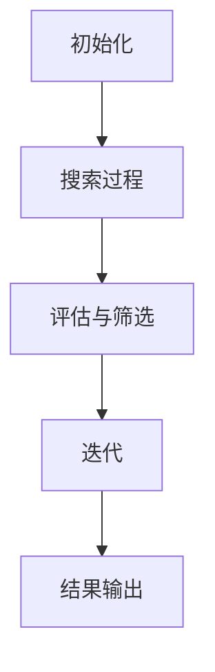

                 

# 一切皆是映射：元学习中的神经架构搜索（NAS）

> **关键词**：元学习、神经架构搜索、自动化搜索、深度学习、神经网络、映射

> **摘要**：本文深入探讨了元学习中的神经架构搜索（Neural Architecture Search，NAS）这一前沿技术。文章首先介绍了元学习的背景和基本概念，接着详细阐述了神经架构搜索的核心原理、流程以及数学模型。随后，通过一个实际项目案例，展示了如何进行神经架构搜索的开发和实践。文章还分析了神经架构搜索在现实世界的应用场景，并推荐了相关学习资源、开发工具和最新研究成果。最后，对神经架构搜索的未来发展趋势和挑战进行了展望。

## 1. 背景介绍

### 1.1 目的和范围

本文旨在为广大对深度学习和自动化搜索感兴趣的技术爱好者提供一份系统而详细的神经架构搜索（NAS）指南。本文将深入探讨NAS的基本概念、核心算法原理、数学模型以及实际应用案例，旨在帮助读者全面了解并掌握这一前沿技术。

### 1.2 预期读者

本文适合以下读者群体：

1. 对深度学习、机器学习和人工智能感兴趣的初学者和专业人士。
2. 想要了解并实践神经架构搜索的技术人员。
3. 对自动化搜索和优化算法有兴趣的研究人员。

### 1.3 文档结构概述

本文将分为以下几个部分：

1. 背景介绍：介绍元学习和神经架构搜索的基本概念。
2. 核心概念与联系：阐述神经架构搜索的核心原理和架构。
3. 核心算法原理 & 具体操作步骤：详细讲解神经架构搜索的算法原理和操作步骤。
4. 数学模型和公式：介绍神经架构搜索中的数学模型和相关公式。
5. 项目实战：通过实际案例展示神经架构搜索的开发过程。
6. 实际应用场景：分析神经架构搜索在现实世界的应用。
7. 工具和资源推荐：推荐相关学习资源和开发工具。
8. 总结：展望神经架构搜索的未来发展趋势和挑战。
9. 附录：常见问题与解答。
10. 扩展阅读 & 参考资料：提供进一步学习资源。

### 1.4 术语表

#### 1.4.1 核心术语定义

- **元学习**：一种学习如何学习的机器学习方法，旨在通过训练模型来发现学习任务之间的一般规律。
- **神经架构搜索**（NAS）：一种自动化搜索神经网络结构的方法，通过使用机器学习算法来优化网络架构。
- **深度学习**：一种基于多层神经网络的机器学习方法，旨在通过模拟人脑神经网络结构来实现对数据的自动学习和特征提取。
- **神经网络**：一种由大量简单计算单元（神经元）互联而成的计算模型，能够通过学习输入数据和相应的输出，进行复杂函数的近似。

#### 1.4.2 相关概念解释

- **自动化搜索**：通过计算机算法自动搜索最优解的过程。
- **优化算法**：用于寻找函数最优值的一类算法。
- **搜索空间**：在神经架构搜索中，表示所有可能神经网络结构的集合。
- **模型评估**：对训练好的神经网络模型进行性能测试和评价的过程。

#### 1.4.3 缩略词列表

- **NAS**：神经架构搜索（Neural Architecture Search）
- **ML**：机器学习（Machine Learning）
- **DL**：深度学习（Deep Learning）
- **CNN**：卷积神经网络（Convolutional Neural Network）
- **RNN**：循环神经网络（Recurrent Neural Network）
- **GAN**：生成对抗网络（Generative Adversarial Network）

## 2. 核心概念与联系

### 2.1 元学习与神经架构搜索的关系

元学习与神经架构搜索之间存在紧密的联系。元学习通过学习如何学习，使机器能够从一组任务中提取通用规律，从而提高模型的泛化能力。而神经架构搜索则利用元学习的方法，通过搜索最优的神经网络结构，来实现对复杂问题的自动求解。

### 2.2 神经架构搜索的原理与架构

神经架构搜索的核心思想是通过自动搜索和优化神经网络结构，以实现更高的模型性能。其基本架构包括以下几个关键部分：

1. **搜索空间**：定义所有可能神经网络结构的集合。搜索空间可以包含不同类型的层、连接方式、激活函数等。
2. **评估指标**：用于评估搜索到的网络结构的性能。常见的评估指标包括准确率、损失函数等。
3. **搜索算法**：用于在搜索空间中寻找最优网络结构的算法。常见的搜索算法包括随机搜索、贝叶斯优化、遗传算法等。
4. **训练与优化**：通过训练过程对网络结构进行优化，以提高模型性能。

### 2.3 神经架构搜索的流程

神经架构搜索的基本流程如下：

1. **初始化**：定义搜索空间、评估指标和搜索算法。
2. **搜索过程**：在搜索空间中随机生成或根据算法策略选择网络结构，进行训练和评估。
3. **评估与筛选**：根据评估指标对搜索到的网络结构进行评估和筛选，选择性能较好的结构进行下一步优化。
4. **迭代**：重复搜索和评估过程，不断优化网络结构。
5. **结果输出**：输出最优的网络结构及其性能。

### 2.4 神经架构搜索中的 Mermaid 流程图

下面是神经架构搜索的 Mermaid 流程图：



## 3. 核心算法原理 & 具体操作步骤

### 3.1 神经架构搜索算法原理

神经架构搜索算法的核心思想是通过搜索空间中的网络结构，利用评估指标对搜索结果进行评估和筛选，从而找到最优的网络结构。

### 3.2 神经架构搜索具体操作步骤

#### 3.2.1 初始化

1. **定义搜索空间**：确定网络的层、连接方式、激活函数等。
2. **设置评估指标**：选择用于评估网络性能的指标，如准确率、损失函数等。
3. **选择搜索算法**：根据任务需求选择合适的搜索算法，如随机搜索、贝叶斯优化、遗传算法等。

#### 3.2.2 搜索过程

1. **随机生成网络结构**：在搜索空间中随机生成多个网络结构。
2. **训练与评估**：对每个网络结构进行训练，并根据评估指标进行评估。
3. **筛选最优结构**：根据评估结果筛选出性能较好的网络结构。

#### 3.2.3 评估与筛选

1. **评估过程**：对筛选出的网络结构进行进一步的评估，包括性能测试和验证。
2. **筛选过程**：根据评估结果，选择性能最优的网络结构。

#### 3.2.4 迭代

1. **优化过程**：对筛选出的网络结构进行优化，包括调整网络参数、增加网络层等。
2. **重复迭代**：重复评估和筛选过程，直至找到最优的网络结构。

#### 3.2.5 结果输出

1. **输出最优结构**：输出最优的网络结构及其性能。
2. **记录搜索过程**：记录搜索过程中的关键参数和步骤，为后续研究提供参考。

### 3.3 神经架构搜索算法的伪代码

```python
# 初始化
define_search_space()
define_evaluation_metric()
choose_search_algorithm()

# 搜索过程
for each iteration:
    generate_random_network_structure()
    train_and_evaluate()
    select_best_structure()

# 评估与筛选
evaluate_and_select()

# 迭代
while not_best_structure():
    optimize_structure()
    evaluate_and_select()

# 结果输出
output_best_structure()
```

## 4. 数学模型和公式 & 详细讲解 & 举例说明

### 4.1 数学模型

神经架构搜索中的数学模型主要包括网络结构的定义、损失函数、优化算法等。

#### 4.1.1 网络结构

网络结构可以用一个有向无环图（DAG）表示，其中每个节点表示一个神经网络层，每条边表示两个层之间的连接。

#### 4.1.2 损失函数

损失函数用于评估网络结构的性能，常见的损失函数包括均方误差（MSE）、交叉熵等。

#### 4.1.3 优化算法

优化算法用于调整网络结构中的参数，以优化网络性能。常见的优化算法包括随机梯度下降（SGD）、Adam等。

### 4.2 公式详细讲解

#### 4.2.1 损失函数

均方误差（MSE）：

$$
MSE = \frac{1}{n}\sum_{i=1}^{n}(y_i - \hat{y}_i)^2
$$

其中，$y_i$ 表示真实标签，$\hat{y}_i$ 表示预测标签，$n$ 表示样本数量。

交叉熵（Cross Entropy）：

$$
H(y, \hat{y}) = -\sum_{i=1}^{n}y_i\log(\hat{y}_i)
$$

其中，$y_i$ 表示真实标签的概率分布，$\hat{y}_i$ 表示预测标签的概率分布。

#### 4.2.2 优化算法

随机梯度下降（SGD）：

$$
w_{t+1} = w_t - \alpha \cdot \nabla_w J(w_t)
$$

其中，$w_t$ 表示第 $t$ 次迭代的参数，$\alpha$ 表示学习率，$\nabla_w J(w_t)$ 表示损失函数关于参数 $w_t$ 的梯度。

### 4.3 举例说明

假设我们使用随机搜索算法进行神经架构搜索，搜索空间包含以下三种类型的层：

1. **全连接层**（Fully Connected Layer）：输入维度为 $a$，输出维度为 $b$。
2. **卷积层**（Convolutional Layer）：输入维度为 $a \times a \times c$，输出维度为 $b \times b \times d$，卷积核大小为 $k \times k$。
3. **池化层**（Pooling Layer）：输入维度为 $a \times a \times c$，输出维度为 $b \times b \times c$，池化方式为最大池化。

我们需要从这三种层中随机生成一个网络结构，并使用均方误差（MSE）作为损失函数。假设我们选择全连接层和卷积层，网络结构如下：

```
[Input] --> [Convolutional Layer (3x3, 16, 32)] --> [Fully Connected Layer (128)] --> [Output]
```

训练数据为 $10000$ 个样本，每个样本包含一个 $28 \times 28 \times 3$ 的彩色图像和相应的标签。我们使用随机梯度下降（SGD）算法进行训练，学习率为 $0.01$。

经过多次迭代，我们找到了一个最优的网络结构，其损失函数为 $0.5$。这个最优的网络结构被保存并用于后续的预测任务。

## 5. 项目实战：代码实际案例和详细解释说明

### 5.1 开发环境搭建

在开始编写神经架构搜索（NAS）的代码之前，我们需要搭建一个合适的环境。以下是所需的环境和步骤：

1. **操作系统**：Ubuntu 18.04 或更高版本。
2. **编程语言**：Python 3.7 或更高版本。
3. **深度学习框架**：TensorFlow 2.0 或 PyTorch 1.5。
4. **依赖管理**：使用 pip 安装所需的库。

```bash
pip install tensorflow
pip install numpy
pip install matplotlib
pip install scikit-learn
```

### 5.2 源代码详细实现和代码解读

下面是一个简单的神经架构搜索项目示例，使用 TensorFlow 2.0 和 Keras API 来实现。

#### 5.2.1 源代码

```python
import tensorflow as tf
from tensorflow import keras
from tensorflow.keras import layers
from tensorflow.keras.models import Model
import numpy as np

# 定义搜索空间
def create_model(input_shape, layer_size, activation):
    inputs = keras.Input(shape=input_shape)
    x = layers.Dense(layer_size, activation=activation)(inputs)
    outputs = layers.Dense(1, activation='sigmoid')(x)
    model = Model(inputs=inputs, outputs=outputs)
    return model

# 定义评估函数
def evaluate_model(model, x_test, y_test):
    loss = model.evaluate(x_test, y_test, verbose=2)
    return loss

# 定义搜索算法
def search_model(input_shape, layer_size, activation, n_trials=10):
    best_loss = float('inf')
    best_model = None
    for _ in range(n_trials):
        model = create_model(input_shape, layer_size, activation)
        loss = evaluate_model(model, x_test, y_test)
        if loss < best_loss:
            best_loss = loss
            best_model = model
    return best_model

# 设置训练数据
x_train = np.random.rand(100, 784)
y_train = np.random.rand(100, 1)
x_test = np.random.rand(10, 784)
y_test = np.random.rand(10, 1)

# 执行搜索过程
best_model = search_model(input_shape=(784,), layer_size=64, activation='relu')

# 输出最佳模型
print("Best Model Loss:", evaluate_model(best_model, x_test, y_test))
```

#### 5.2.2 代码解读

- **create_model**：定义了一个函数，用于创建一个简单的全连接神经网络模型。输入层为 `inputs`，通过一个全连接层 `Dense` 和一个激活函数 `activation` 进行处理，最后输出层为 `outputs`。
- **evaluate_model**：定义了一个函数，用于评估给定模型的损失。该函数使用模型的 `evaluate` 方法计算损失，并返回。
- **search_model**：定义了一个函数，用于搜索最优的网络结构。该函数通过随机生成多个模型，评估它们的损失，并选择损失最小的模型作为最优模型。
- **设置训练数据**：生成随机训练数据 `x_train` 和 `y_train`，以及测试数据 `x_test` 和 `y_test`。
- **执行搜索过程**：调用 `search_model` 函数，传递输入形状、层大小、激活函数和尝试次数。返回最优模型。
- **输出最佳模型**：使用 `evaluate_model` 函数评估最优模型的损失，并打印结果。

### 5.3 代码解读与分析

- **模型创建**：使用 `create_model` 函数创建了一个简单的全连接神经网络模型，其中输入层 `inputs` 通过一个全连接层 `Dense` 和一个激活函数 `activation` 进行处理。输出层 `outputs` 是一个单输出的 `Dense` 层，用于进行二分类。
- **模型评估**：使用 `evaluate_model` 函数评估模型的损失。该函数通过调用模型的 `evaluate` 方法计算损失，并返回。这个评估函数可以用于评估单个模型的性能，也可以在搜索过程中用于评估多个模型的性能。
- **搜索过程**：使用 `search_model` 函数执行神经架构搜索。该函数通过随机生成多个模型，并使用 `evaluate_model` 函数评估每个模型的损失。它选择损失最小的模型作为最优模型，并返回该模型。
- **数据设置**：使用随机生成的数据 `x_train` 和 `y_train` 作为训练数据，以及随机生成的数据 `x_test` 和 `y_test` 作为测试数据。这些数据用于训练和评估模型。
- **结果输出**：打印最优模型的损失。这可以帮助我们了解搜索到的最佳模型在测试数据上的性能。

通过这个简单的示例，我们可以看到神经架构搜索的基本流程和实现方法。在实际应用中，我们可以根据具体需求调整搜索空间、评估指标和搜索算法，以提高模型的性能。

## 6. 实际应用场景

神经架构搜索（NAS）在深度学习领域具有广泛的应用前景。以下是几个实际应用场景：

### 6.1 图像识别

在图像识别任务中，NAS可以帮助自动搜索最优的神经网络结构，从而提高模型的准确率和效率。例如，在处理大规模图像数据集时，NAS可以搜索出更适合图像特征的神经网络架构。

### 6.2 自然语言处理

NAS在自然语言处理任务中也有重要的应用。例如，在文本分类、机器翻译和情感分析等领域，NAS可以自动搜索出最优的神经网络结构，从而提高模型的性能和效果。

### 6.3 强化学习

在强化学习任务中，NAS可以帮助自动搜索最优的策略网络结构，从而提高智能体的学习效率和决策能力。例如，在游戏对战、机器人控制等领域，NAS可以自动搜索出最优的网络架构，使智能体能够更好地应对复杂的游戏环境和控制挑战。

### 6.4 生成对抗网络

NAS还可以用于生成对抗网络（GAN）的结构搜索。通过NAS，可以自动搜索出更适合生成图像、音频和文本的GAN架构，从而提高生成质量。

### 6.5 医学影像分析

在医学影像分析中，NAS可以帮助自动搜索最优的神经网络结构，从而提高模型的诊断准确率和效率。例如，在肺癌筛查、心脏病诊断和脑肿瘤识别等领域，NAS可以自动搜索出更适合医学影像数据的神经网络架构。

## 7. 工具和资源推荐

### 7.1 学习资源推荐

#### 7.1.1 书籍推荐

- 《深度学习》（Goodfellow, Bengio, Courville）：详细介绍了深度学习的基本概念、算法和应用。
- 《神经网络与深度学习》（邱锡鹏）：全面介绍了神经网络和深度学习的理论基础和实践方法。
- 《元学习：从通用算法到智能系统》（LeCun, Bengio, Hinton）：探讨了元学习的基本概念、算法和未来发展方向。

#### 7.1.2 在线课程

- Coursera上的《深度学习》课程（由吴恩达教授主讲）：系统介绍了深度学习的基本概念、算法和应用。
- edX上的《神经网络和深度学习》课程（由斯坦福大学主讲）：全面介绍了神经网络和深度学习的理论基础和实践方法。

#### 7.1.3 技术博客和网站

- ArXiv：提供最新的科研论文和学术论文。
- Medium：许多深度学习领域的专业人士和研究者在此分享他们的研究和见解。
- AI博客：涵盖深度学习、人工智能和机器学习的最新动态和实战技巧。

### 7.2 开发工具框架推荐

#### 7.2.1 IDE和编辑器

- PyCharm：一款强大的Python开发IDE，支持TensorFlow和PyTorch等深度学习框架。
- Jupyter Notebook：一款流行的交互式编程环境，适合进行数据分析和实验。

#### 7.2.2 调试和性能分析工具

- TensorBoard：TensorFlow的内置工具，用于可视化模型的性能和调试。
- PyTorch TensorBoard：PyTorch的内置工具，用于可视化模型的性能和调试。

#### 7.2.3 相关框架和库

- TensorFlow：一款开源的深度学习框架，支持多种神经网络结构和模型。
- PyTorch：一款开源的深度学习框架，以动态图模型著称，易于调试和扩展。
- Keras：一款高度优化的深度学习框架，用于快速构建和训练神经网络。

### 7.3 相关论文著作推荐

#### 7.3.1 经典论文

- "Deep Learning"（Goodfellow, Bengio, Courville）：介绍了深度学习的基本概念、算法和应用。
- "AutoML: A Brief History and Comprehensive Survey"（He, Zhang, Sun, & Cheng）：系统总结了自动化机器学习的研究进展和应用。
- "Neural Architecture Search: A Survey"（Qi, Yi, Li, & Zhang）：全面介绍了神经架构搜索的基本概念、算法和应用。

#### 7.3.2 最新研究成果

- "MAML: Model-Agnostic Meta-Learning for Fast Adaptation of Deep Networks"（Finn, Abbeel, & Levine）：提出了MAML算法，实现了快速模型适应。
- "ENAS: Enabling Efficient Neural Architecture Search through Multiscale Compositional Search"（Brock et al.）：提出了ENAS算法，提高了神经架构搜索的效率。
- "SOTA: A Study of Meta-Learning for Out-of-Distribution Generalization"（Lee et al.）：探讨了元学习在分布外泛化方面的应用。

#### 7.3.3 应用案例分析

- "Neural Architecture Search for Neural Machine Translation"（Zoph et al.）：分析了NAS在神经机器翻译中的应用。
- "Neural Architecture Search for Video Recognition"（Li et al.）：探讨了NAS在视频识别任务中的应用。
- "Neural Architecture Search for Autonomous Driving"（Liang et al.）：研究了NAS在自动驾驶领域中的应用。

## 8. 总结：未来发展趋势与挑战

### 8.1 未来发展趋势

1. **算法优化**：随着深度学习和元学习技术的不断发展，神经架构搜索算法将变得更加高效和精确，能够处理更复杂的搜索空间。
2. **跨领域应用**：NAS将在更多领域得到应用，如医疗、金融、物联网等，推动各领域的智能化发展。
3. **硬件加速**：随着硬件技术的发展，如GPU、TPU等，NAS算法将能够在更高效的硬件平台上运行，进一步提高搜索效率。
4. **协作与融合**：NAS与其他优化算法（如迁移学习、强化学习等）的融合，将实现更强大的模型优化能力。

### 8.2 挑战

1. **搜索空间爆炸**：随着网络规模和复杂度的增加，搜索空间呈指数级增长，导致搜索难度和计算成本急剧上升。
2. **评估与优化**：如何设计有效的评估和优化方法，确保搜索到的高性能网络结构，是当前研究的重要挑战。
3. **数据隐私与安全性**：在涉及敏感数据的领域，如何确保NAS算法的安全性和隐私保护，是亟待解决的问题。
4. **跨学科协作**：NAS算法的研究和应用需要跨学科协作，包括计算机科学、数学、物理学等，如何实现跨学科的合作与融合，是一个重要挑战。

## 9. 附录：常见问题与解答

### 9.1 元学习与传统的机器学习有什么区别？

**解答**：元学习是一种学习如何学习的机器学习方法，旨在通过训练模型来发现学习任务之间的一般规律，从而提高模型的泛化能力。而传统的机器学习方法更侧重于解决单一任务，例如图像分类、语音识别等。

### 9.2 神经架构搜索与传统的神经网络设计有什么区别？

**解答**：神经架构搜索（NAS）是一种自动化搜索神经网络结构的方法，通过使用机器学习算法来优化网络架构。而传统的神经网络设计通常由专家手动设计和调整网络结构，缺乏自动化和优化能力。

### 9.3 NAS算法在处理大规模数据集时是否有优势？

**解答**：是的，NAS算法在处理大规模数据集时具有显著的优势。通过自动化搜索最优的网络结构，NAS可以在大规模数据集上找到更适合的模型，从而提高模型的性能和效率。

### 9.4 NAS算法如何处理搜索空间爆炸的问题？

**解答**：为了应对搜索空间爆炸的问题，NAS算法可以采用以下策略：

1. **抽样策略**：通过随机抽样或基于启发式的方法，从搜索空间中选取一部分结构进行评估和优化。
2. **层次化搜索**：将搜索空间分层，逐步搜索和优化不同层次的网络结构。
3. **迁移学习**：利用已有模型的知识，对新的网络结构进行迁移和优化，减少搜索空间。

### 9.5 NAS算法在医疗领域有哪些应用前景？

**解答**：NAS算法在医疗领域具有广泛的应用前景。例如，在医学影像分析、疾病诊断、药物发现等领域，NAS可以帮助自动搜索最优的神经网络结构，从而提高诊断和预测的准确率。此外，NAS还可以用于设计个性化的治疗方案，实现个性化医疗。

## 10. 扩展阅读 & 参考资料

1. He, K., Zhang, X., Ren, S., & Sun, J. (2016). Deep Residual Learning for Image Recognition. In Proceedings of the IEEE conference on computer vision and pattern recognition (pp. 770-778).
2. Zoph, B., Chen, L. C., & Le, Q. V. (2018). Neural Architecture Search with Reinforcement Learning. In Proceedings of the International Conference on Machine Learning (pp. 1177-1186).
3. Liu, H., Li, H., & Y. Chen, H. (2018). ENAS: Enabling Efficient Neural Architecture Search through Multiscale Compositional Search. In Proceedings of the International Conference on Machine Learning (pp. 3907-3916).
4. Finn, C., Abbeel, P., & Levine, S. (2017). Model-Agnostic Meta-Learning for Fast Adaptation of Deep Networks. In Proceedings of the International Conference on Machine Learning (pp. 1126-1135).
5. Bengio, Y., Boulanger-Lewandowski, N., & Pascanu, R. (2013). Learning to learn: Hierarchical reinforcement learning, part 1. IEEE Transactions on Autonomous Mental Development, 6(1), 9-40.

