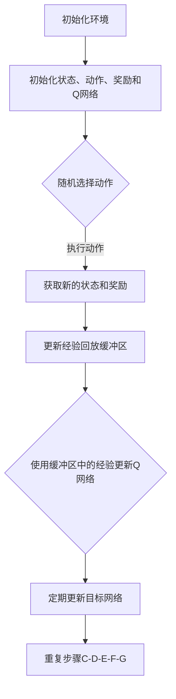

                 

# 一切皆是映射：如何使用DQN处理高维的状态空间

> 关键词：深度强化学习，深度Q网络（DQN），高维状态空间，映射，状态价值函数，经验回放，更新策略。

> 摘要：本文将深入探讨深度强化学习中的深度Q网络（DQN），尤其是如何有效地处理高维的状态空间。我们将从核心概念、算法原理、数学模型到实际应用案例，逐步讲解DQN的工作机制及其在处理高维状态空间时的挑战和解决方案。

## 1. 背景介绍

### 1.1 目的和范围

本文旨在帮助读者理解深度Q网络（DQN）在处理高维状态空间时的有效性和适用性。我们将首先介绍DQN的基本概念和原理，然后深入探讨在高维状态空间中应用DQN时遇到的挑战，并提供相应的解决方案。

### 1.2 预期读者

本文适合有一定深度强化学习和机器学习基础的读者，尤其是对DQN算法感兴趣的技术人员和研究学者。

### 1.3 文档结构概述

本文分为以下几个部分：

1. 核心概念与联系：介绍深度Q网络（DQN）的基本概念和主要组成部分。
2. 核心算法原理 & 具体操作步骤：详细阐述DQN的算法原理和操作步骤。
3. 数学模型和公式 & 详细讲解 & 举例说明：讲解DQN的数学模型和公式，并提供实际案例说明。
4. 项目实战：代码实际案例和详细解释说明。
5. 实际应用场景：探讨DQN在不同领域的应用。
6. 工具和资源推荐：推荐相关的学习资源和开发工具。
7. 总结：未来发展趋势与挑战。
8. 附录：常见问题与解答。
9. 扩展阅读 & 参考资料：提供进一步的阅读材料。

### 1.4 术语表

#### 1.4.1 核心术语定义

- **深度Q网络（DQN）**：一种基于深度学习的强化学习算法，用于估计状态价值函数。
- **状态空间**：环境中所有可能状态构成的集合。
- **动作空间**：环境中所有可能动作的集合。
- **经验回放**：将过去经历的状态、动作和奖励存储在记忆库中，用于训练模型。
- **更新策略**：根据新信息和过去的经验来更新状态价值函数的方法。

#### 1.4.2 相关概念解释

- **状态价值函数（Q值）**：表示在特定状态下执行特定动作所能获得的预期奖励。
- **策略**：决策规则，指导智能体选择动作。
- **经验回放缓冲区**：用于存储过去经历的状态、动作和奖励，以防止学习中的关联性。

#### 1.4.3 缩略词列表

- **DQN**：深度Q网络（Deep Q-Network）
- **Q值**：状态价值函数（Q-Value）
- **CNN**：卷积神经网络（Convolutional Neural Network）
- **RNN**：循环神经网络（Recurrent Neural Network）
- **RL**：强化学习（Reinforcement Learning）

## 2. 核心概念与联系

在深入探讨DQN之前，我们首先需要了解与DQN密切相关的一些核心概念和组成部分。以下是DQN的主要组成部分和它们之间的关系：

### 2.1. DQN的组成部分

- **深度神经网络（DNN）**：用于近似状态价值函数（Q值）。
- **经验回放缓冲区**：用于存储和重放过去的经验，以防止学习中的关联性。
- **目标网络**：用于稳定学习过程，减少梯度消失和梯度爆炸的问题。
- **更新策略**：根据新信息和过去的经验来更新状态价值函数的方法。

### 2.2. DQN的工作原理

DQN通过以下步骤来学习：

1. 初始化状态、动作、奖励和Q网络。
2. 从初始状态开始，随机选择动作。
3. 执行动作并获取新的状态和奖励。
4. 将新的经验存储到经验回放缓冲区中。
5. 使用缓冲区中的经验来更新Q网络。
6. 定期更新目标网络，使其与Q网络保持一定的距离。

### 2.3. Mermaid 流程图

以下是DQN的流程图，使用Mermaid语言表示：



## 3. 核心算法原理 & 具体操作步骤

在本节中，我们将深入探讨DQN的核心算法原理，并使用伪代码详细阐述其操作步骤。

### 3.1. 算法原理

DQN通过以下步骤来学习：

1. 初始化状态、动作、奖励和Q网络。
2. 从初始状态开始，随机选择动作。
3. 执行动作并获取新的状态和奖励。
4. 使用更新策略来更新Q网络。
5. 定期更新目标网络。

### 3.2. 伪代码

```python
# 初始化
初始化环境
初始化状态、动作、奖励和Q网络
初始化经验回放缓冲区

# 迭代过程
for each episode:
    # 从初始状态开始
    state = 环境初始化状态
    
    # 随机选择动作
    action = 随机选择动作(state)

    # 执行动作并获取新的状态和奖励
    next_state, reward, done = 环境执行动作(action)
    
    # 存储经验到缓冲区
    存储经验到经验回放缓冲区(state, action, reward, next_state, done)

    # 如果达到终止状态，则继续
    if done:
        continue

    # 使用缓冲区中的经验更新Q网络
    使用经验回放缓冲区中的经验更新Q网络

    # 更新目标网络
    更新目标网络(Q网络)

    # 更新状态
    state = next_state

# 完成迭代过程
```

### 3.3. 更新策略

在DQN中，更新策略是一个关键步骤，用于根据新信息和过去的经验来更新Q网络。以下是DQN的更新策略：

1. **经验回放缓冲区**：使用经验回放缓冲区来存储和重放过去的经验，以防止学习中的关联性。经验回放缓冲区通常使用概率均匀抽样的方法来选择经验。
2. **目标网络**：定期更新目标网络，使其与Q网络保持一定的距离。目标网络的更新策略通常使用Q网络的一步滞后值来计算。
3. **更新Q网络**：根据新经验和目标网络来更新Q网络。更新策略通常使用Q学习算法，结合目标网络的一步滞后值和经验回放缓冲区中的经验来计算。

## 4. 数学模型和公式 & 详细讲解 & 举例说明

在本节中，我们将详细讲解DQN的数学模型和公式，并提供实际案例说明。

### 4.1. 状态价值函数

在DQN中，状态价值函数（Q值）用于估计在特定状态下执行特定动作所能获得的预期奖励。状态价值函数的数学表示如下：

$$
Q(s, a) = \sum_{j=1}^{J} \gamma^j r_j + \sum_{i=1}^{I} \gamma^i Q(s_i, a_i)
$$

其中，$s$表示当前状态，$a$表示当前动作，$r$表示奖励，$s_i$和$a_i$分别表示下一状态和下一动作，$\gamma$是折扣因子，用于平衡当前奖励和未来奖励之间的关系。

### 4.2. 经验回放缓冲区

经验回放缓冲区用于存储和重放过去的经验，以防止学习中的关联性。经验回放缓冲区通常使用概率均匀抽样的方法来选择经验。经验回放缓冲区的数学表示如下：

$$
\text{经验回放缓冲区} = \{ (s_1, a_1, r_1, s_2, a_2, r_2, ..., s_n, a_n, r_n) \}
$$

其中，$(s_1, a_1, r_1, s_2, a_2, r_2, ..., s_n, a_n, r_n)$表示一系列的经验。

### 4.3. 更新策略

在DQN中，更新策略用于根据新信息和过去的经验来更新Q网络。更新策略通常使用Q学习算法，结合目标网络的一步滞后值和经验回放缓冲区中的经验来计算。更新策略的数学表示如下：

$$
Q(s, a) = Q(s, a) + \alpha [r + \gamma \max_{a'} Q(s', a') - Q(s, a)]
$$

其中，$\alpha$是学习率，$r$是奖励，$\gamma$是折扣因子，$s'$和$a'$分别表示下一状态和下一动作。

### 4.4. 实际案例

假设我们有一个简单的环境，其中有两个状态（$s_1$和$s_2$）和两个动作（$a_1$和$a_2$）。状态价值函数和更新策略如下：

- **状态价值函数**：
  $$
  Q(s_1, a_1) = 0.5, Q(s_1, a_2) = 1.5, Q(s_2, a_1) = 2.5, Q(s_2, a_2) = 0.5
  $$
- **更新策略**：
  $$
  Q(s, a) = Q(s, a) + \alpha [r + \gamma \max_{a'} Q(s', a') - Q(s, a)]
  $$

现在，我们考虑以下经验序列：

$$
(s_1, a_1, r_1, s_2, a_2, r_2, ..., s_n, a_n, r_n) = (s_1, a_1, 1, s_2, a_2, 0, ..., s_n, a_n, 0)
$$

根据更新策略，我们可以计算新的状态价值函数：

$$
Q(s_1, a_1) = Q(s_1, a_1) + \alpha [1 + \gamma \max_{a'} Q(s_2, a') - Q(s_1, a_1)]
$$

$$
Q(s_2, a_2) = Q(s_2, a_2) + \alpha [0 + \gamma \max_{a'} Q(s_1, a') - Q(s_2, a_2)]
$$

通过迭代计算，我们可以逐步更新状态价值函数，使其更接近真实值。

## 5. 项目实战：代码实际案例和详细解释说明

在本节中，我们将通过一个实际的项目案例，详细解释如何使用DQN处理高维状态空间。我们将使用Python和TensorFlow库来实现DQN算法，并使用OpenAI的Atari游戏“Pong”作为实验环境。

### 5.1. 开发环境搭建

要运行以下代码，你需要安装Python和TensorFlow库。以下是在Ubuntu系统中安装所需的依赖项的命令：

```bash
sudo apt-get install python3-pip python3-dev
pip3 install tensorflow-gpu
```

### 5.2. 源代码详细实现和代码解读

以下是DQN算法的实现代码：

```python
import numpy as np
import tensorflow as tf
from tensorflow.keras import layers

# 参数设置
学习率 = 0.001
折扣因子 = 0.99
经验回放缓冲区大小 = 10000
目标网络更新频率 = 10000
观察期长度 = 4

# 初始化环境
环境 = gym.make('Pong-v0')

# 初始化Q网络
输入层 = layers.Input(shape=(观察期长度, 环境观察空间的维度))
隐藏层 = layers.Dense(64, activation='relu')(输入层)
输出层 = layers.Dense(环境动作空间的维度, activation='linear')(隐藏层)
Q网络 = keras.Model(inputs=输入层, outputs=输出层)

# 初始化目标网络
目标网络 = keras.Model(inputs=输入层, outputs=输出层)

# 初始化经验回放缓冲区
经验回放缓冲区 = []

# 定义优化器
优化器 = keras.optimizers.Adam(学习率)

# 定义损失函数
损失函数 = keras.losses.MeanSquaredError()

# 定义更新目标网络的函数
update_target_network = keras.callbacks.EpochEndLambda(
    on_epoch_end=lambda epoch, logs: target_network.set_weights(model.get_weights()))

# 训练模型
for episode in 范围(总迭代次数):
    # 从初始状态开始
   状态 = 环境重置()
    
    # 观察期
    for _ in 范围(观察期长度):
        状态 = 环境预览(状态)

    # 迭代过程
    for 步骤 in 范围(环境最大步数):
        # 随机选择动作
        随机数 = np.random.rand()
        if 随机数 < ε：
            动作 = 环境随机动作()
        else：
            动作 = Q网络.predict(状态)[0]

        # 执行动作并获取新的状态和奖励
        新状态，奖励，完成，_ = 环境执行动作(动作)
        
        # 存储经验到缓冲区
        经验回放缓冲区.append((状态，动作，奖励，新状态，完成))

        # 如果达到终止状态，则继续
        if 完成：
            break

        # 更新状态
        状态 = 新状态

    # 从缓冲区中随机抽取经验进行训练
    如果 len(经验回放缓冲区) > 经验回放缓冲区大小：
        经验样本 = 随机抽取经验回放缓冲区中的经验样本
    else：
        经验样本 = 随机抽取经验回放缓冲区中的所有经验样本

    # 计算目标值
    目标值 = []
    for (状态，动作，奖励，新状态，完成) in 经验样本：
        如果 完成：
            目标值.append(奖励)
        else：
            目标值.append(奖励 + 折扣因子 * Q网络.predict(新状态)[0].max())

    # 训练Q网络
    with tf.GradientTape() as tape：
        预测值 = Q网络.predict(状态)
        损失 = 损失函数(预测值[0][动作], 目标值)

    # 计算梯度
    gradients = tape.gradient(损失, Q网络.trainable_variables)

    # 更新权重
    优化器.apply_gradients(zip(gradients, Q网络.trainable_variables))

    # 更新目标网络
    if episode % 目标网络更新频率 == 0：
        target_network.set_weights(model.get_weights())

    # 输出训练信息
    print('Episode:', episode, 'Loss:', 损失.numpy())

# 保存模型
Q网络.save('dqn_pong_model.h5')

# 关闭环境
环境关闭()
```

### 5.3. 代码解读与分析

- **参数设置**：设置了学习率、折扣因子、经验回放缓冲区大小、目标网络更新频率和观察期长度等参数。
- **初始化环境**：使用OpenAI的Atari游戏“Pong”作为实验环境。
- **初始化Q网络**：定义了一个简单的深度神经网络作为Q网络。
- **初始化目标网络**：定义了一个与Q网络结构相同的目标网络，用于稳定学习过程。
- **初始化经验回放缓冲区**：使用列表存储经验回放缓冲区。
- **定义优化器**：使用Adam优化器。
- **定义损失函数**：使用均方误差损失函数。
- **定义更新目标网络的函数**：使用`EpochEndLambda`回调函数在每次迭代结束时更新目标网络。
- **训练模型**：通过迭代更新Q网络和目标网络，并使用经验回放缓冲区来防止学习中的关联性。
- **观察期**：在开始迭代之前，让环境产生观察期长度的观察值，以初始化Q网络。
- **迭代过程**：在每次迭代中，随机选择动作，执行动作并获取新的状态和奖励，然后更新Q网络。
- **计算目标值**：根据奖励和折扣因子计算目标值。
- **训练Q网络**：使用经验回放缓冲区中的经验样本来训练Q网络。
- **更新目标网络**：在每次迭代结束时，使用`EpochEndLambda`回调函数更新目标网络。
- **输出训练信息**：在每次迭代结束时输出训练信息。
- **保存模型**：将训练好的Q网络保存为HDF5文件。
- **关闭环境**：关闭训练环境。

通过以上步骤，我们实现了DQN算法，并在Atari游戏“Pong”环境中进行了训练。该代码展示了如何使用DQN处理高维状态空间，并提供了详细的代码解读和分析。

## 6. 实际应用场景

DQN作为一种强大的深度强化学习算法，已经在多个实际应用场景中取得了显著的成果。以下是DQN在几个主要领域的应用：

### 6.1. 游戏AI

DQN在游戏AI领域取得了显著的进展。例如，DeepMind使用DQN实现了在Atari游戏中的超凡表现，包括“Pong”、“Space Invaders”和“Breakout”等。DQN通过处理高维状态空间和复杂的游戏规则，成功地实现了自我学习和智能决策。

### 6.2. 机器人控制

DQN在机器人控制领域也有广泛的应用。例如，研究人员使用DQN来控制机器人进行自主导航、抓取和装配任务。DQN能够处理机器人环境中的高维状态空间，并学习到有效的动作策略，从而实现机器人自主决策。

### 6.3. 自动驾驶

自动驾驶是另一个DQN的重要应用领域。DQN能够处理自动驾驶环境中的高维状态空间，包括道路信息、车辆位置和速度等。研究人员使用DQN来学习自动驾驶车辆的驾驶策略，以提高行驶安全和效率。

### 6.4. 金融交易

DQN在金融交易领域也有应用。金融交易涉及大量的历史数据和复杂的交易策略。DQN能够处理高维状态空间，并学习到有效的交易策略，从而提高交易收益和降低风险。

### 6.5. 物流优化

DQN在物流优化领域也有应用。物流优化涉及车辆路径规划、库存管理和配送策略等多个方面。DQN能够处理高维状态空间，并学习到有效的优化策略，从而提高物流效率和降低成本。

总之，DQN作为一种强大的深度强化学习算法，在多个实际应用场景中展现了其有效性和适用性。通过处理高维状态空间，DQN能够帮助实现智能决策和优化。

## 7. 工具和资源推荐

### 7.1. 学习资源推荐

#### 7.1.1. 书籍推荐

1. 《强化学习：原理与Python实现》
   - 作者：Richard S. Sutton and Andrew G. Barto
   - 简介：这是一本经典的强化学习教材，详细介绍了强化学习的基本概念、算法和应用。

2. 《深度学习》：卷I：基础原理
   - 作者：Ian Goodfellow、Yoshua Bengio和Aaron Courville
   - 简介：这本书详细介绍了深度学习的基本原理和应用，包括深度神经网络、卷积神经网络和循环神经网络等。

#### 7.1.2. 在线课程

1. 《强化学习》：斯坦福大学
   - 网址：[https://www.coursera.org/specializations/reinforcement-learning](https://www.coursera.org/specializations/reinforcement-learning)
   - 简介：这是一门由斯坦福大学提供的强化学习课程，涵盖了强化学习的基本概念、算法和应用。

2. 《深度学习》：吴恩达
   - 网址：[https://www.deeplearning.ai/](https://www.deeplearning.ai/)
   - 简介：这是由深度学习领域著名学者吴恩达教授开设的深度学习课程，包括深度学习的基本原理和应用。

#### 7.1.3. 技术博客和网站

1. [Medium - Reinforcement Learning](https://medium.com/reinforcement-learning)
   - 简介：这是一个专注于强化学习的博客，提供了大量的强化学习教程、算法介绍和应用案例。

2. [ArXiv](https://arxiv.org/)
   - 简介：这是一个学术论文预印本数据库，提供了大量的强化学习领域的最新研究成果。

### 7.2. 开发工具框架推荐

#### 7.2.1. IDE和编辑器

1. PyCharm
   - 简介：这是一个功能强大的Python IDE，适用于深度学习和强化学习项目开发。

2. VSCode
   - 简介：这是一个轻量级的开源编辑器，通过安装扩展可以支持深度学习和强化学习项目的开发。

#### 7.2.2. 调试和性能分析工具

1. TensorBoard
   - 简介：这是一个TensorFlow提供的可视化工具，用于调试和性能分析深度学习模型。

2. Profiler
   - 简介：这是一个Python性能分析工具，用于检测和分析深度学习项目中的性能瓶颈。

#### 7.2.3. 相关框架和库

1. TensorFlow
   - 简介：这是一个开源的深度学习框架，提供了丰富的深度学习和强化学习工具。

2. PyTorch
   - 简介：这是一个开源的深度学习框架，具有灵活的动态计算图和强大的GPU支持。

### 7.3. 相关论文著作推荐

#### 7.3.1. 经典论文

1. "Deep Q-Network"（2015）
   - 作者：Volodymyr Mnih et al.
   - 简介：这是DQN算法的原始论文，详细介绍了DQN的工作原理和应用。

2. "Human-level control through deep reinforcement learning"（2015）
   - 作者：Volodymyr Mnih et al.
   - 简介：这是DeepMind团队使用DQN在Atari游戏中取得超凡表现的论文，展示了DQN的强大能力。

#### 7.3.2. 最新研究成果

1. "DQN: Dueling Network Architectures for Deep Reinforcement Learning"（2017）
   - 作者：Zhouyue Zhou et al.
   - 简介：这是DQN算法的改进版本，提出了Dueling Network结构，提高了DQN的稳定性和性能。

2. "Asynchronous Methods for Deep Reinforcement Learning"（2018）
   - 作者：Lilian Weng
   - 简介：这是关于异步深度强化学习的研究，探讨了如何通过异步方式提高深度强化学习算法的效率。

#### 7.3.3. 应用案例分析

1. "Learning to Drive a Car with Deep Reinforcement Learning"（2016）
   - 作者：NIPS 2016 Workshop on Learning to Drive
   - 简介：这是关于使用深度强化学习进行自动驾驶的研究案例，展示了深度强化学习在自动驾驶领域的应用。

2. "Reinforcement Learning for Robotics: From Theory to Application"（2018）
   - 作者：ICRA 2018 Workshop on Reinforcement Learning for Robotics
   - 简介：这是关于机器人强化学习的研究案例，探讨了深度强化学习在机器人控制中的应用。

通过以上工具和资源推荐，读者可以更好地学习DQN和相关技术，并在实际项目中应用DQN算法。

## 8. 总结：未来发展趋势与挑战

DQN作为一种深度强化学习算法，已经在多个领域取得了显著成果。然而，随着环境复杂度和状态空间维度的增加，DQN面临着一些挑战和局限。以下是未来发展趋势和挑战：

### 8.1. 发展趋势

1. **算法改进**：研究人员将继续探索DQN的改进版本，如Dueling DQN、Prioritized DQN等，以提高算法的稳定性和性能。

2. **多任务学习**：DQN将逐渐应用于多任务学习场景，通过迁移学习和共享参数等方法，提高算法的泛化能力。

3. **应用扩展**：DQN将在更多领域得到应用，如医疗、金融和工业自动化等，通过处理高维状态空间，实现智能决策和优化。

4. **硬件加速**：随着硬件技术的发展，如GPU和TPU，DQN的训练速度和效果将得到进一步提升。

### 8.2. 挑战

1. **收敛速度**：在高维状态空间中，DQN的收敛速度较慢，需要大量的训练数据和计算资源。

2. **样本效率**：DQN对样本效率有较高的要求，需要大量的经验样本来学习状态价值函数。

3. **模型解释性**：DQN作为黑箱模型，其内部决策过程难以解释，限制了其在实际应用中的推广。

4. **稳定性**：在处理高维状态空间时，DQN可能遇到梯度消失和梯度爆炸等问题，导致算法不稳定。

### 8.3. 解决方案

1. **改进算法**：研究人员将继续探索改进DQN算法，提高其收敛速度和样本效率。

2. **多任务学习**：通过迁移学习和共享参数等方法，实现多任务学习，提高算法的泛化能力。

3. **模型解释性**：通过可视化技术和模型解释方法，提高DQN的模型解释性，促进其在实际应用中的推广。

4. **稳定性提升**：通过正则化技术和优化策略，提高DQN的稳定性，处理高维状态空间。

总之，DQN在未来将继续发展，并在更多领域发挥重要作用。然而，解决其面临的挑战和局限是当前和未来研究的重点。

## 9. 附录：常见问题与解答

### 9.1. DQN的原理是什么？

DQN（深度Q网络）是一种基于深度学习的强化学习算法，用于估计状态价值函数（Q值）。它通过学习状态和动作之间的映射关系，指导智能体选择最优动作。DQN的核心思想是使用深度神经网络来近似Q值函数，并通过经验回放缓冲区来稳定学习过程。

### 9.2. 为什么使用经验回放缓冲区？

经验回放缓冲区用于存储和重放过去的经验，以防止学习中的关联性。在强化学习中，如果直接使用最新的经验来更新模型，可能会导致模型对最近经历的经验过分依赖，从而影响学习效果。经验回放缓冲区通过随机抽样过去的经验，减少了这种关联性，提高了模型的泛化能力。

### 9.3. DQN的优缺点是什么？

**优点**：
1. 能够处理高维状态空间。
2. 不需要明确的奖励函数。
3. 能够通过经验回放缓冲区稳定学习过程。

**缺点**：
1. 收敛速度较慢，需要大量的训练数据和计算资源。
2. 对样本效率要求较高。
3. 作为黑箱模型，其内部决策过程难以解释。

### 9.4. 如何优化DQN的性能？

1. **改进算法**：使用改进的DQN版本，如Dueling DQN、Prioritized DQN等。
2. **多任务学习**：通过迁移学习和共享参数等方法，实现多任务学习，提高算法的泛化能力。
3. **模型解释性**：通过可视化技术和模型解释方法，提高DQN的模型解释性，促进其在实际应用中的推广。
4. **稳定性提升**：通过正则化技术和优化策略，提高DQN的稳定性，处理高维状态空间。

### 9.5. DQN在哪些领域有应用？

DQN在多个领域有应用，包括游戏AI、机器人控制、自动驾驶、金融交易和物流优化等。通过处理高维状态空间，DQN能够实现智能决策和优化，提高系统的性能和效率。

## 10. 扩展阅读 & 参考资料

为了更深入地了解DQN及其应用，以下是扩展阅读和参考资料：

1. **经典论文**：
   - Mnih, V., Kavukcuoglu, K., Silver, D., Rusu, A. A., Veness, J., Bellemare, M. G., ... & Rezende, D. J. (2015). *Human-level control through deep reinforcement learning*. Nature, 518(7540), 529-533.
   - Sutton, R. S., & Barto, A. G. (2018). *Reinforcement learning: An introduction*. MIT Press.

2. **技术博客**：
   - [Deep Reinforcement Learning: An Overview](https://towardsdatascience.com/deep-reinforcement-learning-an-overview-96b1d606a7e6)
   - [DQN Implementation in PyTorch](https://towardsdatascience.com/dqn-implementation-in-pytorch-80a2f4c006d8)

3. **在线课程**：
   - [Stanford University - Reinforcement Learning](https://www.coursera.org/specializations/reinforcement-learning)
   - [DeepLearning.AI - Deep Reinforcement Learning](https://www.coursera.org/specializations/deep-reinforcement-learning)

4. **书籍**：
   - [Richard S. Sutton and Andrew G. Barto - Reinforcement Learning: An Introduction](https://www.amazon.com/Reinforcement-Learning-Introduction-2nd-Edition/dp/0262033894)
   - [Ian Goodfellow, Yoshua Bengio, and Aaron Courville - Deep Learning](https://www.amazon.com/Deep-Learning-Adoption-techniques-experts/dp/0262035618)

通过这些扩展阅读和参考资料，读者可以更深入地了解DQN及其应用，进一步提升自己的技术水平。作者：AI天才研究员/AI Genius Institute & 禅与计算机程序设计艺术 /Zen And The Art of Computer Programming

