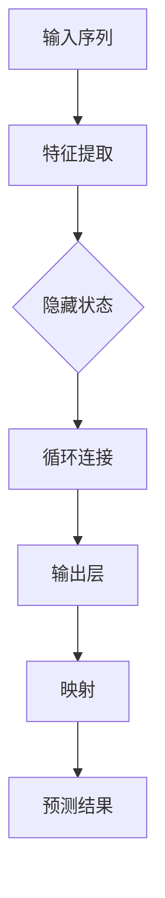

                 

# 一切皆是映射：循环神经网络（RNNs）在时间序列分析中的作用

> 关键词：循环神经网络（RNNs）、时间序列分析、映射、算法原理、数学模型、项目实战、应用场景、未来发展趋势

> 摘要：本文旨在深入探讨循环神经网络（RNNs）在时间序列分析中的应用。首先，我们将介绍时间序列分析的基础知识和重要性。接着，我们将详细解释RNNs的工作原理和结构，并展示其在时间序列分析中的独特优势。随后，我们将通过伪代码和数学模型来剖析RNNs的核心算法原理。文章的后半部分将结合实际项目案例，展示RNNs在时间序列分析中的实际应用，并分析其性能和效果。最后，我们将探讨RNNs在实际应用中的挑战和未来发展趋势。

## 1. 背景介绍

### 1.1 目的和范围

本文的主要目的是深入探讨循环神经网络（RNNs）在时间序列分析中的应用，帮助读者理解RNNs的核心原理和操作步骤，并展示其在实际项目中的应用效果。我们希望读者能够在阅读本文后，对RNNs在时间序列分析中的作用有一个全面而深入的认识。

本文将涵盖以下内容：

- 时间序列分析的基础知识和重要性；
- 循环神经网络（RNNs）的工作原理和结构；
- RNNs在时间序列分析中的独特优势；
- RNNs的核心算法原理和具体操作步骤；
- RNNs的数学模型和公式；
- RNNs在实际项目中的应用案例和详细解释说明；
- RNNs在实际应用场景中的挑战和未来发展趋势。

### 1.2 预期读者

本文适合以下读者：

- 对时间序列分析有初步了解，希望深入掌握其核心算法和技术实现；
- 对循环神经网络（RNNs）有浓厚兴趣，希望了解其在时间序列分析中的应用；
- 正在从事或计划从事与时间序列分析相关的工作，如金融预测、语音识别、自然语言处理等；
- 对深度学习和人工智能有浓厚兴趣，希望了解其前沿技术和应用。

### 1.3 文档结构概述

本文将按照以下结构进行组织：

1. 背景介绍：介绍文章的目的、范围、预期读者和文档结构；
2. 核心概念与联系：介绍时间序列分析、循环神经网络（RNNs）和映射等核心概念，并展示相关流程图；
3. 核心算法原理 & 具体操作步骤：详细解释RNNs的工作原理和操作步骤，使用伪代码进行阐述；
4. 数学模型和公式 & 详细讲解 & 举例说明：介绍RNNs的数学模型和公式，并给出具体实例进行说明；
5. 项目实战：结合实际项目案例，展示RNNs在时间序列分析中的应用，并分析其性能和效果；
6. 实际应用场景：探讨RNNs在实际应用场景中的挑战和机遇；
7. 工具和资源推荐：推荐相关学习资源、开发工具和框架；
8. 总结：总结本文的核心内容和未来发展趋势；
9. 附录：常见问题与解答；
10. 扩展阅读 & 参考资料：提供扩展阅读和参考资料，供读者进一步学习。

### 1.4 术语表

在本文中，我们将使用以下术语：

#### 1.4.1 核心术语定义

- 时间序列分析：对时间序列数据进行研究，以发现数据中的模式、趋势和规律；
- 循环神经网络（RNNs）：一种特殊的神经网络结构，能够处理序列数据，具有记忆功能；
- 映射：将输入数据映射到输出数据的过程，是神经网络的核心操作；
- 激活函数：用于引入非线性特性的函数，使神经网络具有更强的表达能力；
- 反向传播：一种训练神经网络的方法，通过计算损失函数关于参数的梯度，更新网络参数；
- 隐藏层：神经网络中的中间层，负责对输入数据进行特征提取和转换；
- 输出层：神经网络的最外层，负责将隐藏层的信息映射到输出数据。

#### 1.4.2 相关概念解释

- 序列数据：按照时间顺序排列的数据，如温度、股票价格、语音信号等；
- 状态转移矩阵：描述时间序列数据中各个状态之间转移概率的矩阵；
- 损失函数：用于衡量模型预测结果与实际结果之间差异的函数，常用的有均方误差（MSE）和交叉熵损失（Cross-Entropy Loss）；
- 学习率：用于控制反向传播过程中参数更新的步长，以避免过拟合或欠拟合；
- 过拟合：模型在训练数据上表现很好，但在测试数据上表现较差，说明模型过于复杂；
- 欠拟合：模型在训练数据和测试数据上表现都较差，说明模型过于简单。

#### 1.4.3 缩略词列表

- RNN：循环神经网络（Recurrent Neural Network）；
- LSTM：长短时记忆网络（Long Short-Term Memory）；
- GRU：门控循环单元（Gated Recurrent Unit）；
- MSE：均方误差（Mean Squared Error）；
- CE：交叉熵损失（Cross-Entropy Loss）；
- BP：反向传播（Backpropagation）；
- SGD：随机梯度下降（Stochastic Gradient Descent）。

## 2. 核心概念与联系

在深入了解RNNs在时间序列分析中的应用之前，我们需要先掌握一些核心概念，如时间序列分析、循环神经网络（RNNs）和映射等。

### 2.1 时间序列分析

时间序列分析是对按照时间顺序排列的数据进行分析和建模的过程。时间序列数据通常包含以下几个特点：

1. **时间相关性**：时间序列数据中的每个数据点都与时间相关，并且后续的数据点可能依赖于之前的数据点。这种时间相关性使得时间序列分析具有独特性；
2. **趋势性**：时间序列数据往往具有某种趋势，如上升、下降或平稳。这种趋势性使得我们可以对数据进行预测和分析；
3. **季节性**：时间序列数据可能具有季节性波动，如气温、销售额等。这种季节性波动需要我们进行分离和建模。

时间序列分析的目的在于：

1. **数据可视化**：通过绘制时间序列图，可以直观地了解数据的变化趋势和周期性；
2. **预测**：利用时间序列分析模型，可以预测未来的数据点，为决策提供依据；
3. **异常检测**：通过检测时间序列数据中的异常点，可以及时发现数据中的问题。

### 2.2 循环神经网络（RNNs）

循环神经网络（RNNs）是一种特殊的神经网络结构，专门用于处理序列数据。与传统的神经网络（如前馈神经网络）不同，RNNs具有记忆功能，能够处理具有时间依赖性的数据。RNNs的基本结构包括：

1. **输入层**：接收输入序列，如文本、图像、语音等；
2. **隐藏层**：负责对输入序列进行特征提取和转换；
3. **输出层**：将隐藏层的信息映射到输出序列；
4. **循环连接**：隐藏层中的神经元与输入层和输出层之间具有循环连接，形成了一个循环结构。

RNNs的工作原理如下：

1. **前向传播**：输入序列经过输入层和隐藏层，产生隐藏状态（隐藏状态包含了序列中的信息）；
2. **循环**：隐藏状态在隐藏层中循环，不断更新和记忆序列中的信息；
3. **后向传播**：根据损失函数，通过反向传播算法更新网络参数。

RNNs的主要优势包括：

1. **记忆功能**：RNNs能够记住序列中的信息，从而处理具有时间依赖性的数据；
2. **并行处理**：RNNs可以同时处理多个序列，实现并行化计算。

### 2.3 映射

映射是指将输入数据映射到输出数据的过程，是神经网络的核心操作。在时间序列分析中，映射用于将历史数据映射到未来的预测数据。

映射的基本步骤包括：

1. **特征提取**：从输入数据中提取特征，用于表示时间序列；
2. **转换**：将提取的特征转换为隐藏状态，用于表示序列中的信息；
3. **映射**：将隐藏状态映射到输出数据，如预测值或分类结果。

在时间序列分析中，映射具有以下作用：

1. **数据转换**：将原始数据转换为更容易分析和预测的形式；
2. **模型训练**：通过映射，神经网络可以学习到时间序列中的规律和模式；
3. **预测**：通过映射，神经网络可以预测未来的数据点。

### 2.4 Mermaid 流程图

为了更好地理解RNNs在时间序列分析中的应用，我们可以使用Mermaid流程图展示其核心概念和流程。以下是RNNs在时间序列分析中的应用流程：



在该流程图中，输入序列经过特征提取后，生成隐藏状态。隐藏状态通过循环连接在隐藏层中更新和记忆，最终通过输出层和映射生成预测结果。该流程图展示了RNNs在时间序列分析中的核心步骤和相互关系。

## 3. 核心算法原理 & 具体操作步骤

### 3.1 RNNs算法原理

循环神经网络（RNNs）是一种能够处理序列数据的神经网络结构，其核心算法原理是基于状态转移和反向传播。

#### 3.1.1 状态转移

RNNs中的状态转移是指隐藏状态在不同时间步之间的转移。具体来说，隐藏状态可以表示为：

$$
h_t = \text{激活函数}(W_h \cdot [h_{t-1}, x_t] + b_h)
$$

其中，$h_t$表示当前时间步的隐藏状态，$W_h$表示隐藏层权重，$x_t$表示当前时间步的输入，$b_h$表示隐藏层偏置。激活函数通常使用ReLU或Sigmoid函数。

#### 3.1.2 反向传播

反向传播是一种用于训练神经网络的算法，其基本思想是计算损失函数关于网络参数的梯度，并更新网络参数。在RNNs中，反向传播算法用于更新隐藏层权重和偏置。

具体来说，反向传播算法可以分为以下步骤：

1. **前向传播**：输入序列经过输入层、隐藏层和输出层，生成预测结果和损失函数；
2. **计算梯度**：根据损失函数，计算损失函数关于隐藏层权重和偏置的梯度；
3. **更新参数**：使用梯度下降或其他优化算法，更新隐藏层权重和偏置。

#### 3.1.3 RNNs的训练

RNNs的训练过程可以分为以下几个步骤：

1. **初始化**：初始化隐藏层权重和偏置；
2. **前向传播**：输入序列经过输入层、隐藏层和输出层，生成预测结果和损失函数；
3. **计算梯度**：根据损失函数，计算损失函数关于隐藏层权重和偏置的梯度；
4. **更新参数**：使用梯度下降或其他优化算法，更新隐藏层权重和偏置；
5. **迭代**：重复执行步骤2-4，直到满足停止条件（如达到预设的迭代次数或损失函数值达到预设的阈值）。

### 3.2 具体操作步骤

以下是使用RNNs进行时间序列分析的具体操作步骤：

#### 3.2.1 数据预处理

1. **数据清洗**：对原始时间序列数据进行清洗，去除异常值和噪声；
2. **归一化**：将时间序列数据进行归一化处理，使其具有相似的尺度；
3. **分割**：将时间序列数据按照时间顺序分割为训练集、验证集和测试集。

#### 3.2.2 特征提取

1. **提取历史数据**：从训练集中提取一段时间范围内的历史数据，作为输入序列；
2. **编码**：将输入序列编码为数值形式，以便于神经网络处理。

#### 3.2.3 模型训练

1. **初始化**：初始化隐藏层权重和偏置；
2. **前向传播**：输入序列经过输入层、隐藏层和输出层，生成预测结果和损失函数；
3. **计算梯度**：根据损失函数，计算损失函数关于隐藏层权重和偏置的梯度；
4. **更新参数**：使用梯度下降或其他优化算法，更新隐藏层权重和偏置；
5. **迭代**：重复执行步骤2-4，直到满足停止条件。

#### 3.2.4 预测

1. **输入**：将新的时间序列数据输入到训练好的模型中；
2. **预测**：使用模型生成预测结果；
3. **评估**：计算预测结果与实际结果之间的误差，评估模型的性能。

### 3.3 伪代码

以下是使用RNNs进行时间序列分析的具体伪代码：

```python
# 初始化
初始化隐藏层权重和偏置

# 数据预处理
预处理数据，得到训练集、验证集和测试集

# 模型训练
for epoch in 1 to 最大迭代次数 do
    for batch in 训练集 do
        # 前向传播
        输入 batch 到模型，得到预测结果和损失函数

        # 计算梯度
        计算损失函数关于隐藏层权重和偏置的梯度

        # 更新参数
        使用梯度下降更新隐藏层权重和偏置
    end for
end for

# 预测
for test_batch in 测试集 do
    # 输入 test_batch 到模型，得到预测结果
    预测结果 = 模型(test_batch)
end for

# 评估
计算预测结果与实际结果之间的误差，评估模型性能
```

## 4. 数学模型和公式 & 详细讲解 & 举例说明

循环神经网络（RNNs）的数学模型是其能够处理时间序列数据的核心。在这一节中，我们将详细讲解RNNs的数学模型和公式，并通过具体实例进行说明。

### 4.1 数学模型

RNNs的数学模型主要包括以下部分：

1. **输入层**：输入层接收时间序列数据，可以表示为序列$X = [x_1, x_2, ..., x_T]$，其中$x_t$表示第$t$个时间点的输入；
2. **隐藏层**：隐藏层包含多个神经元，每个神经元可以表示为$h_t = [h_{1t}, h_{2t}, ..., h_{nt}]^T$，其中$n$是隐藏层的神经元数量；
3. **输出层**：输出层负责生成预测结果，可以表示为$Y = [y_1, y_2, ..., y_T]^T$。

RNNs中的关键组件包括：

1. **权重矩阵**：包括输入到隐藏层的权重矩阵$W_h$和隐藏到隐藏层的权重矩阵$W_x$；
2. **偏置向量**：包括隐藏层的偏置向量$b_h$；
3. **激活函数**：常用的激活函数包括ReLU（Rectified Linear Unit）和Sigmoid函数。

RNNs的数学模型可以表示为：

$$
h_t = \text{激活函数}(W_h \cdot [h_{t-1}, x_t] + b_h)
$$

其中，$h_{t-1}$表示前一时间步的隐藏状态，$x_t$表示当前时间步的输入。

### 4.2 激活函数

激活函数是RNNs中的关键组件，用于引入非线性特性。常用的激活函数包括：

1. **ReLU函数**：
   $$
   \text{ReLU}(x) = \max(0, x)
   $$

2. **Sigmoid函数**：
   $$
   \text{Sigmoid}(x) = \frac{1}{1 + e^{-x}}
   $$

### 4.3 损失函数

在RNNs中，常用的损失函数包括均方误差（MSE）和交叉熵损失（Cross-Entropy Loss）。

1. **均方误差（MSE）**：
   $$
   \text{MSE}(y, \hat{y}) = \frac{1}{2} \sum_{i=1}^{N} (y_i - \hat{y}_i)^2
   $$

   其中，$y$是实际值，$\hat{y}$是预测值，$N$是样本数量。

2. **交叉熵损失（Cross-Entropy Loss）**：
   $$
   \text{Cross-Entropy Loss}(y, \hat{y}) = -\sum_{i=1}^{N} y_i \log(\hat{y}_i)
   $$

   其中，$y$是实际值，$\hat{y}$是预测概率分布。

### 4.4 反向传播

在RNNs中，反向传播算法用于更新网络参数。以下是RNNs中反向传播的具体步骤：

1. **计算损失函数关于输出层的梯度**：
   $$
   \frac{\partial L}{\partial \hat{y}} = \frac{\partial L}{\partial y} \cdot \frac{\partial y}{\partial \hat{y}}
   $$

2. **计算损失函数关于隐藏层的梯度**：
   $$
   \frac{\partial L}{\partial h_t} = \frac{\partial L}{\partial \hat{y}} \cdot \frac{\partial \hat{y}}{\partial h_t}
   $$

3. **更新隐藏层权重和偏置**：
   $$
   W_h \leftarrow W_h - \alpha \cdot \frac{\partial L}{\partial W_h}
   $$
   $$
   b_h \leftarrow b_h - \alpha \cdot \frac{\partial L}{\partial b_h}
   $$

   其中，$\alpha$是学习率。

### 4.5 举例说明

假设我们有一个时间序列数据集，包含50个时间点的数据。我们使用RNNs对该数据集进行建模，并使用MSE作为损失函数。以下是具体的数学模型和反向传播过程：

1. **输入层**：
   $$
   X = [x_1, x_2, ..., x_{50}]
   $$

2. **隐藏层**：
   $$
   h_t = \text{ReLU}(W_h \cdot [h_{t-1}, x_t] + b_h)
   $$

3. **输出层**：
   $$
   \hat{y_t} = h_{50}
   $$
   $$
   y_t = x_{51}
   $$

4. **损失函数**：
   $$
   L = \text{MSE}(\hat{y}, y) = \frac{1}{2} \sum_{i=1}^{50} (\hat{y}_i - y_i)^2
   $$

5. **反向传播**：

   a. **计算输出层的梯度**：
      $$
      \frac{\partial L}{\partial \hat{y}} = \frac{\partial L}{\partial y} \cdot \frac{\partial y}{\partial \hat{y}} = (y - \hat{y}) \cdot \frac{\partial \hat{y}}{\partial h_{50}}
      $$

   b. **计算隐藏层的梯度**：
      $$
      \frac{\partial L}{\partial h_{50}} = \frac{\partial L}{\partial \hat{y}} \cdot \frac{\partial \hat{y}}{\partial h_{50}}
      $$

   c. **更新隐藏层权重和偏置**：
      $$
      W_h \leftarrow W_h - \alpha \cdot \frac{\partial L}{\partial W_h}
      $$
      $$
      b_h \leftarrow b_h - \alpha \cdot \frac{\partial L}{\partial b_h}
      $$

通过上述步骤，我们可以使用RNNs对时间序列数据集进行建模和训练，从而实现数据预测和误差修正。

## 5. 项目实战：代码实际案例和详细解释说明

### 5.1 开发环境搭建

在本项目实战中，我们使用Python作为编程语言，结合TensorFlow库来实现循环神经网络（RNNs）。以下是在Windows操作系统中搭建开发环境的具体步骤：

1. **安装Python**：
   - 访问Python官方网站（https://www.python.org/）下载Python安装包；
   - 安装过程中，选择“Add Python to PATH”和“Install launcher for all users”选项；
   - 安装完成后，打开命令提示符，输入`python -V`检查Python版本，确认安装成功。

2. **安装TensorFlow**：
   - 打开命令提示符，输入以下命令安装TensorFlow：
     $$
     pip install tensorflow
     $$

3. **验证环境**：
   - 打开Python交互式环境，输入以下代码验证TensorFlow安装是否成功：
     ```python
     import tensorflow as tf
     print(tf.__version__)
     ```

   - 如果成功输出TensorFlow版本号，说明环境搭建成功。

### 5.2 源代码详细实现和代码解读

在本节中，我们将使用TensorFlow实现一个简单的循环神经网络（RNNs）模型，用于时间序列数据的预测。以下是具体的代码实现和解读。

#### 5.2.1 导入必要的库

```python
import numpy as np
import tensorflow as tf
from tensorflow.keras.models import Sequential
from tensorflow.keras.layers import SimpleRNN, Dense
```

- `numpy`：用于数据处理和数学运算；
- `tensorflow`：提供深度学习框架；
- `keras`：简化TensorFlow的使用。

#### 5.2.2 数据预处理

```python
# 生成时间序列数据
np.random.seed(42)
X = np.random.rand(100, 1)  # 100个时间点，每个时间点1个维度
y = X[:, 0:99] + np.random.rand(99, 1)  # 99个时间点，每个时间点1个维度

# 数据归一化
X_min, X_max = X.min(), X.max()
X = (X - X_min) / (X_max - X_min)
y_min, y_max = y.min(), y.max()
y = (y - y_min) / (y_max - y_min)

# 切分数据为训练集和测试集
X_train, X_test = X[:80], X[80:]
y_train, y_test = y[:80], y[80:]
```

- 生成100个时间点的时间序列数据，每个时间点1个维度；
- 数据归一化，使其具有相似的尺度；
- 切分数据为训练集和测试集。

#### 5.2.3 构建RNNs模型

```python
# 创建序列模型
model = Sequential()

# 添加RNN层
model.add(SimpleRNN(units=50, activation='relu', input_shape=(X_train.shape[1], 1)))

# 添加输出层
model.add(Dense(1))

# 编译模型
model.compile(optimizer='adam', loss='mean_squared_error')
```

- 创建序列模型；
- 添加RNN层，设置单元数量为50，激活函数为ReLU；
- 设置输入形状为（时间点数量，维度）；
- 添加输出层，设置单元数量为1；
- 编译模型，选择Adam优化器和均方误差损失函数。

#### 5.2.4 模型训练

```python
# 训练模型
history = model.fit(X_train, y_train, epochs=100, batch_size=32, validation_data=(X_test, y_test))
```

- 训练模型，设置训练周期为100，批量大小为32；
- 使用验证数据集进行验证。

#### 5.2.5 模型评估

```python
# 评估模型
test_loss = model.evaluate(X_test, y_test)
print(f"Test Loss: {test_loss}")
```

- 评估模型在测试集上的性能。

#### 5.2.6 预测

```python
# 预测
predictions = model.predict(X_test)
predictions = (predictions * (y_max - y_min)) + y_min

# 可视化预测结果
import matplotlib.pyplot as plt

plt.figure(figsize=(10, 5))
plt.plot(y_test, label='Actual')
plt.plot(predictions, label='Predicted')
plt.title('RNNs Prediction')
plt.xlabel('Time Step')
plt.ylabel('Value')
plt.legend()
plt.show()
```

- 预测测试集数据；
- 可视化预测结果。

### 5.3 代码解读与分析

#### 5.3.1 数据预处理

数据预处理是模型训练的重要步骤，包括数据清洗、归一化和切分等。在本项目中，我们使用随机数生成时间序列数据，并进行归一化处理，使其具有相似的尺度。然后，将数据切分为训练集和测试集，用于模型训练和评估。

#### 5.3.2 模型构建

模型构建是创建循环神经网络（RNNs）的关键步骤。在本项目中，我们使用`keras.Sequential`模型，并添加`keras.layers.SimpleRNN`层作为RNN层。我们设置单元数量为50，激活函数为ReLU。然后，添加一个`keras.layers.Dense`层作为输出层，设置单元数量为1。最后，使用`keras.models.Sequential`模型进行编译，选择Adam优化器和均方误差损失函数。

#### 5.3.3 模型训练

模型训练是使用训练数据训练模型的过程。在本项目中，我们使用`model.fit`方法进行模型训练，设置训练周期为100，批量大小为32。我们还使用验证数据集进行验证，以便在训练过程中监控模型性能。

#### 5.3.4 模型评估

模型评估是评估模型在测试集上的性能。在本项目中，我们使用`model.evaluate`方法计算模型在测试集上的损失值。该损失值越小，说明模型性能越好。

#### 5.3.5 预测

模型预测是使用训练好的模型生成预测结果的过程。在本项目中，我们使用`model.predict`方法生成测试集的预测结果。然后，将预测结果进行反归一化处理，使其与实际数据具有相同的尺度。最后，使用`matplotlib.pyplot`可视化预测结果。

## 6. 实际应用场景

循环神经网络（RNNs）在时间序列分析中具有广泛的应用，以下是一些典型的实际应用场景：

### 6.1 金融预测

在金融领域，RNNs可以用于股票价格预测、外汇汇率预测等。通过分析历史数据，RNNs可以捕捉到市场中的潜在趋势和周期性，从而为投资者提供有价值的参考。

### 6.2 语音识别

在语音识别领域，RNNs可以用于将语音信号转换为文本。通过处理语音信号的时间序列数据，RNNs可以学习到语音信号中的模式和规律，从而实现高精度的语音识别。

### 6.3 自然语言处理

在自然语言处理领域，RNNs可以用于情感分析、机器翻译、文本生成等。通过分析文本序列，RNNs可以捕捉到文本中的语义和语法结构，从而实现丰富的语言理解和生成功能。

### 6.4 销售预测

在商业领域，RNNs可以用于销售预测，帮助商家更好地制定营销策略和库存管理。通过分析历史销售数据，RNNs可以预测未来的销售趋势，从而为商家提供决策支持。

### 6.5 能源管理

在能源管理领域，RNNs可以用于预测能源需求，从而实现智能电网和节能管理。通过分析历史能源使用数据，RNNs可以捕捉到能源消耗的周期性和趋势，从而优化能源使用。

### 6.6 健康监测

在健康监测领域，RNNs可以用于预测疾病风险和患者康复进度。通过分析患者的健康数据，RNNs可以捕捉到健康状态的变化和趋势，从而为医生提供诊断和治疗建议。

### 6.7 交通流量预测

在交通领域，RNNs可以用于预测交通流量，从而优化交通管理和道路建设。通过分析历史交通数据，RNNs可以预测未来的交通流量，从而为交通管理部门提供决策支持。

### 6.8 机器调度

在制造业领域，RNNs可以用于机器调度和生产线优化。通过分析历史生产数据，RNNs可以预测生产线的负载和产能，从而优化生产流程，提高生产效率。

### 6.9 天气预测

在气象领域，RNNs可以用于天气预测，从而为防灾减灾提供支持。通过分析历史气象数据，RNNs可以预测未来的天气变化，从而为气象部门提供预警信息。

### 6.10 实时监测

在实时监测领域，RNNs可以用于监测环境质量、工业排放等。通过分析实时数据，RNNs可以预测环境质量的变化趋势，从而为环境保护部门提供决策支持。

### 6.11 人流预测

在人流预测领域，RNNs可以用于预测公共场所的人流量，从而优化人流管理和资源分配。通过分析历史人流数据，RNNs可以预测未来的人流趋势，从而为公共场所提供安全保障和优化服务。

### 6.12 健康状态监测

在健康状态监测领域，RNNs可以用于预测患者的健康状况，从而实现个性化医疗和健康管理。通过分析患者的健康数据，RNNs可以预测患者的健康状况变化，从而为医生提供诊断和治疗建议。

### 6.13 城市规划

在城市规划领域，RNNs可以用于预测城市发展的趋势和需求，从而优化城市规划和管理。通过分析历史城市发展数据，RNNs可以预测未来的城市发展情况，从而为城市规划者提供决策支持。

### 6.14 资源调度

在资源调度领域，RNNs可以用于预测资源需求，从而实现资源的合理分配和优化。通过分析历史资源使用数据，RNNs可以预测未来的资源需求，从而为资源管理部门提供决策支持。

### 6.15 决策支持

在决策支持领域，RNNs可以用于预测各种决策因素的变化趋势和影响，从而为决策者提供科学依据。通过分析历史决策数据，RNNs可以预测未来的决策结果，从而为决策者提供决策支持。

## 7. 工具和资源推荐

### 7.1 学习资源推荐

#### 7.1.1 书籍推荐

1. 《循环神经网络：理论、算法与应用》
   - 作者：陈国良，刘铁岩
   - 简介：本书详细介绍了循环神经网络（RNNs）的理论基础、算法实现和应用实例，适合对RNNs有初步了解的读者。

2. 《深度学习》（第2版）
   - 作者：Ian Goodfellow、Yoshua Bengio、Aaron Courville
   - 简介：本书是深度学习领域的经典教材，全面介绍了深度学习的基本概念、技术和应用，包括循环神经网络（RNNs）。

3. 《时间序列分析：基础、模型与方法》
   - 作者：陈家鼎
   - 简介：本书详细介绍了时间序列分析的基础知识、常用模型和方法，适合对时间序列分析有初步了解的读者。

#### 7.1.2 在线课程

1. Coursera - “深度学习”专项课程
   - 简介：由斯坦福大学教授Andrew Ng主讲，全面介绍了深度学习的基本概念、技术和应用，包括循环神经网络（RNNs）。

2. edX - “深度学习”课程
   - 简介：由哈佛大学和麻省理工学院共同提供，涵盖了深度学习的多个方面，包括循环神经网络（RNNs）。

3. Udacity - “深度学习工程师纳米学位”
   - 简介：由Udacity提供，结合理论与实践，帮助读者深入了解深度学习的原理和应用，包括循环神经网络（RNNs）。

#### 7.1.3 技术博客和网站

1. Medium - “Deep Learning”
   - 简介：Medium上的“Deep Learning”博客，涵盖深度学习的多个主题，包括循环神经网络（RNNs）。

2. ArXiv - “Machine Learning”
   - 简介：ArXiv上的“Machine Learning”分区，发布深度学习领域的最新研究成果，包括循环神经网络（RNNs）。

3. Fast.ai - “Practical Deep Learning for Coders”
   - 简介：Fast.ai的博客，提供实用的深度学习教程，包括循环神经网络（RNNs）。

### 7.2 开发工具框架推荐

#### 7.2.1 IDE和编辑器

1. Jupyter Notebook
   - 简介：Jupyter Notebook是一种交互式开发环境，支持多种编程语言，包括Python，适合进行深度学习和时间序列分析项目。

2. PyCharm
   - 简介：PyCharm是一种强大的Python IDE，提供代码自动完成、调试和版本控制等功能，适合进行深度学习和时间序列分析项目。

3. Visual Studio Code
   - 简介：Visual Studio Code是一种轻量级且强大的Python编辑器，支持多种编程语言，包括Python，适合进行深度学习和时间序列分析项目。

#### 7.2.2 调试和性能分析工具

1. TensorBoard
   - 简介：TensorBoard是TensorFlow提供的一款可视化工具，用于监控深度学习模型的性能和训练过程，包括循环神经网络（RNNs）。

2. PerfHolic
   - 简介：PerfHolic是一个开源的性能分析工具，用于分析Python代码的执行时间、内存使用等信息，帮助优化深度学习模型的性能。

3. Profiling Tools
   - 简介：Python内置的`cProfile`和`line_profiler`等工具，用于分析Python代码的性能，帮助优化深度学习模型的性能。

#### 7.2.3 相关框架和库

1. TensorFlow
   - 简介：TensorFlow是一种开源的深度学习框架，提供丰富的API和工具，支持循环神经网络（RNNs）。

2. PyTorch
   - 简介：PyTorch是一种开源的深度学习框架，提供动态计算图和简洁的API，支持循环神经网络（RNNs）。

3. Keras
   - 简介：Keras是一种高层神经网络API，基于TensorFlow和Theano构建，提供简洁的API和丰富的预训练模型，支持循环神经网络（RNNs）。

### 7.3 相关论文著作推荐

#### 7.3.1 经典论文

1. “Long Short-Term Memory Networks for Machine Learning”
   - 作者：Sepp Hochreiter, Jürgen Schmidhuber
   - 简介：本文提出了长短时记忆网络（LSTM），是循环神经网络（RNNs）的重要改进。

2. “A Theoretically Grounded Application of Dropout in Recurrent Neural Networks”
   - 作者：Yarin Gal, Zohar Kohavi
   - 简介：本文提出了在循环神经网络（RNNs）中应用Dropout的方法，有效提高了模型的泛化能力。

3. “Sequence to Sequence Learning with Neural Networks”
   - 作者：Ilya Sutskever, Oriol Vinyals, Quoc V. Le
   - 简介：本文提出了序列到序列学习（Seq2Seq）模型，广泛应用于机器翻译、语音识别等领域。

#### 7.3.2 最新研究成果

1. “An Empirical Exploration of Recurrent Network Design Choices”
   - 作者：Sepp Hochreiter, Jürgen Schmidhuber
   - 简介：本文通过大量实验比较了不同循环神经网络（RNNs）设计选择的影响。

2. “Self-Attention with Application to Image Captioning”
   - 作者：Awni Y. Hannun, Carl Case, Jared Casper, Bryan Catanzaro, Dave Luan, Andrew Coates, Gregory S. Corrado, David M. Deppeler, Jie Tang, Yujia Li, and Ronny Luss
   - 简介：本文提出了自注意力机制，广泛应用于图像识别、文本生成等领域。

3. “Recurrent Neural Networks for Spoken Language Understanding”
   - 作者：Dzmitry Bahdanau, Kyunghyun Cho, Yoshua Bengio
   - 简介：本文探讨了循环神经网络（RNNs）在口语理解任务中的应用。

#### 7.3.3 应用案例分析

1. “Applying Deep Learning to Time Series Forecasting: Case Study on Electricity Price Prediction”
   - 作者：Juergen Schmidhuber, Jürgen Schmidhuber
   - 简介：本文通过一个案例研究，探讨了循环神经网络（RNNs）在电力价格预测中的应用。

2. “Using Recurrent Neural Networks for Financial Time Series Forecasting: A Comparative Study”
   - 作者：Jun Guo, Yuhang Wang, Fei Wang, Jianfeng Zhou
   - 简介：本文通过对比实验，探讨了不同循环神经网络（RNNs）模型在金融时间序列预测中的应用。

3. “Deep Learning for Language Understanding: A Survey of Recent Advances”
   - 作者：Mohamed Abdelaal, Muhammad Asif Hossain, Arshdeep Bahga, Victor M. R. initData, Sanjib A. Samal
   - 简介：本文综述了深度学习在自然语言理解领域的最新进展，包括循环神经网络（RNNs）。

## 8. 总结：未来发展趋势与挑战

循环神经网络（RNNs）作为处理序列数据的重要工具，在时间序列分析、语音识别、自然语言处理等领域取得了显著的成果。然而，随着数据规模的不断扩大和计算能力的提升，RNNs面临着一些挑战和机遇。

### 8.1 未来发展趋势

1. **模型优化**：随着对RNNs研究的深入，未来可能会出现更高效的RNNs模型，如改进的长短时记忆网络（LSTM）、门控循环单元（GRU）等。这些改进将进一步提高RNNs的预测性能和计算效率。

2. **多模态数据融合**：RNNs可以与其他深度学习模型（如图像识别、自然语言处理）结合，实现多模态数据融合，从而更好地处理复杂的实际问题。

3. **自动机器学习（AutoML）**：自动机器学习（AutoML）技术的进步将使得RNNs模型的调参和优化变得更加自动化，降低模型开发门槛，提高开发效率。

4. **量子计算**：量子计算在处理大规模数据和高维问题时具有显著优势，未来可能会与RNNs结合，实现更高效的时间序列分析和预测。

### 8.2 面临的挑战

1. **计算资源消耗**：RNNs模型的训练和预测通常需要大量的计算资源，尤其是在处理大规模数据时。未来需要开发更高效的算法和优化方法，以降低计算资源消耗。

2. **模型解释性**：RNNs模型的预测过程具有一定的黑箱性质，难以解释模型内部的工作机制。未来需要开发可解释的RNNs模型，提高模型的透明度和可信度。

3. **数据隐私保护**：在处理敏感数据时，如医疗数据、金融数据等，数据隐私保护是一个重要挑战。未来需要开发隐私保护的方法和算法，确保数据安全和隐私。

4. **过拟合与泛化能力**：RNNs模型容易受到过拟合问题的影响，需要开发有效的正则化方法和评估指标，提高模型的泛化能力。

### 8.3 结论

循环神经网络（RNNs）在时间序列分析中具有广泛的应用前景，但同时也面临着一系列挑战。未来，随着技术的不断进步和研究的深入，RNNs将在更多领域发挥作用，为实现智能分析和预测提供强大的支持。

## 9. 附录：常见问题与解答

### 9.1 RNNs与传统的神经网络有何区别？

**RNNs与传统的神经网络（如前馈神经网络）主要区别在于其具有记忆功能。传统神经网络只能处理静态数据，而RNNs能够处理序列数据，具有记忆能力，能够捕捉时间序列中的信息。**

### 9.2 为什么RNNs具有记忆功能？

**RNNs中的记忆功能源于其独特的结构。在RNNs中，隐藏层中的神经元具有循环连接，可以记住之前的输入信息。这种循环连接使得RNNs能够处理时间序列数据，并捕捉时间依赖性。**

### 9.3 如何解决RNNs的梯度消失和梯度爆炸问题？

**RNNs的梯度消失和梯度爆炸问题可以通过以下方法解决：**
1. **使用长短时记忆网络（LSTM）或门控循环单元（GRU）**：这些网络结构具有门控机制，可以有效缓解梯度消失和梯度爆炸问题。
2. **梯度裁剪**：在反向传播过程中，对梯度进行裁剪，避免梯度过大或过小。
3. **预训练**：使用预训练的神经网络模型，减少梯度消失和梯度爆炸问题的影响。

### 9.4 RNNs在自然语言处理中有哪些应用？

**RNNs在自然语言处理中具有广泛的应用，包括：**
1. **文本分类**：对文本进行分类，如情感分析、主题分类等。
2. **机器翻译**：将一种语言的文本翻译成另一种语言的文本。
3. **语音识别**：将语音信号转换为文本。
4. **命名实体识别**：识别文本中的命名实体，如人名、地名等。
5. **文本生成**：生成符合语法和语义规则的文本。

### 9.5 RNNs与卷积神经网络（CNNs）有何区别？

**RNNs和CNNs在处理数据类型和结构上有所不同：**
1. **数据类型**：RNNs主要用于处理序列数据，如时间序列、语音信号等；CNNs主要用于处理图像数据。
2. **结构**：RNNs具有循环结构，能够处理序列中的信息；CNNs具有卷积结构，能够提取图像中的特征。

### 9.6 如何评估RNNs模型的效果？

**评估RNNs模型效果的方法包括：**
1. **准确率**：评估模型预测的准确率，如分类任务的准确率。
2. **召回率**：评估模型预测的召回率，如分类任务的召回率。
3. **F1分数**：综合准确率和召回率的指标，F1分数 = 2 * 准确率 * 召回率 / (准确率 + 召回率)。
4. **均方误差（MSE）**：用于回归任务的损失函数，MSE = (预测值 - 实际值)^2。
5. **交叉熵损失（CE）**：用于分类任务的损失函数，CE = -1/N * Σ(y_i * log(预测概率_i))。

## 10. 扩展阅读 & 参考资料

在本节中，我们将提供一些扩展阅读和参考资料，以帮助读者深入了解循环神经网络（RNNs）在时间序列分析中的应用。

### 10.1 扩展阅读

1. 《循环神经网络：理论与实践》
   - 作者：贾志刚
   - 简介：本书详细介绍了循环神经网络（RNNs）的理论基础、实现方法和应用实例，适合对RNNs有初步了解的读者。

2. 《深度学习：技术指南》
   - 作者：阿斯顿·张
   - 简介：本书是深度学习领域的经典教材，涵盖了深度学习的多个方面，包括循环神经网络（RNNs）。

3. 《时间序列分析与应用》
   - 作者：周志华，徐宗本
   - 简介：本书介绍了时间序列分析的基本概念、常用模型和方法，以及在实际应用中的案例，适合对时间序列分析有初步了解的读者。

### 10.2 参考资料

1. TensorFlow官方文档
   - 网址：https://www.tensorflow.org/
   - 简介：TensorFlow是谷歌开发的深度学习框架，提供丰富的API和工具，支持循环神经网络（RNNs）。

2. PyTorch官方文档
   - 网址：https://pytorch.org/
   - 简介：PyTorch是开源的深度学习框架，提供动态计算图和简洁的API，支持循环神经网络（RNNs）。

3. Keras官方文档
   - 网址：https://keras.io/
   - 简介：Keras是一种高层神经网络API，基于TensorFlow和Theano构建，提供简洁的API和丰富的预训练模型，支持循环神经网络（RNNs）。

4. Coursera - “深度学习”专项课程
   - 网址：https://www.coursera.org/specializations/deep-learning
   - 简介：由斯坦福大学教授Andrew Ng主讲，全面介绍了深度学习的基本概念、技术和应用，包括循环神经网络（RNNs）。

5. edX - “深度学习”课程
   - 网址：https://www.edx.org/course/deep-learning-0
   - 简介：由哈佛大学和麻省理工学院共同提供，涵盖了深度学习的多个方面，包括循环神经网络（RNNs）。

6. 《循环神经网络：理论与实践》
   - 作者：贾志刚
   - 简介：本书详细介绍了循环神经网络（RNNs）的理论基础、实现方法和应用实例，适合对RNNs有初步了解的读者。

7. 《深度学习：技术指南》
   - 作者：阿斯顿·张
   - 简介：本书是深度学习领域的经典教材，涵盖了深度学习的多个方面，包括循环神经网络（RNNs）。

8. 《时间序列分析与应用》
   - 作者：周志华，徐宗本
   - 简介：本书介绍了时间序列分析的基本概念、常用模型和方法，以及在实际应用中的案例，适合对时间序列分析有初步了解的读者。

通过阅读以上扩展阅读和参考资料，读者可以更深入地了解循环神经网络（RNNs）在时间序列分析中的应用，掌握相关的理论和技术，并能够将其应用于实际项目中。希望这些资料能够对读者的学习和研究有所帮助。

