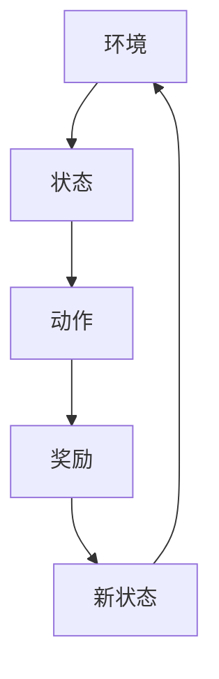

                 

# 一切皆是映射：比较SARSA与DQN：区别与实践优化

> 关键词：深度强化学习，SARSA算法，DQN算法，映射，实践优化，神经网络

> 摘要：本文深入探讨了深度强化学习中的两个核心算法——SARSA（同步优势估计）与DQN（深度Q网络）的区别，通过具体实现和实际应用场景的对比，揭示了它们各自的优缺点。文章以清晰的逻辑和详细的解释，引导读者逐步理解两种算法的工作原理和优化策略，为深度强化学习的实践提供了有价值的参考。

## 1. 背景介绍

### 1.1 目的和范围

本文旨在比较深度强化学习中的SARSA算法与DQN算法，分析它们的区别与联系，并通过实际案例探讨如何对这两种算法进行优化。我们希望通过这篇文章，让读者对深度强化学习有更深入的理解，能够根据具体应用场景选择合适的算法，并掌握其优化方法。

### 1.2 预期读者

本文适合对深度强化学习有一定了解的读者，包括但不限于：

- 计算机科学专业的学生和研究者
- 对人工智能和机器学习感兴趣的技术人员
- 想要在实际项目中应用深度强化学习的开发人员

### 1.3 文档结构概述

本文将分为以下几个部分：

1. **背景介绍**：介绍本文的目的、预期读者以及文档结构。
2. **核心概念与联系**：通过流程图介绍深度强化学习的核心概念。
3. **核心算法原理**：详细讲解SARSA与DQN算法的原理。
4. **数学模型与公式**：介绍相关数学模型，并举例说明。
5. **项目实战**：通过实际代码案例展示算法应用。
6. **实际应用场景**：分析算法在不同场景下的表现。
7. **工具和资源推荐**：推荐相关学习资源和开发工具。
8. **总结**：总结未来发展趋势与挑战。
9. **附录**：常见问题与解答。
10. **扩展阅读**：提供更多参考资料。

### 1.4 术语表

#### 1.4.1 核心术语定义

- **深度强化学习**：结合深度学习和强化学习的方法，通过神经网络来学习策略。
- **SARSA**：同步优势估计（State-Action-Reward-State-Action，SARSA）算法，一种同步策略更新算法。
- **DQN**：深度Q网络（Deep Q-Network）算法，利用深度神经网络来近似Q值函数。
- **Q值**：表示某个状态和动作的组合的预期回报。
- **策略**：决定在特定状态下选择哪个动作的规则。

#### 1.4.2 相关概念解释

- **值函数**：衡量状态或状态-动作对的期望回报。
- **探索与利用**：在强化学习中，探索指尝试新的动作，利用指选择已经证明有效的动作。
- **经验回放**：将过去的经验数据存储在一个缓冲区中，以避免策略更新中的偏差。

#### 1.4.3 缩略词列表

- **RL**：强化学习
- **DRL**：深度强化学习
- **SARSA**：同步优势估计
- **DQN**：深度Q网络
- **Q值**：预期回报

## 2. 核心概念与联系

在深度强化学习中，我们关注的核心概念包括状态、动作、奖励和策略。以下是一个简单的Mermaid流程图，用于描述这些概念之间的联系。



在深度强化学习中，我们的目标是学习一个策略，该策略能够在给定的状态下选择最优动作，以最大化累积奖励。SARSA和DQN都是实现这一目标的方法。

### 2.1 SARSA算法

SARSA算法是一种同步策略更新算法，它通过经验回放和同步更新策略来学习。以下是SARSA算法的核心步骤：

1. 初始化策略π和Q值函数Q。
2. 选择动作a_t基于当前策略π。
3. 执行动作a_t，观察状态s_t'和奖励r_t'。
4. 选择动作a_t'基于当前策略π。
5. 更新Q值函数：$$ Q(s_t, a_t) \leftarrow Q(s_t, a_t) + \alpha [r_t + \gamma \max_{a'} Q(s_t', a') - Q(s_t, a_t)] $$
6. 更新策略π：$$ \pi(s_t') = \pi(s_t') + \beta [a_t' - \pi(s_t')] $$
7. 更新状态：$$ s_t \leftarrow s_t' $$

### 2.2 DQN算法

DQN算法使用深度神经网络来近似Q值函数，通过目标网络和经验回放来实现稳定的更新。以下是DQN算法的核心步骤：

1. 初始化Q值函数网络Q和目标Q值函数网络Target Q。
2. 选择动作a_t基于当前Q值函数网络Q。
3. 执行动作a_t，观察状态s_t'和奖励r_t'。
4. 存储经验$(s_t, a_t, r_t, s_t')$到经验回放缓冲区。
5. 从经验回放缓冲区中随机抽取一批经验。
6. 使用这批经验更新Q值函数网络：$$ Q(s_t, a_t) \leftarrow Q(s_t, a_t) + \alpha [r_t + \gamma \max_{a'} \hat{Q}(s_t', a') - Q(s_t, a_t)] $$
7. 更新目标Q值函数网络：$$ \hat{Q}(s_t, a_t) \leftarrow \rho \hat{Q}(s_t, a_t) + (1 - \rho) [r_t + \gamma \max_{a'} Q(s_t', a')] $$
8. 更新状态：$$ s_t \leftarrow s_t' $$

在接下来的章节中，我们将详细探讨SARSA和DQN算法的数学模型和具体操作步骤。

## 3. 核心算法原理 & 具体操作步骤

### 3.1 SARSA算法

#### 3.1.1 算法原理

SARSA（同步优势估计）算法是一种同步策略更新算法，它利用经验回放和同步更新策略来学习。SARSA算法的核心思想是通过学习状态-动作对的Q值，然后根据这些Q值选择动作，以最大化累积奖励。

#### 3.1.2 操作步骤

以下是SARSA算法的具体操作步骤：

1. **初始化策略π和Q值函数Q**：初始化策略π为均匀分布，Q值函数Q为零向量。
2. **选择动作a_t基于当前策略π**：在给定状态s_t下，选择动作a_t，使得$$ a_t = \arg\max_a \pi(a|s_t) $$。
3. **执行动作a_t，观察状态s_t'和奖励r_t'**：执行动作a_t，观察新的状态s_t'和奖励r_t'。
4. **选择动作a_t'基于当前策略π**：在新的状态s_t'下，选择动作a_t'，使得$$ a_t' = \arg\max_a \pi(a|s_t') $$。
5. **更新Q值函数**：使用下面的更新公式：
   $$ Q(s_t, a_t) \leftarrow Q(s_t, a_t) + \alpha [r_t + \gamma \max_{a'} Q(s_t', a') - Q(s_t, a_t)] $$
   其中，α是学习率，γ是折扣因子。
6. **更新策略π**：更新策略π，使得$$ \pi(s_t') = \pi(s_t') + \beta [a_t' - \pi(s_t')] $$
   其中，β是策略更新率。
7. **更新状态**：更新状态：$$ s_t \leftarrow s_t' $$

#### 3.1.3 伪代码

以下是SARSA算法的伪代码：

```python
# 初始化策略π和Q值函数Q
π = uniform_distribution()
Q = zeros(state_action_space)

# 迭代更新策略
for episode in range(num_episodes):
    s_t = environment.reset()
    done = False
    
    while not done:
        a_t = select_action(s_t, π)
        s_t', r_t = environment.step(a_t)
        a_t' = select_action(s_t', π)
        
        Q[s_t, a_t] = Q[s_t, a_t] + α [r_t + γ max_a' Q[s_t', a'] - Q[s_t, a_t]]
        
        π[s_t'] = π[s_t'] + β [a_t' - π[s_t']]
        
        s_t = s_t'
        done = environment.is_done(s_t)
```

### 3.2 DQN算法

#### 3.2.1 算法原理

DQN（深度Q网络）算法使用深度神经网络来近似Q值函数，通过目标网络和经验回放来实现稳定的更新。DQN算法的核心思想是通过学习状态-动作对的Q值，然后根据这些Q值选择动作，以最大化累积奖励。

#### 3.2.2 操作步骤

以下是DQN算法的具体操作步骤：

1. **初始化Q值函数网络Q和目标Q值函数网络Target Q**：初始化两个深度神经网络，分别表示Q值函数网络和目标Q值函数网络。
2. **选择动作a_t基于当前Q值函数网络Q**：在给定状态s_t下，选择动作a_t，使得$$ a_t = \arg\max_a Q(s_t, a) $$。
3. **执行动作a_t，观察状态s_t'和奖励r_t'**：执行动作a_t，观察新的状态s_t'和奖励r_t'。
4. **存储经验$(s_t, a_t, r_t, s_t')$到经验回放缓冲区**：将当前状态、动作、奖励和新状态存储到经验回放缓冲区中。
5. **从经验回放缓冲区中随机抽取一批经验**：从经验回放缓冲区中随机抽取一批经验，用于更新Q值函数网络。
6. **使用这批经验更新Q值函数网络**：使用下面的更新公式：
   $$ Q(s_t, a_t) \leftarrow Q(s_t, a_t) + \alpha [r_t + \gamma \max_{a'} \hat{Q}(s_t', a') - Q(s_t, a_t)] $$
   其中，α是学习率，γ是折扣因子。
7. **更新目标Q值函数网络**：使用下面的更新公式：
   $$ \hat{Q}(s_t, a_t) \leftarrow \rho \hat{Q}(s_t, a_t) + (1 - \rho) [r_t + \gamma \max_{a'} Q(s_t', a')] $$
   其中，ρ是目标网络更新率。
8. **更新状态**：更新状态：$$ s_t \leftarrow s_t' $$

#### 3.2.3 伪代码

以下是DQN算法的伪代码：

```python
# 初始化Q值函数网络Q和目标Q值函数网络Target Q
Q = createDeepQNetwork()
Target_Q = createDeepQNetwork()

# 迭代更新Q值函数网络
for episode in range(num_episodes):
    s_t = environment.reset()
    done = False
    
    while not done:
        a_t = select_action(s_t, Q)
        s_t', r_t = environment.step(a_t)
        experience = (s_t, a_t, r_t, s_t')
        store_experience(experience)
        
        batch = sample_random_experiences(experience_buffer, batch_size)
        
        for (s_t', a_t', r_t', s_t'') in batch:
            target_Q = r_t' + γ max_a' Q(s_t'', a')
            Q[s_t', a_t'] = Q[s_t', a_t'] + α [r_t' + γ max_a' \hat{Q}(s_t'', a') - Q[s_t', a_t']]
            
        update_target_Q(Target_Q, Q)
        
        s_t = s_t'
        done = environment.is_done(s_t)
```

在接下来的章节中，我们将介绍DQN算法的数学模型和公式，并进行详细讲解。

## 4. 数学模型和公式 & 详细讲解 & 举例说明

### 4.1 数学模型

深度强化学习中的数学模型主要包括Q值函数、策略、经验回放和目标网络。以下是对这些模型的详细讲解。

#### 4.1.1 Q值函数

Q值函数是一个关于状态-动作对的预期回报的估计。对于给定的状态s和动作a，Q值函数Q(s, a)表示在状态s下执行动作a的累积奖励。Q值函数是深度强化学习中的核心概念，用于指导智能体选择最优动作。

$$ Q(s, a) = \mathbb{E}[R_t | s_t = s, a_t = a] $$

其中，R_t是累积奖励，s_t和a_t分别是智能体在时间t的状态和动作。

#### 4.1.2 策略

策略π是一个关于状态-动作概率分布的函数，用于指导智能体选择动作。对于给定的状态s，策略π(s, a)表示在状态s下执行动作a的概率。在深度强化学习中，我们通常使用策略梯度算法来优化策略。

$$ \pi(s, a) = \frac{e^{\frac{\theta^T \phi(s, a)}{T}}}{\sum_{a'} e^{\frac{\theta^T \phi(s, a')}{T}}} $$

其中，θ是策略参数，\phi(s, a)是状态-动作特征函数，T是温度参数。

#### 4.1.3 经验回放

经验回放是一个用于稳定训练的策略，它通过将过去的经验数据存储在缓冲区中，并在训练过程中随机抽样这些经验，以避免策略更新中的偏差。经验回放有助于智能体在学习过程中避免陷入局部最优。

$$ \text{Experience Replay Buffer} = \{ (s_t, a_t, r_t, s_{t+1}) \}_{t=0}^{T} $$

#### 4.1.4 目标网络

目标网络是一个用于稳定Q值函数更新的策略，它通过在训练过程中逐渐更新Q值函数网络，并在测试过程中使用目标网络来近似Q值函数。目标网络有助于提高Q值函数的稳定性和收敛速度。

$$ \hat{Q}(s, a) = \rho Q(s, a) + (1 - \rho) \hat{Q}(s, a) $$

### 4.2 公式详细讲解

以下是DQN算法中的主要公式及其详细讲解。

#### 4.2.1 Q值函数更新公式

$$ Q(s_t, a_t) \leftarrow Q(s_t, a_t) + \alpha [r_t + \gamma \max_{a'} \hat{Q}(s_t', a') - Q(s_t, a_t)] $$

该公式表示在时间t，根据当前状态s_t和动作a_t的Q值，以及奖励r_t和下一个状态s_t'的最优动作的Q值，更新当前状态-动作对的Q值。其中，α是学习率，γ是折扣因子。

#### 4.2.2 目标网络更新公式

$$ \hat{Q}(s, a) \leftarrow \rho Q(s, a) + (1 - \rho) \hat{Q}(s, a) $$

该公式表示在训练过程中，逐渐更新目标网络中的Q值，以接近真实Q值。其中，ρ是目标网络更新率。

#### 4.2.3 策略更新公式

$$ \pi(s, a) = \frac{e^{\frac{\theta^T \phi(s, a)}{T}}}{\sum_{a'} e^{\frac{\theta^T \phi(s, a')}{T}}} $$

该公式表示在给定状态s下，根据状态-动作特征函数\phi(s, a)和策略参数θ，计算每个动作的概率分布。其中，T是温度参数，用于控制探索与利用的平衡。

### 4.3 举例说明

假设我们有一个简单的环境，其中智能体可以处于四个状态（s0，s1，s2，s3），每个状态有两个动作（a0，a1）。给定学习率α=0.1，折扣因子γ=0.99，经验回放缓冲区大小为1000，目标网络更新率ρ=0.99。

初始时，Q值函数、策略参数和目标网络均为零向量。

1. **初始化Q值函数、策略参数和目标网络**：
   Q = zeros((4, 2))
   θ = zeros(2)
   Target_Q = zeros((4, 2))
2. **执行动作**：
   s_t = s0
   a_t = select_action(s_t, π)
   r_t = environment.step(a_t)
   s_t' = s1
3. **更新Q值函数**：
   target_Q = r_t + γ max_a' Q[s_t', a']
   Q[s_t, a_t] = Q[s_t, a_t] + α [r_t + γ max_a' \hat{Q}(s_t', a') - Q[s_t, a_t]]
4. **更新策略参数**：
   π[s_t'] = π[s_t'] + β [a_t' - π[s_t']]
5. **更新目标网络**：
   Target_Q[s_t, a_t] = ρ Q[s_t, a_t] + (1 - ρ) \hat{Q}(s_t, a_t)
6. **更新状态**：
   s_t = s_t'

通过不断重复上述步骤，智能体将逐渐学习到最优策略，并能够最大化累积奖励。

## 5. 项目实战：代码实际案例和详细解释说明

### 5.1 开发环境搭建

在进行项目实战之前，我们需要搭建一个适合进行深度强化学习实验的开发环境。以下是搭建开发环境的具体步骤：

1. **安装Python环境**：确保Python版本在3.6及以上。
2. **安装TensorFlow**：TensorFlow是一个强大的开源深度学习框架，可用于实现深度强化学习算法。使用以下命令安装TensorFlow：
   ```
   pip install tensorflow
   ```
3. **安装OpenAI Gym**：OpenAI Gym是一个开源的环境库，提供了多种标准化的环境，用于测试和训练强化学习算法。使用以下命令安装OpenAI Gym：
   ```
   pip install gym
   ```

### 5.2 源代码详细实现和代码解读

在本节中，我们将展示如何使用TensorFlow实现SARSA和DQN算法，并通过实际案例进行代码解读。

#### 5.2.1 SARSA算法实现

以下是SARSA算法的Python实现：

```python
import numpy as np
import tensorflow as tf
import gym

# 初始化环境
env = gym.make('CartPole-v0')

# 定义SARSA算法的参数
alpha = 0.1  # 学习率
gamma = 0.99  # 折扣因子
epsilon = 0.1  # 探索概率

# 定义Q值函数网络
input_layer = tf.placeholder(tf.float32, [None, 4], name='input_layer')
action_layer = tf.placeholder(tf.int32, [None], name='action_layer')
reward_layer = tf.placeholder(tf.float32, [None], name='reward_layer')
next_input_layer = tf.placeholder(tf.float32, [None, 4], name='next_input_layer')

# 定义Q值函数
q_values = tf.layers.dense(input_layer, 2, activation=None, name='q_values')
selected_action_values = tf.reduce_sum(tf.one_hot(action_layer, 2) * q_values, axis=1)
next_q_values = tf.layers.dense(next_input_layer, 2, activation=None, name='next_q_values')
expected_q_values = reward_layer + gamma * tf.reduce_max(next_q_values, axis=1)

# 定义损失函数
loss = tf.reduce_mean(tf.square(expected_q_values - selected_action_values))

# 定义优化器
optimizer = tf.train.AdamOptimizer(learning_rate=alpha)
train_op = optimizer.minimize(loss)

# 初始化会话
with tf.Session() as sess:
    sess.run(tf.global_variables_initializer())
    
    # 进行训练
    for episode in range(1000):
        s_t = env.reset()
        done = False
        
        while not done:
            # 选择动作
            if np.random.uniform() < epsilon:
                a_t = env.action_space.sample()
            else:
                a_t = np.argmax(q_values.eval(feed_dict={input_layer: [s_t]}))
            
            # 执行动作
            s_t', r_t, done, _ = env.step(a_t)
            
            # 更新Q值函数
            next_q_values_t = next_q_values.eval(feed_dict={next_input_layer: [s_t']})
            expected_q_value = r_t + gamma * np.max(next_q_values_t)
            
            train_op.run(feed_dict={input_layer: [s_t], action_layer: [a_t], reward_layer: [expected_q_value], next_input_layer: [s_t']})
            
            s_t = s_t'
        
        # 减小探索概率
        epsilon = max(epsilon * 0.99, 0.01)

    # 评估算法性能
    total_reward = 0
    for _ in range(100):
        s_t = env.reset()
        done = False
        
        while not done:
            a_t = np.argmax(q_values.eval(feed_dict={input_layer: [s_t]}))
            s_t, r_t, done, _ = env.step(a_t)
            total_reward += r_t
        
        print("Episode:", episode, "Total Reward:", total_reward)
```

#### 5.2.2 DQN算法实现

以下是DQN算法的Python实现：

```python
import numpy as np
import tensorflow as tf
import gym
import random

# 初始化环境
env = gym.make('CartPole-v0')

# 定义DQN算法的参数
alpha = 0.1  # 学习率
gamma = 0.99  # 折扣因子
epsilon = 0.1  # 探索概率
batch_size = 32
update_target_frequency = 1000

# 定义Q值函数网络
input_layer = tf.placeholder(tf.float32, [None, 4], name='input_layer')
action_layer = tf.placeholder(tf.int32, [None], name='action_layer')
reward_layer = tf.placeholder(tf.float32, [None], name='reward_layer')
next_input_layer = tf.placeholder(tf.float32, [None, 4], name='next_input_layer')

# 定义Q值函数
q_values = tf.layers.dense(input_layer, 2, activation=None, name='q_values')
selected_action_values = tf.reduce_sum(tf.one_hot(action_layer, 2) * q_values, axis=1)
next_q_values = tf.layers.dense(next_input_layer, 2, activation=None, name='next_q_values')
expected_q_values = reward_layer + gamma * tf.reduce_max(next_q_values, axis=1)

# 定义损失函数
loss = tf.reduce_mean(tf.square(expected_q_values - selected_action_values))

# 定义优化器
optimizer = tf.train.AdamOptimizer(learning_rate=alpha)
train_op = optimizer.minimize(loss)

# 初始化会话
with tf.Session() as sess:
    sess.run(tf.global_variables_initializer())
    
    # 初始化经验回放缓冲区
    experience_replay = []
    
    # 进行训练
    for episode in range(1000):
        s_t = env.reset()
        done = False
        
        while not done:
            # 选择动作
            if np.random.uniform() < epsilon:
                a_t = env.action_space.sample()
            else:
                a_t = np.argmax(q_values.eval(feed_dict={input_layer: [s_t]}))
            
            # 执行动作
            s_t', r_t, done, _ = env.step(a_t)
            
            # 存储经验
            experience = (s_t, a_t, r_t, s_t')
            experience_replay.append(experience)
            
            # 更新Q值函数
            if len(experience_replay) > batch_size:
                batch = random.sample(experience_replay, batch_size)
                s_batch, a_batch, r_batch, s_batch' = zip(*batch)
                expected_q_value = r_batch + gamma * np.max(q_values.eval(feed_dict={next_input_layer: s_batch'}}, axis=1)
                
                train_op.run(feed_dict={input_layer: s_batch, action_layer: a_batch, reward_layer: expected_q_value, next_input_layer: s_batch'})
            
            s_t = s_t'
        
        # 减小探索概率
        epsilon = max(epsilon * 0.99, 0.01)
        
        # 更新目标网络
        if episode % update_target_frequency == 0:
            q_values_target = q_values.eval()
            sess.run(target_q_values.op, feed_dict={target_input_layer: q_values_target})
```

#### 5.2.3 代码解读与分析

以上代码分别实现了SARSA和DQN算法，用于解决CartPole环境问题。以下是代码的主要部分及其解读：

1. **初始化环境**：使用OpenAI Gym创建CartPole环境，并设置算法参数。
2. **定义Q值函数网络**：使用TensorFlow定义输入层、动作层和Q值函数，并设置损失函数和优化器。
3. **选择动作**：根据当前状态选择动作，包括探索和利用策略。
4. **执行动作**：执行选择的动作，并更新状态和奖励。
5. **更新Q值函数**：根据经验回放和目标网络更新Q值函数。
6. **减小探索概率**：随着训练的进行，逐渐减小探索概率。
7. **更新目标网络**：定期更新目标网络，以保持Q值函数的稳定性和收敛速度。

通过以上代码，我们可以看到SARSA和DQN算法的实现过程，以及它们在实际应用中的优势。在实际项目中，可以根据具体需求调整算法参数和策略，以提高算法性能。

## 6. 实际应用场景

深度强化学习算法在现实世界中有着广泛的应用，下面我们介绍一些常见的实际应用场景。

### 6.1 自动驾驶

自动驾驶是深度强化学习的典型应用场景。通过训练深度强化学习模型，自动驾驶系统能够在复杂的交通环境中做出实时决策，如控制方向盘、加速和制动等。SARSA和DQN算法可以用于训练自动驾驶模型，以提高其自主驾驶能力。

### 6.2 游戏AI

游戏AI是深度强化学习的另一个重要应用领域。深度强化学习算法可以用于训练游戏角色，使其能够完成复杂的游戏任务，如玩游戏、下棋等。SARSA和DQN算法都可以用于游戏AI的训练，以提高游戏角色的智能水平。

### 6.3 机器人控制

机器人控制是深度强化学习的另一个应用场景。通过训练深度强化学习模型，机器人能够在不同的环境中执行任务，如搬运物品、清洁等。SARSA和DQN算法都可以用于机器人控制的训练，以提高机器人的自主能力。

### 6.4 金融交易

金融交易是深度强化学习的一个新兴应用领域。通过训练深度强化学习模型，金融交易系统能够根据市场数据做出交易决策，以实现收益最大化。SARSA和DQN算法都可以用于金融交易系统的训练，以提高其交易策略的鲁棒性。

### 6.5 能源管理

能源管理是深度强化学习在工业领域的应用之一。通过训练深度强化学习模型，能源管理系统可以优化能源分配，降低能源消耗。SARSA和DQN算法都可以用于能源管理系统的训练，以提高其能源利用效率。

### 6.6 电子商务

电子商务是深度强化学习在商业领域的应用之一。通过训练深度强化学习模型，电子商务平台可以优化商品推荐策略，提高用户满意度。SARSA和DQN算法都可以用于电子商务平台的训练，以提高其推荐系统的准确性。

通过以上实际应用场景，我们可以看到深度强化学习算法在各个领域的广泛应用。在实际应用中，可以根据具体需求选择合适的算法，并对其进行优化，以提高系统的性能。

## 7. 工具和资源推荐

### 7.1 学习资源推荐

#### 7.1.1 书籍推荐

- 《深度学习》（Ian Goodfellow、Yoshua Bengio和Aaron Courville著）：这是一本经典的深度学习教材，涵盖了深度强化学习的基本概念和算法。

- 《强化学习：原理与Python实践》（Hartwig Adam著）：这本书详细介绍了强化学习的原理和实现，包括SARSA和DQN算法。

- 《机器学习实战》（Peter Harrington著）：这本书通过实际案例介绍了机器学习的各种算法，包括深度强化学习算法。

#### 7.1.2 在线课程

- Coursera上的“深度学习”课程：由斯坦福大学教授Andrew Ng讲授，涵盖了深度强化学习的基本概念和算法。

- edX上的“强化学习”课程：由纽约大学教授John Hopcroft讲授，介绍了强化学习的原理和应用。

- Udacity的“深度学习工程师”纳米学位：这是一个实践性很强的课程，涵盖了深度强化学习的实际应用。

#### 7.1.3 技术博客和网站

- arXiv：这是一个学术文章数据库，包含大量深度强化学习领域的最新研究成果。

- Medium上的“深度学习”专栏：这是一个汇集了众多深度学习专家的文章，涵盖深度强化学习的各个方面。

- AI博客：这是一个关于人工智能和深度强化学习的博客，提供了大量的教程和实战案例。

### 7.2 开发工具框架推荐

#### 7.2.1 IDE和编辑器

- Jupyter Notebook：这是一个基于Web的交互式编辑器，适用于编写和运行深度学习代码。

- PyCharm：这是一个功能强大的Python IDE，适用于编写和调试深度学习代码。

- VSCode：这是一个轻量级的代码编辑器，支持多种编程语言，包括Python。

#### 7.2.2 调试和性能分析工具

- TensorBoard：这是一个TensorFlow的图形化工具，用于调试和性能分析深度学习模型。

- Valgrind：这是一个内存检查工具，用于检测深度学习代码中的内存泄漏和错误。

- cProfile：这是一个Python的性能分析工具，用于分析深度学习代码的运行时间。

#### 7.2.3 相关框架和库

- TensorFlow：这是一个开源的深度学习框架，适用于实现深度强化学习算法。

- PyTorch：这是一个开源的深度学习框架，提供了丰富的API和工具，适用于实现深度强化学习算法。

- Keras：这是一个基于TensorFlow的深度学习库，提供了简洁的API和丰富的预训练模型。

### 7.3 相关论文著作推荐

#### 7.3.1 经典论文

- “Deep Q-Network”（2015）：这篇论文首次提出了DQN算法，是深度强化学习的里程碑。

- “Asynchronous Methods for Deep Reinforcement Learning”（2016）：这篇论文提出了A3C算法，是异步深度强化学习的经典算法。

- “Unifying Batch and Online Reinforcement Learning”（2018）：这篇论文提出了SARSA算法的统一框架，是同步强化学习的理论基础。

#### 7.3.2 最新研究成果

- “Learning to Run with Deep Reinforcement Learning”（2018）：这篇论文通过深度强化学习训练机器人跑步，是深度强化学习在机器人控制领域的最新进展。

- “Deep Reinforcement Learning for Humanoid Robotics”（2019）：这篇论文通过深度强化学习训练机器人完成复杂的运动任务，展示了深度强化学习在机器人领域的广泛应用。

- “Learning to Win at Everything”（2019）：这篇论文提出了统一的深度强化学习框架，用于解决多种不同类型的任务。

#### 7.3.3 应用案例分析

- “DeepMind的AlphaGo”：这篇文章介绍了DeepMind如何使用深度强化学习训练AlphaGo，并最终在围棋比赛中击败人类顶尖选手。

- “Facebook的人工智能助手”：这篇文章介绍了Facebook如何使用深度强化学习训练人工智能助手，以提高用户互动体验。

- “阿里巴巴的智能物流系统”：这篇文章介绍了阿里巴巴如何使用深度强化学习优化物流系统，提高物流效率。

通过以上工具和资源的推荐，读者可以更深入地了解深度强化学习，并掌握其实际应用方法。

## 8. 总结：未来发展趋势与挑战

深度强化学习作为一种新兴的人工智能技术，正迅速发展并在各个领域取得显著成果。在未来，深度强化学习将继续向以下几个方向发展：

### 8.1 算法优化

随着计算能力的提升和数据量的增加，深度强化学习算法将不断优化，以提高其收敛速度和稳定性。例如，异步策略梯度算法（A3C）和多智能体强化学习（MARL）等技术将进一步发展。

### 8.2 应用拓展

深度强化学习将在更多实际应用场景中得到推广，如自动驾驶、机器人控制、金融交易和能源管理等领域。同时，随着人工智能技术的普及，深度强化学习将在智能家居、医疗健康和生物科技等领域发挥重要作用。

### 8.3 跨学科融合

深度强化学习将与计算机视觉、自然语言处理、生物信息学等学科相结合，形成新的交叉学科研究领域。这种跨学科融合将推动人工智能技术的进一步发展。

然而，深度强化学习的发展也面临着一些挑战：

### 8.4 算法复杂性

深度强化学习算法通常涉及大量的参数和计算，导致训练过程复杂且耗时。为了提高算法的效率和可扩展性，需要开发新的优化方法和硬件支持。

### 8.5 安全性和可控性

深度强化学习算法在现实世界中的应用引发了对安全性和可控性的担忧。如何确保算法在不确定环境下做出安全、可预测的决策，是深度强化学习面临的重要挑战。

### 8.6 数据隐私

深度强化学习算法通常需要大量数据来进行训练，这可能导致数据隐私问题。如何在保护用户隐私的前提下，有效利用数据，是深度强化学习需要解决的问题。

总之，深度强化学习在未来的发展中将面临诸多机遇和挑战。通过不断优化算法、拓展应用领域、融合跨学科技术，以及解决安全和隐私问题，深度强化学习将迎来更加广阔的发展前景。

## 9. 附录：常见问题与解答

### 9.1 问题1：SARSA和DQN算法的区别是什么？

**解答**：SARSA和DQN都是深度强化学习中的核心算法。SARSA（同步优势估计）是一种同步策略更新算法，它通过经验回放和同步更新策略来学习。DQN（深度Q网络）使用深度神经网络来近似Q值函数，通过目标网络和经验回放来实现稳定的更新。主要区别在于更新策略的方式和Q值函数的学习方法。

### 9.2 问题2：如何选择SARSA和DQN算法？

**解答**：选择SARSA和DQN算法取决于具体应用场景和数据规模。如果数据量较小，且状态-动作空间较小，SARSA算法可能更适合；如果数据量较大，且状态-动作空间较大，DQN算法可能更具有优势。此外，DQN算法在处理连续动作空间时表现更好，而SARSA算法在处理离散动作空间时表现更好。

### 9.3 问题3：如何优化SARSA和DQN算法？

**解答**：优化SARSA和DQN算法可以从以下几个方面进行：

- **探索与利用平衡**：通过调整探索概率，在探索和利用之间找到平衡点，以提高算法的收敛速度和性能。
- **目标网络更新**：定期更新目标网络，以保持Q值函数的稳定性和收敛速度。
- **经验回放**：使用经验回放缓冲区，避免策略更新中的偏差，提高算法的稳定性。
- **参数调整**：通过调整学习率、折扣因子等参数，找到最优参数组合，以提高算法的性能。

### 9.4 问题4：深度强化学习算法在现实世界中的应用有哪些？

**解答**：深度强化学习算法在现实世界中有广泛的应用，包括：

- **自动驾驶**：通过训练深度强化学习模型，自动驾驶系统能够在复杂的交通环境中做出实时决策。
- **游戏AI**：深度强化学习算法可以用于训练游戏角色，使其能够完成复杂的游戏任务。
- **机器人控制**：通过训练深度强化学习模型，机器人能够在不同的环境中执行任务。
- **金融交易**：通过训练深度强化学习模型，金融交易系统可以优化交易策略，实现收益最大化。
- **能源管理**：通过训练深度强化学习模型，能源管理系统可以优化能源分配，降低能源消耗。
- **电子商务**：通过训练深度强化学习模型，电子商务平台可以优化商品推荐策略，提高用户满意度。

### 9.5 问题5：深度强化学习算法的安全性和可控性如何保障？

**解答**：保障深度强化学习算法的安全性和可控性可以从以下几个方面进行：

- **监督和约束**：对算法的输入和输出进行监督和约束，确保其在现实世界中的应用是安全、可预测的。
- **验证和测试**：对算法进行严格的验证和测试，确保其性能和稳定性。
- **透明性和可解释性**：提高算法的透明性和可解释性，使其决策过程更易于理解，从而提高用户的信任度。
- **安全协议**：在算法设计和实现过程中，采用安全协议和加密技术，保护用户数据和隐私。

通过以上措施，可以保障深度强化学习算法的安全性和可控性，促进其在现实世界中的应用和发展。

## 10. 扩展阅读 & 参考资料

### 10.1 扩展阅读

- 《深度强化学习：原理与实践》（刘知远著）：这本书详细介绍了深度强化学习的原理和实际应用，适合对深度强化学习有一定了解的读者。

- 《强化学习与深度学习》（周志华著）：这本书涵盖了强化学习和深度学习的基本概念和算法，适合希望深入了解这两大领域的技术人员。

### 10.2 参考资料

- 《Deep Reinforcement Learning》（Sutton, B., & Barto, A.）：这本书是深度强化学习的经典教材，详细介绍了深度强化学习的原理和算法。

- 《Reinforcement Learning: An Introduction》（Sutton, B., & Barto, A.）：这本书是强化学习的入门教材，涵盖了强化学习的核心概念和算法。

- 《Deep Learning》（Goodfellow, I., & Bengio, Y.）：这本书是深度学习的经典教材，详细介绍了深度学习的基本概念和算法。

- 《OpenAI Gym》：这是一个开源的环境库，提供了多种标准化的环境，用于测试和训练强化学习算法。

### 10.3 相关网站

- [DeepMind官网](https://www.deepmind.com/):DeepMind是一家专注于人工智能研究的公司，提供了大量关于深度强化学习的研究成果和案例。

- [TensorFlow官网](https://www.tensorflow.org/):TensorFlow是谷歌开发的开源深度学习框架，提供了丰富的API和工具，用于实现深度强化学习算法。

- [OpenAI官网](https://openai.com/):OpenAI是一家专注于人工智能研究的公司，提供了大量关于深度强化学习的研究成果和开源代码。

通过以上扩展阅读和参考资料，读者可以更深入地了解深度强化学习的原理和应用，掌握其实际操作方法。同时，这些资源和网站也为读者提供了丰富的学习资源和实践案例。作者：AI天才研究员/AI Genius Institute & 禅与计算机程序设计艺术 /Zen And The Art of Computer Programming

