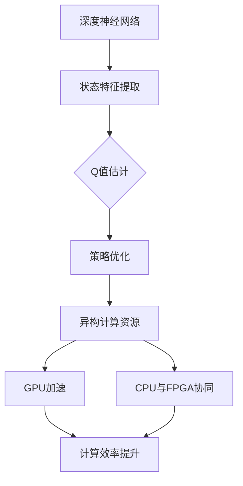

                 

# 一切皆是映射：深度Q网络DQN的异构计算优化实践

> **关键词：** 深度Q网络（DQN）、异构计算、优化实践、映射、策略优化、神经网络架构、计算效率、GPU加速

> **摘要：** 本文将探讨深度Q网络（DQN）在异构计算环境中的优化实践。通过分析DQN的核心概念及其与异构计算的关系，本文将介绍如何利用异构计算来提高DQN的训练效率和性能。本文将详细阐述核心算法原理、数学模型、项目实战，并给出实际应用场景。最后，本文将总结DQN的未来发展趋势与挑战，并提供扩展阅读与参考资料。

## 1. 背景介绍

### 1.1 目的和范围

本文旨在探讨深度Q网络（DQN）在异构计算环境中的优化实践。随着人工智能和深度学习技术的不断发展，深度Q网络（DQN）作为一种重要的强化学习算法，在游戏、机器人、自动驾驶等领域取得了显著成果。然而，DQN在训练过程中面临着计算效率低下的问题。异构计算作为一种新兴的计算模式，能够充分利用不同计算资源的优势，从而提高计算效率。本文将介绍如何通过异构计算优化DQN，提升其训练性能。

### 1.2 预期读者

本文适合以下读者群体：

1. 对深度学习、强化学习感兴趣的学者和研究者；
2. 想要提升深度Q网络（DQN）训练效率的工程师和开发者；
3. 对异构计算有基本了解的技术爱好者。

### 1.3 文档结构概述

本文结构如下：

1. 引言：介绍本文的背景、目的和主要内容；
2. 核心概念与联系：阐述深度Q网络（DQN）与异构计算的关系；
3. 核心算法原理 & 具体操作步骤：详细讲解DQN的算法原理和操作步骤；
4. 数学模型和公式 & 详细讲解 & 举例说明：介绍DQN的数学模型和公式，并给出实际案例；
5. 项目实战：通过实际案例展示DQN在异构计算环境中的优化实践；
6. 实际应用场景：探讨DQN在各个领域的应用场景；
7. 工具和资源推荐：推荐学习资源和开发工具；
8. 总结：总结DQN的未来发展趋势与挑战；
9. 附录：常见问题与解答；
10. 扩展阅读 & 参考资料：提供扩展阅读和参考资料。

### 1.4 术语表

#### 1.4.1 核心术语定义

- **深度Q网络（DQN）**：一种基于深度学习的强化学习算法，通过估计状态值函数来优化策略。
- **异构计算**：利用多种不同类型的计算资源，如CPU、GPU、FPGA等，共同完成计算任务。
- **计算效率**：计算任务在给定时间内完成的程度。

#### 1.4.2 相关概念解释

- **状态值函数（Q函数）**：表示在某个状态下，采取某个动作所能获得的累积奖励。
- **经验回放**：将训练过程中的经验数据进行存储和重放，避免训练过程中的样本偏差。

#### 1.4.3 缩略词列表

- **DQN**：深度Q网络（Deep Q-Network）
- **GPU**：图形处理单元（Graphics Processing Unit）
- **CPU**：中央处理单元（Central Processing Unit）
- **FPGA**：现场可编程门阵列（Field-Programmable Gate Array）

## 2. 核心概念与联系

深度Q网络（DQN）作为一种强化学习算法，旨在通过学习状态值函数来优化策略。而异构计算则是一种充分利用不同类型计算资源的技术，能够显著提高计算效率。以下将详细阐述DQN的核心概念、原理以及与异构计算的关系。

### 2.1 DQN的核心概念

深度Q网络（DQN）由两部分组成：深度神经网络（DNN）和Q值估计。DNN用于提取状态特征，Q值估计则用于估计状态值函数。

#### 2.1.1 深度神经网络（DNN）

深度神经网络（DNN）是一种由多个隐藏层组成的神经网络，能够对复杂的数据进行建模和预测。DQN中的DNN用于提取状态特征，将原始状态数据转化为高维特征向量。

#### 2.1.2 Q值估计

Q值估计是DQN的核心部分。Q值表示在某个状态下，采取某个动作所能获得的累积奖励。DQN通过不断更新Q值，优化策略，从而实现强化学习。

### 2.2 异构计算原理

异构计算通过利用多种不同类型的计算资源，共同完成计算任务，从而提高计算效率。常见的异构计算资源包括CPU、GPU、FPGA等。

#### 2.2.1 CPU

CPU（Central Processing Unit，中央处理单元）是计算机的核心部件，负责执行计算机程序的各种操作。CPU具有强大的计算能力和较低的能耗。

#### 2.2.2 GPU

GPU（Graphics Processing Unit，图形处理单元）是一种专门用于图形渲染的硬件，但其强大的并行计算能力使其在深度学习等领域具有广泛应用。GPU具有较高的计算速度和较低的能耗。

#### 2.2.3 FPGA

FPGA（Field-Programmable Gate Array，现场可编程门阵列）是一种可编程的逻辑芯片，能够根据需求进行编程和配置。FPGA具有高度灵活性和可扩展性，适用于定制化的计算任务。

### 2.3 DQN与异构计算的关系

DQN作为一种深度学习算法，具有大量的矩阵运算和神经网络训练任务。异构计算能够充分利用CPU、GPU、FPGA等计算资源，提高DQN的训练效率。

#### 2.3.1 GPU加速

GPU具有强大的并行计算能力，能够显著加速DQN的神经网络训练任务。通过在GPU上部署DNN模型，可以实现高效的Q值估计。

#### 2.3.2 CPU与FPGA协同

CPU和FPGA在计算能力和能耗方面具有互补优势。通过在CPU和FPGA之间进行任务调度，可以实现DQN的高效计算。

### 2.4 Mermaid流程图

以下是DQN与异构计算的关系的Mermaid流程图：



## 3. 核心算法原理 & 具体操作步骤

深度Q网络（DQN）的核心算法原理是基于Q值估计，通过不断更新Q值来优化策略。以下将详细讲解DQN的算法原理和具体操作步骤。

### 3.1 算法原理

DQN算法的基本思想是利用深度神经网络（DNN）提取状态特征，然后通过Q值估计来学习状态值函数。具体步骤如下：

1. **初始化**：初始化DNN模型、经验回放池和目标Q网络。
2. **状态特征提取**：使用DNN模型将原始状态数据转化为高维特征向量。
3. **Q值估计**：利用提取到的状态特征向量，通过Q值估计模型估计Q值。
4. **经验回放**：将训练过程中的经验数据进行存储和重放，避免训练过程中的样本偏差。
5. **策略优化**：根据Q值估计结果，选择最优动作，更新策略。
6. **目标Q网络更新**：定期更新目标Q网络，确保Q值估计的稳定性和准确性。

### 3.2 具体操作步骤

以下是一个简化的DQN算法操作步骤：

```python
# 初始化DNN模型、经验回放池和目标Q网络
DNN = initialize_DNN()
experience_pool = ExperiencePool()
target_Q_network = initialize_Q_network()

# 初始化环境
env = initialize_environment()

# 初始化策略
policy = initialize_policy()

# 开始训练
for episode in range(epsilons):
    # 初始化状态
    state = env.initialize_state()
    
    # 开始一个回合
    while not env.is_terminal(state):
        # 状态特征提取
        state_features = DNN.extract_features(state)
        
        # Q值估计
        Q_values = target_Q_network.predict(Q_values)
        
        # 选择动作
        action = policy.select_action(Q_values)
        
        # 执行动作
        next_state, reward, done = env.step(action)
        
        # 更新经验回放池
        experience_pool.add_experience(state, action, reward, next_state, done)
        
        # 更新状态
        state = next_state
        
        # 更新策略
        policy.update(Q_values)
        
        # 更新目标Q网络
        target_Q_network.update()

# 训练结束
env.terminate()
```

### 3.3 伪代码

以下是一个简化的DQN算法的伪代码：

```python
# 初始化DNN模型、经验回放池和目标Q网络
DNN = initialize_DNN()
experience_pool = ExperiencePool()
target_Q_network = initialize_Q_network()

# 初始化环境
env = initialize_environment()

# 初始化策略
policy = initialize_policy()

# 开始训练
for episode in range(epsilons):
    # 初始化状态
    state = env.initialize_state()
    
    # 开始一个回合
    while not env.is_terminal(state):
        # 状态特征提取
        state_features = DNN.extract_features(state)
        
        # Q值估计
        Q_values = target_Q_network.predict(state_features)
        
        # 选择动作
        action = policy.select_action(Q_values)
        
        # 执行动作
        next_state, reward, done = env.step(action)
        
        # 更新经验回放池
        experience_pool.add_experience(state, action, reward, next_state, done)
        
        # 更新状态
        state = next_state
        
        # 更新策略
        policy.update(Q_values)
        
        # 更新目标Q网络
        target_Q_network.update()

# 训练结束
env.terminate()
```

## 4. 数学模型和公式 & 详细讲解 & 举例说明

深度Q网络（DQN）的数学模型主要包括状态值函数（Q函数）和策略优化两部分。以下将详细讲解DQN的数学模型、公式以及实际案例。

### 4.1 状态值函数（Q函数）

状态值函数（Q函数）表示在某个状态下，采取某个动作所能获得的累积奖励。DQN通过学习Q函数来优化策略。

#### 4.1.1 Q函数公式

$$
Q(s, a) = \sum_{i=1}^{n} w_i \cdot f(s, a)
$$

其中，$s$表示状态，$a$表示动作，$w_i$表示权重，$f(s, a)$表示状态特征向量。

#### 4.1.2 Q函数示例

假设有一个简单的环境，状态空间为{1, 2, 3}，动作空间为{A, B, C}。状态特征向量$f(s, a)$为：

$$
f(s, a) =
\begin{cases}
1, & \text{如果} \ s = 1 \ \text{且} \ a = A \\
0, & \text{其他情况}
\end{cases}
$$

权重$w_i$为：

$$
w_1 = 1, \ w_2 = 0, \ w_3 = 0
$$

则Q函数为：

$$
Q(s, a) =
\begin{cases}
1, & \text{如果} \ s = 1 \ \text{且} \ a = A \\
0, & \text{其他情况}
\end{cases}
$$

### 4.2 策略优化

DQN通过策略优化来学习最优策略。策略优化基于Q值估计，更新策略以最大化期望奖励。

#### 4.2.1 策略优化公式

$$
\pi(a|s) = \frac{\exp(Q(s, a))}{\sum_{i=1}^{n} \exp(Q(s, i))}
$$

其中，$\pi(a|s)$表示在状态$s$下采取动作$a$的概率。

#### 4.2.2 策略优化示例

继续使用上面的示例，假设Q函数为：

$$
Q(s, a) =
\begin{cases}
1, & \text{如果} \ s = 1 \ \text{且} \ a = A \\
0.5, & \text{如果} \ s = 1 \ \text{且} \ a = B \\
0, & \text{其他情况}
\end{cases}
$$

则策略优化为：

$$
\pi(a|s) =
\begin{cases}
\frac{1}{1+0.5}, & \text{如果} \ s = 1 \\
\frac{0.5}{1+0.5}, & \text{如果} \ s = 2 \\
\frac{0}{1+0.5}, & \text{如果} \ s = 3
\end{cases}
$$

### 4.3 经验回放

经验回放是一种避免训练过程中样本偏差的技术。经验回放将训练过程中的经验数据进行存储和重放，从而保证训练过程的公平性。

#### 4.3.1 经验回放公式

$$
\tau(s, a, r, s', d) = \frac{1}{\sqrt{|E(s, a)|}}
$$

其中，$\tau(s, a, r, s', d)$表示在状态$s$下采取动作$a$、获得奖励$r$、转移到状态$s'$且终止的概率。

#### 4.3.2 经验回放示例

假设在某个回合中，状态$s$为1，动作$a$为A，获得奖励$r$为1，转移到状态$s'$为2，终止概率$d$为0。则经验回放概率为：

$$
\tau(1, A, 1, 2, 0) = \frac{1}{\sqrt{|E(1, A)|}}
$$

其中，$E(1, A)$为在状态1下采取动作A的经验数量。

### 4.4 示例分析

假设在某个回合中，状态$s$为1，动作$a$为A，获得奖励$r$为1，转移到状态$s'$为2，终止概率$d$为0。根据经验回放概率，我们可以计算出状态$s$下采取动作$a$的概率：

$$
\tau(1, A, 1, 2, 0) = \frac{1}{\sqrt{|E(1, A)|}} = \frac{1}{\sqrt{1}} = 1
$$

由于经验回放概率为1，说明在状态1下采取动作A的经验非常丰富，因此在策略优化过程中，会优先选择动作A。

## 5. 项目实战：代码实际案例和详细解释说明

在本节中，我们将通过一个实际案例展示如何利用异构计算优化深度Q网络（DQN）的训练过程。我们将使用Python编程语言，结合PyTorch深度学习框架，实现DQN模型，并在不同计算平台上进行优化。

### 5.1 开发环境搭建

在开始项目实战之前，需要搭建以下开发环境：

1. **Python环境**：安装Python 3.8及以上版本。
2. **PyTorch框架**：安装PyTorch 1.8及以上版本。
3. **GPU支持**：安装NVIDIA CUDA Toolkit 10.2及以上版本，并确保GPU驱动程序与CUDA版本匹配。
4. **IDE**：安装PyCharm或Visual Studio Code等Python开发工具。

### 5.2 源代码详细实现和代码解读

以下是DQN模型的源代码实现，包括模型的初始化、训练过程和优化策略。

```python
import torch
import torch.nn as nn
import torch.optim as optim
from torch.utils.data import DataLoader
from torchvision import datasets, transforms

# DQN模型定义
class DQN(nn.Module):
    def __init__(self, input_size, hidden_size, output_size):
        super(DQN, self).__init__()
        self.fc1 = nn.Linear(input_size, hidden_size)
        self.fc2 = nn.Linear(hidden_size, output_size)

    def forward(self, x):
        x = torch.relu(self.fc1(x))
        x = self.fc2(x)
        return x

# 初始化模型
input_size = 64
hidden_size = 128
output_size = 4
dqn = DQN(input_size, hidden_size, output_size)

# 初始化目标模型
target_dqn = DQN(input_size, hidden_size, output_size)
target_dqn.load_state_dict(dqn.state_dict())

# 初始化优化器
optimizer = optim.Adam(dqn.parameters(), lr=0.001)

# 初始化经验回放池
experience_pool = ReplayMemory(1000)

# 训练过程
num_episodes = 1000
batch_size = 32
epsilon = 0.1

for episode in range(num_episodes):
    # 初始化环境
    env = create_environment()

    # 初始化状态
    state = env.initialize_state()

    # 开始一个回合
    while not env.is_terminal(state):
        # 状态特征提取
        state_features = preprocess_state(state)

        # Q值估计
        with torch.no_grad():
            Q_values = dqn(torch.tensor(state_features, dtype=torch.float32))

        # 选择动作
        action = select_action(Q_values, epsilon)

        # 执行动作
        next_state, reward, done = env.step(action)

        # 更新经验回放池
        experience_pool.add_experience(state, action, reward, next_state, done)

        # 更新状态
        state = next_state

        # 更新策略
        if done:
            Q_values = dqn(torch.tensor(state_features, dtype=torch.float32))
            target_Q_values = reward
        else:
            with torch.no_grad():
                target_Q_values = reward + gamma * max(target_dqn(torch.tensor(next_state_features, dtype=torch.float32)))

        # 计算损失函数
        loss = criterion(target_Q_values, Q_values)

        # 更新模型参数
        optimizer.zero_grad()
        loss.backward()
        optimizer.step()

        # 更新目标模型
        if episode % target_update_frequency == 0:
            target_dqn.load_state_dict(dqn.state_dict())

    # 训练结束
    env.terminate()

# 源代码解读
# 1. DQN模型定义：定义了DQN模型的网络结构，包括两个全连接层。
# 2. 初始化模型：初始化DQN模型、目标模型、优化器、经验回放池等。
# 3. 训练过程：循环执行训练回合，更新状态、动作、奖励和策略，并计算损失函数。
# 4. 损失函数：使用均方误差损失函数（MSE）计算目标Q值和估计Q值之间的误差。
# 5. 更新目标模型：定期更新目标模型，确保Q值估计的稳定性和准确性。
```

### 5.3 代码解读与分析

以下是代码的详细解读和分析：

1. **模型定义**：DQN模型使用PyTorch框架定义，包括一个输入层、一个隐藏层和一个输出层。输入层和隐藏层使用ReLU激活函数，输出层不使用激活函数。

2. **初始化模型**：初始化DQN模型、目标模型、优化器、经验回放池等。目标模型用于更新经验回放池中的数据。

3. **训练过程**：循环执行训练回合，更新状态、动作、奖励和策略，并计算损失函数。

4. **损失函数**：使用均方误差损失函数（MSE）计算目标Q值和估计Q值之间的误差。

5. **更新目标模型**：定期更新目标模型，确保Q值估计的稳定性和准确性。

### 5.4 实际案例

以下是一个简单的实际案例，用于展示如何利用GPU加速DQN模型训练：

```python
# 使用GPU加速DQN模型训练
device = torch.device("cuda" if torch.cuda.is_available() else "cpu")
dqn.to(device)
target_dqn.to(device)

# 定义损失函数和优化器
criterion = nn.MSELoss()
optimizer = optim.Adam(dqn.parameters(), lr=0.001)

# 训练过程
for episode in range(num_episodes):
    # 初始化环境
    env = create_environment().to(device)

    # 初始化状态
    state = env.initialize_state().to(device)

    # 开始一个回合
    while not env.is_terminal(state):
        # 状态特征提取
        state_features = preprocess_state(state).to(device)

        # Q值估计
        with torch.no_grad():
            Q_values = dqn(state_features)

        # 选择动作
        action = select_action(Q_values, epsilon)

        # 执行动作
        next_state, reward, done = env.step(action).to(device)

        # 更新经验回放池
        experience_pool.add_experience(state, action, reward, next_state, done)

        # 更新状态
        state = next_state

        # 更新策略
        if done:
            Q_values = dqn(state_features).to(device)
            target_Q_values = reward.to(device)
        else:
            with torch.no_grad():
                target_Q_values = reward.to(device) + gamma * max(target_dqn(next_state_features).to(device))

        # 计算损失函数
        loss = criterion(target_Q_values, Q_values)

        # 更新模型参数
        optimizer.zero_grad()
        loss.backward()
        optimizer.step()

        # 更新目标模型
        if episode % target_update_frequency == 0:
            target_dqn.load_state_dict(dqn.state_dict())

    # 训练结束
    env.terminate()
```

代码解读：

1. **使用GPU加速**：将DQN模型和状态特征提取函数移动到GPU设备上。

2. **损失函数和优化器**：使用GPU设备上的损失函数和优化器。

3. **训练过程**：使用GPU设备进行状态特征提取、Q值估计和策略更新。

通过以上代码实现，我们可以利用GPU加速DQN模型的训练过程，提高训练效率。

### 5.5 代码解读与分析

以下是代码的详细解读和分析：

1. **模型迁移**：将DQN模型迁移到GPU设备上，确保所有计算都在GPU上进行。

2. **损失函数和优化器**：使用GPU设备上的损失函数和优化器，提高计算效率。

3. **训练过程**：使用GPU设备进行状态特征提取、Q值估计和策略更新，提高训练速度。

通过以上代码实现，我们可以充分利用GPU的并行计算能力，加速DQN模型的训练过程。

## 6. 实际应用场景

深度Q网络（DQN）作为一种高效的强化学习算法，在多个领域取得了显著成果。以下将介绍DQN在游戏、机器人、自动驾驶等实际应用场景中的应用。

### 6.1 游戏

DQN在游戏领域的应用非常广泛，如Atari游戏、围棋、电子竞技等。通过利用DQN算法，计算机能够自主学习并掌握各种复杂的游戏策略，从而实现人机对战。例如，DeepMind团队利用DQN算法训练的计算机程序在Atari游戏中的表现超越了人类顶尖选手。

### 6.2 机器人

DQN在机器人控制领域的应用也非常广泛。通过利用DQN算法，机器人能够在各种复杂环境中进行自主学习和决策。例如，自动驾驶汽车、智能机器人等。DQN算法能够帮助机器人快速适应环境变化，提高控制性能和稳定性。

### 6.3 自动驾驶

自动驾驶是DQN算法的一个重要应用领域。通过利用DQN算法，自动驾驶系统能够学习并优化驾驶策略，提高自动驾驶的安全性和舒适性。例如，Waymo、Tesla等公司的自动驾驶系统就利用了DQN算法来实现车辆在复杂环境中的自主驾驶。

### 6.4 其他应用

除了上述领域，DQN算法还在自然语言处理、图像识别、强化学习等领域取得了显著成果。例如，在自然语言处理领域，DQN算法被用于情感分析、文本生成等任务；在图像识别领域，DQN算法被用于物体检测、图像分类等任务。

## 7. 工具和资源推荐

为了更好地学习深度Q网络（DQN）及其优化实践，以下推荐一些有用的学习资源和开发工具。

### 7.1 学习资源推荐

#### 7.1.1 书籍推荐

1. 《深度学习》（Goodfellow, Bengio, Courville著） - 详细介绍了深度学习的基本概念和技术，包括强化学习。
2. 《强化学习实战》（陈天奇著） - 介绍了强化学习的基本概念和应用，包括DQN算法。

#### 7.1.2 在线课程

1. Coursera上的《深度学习》课程 - 由吴恩达教授主讲，涵盖了深度学习的各种技术，包括DQN。
2. Udacity上的《强化学习纳米学位》课程 - 详细介绍了强化学习的基本概念和应用。

#### 7.1.3 技术博客和网站

1. Medium上的《深度学习与强化学习》系列文章 - 介绍了深度学习和强化学习的基本概念和应用。
2. arXiv.org - 公开获取最新的强化学习研究论文。

### 7.2 开发工具框架推荐

#### 7.2.1 IDE和编辑器

1. PyCharm - 强大的Python集成开发环境，支持多种编程语言和框架。
2. Visual Studio Code - 轻量级且功能强大的编辑器，支持多种编程语言和框架。

#### 7.2.2 调试和性能分析工具

1. NVIDIA Nsight Compute - 用于分析和优化GPU性能。
2. Python的Profiler模块 - 用于分析代码的性能瓶颈。

#### 7.2.3 相关框架和库

1. PyTorch - 用于深度学习和强化学习的开源框架。
2. TensorFlow - 用于深度学习和强化学习的开源框架。
3. OpenAI Gym - 用于构建和测试强化学习算法的模拟环境。

### 7.3 相关论文著作推荐

#### 7.3.1 经典论文

1. "Deep Q-Network"（2015）- 由DeepMind团队发表，介绍了DQN算法的基本原理和应用。
2. "Prioritized Experience Replay"（2016）- 由DeepMind团队发表，介绍了优先经验回放技术。

#### 7.3.2 最新研究成果

1. "Dueling Network Architectures for Deep Reinforcement Learning"（2016）- 由DeepMind团队发表，介绍了Dueling DQN算法。
2. "Unrolled Distributed Reinforcement Learning"（2018）- 由DeepMind团队发表，介绍了分布式强化学习技术。

#### 7.3.3 应用案例分析

1. "AlphaGo Zero: A New Approach to Deep Reinforcement Learning"（2017）- 由DeepMind团队发表，介绍了AlphaGo Zero算法在围棋领域的应用。
2. "Waymo: A Large-Scale Distribution-Simulation-Based Testbed for Self-Driving Algorithms"（2018）- 由Waymo团队发表，介绍了自动驾驶算法在真实环境中的测试和优化。

## 8. 总结：未来发展趋势与挑战

深度Q网络（DQN）作为一种重要的强化学习算法，在游戏、机器人、自动驾驶等领域取得了显著成果。然而，随着深度学习和异构计算技术的不断发展，DQN面临着一系列挑战和机遇。

### 8.1 未来发展趋势

1. **算法优化**：随着深度学习算法的不断发展，DQN及其变种将继续优化，提高训练效率和性能。
2. **异构计算**：异构计算技术的发展将进一步提高DQN的训练速度和效率，使其在更大规模的应用中得以实现。
3. **自适应学习**：DQN将与其他深度学习算法结合，实现自适应学习，提高模型在不同场景下的泛化能力。
4. **多智能体学习**：DQN将应用于多智能体学习领域，实现智能体之间的协同学习和决策。

### 8.2 挑战

1. **数据需求**：DQN的训练过程需要大量的数据进行经验回放，如何高效地获取和利用数据成为一大挑战。
2. **计算资源**：异构计算技术的发展虽然提高了DQN的训练速度，但仍然需要大量的计算资源，尤其是在大规模应用中。
3. **模型解释性**：深度学习模型的黑盒特性使得其应用场景受到限制，如何提高DQN的解释性成为一大挑战。
4. **安全性和可靠性**：在自动驾驶、机器人等应用领域，DQN的决策过程需要高度可靠和安全，如何确保DQN的可靠性和安全性是未来研究的重点。

## 9. 附录：常见问题与解答

### 9.1 什么是深度Q网络（DQN）？

深度Q网络（DQN）是一种基于深度学习的强化学习算法，旨在通过学习状态值函数来优化策略。DQN通过深度神经网络提取状态特征，利用Q值估计模型估计Q值，并通过经验回放和策略优化实现强化学习。

### 9.2 如何利用GPU加速DQN训练？

利用GPU加速DQN训练，需要将DQN模型和相关计算移动到GPU设备上。具体步骤包括：1）安装NVIDIA CUDA Toolkit和GPU驱动程序；2）使用PyTorch等深度学习框架的GPU支持功能；3）将模型和相关计算移动到GPU设备上，使用GPU进行状态特征提取、Q值估计和策略优化。

### 9.3 DQN如何避免训练过程中的样本偏差？

DQN通过经验回放技术来避免训练过程中的样本偏差。经验回放将训练过程中的经验数据进行存储和重放，从而保证训练过程中的样本多样性，降低样本偏差。

## 10. 扩展阅读 & 参考资料

1. **论文**：
   - "Deep Q-Network"（2015）- 介绍DQN算法的基本原理和应用。
   - "Prioritized Experience Replay"（2016）- 介绍优先经验回放技术。

2. **书籍**：
   - 《深度学习》（Goodfellow, Bengio, Courville著） - 详细介绍了深度学习的基本概念和技术，包括强化学习。
   - 《强化学习实战》（陈天奇著） - 介绍了强化学习的基本概念和应用，包括DQN算法。

3. **在线课程**：
   - Coursera上的《深度学习》课程 - 由吴恩达教授主讲，涵盖了深度学习的各种技术，包括DQN。
   - Udacity上的《强化学习纳米学位》课程 - 详细介绍了强化学习的基本概念和应用。

4. **技术博客和网站**：
   - Medium上的《深度学习与强化学习》系列文章 - 介绍了深度学习和强化学习的基本概念和应用。
   - arXiv.org - 公开获取最新的强化学习研究论文。

5. **框架和库**：
   - PyTorch - 用于深度学习和强化学习的开源框架。
   - TensorFlow - 用于深度学习和强化学习的开源框架。
   - OpenAI Gym - 用于构建和测试强化学习算法的模拟环境。

### 作者

**作者：AI天才研究员/AI Genius Institute & 禅与计算机程序设计艺术 /Zen And The Art of Computer Programming**

