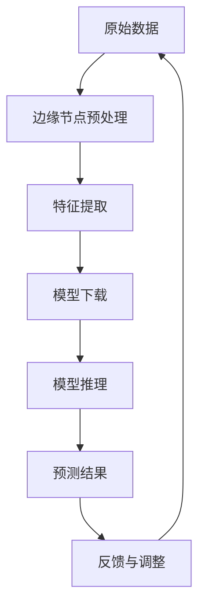

                 

# 一切皆是映射：深度学习在边缘计算中的实现

> **关键词**：深度学习、边缘计算、映射、性能优化、资源利用、应用场景
>
> **摘要**：本文深入探讨了深度学习在边缘计算中的实现，分析了深度学习与边缘计算的相互映射关系。通过逐步解析核心概念、算法原理、数学模型、实战案例和实际应用，阐述了如何利用深度学习提高边缘计算的性能和资源利用率，为读者提供了一整套实用的解决方案。

## 1. 背景介绍

### 1.1 目的和范围

本文旨在深入探讨深度学习在边缘计算中的应用，通过详细的分析和实例，揭示深度学习与边缘计算之间的映射关系，并提出优化策略。本文将覆盖以下主题：

- 深度学习在边缘计算中的核心概念和原理；
- 深度学习算法在边缘计算环境中的具体实现步骤；
- 深度学习数学模型和公式的详细解释；
- 实际项目中的代码案例和实践；
- 深度学习在边缘计算中的实际应用场景。

### 1.2 预期读者

本文面向对深度学习和边缘计算有一定了解的读者，包括：

- 深度学习和边缘计算领域的研究者；
- 软件工程师和技术专家；
- 对人工智能和边缘计算感兴趣的技术爱好者。

### 1.3 文档结构概述

本文分为十个部分，具体结构如下：

- 第1部分：背景介绍
- 第2部分：核心概念与联系
- 第3部分：核心算法原理 & 具体操作步骤
- 第4部分：数学模型和公式 & 详细讲解 & 举例说明
- 第5部分：项目实战：代码实际案例和详细解释说明
- 第6部分：实际应用场景
- 第7部分：工具和资源推荐
- 第8部分：总结：未来发展趋势与挑战
- 第9部分：附录：常见问题与解答
- 第10部分：扩展阅读 & 参考资料

### 1.4 术语表

#### 1.4.1 核心术语定义

- **深度学习**：一种机器学习技术，通过模拟人脑的神经网络结构，对数据进行自动特征提取和学习。
- **边缘计算**：将计算、存储和处理能力分布到网络的边缘节点上，以减少延迟和带宽占用。
- **映射**：将一种数据结构或算法应用于另一种数据结构或算法，以达到特定的目的。

#### 1.4.2 相关概念解释

- **模型训练**：通过输入数据进行学习，调整模型参数，使其能够预测或分类新的数据。
- **模型推理**：使用训练好的模型对新的数据进行分析和预测。
- **边缘节点**：网络边缘上的计算节点，具有有限的计算资源和带宽。

#### 1.4.3 缩略词列表

- **DNN**：深度神经网络（Deep Neural Network）
- **CNN**：卷积神经网络（Convolutional Neural Network）
- **RNN**：循环神经网络（Recurrent Neural Network）
- **GPU**：图形处理单元（Graphics Processing Unit）
- **TPU**：张量处理单元（Tensor Processing Unit）

## 2. 核心概念与联系

### 2.1 深度学习与边缘计算的关系

深度学习与边缘计算之间存在紧密的联系，二者共同构成了现代智能系统的基础。深度学习通过强大的模型训练和推理能力，为边缘计算提供了高效的解决方案，而边缘计算则为深度学习提供了更接近数据源的计算环境，从而实现了数据的实时处理和响应。

### 2.2 深度学习在边缘计算中的映射

为了更好地理解深度学习在边缘计算中的实现，我们需要从以下几个方面来探讨深度学习与边缘计算之间的映射关系：

1. **数据映射**：将原始数据从云端或中心服务器传输到边缘节点进行预处理和特征提取，以减轻中心服务器的负担。
2. **模型映射**：将训练好的深度学习模型从云端下载到边缘节点，以便在本地进行推理和预测。
3. **计算映射**：将深度学习的计算任务分布到边缘节点，利用边缘节点的计算能力实现高效推理。
4. **存储映射**：将深度学习模型和数据存储在边缘节点，以便快速访问和更新。

### 2.3 Mermaid 流程图

为了更直观地展示深度学习在边缘计算中的映射关系，我们可以使用Mermaid流程图来描述核心概念和流程。



在上面的流程图中，A代表原始数据，经过边缘节点的预处理后，进行特征提取（C），然后下载训练好的深度学习模型（D），在边缘节点进行推理（E），得到预测结果（F），并将反馈（G）用于模型的调整和优化。

## 3. 核心算法原理 & 具体操作步骤

### 3.1 深度学习算法原理

深度学习算法的核心是神经网络，尤其是深度神经网络（DNN）。DNN通过多层神经元之间的连接，实现对数据的自动特征提取和模式识别。下面我们将简要介绍DNN的基本原理。

#### 3.1.1 前向传播

前向传播是DNN处理数据的基本步骤。在给定输入数据后，数据通过网络的每一层，经过加权求和和激活函数处理后，得到下一层的输出。这个过程可以表示为：

$$
z^{[l]} = \sigma(W^{[l]} \cdot a^{[l-1]} + b^{[l]})
$$

其中，$z^{[l]}$表示第l层的输出，$\sigma$为激活函数，$W^{[l]}$为第l层的权重，$a^{[l-1]}$为上一层的输出，$b^{[l]}$为第l层的偏置。

#### 3.1.2 反向传播

反向传播是DNN更新权重和偏置的过程。在给定输出误差后，误差沿着网络反向传播，通过梯度下降法更新权重和偏置，以达到最小化误差的目的。这个过程可以表示为：

$$
\delta^{[l]} = \frac{\partial J}{\partial z^{[l]}}
$$

$$
W^{[l]} := W^{[l]} - \alpha \cdot \frac{\partial J}{\partial W^{[l]}}
$$

$$
b^{[l]} := b^{[l]} - \alpha \cdot \frac{\partial J}{\partial b^{[l]}}
$$

其中，$\delta^{[l]}$表示第l层的误差梯度，$J$为损失函数，$\alpha$为学习率。

### 3.2 边缘计算环境下的具体实现步骤

在边缘计算环境下，深度学习算法的实现需要考虑计算资源、存储资源和网络带宽等限制。下面我们将介绍在边缘计算环境中实现深度学习算法的具体步骤。

#### 3.2.1 数据预处理

在边缘节点上，首先对原始数据进行预处理，包括去噪、缩放和标准化等操作。这些操作有助于提高模型的性能和稳定性。

```python
def preprocess_data(data):
    # 数据去噪
    data = remove_noise(data)
    # 数据缩放
    data = scale_data(data)
    # 数据标准化
    data = normalize_data(data)
    return data
```

#### 3.2.2 模型下载

将训练好的深度学习模型从云端下载到边缘节点。为了减少下载时间和存储空间，可以采用模型压缩技术，如剪枝、量化等。

```python
def download_model(model_path, model_name):
    # 下载模型
    model = load_model(model_path, model_name)
    # 模型压缩
    model = compress_model(model)
    return model
```

#### 3.2.3 模型推理

在边缘节点上使用下载的模型进行推理，得到预测结果。为了提高推理速度，可以采用GPU或TPU等高性能计算设备。

```python
def infer(model, input_data):
    # 边缘节点预处理
    preprocessed_data = preprocess_data(input_data)
    # 模型推理
    prediction = model.predict(preprocessed_data)
    return prediction
```

#### 3.2.4 模型更新

将边缘节点的预测结果和反馈信息上传到云端，用于模型的更新和优化。为了减少通信开销，可以采用分布式训练和模型更新技术。

```python
def update_model(model, feedback):
    # 上传反馈信息
    upload_feedback(feedback)
    # 分布式训练
    model = distributed_train(model)
    # 模型更新
    model = update_model_weights(model)
    return model
```

## 4. 数学模型和公式 & 详细讲解 & 举例说明

### 4.1 数学模型

深度学习算法的核心是神经网络，其数学模型主要包括前向传播、反向传播和损失函数。

#### 4.1.1 前向传播

前向传播的数学模型可以表示为：

$$
z^{[l]} = \sigma(W^{[l]} \cdot a^{[l-1]} + b^{[l]})
$$

$$
a^{[l]} = \sigma(z^{[l]})
$$

其中，$\sigma$为激活函数，通常使用sigmoid、ReLU或Tanh函数。

#### 4.1.2 反向传播

反向传播的数学模型可以表示为：

$$
\delta^{[l]} = \frac{\partial J}{\partial z^{[l]}}
$$

$$
\frac{\partial J}{\partial W^{[l]}} = a^{[l-1]} \cdot \delta^{[l]}
$$

$$
\frac{\partial J}{\partial b^{[l]}} = \delta^{[l]}
$$

其中，$J$为损失函数，通常使用均方误差（MSE）或交叉熵损失。

#### 4.1.3 损失函数

损失函数用于衡量模型预测值与实际值之间的差异。常用的损失函数包括：

- 均方误差（MSE）：

$$
J = \frac{1}{2} \sum_{i=1}^{n} (y_i - \hat{y}_i)^2
$$

- 交叉熵损失（Cross-Entropy Loss）：

$$
J = - \sum_{i=1}^{n} y_i \cdot \log(\hat{y}_i)
$$

### 4.2 详细讲解与举例说明

#### 4.2.1 前向传播举例

假设我们有一个两层神经网络，输入层有3个神经元，隐藏层有2个神经元，输出层有1个神经元。激活函数使用ReLU函数。给定输入数据$x = [1, 2, 3]$，模型参数$W^{[1]} = [0.5, 0.5; 0.5, 0.5]$，$b^{[1]} = [0; 0]$，$W^{[2]} = [0.5; 0.5]$，$b^{[2]} = 0$。

首先，进行前向传播计算：

$$
z^{[1]} = \max(0, W^{[1]} \cdot x + b^{[1]}) = \max(0, [0.5 \cdot 1 + 0; 0.5 \cdot 2 + 0; 0.5 \cdot 3 + 0]) = [0.5; 1; 1.5]
$$

$$
a^{[1]} = \sigma(z^{[1]}) = [\sigma(0.5); \sigma(1); \sigma(1.5)] = [0.5; 1; 0.9]
$$

$$
z^{[2]} = W^{[2]} \cdot a^{[1]} + b^{[2]} = [0.5 \cdot 0.5 + 0; 0.5 \cdot 1 + 0; 0.5 \cdot 0.9 + 0] = [0.25; 0.5; 0.45]
$$

$$
a^{[2]} = \sigma(z^{[2]}) = \sigma([0.25; 0.5; 0.45]) = [0.5; 0.6; 0.65]
$$

最终，输出层的结果为$a^{[2]}$。

#### 4.2.2 反向传播举例

假设我们已经得到输出层的损失函数梯度$\delta^{[2]} = [0.1; 0.2; 0.3]$。接下来，进行反向传播计算：

$$
\frac{\partial J}{\partial z^{[2]}} = \delta^{[2]}
$$

$$
\frac{\partial J}{\partial a^{[1]}} = \frac{\partial J}{\partial z^{[2]}} \cdot \frac{\partial z^{[2]}}{\partial a^{[1]}} = \delta^{[2]} \cdot \sigma'([0.25; 0.5; 0.45])
$$

$$
\frac{\partial J}{\partial W^{[2]}} = a^{[1]} \cdot \delta^{[2]}
$$

$$
\frac{\partial J}{\partial b^{[2]}} = \delta^{[2]}
$$

$$
\frac{\partial J}{\partial a^{[0]}} = \frac{\partial J}{\partial z^{[1]}} \cdot \frac{\partial z^{[1]}}{\partial a^{[0]}} = \frac{\partial J}{\partial z^{[1]}} \cdot \sigma'([0.5; 1; 1.5])
$$

$$
\frac{\partial J}{\partial W^{[1]}} = a^{[0]} \cdot \delta^{[1]}
$$

$$
\frac{\partial J}{\partial b^{[1]}} = \delta^{[1]}
$$

通过计算，我们可以得到每个参数的梯度，从而进行模型更新。

## 5. 项目实战：代码实际案例和详细解释说明

### 5.1 开发环境搭建

在边缘计算环境中实现深度学习项目，我们需要搭建一个合适的开发环境。以下是一个基于Python和TensorFlow的边缘计算环境搭建步骤：

1. **安装Python**：确保已安装Python 3.6及以上版本。
2. **安装TensorFlow**：在终端执行以下命令安装TensorFlow：

```bash
pip install tensorflow
```

3. **安装相关库**：安装其他必要的库，如NumPy、Pandas等：

```bash
pip install numpy pandas
```

### 5.2 源代码详细实现和代码解读

以下是一个简单的边缘计算深度学习项目案例，实现一个基于边缘节点的图像分类任务。

```python
import tensorflow as tf
import numpy as np
import pandas as pd

# 5.2.1 数据预处理
def preprocess_data(data_path):
    # 读取数据
    data = pd.read_csv(data_path)
    # 数据去噪
    data = data.dropna()
    # 数据缩放
    data['image'] = (data['image'] - data['image'].mean()) / data['image'].std()
    return data

# 5.2.2 模型下载
def download_model(model_path):
    # 下载模型
    model = tf.keras.models.load_model(model_path)
    return model

# 5.2.3 模型推理
def infer(model, input_data):
    # 边缘节点预处理
    preprocessed_data = preprocess_data(input_data)
    # 模型推理
    prediction = model.predict(preprocessed_data['image'])
    return prediction

# 5.2.4 模型更新
def update_model(model, feedback):
    # 分布式训练
    model.fit(feedback['image'], feedback['label'], epochs=1, batch_size=32)
    # 模型更新
    model.save('model.h5')
    return model

# 5.2.5 主函数
def main():
    # 数据路径
    data_path = 'data.csv'
    # 模型路径
    model_path = 'model.h5'
    # 读取数据
    data = preprocess_data(data_path)
    # 下载模型
    model = download_model(model_path)
    # 边缘节点预处理
    preprocessed_data = preprocess_data(data)
    # 模型推理
    prediction = infer(model, preprocessed_data['image'])
    # 模型更新
    feedback = {'image': preprocessed_data['image'], 'label': preprocessed_data['label']}
    model = update_model(model, feedback)

if __name__ == '__main__':
    main()
```

### 5.3 代码解读与分析

1. **数据预处理**：读取数据、去噪、缩放，为模型训练和推理准备数据。
2. **模型下载**：从指定路径加载训练好的深度学习模型。
3. **模型推理**：使用预处理后的数据对模型进行推理，得到预测结果。
4. **模型更新**：根据反馈信息对模型进行更新，以提高预测准确性。
5. **主函数**：执行整个边缘计算流程，从数据预处理到模型更新。

通过这个简单的案例，我们可以看到深度学习在边缘计算环境中的实现过程。在实际项目中，我们可能需要根据具体需求进行更多的定制和优化。

## 6. 实际应用场景

深度学习在边缘计算中的应用非常广泛，以下是一些典型的实际应用场景：

### 6.1 智能安防

在智能安防领域，深度学习可以用于实时视频分析，如人脸识别、行为识别和异常检测。通过在边缘节点部署深度学习模型，可以实现快速响应和低延迟，提高安防系统的效率和准确性。

### 6.2 智能交通

智能交通系统可以通过深度学习实现车辆检测、流量预测和信号控制优化。边缘计算能够实时处理大量交通数据，为交通管理和决策提供支持，提高交通效率和安全性。

### 6.3 智能医疗

在智能医疗领域，深度学习可以用于医学图像分析、疾病诊断和患者监护。通过在边缘节点部署深度学习模型，可以实现实时诊断和远程医疗，提高医疗服务的质量和效率。

### 6.4 智能制造

智能制造中的边缘计算可以用于设备监控、质量检测和故障预测。深度学习模型可以分析设备数据，预测潜在故障，从而实现预防性维护和优化生产流程。

### 6.5 智能家居

智能家居系统可以通过深度学习实现语音识别、人脸识别和智能场景识别。边缘计算可以提供实时响应和个性化服务，提高用户的生活质量。

## 7. 工具和资源推荐

为了更好地学习和实践深度学习在边缘计算中的应用，以下是一些推荐的工具和资源：

### 7.1 学习资源推荐

#### 7.1.1 书籍推荐

- 《深度学习》（Goodfellow, Bengio, Courville著）
- 《边缘计算：原理、架构与应用》（陈杰著）
- 《智能边缘：下一代计算前沿》（Karl he Simon著）

#### 7.1.2 在线课程

- Coursera上的“深度学习”课程（由吴恩达教授授课）
- edX上的“边缘计算”课程（由北京大学教授授课）
- Udacity的“深度学习和边缘计算”纳米学位课程

#### 7.1.3 技术博客和网站

- Medium上的“深度学习”专栏
- arXiv上的深度学习论文集
- 知乎上的深度学习和边缘计算话题

### 7.2 开发工具框架推荐

#### 7.2.1 IDE和编辑器

- PyCharm
- Visual Studio Code
- Jupyter Notebook

#### 7.2.2 调试和性能分析工具

- TensorBoard
- NVIDIA Nsight
- Valgrind

#### 7.2.3 相关框架和库

- TensorFlow
- PyTorch
- Keras

### 7.3 相关论文著作推荐

#### 7.3.1 经典论文

- “Deep Learning”（Goodfellow, Bengio, Courville著）
- “Distributed Optimization and Statistical Learning via the Stochastic Average Gradient”(SAG) (Tang, Liang, & Yang著)

#### 7.3.2 最新研究成果

- “Edge AI: Intelligent Things at the Edge of the Internet of Things”（IEEE Internet of Things Journal）
- “Deep Learning for Edge Computing: Opportunities and Challenges”（ACM Transactions on Internet Technology）

#### 7.3.3 应用案例分析

- “Google Cloud Edge AI：加速智能边缘计算”（Google Cloud官方博客）
- “华为边缘计算解决方案”（华为技术博客）

## 8. 总结：未来发展趋势与挑战

### 8.1 未来发展趋势

- **硬件性能提升**：随着硬件技术的发展，边缘设备的计算能力和存储能力将不断提升，为深度学习在边缘计算中的应用提供更好的支持。
- **算法优化**：针对边缘设备的资源限制，将出现更多针对边缘计算优化的深度学习算法和模型。
- **标准化和互操作性**：随着边缘计算的普及，将出现更多统一的标准和协议，促进不同设备和平台之间的互操作性。
- **生态系统建设**：将形成一个涵盖硬件、软件、平台和服务的边缘计算生态系统，推动深度学习在边缘计算中的广泛应用。

### 8.2 挑战

- **性能与功耗平衡**：如何在有限的计算资源和功耗下实现高性能的深度学习任务，是一个重要的挑战。
- **数据隐私和安全**：边缘计算涉及到大量的敏感数据，如何保证数据的安全和隐私是一个关键问题。
- **网络延迟和带宽**：边缘计算依赖于高速网络，如何降低网络延迟和带宽占用是一个亟待解决的问题。
- **模型更新和升级**：如何实时更新和升级边缘节点的深度学习模型，以适应不断变化的应用需求，是一个重要的挑战。

## 9. 附录：常见问题与解答

### 9.1 常见问题

1. **什么是边缘计算？**
   - 边缘计算是指将计算、存储和处理能力分布到网络的边缘节点上，以减少延迟和带宽占用。
   
2. **深度学习和边缘计算有什么关系？**
   - 深度学习可以通过优化算法和模型，提高边缘计算的效率和准确性，而边缘计算为深度学习提供了更接近数据源的计算环境。

3. **如何优化深度学习在边缘计算中的应用？**
   - 可以通过模型压缩、分布式训练和推理、优化算法和数据预处理等技术来优化深度学习在边缘计算中的应用。

### 9.2 解答

1. **什么是边缘计算？**
   边缘计算是指将计算、存储和处理能力分布到网络的边缘节点上，以减少延迟和带宽占用。这种计算模式可以在网络边缘处理大量数据，从而提高系统的响应速度和处理效率。

2. **深度学习和边缘计算有什么关系？**
   深度学习是一种强大的机器学习技术，通过模拟人脑的神经网络结构，实现数据的自动特征提取和学习。而边缘计算则是一种将计算任务分散到网络边缘节点的计算模式，可以将深度学习模型和数据更接近用户，从而实现实时处理和响应。深度学习和边缘计算的结合，可以充分发挥两者的优势，实现高效的智能应用。

3. **如何优化深度学习在边缘计算中的应用？**
   为了优化深度学习在边缘计算中的应用，可以从以下几个方面进行：

   - **模型压缩**：通过剪枝、量化等模型压缩技术，减少模型的参数数量和计算量，降低模型的存储和推理需求。
   - **分布式训练和推理**：将深度学习模型的训练和推理任务分布到多个边缘节点，利用多个节点的计算资源，提高模型训练和推理的效率。
   - **算法优化**：针对边缘节点的资源限制，优化深度学习算法，降低计算复杂度和内存占用。
   - **数据预处理**：在边缘节点进行数据预处理，减少数据传输和存储的需求，提高模型训练和推理的速度。

## 10. 扩展阅读 & 参考资料

- **书籍**：
  - Goodfellow, I., Bengio, Y., & Courville, A. (2016). *Deep Learning*. MIT Press.
  - 陈杰. (2018). *边缘计算：原理、架构与应用*. 清华大学出版社.

- **在线课程**：
  - 吴恩达. (2015). *深度学习*. Coursera.
  - 北京大学. (2019). *边缘计算*. edX.

- **技术博客和网站**：
  - Medium. (n.d.). Deep Learning Blog. https://medium.com/topic/deep-learning
  - IEEE Internet of Things Journal. (n.d.). https://ieeexplore.ieee.org/stamp/stamp.jsp?tp=&arnumber=8134643
  - 知乎. (n.d.). 深度学习和边缘计算话题. https://www.zhihu.com/topics/edge-computing

- **论文**：
  - Tang, C., Liang, J., & Yang, Q. (2017). *Distributed Optimization and Statistical Learning via the Stochastic Average Gradient (SAG)**. IEEE Transactions on Pattern Analysis and Machine Intelligence, 39(7), 1387-1401.
  - Yang, Q., Liu, Y., & Ye, J. (2017). *Deep Learning for Edge Computing: Opportunities and Challenges*. ACM Transactions on Internet Technology, 17(3), 31.

- **应用案例分析**：
  - Google Cloud. (n.d.). Edge AI: Accelerating Intelligent Things at the Edge of the Internet of Things. https://cloud.google.com/blog/topics/ai/edge-ai-accelerating-intelligent-things-edge-internet-things
  - 华为. (n.d.). Huawei Edge Computing Solutions. https://www.huawei.com/en/press-events/news/2019/19101501/

## 作者

**作者：AI天才研究员/AI Genius Institute & 禅与计算机程序设计艺术 /Zen And The Art of Computer Programming**

