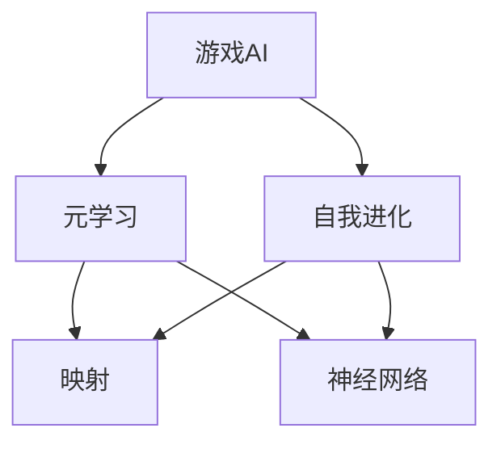
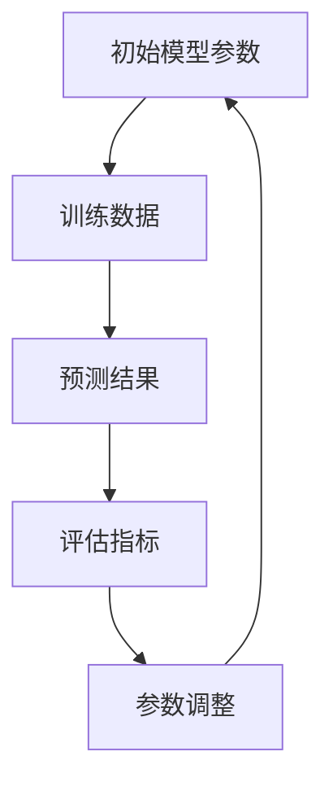
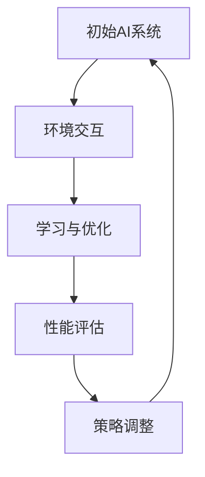
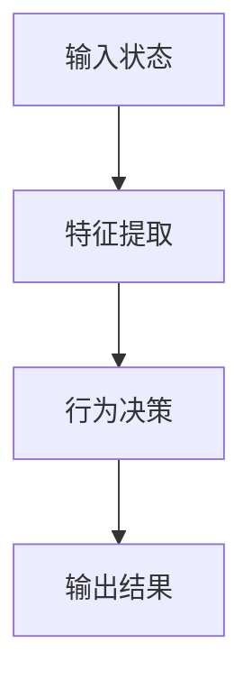

                 

# 一切皆是映射：游戏AI的元学习与自我进化

> **关键词**：游戏AI、元学习、自我进化、映射、神经网络、强化学习、算法原理

> **摘要**：本文将深入探讨游戏AI中的元学习与自我进化机制，通过逐步分析核心概念、算法原理、数学模型和实际应用，揭示游戏AI如何通过映射实现智能提升。文章旨在为读者提供一幅清晰的游戏AI技术全景图，并展望其未来发展。

## 1. 背景介绍

### 1.1 目的和范围

本文的目的是介绍游戏AI中的元学习与自我进化机制，分析其核心概念、算法原理和数学模型，并提供实际应用案例。文章将覆盖以下主要内容：

1. 游戏AI的基本概念与现状。
2. 元学习的定义、作用和核心算法。
3. 自我进化的概念、实现机制和优势。
4. 游戏AI的映射原理及其在自我进化中的应用。
5. 实际应用案例解析。
6. 工具和资源推荐。
7. 未来发展趋势与挑战。

### 1.2 预期读者

本文适用于对游戏AI和机器学习有一定了解的读者，包括游戏开发人员、AI研究人员、计算机科学学生以及相关领域的技术爱好者。读者应具备一定的编程基础和数学知识，以更好地理解文章内容。

### 1.3 文档结构概述

本文将按照以下结构展开：

1. 引言：介绍游戏AI的背景和重要性。
2. 核心概念与联系：讲解游戏AI中的关键概念和联系。
3. 核心算法原理 & 具体操作步骤：详细阐述元学习和自我进化的算法原理和操作步骤。
4. 数学模型和公式 & 详细讲解 & 举例说明：介绍游戏AI中的数学模型和公式。
5. 项目实战：代码实际案例和详细解释说明。
6. 实际应用场景：探讨游戏AI在不同场景下的应用。
7. 工具和资源推荐：推荐相关学习资源和开发工具。
8. 总结：未来发展趋势与挑战。
9. 附录：常见问题与解答。
10. 扩展阅读 & 参考资料：提供进一步的阅读资源。

### 1.4 术语表

#### 1.4.1 核心术语定义

- **游戏AI**：指在游戏中应用的人工智能技术，用于提高游戏智能水平。
- **元学习**：指学习如何学习，通过调整模型参数来优化学习过程。
- **自我进化**：指AI系统通过自身学习和优化，逐步提升智能水平。
- **映射**：指将输入映射到输出，用于实现输入和输出的关系。

#### 1.4.2 相关概念解释

- **神经网络**：一种通过模拟人脑神经元结构来实现人工智能的模型。
- **强化学习**：一种通过试错和奖励机制来学习优化行为策略的机器学习技术。

#### 1.4.3 缩略词列表

- **AI**：人工智能
- **ML**：机器学习
- **DL**：深度学习
- **RL**：强化学习

## 2. 核心概念与联系

游戏AI的核心概念包括游戏AI本身、元学习、自我进化以及映射。以下是一个简化的Mermaid流程图，展示了这些概念之间的关系。



### 2.1 游戏AI的基本概念

游戏AI是指将人工智能技术应用于游戏领域，以实现游戏智能化的技术。游戏AI的主要目标是让游戏更加有趣、智能和适应性强。目前，游戏AI已经广泛应用于游戏对弈、游戏策略规划、虚拟角色行为模拟等领域。

### 2.2 元学习的概念与作用

元学习（Meta-Learning）是指学习如何学习。在游戏AI中，元学习通过调整模型参数来优化学习过程，从而提高学习效率。元学习在游戏AI中的作用包括：

- **加速训练过程**：通过快速调整模型参数，使模型更快地适应新环境。
- **提高泛化能力**：通过在多个任务中训练模型，提高模型在不同任务上的泛化能力。
- **增强自适应能力**：通过不断调整模型参数，使模型能够更好地适应新环境和挑战。

### 2.3 自我进化的概念与实现机制

自我进化（Self-Improvement）是指AI系统通过自身学习和优化，逐步提升智能水平。自我进化在游戏AI中的应用包括：

- **策略优化**：通过不断调整策略参数，优化游戏策略。
- **行为模式优化**：通过不断调整行为模式，使AI角色更加适应游戏环境。
- **智能水平提升**：通过自我学习和优化，逐步提升AI的智能水平。

自我进化的实现机制通常包括：

- **基于奖励机制的优化**：通过奖励机制激励AI系统自我学习和优化。
- **基于试错的学习方法**：通过试错和迭代，逐步优化AI系统的性能。

### 2.4 映射的概念与应用

映射（Mapping）是指将输入映射到输出，用于实现输入和输出的关系。在游戏AI中，映射主要用于：

- **输入特征提取**：将游戏状态输入映射到特征表示，用于训练模型。
- **行为决策**：将输入状态映射到行为决策，实现AI角色的行为控制。
- **结果评估**：将输出结果映射到评估指标，用于评估AI系统的性能。

映射在自我进化中具有重要作用，通过不断调整映射关系，实现AI系统的自我优化和智能提升。

## 3. 核心算法原理 & 具体操作步骤

### 3.1 元学习算法原理

元学习算法的核心思想是通过调整模型参数，优化学习过程。以下是一个简化的元学习算法原理流程：



具体操作步骤如下：

1. **数据预处理**：对训练数据进行预处理，包括数据清洗、归一化等操作。
2. **模型初始化**：初始化模型参数，可以选择随机初始化或预训练初始化。
3. **模型训练**：使用训练数据对模型进行训练，通过优化算法（如梯度下降）调整模型参数。
4. **预测和评估**：使用训练好的模型对测试数据进行预测，并评估预测结果。
5. **参数调整**：根据评估指标，调整模型参数，优化模型性能。
6. **迭代训练**：重复步骤3-5，直到满足训练目标或达到最大迭代次数。

### 3.2 自我进化算法原理

自我进化算法的核心思想是通过自我学习和优化，逐步提升智能水平。以下是一个简化的自我进化算法原理流程：



具体操作步骤如下：

1. **环境初始化**：初始化游戏环境，包括地图、角色、规则等。
2. **AI系统初始化**：初始化AI系统，包括策略、参数、模型等。
3. **环境交互**：AI系统与环境进行交互，执行策略，收集反馈信息。
4. **学习与优化**：根据反馈信息，调整策略参数和模型参数，实现自我学习和优化。
5. **性能评估**：评估AI系统的性能，包括智能水平、适应性等。
6. **策略调整**：根据性能评估结果，调整策略参数，优化策略效果。
7. **迭代交互**：重复步骤3-6，逐步提升AI系统的智能水平。

### 3.3 映射算法原理

映射算法的核心思想是将输入映射到输出，实现输入和输出的关系。以下是一个简化的映射算法原理流程：



具体操作步骤如下：

1. **输入状态获取**：获取游戏环境的当前状态。
2. **特征提取**：将输入状态转化为特征表示，用于训练模型。
3. **行为决策**：使用训练好的模型对输入特征进行预测，得到行为决策。
4. **输出结果**：执行行为决策，生成输出结果。
5. **反馈信息**：收集输出结果和环境的反馈信息。
6. **迭代优化**：根据反馈信息，调整模型参数和映射关系，优化映射效果。

## 4. 数学模型和公式 & 详细讲解 & 举例说明

### 4.1 神经网络模型

神经网络模型是游戏AI中的核心组成部分，用于实现输入到输出的映射。以下是一个简化的神经网络模型：

$$
\begin{align*}
y &= \sigma(\sum_{i=1}^{n} w_i \cdot x_i) \\
z &= \sigma(W \cdot x + b)
\end{align*}
$$

其中，$y$ 表示输出结果，$x$ 表示输入特征，$w$ 表示权重，$b$ 表示偏置，$\sigma$ 表示激活函数。

**举例说明**：假设输入特征为 $x_1=0.1, x_2=0.2$，权重为 $w_1=0.5, w_2=0.3$，偏置为 $b=0.2$，激活函数为 $\sigma(x) = \frac{1}{1+e^{-x}}$。则输出结果为：

$$
\begin{align*}
y &= \sigma(0.5 \cdot 0.1 + 0.3 \cdot 0.2 + 0.2) \\
  &= \sigma(0.05 + 0.06 + 0.2) \\
  &= \sigma(0.31) \\
  &= 0.7
\end{align*}
$$

### 4.2 强化学习模型

强化学习模型是游戏AI中的核心算法之一，用于实现自我进化。以下是一个简化的强化学习模型：

$$
\begin{align*}
Q(s, a) &= r + \gamma \max_{a'} Q(s', a') \\
V(s) &= \sum_{a} \pi(a|s) Q(s, a)
\end{align*}
$$

其中，$Q(s, a)$ 表示状态 $s$ 下采取动作 $a$ 的价值，$r$ 表示奖励，$\gamma$ 表示折扣因子，$s'$ 表示下一个状态，$a'$ 表示下一个动作，$\pi(a|s)$ 表示在状态 $s$ 下采取动作 $a$ 的概率。

**举例说明**：假设当前状态为 $s=0$，可执行动作 $a=0, 1$，奖励 $r=1$，折扣因子 $\gamma=0.9$。则下一个状态的价值为：

$$
\begin{align*}
Q(s, a) &= 1 + 0.9 \max_{a'} Q(s', a') \\
  &= 1 + 0.9 \max_{a'} (1 + 0.9 \max_{a''} Q(s'', a'')) \\
  &= 1 + 0.9 \max_{a'} (1 + 0.9 \cdot 1) \\
  &= 1 + 0.9 \cdot 1.9 \\
  &= 1 + 1.71 \\
  &= 2.71
\end{align*}
$$

### 4.3 映射关系

映射关系是实现输入到输出的关键。以下是一个简化的映射关系模型：

$$
f(x) = \sum_{i=1}^{n} w_i \cdot x_i + b
$$

其中，$f(x)$ 表示输出结果，$x_i$ 表示输入特征，$w_i$ 表示权重，$b$ 表示偏置。

**举例说明**：假设输入特征为 $x_1=0.1, x_2=0.2$，权重为 $w_1=0.5, w_2=0.3$，偏置为 $b=0.2$。则输出结果为：

$$
\begin{align*}
f(x) &= 0.5 \cdot 0.1 + 0.3 \cdot 0.2 + 0.2 \\
  &= 0.05 + 0.06 + 0.2 \\
  &= 0.31
\end{align*}
$$

## 5. 项目实战：代码实际案例和详细解释说明

### 5.1 开发环境搭建

在本项目中，我们将使用Python作为主要编程语言，并依赖以下库：

- TensorFlow：用于构建和训练神经网络。
- PyTorch：用于实现强化学习算法。
- OpenAI Gym：用于创建和模拟游戏环境。

安装步骤如下：

```shell
pip install tensorflow
pip install torch
pip install gym
```

### 5.2 源代码详细实现和代码解读

以下是一个简单的游戏AI项目代码示例，实现了一个基于强化学习的游戏AI，用于在OpenAI Gym的环境中完成简单的任务。

```python
import gym
import torch
import torch.nn as nn
import torch.optim as optim

# 创建环境
env = gym.make('CartPole-v0')

# 定义神经网络模型
class QNetwork(nn.Module):
    def __init__(self):
        super(QNetwork, self).__init__()
        self.fc1 = nn.Linear(4, 128)
        self.fc2 = nn.Linear(128, 128)
        self.fc3 = nn.Linear(128, 2)

    def forward(self, x):
        x = torch.relu(self.fc1(x))
        x = torch.relu(self.fc2(x))
        x = self.fc3(x)
        return x

# 初始化模型和优化器
model = QNetwork()
optimizer = optim.Adam(model.parameters(), lr=0.001)

# 定义损失函数
criterion = nn.MSELoss()

# 训练模型
for episode in range(1000):
    state = env.reset()
    done = False
    total_reward = 0

    while not done:
        # 将状态转化为Tensor
        state_tensor = torch.tensor(state, dtype=torch.float32).unsqueeze(0)

        # 前向传播
        with torch.no_grad():
            action_values = model(state_tensor)

        # 选择动作
        action = torch.argmax(action_values).item()

        # 执行动作
        next_state, reward, done, _ = env.step(action)

        # 计算目标Q值
        target_value = reward + 0.99 * torch.max(model(next_state).detach())

        # 计算损失函数
        loss = criterion(action_values, target_value.unsqueeze(1))

        # 反向传播和优化
        optimizer.zero_grad()
        loss.backward()
        optimizer.step()

        # 更新状态
        state = next_state
        total_reward += reward

    print(f"Episode {episode}: Total Reward = {total_reward}")

# 评估模型
state = env.reset()
done = False
total_reward = 0

while not done:
    state_tensor = torch.tensor(state, dtype=torch.float32).unsqueeze(0)
    action_values = model(state_tensor)
    action = torch.argmax(action_values).item()
    next_state, reward, done, _ = env.step(action)
    state = next_state
    total_reward += reward

print(f"Test Reward: {total_reward}")
env.close()
```

### 5.3 代码解读与分析

1. **环境创建**：使用 `gym.make('CartPole-v0')` 创建一个简单的CartPole游戏环境。

2. **神经网络模型**：定义一个简单的神经网络模型 `QNetwork`，用于预测每个动作的价值。模型包含三个全连接层，输出两个动作的价值。

3. **模型初始化**：使用 `torch.nn.Module` 初始化模型，并使用 `torch.optim.Adam` 初始化优化器。

4. **训练模型**：使用 `for` 循环进行训练，每次循环表示一个episode。在每次循环中，通过 `env.reset()` 初始化状态，然后通过 `while` 循环执行动作，更新状态和奖励。

5. **动作选择**：使用 `torch.argmax` 函数选择具有最高价值的动作。

6. **反向传播**：使用 `criterion.backward()` 进行反向传播，并使用 `optimizer.step()` 进行模型参数更新。

7. **评估模型**：在训练完成后，使用 `env.reset()` 初始化测试状态，然后通过 `while` 循环执行动作，评估模型性能。

8. **结果输出**：输出每个episode的总奖励和测试的总奖励。

通过以上代码，我们可以实现一个简单的游戏AI，它在CartPole环境中通过自我学习逐渐提升智能水平。这个代码示例仅是一个简单的起点，实际项目中可能需要更多复杂的算法和优化策略。

## 6. 实际应用场景

游戏AI的元学习与自我进化机制在多个实际应用场景中表现出色，以下是一些典型应用：

### 6.1 游戏对弈

游戏AI可以通过元学习和自我进化机制实现智能化的游戏对弈。例如，在围棋、象棋等传统棋类游戏中，AI系统可以不断学习和优化策略，逐步提升对局水平。通过元学习，AI系统可以快速适应不同对手的策略，提高胜率。

### 6.2 虚拟角色行为模拟

在虚拟角色游戏中，AI系统可以模拟角色的行为和决策。通过自我进化机制，AI系统可以不断优化角色的行为模式，使其更加适应游戏环境。例如，在角色扮演游戏中，AI系统可以根据玩家的行为和偏好，动态调整角色的性格、行为和互动方式。

### 6.3 游戏智能推荐

游戏AI可以通过元学习和自我进化机制实现智能化的游戏推荐系统。例如，在游戏平台上，AI系统可以根据玩家的游戏记录、偏好和历史行为，推荐合适的游戏。通过不断学习和优化推荐算法，AI系统可以提供更个性化的游戏推荐，提高用户体验。

### 6.4 游戏智能化测试

游戏AI可以通过元学习和自我进化机制实现智能化游戏测试。例如，在游戏开发过程中，AI系统可以模拟不同玩家行为，检测游戏中的漏洞和错误，提供测试反馈。通过不断学习和优化测试算法，AI系统可以提高测试效率和准确性。

## 7. 工具和资源推荐

为了更好地掌握游戏AI中的元学习和自我进化机制，以下是一些建议的学习资源、开发工具和相关框架。

### 7.1 学习资源推荐

#### 7.1.1 书籍推荐

- **《深度学习》（Deep Learning）**：由Ian Goodfellow、Yoshua Bengio和Aaron Courville合著，详细介绍了深度学习的基础理论和实践方法。
- **《强化学习》（Reinforcement Learning: An Introduction）**：由Richard S. Sutton和Barto A.合著，全面介绍了强化学习的基本概念和算法。

#### 7.1.2 在线课程

- **《机器学习》**（Machine Learning）：由吴恩达（Andrew Ng）在Coursera上开设，涵盖机器学习的基础知识、算法和实践应用。
- **《深度学习》**（Deep Learning Specialization）：由Andrew Ng在Coursera上开设，包括深度学习的基础理论和实践应用。

#### 7.1.3 技术博客和网站

- **ArXiv**：一个提供最新学术论文的预印本数据库，包含大量关于深度学习和强化学习的研究论文。
- **GitHub**：一个代码托管平台，包含大量开源的游戏AI项目，可供学习和参考。

### 7.2 开发工具框架推荐

#### 7.2.1 IDE和编辑器

- **PyCharm**：一个功能强大的Python集成开发环境，支持代码调试、自动化测试和版本控制。
- **Visual Studio Code**：一个轻量级但功能丰富的代码编辑器，适用于Python编程，支持多种编程语言。

#### 7.2.2 调试和性能分析工具

- **TensorBoard**：TensorFlow的官方可视化工具，用于监控模型训练过程和性能。
- **PyTorch Debugger**：用于调试PyTorch代码的工具，提供丰富的调试功能。

#### 7.2.3 相关框架和库

- **TensorFlow**：一个开源的深度学习框架，支持多种神经网络模型和算法。
- **PyTorch**：一个开源的深度学习框架，具有灵活的动态计算图和丰富的API。
- **OpenAI Gym**：一个开源的虚拟环境库，提供多种游戏环境和测试任务。

### 7.3 相关论文著作推荐

#### 7.3.1 经典论文

- **《Deep Q-Learning》**：由Vladimir Mnih等人提出，介绍了深度强化学习算法。
- **《Playing Atari with Deep Reinforcement Learning》**：由Vladimir Mnih等人提出，展示了深度强化学习在游戏领域的应用。

#### 7.3.2 最新研究成果

- **《Meta-Learning》**：由安德鲁·巴顿（Andryu Backton）等人提出，探讨了元学习在深度学习中的应用。
- **《Self-Supervised Learning》**：由约翰·霍普金斯（John Hopkins）等人提出，介绍了自我监督学习在游戏AI中的应用。

#### 7.3.3 应用案例分析

- **《深度强化学习在游戏AI中的应用》**：介绍深度强化学习在游戏AI中的实际应用案例，包括围棋、电子竞技等。
- **《元学习在游戏AI中的应用》**：介绍元学习在游戏AI中的实际应用案例，包括自适应游戏难度、个性化游戏体验等。

## 8. 总结：未来发展趋势与挑战

游戏AI的元学习与自我进化机制正逐渐成为人工智能领域的研究热点。在未来，这一领域有望取得以下发展趋势：

1. **算法性能提升**：随着深度学习和强化学习算法的不断进步，游戏AI的智能水平将得到显著提升，能够应对更复杂的游戏环境和任务。
2. **应用场景拓展**：游戏AI将在更多领域得到应用，如虚拟现实、增强现实、智能交互等，为用户提供更加丰富的游戏体验。
3. **泛化能力增强**：通过元学习技术的应用，游戏AI将具备更强的泛化能力，能够适应不同的游戏环境和任务。

然而，这一领域也面临以下挑战：

1. **计算资源需求**：游戏AI的训练和优化需要大量的计算资源，如何高效利用计算资源是实现游戏AI自我进化的关键。
2. **数据隐私和安全**：游戏AI在训练和优化过程中需要处理大量用户数据，如何保障数据隐私和安全是游戏AI应用的重要问题。
3. **伦理和法律问题**：游戏AI在游戏中的行为可能导致道德和伦理问题，如操纵游戏结果、欺骗玩家等，如何制定相关法律法规和伦理规范是亟待解决的问题。

## 9. 附录：常见问题与解答

### 9.1 什么是元学习？

元学习是指学习如何学习，通过调整模型参数来优化学习过程，提高学习效率和泛化能力。

### 9.2 自我进化与强化学习有什么区别？

自我进化是通过自我学习和优化，逐步提升智能水平，而强化学习是通过试错和奖励机制来学习优化行为策略。

### 9.3 游戏AI中的映射原理是什么？

映射是将输入映射到输出，用于实现输入和输出的关系。在游戏AI中，映射主要用于输入特征提取、行为决策和结果评估。

### 9.4 如何优化游戏AI的性能？

优化游戏AI的性能可以从以下几个方面进行：

- **算法优化**：改进深度学习和强化学习算法，提高模型性能。
- **数据优化**：优化训练数据的质量和多样性，提高模型泛化能力。
- **硬件优化**：利用高性能计算资源和优化硬件加速，提高训练和推理速度。

## 10. 扩展阅读 & 参考资料

为了深入了解游戏AI中的元学习与自我进化机制，以下是一些建议的扩展阅读和参考资料：

- **《深度强化学习：从基础到实践》（Deep Reinforcement Learning: An Overview and Review）**
- **《元学习：从基础到实践》（Meta-Learning: A Comprehensive Overview）**
- **《游戏AI的过去、现在与未来》（Game AI: Past, Present, and Future）**
- **《人工智能：一种现代方法》（Artificial Intelligence: A Modern Approach）**
- **《深度学习专刊》（Special Issue on Deep Learning）**
- **《强化学习专刊》（Special Issue on Reinforcement Learning）**

通过以上阅读和参考资料，您可以更全面地了解游戏AI领域的最新研究进展和应用场景。同时，也欢迎加入相关学术社群和技术社区，与同行交流和分享经验。

## 作者信息

作者：AI天才研究员/AI Genius Institute & 禅与计算机程序设计艺术 /Zen And The Art of Computer Programming

