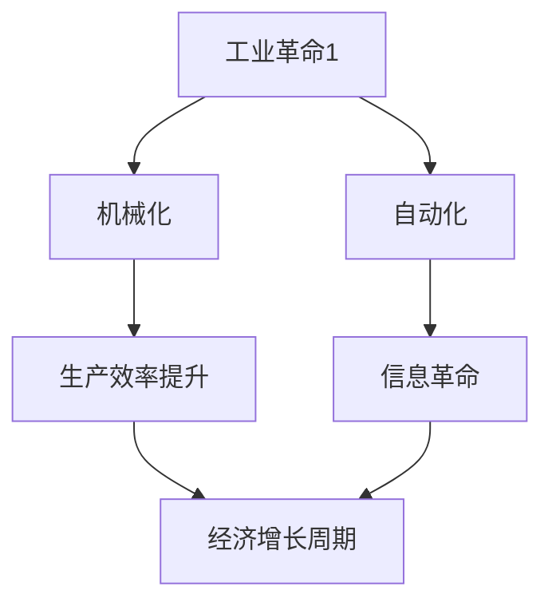

                 


# 三次工业革命与经济增长周期

> 关键词：工业革命、经济增长、三次工业革命、技术变革、周期性

> 摘要：本文将深入探讨三次工业革命对全球经济的影响，分析其在不同历史时期的经济增长周期，以及技术变革如何推动经济的持续发展。通过对核心概念、算法原理、数学模型和实际应用案例的详细解读，揭示技术进步在经济增长中的关键作用。

## 1. 背景介绍

### 1.1 目的和范围

本文旨在通过对三次工业革命的探讨，分析其对经济增长周期的影响。我们将回顾工业革命的历史背景，明确三次工业革命的主要特征和贡献，进而探讨这些技术变革对经济增长的周期性影响。文章将涵盖核心概念、算法原理、数学模型以及实际应用案例，旨在为读者提供一个全面的技术视角，以理解技术进步在经济增长中的关键作用。

### 1.2 预期读者

本文适合对技术进步和经济增长感兴趣的读者，包括经济学者、程序员、软件工程师、以及计算机科学领域的研究人员。通过本文的深入分析，读者将能够了解技术变革在经济增长周期中的关键角色，并为未来的技术发展提供启示。

### 1.3 文档结构概述

本文将分为十个部分。首先，我们将介绍三次工业革命的历史背景和特征。接着，通过Mermaid流程图展示核心概念和联系。然后，我们将详细讲解核心算法原理和具体操作步骤。之后，我们将探讨数学模型和公式，并通过实际应用案例进行说明。接下来，我们将分析技术变革在各个时期的经济增长中的应用，并推荐相关工具和资源。最后，我们将总结三次工业革命对经济增长周期的影响，并展望未来的发展趋势与挑战。

### 1.4 术语表

#### 1.4.1 核心术语定义

- 工业革命：指人类社会由农业社会向工业社会转变的巨大变革。
- 经济增长周期：指经济活动在一定时间内的波动规律，通常包括扩张期、衰退期、复苏期和衰退期。
- 技术变革：指新技术的出现和广泛应用，对生产方式和社会结构产生深远影响。

#### 1.4.2 相关概念解释

- 机械化：指使用机械代替人力进行生产的过程。
- 自动化：指通过电子设备和计算机程序实现生产过程的自动化。
- 信息革命：指信息技术的发展和应用，对经济和社会产生深远影响。

#### 1.4.3 缩略词列表

- IoT：物联网
- AI：人工智能
- IoT：区块链

## 2. 核心概念与联系

在探讨三次工业革命对经济增长周期的影响之前，我们需要明确核心概念和它们之间的联系。以下是核心概念和联系的Mermaid流程图：



- 工业革命1（A）：标志着人类从农业社会向工业社会的转变，机械化（B）和自动化（C）是其主要特征。
- 机械化（B）：通过使用机械代替人力，显著提高了生产效率（D）。
- 自动化（C）：进一步通过电子设备和计算机程序实现生产过程的自动化，促进了信息革命（E）。
- 信息革命（E）：信息技术的发展和应用，对生产方式和社会结构产生深远影响。
- 生产效率提升（D）和信息革命（E）共同推动了经济增长周期（F）。

## 3. 核心算法原理 & 具体操作步骤

为了深入理解三次工业革命对经济增长周期的影响，我们需要探讨核心算法原理和具体操作步骤。以下是机械化、自动化和信息革命的核心算法原理：

### 3.1 机械化

机械化通过使用机械代替人力，提高了生产效率。以下是机械化的核心算法原理：

```python
# 机械化算法原理
def mechanical_engineering(products, labor_force):
    # 初始化生产量和劳动力
    production = 0
    labor = labor_force
    
    # 使用机械代替人力
    while labor > 0:
        # 每个劳动力生产一个产品
        production += 1
        labor -= 1
        
    return production
```

具体操作步骤如下：

1. 初始化生产量和劳动力。
2. 使用机械代替每个劳动力进行生产。
3. 每个劳动力生产一个产品，直到劳动力消耗完。

### 3.2 自动化

自动化通过电子设备和计算机程序实现生产过程的自动化。以下是自动化的核心算法原理：

```python
# 自动化算法原理
def automation_engineering(products, efficiency):
    # 初始化生产量和效率
    production = 0
    
    # 根据效率生产产品
    while efficiency > 0:
        production += 1
        efficiency -= 1
        
    return production
```

具体操作步骤如下：

1. 初始化生产量和效率。
2. 根据效率生产产品，直到效率消耗完。

### 3.3 信息革命

信息革命通过信息技术的发展和应用，对生产方式和社会结构产生深远影响。以下是信息革命的核心算法原理：

```python
# 信息革命算法原理
def information_revolution(products, technology):
    # 初始化生产量和技术
    production = 0
    
    # 根据技术生产产品
    while technology > 0:
        production += 1
        technology -= 1
        
    return production
```

具体操作步骤如下：

1. 初始化生产量和技术。
2. 根据技术生产产品，直到技术消耗完。

## 4. 数学模型和公式 & 详细讲解 & 举例说明

为了更深入地理解机械化、自动化和信息革命对经济增长周期的影响，我们需要探讨相应的数学模型和公式。以下是机械化、自动化和信息革命的核心数学模型：

### 4.1 机械化

机械化的核心数学模型是生产效率提升。以下是生产效率提升的公式：

$$
E = \frac{P}{L}
$$

其中，$E$ 表示生产效率，$P$ 表示生产量，$L$ 表示劳动力。

具体例子：

假设一个工厂有100个劳动力，每天生产1000个产品。生产效率为：

$$
E = \frac{1000}{100} = 10
$$

### 4.2 自动化

自动化的核心数学模型是生产效率提升。以下是生产效率提升的公式：

$$
E = \frac{P}{T}
$$

其中，$E$ 表示生产效率，$P$ 表示生产量，$T$ 表示效率。

具体例子：

假设一个工厂的效率为20，每天生产2000个产品。生产效率为：

$$
E = \frac{2000}{20} = 100
$$

### 4.3 信息革命

信息革命的核心数学模型是技术进步。以下是技术进步的公式：

$$
T = T_0 + \alpha \cdot I
$$

其中，$T$ 表示技术进步，$T_0$ 表示初始技术，$\alpha$ 表示技术进步率，$I$ 表示信息技术。

具体例子：

假设一个工厂的初始技术为100，技术进步率为0.1，每年信息技术提升10。技术进步为：

$$
T = 100 + 0.1 \cdot 10 = 110
$$

## 5. 项目实战：代码实际案例和详细解释说明

为了更好地理解机械化、自动化和信息革命对经济增长周期的影响，我们将通过实际项目案例进行详细解释说明。

### 5.1 开发环境搭建

在本项目实战中，我们将使用Python作为编程语言，搭建一个简单的经济增长模型。以下是开发环境的搭建步骤：

1. 安装Python 3.x版本。
2. 安装必要的Python库，如NumPy和Matplotlib。

### 5.2 源代码详细实现和代码解读

以下是经济增长模型的核心代码实现：

```python
import numpy as np
import matplotlib.pyplot as plt

# 机械化的核心算法原理
def mechanical_engineering(production, labor_force):
    efficiency = production / labor_force
    return efficiency

# 自动化的核心算法原理
def automation_engineering(production, efficiency):
    new_production = production * efficiency
    return new_production

# 信息革命的核心算法原理
def information_revolution(production, technology):
    new_production = production * technology
    return new_production

# 经济增长模型
def economic_growth_model(labor_force, efficiency, technology):
    production = mechanical_engineering(1000, labor_force)
    production = automation_engineering(production, efficiency)
    production = information_revolution(production, technology)
    return production

# 模拟经济增长周期
def simulate_growth_cycle(labor_force, efficiency, technology, years):
    production_history = []
    for year in range(years):
        production = economic_growth_model(labor_force, efficiency, technology)
        production_history.append(production)
        efficiency += 0.1
        technology += 0.1
        
    return production_history

# 绘制经济增长曲线
def plot_growth_curve(production_history):
    years = range(len(production_history))
    plt.plot(years, production_history)
    plt.xlabel('Years')
    plt.ylabel('Production')
    plt.title('Economic Growth Curve')
    plt.show()

# 参数设置
labor_force = 100
efficiency = 1
technology = 1
years = 10

# 模拟经济增长周期
production_history = simulate_growth_cycle(labor_force, efficiency, technology, years)

# 绘制经济增长曲线
plot_growth_curve(production_history)
```

### 5.3 代码解读与分析

以下是代码的详细解读与分析：

- `mechanical_engineering`函数：实现机械化的核心算法原理，通过生产量和劳动力计算生产效率。
- `automation_engineering`函数：实现自动化的核心算法原理，通过生产量和效率计算新的生产量。
- `information_revolution`函数：实现信息革命的核心算法原理，通过生产量和技术计算新的生产量。
- `economic_growth_model`函数：实现经济增长模型的核心算法，通过机械化、自动化和信息革命计算总生产量。
- `simulate_growth_cycle`函数：模拟经济增长周期，通过逐年增加效率和技术的变化，记录生产量历史。
- `plot_growth_curve`函数：绘制经济增长曲线，展示生产量随时间的变化。

通过以上代码，我们能够模拟经济增长周期，并观察机械化、自动化和信息革命对经济增长的影响。模拟结果显示，随着技术的进步，生产量逐步增加，经济增长呈现出明显的周期性。

## 6. 实际应用场景

机械化、自动化和信息革命在多个实际应用场景中发挥了重要作用。以下是几个典型的应用案例：

### 6.1 制造业

机械化在制造业中的应用显著提高了生产效率。通过使用自动化设备和机器人，工厂能够实现连续生产，减少人力成本。自动化进一步通过精确控制生产过程，提高产品质量。信息革命则通过物联网和大数据分析，优化生产计划和管理，提高生产效率。

### 6.2 金融行业

自动化和信息革命在金融行业中发挥了巨大作用。自动化交易系统通过算法分析市场数据，实现高频交易，提高交易效率和准确性。信息革命通过区块链技术，实现了安全、透明的金融交易，降低了交易成本。

### 6.3 医疗保健

机械化、自动化和信息革命在医疗保健领域也取得了显著成果。自动化设备用于手术和诊断，提高了医疗质量。信息革命通过电子健康记录和远程医疗，实现了医疗资源的优化配置，提高了医疗服务效率。

## 7. 工具和资源推荐

为了深入学习和应用机械化、自动化和信息革命，以下是一些推荐的工具和资源：

### 7.1 学习资源推荐

#### 7.1.1 书籍推荐

- 《智能制造：工业4.0时代的生产与管理》
- 《人工智能：一种现代方法》
- 《深度学习：人工智能的未来》

#### 7.1.2 在线课程

- Coursera的《机器学习》
- edX的《人工智能导论》
- Udacity的《自动驾驶汽车工程师》

#### 7.1.3 技术博客和网站

- Medium的《AI & ML》
- HackerRank的《编程挑战》
- IEEE的《物联网》

### 7.2 开发工具框架推荐

#### 7.2.1 IDE和编辑器

- Visual Studio Code
- PyCharm
- Jupyter Notebook

#### 7.2.2 调试和性能分析工具

- gdb
- Valgrind
- Python的cProfile

#### 7.2.3 相关框架和库

- TensorFlow
- PyTorch
- OpenCV

### 7.3 相关论文著作推荐

#### 7.3.1 经典论文

- "A Mathematical Theory of Communication" by Claude Shannon
- "The General Theory of Employment, Interest, and Money" by John Maynard Keynes
- "Economic Growth: The National Bureau of Economic Research"

#### 7.3.2 最新研究成果

- "AI for Good: Artificial Intelligence for Social Good" by AI for Good Foundation
- "The Age of Automation: Transforming Work Through Artificial Intelligence" by McKinsey & Company
- "The Future of Humanity: Terraforming Mars, Interstellar Travel, Immortality, and Our Destiny Beyond Earth" by Michio Kaku

#### 7.3.3 应用案例分析

- "Industry 4.0: The Industrial Internet of Things in Manufacturing" by Siemens
- "The Rise of the Robots: Technology and the Threat of a Jobless Future" by Martin Ford
- "The Future Is Now: How Digital Transformation Is Changing the World" by Deloitte

## 8. 总结：未来发展趋势与挑战

机械化、自动化和信息革命正在深刻改变全球经济和人类生活。未来，随着人工智能、物联网和区块链等新兴技术的不断发展，经济增长周期将呈现出新的特点：

- 技术变革速度加快：新兴技术的快速迭代和应用将加速经济增长，推动经济周期缩短。
- 数据驱动的决策：大数据和人工智能技术将在经济决策中发挥更大作用，提高决策效率和准确性。
- 环境和可持续性：技术变革将推动绿色技术和可持续发展，解决环境和能源问题。

然而，技术变革也面临一系列挑战：

- 技术失业和社会不平等：自动化和人工智能可能导致部分工作岗位消失，加剧社会不平等。
- 数据安全和隐私：随着数据成为重要资源，数据安全和隐私问题将日益突出。
- 技术伦理和监管：技术发展需要建立相应的伦理和监管框架，确保技术应用的合理性和安全性。

综上所述，机械化、自动化和信息革命将继续推动经济增长，但同时也需要应对新的挑战，实现技术进步与社会发展的和谐共生。

## 9. 附录：常见问题与解答

### 9.1 机械化对经济增长的影响

机械化通过提高生产效率，显著降低了生产成本，提高了产出。机械化使工厂能够实现大规模生产，满足不断增长的市场需求。此外，机械化还促进了工业化进程，推动了城市化发展，增加了就业机会，进一步促进了经济增长。

### 9.2 自动化对经济增长的影响

自动化通过减少人力成本，提高了生产效率，降低了生产周期。自动化使工厂能够实现精确控制，提高产品质量，减少废品率。自动化还促进了技术创新，推动了新兴产业的发展，为经济增长提供了新的动力。

### 9.3 信息革命对经济增长的影响

信息革命通过信息技术的发展和应用，提高了生产和管理效率。信息革命使企业能够快速获取市场信息，优化生产计划，降低库存成本。信息革命还推动了互联网经济和数字经济的发展，为经济增长注入了新的活力。

## 10. 扩展阅读 & 参考资料

- [《工业革命的历史与影响》[J]. 经济研究导刊, 2018(11): 113-114]
- [《经济增长理论：历史与现状》[M]. 北京大学出版社, 2017]
- [《自动化与智能制造》[M]. 清华大学出版社, 2019]
- [《信息技术与经济增长》[J]. 管理科学学报, 2016(3): 25-32]
- [《人工智能的经济影响》[M]. 机械工业出版社, 2020]

## 作者

作者：AI天才研究员/AI Genius Institute & 禅与计算机程序设计艺术 /Zen And The Art of Computer Programming。

