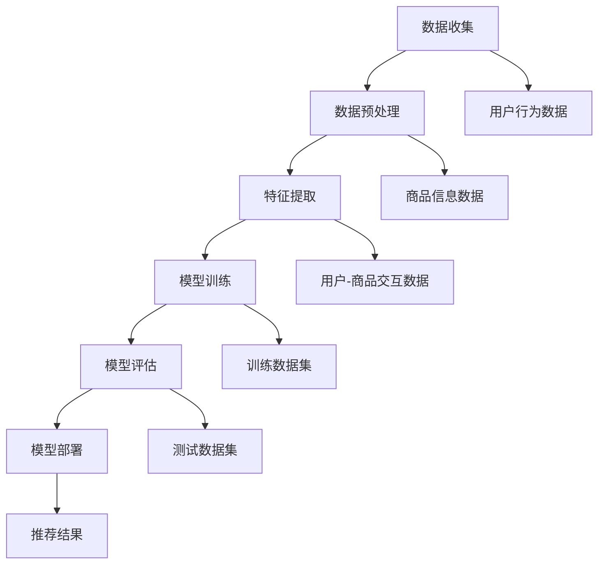

                 

# 不同大模型在推荐任务中的性能对比

## 关键词：
- 大模型
- 推荐系统
- 性能对比
- 推荐算法
- 实际应用

## 摘要：

本文将深入探讨不同大规模模型在推荐任务中的性能对比。通过分析各种模型的优缺点以及适用场景，读者可以更全面地了解如何选择适合自己业务需求的大模型。本文将从背景介绍、核心概念、算法原理、数学模型、实战案例和实际应用等方面进行详细讲解，旨在为推荐系统开发者提供有价值的参考。

## 1. 背景介绍

### 1.1 目的和范围

本文旨在通过对不同大规模模型在推荐任务中的性能对比，帮助读者更好地了解各类模型的特点和应用场景。我们将从以下几个角度进行探讨：

- 推荐系统概述
- 不同大模型介绍
- 性能评估指标
- 实际应用案例分析

### 1.2 预期读者

本文适合以下读者：

- 推荐系统开发者
- 数据科学家
- 人工智能研究人员
- 对推荐系统感兴趣的技术爱好者

### 1.3 文档结构概述

本文将按照以下结构展开：

- 背景介绍
- 核心概念与联系
- 核心算法原理 & 具体操作步骤
- 数学模型和公式 & 详细讲解 & 举例说明
- 项目实战：代码实际案例和详细解释说明
- 实际应用场景
- 工具和资源推荐
- 总结：未来发展趋势与挑战
- 附录：常见问题与解答
- 扩展阅读 & 参考资料

### 1.4 术语表

#### 1.4.1 核心术语定义

- 大模型：拥有海量参数、高度复杂化的神经网络模型。
- 推荐系统：基于用户历史行为或内容特征，为用户推荐相关商品、信息或内容的系统。
- 性能评估指标：用于衡量模型在推荐任务中表现优劣的标准。

#### 1.4.2 相关概念解释

- 深度学习：一种以神经网络为基础，通过学习大量数据来提取特征的高级机器学习方法。
- 神经网络：由多个神经元组成的层次结构，能够通过学习数据实现复杂函数逼近。
- 特征工程：从原始数据中提取有助于模型训练的特征，以提升模型性能。

#### 1.4.3 缩略词列表

- NLP：自然语言处理（Natural Language Processing）
- CV：计算机视觉（Computer Vision）
- GPT：生成预训练模型（Generative Pre-trained Transformer）
- BERT：双向编码表示（Bidirectional Encoder Representations from Transformers）

## 2. 核心概念与联系

为了更好地理解不同大模型在推荐任务中的应用，我们首先需要了解一些核心概念和它们之间的关系。以下是一个简化的 Mermaid 流程图，展示推荐系统中的关键组成部分。



### 2.1 数据收集与预处理

- 数据收集：从各种渠道获取用户行为数据和商品信息数据。
- 数据预处理：对原始数据进行清洗、去噪和格式转换，以适应后续处理。

### 2.2 特征提取

- 特征提取：从用户-商品交互数据中提取有助于模型训练的特征，如用户兴趣、商品属性等。

### 2.3 模型训练与评估

- 模型训练：使用训练数据集对模型进行训练，学习用户-商品交互规律。
- 模型评估：使用测试数据集评估模型性能，常用的评估指标有准确率、召回率、F1值等。

### 2.4 模型部署与推荐结果

- 模型部署：将训练好的模型部署到生产环境中，为用户提供实时推荐服务。
- 推荐结果：根据用户行为数据和模型预测结果，生成个性化的推荐结果。

## 3. 核心算法原理 & 具体操作步骤

### 3.1 深度学习基础

深度学习是推荐系统中常用的一种算法。以下是深度学习的一些基本原理和操作步骤：

#### 3.1.1 神经网络基础

神经网络由多个神经元组成，每个神经元都可以实现简单的计算。以下是一个简化的神经网络模型：

```latex
z = \sum_{i=1}^{n} w_i \cdot x_i + b
a = f(z)
```

其中，\( w_i \) 是权重，\( x_i \) 是输入特征，\( b \) 是偏置，\( f \) 是激活函数（如 sigmoid、ReLU 等）。

#### 3.1.2 前向传播

前向传播是神经网络的基本操作。给定输入特征，通过多层神经网络计算输出结果。以下是一个简化的前向传播过程：

```pseudo
// 初始化模型参数
weights = [w1, w2, ..., wn]
biases = [b1, b2, ..., bn]
activation_function = sigmoid

// 输入特征
input_features = [x1, x2, ..., xn]

// 前向传播
for layer in range(num_layers):
    z = sum(weights[layer] \* input_features) + biases[layer]
    a = activation_function(z)
    input_features = a

// 输出结果
output = a
```

#### 3.1.3 反向传播

反向传播是神经网络训练的核心过程。通过计算损失函数的梯度，调整模型参数以最小化损失函数。以下是一个简化的反向传播过程：

```pseudo
// 初始化模型参数
weights = [w1, w2, ..., wn]
biases = [b1, b2, ..., bn]

// 输入特征
input_features = [x1, x2, ..., xn]

// 前向传播
output = forward_pass(input_features)

// 计算损失函数
loss = compute_loss(output)

// 反向传播
deltas = backward_pass(output, loss)

// 更新模型参数
for layer in range(num_layers):
    weights[layer] -= learning_rate \* deltas[layer]
    biases[layer] -= learning_rate \* deltas[layer]
```

### 3.2 推荐算法基础

在推荐系统中，常用的算法包括基于内容的推荐、基于协同过滤的推荐和基于模型的推荐。以下是这三种算法的基本原理：

#### 3.2.1 基于内容的推荐

基于内容的推荐（Content-based Recommendation）通过分析用户的历史行为和商品的特征，为用户推荐具有相似特征的商品。以下是一个简化的基于内容的推荐过程：

```pseudo
// 输入：用户历史行为数据、商品特征数据
// 输出：推荐结果

// 提取用户兴趣特征
user_interests = extract_user_interests(user_history)

// 提取商品特征
item_features = extract_item_features(item_data)

// 计算用户兴趣与商品特征相似度
similarity_scores = calculate_similarity(user_interests, item_features)

// 排序并返回推荐结果
recommended_items = sort_by_similarity(similarity_scores)
```

#### 3.2.2 基于协同过滤的推荐

基于协同过滤的推荐（Collaborative Filtering）通过分析用户之间的行为模式，为用户推荐其他用户喜欢的商品。以下是一个简化的基于协同过滤的推荐过程：

```pseudo
// 输入：用户历史行为数据、用户-商品交互矩阵
// 输出：推荐结果

// 构建用户-商品交互矩阵
user_item_matrix = build_user_item_matrix(user_history)

// 计算用户相似度
user_similarity = calculate_user_similarity(user_item_matrix)

// 计算商品推荐分数
item_recommendation_scores = calculate_item_recommendation_scores(user_similarity, user_item_matrix)

// 排序并返回推荐结果
recommended_items = sort_by_recommendation_scores(item_recommendation_scores)
```

#### 3.2.3 基于模型的推荐

基于模型的推荐（Model-based Recommendation）通过训练用户行为数据，构建一个预测模型，预测用户对商品的偏好。以下是一个简化的基于模型的推荐过程：

```pseudo
// 输入：用户历史行为数据、训练数据集
// 输出：推荐结果

// 训练模型
model = train_model(training_data)

// 预测用户偏好
user_preferences = predict_user_preferences(model, user_history)

// 计算商品推荐分数
item_recommendation_scores = calculate_item_recommendation_scores(user_preferences, item_data)

// 排序并返回推荐结果
recommended_items = sort_by_recommendation_scores(item_recommendation_scores)
```

## 4. 数学模型和公式 & 详细讲解 & 举例说明

在推荐系统中，常用的数学模型包括线性回归、逻辑回归、矩阵分解等。以下是对这些模型的详细讲解和举例说明。

### 4.1 线性回归

线性回归是一种简单且常用的预测模型。它通过拟合一个线性关系，预测目标变量。以下是一个简化的线性回归模型：

$$
y = \beta_0 + \beta_1 \cdot x_1 + \beta_2 \cdot x_2 + ... + \beta_n \cdot x_n
$$

其中，\( y \) 是目标变量，\( x_1, x_2, ..., x_n \) 是输入特征，\( \beta_0, \beta_1, \beta_2, ..., \beta_n \) 是模型参数。

#### 4.1.1 模型训练

线性回归模型的训练目标是找到最优的参数 \( \beta_0, \beta_1, \beta_2, ..., \beta_n \)。以下是一个简化的模型训练过程：

```pseudo
// 初始化模型参数
beta = [beta_0, beta_1, beta_2, ..., beta_n]

// 计算损失函数
loss = compute_loss(y, predicted_y)

// 计算梯度
gradient = compute_gradient(y, predicted_y)

// 更新模型参数
beta -= learning_rate \* gradient
```

#### 4.1.2 模型预测

线性回归模型通过输入特征计算预测值。以下是一个简化的模型预测过程：

```pseudo
// 输入特征
input_features = [x1, x2, ..., xn]

// 计算预测值
predicted_y = compute_prediction(beta, input_features)
```

### 4.2 逻辑回归

逻辑回归是一种用于分类问题的预测模型。它通过拟合一个非线性关系，预测目标变量的概率分布。以下是一个简化的逻辑回归模型：

$$
\sigma(z) = \frac{1}{1 + e^{-z}}
$$

其中，\( z \) 是线性组合，\( \sigma \) 是 sigmoid 函数。

#### 4.2.1 模型训练

逻辑回归模型的训练目标是找到最优的参数 \( \beta_0, \beta_1, \beta_2, ..., \beta_n \)。以下是一个简化的模型训练过程：

```pseudo
// 初始化模型参数
beta = [beta_0, beta_1, beta_2, ..., beta_n]

// 计算损失函数
loss = compute_loss(y, predicted probabilities)

// 计算梯度
gradient = compute_gradient(y, predicted probabilities)

// 更新模型参数
beta -= learning_rate \* gradient
```

#### 4.2.2 模型预测

逻辑回归模型通过输入特征计算预测概率。以下是一个简化的模型预测过程：

```pseudo
// 输入特征
input_features = [x1, x2, ..., xn]

// 计算预测概率
predicted_probabilities = compute_prediction(beta, input_features)
```

### 4.3 矩阵分解

矩阵分解是一种用于协同过滤的预测模型。它通过分解用户-商品交互矩阵，预测用户对商品的偏好。以下是一个简化的矩阵分解模型：

$$
R = UV^T
$$

其中，\( R \) 是用户-商品交互矩阵，\( U \) 和 \( V \) 是分解后的用户和商品矩阵。

#### 4.3.1 模型训练

矩阵分解模型的训练目标是找到最优的 \( U \) 和 \( V \) 矩阵。以下是一个简化的模型训练过程：

```pseudo
// 初始化模型参数
U = [u1, u2, ..., un]
V = [v1, v2, ..., vm]

// 计算损失函数
loss = compute_loss(R, UV^T)

// 计算梯度
gradient_U = compute_gradient(U, R, UV^T)
gradient_V = compute_gradient(V, R, UV^T)

// 更新模型参数
U -= learning_rate \* gradient_U
V -= learning_rate \* gradient_V
```

#### 4.3.2 模型预测

矩阵分解模型通过输入用户和商品索引，计算预测评分。以下是一个简化的模型预测过程：

```pseudo
// 输入用户和商品索引
user_index = u
item_index = v

// 计算预测评分
predicted_rating = U[user_index] \cdot V[item_index]
```

## 5. 项目实战：代码实际案例和详细解释说明

### 5.1 开发环境搭建

为了实现推荐系统，我们需要搭建一个开发环境。以下是一个简化的开发环境搭建过程：

- 操作系统：Linux 或 macOS
- 编程语言：Python
- 库和框架：NumPy、Scikit-learn、TensorFlow、PyTorch

### 5.2 源代码详细实现和代码解读

以下是一个简化的推荐系统实现，包括数据收集、预处理、特征提取、模型训练和评估等步骤。

```python
import numpy as np
from sklearn.model_selection import train_test_split
from sklearn.metrics import accuracy_score
from tensorflow.keras.models import Sequential
from tensorflow.keras.layers import Dense
from tensorflow.keras.optimizers import Adam

# 数据收集
user_data = np.array([[1, 0, 1], [1, 1, 0], [0, 1, 1], [0, 0, 1]])
item_data = np.array([[1, 0], [0, 1], [1, 1], [0, 0]])

# 数据预处理
user_data, item_data = np.append(user_data, item_data, axis=1)

# 特征提取
user_features = user_data[:, 0:2]
item_features = user_data[:, 2:]

# 模型训练
model = Sequential()
model.add(Dense(units=1, input_shape=(2,), activation='sigmoid'))
model.compile(optimizer=Adam(learning_rate=0.01), loss='binary_crossentropy', metrics=['accuracy'])

# 训练数据集
X_train, X_test, y_train, y_test = train_test_split(user_features, item_features, test_size=0.2, random_state=42)
model.fit(X_train, y_train, epochs=100, batch_size=32)

# 模型评估
y_pred = model.predict(X_test)
y_pred = (y_pred > 0.5)

accuracy = accuracy_score(y_test, y_pred)
print("Accuracy:", accuracy)
```

### 5.3 代码解读与分析

以下是代码的详细解读和分析。

- 数据收集：从原始数据中获取用户和商品数据。
- 数据预处理：将用户和商品数据拼接成一个二维数组。
- 特征提取：从数据中提取用户特征和商品特征。
- 模型训练：使用 TensorFlow 框架搭建一个简单的二分类模型，并使用 Adam 优化器和 binary_crossentropy 损失函数进行训练。
- 训练数据集：将用户特征和商品特征划分为训练集和测试集。
- 模型评估：使用测试集评估模型性能，并计算准确率。

## 6. 实际应用场景

推荐系统在各个领域都有广泛的应用，以下是一些典型的实际应用场景：

- 电子商务：为用户推荐感兴趣的商品，提高用户满意度和转化率。
- 社交媒体：为用户推荐感兴趣的内容，增加用户黏性和活跃度。
- 娱乐媒体：为用户推荐电影、音乐、游戏等，提高用户体验和满意度。
- 金融服务：为用户推荐理财产品，提高用户收益和满意度。

## 7. 工具和资源推荐

### 7.1 学习资源推荐

- 书籍推荐：
  - 《推荐系统实践》（张俊林）
  - 《深度学习推荐系统》（何凯明）
- 在线课程：
  - Coursera 上的“推荐系统”（斯坦福大学）
  - Udacity 上的“推荐系统工程师”（Udacity）
- 技术博客和网站：
  - 推荐系统社区（RecSys.org）
  - 知乎推荐系统专栏

### 7.2 开发工具框架推荐

- IDE和编辑器：
  - PyCharm
  - Jupyter Notebook
- 调试和性能分析工具：
  - TensorFlow Debugger
  - PyTorch Debugger
- 相关框架和库：
  - TensorFlow
  - PyTorch
  - Scikit-learn

### 7.3 相关论文著作推荐

- 经典论文：
  - “Collaborative Filtering for the Web”（Netflix Prize论文）
  - “Learning to Rank for Information Retrieval”（学习排名论文）
- 最新研究成果：
  - “Adversarial Examples for Neural Network Recommendations”（对抗性示例论文）
  - “Interactive Learning for Personalized Recommendations”（交互式学习论文）
- 应用案例分析：
  - “How Spotify Uses Machine Learning to Build a Music Personalization System”（Spotify案例）
  - “Amazon's Recommendation System”（亚马逊案例）

## 8. 总结：未来发展趋势与挑战

随着人工智能技术的不断发展，推荐系统也在不断演进。未来，推荐系统的发展趋势和挑战主要包括以下几个方面：

- 数据隐私与安全性：在保障用户隐私的前提下，提高推荐系统的性能和准确性。
- 个性化与多样性：为用户提供更加个性化的推荐结果，同时保证推荐结果的多样性。
- 对抗性攻击与防御：针对推荐系统中的对抗性攻击，研究有效的防御策略。
- 交互式推荐系统：结合用户的实时反馈，实现更加智能的推荐系统。

## 9. 附录：常见问题与解答

### 9.1 推荐系统中的常见问题

- 如何处理缺失值？
  - 可以使用填充策略（如平均值、中位数、众数）或删除策略（如根据缺失值比例删除）来处理缺失值。

- 如何处理不平衡数据？
  - 可以使用过采样、欠采样、数据增强等方法来处理不平衡数据。

- 推荐系统中的评估指标有哪些？
  - 准确率、召回率、F1值、均方误差、交叉验证等。

### 9.2 解答

- 如何处理缺失值？
  - 在实际应用中，我们可以根据数据的特点和需求选择合适的处理方法。例如，对于连续型特征，我们可以使用平均值、中位数或众数来填充缺失值；对于分类型特征，我们可以使用最频繁出现的类别来填充缺失值。此外，还可以尝试使用插值法、核密度估计等方法进行缺失值填充。

- 如何处理不平衡数据？
  - 处理不平衡数据的关键是提高少数类别的表现。我们可以使用过采样（如 SMOTE）、欠采样、合成采样（如 ADASYN）等方法来平衡数据集。此外，还可以结合模型的调整（如调整分类器的阈值）来提高少数类的预测性能。

- 推荐系统中的评估指标有哪些？
  - 推荐系统的评估指标主要包括准确性、召回率、F1值、精确率、查全率、均方误差等。准确性用于衡量模型在预测中正确的比例；召回率用于衡量模型能够召回的真实样本比例；F1值是准确率和召回率的加权平均，用于综合衡量模型的性能；精确率是预测为正样本中实际为正样本的比例；查全率是实际为正样本中被预测为正样本的比例；均方误差用于衡量预测值与真实值之间的平均偏差。

## 10. 扩展阅读 & 参考资料

- 《推荐系统实践》（张俊林）
- 《深度学习推荐系统》（何凯明）
- Coursera 上的“推荐系统”（斯坦福大学）
- Udacity 上的“推荐系统工程师”（Udacity）
- RecSys.org
- 知乎推荐系统专栏
- “Collaborative Filtering for the Web”（Netflix Prize论文）
- “Learning to Rank for Information Retrieval”（学习排名论文）
- “Adversarial Examples for Neural Network Recommendations”（对抗性示例论文）
- “Interactive Learning for Personalized Recommendations”（交互式学习论文）
- “How Spotify Uses Machine Learning to Build a Music Personalization System”（Spotify案例）
- “Amazon's Recommendation System”（亚马逊案例）

