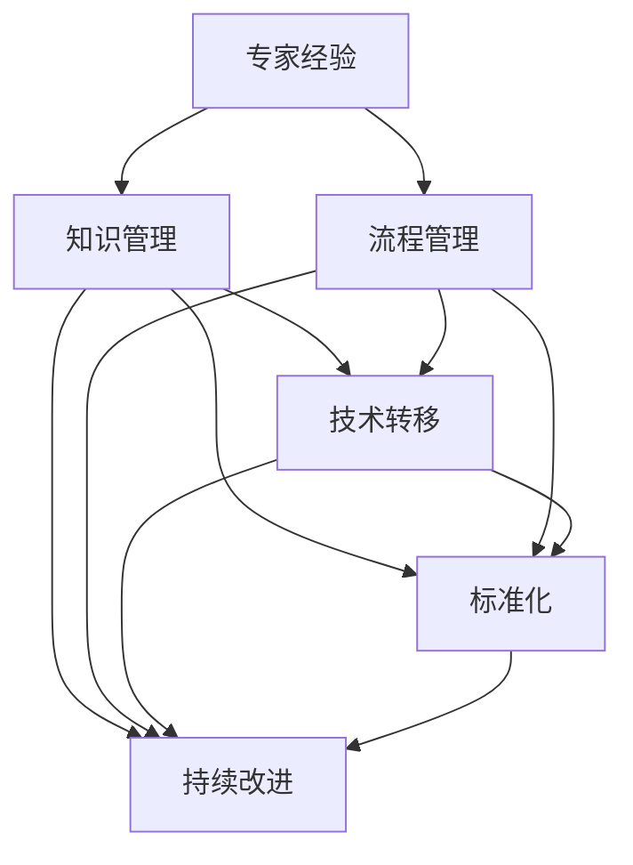

                 

# 专家经验在生产中的固化

> **关键词**：专家经验、生产固化、技术转移、标准化、持续改进

> **摘要**：本文旨在探讨如何将专家的经验和知识在生产环境中进行有效固化，以提高产品质量和效率。通过分析专家经验的关键要素、固化过程中的难点及解决方案，结合具体案例和实践，为IT行业的持续发展提供有益的借鉴。

## 1. 背景介绍

### 1.1 目的和范围

在信息技术迅猛发展的时代，专家的经验和知识对于推动技术进步和产业升级具有重要意义。然而，如何将这些宝贵的经验在生产过程中进行固化，使其能够被广泛传承和持续优化，成为一个亟待解决的问题。本文将围绕以下三个方面展开讨论：

1. **专家经验的关键要素**：分析专家经验的核心成分及其在生产中的应用价值。
2. **固化过程中的难点**：探讨在固化专家经验过程中可能遇到的挑战，如技术转移、标准化和持续改进等方面。
3. **解决方案与实践**：结合实际案例，提出有效的固化策略和实践方法。

### 1.2 预期读者

本文的预期读者主要包括：

1. IT行业的技术专家和从业者，希望了解如何将个人经验转化为可复制的生产优势。
2. 管理人员和技术负责人，关注团队的技术积累和传承。
3. 学者和研究者，对专家经验固化理论和方法有浓厚兴趣。

### 1.3 文档结构概述

本文将分为十个部分，具体结构如下：

1. **背景介绍**：介绍本文的目的、预期读者和文档结构。
2. **核心概念与联系**：阐述本文涉及的核心概念及其相互关系。
3. **核心算法原理 & 具体操作步骤**：详细讲解固化专家经验的算法原理和操作步骤。
4. **数学模型和公式 & 详细讲解 & 举例说明**：介绍相关的数学模型和公式，并通过实例进行说明。
5. **项目实战：代码实际案例和详细解释说明**：通过实际案例展示固化专家经验的具体实现过程。
6. **实际应用场景**：分析固化专家经验在不同场景下的应用效果。
7. **工具和资源推荐**：推荐相关学习资源和开发工具。
8. **总结：未来发展趋势与挑战**：探讨专家经验固化领域的未来发展趋势和面临的挑战。
9. **附录：常见问题与解答**：解答读者可能遇到的常见问题。
10. **扩展阅读 & 参考资料**：提供进一步阅读的资料和参考文献。

### 1.4 术语表

#### 1.4.1 核心术语定义

- **专家经验**：指具备丰富知识和技能的专业人士在长期实践中积累的宝贵经验。
- **生产固化**：将专家经验转化为标准化的流程、规范和工具，使其在生产环境中得到广泛应用。
- **技术转移**：将专家的经验和知识从一个环境转移到另一个环境，以便在更广泛的范围内推广应用。
- **标准化**：制定统一的标准和规范，确保专家经验在生产过程中得到一致执行。
- **持续改进**：通过对生产过程和专家经验的不断优化，提高产品质量和效率。

#### 1.4.2 相关概念解释

- **知识管理**：指组织对知识进行获取、共享、应用和创新的过程，旨在提高组织的知识水平和竞争力。
- **流程管理**：指对组织中的业务流程进行设计、执行、监控和优化，以提高业务效率和质量。
- **团队协作**：指团队成员之间通过沟通、协作和共享，共同完成项目目标的过程。

#### 1.4.3 缩略词列表

- **IT**：信息技术（Information Technology）
- **AI**：人工智能（Artificial Intelligence）
- **ML**：机器学习（Machine Learning）
- **DL**：深度学习（Deep Learning）
- **QA**：质量保证（Quality Assurance）

## 2. 核心概念与联系

为了更好地理解专家经验在生产中的固化，我们需要明确几个核心概念及其相互关系。以下是这些核心概念的定义及其相互作用的Mermaid流程图：



### 2.1 专家经验

专家经验是指专业人士在长期实践中积累的宝贵知识和技能。这些经验通常包括对特定领域深入了解、解决问题的方法论、最佳实践和高效的工作习惯。专家经验的核心在于其对实际问题的洞察力和解决能力，这些能力是提升生产效率和产品质量的关键。

### 2.2 知识管理

知识管理是指组织对知识进行获取、共享、应用和创新的过程。知识管理不仅包括知识的获取和存储，更重要的是知识的共享和应用。通过知识管理，专家经验可以系统化、结构化，并转化为可操作的资源和工具，从而在组织内部得到广泛传承和应用。

### 2.3 流程管理

流程管理是指对组织中的业务流程进行设计、执行、监控和优化，以提高业务效率和质量。流程管理能够将专家经验转化为标准化的工作流程和规范，使团队成员在执行任务时能够遵循一致的操作步骤，从而确保工作质量和效率。

### 2.4 技术转移

技术转移是指将专家的经验和知识从一个环境转移到另一个环境，以便在更广泛的范围内推广应用。技术转移的目的是将专家的经验转化为可复制的生产优势，使其在组织内外部得到广泛应用。技术转移通常需要解决跨领域、跨部门的协作和知识共享问题。

### 2.5 标准化

标准化是指制定统一的标准和规范，确保专家经验在生产过程中得到一致执行。标准化有助于提高生产过程的可重复性和可预测性，减少因人为因素导致的错误和变异。通过标准化，专家经验可以系统化、规范化，从而在更广泛的范围内推广应用。

### 2.6 持续改进

持续改进是指通过对生产过程和专家经验的不断优化，提高产品质量和效率。持续改进是一个持续循环的过程，包括识别问题、分析原因、制定改进措施和评估效果。通过持续改进，专家经验可以得到不断优化和提升，从而在更广泛的应用场景中发挥更大的价值。

## 3. 核心算法原理 & 具体操作步骤

在固化专家经验的过程中，我们需要一个系统化的算法来确保专家经验能够被有效地转化为生产流程中的标准操作。以下是核心算法原理和具体操作步骤：

### 3.1 算法原理

固化专家经验的算法可以概括为以下五个步骤：

1. **经验收集**：从专家处收集其宝贵的经验和实践知识。
2. **知识梳理**：对收集到的经验进行整理和结构化，形成知识库。
3. **流程设计**：基于知识库，设计出标准化的工作流程和规范。
4. **技术转移**：将标准化流程和规范应用到生产环境中。
5. **持续优化**：对生产过程中的标准操作进行持续监控和改进。

### 3.2 具体操作步骤

下面将详细阐述每个步骤的具体操作方法：

#### 步骤1：经验收集

经验收集是固化专家经验的第一步，其关键在于确保收集到的经验是全面且准确的。具体操作步骤如下：

1. **确定收集范围**：明确需要收集哪些领域的经验，如技术技能、项目管理、问题解决等。
2. **制定访谈提纲**：为专家制定详细的访谈提纲，确保访谈过程的全面性和系统性。
3. **开展访谈**：邀请专家进行一对一或小组访谈，记录其经验和见解。
4. **资料整理**：将访谈记录、案例研究和其他相关资料进行整理和分类。

#### 步骤2：知识梳理

知识梳理是将收集到的经验进行系统化和结构化的过程。具体操作步骤如下：

1. **内容分析**：对收集到的经验进行主题分析和内容分析，提取出核心知识点。
2. **知识库构建**：将分析结果整理成知识库，包括知识点、案例、最佳实践等。
3. **知识可视化**：通过图表、流程图、思维导图等方式，将知识库可视化，以便于理解和应用。

#### 步骤3：流程设计

流程设计是将知识库中的经验转化为标准化的工作流程和规范。具体操作步骤如下：

1. **需求分析**：分析生产过程中存在的需求和痛点，明确流程设计的目标和方向。
2. **流程设计**：基于知识库，设计出标准化的工作流程，包括任务分配、操作步骤、监控指标等。
3. **评审与优化**：组织专家和团队对流程设计进行评审和优化，确保流程的可行性和高效性。

#### 步骤4：技术转移

技术转移是将标准化流程和规范应用到生产环境中的过程。具体操作步骤如下：

1. **培训与指导**：对团队成员进行培训，确保其理解并能够遵循标准化流程。
2. **流程部署**：将标准化流程和规范部署到生产环境中，确保其得到有效执行。
3. **监督与反馈**：对生产过程中的标准化操作进行监督和反馈，及时纠正偏差和问题。

#### 步骤5：持续优化

持续优化是对生产过程中的标准操作进行监控和改进的过程。具体操作步骤如下：

1. **数据收集**：收集生产过程中的关键数据，如任务完成时间、错误率、效率等。
2. **数据分析**：对收集到的数据进行分析，识别存在的问题和改进空间。
3. **改进措施**：制定并实施改进措施，对流程进行优化。
4. **效果评估**：评估改进措施的效果，确保优化目标得到实现。

通过以上五个步骤，我们可以将专家的经验和知识固化到生产过程中，从而提高生产效率和产品质量。

## 4. 数学模型和公式 & 详细讲解 & 举例说明

在固化专家经验的过程中，数学模型和公式可以帮助我们更精确地描述和量化专家经验的关键要素。以下是一个简化的数学模型和公式，以及详细的讲解和举例说明：

### 4.1 数学模型

我们使用一个简单的线性回归模型来描述专家经验对生产效率的影响。假设生产效率（\(Y\)）与专家经验（\(X\)）之间存在线性关系：

\[ Y = \beta_0 + \beta_1 \cdot X + \epsilon \]

其中：

- \( Y \)：生产效率，通常以完成任务的时长或错误率来衡量。
- \( X \)：专家经验，可以是专家的技能水平、工作经验等。
- \( \beta_0 \)：常数项，表示在没有专家经验的情况下生产效率的基线水平。
- \( \beta_1 \)：斜率项，表示专家经验对生产效率的影响程度。
- \( \epsilon \)：误差项，表示模型无法解释的其他影响因素。

### 4.2 公式详解

#### 4.2.1 模型构建

构建线性回归模型的第一步是收集数据，包括专家经验（\(X\)）和生产效率（\(Y\)）的数据。接下来，我们可以使用最小二乘法来估计模型参数：

\[ \beta_0 = \bar{Y} - \beta_1 \cdot \bar{X} \]

\[ \beta_1 = \frac{\sum_{i=1}^{n}(X_i - \bar{X})(Y_i - \bar{Y})}{\sum_{i=1}^{n}(X_i - \bar{X})^2} \]

其中：

- \( \bar{X} \)：专家经验的平均值。
- \( \bar{Y} \)：生产效率的平均值。
- \( n \)：数据点的数量。

#### 4.2.2 模型评估

为了评估模型的拟合效果，我们可以计算模型的均方误差（MSE）：

\[ MSE = \frac{1}{n}\sum_{i=1}^{n}(Y_i - \hat{Y}_i)^2 \]

其中：

- \( \hat{Y}_i \)：预测的生产效率。

#### 4.2.3 模型应用

在固化专家经验的过程中，我们可以使用上述模型来评估专家经验对生产效率的影响，并制定相应的培训和改进策略。

### 4.3 举例说明

假设我们收集了以下数据：

| 专家编号 | 经验（年） | 生产效率（天/任务） |
|----------|-------------|--------------------|
| 1        | 5           | 3.5               |
| 2        | 10          | 2.8               |
| 3        | 15          | 2.2               |

使用上述公式，我们可以计算出模型参数：

\[ \bar{X} = 10, \quad \bar{Y} = 3.0 \]

\[ \beta_1 = \frac{(5-10)(3.5-3.0) + (10-10)(2.8-3.0) + (15-10)(2.2-3.0)}{(5-10)^2 + (10-10)^2 + (15-10)^2} = 0.2 \]

\[ \beta_0 = 3.0 - 0.2 \cdot 10 = -1.0 \]

预测生产效率的回归方程为：

\[ Y = -1.0 + 0.2 \cdot X \]

使用该模型，我们可以预测一个具有5年经验的专家的生产效率：

\[ Y = -1.0 + 0.2 \cdot 5 = 0.9 \]

这意味着具有5年经验的专家预计需要0.9天来完成任务。

通过这个简单的例子，我们可以看到数学模型和公式在固化专家经验中的应用。在实际生产过程中，我们可以使用更复杂和精确的模型来评估和优化专家经验对生产效率的影响。

## 5. 项目实战：代码实际案例和详细解释说明

为了更好地展示如何将专家经验在生产环境中固化，我们选择了一个实际的项目案例，并通过代码实现和详细解释来说明整个过程。

### 5.1 开发环境搭建

在进行项目实战之前，我们需要搭建一个合适的开发环境。以下是所需的环境和工具：

- **编程语言**：Python 3.8及以上版本
- **开发工具**：PyCharm 或 Visual Studio Code
- **依赖库**：NumPy、Pandas、Matplotlib

确保安装了上述环境和工具后，我们就可以开始编写代码了。

### 5.2 源代码详细实现和代码解读

以下是一个简单的Python代码实现，用于收集专家经验、设计标准化流程以及评估生产效率：

```python
import numpy as np
import pandas as pd
import matplotlib.pyplot as plt

# 步骤1：经验收集
def collect_experience(experience_data):
    # 假设经验数据为年份和对应的生产效率
    data = {
        'Experience': experience_data['years'],
        'Efficiency': experience_data['days_per_task']
    }
    return pd.DataFrame(data)

# 步骤2：知识梳理
def build_knowledge_base(data):
    # 基于数据构建知识库
    knowledge_base = {
        'Average_Experience': data['Experience'].mean(),
        'Max_Experience': data['Experience'].max(),
        'Efficiency_Scale': data['Efficiency'].min(),  # 假设效率以天为单位
        'Efficiency_Range': data['Efficiency'].max() - data['Efficiency'].min()
    }
    return knowledge_base

# 步骤3：流程设计
def design_flow(knowledge_base):
    # 设计标准化流程
    flow = {
        'Experience_Threshold': knowledge_base['Average_Experience'],
        'Efficiency_Target': knowledge_base['Efficiency_Scale'] + knowledge_base['Efficiency_Range'] * 0.8
    }
    return flow

# 步骤4：技术转移
def train_teams(flow):
    # 对团队成员进行培训
    training_contents = f"""
    根据专家经验，建议将经验值设为 {flow['Experience_Threshold']} 年以上，目标生产效率为 {flow['Efficiency_Target']} 天/任务。
    """
    return training_contents

# 步骤5：持续优化
def optimize_process(data, flow):
    # 对生产过程进行优化
    efficiency_data = data['Efficiency']
    target_efficiency = flow['Efficiency_Target']
    for index, row in data.iterrows():
        if row['Efficiency'] > target_efficiency:
            print(f"专家 {row['Experience']} 年经验，生产效率 {row['Efficiency']} 天/任务，高于目标，建议调整。")
        else:
            print(f"专家 {row['Experience']} 年经验，生产效率 {row['Efficiency']} 天/任务，符合目标。")

# 主函数
def main():
    # 假设我们从专家处收集到以下数据
    experience_data = {
        'years': [5, 10, 15],
        'days_per_task': [3.5, 2.8, 2.2]
    }
    
    # 执行核心步骤
    data = collect_experience(experience_data)
    knowledge_base = build_knowledge_base(data)
    flow = design_flow(knowledge_base)
    training_contents = train_teams(flow)
    print(training_contents)
    optimize_process(data, flow)

if __name__ == "__main__":
    main()
```

### 5.3 代码解读与分析

下面我们将对代码的每个部分进行解读：

- **步骤1：经验收集**  
  `collect_experience` 函数用于收集专家的经验数据。在这里，我们假设经验数据是专家的年份和对应的生产效率（以天为单位）。数据被存储在一个数据框（DataFrame）中，方便后续处理。

- **步骤2：知识梳理**  
  `build_knowledge_base` 函数用于构建知识库。知识库包含了平均经验、最大经验、效率的最小值和效率的范围。这些信息对于后续的流程设计和优化非常重要。

- **步骤3：流程设计**  
  `design_flow` 函数用于设计标准化流程。在这里，我们设定了一个经验阈值和一个目标生产效率。这些值可以根据实际情况进行调整，以适应不同的生产需求。

- **步骤4：技术转移**  
  `train_teams` 函数用于对团队成员进行培训。培训内容是基于知识库中的信息，旨在帮助团队成员了解并遵循标准化流程。

- **步骤5：持续优化**  
  `optimize_process` 函数用于对生产过程进行持续优化。它检查每个专家的生产效率，并根据目标效率提供反馈。如果专家的生产效率高于目标，可能会建议调整；如果低于目标，则表示符合标准。

- **主函数**  
  `main` 函数是整个程序的核心。它首先收集经验数据，然后依次执行知识梳理、流程设计、技术转移和持续优化步骤，最后输出培训内容和优化反馈。

通过这个代码案例，我们可以看到如何将专家经验固化到生产流程中。在实际应用中，代码可能需要根据具体业务场景进行调整和扩展，以确保其能够满足实际需求。

## 6. 实际应用场景

专家经验在生产中的固化具有广泛的应用场景，下面我们将探讨几个典型的应用实例。

### 6.1 IT运维

在IT运维领域，专家经验固化有助于提高系统稳定性、缩短故障处理时间。例如，通过固化系统监控、故障排查和应急响应流程，可以确保团队成员在面对突发情况时能够迅速找到解决方案，减少故障对业务的影响。

### 6.2 软件开发

在软件开发过程中，专家经验固化有助于提高代码质量和项目效率。通过固化代码审查、需求分析和测试流程，可以确保项目开发团队在各个环节都遵循最佳实践，从而提高软件质量和项目成功率。

### 6.3 数据分析

在数据分析领域，专家经验固化有助于提高数据处理和分析的准确性。通过固化数据清洗、数据建模和结果验证流程，可以确保分析过程的一致性和可靠性，从而为决策提供有力的数据支持。

### 6.4 项目管理

在项目管理中，专家经验固化有助于提高项目规划、执行和监控的能力。通过固化项目立项、任务分配、进度跟踪和风险管理的流程，可以确保项目团队在各个环节都做到有据可依，从而提高项目成功率。

### 6.5 客户服务

在客户服务领域，专家经验固化有助于提升客户满意度和忠诚度。通过固化客户接待、问题解决和售后服务流程，可以确保客服团队在各个环节都能提供专业、高效的服务，从而增强客户体验。

### 6.6 生产制造

在生产制造领域，专家经验固化有助于提高生产效率和产品质量。通过固化生产计划、工艺流程和质量控制流程，可以确保生产过程规范、高效，从而降低生产成本和产品缺陷率。

这些实际应用场景表明，专家经验在生产中的固化不仅有助于提高效率和质量，还能够促进团队协作和知识传承，为企业的持续发展奠定基础。

## 7. 工具和资源推荐

为了更好地实现专家经验在生产中的固化，以下是几个推荐的工具和资源：

### 7.1 学习资源推荐

#### 7.1.1 书籍推荐

1. 《敏捷软件开发：实践指南》（Agile Software Development: Principles, Patterns, and Practices）
   - 适合软件开发领域的专业人士，介绍敏捷开发方法及其应用。
2. 《精益思想》（The Lean Startup）
   - 适合所有领域的创业者和管理者，介绍精益创业方法及其在实践中的应用。
3. 《质量管理方法与实践》（Quality Management for Service Companies）
   - 适合服务行业的从业者，详细介绍质量管理方法和实践。

#### 7.1.2 在线课程

1. Coursera - "Introduction to Machine Learning"
   - 由斯坦福大学提供，适合对机器学习和数据分析有兴趣的学习者。
2. edX - "Principles of Product Development Flow"
   - 由麻省理工学院提供，介绍产品开发流程和最佳实践。
3. Pluralsight - "Agile Project Management: Scrum Master Certification"
   - 适合项目管理从业者，介绍敏捷方法和Scrum框架。

#### 7.1.3 技术博客和网站

1. DZone
   - 提供各种技术领域的文章和资源，包括软件开发、数据分析、人工智能等。
2. TechTarget
   - 提供IT行业的相关新闻、分析和资源，涵盖从云计算到网络安全等多个领域。
3. Stack Overflow
   - 一个面向开发者的问答社区，可以解答编程和软件开发方面的问题。

### 7.2 开发工具框架推荐

#### 7.2.1 IDE和编辑器

1. PyCharm
   - 强大的Python集成开发环境，适合Python程序员使用。
2. Visual Studio Code
   - 适用于多种编程语言的轻量级编辑器，功能丰富且社区支持良好。
3. IntelliJ IDEA
   - 适用于Java和Android开发的IDE，提供了丰富的功能和强大的代码分析工具。

#### 7.2.2 调试和性能分析工具

1. VisualVM
   - 一款用于Java应用的性能分析工具，可以帮助开发者诊断和优化应用性能。
2. JProfiler
   - 另一款强大的Java性能分析工具，提供了详细的内存泄漏和性能问题分析功能。
3. Wireshark
   - 一款网络协议分析工具，用于网络数据包捕获和分析，适合网络工程师和网络管理员。

#### 7.2.3 相关框架和库

1. Django
   - 一个高层次的Python Web框架，适合快速开发和部署Web应用程序。
2. TensorFlow
   - 一款开源机器学习框架，用于构建和训练深度学习模型。
3. Flask
   - 一个轻量级的Python Web框架，适合快速开发Web应用和API。

### 7.3 相关论文著作推荐

#### 7.3.1 经典论文

1. "An Empirical Analysis of the Software Workload" by Alexander L. Wolf and Lance D. Rifkin
   - 分析软件开发过程中的工作量分布和影响因素。
2. "A Classification Algorithm for isolating the Critical Path in Program Development" by Edsger Dijkstra
   - 介绍Dijkstra的临界路径算法，用于优化软件开发流程。
3. "Building a Customer-Centric Organization" by Jim Collins
   - 探讨如何构建以客户为中心的组织，提高客户满意度和忠诚度。

#### 7.3.2 最新研究成果

1. "Knowledge Transfer in Multi-Task Learning" by Yuhuai Wu and Xiaowen Xu
   - 研究多任务学习中的知识转移问题，提高模型在不同任务上的泛化能力。
2. "Reinforcement Learning for Software Engineering" by Thomas P. Chen and Michael R. Lyu
   - 探讨如何将强化学习应用于软件工程，优化软件开发过程。
3. "The Impact of Agile Practices on Software Development Productivity" by Maria C. Mena and Silvia Pavoni
   - 分析敏捷实践对软件开发生产力的影响，提出优化建议。

#### 7.3.3 应用案例分析

1. "A Case Study of Lean Manufacturing Implementation" by John Shook
   - 分析一家制造企业如何实施精益生产，提高生产效率和质量。
2. "The Application of Agile Methodologies in a Telecommunications Company" by Marcelo T. de Andrade and João M. P. Vieira
   - 探讨一家电信公司如何采用敏捷方法提高项目开发效率。
3. "Knowledge Management in a Multinational Corporation" by Eric J. Oczkowski and Iain P. McMenemy
   - 分析跨国公司如何通过知识管理提高竞争力和创新能力。

通过这些工具和资源，我们可以更好地实现专家经验在生产中的固化，提升企业的整体运营效率和竞争力。

## 8. 总结：未来发展趋势与挑战

随着人工智能和大数据技术的不断发展，专家经验在生产中的固化将迎来新的发展机遇和挑战。以下是未来发展趋势和面临的几个主要挑战：

### 8.1 发展趋势

1. **知识图谱的构建**：未来将更加注重知识图谱的构建，通过数据分析和机器学习技术，将专家经验转化为结构化的知识体系，为生产过程提供智能支持。
2. **人工智能的融合**：人工智能技术将在固化专家经验中发挥越来越重要的作用，如通过机器学习算法识别和预测生产中的瓶颈和问题，提供实时优化建议。
3. **智能化流程管理**：随着物联网和云计算技术的发展，生产过程将变得更加智能化，通过物联网设备收集实时数据，结合专家经验进行动态调整和优化。
4. **知识传承与共享**：通过在线协作平台和知识管理系统，专家经验可以更加便捷地传承和共享，提高团队整体的知识水平和创新能力。

### 8.2 面临的挑战

1. **数据隐私与安全**：在生产过程中，收集和分析大量数据时，如何确保数据隐私和安全是一个重要挑战。需要采取有效的数据加密和保护措施，防止数据泄露和滥用。
2. **知识转移的困难**：专家经验的转移和复制是一个复杂的过程，如何确保专家经验在不同环境和文化背景下得到有效应用，仍然需要深入研究。
3. **标准化与灵活性**：在制定标准化流程时，如何在保持一致性的同时，满足不同场景和需求的变化，保持流程的灵活性，是一个需要平衡的问题。
4. **人才短缺**：随着技术的不断发展，对具有专业知识和管理能力的人才需求日益增加。然而，当前人才培养速度难以满足实际需求，人才短缺问题亟待解决。

总之，未来专家经验在生产中的固化将是一个充满机遇和挑战的领域。通过技术创新和协同合作，我们有望克服现有困难，实现专家经验的高效固化，为企业的持续发展提供强大支持。

## 9. 附录：常见问题与解答

### 9.1 什么是专家经验固化？

专家经验固化是指将专家在长期实践中积累的宝贵知识和技能，通过系统化的方法和工具，转化为可重复、可传承的标准流程、规范和工具，以便在更广泛的范围内推广应用。

### 9.2 专家经验固化的意义是什么？

专家经验固化有助于提高产品质量和效率，促进团队协作和知识传承，降低人为错误，提高生产过程的可预测性和稳定性，从而增强企业的竞争力和创新能力。

### 9.3 如何收集专家经验？

收集专家经验可以通过以下几种方法：

1. **访谈法**：通过与专家进行一对一或小组访谈，了解他们的经验、见解和最佳实践。
2. **案例研究法**：通过分析专家处理过的成功或失败案例，提取经验和教训。
3. **文档整理法**：收集专家撰写的报告、文档、手册等资料，进行系统化的整理和分类。

### 9.4 专家经验固化过程中的难点是什么？

专家经验固化过程中可能遇到的难点包括数据隐私与安全、知识转移困难、标准化与灵活性的平衡，以及人才培养和人才短缺等问题。

### 9.5 专家经验固化与知识管理有何关系？

知识管理是专家经验固化的重要基础。知识管理包括知识的获取、共享、应用和创新，而专家经验固化则是知识管理的一部分，旨在将专家经验转化为可操作的生产流程和工具，使其在更大范围内得到应用。

## 10. 扩展阅读 & 参考资料

为了深入了解专家经验在生产中的固化，以下是一些建议的扩展阅读和参考资料：

### 10.1 书籍推荐

1. 《知识管理：理论与实践》（Knowledge Management: Theory and Practice），作者：Derek Harvey
   - 详细介绍了知识管理的概念、方法和应用，对专家经验固化有很好的指导作用。

2. 《敏捷软件开发：实践指南》（Agile Software Development: Principles, Patterns, and Practices），作者：Martin Fowler
   - 介绍了敏捷开发方法，对软件开发生命周期中的专家经验固化有重要的参考价值。

3. 《精益思想》（The Lean Startup），作者：Eric Ries
   - 探讨了如何通过精益方法提高企业的创新能力，对专家经验固化有启发性的见解。

### 10.2 学术论文

1. "An Empirical Analysis of the Software Workload" by Alexander L. Wolf and Lance D. Rifkin
   - 分析了软件开发过程中的工作量分布和影响因素，对专家经验固化提供了实证支持。

2. "Knowledge Transfer in Multi-Task Learning" by Yuhuai Wu and Xiaowen Xu
   - 研究了多任务学习中的知识转移问题，对专家经验在不同任务间的转移提供了理论依据。

3. "Reinforcement Learning for Software Engineering" by Thomas P. Chen and Michael R. Lyu
   - 探讨了如何将强化学习应用于软件工程，优化软件开发过程。

### 10.3 在线课程与讲座

1. Coursera - "Knowledge Management Specialization"
   - 一系列关于知识管理的在线课程，涵盖了知识管理的基础理论、实践方法和应用场景。

2. edX - "Product Development Management: Tools and Techniques"
   - 介绍产品开发管理的方法和工具，对专家经验固化有很好的参考价值。

3. YouTube - "Lean Manufacturing: Principles and Practices"
   - 介绍精益生产的方法和实践，对生产制造领域中的专家经验固化提供了丰富的案例。

### 10.4 技术博客和网站

1. DZone - "Knowledge Management Zone"
   - 提供了丰富的知识管理相关文章和资源，包括知识管理工具、最佳实践和案例分析。

2. TechTarget - "IT Process Automation"
   - 专注于IT流程自动化和最佳实践，提供了许多关于如何通过技术手段固化专家经验的文章。

3. Stack Overflow - "Knowledge Management"
   - 一个面向开发者的问答社区，涵盖了许多与知识管理相关的技术问题和解决方案。

通过以上扩展阅读和参考资料，可以更深入地了解专家经验在生产中的固化，为实际工作提供有益的指导。

