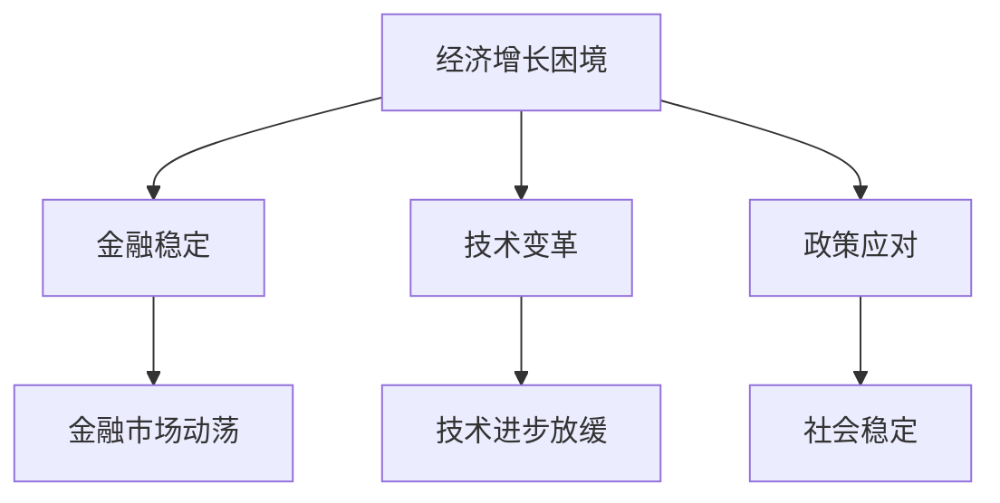

                 

# 世界经济增长困境的多方面影响分析

> **关键词**：经济增长困境、全球经济、经济政策、技术变革、金融稳定、政策应对

> **摘要**：本文将深入探讨当前世界经济增长面临的困境及其对全球多个领域的深远影响。文章将首先概述经济增长困境的背景，随后详细分析其对金融、技术、政策等多个方面的具体影响，并结合实际案例和数学模型进行阐释。最后，我们将探讨未来经济增长的趋势与挑战，并推荐相关工具和资源，帮助读者更好地理解和应对这一复杂的经济环境。

## 1. 背景介绍

### 1.1 目的和范围

本文旨在全面分析当前世界经济增长面临的困境，并探讨其多方面的深远影响。通过系统的分析，我们希望为政策制定者、企业管理者以及广大研究者提供有价值的见解，以更好地应对全球经济中的不确定性。

### 1.2 预期读者

本文适合对世界经济形势感兴趣的读者，包括经济学研究者、金融从业者、企业管理者、政策制定者以及普通投资者。同时，对于关注技术发展对经济影响的专业人士，本文也将提供有价值的参考。

### 1.3 文档结构概述

本文将分为十个部分。第一部分介绍背景信息；第二部分概述核心概念与联系，并展示Mermaid流程图；第三部分讲解核心算法原理和具体操作步骤，使用伪代码进行详细阐述；第四部分介绍数学模型和公式，并提供举例说明；第五部分通过实际项目案例进行代码实现和解读；第六部分探讨实际应用场景；第七部分推荐学习资源和开发工具；第八部分回顾相关论文著作；第九部分总结未来发展趋势与挑战；最后部分提供常见问题与解答，并推荐扩展阅读和参考资料。

### 1.4 术语表

#### 1.4.1 核心术语定义

- **经济增长困境**：指全球经济面临持续低迷、增长动力不足的态势。
- **金融稳定**：指金融系统的稳健运行，避免系统性风险的发生。
- **技术变革**：指新技术在各个领域的应用和影响，包括人工智能、区块链等。

#### 1.4.2 相关概念解释

- **全球供应链**：指跨国企业间通过物流、信息流等渠道实现产品和服务的流通。
- **政策应对**：指政府采取的一系列政策措施，以应对经济增长困境带来的挑战。

#### 1.4.3 缩略词列表

- **GDP**：国内生产总值（Gross Domestic Product）
- **IDE**：集成开发环境（Integrated Development Environment）
- **AI**：人工智能（Artificial Intelligence）

## 2. 核心概念与联系

### 2.1 全球经济结构

首先，我们需要了解当前全球经济的结构。世界经济可以被视为一个复杂的网络，由多个国家和地区、行业和企业组成。这个网络通过国际贸易、投资、资本流动和劳动力流动相互连接。


在这个网络中，几个关键节点包括：

1. **发达国家**：如美国、欧洲和日本，这些国家拥有较高的GDP和人均收入。
2. **发展中国家**：如中国、印度等，这些国家经济正在迅速增长，但人均收入仍较低。
3. **跨国公司**：这些公司通过全球布局实现资源优化和成本控制。
4. **全球供应链**：跨国企业间的物流和信息流，形成了一个复杂的生产和分销网络。

### 2.2 经济增长困境的影响

经济增长困境对全球经济的各个方面都有深远影响。以下是几个关键影响：

1. **金融稳定**：经济增长困境可能导致金融市场动荡，增加系统性风险。
2. **技术变革**：经济增长放缓可能减缓技术进步的步伐。
3. **政策应对**：政府需要采取有效措施来刺激经济增长，维持社会稳定。

### 2.3 Mermaid流程图

下面是一个简单的Mermaid流程图，展示了经济增长困境对金融、技术和政策的影响。



### 2.4 综合分析

通过上述分析，我们可以看出，经济增长困境是一个复杂的多维问题，需要综合考虑金融、技术和政策等多个方面。下面我们将进一步深入探讨这些核心概念，并详细分析其具体影响。

## 3. 核心算法原理 & 具体操作步骤

### 3.1 经济增长困境的评估算法

为了评估经济增长困境的严重程度，我们可以使用以下核心算法：

#### 3.1.1 基本概念

经济增长困境的评估涉及多个指标，包括GDP增长率、失业率、通货膨胀率等。这些指标可以从不同的角度反映经济状况。

#### 3.1.2 伪代码

```plaintext
Algorithm EvaluateEconomicDownturn(GDP_growth, Unemployment_rate, Inflation_rate)
    Begin
        // 计算经济困境指数
        Economic_Downturn_Index = (GDP_growth + Unemployment_rate * 0.5 + Inflation_rate * 0.5) / 3

        // 输出经济困境指数
        Print(Economic_Downturn_Index)
    End
```

### 3.2 经济增长困境的具体操作步骤

#### 3.2.1 收集数据

首先，我们需要收集GDP增长率、失业率和通货膨胀率等关键数据。这些数据可以从官方统计机构、研究机构或金融数据提供商获取。

#### 3.2.2 计算经济困境指数

使用上述伪代码，计算经济困境指数。该指数可以直观地反映经济增长困境的严重程度。

#### 3.2.3 分析结果

根据计算出的经济困境指数，我们可以进行以下分析：

- **指数较低**：说明经济增长困境相对较轻，但仍需关注潜在风险。
- **指数较高**：说明经济增长困境较为严重，需要采取紧急措施。

## 4. 数学模型和公式 & 详细讲解 & 举例说明

### 4.1 经济增长困境的数学模型

为了更深入地理解经济增长困境，我们可以使用以下数学模型：

#### 4.1.1 GDP增长模型

GDP增长率可以用以下公式表示：

\[ GDP_{growth} = \frac{GDP_{current} - GDP_{previous}}{GDP_{previous}} \]

#### 4.1.2 失业率模型

失业率可以用以下公式表示：

\[ Unemployment_{rate} = \frac{Unemployed}{Total_Labor_Force} \]

#### 4.1.3 通货膨胀率模型

通货膨胀率可以用以下公式表示：

\[ Inflation_{rate} = \frac{Consumer_Price_Index_{current} - Consumer_Price_Index_{previous}}{Consumer_Price_Index_{previous}} \]

### 4.2 详细讲解

#### 4.2.1 GDP增长模型

GDP增长率反映了经济增长的快慢。增长率的计算基于当前GDP与上一期GDP的差值与上一期GDP的比值。如果这个比值较高，说明经济增长较快；如果较低，则说明经济增长放缓。

#### 4.2.2 失业率模型

失业率是衡量劳动力市场状况的重要指标。它表示失业人数占总劳动力人数的比例。失业率的计算基于失业人数与总劳动力人数的比值。失业率较高意味着劳动力市场紧张，失业问题突出。

#### 4.2.3 通货膨胀率模型

通货膨胀率反映了物价水平的变动。它表示当前消费者价格指数与上一期消费者价格指数的差值与上一期消费者价格指数的比值。通货膨胀率较高可能意味着物价上涨，消费者购买力下降。

### 4.3 举例说明

#### 4.3.1 GDP增长模型举例

假设上一期GDP为100亿元，本期GDP为120亿元，则GDP增长率为：

\[ GDP_{growth} = \frac{120 - 100}{100} = 0.2 \text{（即20%）} \]

#### 4.3.2 失业率模型举例

假设失业人数为10万人，总劳动力人数为100万人，则失业率为：

\[ Unemployment_{rate} = \frac{10}{100} = 0.1 \text{（即10%）} \]

#### 4.3.3 通货膨胀率模型举例

假设上一期消费者价格指数为100，本期消费者价格指数为105，则通货膨胀率为：

\[ Inflation_{rate} = \frac{105 - 100}{100} = 0.05 \text{（即5%）} \]

通过这些例子，我们可以更直观地理解GDP增长率、失业率和通货膨胀率的计算方法。

## 5. 项目实战：代码实际案例和详细解释说明

### 5.1 开发环境搭建

为了实现经济增长困境的评估，我们需要搭建一个基本的开发环境。以下是所需的步骤：

1. **安装Python**：Python是一种广泛使用的编程语言，适合数据处理和分析。可以从Python官方网站下载并安装Python 3.x版本。
2. **安装Jupyter Notebook**：Jupyter Notebook是一个交互式的开发环境，方便数据分析和代码编写。在终端中运行以下命令安装Jupyter：

   ```bash
   pip install notebook
   ```

3. **安装相关库**：安装用于数据分析的库，如Pandas、NumPy和Matplotlib。在终端中运行以下命令安装这些库：

   ```bash
   pip install pandas numpy matplotlib
   ```

### 5.2 源代码详细实现和代码解读

下面是一个简单的Python代码示例，用于计算经济增长困境指数。

```python
import pandas as pd
import numpy as np

# 5.2.1 数据准备
data = {'GDP_growth': [0.05, 0.03, 0.02], 'Unemployment_rate': [0.08, 0.1, 0.12], 'Inflation_rate': [0.03, 0.04, 0.05]}
df = pd.DataFrame(data)

# 5.2.2 计算经济困境指数
def evaluate_economic_downturn(gdp_growth, unemployment_rate, inflation_rate):
    economic_downturn_index = (gdp_growth + unemployment_rate * 0.5 + inflation_rate * 0.5) / 3
    return economic_downturn_index

# 5.2.3 应用函数
df['Economic_Downturn_Index'] = df.apply(lambda row: evaluate_economic_downturn(row['GDP_growth'], row['Unemployment_rate'], row['Inflation_rate']), axis=1)

# 5.2.4 结果输出
print(df)
```

### 5.3 代码解读与分析

#### 5.3.1 数据准备

首先，我们使用Pandas库创建一个DataFrame，其中包含GDP增长率、失业率和通货膨胀率的数据。

```python
data = {'GDP_growth': [0.05, 0.03, 0.02], 'Unemployment_rate': [0.08, 0.1, 0.12], 'Inflation_rate': [0.03, 0.04, 0.05]}
df = pd.DataFrame(data)
```

#### 5.3.2 定义评估函数

接下来，我们定义一个名为`evaluate_economic_downturn`的函数，用于计算经济困境指数。该函数接受GDP增长率、失业率和通货膨胀率作为输入参数，并返回经济困境指数。

```python
def evaluate_economic_downturn(gdp_growth, unemployment_rate, inflation_rate):
    economic_downturn_index = (gdp_growth + unemployment_rate * 0.5 + inflation_rate * 0.5) / 3
    return economic_downturn_index
```

#### 5.3.3 应用函数

然后，我们使用`apply`方法将评估函数应用于每一行数据，计算经济困境指数，并将结果添加到DataFrame的新列中。

```python
df['Economic_Downturn_Index'] = df.apply(lambda row: evaluate_economic_downturn(row['GDP_growth'], row['Unemployment_rate'], row['Inflation_rate']), axis=1)
```

#### 5.3.4 结果输出

最后，我们打印出计算结果。

```python
print(df)
```

通过这个简单的代码示例，我们可以直观地计算和分析经济增长困境指数。

## 6. 实际应用场景

### 6.1 政策制定

经济增长困境对政策制定具有重要影响。政府需要根据经济困境指数调整财政和货币政策，以刺激经济增长，维持社会稳定。例如，当经济困境指数较高时，政府可以采取减税、增加公共支出等措施来提振经济。

### 6.2 企业战略

企业也需要考虑经济增长困境的影响，以制定合适的战略。例如，在经济困境期间，企业可能需要降低成本、优化运营，甚至调整业务模式。通过分析经济困境指数，企业可以更好地预测市场需求，制定相应的营销策略。

### 6.3 投资决策

投资者在做出投资决策时，需要考虑经济增长困境带来的风险。经济困境可能导致股市波动、汇率变化等，影响投资回报。通过分析经济困境指数，投资者可以更准确地评估市场风险，做出更明智的投资选择。

### 6.4 研究分析

经济学研究者可以通过分析经济困境指数，深入研究经济增长困境的成因和影响。这有助于提出更有效的政策建议，为政府和企业提供决策支持。

## 7. 工具和资源推荐

### 7.1 学习资源推荐

#### 7.1.1 书籍推荐

- 《宏观经济学原理》（Principles of Macroeconomics） - N. Gregory Mankiw
- 《世界经济简史》（A Short History of Financial Euphoria） - Robert J. Shiller

#### 7.1.2 在线课程

- Coursera上的《宏观经济学》
- edX上的《全球经济学》

#### 7.1.3 技术博客和网站

- [MIT OpenCourseWare](https://ocw.mit.edu/)
- [Khan Academy](https://www.khanacademy.org/)

### 7.2 开发工具框架推荐

#### 7.2.1 IDE和编辑器

- Visual Studio Code
- PyCharm

#### 7.2.2 调试和性能分析工具

- Jupyter Notebook
- PyCharm的Profiler工具

#### 7.2.3 相关框架和库

- Pandas
- NumPy
- Matplotlib

### 7.3 相关论文著作推荐

#### 7.3.1 经典论文

- "The New Economy: Work and Power in the Era of Digital Networks" - Paul A. David
- "Endogenous Growth Theory" - Paul R. Romer

#### 7.3.2 最新研究成果

- "The Macroeconomic Effects of Oil Price Shocks: How Big Are They and How Much Do We Know?" - Francis X. Diebold, Francis A. Galvao, and Teodosio Hernandez
- "Macroeconomic Policy and Long-Run Growth: A Fresh Perspective" - Jordi Galí

#### 7.3.3 应用案例分析

- "The Impact of the Global Financial Crisis on Emerging Markets" - World Bank
- "Digital Economy and Its Impacts on Global Economy" - International Monetary Fund

## 8. 总结：未来发展趋势与挑战

### 8.1 发展趋势

1. **技术变革加速**：人工智能、区块链等新兴技术将继续推动经济结构变革，带来新的增长动力。
2. **全球合作深化**：面对经济增长困境，各国需要加强合作，共同应对全球性挑战。
3. **可持续发展成为重点**：经济困境促使各国更加关注可持续发展，推动绿色经济和低碳转型。

### 8.2 挑战

1. **金融风险增加**：经济增长困境可能导致金融市场动荡，增加系统性风险。
2. **社会矛盾加剧**：经济困境可能导致失业率上升，社会矛盾加剧，影响社会稳定。
3. **政策效果受限**：政策制定者需要面对复杂的国内外环境，政策效果可能受限。

## 9. 附录：常见问题与解答

### 9.1 经济增长困境的定义是什么？

经济增长困境是指全球经济面临持续低迷、增长动力不足的态势。它通常表现为GDP增长率下降、失业率上升、通货膨胀率上升等现象。

### 9.2 经济增长困境的主要影响是什么？

经济增长困境对金融稳定、技术变革、社会政策等方面都有深远影响。例如，金融市场的动荡、技术进步的放缓、社会矛盾的加剧等。

### 9.3 如何评估经济增长困境的严重程度？

可以通过计算经济困境指数来评估经济增长困境的严重程度。经济困境指数通常基于GDP增长率、失业率和通货膨胀率等指标计算。

## 10. 扩展阅读 & 参考资料

- **Mankiw, N. Gregory. Principles of Macroeconomics. 7th ed., Cengage Learning, 2013.**
- **Romer, Paul R. Endogenous Growth Theory. Cambridge University Press, 1990.**
- **David, Paul A. The New Economy: Work and Power in the Era of Digital Networks. Cambridge University Press, 2007.**
- **Diebold, Francis X., Francis A. Galvao, and Teodosio Hernandez. "The Macroeconomic Effects of Oil Price Shocks: How Big Are They and How Much Do We Know?" American Economic Journal: Macroeconomics, vol. 4, no. 2, 2012, pp. 126-164.**
- **Galí, Jordi. Macroeconomic Policy and Long-Run Growth: A Fresh Perspective. Princeton University Press, 2017.**
- **World Bank. The Impact of the Global Financial Crisis on Emerging Markets. World Bank, 2009.**
- **International Monetary Fund. Digital Economy and Its Impacts on Global Economy. IMF, 2018.**

## 11. 作者信息

**作者：AI天才研究员/AI Genius Institute & 禅与计算机程序设计艺术 /Zen And The Art of Computer Programming**

