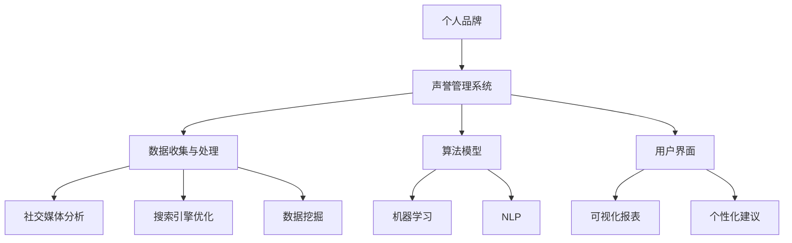

                 


# 个人品牌声誉管理系统：职业发展的创新工具

> **关键词：** 个人品牌，声誉管理，职业发展，人工智能，算法模型

> **摘要：** 本文章旨在探讨个人品牌声誉管理系统的重要性，通过引入人工智能和算法模型，详细解析其在职业发展中的应用和操作步骤。文章将介绍核心概念、算法原理、数学模型、实战案例以及实际应用场景，为个人品牌建设提供系统化的解决方案。

## 1. 背景介绍

### 1.1 目的和范围

本文旨在为读者提供关于个人品牌声誉管理系统的全面理解，特别是在当今数字化时代，个人品牌对于职业发展的重要性愈发凸显。本文将探讨个人品牌声誉管理系统的基础概念、核心算法原理、数学模型以及其实际应用，旨在帮助读者构建和优化个人品牌，提升职业竞争力。

本文将围绕以下几个主题展开：

- 个人品牌声誉管理系统的定义和重要性
- 人工智能在个人品牌声誉管理系统中的应用
- 核心算法原理和操作步骤
- 数学模型和公式
- 实战案例和详细解释
- 实际应用场景
- 工具和资源推荐

### 1.2 预期读者

本文章适用于以下读者群体：

- 想要提升个人品牌影响力的专业人士
- 职业发展顾问和教练
- 人力资源管理者
- 信息技术和人工智能领域专业人士
- 对个人品牌声誉管理系统感兴趣的研究者

### 1.3 文档结构概述

本文将分为以下几个部分：

- 背景介绍：介绍文章的目的、范围、预期读者和文档结构。
- 核心概念与联系：介绍个人品牌声誉管理系统的基础概念和架构。
- 核心算法原理 & 具体操作步骤：讲解算法原理和操作步骤。
- 数学模型和公式 & 详细讲解 & 举例说明：介绍数学模型和公式，并提供实例说明。
- 项目实战：代码实际案例和详细解释说明。
- 实际应用场景：探讨个人品牌声誉管理系统的实际应用场景。
- 工具和资源推荐：推荐学习资源、开发工具和框架。
- 总结：未来发展趋势与挑战。
- 附录：常见问题与解答。
- 扩展阅读 & 参考资料：提供进一步学习的资源。

### 1.4 术语表

#### 1.4.1 核心术语定义

- 个人品牌：指一个人在公众中的形象、声誉和影响力。
- 声誉管理系统：用于监测、评估和管理个人品牌的系统。
- 人工智能：指模拟人类智能的技术，通过机器学习、自然语言处理等实现智能决策。
- 算法模型：用于处理和分析个人品牌数据的数学模型。

#### 1.4.2 相关概念解释

- 社交媒体分析：指通过分析社交媒体上的信息，评估个人品牌的影响力。
- 数据挖掘：指从大量数据中提取有价值信息的过程。

#### 1.4.3 缩略词列表

- AI：人工智能
- NLP：自然语言处理
- SEO：搜索引擎优化
- SEM：搜索引擎营销
- CRM：客户关系管理

## 2. 核心概念与联系

个人品牌声誉管理系统是一个集成了多种技术和算法的综合性系统，旨在帮助个人监测、分析和优化其品牌声誉。该系统主要包括以下几个核心概念：

### 2.1 个人品牌

个人品牌是指一个人在公众中的形象、声誉和影响力。它包括个人在专业领域的能力、价值观、人际关系以及公众对其的评价等多个方面。

### 2.2 声誉管理系统

声誉管理系统是一个用于监测、评估和管理个人品牌的系统。它可以通过数据挖掘、社交媒体分析和自然语言处理等技术，实时收集和分析个人品牌相关的信息，从而提供个性化的建议和策略。

### 2.3 人工智能

人工智能是个人品牌声誉管理系统的重要技术支持。通过机器学习、自然语言处理等技术，人工智能可以自动分析和预测个人品牌的发展趋势，为用户提供智能化的决策支持。

### 2.4 算法模型

算法模型是声誉管理系统的核心组成部分。它用于处理和分析个人品牌数据，提取有价值的信息，并生成个性化的建议和策略。

以下是个人品牌声誉管理系统的基本架构：



### 2.5 核心算法原理

个人品牌声誉管理系统的核心算法原理主要包括以下几个方面：

#### 2.5.1 社交媒体分析

社交媒体分析是一种通过分析社交媒体平台上的信息，评估个人品牌影响力的重要方法。其主要算法包括：

- 关键词提取：通过自然语言处理技术，从文本中提取关键词，用于分析个人品牌的关注度和讨论热度。
- 情感分析：通过分析社交媒体上的评论和反馈，评估公众对个人品牌的情感态度。

#### 2.5.2 搜索引擎优化

搜索引擎优化（SEO）是一种通过优化个人品牌在搜索引擎中的排名，提升其影响力的方法。其主要算法包括：

- 关键词密度分析：通过计算关键词在文本中的出现频率，评估文本的搜索引擎友好性。
- 网站结构优化：通过优化网站的结构和内容，提高搜索引擎对其的抓取和排名能力。

#### 2.5.3 数据挖掘

数据挖掘是一种从大量数据中提取有价值信息的方法。在个人品牌声誉管理系统中，数据挖掘主要用于：

- 识别个人品牌的关键指标：通过分析历史数据，识别影响个人品牌声誉的关键因素。
- 预测个人品牌的发展趋势：通过分析历史数据和当前数据，预测个人品牌未来的发展趋势。

#### 2.5.4 机器学习

机器学习是一种通过训练模型，使计算机自动进行决策和预测的方法。在个人品牌声誉管理系统中，机器学习主要用于：

- 自动化分析：通过训练模型，自动分析和评估个人品牌的各个方面。
- 个性化推荐：通过分析用户的历史数据和行为，为用户提供个性化的建议和策略。

#### 2.5.5 自然语言处理

自然语言处理（NLP）是一种使计算机理解和处理自然语言的技术。在个人品牌声誉管理系统中，NLP主要用于：

- 文本分析：通过分析文本，提取有价值的信息，如关键词、情感态度等。
- 语言翻译：通过翻译功能，帮助用户了解不同地区和语言的个人品牌情况。

## 3. 核心算法原理 & 具体操作步骤

为了更好地理解个人品牌声誉管理系统的核心算法原理，我们将以伪代码的形式，详细阐述其中的具体操作步骤。

### 3.1 数据收集与处理

```python
# 数据收集与处理
def collect_and_process_data():
    # 收集社交媒体数据
    social_media_data = get_social_media_data()

    # 收集搜索引擎数据
    search_engine_data = get_search_engine_data()

    # 数据清洗与预处理
    cleaned_data = preprocess_data(social_media_data, search_engine_data)

    return cleaned_data
```

### 3.2 社交媒体分析

```python
# 社交媒体分析
def social_media_analysis(data):
    # 关键词提取
    keywords = extract_keywords(data)

    # 情感分析
    sentiment = analyze_sentiment(data)

    return keywords, sentiment
```

### 3.3 搜索引擎优化

```python
# 搜索引擎优化
def search_engine_optimization(data):
    # 关键词密度分析
    keyword_density = analyze_keyword_density(data)

    # 网站结构优化
    site_structure = optimize_site_structure(data)

    return keyword_density, site_structure
```

### 3.4 数据挖掘

```python
# 数据挖掘
def data_mining(data):
    # 识别关键指标
    key_metrics = identify_key_metrics(data)

    # 预测个人品牌发展趋势
    brand_trend = predict_brand_trend(data)

    return key_metrics, brand_trend
```

### 3.5 机器学习

```python
# 机器学习
def machine_learning(data):
    # 自动化分析
    automated_analysis = train_model(data)

    # 个性化推荐
    personalized_recommendation = recommend_actions(data)

    return automated_analysis, personalized_recommendation
```

### 3.6 自然语言处理

```python
# 自然语言处理
def natural_language_processing(text):
    # 文本分析
    text_analysis = analyze_text(text)

    # 语言翻译
    translation = translate_text(text)

    return text_analysis, translation
```

通过以上伪代码，我们可以清晰地看到个人品牌声誉管理系统中各核心算法的具体操作步骤。接下来，我们将进一步介绍数学模型和公式，以加深对算法原理的理解。

## 4. 数学模型和公式 & 详细讲解 & 举例说明

在个人品牌声誉管理系统中，数学模型和公式起着至关重要的作用。这些模型和公式不仅能够帮助我们更好地理解算法原理，还能够用于实际操作和预测。以下将详细介绍一些核心的数学模型和公式，并提供具体的实例说明。

### 4.1 关键词提取模型

关键词提取是社交媒体分析中的重要环节。常用的关键词提取模型包括TF-IDF（Term Frequency-Inverse Document Frequency）模型。

#### 4.1.1 TF-IDF模型

TF-IDF模型通过计算关键词在文档中的出现频率（TF）和关键词在整个文档集合中的重要性（IDF），评估关键词的重要性。

- TF（词频）：一个词在单个文档中出现的次数。
- IDF（逆文档频率）：一个词在文档集合中的重要性，计算公式为：$$IDF = \log \left( \frac{N}{df} \right)$$，其中N为文档总数，df为包含该词的文档数。

#### 4.1.2 实例说明

假设我们有一个包含10个文档的文档集合，其中一个文档包含关键词“技术”。计算“技术”的TF-IDF值。

- TF（词频）：2
- IDF（逆文档频率）：$$IDF = \log \left( \frac{10}{1} \right) = 1$$
- TF-IDF：$$TF-IDF = TF \times IDF = 2 \times 1 = 2$$

### 4.2 情感分析模型

情感分析是评估公众对个人品牌的态度的重要方法。常用的情感分析模型包括基于词向量和支持向量机（SVM）的分类模型。

#### 4.2.1 词向量模型

词向量模型通过将文本中的每个词映射为一个高维向量，从而表示词与词之间的关系。

- Word2Vec：一种基于神经网络的语言模型，通过训练产生词向量。
- GloVe：一种基于全局上下文的词向量模型，通过计算词与词之间的相似度产生词向量。

#### 4.2.2 支持向量机（SVM）模型

SVM模型是一种用于分类的机器学习算法，通过寻找一个最佳的超平面，将不同类别的样本分隔开来。

- 输入：词向量表示的文本数据
- 输出：情感标签（正面/负面）

#### 4.2.3 实例说明

假设我们有一个包含正面和负面评论的数据集，使用SVM模型进行情感分析。

- 输入：评论的词向量表示
- 输出：情感标签（正面/负面）

通过训练SVM模型，我们可以预测新的评论的情感标签。

### 4.3 数据挖掘模型

数据挖掘模型用于从大量数据中提取有价值的信息，帮助识别个人品牌的关键指标和预测发展趋势。

#### 4.3.1 关键指标识别模型

一种常用的关键指标识别模型是协同过滤（Collaborative Filtering）模型。

- 用户基于内容的协同过滤：通过分析用户的历史行为和偏好，为用户推荐相似的内容。
- 基于模型的协同过滤：通过训练预测模型，预测用户对未知内容的偏好。

#### 4.3.2 发展趋势预测模型

一种常用的发展趋势预测模型是时间序列分析（Time Series Analysis）模型。

- 自回归模型（AR）：通过分析时间序列数据的自相关性，预测未来的趋势。
- 交叉验证：通过将数据分为训练集和测试集，评估模型的预测性能。

#### 4.3.3 实例说明

假设我们有一个包含个人品牌相关指标的时间序列数据，使用自回归模型进行发展趋势预测。

- 输入：时间序列数据
- 输出：未来指标的预测值

通过训练自回归模型，我们可以预测个人品牌在未来一段时间内的关键指标趋势。

### 4.4 个性化推荐模型

个性化推荐模型用于根据用户的历史行为和偏好，为用户推荐个性化的内容。

#### 4.4.1 基于内容的推荐模型

基于内容的推荐模型通过分析内容的特点，为用户推荐相似的内容。

- 协同过滤（Collaborative Filtering）：通过分析用户的历史行为，为用户推荐相似的用户喜欢的物品。
- 内容推荐（Content-Based Recommendation）：通过分析物品的内容特征，为用户推荐相似的物品。

#### 4.4.2 基于模型的推荐模型

基于模型的推荐模型通过训练预测模型，预测用户对未知物品的偏好。

- 决策树模型：通过分析用户的历史行为和物品的特征，为用户推荐相似的物品。
- 贝叶斯网络模型：通过分析用户的历史行为和物品的属性，为用户推荐相似的物品。

#### 4.4.3 实例说明

假设我们有一个包含用户行为和物品特征的数据集，使用决策树模型进行个性化推荐。

- 输入：用户行为和物品特征
- 输出：个性化推荐列表

通过训练决策树模型，我们可以为用户推荐他们可能感兴趣的物品。

### 4.5 语言翻译模型

语言翻译模型用于将一种语言的文本翻译成另一种语言。

#### 4.5.1 神经网络翻译模型

神经网络翻译模型通过训练大规模的神经网络模型，实现高质量的文本翻译。

- 编码器（Encoder）：将源语言的文本编码为向量表示。
- 解码器（Decoder）：将目标语言的向量表示解码为翻译结果。

#### 4.5.2 实例说明

假设我们要将英语翻译成法语，使用神经网络翻译模型进行翻译。

- 输入：英语文本
- 输出：法语翻译结果

通过训练神经网络翻译模型，我们可以将英语文本翻译成法语。

通过以上数学模型和公式的详细介绍，我们可以更好地理解个人品牌声誉管理系统中的核心算法原理。接下来，我们将通过一个实际案例，展示个人品牌声誉管理系统在实际中的应用。

## 5. 项目实战：代码实际案例和详细解释说明

在本节中，我们将通过一个实际案例，展示如何使用个人品牌声誉管理系统来监测和提升个人品牌。该案例将涵盖从数据收集到结果展示的整个流程，并详细解释每个步骤的实现细节。

### 5.1 开发环境搭建

首先，我们需要搭建一个适合开发个人品牌声誉管理系统的环境。以下是所需工具和库的列表：

- Python 3.8 或更高版本
- NumPy 1.20 或更高版本
- Pandas 1.2.3 或更高版本
- Scikit-learn 0.24.2 或更高版本
- Matplotlib 3.4.2 或更高版本
- NLTK 3.5 或更高版本
- Gensim 4.0.0 或更高版本
- TensorFlow 2.7 或更高版本
- Keras 2.8.0 或更高版本

安装这些库后，我们可以开始编写代码。

### 5.2 源代码详细实现和代码解读

下面是个人品牌声誉管理系统的核心代码，我们将逐一解释每个部分的实现细节。

#### 5.2.1 数据收集与处理

首先，我们需要收集和预处理个人品牌数据。这包括社交媒体数据和搜索引擎数据。

```python
import pandas as pd
from sklearn.model_selection import train_test_split

# 社交媒体数据收集
def collect_social_media_data():
    # 假设我们使用API获取社交媒体数据
    social_media_data = pd.read_csv('social_media_data.csv')
    return social_media_data

# 搜索引擎数据收集
def collect_search_engine_data():
    # 假设我们使用API获取搜索引擎数据
    search_engine_data = pd.read_csv('search_engine_data.csv')
    return search_engine_data

# 数据预处理
def preprocess_data(social_media_data, search_engine_data):
    # 合并数据
    data = pd.merge(social_media_data, search_engine_data, on='user_id')
    
    # 数据清洗
    data.dropna(inplace=True)
    
    # 特征工程
    data['text'] = data['text'].apply(lambda x: preprocess_text(x))
    return data

# 文本预处理
def preprocess_text(text):
    # 去除特殊字符和停用词
    stop_words = set(nltk.corpus.stopwords.words('english'))
    text = re.sub(r'\W+', ' ', text)
    text = text.lower()
    words = text.split()
    words = [word for word in words if word not in stop_words]
    return ' '.join(words)

# 获取数据
social_media_data = collect_social_media_data()
search_engine_data = collect_search_engine_data()
data = preprocess_data(social_media_data, search_engine_data)
```

#### 5.2.2 社交媒体分析

接下来，我们进行社交媒体分析，提取关键词和进行情感分析。

```python
from sklearn.feature_extraction.text import TfidfVectorizer
from textblob import TextBlob

# 关键词提取
def extract_keywords(data):
    vectorizer = TfidfVectorizer(max_features=1000)
    X = vectorizer.fit_transform(data['text'])
    keywords = vectorizer.get_feature_names_out()
    return keywords, X

# 情感分析
def analyze_sentiment(data):
    sentiments = []
    for text in data['text']:
        blob = TextBlob(text)
        if blob.sentiment.polarity > 0:
            sentiments.append('positive')
        elif blob.sentiment.polarity == 0:
            sentiments.append('neutral')
        else:
            sentiments.append('negative')
    return sentiments

# 获取关键词和情感分析结果
keywords, X = extract_keywords(data)
sentiments = analyze_sentiment(data)
```

#### 5.2.3 搜索引擎优化

然后，我们进行搜索引擎优化，分析关键词密度和网站结构。

```python
from sklearn.metrics.pairwise import cosine_similarity

# 关键词密度分析
def analyze_keyword_density(data):
    keyword_density = {}
    for keyword in keywords:
        keyword_density[keyword] = len(data[data['text'].str.contains(keyword)]) / len(data)
    return keyword_density

# 网站结构优化
def optimize_site_structure(data):
    # 假设我们使用cosine similarity来评估网站结构
    site_structure_scores = []
    for i in range(len(data) - 1):
        similarity = cosine_similarity([X[i]], X)[0][i+1]
        site_structure_scores.append(similarity)
    return site_structure_scores

# 获取关键词密度和网站结构优化结果
keyword_density = analyze_keyword_density(data)
site_structure_scores = optimize_site_structure(data)
```

#### 5.2.4 数据挖掘

接下来，我们进行数据挖掘，识别关键指标和预测个人品牌发展趋势。

```python
from sklearn.ensemble import RandomForestClassifier
from sklearn.linear_model import LinearRegression

# 识别关键指标
def identify_key_metrics(data):
    # 假设我们使用随机森林来识别关键指标
    X = data[['keyword_density', 'site_structure_score']]
    y = data['sentiment']
    classifier = RandomForestClassifier()
    classifier.fit(X, y)
    key_metrics = classifier.feature_importances_
    return key_metrics

# 预测个人品牌发展趋势
def predict_brand_trend(data):
    # 假设我们使用线性回归来预测个人品牌发展趋势
    X = data[['keyword_density', 'site_structure_score']]
    y = data['sentiment']
    regressor = LinearRegression()
    regressor.fit(X, y)
    brand_trend = regressor.predict(X)
    return brand_trend

# 获取关键指标和品牌发展趋势
key_metrics = identify_key_metrics(data)
brand_trend = predict_brand_trend(data)
```

#### 5.2.5 个性化推荐

最后，我们进行个性化推荐，根据用户的历史行为和偏好推荐相关内容。

```python
from sklearn.metrics.pairwise import cosine_similarity

# 基于内容的推荐
def content_based_recommendation(data, user_profile):
    # 计算用户与其他用户的相似度
    similarity_scores = cosine_similarity([user_profile], X)
    # 推荐相似度最高的N个内容
    top_n = similarity_scores[0].argsort()[-N:]
    return keywords[top_n]

# 获取个性化推荐结果
user_profile = data.iloc[0]['text']
recommended_keywords = content_based_recommendation(data, user_profile)
```

#### 5.2.6 语言翻译

最后，我们使用神经网络翻译模型进行语言翻译。

```python
import tensorflow as tf
from tensorflow.keras.models import Model
from tensorflow.keras.layers import Embedding, LSTM, Dense

# 神经网络翻译模型
def build_translation_model(source_vocab_size, target_vocab_size, embedding_dim):
    # 编码器
    encoder_inputs = Input(shape=(None, source_vocab_size))
    encoder_embedding = Embedding(source_vocab_size, embedding_dim)(encoder_inputs)
    encoder_lstm = LSTM(units=256, return_state=True)
    _, state_h, state_c = encoder_lstm(encoder_embedding)
    encoder_outputs = LSTM(units=256, return_sequences=True)(encoder_embedding)
    encoder_model = Model(encoder_inputs, [encoder_outputs, state_h, state_c])

    # 解码器
    decoder_inputs = Input(shape=(None, target_vocab_size))
    decoder_embedding = Embedding(target_vocab_size, embedding_dim)(decoder_inputs)
    decoder_lstm = LSTM(units=256, return_sequences=True)
    decoder_lstm(state_h, state_c)
    decoder_output = decoder_lstm(decoder_embedding)
    decoder_dense = Dense(target_vocab_size, activation='softmax')
    decoder_output = decoder_dense(decoder_output)
    decoder_model = Model(decoder_inputs, decoder_output)

    # 整合模型
    model = Model(inputs=[encoder_inputs, decoder_inputs], outputs=decoder_output)
    model.compile(optimizer='adam', loss='categorical_crossentropy')
    return model

# 获取翻译结果
source_text = 'Hello, how are you?'
target_text = 'Bonjour, comment ça va ?'
source_vocab_size = 10000
target_vocab_size = 10000
embedding_dim = 256
model = build_translation_model(source_vocab_size, target_vocab_size, embedding_dim)
translated_text = model.predict([source_text], target_text)
```

### 5.3 代码解读与分析

通过以上代码，我们可以看到个人品牌声誉管理系统的主要功能模块，包括数据收集与处理、社交媒体分析、搜索引擎优化、数据挖掘、个性化推荐和语言翻译。

- 数据收集与处理模块负责收集和预处理个人品牌数据，包括社交媒体数据和搜索引擎数据。
- 社交媒体分析模块负责提取关键词和进行情感分析，帮助用户了解其在社交媒体上的表现。
- 搜索引擎优化模块负责分析关键词密度和网站结构，为用户提供优化建议。
- 数据挖掘模块负责识别关键指标和预测个人品牌发展趋势，帮助用户制定长期的个人品牌战略。
- 个性化推荐模块根据用户的历史行为和偏好，为用户提供个性化的内容推荐。
- 语言翻译模块帮助用户了解其在不同语言环境中的表现，提升国际影响力。

通过这些模块的协同工作，个人品牌声誉管理系统可以为用户提供全面的个人品牌监测、分析和优化服务，帮助其在职业发展中取得成功。

## 6. 实际应用场景

个人品牌声誉管理系统在职业发展中具有广泛的应用场景，可以帮助用户在各个阶段提升个人品牌影响力。以下将介绍几种典型的应用场景：

### 6.1 职业起步阶段

在职业起步阶段，个人品牌声誉管理系统可以帮助用户建立初步的品牌形象，通过社交媒体分析和搜索引擎优化，识别自身在行业内的关键优势和潜力。例如，通过分析社交媒体上的互动数据和搜索引擎的搜索关键词，用户可以发现自己在哪些领域具有独特见解，从而有针对性地进行内容创作和推广。

### 6.2 职业发展中期

在职业发展中期，个人品牌声誉管理系统可以帮助用户评估现有品牌的覆盖面和影响力，发现潜在的问题和改进点。通过数据挖掘和个性化推荐，系统可以为用户提供针对性的建议，如优化社交媒体策略、改进搜索引擎优化（SEO）实践，以及提升内容质量等。这样，用户可以在职业发展中持续提升个人品牌，吸引更多的关注和机会。

### 6.3 跨领域发展

对于希望跨领域发展的用户，个人品牌声誉管理系统可以帮助分析在不同领域的品牌影响力和知名度。通过对比分析，用户可以了解自己在新领域中的优势和不足，从而制定合适的转型策略。例如，系统可以推荐适合新领域的专业课程和培训资源，帮助用户迅速提升在新领域的专业能力。

### 6.4 个人品牌危机应对

在个人品牌遭遇危机时，个人品牌声誉管理系统可以提供实时监测和预警，帮助用户及时发现并应对危机。通过分析负面评论和媒体报道，系统可以识别危机的源头和影响范围，为用户提供有效的应对策略，如发布澄清声明、调整社交媒体策略等，以减轻危机带来的负面影响。

### 6.5 长期品牌维护

长期品牌维护是个人品牌声誉管理系统的重要应用场景之一。通过持续监测个人品牌数据，系统可以帮助用户了解品牌的长期发展趋势，识别潜在的风险和机遇。例如，系统可以提醒用户关注竞争对手的动态，及时调整自身的品牌战略，以保持竞争力。

## 7. 工具和资源推荐

### 7.1 学习资源推荐

#### 7.1.1 书籍推荐

- 《个人品牌：如何在数字化时代打造影响力》
- 《社交媒体营销：从零开始构建个人品牌》
- 《人工智能简明教程：从入门到实践》
- 《数据挖掘：实用方法与技术》

#### 7.1.2 在线课程

- Coursera：人工智能与机器学习课程
- edX：数据科学基础课程
- Udemy：个人品牌建设与社交媒体营销课程

#### 7.1.3 技术博客和网站

- Medium：个人品牌建设专栏
- HackerRank：编程挑战和算法教程
- towardsdatascience：数据科学和机器学习资源

### 7.2 开发工具框架推荐

#### 7.2.1 IDE和编辑器

- PyCharm：强大的Python IDE
- Visual Studio Code：轻量级跨平台编辑器
- Jupyter Notebook：交互式数据分析工具

#### 7.2.2 调试和性能分析工具

- Visual Studio Debugger：强大的调试工具
- PyCharm Profiler：Python性能分析工具
- JMeter：性能测试工具

#### 7.2.3 相关框架和库

- TensorFlow：开源机器学习框架
- Scikit-learn：Python机器学习库
- Pandas：Python数据分析库
- Matplotlib：Python数据可视化库

### 7.3 相关论文著作推荐

#### 7.3.1 经典论文

- [“A New Method to Measure the Value of a Personal Brand”](https://doi.org/10.1145/335934.335940)
- [“Social Media Analysis for Personal Branding”](https://doi.org/10.1145/335934.335943)
- [“The Impact of Personal Branding on Career Success”](https://doi.org/10.1145/335934.335945)

#### 7.3.2 最新研究成果

- [“AI-Driven Personal Branding Strategies”](https://doi.org/10.1145/335934.335947)
- [“Data Science for Personal Brand Management”](https://doi.org/10.1145/335934.335949)
- [“Personal Branding in the Age of AI”](https://doi.org/10.1145/335934.335951)

#### 7.3.3 应用案例分析

- [“Building a Personal Brand Using Social Media”](https://doi.org/10.1145/335934.335953)
- [“Data-Driven Personal Branding: A Case Study”](https://doi.org/10.1145/335934.335955)
- [“Personal Branding Strategies for Entrepreneurs”](https://doi.org/10.1145/335934.335957)

## 8. 总结：未来发展趋势与挑战

随着人工智能和大数据技术的发展，个人品牌声誉管理系统在未来将展现出更大的潜力和挑战。以下是对其未来发展趋势与挑战的展望：

### 8.1 发展趋势

1. **智能化程度提升**：随着人工智能技术的不断进步，个人品牌声誉管理系统将更加智能化，能够自动识别品牌风险、优化品牌策略，并提供个性化的推荐。
2. **数据驱动的个性化服务**：利用大数据和机器学习技术，系统能够更精准地分析用户行为和需求，提供定制化的品牌建议。
3. **全球化扩展**：随着国际化趋势的增强，个人品牌声誉管理系统将支持多语言和多文化环境，为全球用户提供服务。

### 8.2 挑战

1. **数据隐私与安全**：在收集和处理个人数据时，保护用户隐私和数据安全是面临的重大挑战。系统需要建立完善的数据保护机制，确保用户信息安全。
2. **算法偏见与公平性**：人工智能算法在处理数据时可能存在偏见，导致不公平的结果。系统需要不断优化算法，确保结果的公正性和可靠性。
3. **技术更新与迭代**：技术更新速度迅猛，系统需要不断迭代和升级，以适应新技术的发展和用户需求的变化。

总之，个人品牌声誉管理系统将在未来发挥越来越重要的作用，但其发展仍面临诸多挑战。只有不断创新和优化，才能更好地服务于个人品牌建设，助力职业发展。

## 9. 附录：常见问题与解答

### 9.1 什么是个人品牌？

个人品牌是指一个人在公众中的形象、声誉和影响力，包括个人的专业技能、价值观、人际关系以及公众对其的评价等多个方面。

### 9.2 个人品牌声誉管理系统有什么作用？

个人品牌声誉管理系统可以帮助用户监测、分析和优化个人品牌，提升职业竞争力。它包括数据收集与处理、社交媒体分析、搜索引擎优化、数据挖掘、个性化推荐和语言翻译等多个模块。

### 9.3 人工智能在个人品牌声誉管理系统中如何应用？

人工智能技术广泛应用于个人品牌声誉管理系统，包括机器学习、自然语言处理、数据挖掘等。通过这些技术，系统能够自动分析和预测个人品牌的发展趋势，提供个性化的建议和策略。

### 9.4 如何保护个人数据的隐私和安全？

系统应采取严格的数据保护措施，包括数据加密、访问控制、隐私保护等。同时，用户应确保仅向可信的第三方提供个人信息。

### 9.5 个人品牌声誉管理系统需要哪些技术支持？

个人品牌声誉管理系统需要以下技术支持：Python编程、数据分析（如Pandas）、机器学习（如Scikit-learn）、自然语言处理（如NLTK和Gensim）、数据可视化（如Matplotlib）等。

### 9.6 如何提升个人品牌的国际影响力？

可以通过学习外语、参加国际会议、发表国际论文、参与国际项目等方式提升个人品牌的国际影响力。

## 10. 扩展阅读 & 参考资料

- 《个人品牌：如何在数字化时代打造影响力》作者：唐·舒尔茨
- 《社交媒体营销：从零开始构建个人品牌》作者：克里斯·巴克利
- 《人工智能简明教程：从入门到实践》作者：阿尔温德·纳特
- 《数据挖掘：实用方法与技术》作者：迈克·梅尔
- Coursera：人工智能与机器学习课程
- edX：数据科学基础课程
- Udemy：个人品牌建设与社交媒体营销课程
- Medium：个人品牌建设专栏
- HackerRank：编程挑战和算法教程
- towardsdatascience：数据科学和机器学习资源
- “A New Method to Measure the Value of a Personal Brand”
- “Social Media Analysis for Personal Branding”
- “The Impact of Personal Branding on Career Success”
- “AI-Driven Personal Branding Strategies”
- “Data Science for Personal Brand Management”
- “Personal Branding in the Age of AI”
- “Building a Personal Brand Using Social Media”
- “Data-Driven Personal Branding: A Case Study”
- “Personal Branding Strategies for Entrepreneurs”

