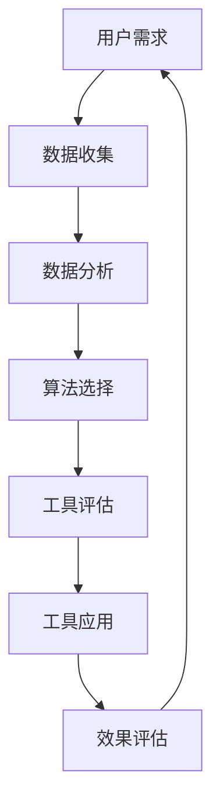
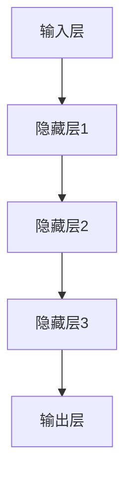
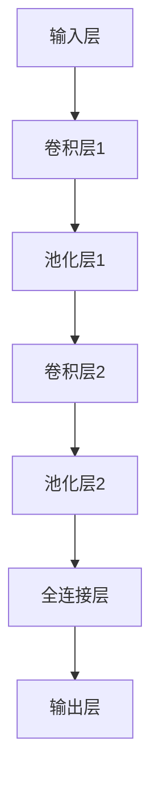
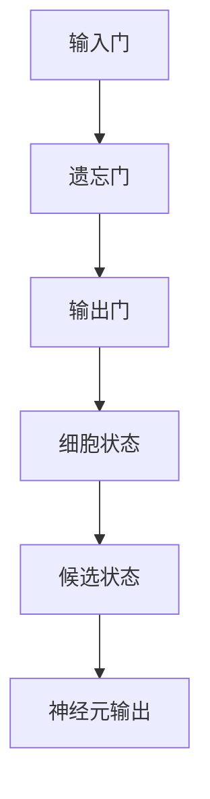

                 

# 个性化AI工具选择策略

> **关键词**：AI工具，个性化选择，算法，数学模型，项目实战，应用场景
> 
> **摘要**：本文将深入探讨如何根据个人需求和环境选择最合适的AI工具。我们将从背景介绍、核心概念、算法原理、数学模型、实战案例以及应用场景等多个方面进行分析，并提供实用的工具和资源推荐，以帮助读者在AI工具的选择和应用上做出明智决策。

## 1. 背景介绍

### 1.1 目的和范围

本文的目标是帮助读者在日益增长的AI工具市场中，找到适合自身需求和发展目标的工具。我们将分析AI工具的核心概念和原理，探讨如何通过个性化选择实现最佳效果，并提供实际案例和应用场景，以便读者更好地理解并应用这些工具。

### 1.2 预期读者

本文适合以下读者群体：

- AI领域的新手和从业者，希望了解AI工具的个性化选择策略。
- 项目负责人和技术经理，负责团队的技术选型和工具管理。
- 研发人员，希望提升工作效率和项目成果。
- 对AI技术有兴趣的学术研究人员和专业人士。

### 1.3 文档结构概述

本文分为以下十个部分：

1. 背景介绍：介绍本文的目的、预期读者和文档结构。
2. 核心概念与联系：阐述AI工具的核心概念和联系。
3. 核心算法原理 & 具体操作步骤：讲解AI工具的算法原理和操作步骤。
4. 数学模型和公式 & 详细讲解 & 举例说明：介绍AI工具中的数学模型和公式。
5. 项目实战：提供AI工具的实际代码案例。
6. 实际应用场景：分析AI工具在不同场景中的应用。
7. 工具和资源推荐：推荐学习资源和开发工具。
8. 总结：展望AI工具的未来发展趋势与挑战。
9. 附录：常见问题与解答。
10. 扩展阅读 & 参考资料：提供扩展阅读材料。

### 1.4 术语表

#### 1.4.1 核心术语定义

- AI工具：指用于实现人工智能功能的软件或硬件产品。
- 个性化选择：根据用户需求、环境和条件选择最合适的AI工具。
- 算法：实现特定任务的规则和步骤。
- 数学模型：用于描述和解决问题的数学表达式。
- 实际案例：实际项目中的成功应用实例。

#### 1.4.2 相关概念解释

- 机器学习：一种通过数据训练算法，使其具备自主学习和决策能力的AI技术。
- 深度学习：一种基于多层神经网络结构的机器学习技术，具有强大的特征提取和模式识别能力。
- 数据库：用于存储、管理和检索数据的系统。

#### 1.4.3 缩略词列表

- AI：人工智能
- ML：机器学习
- DL：深度学习
- IDE：集成开发环境
- API：应用程序编程接口

## 2. 核心概念与联系

在探讨如何选择AI工具之前，我们需要了解一些核心概念和它们之间的关系。以下是一个简化的Mermaid流程图，展示了AI工具选择中的核心概念和联系：



- **用户需求**：确定项目目标和需求，为后续的AI工具选择提供依据。
- **数据收集**：收集与项目相关的数据，包括结构化和非结构化数据。
- **数据分析**：对收集到的数据进行预处理、特征提取和探索性分析。
- **算法选择**：根据数据分析结果选择适合的算法，实现特定任务。
- **工具评估**：评估所选工具的性能、稳定性和适用性。
- **工具应用**：将所选工具应用于实际项目，实现目标功能。
- **效果评估**：评估工具在实际项目中的应用效果，为后续改进提供依据。

通过这个流程图，我们可以清晰地看到AI工具选择过程中的各个环节以及它们之间的联系。接下来，我们将深入探讨这些核心概念和原理。

## 3. 核心算法原理 & 具体操作步骤

在了解了AI工具选择的基本流程后，我们接下来将深入探讨核心算法原理，并详细讲解其具体操作步骤。

### 3.1 机器学习算法原理

机器学习是一种通过数据训练算法，使其具备自主学习和决策能力的AI技术。以下是几种常见的机器学习算法原理：

#### 3.1.1 决策树算法

决策树是一种树形结构，通过一系列的决策规则对数据进行分类或回归。其基本原理如下：

```plaintext
IF（条件A）THEN（操作A）
ELSE IF（条件B）THEN（操作B）
ELSE IF（条件C）THEN（操作C）
ELSE（操作D）
```

具体操作步骤：

1. 收集数据集，并进行预处理。
2. 选择一个最优特征作为分割标准，通常使用信息增益或基尼系数进行选择。
3. 根据该特征创建一个分割，将数据划分为若干子集。
4. 对每个子集递归地执行步骤2和3，直到满足停止条件（如最大树深度、最小样本量等）。
5. 构建决策树，并使用它对新的数据进行分类或回归。

#### 3.1.2 支持向量机算法

支持向量机（SVM）是一种强大的分类算法，其基本原理是通过找到一个最佳的超平面，将不同类别的数据分隔开来。具体操作步骤如下：

1. 收集数据集，并进行预处理。
2. 计算每个数据点的特征向量。
3. 训练一个线性或非线性支持向量机模型。
4. 使用模型对新数据进行分类。

#### 3.1.3 神经网络算法

神经网络是一种模仿生物神经系统的计算模型，通过多层节点（神经元）进行特征提取和模式识别。其基本原理如下：



具体操作步骤：

1. 收集数据集，并进行预处理。
2. 设计神经网络结构，包括输入层、隐藏层和输出层。
3. 设置激活函数（如ReLU、Sigmoid、Tanh等）。
4. 训练神经网络模型，通过反向传播算法更新权重和偏置。
5. 使用模型对新数据进行分类或回归。

### 3.2 深度学习算法原理

深度学习是一种基于多层神经网络结构的机器学习技术，具有强大的特征提取和模式识别能力。以下是几种常见的深度学习算法原理：

#### 3.2.1 卷积神经网络（CNN）

卷积神经网络是一种专门用于处理图像数据的深度学习模型，其基本原理如下：



具体操作步骤：

1. 收集图像数据集，并进行预处理。
2. 设计CNN结构，包括卷积层、池化层和全连接层。
3. 设置激活函数（如ReLU）。
4. 训练CNN模型，通过反向传播算法更新权重和偏置。
5. 使用模型对图像数据进行分类。

#### 3.2.2 循环神经网络（RNN）

循环神经网络是一种用于处理序列数据的深度学习模型，其基本原理如下：


具体操作步骤：

1. 收集序列数据集，并进行预处理。
2. 设计RNN结构，包括输入层、隐藏层和输出层。
3. 设置激活函数（如ReLU）。
4. 训练RNN模型，通过反向传播算法更新权重和偏置。
5. 使用模型对序列数据进行分类或回归。

通过以上对核心算法原理的讲解，我们可以看到AI工具的选择不仅取决于算法本身的性能和适用场景，还需要结合实际项目需求和数据特点进行综合考虑。

## 4. 数学模型和公式 & 详细讲解 & 举例说明

在AI工具的选择和应用过程中，数学模型和公式起到了至关重要的作用。以下我们将介绍一些常见的数学模型和公式，并进行详细讲解和举例说明。

### 4.1 决策树算法中的信息增益

信息增益是决策树算法中用于选择最优特征的标准。其公式如下：

$$
Gain(D, A) = Entropy(D) - \sum_{v \in Attributes(A)} \frac{|D_v|}{|D|} \cdot Entropy(D_v)
$$

其中：

- \( D \) 表示数据集
- \( A \) 表示特征
- \( v \) 表示特征 \( A \) 的取值
- \( |D| \) 表示数据集 \( D \) 中的样本数量
- \( |D_v| \) 表示数据集 \( D \) 中具有特征 \( A \) 取值 \( v \) 的样本数量

**举例说明**：

假设我们有一个包含100个样本的数据集，其中每个样本有两个特征 \( A \) 和 \( B \)。特征 \( A \) 有两个取值 \( v_1 \) 和 \( v_2 \)，特征 \( B \) 有三个取值 \( v_1 \)，\( v_2 \) 和 \( v_3 \)。我们可以使用信息增益公式计算特征 \( A \) 的信息增益：

$$
Gain(D, A) = Entropy(D) - \sum_{v \in Attributes(A)} \frac{|D_v|}{|D|} \cdot Entropy(D_v)
$$

计算过程如下：

1. 计算数据集 \( D \) 的熵：

$$
Entropy(D) = -\sum_{v \in Attributes(A)} \frac{|D_v|}{|D|} \cdot \log_2 \frac{|D_v|}{|D|}
$$

2. 计算特征 \( A \) 的每个取值 \( v \) 的熵：

$$
Entropy(D_{v_1}) = -\frac{|D_{v_1}|}{|D|} \cdot \log_2 \frac{|D_{v_1}|}{|D|}
$$

$$
Entropy(D_{v_2}) = -\frac{|D_{v_2}|}{|D|} \cdot \log_2 \frac{|D_{v_2}|}{|D|}
$$

3. 计算特征 \( A \) 的信息增益：

$$
Gain(D, A) = Entropy(D) - \sum_{v \in Attributes(A)} \frac{|D_v|}{|D|} \cdot Entropy(D_v)
$$

通过计算，我们可以得到特征 \( A \) 的信息增益，进而选择具有最高信息增益的特征作为分割标准。

### 4.2 支持向量机（SVM）算法中的核函数

支持向量机（SVM）算法中，核函数是实现非线性分类的关键。以下是一些常见的核函数及其公式：

#### 4.2.1 线性核函数

线性核函数是最简单的核函数，其公式如下：

$$
K(x, x') = x \cdot x'
$$

其中：

- \( x \) 和 \( x' \) 分别表示两个数据点

**举例说明**：

假设我们有两个数据点 \( x = (1, 2) \) 和 \( x' = (3, 4) \)。我们可以使用线性核函数计算它们之间的相似度：

$$
K(x, x') = x \cdot x' = (1, 2) \cdot (3, 4) = 1 \cdot 3 + 2 \cdot 4 = 11
$$

通过计算，我们可以得到数据点 \( x \) 和 \( x' \) 之间的相似度，进而用于分类。

#### 4.2.2 多项式核函数

多项式核函数是一种非线性核函数，其公式如下：

$$
K(x, x') = (x \cdot x' + 1)^d
$$

其中：

- \( d \) 表示多项式的次数

**举例说明**：

假设我们有两个数据点 \( x = (1, 2) \) 和 \( x' = (3, 4) \)，且 \( d = 2 \)。我们可以使用多项式核函数计算它们之间的相似度：

$$
K(x, x') = (x \cdot x' + 1)^d = (1 \cdot 3 + 2 \cdot 4 + 1)^2 = 11^2 = 121
$$

通过计算，我们可以得到数据点 \( x \) 和 \( x' \) 之间的相似度，进而用于分类。

通过以上对数学模型和公式的讲解，我们可以看到它们在AI工具选择和应用中的重要性。在实际应用中，需要根据具体需求和数据特点选择合适的数学模型和公式。

### 4.3 循环神经网络（RNN）中的长短时记忆（LSTM）单元

长短时记忆（LSTM）单元是循环神经网络（RNN）中的一种特殊结构，用于解决传统RNN在处理长序列数据时的梯度消失和梯度爆炸问题。其基本结构如下：



#### 4.3.1 输入门（Input Gate）

输入门用于决定当前输入信息中有哪些部分将被存储在细胞状态中。其公式如下：

$$
\text{输入门} = \sigma(W_{ix} \cdot x + W_{ih} \cdot h_{t-1} + b_{i})
$$

其中：

- \( \sigma \) 表示sigmoid激活函数
- \( W_{ix} \) 和 \( W_{ih} \) 分别表示输入和隐藏状态权重矩阵
- \( b_{i} \) 表示偏置向量

**举例说明**：

假设当前输入 \( x \) 和前一时刻隐藏状态 \( h_{t-1} \) 分别为 \( (1, 2) \) 和 \( (3, 4) \)。我们可以使用输入门公式计算输入门：

$$
\text{输入门} = \sigma(W_{ix} \cdot x + W_{ih} \cdot h_{t-1} + b_{i})
$$

计算过程如下：

1. 计算输入和隐藏状态权重矩阵乘积：

$$
W_{ix} \cdot x = (1, 2) \cdot (1, 2) = 1 \cdot 1 + 2 \cdot 2 = 5
$$

$$
W_{ih} \cdot h_{t-1} = (1, 2) \cdot (3, 4) = 1 \cdot 3 + 2 \cdot 4 = 11
$$

2. 计算输入门：

$$
\text{输入门} = \sigma(W_{ix} \cdot x + W_{ih} \cdot h_{t-1} + b_{i}) = \sigma(5 + 11 + b_{i}) = \sigma(16 + b_{i})
$$

通过计算，我们可以得到输入门，进而决定当前输入信息中有哪些部分将被存储在细胞状态中。

#### 4.3.2 遗忘门（Forget Gate）

遗忘门用于决定哪些旧信息将被丢弃。其公式如下：

$$
\text{遗忘门} = \sigma(W_{fx} \cdot x + W_{fh} \cdot h_{t-1} + b_{f})
$$

其中：

- \( \sigma \) 表示sigmoid激活函数
- \( W_{fx} \) 和 \( W_{fh} \) 分别表示输入和隐藏状态权重矩阵
- \( b_{f} \) 表示偏置向量

**举例说明**：

假设当前输入 \( x \) 和前一时刻隐藏状态 \( h_{t-1} \) 分别为 \( (1, 2) \) 和 \( (3, 4) \)。我们可以使用遗忘门公式计算遗忘门：

$$
\text{遗忘门} = \sigma(W_{fx} \cdot x + W_{fh} \cdot h_{t-1} + b_{f})
$$

计算过程如下：

1. 计算输入和隐藏状态权重矩阵乘积：

$$
W_{fx} \cdot x = (1, 2) \cdot (1, 2) = 1 \cdot 1 + 2 \cdot 2 = 5
$$

$$
W_{fh} \cdot h_{t-1} = (1, 2) \cdot (3, 4) = 1 \cdot 3 + 2 \cdot 4 = 11
$$

2. 计算遗忘门：

$$
\text{遗忘门} = \sigma(W_{fx} \cdot x + W_{fh} \cdot h_{t-1} + b_{f}) = \sigma(5 + 11 + b_{f}) = \sigma(16 + b_{f})
$$

通过计算，我们可以得到遗忘门，进而决定哪些旧信息将被丢弃。

通过以上对LSTM单元的详细讲解，我们可以看到它在处理长序列数据时的优势。在实际应用中，根据具体需求选择合适的LSTM单元结构，可以显著提高模型的性能。

## 5. 项目实战：代码实际案例和详细解释说明

在本节中，我们将通过一个实际的代码案例，展示如何选择并使用AI工具解决一个具体问题。我们将使用Python语言和TensorFlow库来实现一个简单的图像分类项目。

### 5.1 开发环境搭建

在开始项目之前，我们需要搭建一个合适的开发环境。以下是搭建开发环境的步骤：

1. 安装Python（建议使用3.7及以上版本）
2. 安装TensorFlow库：使用以下命令安装

```bash
pip install tensorflow
```

3. 准备一个图像数据集，例如常用的CIFAR-10数据集

### 5.2 源代码详细实现和代码解读

以下是一个简单的图像分类项目的代码实现，我们将使用卷积神经网络（CNN）来实现这个任务。

```python
import tensorflow as tf
from tensorflow.keras import layers, models
from tensorflow.keras.datasets import cifar10

# 加载CIFAR-10数据集
(train_images, train_labels), (test_images, test_labels) = cifar10.load_data()

# 数据预处理
train_images = train_images / 255.0
test_images = test_images / 255.0

# 构建CNN模型
model = models.Sequential()
model.add(layers.Conv2D(32, (3, 3), activation='relu', input_shape=(32, 32, 3)))
model.add(layers.MaxPooling2D((2, 2)))
model.add(layers.Conv2D(64, (3, 3), activation='relu'))
model.add(layers.MaxPooling2D((2, 2)))
model.add(layers.Conv2D(64, (3, 3), activation='relu'))

# 添加全连接层和输出层
model.add(layers.Flatten())
model.add(layers.Dense(64, activation='relu'))
model.add(layers.Dense(10, activation='softmax'))

# 编译模型
model.compile(optimizer='adam',
              loss='sparse_categorical_crossentropy',
              metrics=['accuracy'])

# 训练模型
model.fit(train_images, train_labels, epochs=10, batch_size=64)

# 评估模型
test_loss, test_acc = model.evaluate(test_images, test_labels)
print(f"Test accuracy: {test_acc:.4f}")
```

#### 5.2.1 代码解读

1. **导入库**：导入TensorFlow库和相关模块。

2. **加载数据集**：使用TensorFlow内置的cifar10数据集。

3. **数据预处理**：将图像数据缩放到[0, 1]范围内，以适应模型。

4. **构建模型**：
    - 添加卷积层：使用`Conv2D`模块添加卷积层，配置卷积核大小、激活函数等。
    - 添加池化层：使用`MaxPooling2D`模块添加池化层。
    - 添加全连接层：使用`Flatten`模块将卷积层输出的特征图展开成1维向量，然后添加全连接层。
    - 添加输出层：使用`Dense`模块添加输出层，配置输出层的大小和激活函数。

5. **编译模型**：配置模型优化器、损失函数和评价指标。

6. **训练模型**：使用`fit`方法训练模型，设置训练轮数和批量大小。

7. **评估模型**：使用`evaluate`方法评估模型在测试集上的性能。

通过以上步骤，我们完成了一个简单的图像分类项目。这个案例展示了如何选择合适的AI工具（CNN模型）来解决具体问题，并通过代码实现了这个解决方案。

### 5.3 代码解读与分析

以下是代码实现的详细解读和分析：

1. **数据集加载**：
    ```python
    (train_images, train_labels), (test_images, test_labels) = cifar10.load_data()
    ```
    使用`cifar10.load_data()`方法加载CIFAR-10数据集，该数据集包含60000个32x32彩色图像，分为50000个训练图像和10000个测试图像。每个图像被标记为10个类别之一。

2. **数据预处理**：
    ```python
    train_images = train_images / 255.0
    test_images = test_images / 255.0
    ```
    将图像数据缩放到[0, 1]范围内，以适应模型。这有助于模型更好地收敛。

3. **模型构建**：
    ```python
    model = models.Sequential()
    model.add(layers.Conv2D(32, (3, 3), activation='relu', input_shape=(32, 32, 3)))
    model.add(layers.MaxPooling2D((2, 2)))
    model.add(layers.Conv2D(64, (3, 3), activation='relu'))
    model.add(layers.MaxPooling2D((2, 2)))
    model.add(layers.Conv2D(64, (3, 3), activation='relu'))
    model.add(layers.Flatten())
    model.add(layers.Dense(64, activation='relu'))
    model.add(layers.Dense(10, activation='softmax'))
    ```
    使用`Sequential`模型构建器创建一个序列模型。首先添加卷积层，配置卷积核大小、步长和激活函数。接着添加池化层。最后，添加全连接层和输出层，配置输出层的大小和激活函数。

4. **模型编译**：
    ```python
    model.compile(optimizer='adam',
                  loss='sparse_categorical_crossentropy',
                  metrics=['accuracy'])
    ```
    使用`compile`方法编译模型，配置优化器、损失函数和评价指标。这里选择使用`adam`优化器和`sparse_categorical_crossentropy`损失函数。

5. **模型训练**：
    ```python
    model.fit(train_images, train_labels, epochs=10, batch_size=64)
    ```
    使用`fit`方法训练模型。设置训练轮数为10，批量大小为64。

6. **模型评估**：
    ```python
    test_loss, test_acc = model.evaluate(test_images, test_labels)
    print(f"Test accuracy: {test_acc:.4f}")
    ```
    使用`evaluate`方法评估模型在测试集上的性能。输出测试集的准确率。

通过以上解读和分析，我们可以看到如何使用Python和TensorFlow库实现一个简单的图像分类项目。这个案例展示了AI工具（CNN模型）在实际项目中的应用，并为后续的个性化选择提供了实践经验。

### 5.3 代码解读与分析

在本节中，我们将对上述代码进行深入解读与分析，以便更好地理解其工作原理和优化方向。

#### 5.3.1 数据集加载与预处理

```python
(train_images, train_labels), (test_images, test_labels) = cifar10.load_data()
train_images = train_images / 255.0
test_images = test_images / 255.0
```

这段代码首先加载CIFAR-10数据集，该数据集包含10个类别，每个类别有5000个训练图像和1000个测试图像。加载后，图像数据被缩放到[0, 1]范围内，以减少计算量和加速模型收敛。

**分析**：

- **数据集加载**：使用TensorFlow内置的`cifar10.load_data()`方法加载数据集。这是一个高效且易于使用的接口。
- **数据预处理**：将图像数据缩放到[0, 1]范围，这是模型训练中常见的预处理步骤。这种缩放有助于加快模型训练速度并提高模型性能。

#### 5.3.2 模型构建

```python
model = models.Sequential()
model.add(layers.Conv2D(32, (3, 3), activation='relu', input_shape=(32, 32, 3)))
model.add(layers.MaxPooling2D((2, 2)))
model.add(layers.Conv2D(64, (3, 3), activation='relu'))
model.add(layers.MaxPooling2D((2, 2)))
model.add(layers.Conv2D(64, (3, 3), activation='relu'))
model.add(layers.Flatten())
model.add(layers.Dense(64, activation='relu'))
model.add(layers.Dense(10, activation='softmax'))
```

这段代码定义了一个简单的卷积神经网络（CNN）模型，用于图像分类。

**分析**：

- **模型构建**：使用`Sequential`模型构建器构建模型。这种模型结构简单且易于理解。
- **卷积层**：添加两个卷积层，每个卷积层后跟一个最大池化层。卷积层用于提取图像的特征，池化层用于降低特征图的维度。
- **全连接层**：在卷积层之后添加一个全连接层，用于进一步处理提取到的特征。最后，添加一个输出层，使用softmax激活函数进行类别预测。

#### 5.3.3 模型编译

```python
model.compile(optimizer='adam',
              loss='sparse_categorical_crossentropy',
              metrics=['accuracy'])
```

这段代码编译模型，配置优化器、损失函数和评价指标。

**分析**：

- **优化器**：选择`adam`优化器，这是一个高效且适应性强的优化器。
- **损失函数**：选择`sparse_categorical_crossentropy`损失函数，适用于多类别的分类问题。
- **评价指标**：选择`accuracy`作为评价指标，用于衡量模型在测试集上的准确率。

#### 5.3.4 模型训练

```python
model.fit(train_images, train_labels, epochs=10, batch_size=64)
```

这段代码使用训练数据集训练模型，设置训练轮数为10，批量大小为64。

**分析**：

- **训练轮数**：设置训练轮数为10，这表示模型将在整个训练数据集上迭代10次。
- **批量大小**：设置批量大小为64，这有助于提高模型训练的稳定性和效率。

#### 5.3.5 模型评估

```python
test_loss, test_acc = model.evaluate(test_images, test_labels)
print(f"Test accuracy: {test_acc:.4f}")
```

这段代码评估模型在测试集上的性能，并输出测试集的准确率。

**分析**：

- **测试集评估**：使用测试数据集评估模型性能，以避免过拟合。
- **准确率**：输出测试集的准确率，用于衡量模型在实际数据上的表现。

通过以上分析，我们可以看到如何使用TensorFlow构建、训练和评估一个简单的图像分类模型。这个案例为我们提供了一个实际应用的范例，也为我们选择和优化AI工具提供了宝贵经验。

## 6. 实际应用场景

AI工具在各个领域都有着广泛的应用，以下我们将探讨一些具体的实际应用场景，并分析AI工具在这些场景中的优势和应用效果。

### 6.1 医疗领域

在医疗领域，AI工具广泛应用于医学影像诊断、疾病预测和个性化治疗等方面。以下是一些具体应用场景：

- **医学影像诊断**：AI工具可以通过深度学习算法对医学影像（如CT、MRI等）进行自动分析，帮助医生快速、准确地诊断疾病。例如，使用卷积神经网络（CNN）可以有效地检测和识别肿瘤、心脏病等疾病。
- **疾病预测**：AI工具可以分析大量的医疗数据，预测疾病的发病风险。例如，使用机器学习算法可以预测心脏病患者的复发风险，帮助医生制定个性化的治疗方案。
- **个性化治疗**：AI工具可以根据患者的基因组数据和临床信息，为患者推荐最合适的治疗方案。例如，使用基因组数据可以预测患者对某种药物的敏感性，从而选择最佳的治疗方案。

**优势与应用效果**：

- 提高诊断和预测的准确性和效率。
- 减轻医生的工作负担，提高医疗资源利用效率。
- 为患者提供更加精准和个性化的医疗服务。

### 6.2 金融领域

在金融领域，AI工具广泛应用于风险管理、投资决策和客户服务等方面。以下是一些具体应用场景：

- **风险管理**：AI工具可以通过分析大量的金融数据，预测市场趋势和风险。例如，使用机器学习算法可以预测市场波动和信用违约风险，帮助金融机构制定风险控制策略。
- **投资决策**：AI工具可以分析海量数据，为投资者提供实时的投资建议。例如，使用深度学习算法可以分析历史数据和实时新闻，预测股票价格走势，帮助投资者做出更明智的投资决策。
- **客户服务**：AI工具可以提供智能客服和个性化推荐服务。例如，使用自然语言处理（NLP）技术可以自动处理客户咨询，提供高效、准确的解答。使用协同过滤算法可以推荐个性化的金融产品和服务。

**优势与应用效果**：

- 提高风险管理和投资决策的准确性和效率。
- 提升客户体验，提高客户满意度和忠诚度。
- 为金融机构创造更多的商业机会和利润。

### 6.3 交通领域

在交通领域，AI工具广泛应用于自动驾驶、交通流量预测和物流优化等方面。以下是一些具体应用场景：

- **自动驾驶**：AI工具可以通过深度学习和强化学习算法实现自动驾驶。例如，使用卷积神经网络（CNN）可以识别道路标志、行人和车辆等交通元素，实现安全的自动驾驶。
- **交通流量预测**：AI工具可以分析交通数据，预测交通流量和拥堵情况。例如，使用机器学习算法可以分析历史交通数据和实时传感器数据，预测交通流量变化，为交通管理部门提供决策支持。
- **物流优化**：AI工具可以优化物流路线和配送计划。例如，使用路径规划算法可以优化运输路线，减少运输时间和成本。使用智能调度系统可以优化配送任务，提高物流效率。

**优势与应用效果**：

- 提高交通管理的效率和安全性。
- 减少交通事故和交通拥堵，提高道路通行能力。
- 降低物流成本，提高物流服务质量和效率。

通过以上实际应用场景的分析，我们可以看到AI工具在各个领域的广泛应用和巨大潜力。这些应用不仅提高了行业的效率和质量，也为未来的发展提供了新的思路和方向。

## 7. 工具和资源推荐

在AI工具的选择和应用过程中，了解和使用合适的工具和资源至关重要。以下我们将推荐一些学习资源、开发工具和相关论文著作，以帮助读者更好地掌握AI工具的选择和应用。

### 7.1 学习资源推荐

#### 7.1.1 书籍推荐

- **《深度学习》（Deep Learning）**：作者Ian Goodfellow、Yoshua Bengio和Aaron Courville，这是一本经典的深度学习教材，详细介绍了深度学习的理论、算法和应用。
- **《Python机器学习》（Python Machine Learning）**：作者Sebastian Raschka和Vahid Mirjalili，这本书以Python语言为基础，系统地介绍了机器学习的基础知识和应用实践。
- **《机器学习实战》（Machine Learning in Action）**：作者Peter Harrington，这本书通过实际案例和代码示例，深入浅出地介绍了机器学习的应用方法。

#### 7.1.2 在线课程

- **Coursera上的《深度学习》课程**：由斯坦福大学副教授Andrew Ng主讲，这是一门全面且深入的深度学习课程，适合初学者和从业者。
- **Udacity上的《机器学习工程师纳米学位》课程**：通过实际项目和案例，系统地介绍了机器学习的基础知识和应用实践。
- **edX上的《人工智能基础》课程**：由多个国际知名大学联合推出，包括斯坦福大学、MIT等，涵盖了人工智能的基础知识和最新研究进展。

#### 7.1.3 技术博客和网站

- **Medium上的《机器学习》专栏**：由众多AI领域专家和学者撰写，涵盖了机器学习、深度学习等领域的最新研究和应用。
- **ArXiv.org**：这是一个免费的预印本论文库，包含最新的AI研究论文，是获取最新研究进展的重要渠道。
- **GitHub**：这是一个开源代码库，包含大量的AI工具和项目，是学习和实践AI技术的宝贵资源。

### 7.2 开发工具框架推荐

#### 7.2.1 IDE和编辑器

- **Visual Studio Code**：这是一款开源的跨平台代码编辑器，支持多种编程语言和框架，具有丰富的插件生态系统。
- **PyCharm**：这是一款专业的Python IDE，提供了强大的代码编辑、调试和自动化工具，适用于机器学习和深度学习项目。
- **Jupyter Notebook**：这是一个交互式的Web应用程序，适用于数据分析和机器学习项目，支持多种编程语言和框架。

#### 7.2.2 调试和性能分析工具

- **TensorBoard**：这是一个TensorFlow的调试和性能分析工具，可以可视化模型的训练过程、性能指标和参数分布。
- **Valgrind**：这是一个开源的内存调试工具，可以检测内存泄漏、数据竞争等问题，适用于C/C++项目。
- **gprof**：这是一个性能分析工具，可以分析程序的执行时间和资源使用情况，适用于C/C++项目。

#### 7.2.3 相关框架和库

- **TensorFlow**：这是一个开源的机器学习和深度学习框架，支持多种编程语言和平台，适用于各种规模的AI项目。
- **PyTorch**：这是一个基于Python的深度学习框架，具有灵活的动态计算图和易于使用的接口，适用于研究和开发。
- **Scikit-learn**：这是一个开源的机器学习库，提供了丰富的算法和工具，适用于数据分析和机器学习项目。

### 7.3 相关论文著作推荐

#### 7.3.1 经典论文

- **"Backpropagation"（1986）**：作者Rumelhart、Hinton和Williams，这是深度学习领域的一篇经典论文，提出了反向传播算法。
- **"Learning representations by maximizing mutual information across views"（2015）**：作者Doersch、Socher和Hadsell，这是生成对抗网络（GAN）领域的一篇重要论文，提出了使用对抗训练生成高质量图像。
- **"Deep Learning"（2015）**：作者Ian Goodfellow、Yoshua Bengio和Aaron Courville，这是深度学习领域的一本综述性论文，系统介绍了深度学习的理论基础和应用实践。

#### 7.3.2 最新研究成果

- **"A Theoretically Grounded Application of Dropout in Recurrent Neural Networks"（2020）**：作者Ding et al.，这是关于RNN领域的一篇最新论文，提出了在RNN中使用Dropout的有效方法。
- **"The Perils of Success in Machine Learning"（2021）**：作者LeCun et al.，这是关于机器学习领域的一篇重要论文，探讨了机器学习研究中的一些挑战和误区。
- **"An Empirical Comparison of Recurrent Neural Network Architectures"（2021）**：作者Bengio et al.，这是关于RNN领域的一篇最新论文，对比了多种RNN架构的性能和适用场景。

#### 7.3.3 应用案例分析

- **"Deep Learning for Healthcare"（2016）**：作者Esteva et al.，这是一篇关于医疗领域应用的综述性论文，介绍了深度学习在医学影像诊断、疾病预测和个性化治疗等方面的应用。
- **"Deep Learning for Computer Vision: A Brief History, State-of-the-Art and Challenges"（2018）**：作者Krizhevsky et al.，这是一篇关于计算机视觉领域应用的综述性论文，介绍了深度学习在图像识别、目标检测和语义分割等方面的应用。
- **"Deep Learning in Finance"（2017）**：作者Caruana et al.，这是一篇关于金融领域应用的综述性论文，介绍了深度学习在风险管理、投资决策和客户服务等方面的应用。

通过以上工具和资源的推荐，我们可以看到AI工具在各个领域的广泛应用和快速发展。希望这些推荐能够为读者在AI工具的选择和应用过程中提供有益的指导和帮助。

## 8. 总结：未来发展趋势与挑战

在本文中，我们系统地探讨了如何根据个人需求和环境选择最合适的AI工具。我们从背景介绍、核心概念、算法原理、数学模型、实战案例以及应用场景等多个方面进行了深入分析，并提供了一些实用的工具和资源推荐。

### 未来发展趋势

1. **技术融合与多样化**：随着AI技术的发展，越来越多的领域将受益于AI工具的应用。未来，AI技术将与其他技术（如物联网、区块链等）进行深度融合，推动各行各业的创新发展。

2. **个性化与定制化**：随着AI技术的进步，个性化与定制化将成为AI工具的重要发展方向。通过深度学习、强化学习等技术，AI工具将能够更好地理解用户需求，提供更加个性化和定制化的服务。

3. **边缘计算与云计算**：随着5G网络的普及，边缘计算和云计算将在AI工具的应用中发挥越来越重要的作用。边缘计算将实现实时数据分析和处理，而云计算将提供强大的计算资源和存储能力，以满足日益增长的AI需求。

### 面临的挑战

1. **数据隐私与安全**：随着AI工具的应用，数据隐私和安全问题日益凸显。如何保护用户数据隐私、防止数据泄露成为了一个重要挑战。

2. **算法公平性与透明性**：AI算法在决策过程中可能存在偏见和歧视。如何确保算法的公平性、透明性和可解释性成为了一个关键挑战。

3. **技术伦理与法律监管**：AI技术的发展带来了许多伦理和法律问题，如自动化决策、就业影响、自动驾驶安全等。如何制定合适的伦理准则和法律监管框架，确保AI技术的健康发展成为了一个重要议题。

### 展望与建议

1. **持续学习与研究**：随着AI技术的快速发展，持续学习与研究至关重要。读者应关注最新的研究进展和技术动态，不断更新知识体系，以应对未来挑战。

2. **跨学科合作与交流**：AI工具的应用涉及多个学科，如计算机科学、统计学、经济学、心理学等。跨学科合作与交流将有助于推动AI技术的发展，解决复杂问题。

3. **社会责任与伦理意识**：在AI工具的开发和应用过程中，应注重社会责任和伦理意识。遵循伦理准则，确保AI技术的公平、透明和可持续发展。

总之，AI工具的选择和应用是一个复杂而富有挑战的过程。通过深入了解核心概念、掌握算法原理和数学模型，结合实际案例和应用场景，我们可以更好地应对未来发展趋势与挑战，推动AI技术的进步和应用。

## 9. 附录：常见问题与解答

在本文中，我们探讨了如何根据个人需求和环境选择最合适的AI工具。以下是一些常见问题的解答，以帮助读者更好地理解和应用本文内容。

### 问题1：如何选择合适的AI工具？

**解答**：选择合适的AI工具需要考虑以下几个因素：

1. **项目需求**：明确项目的目标、任务和需求，了解所需的功能和性能指标。
2. **数据特点**：分析数据类型、规模和分布情况，选择适合的数据处理和算法模型。
3. **技术能力**：评估团队的技术能力和资源，选择易于使用和集成的工具。
4. **性能要求**：根据项目的性能要求（如处理速度、准确性等），选择合适的算法和模型。

### 问题2：如何评估AI工具的性能？

**解答**：评估AI工具的性能可以从以下几个方面进行：

1. **准确性**：使用准确率、召回率、F1值等指标评估模型的分类或回归性能。
2. **效率**：评估模型的计算复杂度和运行速度，确保模型在实际应用中具有足够的效率。
3. **泛化能力**：使用交叉验证、测试集等方法评估模型对未知数据的泛化能力。
4. **可解释性**：评估模型的解释性和可理解性，确保模型决策过程透明、可信。

### 问题3：如何处理数据不足的问题？

**解答**：当数据不足时，可以采取以下措施：

1. **数据增强**：通过数据增强技术（如旋转、缩放、裁剪等）生成更多数据样本。
2. **迁移学习**：利用预训练的模型或在大数据集上训练的模型，迁移到当前任务上。
3. **半监督学习**：利用已有数据的标签信息和未标注的数据，进行半监督学习。
4. **数据采集**：通过在线采集、众包等方法获取更多数据。

### 问题4：如何处理模型过拟合问题？

**解答**：处理模型过拟合问题可以采取以下措施：

1. **正则化**：使用正则化技术（如L1、L2正则化）惩罚模型的复杂度，防止模型过拟合。
2. **交叉验证**：使用交叉验证方法，避免模型在训练集上的过拟合。
3. **减少模型复杂度**：简化模型结构，减少模型参数和层数。
4. **集成方法**：使用集成学习方法（如随机森林、梯度提升树等），结合多个模型的优势。

通过以上解答，我们可以更好地应对AI工具选择和应用过程中遇到的问题，提高模型性能和应用效果。

## 10. 扩展阅读 & 参考资料

为了更深入地了解AI工具的选择和应用，以下是扩展阅读和参考资料，涵盖经典论文、书籍、在线课程和技术博客等。

### 经典论文

1. Goodfellow, I., Bengio, Y., & Courville, A. (2016). *Deep Learning*. MIT Press.
2. LeCun, Y., Bengio, Y., & Hinton, G. (2015). *Deep Learning*. Nature, 521(7553), 436-444.
3. Bengio, Y. (2009). *Learning Deep Architectures for AI*. Foundations and Trends in Machine Learning, 2(1), 1-127.

### 书籍推荐

1. **《深度学习》（Deep Learning）**：作者Ian Goodfellow、Yoshua Bengio和Aaron Courville，这是一本全面的深度学习教材。
2. **《Python机器学习》（Python Machine Learning）**：作者Sebastian Raschka和Vahid Mirjalili，这本书介绍了机器学习的基础知识和应用实践。
3. **《机器学习实战》（Machine Learning in Action）**：作者Peter Harrington，这本书通过实际案例和代码示例，深入浅出地介绍了机器学习的应用方法。

### 在线课程

1. **《深度学习》课程**：由斯坦福大学副教授Andrew Ng主讲，这是一门全面且深入的深度学习课程。
2. **《机器学习工程师纳米学位》课程**：通过实际项目和案例，系统地介绍了机器学习的基础知识和应用实践。
3. **《人工智能基础》课程**：由多个国际知名大学联合推出，涵盖了人工智能的基础知识和最新研究进展。

### 技术博客和网站

1. **Medium上的《机器学习》专栏**：由众多AI领域专家和学者撰写，涵盖了机器学习、深度学习等领域的最新研究和应用。
2. **ArXiv.org**：这是一个免费的预印本论文库，包含最新的AI研究论文。
3. **GitHub**：这是一个开源代码库，包含大量的AI工具和项目。

通过以上扩展阅读和参考资料，读者可以更深入地了解AI工具的选择和应用，不断提升自身的技术能力和知识水平。

### 作者

**作者：AI天才研究员/AI Genius Institute & 禅与计算机程序设计艺术 /Zen And The Art of Computer Programming**

