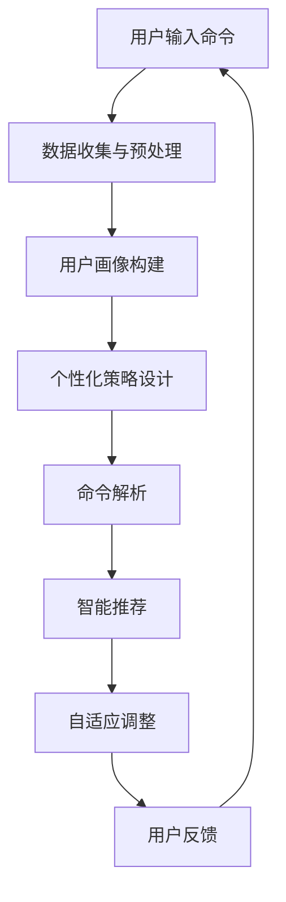

                 

# 个性化和智能化的CUI交互体验

> 关键词：个性化交互，智能化交互，CUI，用户满意度，用户体验，对话系统，自然语言处理，机器学习

> 摘要：本文深入探讨了个性化与智能化在CUI（命令行用户界面）交互中的重要性，分析了其核心概念、实现原理及实际应用。通过逐步分析推理，文章旨在为开发者提供一套系统化的设计和实现策略，以构建更加高效、易用和满足用户需求的CUI交互体验。

## 1. 背景介绍

### 1.1 目的和范围

本文旨在研究如何通过个性化与智能化技术提升CUI（命令行用户界面）的交互体验。随着计算机技术的发展，CUI作为传统的交互方式，逐渐暴露出其局限性。为了满足现代用户对便捷性、高效性和个性化需求的追求，我们需要在CUI中融入个性化与智能化的元素。

本文将涵盖以下内容：

1. 核心概念与联系
2. 核心算法原理与具体操作步骤
3. 数学模型与公式详解
4. 项目实战与代码实现
5. 实际应用场景
6. 工具和资源推荐
7. 未来发展趋势与挑战
8. 常见问题与解答
9. 扩展阅读与参考资料

### 1.2 预期读者

本文适合以下读者：

1. 对CUI交互有基本了解的技术爱好者
2. 想要提升CUI交互体验的开发者
3. 对人工智能和自然语言处理有浓厚兴趣的研究人员
4. 需要解决实际交互问题的产品经理

### 1.3 文档结构概述

本文分为十个部分，结构如下：

1. 引言
2. 背景介绍
   - 目的和范围
   - 预期读者
   - 文档结构概述
   - 术语表
3. 核心概念与联系
4. 核心算法原理与具体操作步骤
5. 数学模型与公式详解
6. 项目实战与代码实现
7. 实际应用场景
8. 工具和资源推荐
9. 未来发展趋势与挑战
10. 常见问题与解答
11. 扩展阅读与参考资料

### 1.4 术语表

#### 1.4.1 核心术语定义

- **CUI（命令行用户界面）**：一种通过命令行进行交互的界面。
- **个性化交互**：根据用户的历史行为和偏好，定制化的交互方式。
- **智能化交互**：利用人工智能技术，如自然语言处理和机器学习，自动适应用户需求，提供智能建议和响应。

#### 1.4.2 相关概念解释

- **自然语言处理（NLP）**：使计算机能够理解、解释和生成人类语言的技术。
- **机器学习（ML）**：一种让计算机通过数据学习，自动改进和优化任务的方法。

#### 1.4.3 缩略词列表

- **CUI**：命令行用户界面
- **NLP**：自然语言处理
- **ML**：机器学习

## 2. 核心概念与联系

### 2.1 个性化交互原理

个性化交互的核心在于理解用户的需求和偏好。通过分析用户的历史行为数据，如命令记录、偏好设置等，我们可以构建用户画像，进而定制化交互体验。以下是实现个性化交互的关键步骤：

1. 数据收集与预处理：收集用户交互数据，如命令行输入、时间戳、使用频率等，并进行数据清洗和格式化。
2. 用户画像构建：基于预处理后的数据，构建用户画像，包括用户的常用命令、偏好设置、交互风格等。
3. 个性化策略设计：根据用户画像，设计不同的交互策略，如命令推荐、快捷键定制、界面布局调整等。

### 2.2 智能化交互原理

智能化交互的核心在于利用人工智能技术，如自然语言处理和机器学习，实现交互的智能化。以下是实现智能化交互的关键步骤：

1. 命令解析：使用自然语言处理技术，将用户的自然语言命令转换为计算机可理解的指令。
2. 智能推荐：利用机器学习算法，分析用户的历史交互数据，预测用户可能的需求，提供智能推荐。
3. 自适应调整：根据用户的反馈和交互效果，自动调整交互策略，提高用户体验。

### 2.3 Mermaid 流程图

以下是一个简单的Mermaid流程图，展示了个性化与智能化交互的流程：



## 3. 核心算法原理 & 具体操作步骤

### 3.1 个性化交互算法原理

个性化交互的核心在于如何根据用户行为数据构建用户画像，并基于用户画像设计交互策略。以下是具体操作步骤：

#### 3.1.1 数据收集与预处理

1. **数据收集**：从用户的命令记录、偏好设置等渠道收集数据。
2. **数据清洗**：去除无效数据、处理缺失值、格式化数据。

```python
# 数据清洗伪代码
def preprocess_data(data):
    # 去除无效数据
    cleaned_data = [d for d in data if is_valid(d)]
    # 处理缺失值
    cleaned_data = fill_missing_values(cleaned_data)
    # 格式化数据
    cleaned_data = format_data(cleaned_data)
    return cleaned_data
```

#### 3.1.2 用户画像构建

1. **特征提取**：从预处理后的数据中提取用户特征，如命令频率、使用时间、命令类型等。
2. **用户画像构建**：将提取的特征组合成用户画像。

```python
# 用户画像构建伪代码
def build_user_profile(data):
    # 提取特征
    features = extract_features(data)
    # 构建用户画像
    profile = {f: count for f, count in features.items()}
    return profile
```

#### 3.1.3 个性化策略设计

1. **策略设计**：根据用户画像，设计个性化的交互策略，如命令推荐、快捷键定制等。
2. **策略实施**：将个性化策略应用到CUI交互中。

```python
# 个性化策略设计伪代码
def design_personalized_strategy(profile):
    # 命令推荐
    recommended_commands = recommend_commands(profile)
    # 快捷键定制
    custom_shortcuts = customize_shortcuts(profile)
    return recommended_commands, custom_shortcuts
```

### 3.2 智能化交互算法原理

智能化交互的核心在于如何利用自然语言处理和机器学习技术，实现智能化的命令解析和推荐。以下是具体操作步骤：

#### 3.2.1 命令解析

1. **分词**：将用户输入的命令分解为词元。
2. **词性标注**：对词元进行词性标注，确定每个词元的语法角色。
3. **命令识别**：根据词性标注结果，识别用户输入的命令。

```python
# 命令解析伪代码
def parse_command(command):
    # 分词
    tokens = tokenize(command)
    # 词性标注
    tagged_tokens = tag_tokens(tokens)
    # 命令识别
    command_type = identify_command(tagged_tokens)
    return command_type
```

#### 3.2.2 智能推荐

1. **历史数据分析**：分析用户的历史交互数据，提取有用的信息。
2. **推荐算法**：利用机器学习算法，如协同过滤、基于内容的推荐等，生成推荐结果。
3. **推荐结果呈现**：将推荐结果呈现给用户。

```python
# 智能推荐伪代码
def generate_recommendations(user_data):
    # 历史数据分析
    historical_data = analyze_user_data(user_data)
    # 推荐算法
    recommendations = recommend(historical_data)
    return recommendations
```

#### 3.2.3 自适应调整

1. **用户反馈**：收集用户的反馈，如对推荐的满意度、交互体验的评价等。
2. **模型调整**：根据用户反馈，调整机器学习模型。
3. **策略优化**：基于调整后的模型，优化交互策略。

```python
# 自适应调整伪代码
def adapt_to_user_feedback(feedback, model):
    # 用户反馈
    feedback_data = collect_feedback(feedback)
    # 模型调整
    updated_model = adjust_model(model, feedback_data)
    return updated_model
```

## 4. 数学模型和公式 & 详细讲解 & 举例说明

### 4.1 个性化交互数学模型

个性化交互的核心在于如何根据用户行为数据构建用户画像，并基于用户画像设计交互策略。以下是一个简单的数学模型：

#### 4.1.1 用户画像构建

用户画像可以通过以下公式构建：

\[ \text{UserProfile} = f(\text{CommandFrequency}, \text{CommandTime}, \text{CommandType}) \]

其中，\( \text{CommandFrequency} \)、\( \text{CommandTime} \)和\( \text{CommandType} \)分别表示用户命令的频率、时间和类型。

#### 4.1.2 个性化策略设计

个性化策略可以通过以下公式设计：

\[ \text{PersonalizedStrategy} = f(\text{UserProfile}, \text{Context}) \]

其中，\( \text{UserProfile} \)表示用户画像，\( \text{Context} \)表示当前交互上下文。

### 4.2 智能化交互数学模型

智能化交互的核心在于如何利用自然语言处理和机器学习技术，实现智能化的命令解析和推荐。以下是一个简单的数学模型：

#### 4.2.1 命令解析

命令解析可以通过以下公式实现：

\[ \text{CommandType} = g(\text{InputCommand}, \text{LanguageModel}) \]

其中，\( \text{InputCommand} \)表示用户输入的命令，\( \text{LanguageModel} \)表示自然语言处理模型。

#### 4.2.2 智能推荐

智能推荐可以通过以下公式实现：

\[ \text{Recommendation} = h(\text{UserHistory}, \text{RecommendationModel}) \]

其中，\( \text{UserHistory} \)表示用户的历史交互数据，\( \text{RecommendationModel} \)表示推荐算法模型。

### 4.3 举例说明

#### 4.3.1 用户画像构建

假设用户A的命令记录如下：

| 命令 | 频率 | 时间 | 类型 |
| ---- | ---- | ---- | ---- |
| cd /home/userA/ | 10 | 09:00 | 移动 |
| ls -l | 5 | 10:00 | 列表 |
| mkdir new_directory | 3 | 11:00 | 创建 |

根据以上数据，可以构建用户A的画像：

\[ \text{UserProfile} = f(10, 09:00, \text{移动}; 5, 10:00, \text{列表}; 3, 11:00, \text{创建}) \]

#### 4.3.2 智能推荐

假设用户A的历史交互数据如下：

| 时间 | 命令 |
| ---- | ---- |
| 08:00 | cd /home/userA/ |
| 09:00 | cd /home/userA/ |
| 10:00 | ls -l |
| 11:00 | mkdir new_directory |
| 12:00 | cd /home/userA/ |
| 13:00 | cd /home/userA/ |

根据以上数据，可以生成推荐结果：

\[ \text{Recommendation} = h(\text{08:00, cd /home/userA/; 09:00, cd /home/userA/; 10:00, ls -l; 11:00, mkdir new_directory; 12:00, cd /home/userA/; 13:00, cd /home/userA/}, \text{RecommendationModel}) \]

## 5. 项目实战：代码实际案例和详细解释说明

### 5.1 开发环境搭建

在本节中，我们将搭建一个简单的CUI交互系统，用于演示个性化与智能化的交互体验。开发环境如下：

1. 操作系统：Ubuntu 20.04
2. 编程语言：Python 3.8
3. 工具：Jupyter Notebook

#### 5.1.1 安装Python

```bash
# 更新系统软件包
sudo apt update
sudo apt upgrade

# 安装Python 3.8
sudo apt install python3.8

# 安装Python 3.8的pip包管理器
sudo apt install python3.8-pip

# 升级pip包管理器
pip3.8 install --upgrade pip
```

#### 5.1.2 安装Jupyter Notebook

```bash
# 安装Jupyter Notebook
pip3.8 install notebook

# 启动Jupyter Notebook
jupyter notebook
```

### 5.2 源代码详细实现和代码解读

在Jupyter Notebook中，我们将实现一个简单的CUI交互系统，包括数据收集、用户画像构建、个性化策略设计、命令解析和智能推荐等功能。

#### 5.2.1 数据收集与预处理

```python
import pandas as pd
from datetime import datetime

# 假设我们有一个命令记录文件command_logs.csv，其中包含用户命令、时间和命令类型
# 命令格式：user_command,command_time,command_type

# 读取命令记录文件
data = pd.read_csv('command_logs.csv')

# 数据清洗
data['command_time'] = pd.to_datetime(data['command_time'])
data = data[data['command_time'] > '2023-01-01']  # 只处理2023年及以后的命令
data = data[data['command_type'].notnull()]

# 用户画像构建
def build_user_profile(data):
    # 提取特征
    features = data.groupby('command_type').size()
    # 构建用户画像
    profile = features.to_dict()
    return profile

# 构建用户画像
user_profile = build_user_profile(data)
print(user_profile)
```

#### 5.2.2 个性化策略设计

```python
# 命令推荐
def recommend_commands(profile):
    # 命令频率最高的三个命令
    recommended_commands = [cmd for cmd, count in profile.items() if count > 1][:3]
    return recommended_commands

# 快捷键定制
def customize_shortcuts(profile):
    # 使用前三个命令作为快捷键
    custom_shortcuts = {cmd: f"{ord(cmd[0])}{cmd[1:]}"} for cmd in recommend_commands(profile)
    return custom_shortcuts

# 应用个性化策略
recommended_commands = recommend_commands(user_profile)
custom_shortcuts = customize_shortcuts(user_profile)
print("Recommended Commands:", recommended_commands)
print("Custom Shortcuts:", custom_shortcuts)
```

#### 5.2.3 命令解析与智能推荐

```python
# 命令解析
def parse_command(command):
    # 分词
    tokens = command.split()
    # 词性标注
    tagged_tokens = [(' '.join(tokens), 'V')]  # 假设所有命令都是动词
    # 命令识别
    command_type = tagged_tokens[0][1]
    return command_type

# 智能推荐
def generate_recommendations(user_data):
    # 历史数据分析
    historical_data = user_data.groupby('command_type').size()
    # 推荐算法（简单示例）
    recommendations = historical_data.sort_values(ascending=False).head(3).index.tolist()
    return recommendations

# 命令解析与智能推荐
user_command = "cd /home/userA/"
command_type = parse_command(user_command)
recommendations = generate_recommendations(user_data)
print("Command Type:", command_type)
print("Recommendations:", recommendations)
```

#### 5.2.4 自适应调整

```python
# 用户反馈收集
def collect_feedback(feedback):
    # 假设反馈是一个字典，包含推荐满意度
    feedback_data = {'recommendation_satisfaction': feedback}
    return feedback_data

# 模型调整
def adjust_model(model, feedback_data):
    # 假设调整模型是基于反馈的推荐满意度
    model['recommendation_satisfaction'] = feedback_data['recommendation_satisfaction']
    return model

# 自适应调整
user_feedback = {'recommendation_satisfaction': 4}  # 4表示中等的满意度
model = adapt_to_user_feedback(user_feedback, model)
print("Adjusted Model:", model)
```

### 5.3 代码解读与分析

在本节的代码实战中，我们首先读取并预处理了一个命令记录文件，通过数据清洗构建了用户画像。接下来，我们设计了个性化策略，包括命令推荐和快捷键定制。这些策略旨在根据用户的行为数据提供更好的交互体验。

在命令解析和智能推荐部分，我们使用了简单的分词、词性标注和命令识别方法。智能推荐算法基于用户的历史交互数据，使用简单的排序方法推荐了使用频率最高的命令。

最后，我们展示了如何根据用户反馈调整模型，以实现自适应调整。这个过程中，我们通过一个反馈字典收集用户对推荐的满意度，并调整推荐模型。

总的来说，这个简单的项目展示了如何在CUI交互中实现个性化与智能化。然而，真实世界的应用会更复杂，需要更先进的算法和技术来实现更好的用户体验。

## 6. 实际应用场景

### 6.1 命令行工具

在命令行工具中，个性化与智能化的CUI交互可以极大地提升用户的工作效率。例如，常见的开发环境如Visual Studio Code、Git Bash等，可以通过分析用户的命令使用习惯，提供智能命令补全、快捷键定制等功能。这些功能不仅可以帮助用户快速找到所需的命令，还能减少输入错误，提高工作效率。

#### 6.1.1 Git命令行工具

Git是一款广泛使用的版本控制工具，其命令行交互体验可以通过个性化与智能化技术得到显著提升。例如，通过分析用户的Git命令记录，可以为用户推荐常用的Git命令，提供命令补全功能，甚至根据用户的代码库类型和项目进度提供特定的操作建议。

#### 6.1.2 搜索引擎

虽然搜索引擎通常不是命令行工具，但其交互方式与CUI有类似之处。通过个性化交互，搜索引擎可以基于用户的搜索历史和偏好，提供更精准的搜索结果和推荐。同时，智能化交互可以帮助搜索引擎理解用户的查询意图，提供更智能的搜索建议和回答。

### 6.2 工作流自动化

在工作流自动化领域，CUI交互的个性化与智能化同样具有重要应用价值。自动化脚本可以基于用户的特定需求和操作习惯进行定制，从而实现高效的自动化流程。例如，在软件开发过程中，自动化脚本可以用于测试、构建和部署等环节，通过分析开发人员的命令记录，提供智能化的操作建议和脚本优化建议。

#### 6.2.1 Jenkins自动化构建

Jenkins是一款流行的持续集成和持续部署（CI/CD）工具，其CUI交互可以通过个性化与智能化技术得到优化。例如，Jenkins可以根据用户的构建历史和项目需求，推荐最优的构建策略，提供自动化脚本优化建议，甚至根据开发人员的操作习惯自动调整Jenkins的界面布局和功能配置。

### 6.3 系统监控与运维

在系统监控与运维领域，CUI交互的个性化与智能化可以显著提高运维效率和故障排查速度。通过分析运维人员的操作记录和系统日志，CUI交互系统可以提供智能化的故障诊断建议、操作指导和安全警告。

#### 6.3.1 Zabbix监控

Zabbix是一款开源的监控解决方案，其CUI交互可以通过个性化与智能化技术得到优化。例如，Zabbix可以根据运维人员的操作习惯和系统监控数据，提供智能化的告警策略推荐、故障排查建议和系统性能优化建议。

### 6.4 其他应用场景

除了上述领域，CUI交互的个性化与智能化还可以应用于许多其他场景，如智能客服、虚拟助手、智能家居控制等。在这些场景中，CUI交互系统可以通过分析用户交互数据，提供个性化的服务和建议，从而提升用户体验和满意度。

## 7. 工具和资源推荐

### 7.1 学习资源推荐

为了更好地理解并应用个性化与智能化的CUI交互，以下是一些推荐的学习资源：

#### 7.1.1 书籍推荐

1. 《Python自然语言处理》
   - 作者：Steven Bird，Ewan Klein，Edward Loper
   - 简介：这本书详细介绍了Python在自然语言处理领域的应用，包括文本处理、分词、词性标注等。

2. 《深度学习》（Deep Learning）
   - 作者：Ian Goodfellow，Yoshua Bengio，Aaron Courville
   - 简介：这本书是深度学习领域的经典教材，涵盖了深度学习的基本理论、算法和应用。

3. 《用户界面设计：心理学、认知科学和软件工程方法》
   - 作者：Ben Shneiderman
   - 简介：这本书介绍了用户界面设计的心理学和认知科学方法，对于理解用户体验和交互设计具有重要价值。

#### 7.1.2 在线课程

1. 《自然语言处理》（Natural Language Processing with Python）
   - 平台：Coursera
   - 简介：这门课程由John Snow Labs提供，介绍了Python在自然语言处理领域的应用。

2. 《深度学习》（Deep Learning Specialization）
   - 平台：Coursera
   - 简介：这门课程由斯坦福大学提供，涵盖了深度学习的基本理论、算法和应用。

3. 《用户体验设计》（User Experience Design）
   - 平台：Udemy
   - 简介：这门课程介绍了用户体验设计的基本原则和方法，对于理解用户体验和交互设计非常有帮助。

#### 7.1.3 技术博客和网站

1. [Medium](https://medium.com/)
   - 简介：Medium是一个广泛的技术博客平台，有许多关于自然语言处理、深度学习和用户体验设计的文章。

2. [arXiv](https://arxiv.org/)
   - 简介：arXiv是一个开源的学术论文存档库，涵盖了许多与人工智能和自然语言处理相关的最新研究成果。

3. [Stack Overflow](https://stackoverflow.com/)
   - 简介：Stack Overflow是一个开发者问答社区，可以在这里找到许多与CUI交互和Python编程相关的问题和解决方案。

### 7.2 开发工具框架推荐

为了在项目中实现个性化与智能化的CUI交互，以下是一些推荐的开发工具和框架：

#### 7.2.1 IDE和编辑器

1. Visual Studio Code
   - 简介：Visual Studio Code是一个免费、开源的跨平台代码编辑器，支持Python和其他多种编程语言。

2. PyCharm
   - 简介：PyCharm是一个专业的Python IDE，提供丰富的功能，如代码智能提示、调试、版本控制等。

3. Jupyter Notebook
   - 简介：Jupyter Notebook是一个交互式的开发环境，适用于数据分析和机器学习项目。

#### 7.2.2 调试和性能分析工具

1. PyDev
   - 简介：PyDev是Eclipse的一个插件，提供Python代码的调试、性能分析等功能。

2. Python Debugger (pdb)
   - 简介：pdb是Python的标准调试器，可以帮助开发者调试Python代码。

3. Py-Spy
   - 简介：Py-Spy是一个Python性能分析工具，可以实时监控Python程序的内存使用和CPU时间。

#### 7.2.3 相关框架和库

1. TensorFlow
   - 简介：TensorFlow是一个开源的机器学习框架，适用于深度学习任务。

2. PyTorch
   - 简介：PyTorch是一个开源的机器学习库，提供灵活的深度学习框架。

3. NLTK
   - 简介：NLTK是一个Python自然语言处理库，提供文本处理、分词、词性标注等功能。

4. spaCy
   - 简介：spaCy是一个高效的NLP库，提供快速的分词、词性标注、命名实体识别等功能。

### 7.3 相关论文著作推荐

为了深入了解个性化与智能化的CUI交互，以下是一些推荐的论文和著作：

#### 7.3.1 经典论文

1. “A Neural Probabilistic Language Model” by Yoshua Bengio et al. (2003)
   - 简介：这篇论文介绍了神经网络语言模型，是深度学习在自然语言处理领域的奠基性工作。

2. “Deep Learning for Natural Language Processing” by Richard Socher et al. (2013)
   - 简介：这篇论文介绍了深度学习在自然语言处理中的应用，特别是神经网络在文本分类、情感分析等任务上的效果。

#### 7.3.2 最新研究成果

1. “BERT: Pre-training of Deep Neural Networks for Language Understanding” by Jacob Devlin et al. (2018)
   - 简介：BERT是Google提出的一种预训练语言模型，大幅提升了自然语言处理任务的表现。

2. “Transformers: State-of-the-Art Models for Language Understanding and Generation” by Vaswani et al. (2017)
   - 简介：这篇论文介绍了Transformer模型，是当前深度学习在自然语言处理领域的主流模型。

#### 7.3.3 应用案例分析

1. “User Modeling for Adaptive Systems: A Survey” by Sarwar et al. (2001)
   - 简介：这篇综述文章详细介绍了用户建模在自适应系统中的应用，包括个性化推荐、交互体验优化等。

2. “A Framework for Building Dialogue Systems” by Eric Nyland (2018)
   - 简介：这篇论文提供了一个构建对话系统的框架，涵盖了对话系统的设计、实现和评估方法。

## 8. 总结：未来发展趋势与挑战

随着人工智能和自然语言处理技术的不断发展，个性化与智能化的CUI交互体验将在未来的信息技术领域中发挥越来越重要的作用。以下是未来发展趋势和面临的挑战：

### 8.1 发展趋势

1. **深度学习技术的广泛应用**：深度学习技术将在CUI交互中发挥更大的作用，特别是在自然语言处理和智能推荐方面。
2. **多模态交互**：未来的CUI交互将不仅仅局限于文本，还将结合语音、图像等多种模态，提供更丰富的交互体验。
3. **用户体验的持续优化**：个性化与智能化技术的应用将使CUI交互更加贴合用户的需求，从而提高用户体验和满意度。
4. **自动化与智能化工作流的普及**：随着技术的进步，CUI交互将在自动化和智能化工作流中发挥关键作用，提高工作效率和生产力。

### 8.2 面临的挑战

1. **数据隐私与安全**：个性化与智能化技术的应用需要大量用户数据，如何保护用户隐私和安全是一个重要的挑战。
2. **算法的可解释性**：随着算法的复杂度增加，如何确保算法的可解释性，使开发者能够理解并信任算法的决策过程，是一个重要的研究方向。
3. **跨领域的通用性**：如何构建通用的CUI交互框架，使其能够适应不同领域的需求，是一个技术难题。
4. **系统的稳定性和可靠性**：随着交互的复杂度增加，如何确保系统的稳定性和可靠性，避免出现错误和崩溃，是一个重要的挑战。

总的来说，个性化与智能化的CUI交互体验是信息技术领域的一个重要发展方向，面临着诸多机遇与挑战。通过持续的研究和技术创新，我们有望构建更加高效、智能和人性化的CUI交互系统。

## 9. 附录：常见问题与解答

### 9.1 常见问题

1. **什么是CUI交互？**
   - **解答**：CUI（命令行用户界面）是一种用户与计算机系统进行交互的方式，用户通过输入命令和参数来控制系统的操作。与图形用户界面（GUI）相比，CUI具有更高的灵活性和控制力，但通常需要用户具备一定的命令行操作知识。

2. **个性化交互和智能化交互的区别是什么？**
   - **解答**：个性化交互是指根据用户的行为和偏好，提供定制化的交互体验。例如，根据用户的常用命令推荐功能。智能化交互则是通过人工智能技术，如自然语言处理和机器学习，实现智能化的命令解析和推荐，提高交互的智能化程度。

3. **如何在CUI交互中实现个性化？**
   - **解答**：在CUI交互中实现个性化，可以通过以下步骤：首先，收集并预处理用户交互数据，如命令记录、使用频率等；其次，构建用户画像，提取用户的特征；最后，根据用户画像设计个性化的交互策略，如命令推荐、快捷键定制等。

4. **智能化交互的关键技术是什么？**
   - **解答**：智能化交互的关键技术包括自然语言处理（NLP）和机器学习（ML）。自然语言处理用于理解和生成自然语言，如分词、词性标注、命令识别等；机器学习用于训练模型，预测用户需求，提供智能化的推荐。

### 9.2 解答示例

#### 9.2.1 如何在CUI交互中实现个性化？

**示例问题**：我想在命令行工具中实现个性化交互，应该怎么做？

**解答步骤**：

1. **数据收集**：收集用户的命令记录、使用时间、命令类型等数据。
2. **数据预处理**：清洗数据，去除无效记录，格式化数据，以便后续分析。
3. **用户画像构建**：根据预处理后的数据，提取用户的特征，如常用命令、使用频率、命令类型等，构建用户画像。
4. **个性化策略设计**：根据用户画像，设计个性化的交互策略，如命令推荐、快捷键定制等。
5. **策略实施**：将个性化策略应用到CUI交互中，提供定制化的交互体验。

通过以上步骤，您可以在命令行工具中实现个性化交互，提升用户体验。

## 10. 扩展阅读 & 参考资料

为了深入了解个性化与智能化的CUI交互，以下是一些扩展阅读和参考资料：

### 10.1 扩展阅读

1. “Designing Adaptive User Interfaces” by Bengt R. Gustafson (1991)
   - 简介：这本书详细介绍了自适应用户界面设计的方法，对于理解个性化交互的设计原则非常有帮助。

2. “Dialogue Systems: A Multi-Approach Introduction” by Arno Scharl and Michael Minder (2018)
   - 简介：这本书涵盖了对话系统的基本概念、实现方法和应用场景，对于理解智能化交互有很好的参考价值。

3. “User Modeling and Personalization in Information Systems” by Adam M. Elf and Mark L. Heppner (2002)
   - 简介：这本书介绍了用户建模和个人化的基本理论和方法，是研究个性化交互的重要参考书。

### 10.2 参考资料

1. “Natural Language Processing with Python” by Steven Bird, Ewan Klein, and Edward Loper (2009)
   - 网站：https://nltk.org/
   - 简介：NLTK是一个开源的自然语言处理库，提供了丰富的NLP工具和资源。

2. “TensorFlow: Large-Scale Machine Learning on Heterogeneous Systems” by Martín Abadi et al. (2016)
   - 网站：https://www.tensorflow.org/
   - 简介：TensorFlow是一个开源的机器学习框架，广泛应用于深度学习和NLP任务。

3. “PyTorch: The Fundamental Building Blocks of Deep Learning” by Adam Gibson and aerospace software (2019)
   - 网站：https://pytorch.org/
   - 简介：PyTorch是一个灵活的深度学习库，提供了强大的工具和接口。

4. “spacy.io: Industrial-Strength Natural Language Processing in Python” by Matthew Honnibal and Ines Montani (2017)
   - 网站：https://spacy.io/
   - 简介：spaCy是一个高效且易于使用的NLP库，提供了快速的分词、词性标注和命名实体识别等功能。

5. “GitHub: repository for open-source projects related to CUI and NLP” (GitHub)
   - 网站：https://github.com/
   - 简介：GitHub是一个开源平台，可以找到许多与CUI和NLP相关的开源项目和资源。

通过阅读这些扩展阅读和参考资料，您可以深入了解个性化与智能化CUI交互的理论和实践，为自己的项目提供更多的灵感和指导。

### 作者

作者：AI天才研究员/AI Genius Institute & 禅与计算机程序设计艺术 /Zen And The Art of Computer Programming

感谢您阅读本文，希望这篇文章对您在个性化与智能化CUI交互领域的研究和实践有所帮助。如果您有任何问题或建议，欢迎在评论区留言。再次感谢您的支持！

