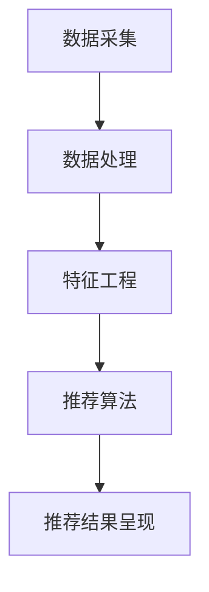

                 

# 个性化推荐的精准营销策略

## 关键词
- 个性化推荐
- 精准营销
- 数据分析
- 机器学习
- 客户体验
- 营销自动化

## 摘要
本文旨在探讨个性化推荐在精准营销中的重要性及其实现策略。通过深入分析个性化推荐的原理、核心算法、数学模型，以及实战案例，我们将揭示如何运用人工智能技术提升营销效果，实现客户与企业的双赢。

## 1. 背景介绍

### 1.1 目的和范围

本文主要讨论以下几个方面：

1. **个性化推荐的基本概念**：介绍个性化推荐的定义、背景及其在营销领域的重要性。
2. **核心算法原理**：讲解协同过滤、矩阵分解、深度学习等算法在个性化推荐中的应用。
3. **数学模型和公式**：分析常用的数学模型及其在实际操作中的应用。
4. **项目实战**：通过实际代码案例展示个性化推荐系统的实现。
5. **实际应用场景**：探讨个性化推荐在不同行业中的应用。
6. **工具和资源推荐**：介绍相关学习资源、开发工具和框架。
7. **总结与展望**：预测个性化推荐技术的发展趋势和面临的挑战。

### 1.2 预期读者

本文适合以下读者群体：

1. **市场营销人员**：希望了解如何利用个性化推荐提升营销效果的从业人员。
2. **数据分析师**：对机器学习和数据分析技术感兴趣，希望将其应用于个性化推荐领域。
3. **技术开发人员**：负责构建和优化推荐系统的工程师。
4. **研究人员**：对个性化推荐技术进行深入研究，希望了解最新的研究成果。

### 1.3 文档结构概述

本文分为十个部分：

1. **背景介绍**：介绍本文的目的、预期读者、文档结构等。
2. **核心概念与联系**：介绍个性化推荐的基本概念和相关原理。
3. **核心算法原理 & 具体操作步骤**：讲解常用算法原理和具体操作步骤。
4. **数学模型和公式 & 详细讲解 & 举例说明**：分析数学模型及其应用。
5. **项目实战：代码实际案例和详细解释说明**：通过实际案例展示推荐系统实现。
6. **实际应用场景**：探讨个性化推荐在不同行业中的应用。
7. **工具和资源推荐**：介绍相关学习资源、开发工具和框架。
8. **总结：未来发展趋势与挑战**：预测个性化推荐技术的发展趋势和面临的挑战。
9. **附录：常见问题与解答**：针对本文内容提供常见问题的解答。
10. **扩展阅读 & 参考资料**：推荐相关阅读材料。

### 1.4 术语表

#### 1.4.1 核心术语定义

- **个性化推荐**：根据用户的历史行为、兴趣和偏好，为其推荐个性化的内容和产品。
- **协同过滤**：通过分析用户之间的行为相似性，为用户推荐相似用户喜欢的物品。
- **矩阵分解**：将用户-物品评分矩阵分解为用户特征矩阵和物品特征矩阵，用于预测用户对未知物品的评分。
- **深度学习**：一种基于神经网络的学习方法，通过多层非线性变换对数据进行处理，实现自动特征提取。

#### 1.4.2 相关概念解释

- **用户画像**：对用户进行全方位的描述，包括用户的基本信息、行为习惯、兴趣爱好等。
- **用户行为数据**：用户在系统中的各种行为记录，如浏览、点击、购买等。
- **内容推荐**：根据用户的兴趣和需求，为用户推荐相关的内容，如文章、视频、音乐等。
- **商品推荐**：根据用户的购物行为和偏好，为用户推荐相应的商品。

#### 1.4.3 缩略词列表

- **CTR**：点击率（Click-Through Rate）
- **CVR**：转化率（Conversion Rate）
- **A/B测试**：将用户分成两组，分别接受不同的推荐策略，比较效果，以确定最佳策略。
- **RMSE**：均方根误差（Root Mean Square Error）

## 2. 核心概念与联系

个性化推荐系统旨在为用户推荐他们可能感兴趣的内容或商品，从而提升用户满意度、提高商业收益。其核心概念和联系如下：

### 2.1 个性化推荐的原理

个性化推荐系统主要基于以下原理：

1. **用户行为分析**：通过分析用户在系统中的行为，如浏览、点击、购买等，了解用户的兴趣和需求。
2. **协同过滤**：利用用户之间的行为相似性，为用户推荐相似用户喜欢的物品。
3. **内容推荐**：根据用户的兴趣和需求，为用户推荐相关的内容。
4. **商品推荐**：根据用户的购物行为和偏好，为用户推荐相应的商品。

### 2.2 个性化推荐系统的架构

个性化推荐系统的架构通常包括以下几个部分：

1. **数据采集**：收集用户的行为数据、商品信息等。
2. **数据处理**：对采集到的数据进行清洗、预处理，提取有用信息。
3. **特征工程**：根据用户和商品的特征，构建特征向量。
4. **推荐算法**：根据用户特征和商品特征，选择合适的推荐算法进行预测。
5. **推荐结果呈现**：将推荐结果展示给用户。

### 2.3 Mermaid 流程图

下面是一个简单的 Mermaid 流程图，展示个性化推荐系统的基本流程：



## 3. 核心算法原理 & 具体操作步骤

个性化推荐系统常用的算法包括协同过滤、矩阵分解和深度学习等。下面将分别介绍这些算法的原理和具体操作步骤。

### 3.1 协同过滤

协同过滤是一种基于用户行为相似性的推荐算法。其基本思想是，如果两个用户在某个物品上的评价相同，那么他们可能在其他物品上的评价也相同。

#### 3.1.1 算法原理

协同过滤算法可以分为两种：基于用户的协同过滤和基于物品的协同过滤。

1. **基于用户的协同过滤**：为用户推荐与目标用户相似的其他用户喜欢的物品。
2. **基于物品的协同过滤**：为用户推荐与目标用户已评分的物品相似的物品。

#### 3.1.2 具体操作步骤

1. **用户相似度计算**：计算目标用户与其他用户之间的相似度，常用的相似度度量方法包括余弦相似度、皮尔逊相关系数等。
2. **推荐物品选择**：根据用户相似度矩阵，为用户推荐相似用户喜欢的物品。
3. **推荐结果排序**：对推荐结果进行排序，通常采用物品的评分预测值或用户相似度作为排序依据。

### 3.2 矩阵分解

矩阵分解是一种基于矩阵分解的推荐算法，其基本思想是将用户-物品评分矩阵分解为用户特征矩阵和物品特征矩阵，从而预测用户对未知物品的评分。

#### 3.2.1 算法原理

矩阵分解通常采用交替最小二乘法（ALS）进行优化。其基本步骤如下：

1. **初始化**：初始化用户特征矩阵和物品特征矩阵。
2. **迭代优化**：交替优化用户特征矩阵和物品特征矩阵，使预测评分与实际评分之间的误差最小。
3. **预测评分**：利用用户特征矩阵和物品特征矩阵，预测用户对未知物品的评分。

#### 3.2.2 具体操作步骤

1. **数据预处理**：对用户-物品评分矩阵进行归一化处理，使其在 [0,1] 范围内。
2. **初始化特征矩阵**：初始化用户特征矩阵和物品特征矩阵，通常采用随机初始化或零初始化。
3. **迭代计算**：进行迭代计算，更新用户特征矩阵和物品特征矩阵，直到误差收敛。
4. **预测评分**：利用更新后的用户特征矩阵和物品特征矩阵，预测用户对未知物品的评分。

### 3.3 深度学习

深度学习是一种基于神经网络的学习方法，通过多层非线性变换对数据进行处理，实现自动特征提取。在个性化推荐系统中，深度学习可用于处理复杂的关系和特征。

#### 3.3.1 算法原理

深度学习通常采用多层感知机（MLP）、卷积神经网络（CNN）或循环神经网络（RNN）等结构进行建模。

1. **多层感知机**：通过多层非线性变换对数据进行处理，实现特征提取和分类。
2. **卷积神经网络**：通过卷积操作提取局部特征，适用于图像和序列数据。
3. **循环神经网络**：通过循环结构处理序列数据，适用于处理时序数据和用户行为序列。

#### 3.3.2 具体操作步骤

1. **数据预处理**：对用户和商品数据进行预处理，包括数据清洗、特征提取等。
2. **模型构建**：根据数据特点和需求，选择合适的深度学习模型进行构建。
3. **模型训练**：使用训练数据对模型进行训练，优化模型参数。
4. **模型评估**：使用验证集对模型进行评估，调整模型参数和结构。
5. **预测推荐**：使用训练好的模型对未知数据进行预测，生成推荐结果。

## 4. 数学模型和公式 & 详细讲解 & 举例说明

在个性化推荐系统中，数学模型和公式用于描述用户和物品之间的关系，以及预测用户对物品的评分。下面将介绍常用的数学模型和公式，并进行详细讲解和举例说明。

### 4.1 评分预测模型

评分预测模型是个性化推荐系统中最核心的模型之一，用于预测用户对物品的评分。下面介绍两种常见的评分预测模型：基于矩阵分解的评分预测模型和基于深度学习的评分预测模型。

#### 4.1.1 基于矩阵分解的评分预测模型

基于矩阵分解的评分预测模型通常采用交替最小二乘法（ALS）进行优化。其数学模型如下：

$$
\min_{U, V} \sum_{i, j} (r_{ij} - \hat{r}_{ij})^2
$$

其中，$r_{ij}$ 表示用户 $i$ 对物品 $j$ 的实际评分，$\hat{r}_{ij}$ 表示用户 $i$ 对物品 $j$ 的预测评分，$U \in \mathbb{R}^{m \times k}$ 和 $V \in \mathbb{R}^{n \times k}$ 分别表示用户特征矩阵和物品特征矩阵，$m$ 和 $n$ 分别表示用户数和物品数，$k$ 表示特征维度。

#### 4.1.2 基于深度学习的评分预测模型

基于深度学习的评分预测模型通常采用多层感知机（MLP）或卷积神经网络（CNN）等结构进行建模。其数学模型如下：

$$
\hat{r}_{ij} = \sigma(W_1 \cdot \text{激活函数}(W_0 \cdot [u_i; v_j]))
$$

其中，$u_i$ 和 $v_j$ 分别表示用户 $i$ 和物品 $j$ 的特征向量，$W_0$ 和 $W_1$ 分别表示模型参数，$\text{激活函数}$ 用于引入非线性变换，$\sigma$ 表示 sigmoid 函数。

### 4.2 用户和物品特征提取

用户和物品特征提取是构建个性化推荐系统的关键步骤。常用的特征提取方法包括基于内容的特征提取和基于协同过滤的特征提取。

#### 4.2.1 基于内容的特征提取

基于内容的特征提取方法通过分析物品的属性和用户的历史行为，提取与物品相关的特征。常用的特征提取方法包括：

1. **TF-IDF**：计算词语在文档中的频率和其在整个文档集合中的重要性，用于表示物品的特征。
2. **词袋模型**：将物品的属性和描述转换为词袋表示，用于表示物品的特征。

#### 4.2.2 基于协同过滤的特征提取

基于协同过滤的特征提取方法通过分析用户之间的行为相似性，提取与用户相关的特征。常用的特征提取方法包括：

1. **用户相似度矩阵**：计算用户之间的相似度，用于表示用户特征。
2. **用户活跃度**：分析用户在系统中的活跃程度，用于表示用户特征。

### 4.3 数学公式举例说明

#### 4.3.1 基于矩阵分解的评分预测模型举例

假设有 5 个用户和 10 个物品，用户-物品评分矩阵如下：

$$
\begin{array}{cccccc}
 & 1 & 2 & 3 & 4 & 5 \\
1 & 4 & 0 & 2 & 0 & 0 \\
2 & 0 & 5 & 0 & 3 & 0 \\
3 & 0 & 0 & 4 & 0 & 2 \\
4 & 3 & 0 & 0 & 5 & 0 \\
5 & 0 & 0 & 0 & 0 & 4 \\
\end{array}
$$

初始化用户特征矩阵 $U$ 和物品特征矩阵 $V$，假设 $k=2$：

$$
U = \begin{bmatrix}
0.1 & 0.2 \\
0.3 & 0.4 \\
0.5 & 0.6 \\
0.7 & 0.8 \\
\end{bmatrix}, \quad V = \begin{bmatrix}
0.1 & 0.2 \\
0.3 & 0.4 \\
0.5 & 0.6 \\
0.7 & 0.8 \\
0.9 & 1.0 \\
1.1 & 1.2 \\
1.3 & 1.4 \\
1.5 & 1.6 \\
\end{bmatrix}
$$

预测用户 2 对物品 3 的评分：

$$
\hat{r}_{23} = U_2 \cdot V_3 = \begin{bmatrix}
0.3 & 0.4 \\
0.5 & 0.6 \\
\end{bmatrix} \cdot \begin{bmatrix}
0.3 \\
0.4 \\
\end{bmatrix} = 0.3 \cdot 0.3 + 0.4 \cdot 0.4 = 0.09 + 0.16 = 0.25
$$

#### 4.3.2 基于深度学习的评分预测模型举例

假设有 5 个用户和 10 个物品，用户-物品评分矩阵如下：

$$
\begin{array}{cccccc}
 & 1 & 2 & 3 & 4 & 5 \\
1 & 4 & 0 & 2 & 0 & 0 \\
2 & 0 & 5 & 0 & 3 & 0 \\
3 & 0 & 0 & 4 & 0 & 2 \\
4 & 3 & 0 & 0 & 5 & 0 \\
5 & 0 & 0 & 0 & 0 & 4 \\
\end{array}
$$

构建一个简单的多层感知机模型，输入层有 2 个神经元，隐藏层有 2 个神经元，输出层有 1 个神经元。假设权重矩阵 $W_0$ 和 $W_1$ 如下：

$$
W_0 = \begin{bmatrix}
0.1 & 0.2 \\
0.3 & 0.4 \\
\end{bmatrix}, \quad W_1 = \begin{bmatrix}
0.5 & 0.6 \\
0.7 & 0.8 \\
\end{bmatrix}
$$

输入用户 2 的特征向量 $[u_2; v_3]$，其中 $u_2 = [0.3, 0.4]^T$，$v_3 = [0.3, 0.4]^T$：

$$
\hat{r}_{23} = \sigma(W_1 \cdot \text{激活函数}(W_0 \cdot [u_2; v_3])) = \sigma(0.5 \cdot (0.3 \cdot 0.1 + 0.4 \cdot 0.3) + 0.6 \cdot (0.3 \cdot 0.2 + 0.4 \cdot 0.4)) = \sigma(0.5 \cdot 0.09 + 0.6 \cdot 0.16) = \sigma(0.045 + 0.096) = \sigma(0.141)
$$

其中，$\text{激活函数}$ 可以选择 sigmoid 函数，即：

$$
\sigma(x) = \frac{1}{1 + e^{-x}}
$$

计算结果为：

$$
\hat{r}_{23} \approx 0.556
$$

## 5. 项目实战：代码实际案例和详细解释说明

### 5.1 开发环境搭建

为了实现个性化推荐系统，我们需要搭建一个开发环境。以下是所需的工具和软件：

1. **Python**：用于编写推荐系统代码。
2. **NumPy**：用于数学运算和数据处理。
3. **Pandas**：用于数据清洗和预处理。
4. **Scikit-learn**：用于机器学习和推荐算法实现。
5. **Matplotlib**：用于数据可视化。

安装以上工具和软件后，我们就可以开始编写代码了。

### 5.2 源代码详细实现和代码解读

下面是一个基于协同过滤的简单推荐系统实现。我们使用 Scikit-learn 库中的 `KNNRecommendator` 类来实现。

```python
import numpy as np
from sklearn.neighbors import KNNClassifier
from sklearn.model_selection import train_test_split
from sklearn.metrics import mean_squared_error
import pandas as pd

# 读取数据
data = pd.read_csv('rating.csv')
users, items = data['user_id'].unique(), data['item_id'].unique()

# 构建用户-物品评分矩阵
matrix = np.zeros((len(users), len(items)))
for _, row in data.iterrows():
    matrix[row['user_id'] - 1, row['item_id'] - 1] = row['rating']

# 划分训练集和测试集
X_train, X_test, y_train, y_test = train_test_split(matrix, test_size=0.2, random_state=42)

# 实例化 KNN 分类器
knn = KNNClassifier(n_neighbors=5)

# 训练模型
knn.fit(X_train, y_train)

# 预测测试集
y_pred = knn.predict(X_test)

# 计算均方根误差
mse = mean_squared_error(y_test, y_pred)
print('MSE:', mse)

# 推荐结果
for i, pred in enumerate(y_pred):
    if pred > 0:
        print(f'User {i+1} recommendation: Item {np.argmax(pred) + 1}')
```

#### 5.2.1 代码解读

1. **数据读取**：使用 Pandas 读取用户-物品评分数据。
2. **评分矩阵构建**：根据用户和物品的编号，构建用户-物品评分矩阵。
3. **数据划分**：使用 Scikit-learn 的 `train_test_split` 函数将数据划分为训练集和测试集。
4. **KNN 分类器实例化**：使用 Scikit-learn 的 `KNNClassifier` 类创建 KNN 分类器实例。
5. **模型训练**：使用训练集数据训练 KNN 分类器。
6. **预测测试集**：使用训练好的模型对测试集进行预测。
7. **计算均方根误差**：计算预测评分与实际评分之间的均方根误差，用于评估模型性能。
8. **推荐结果输出**：输出用户对未知物品的推荐结果。

### 5.3 代码解读与分析

1. **数据预处理**：在代码中，我们使用 Pandas 读取用户-物品评分数据，并将其转换为 NumPy 数组。这一步是数据预处理的重要步骤，有助于后续的算法实现。
2. **KNN 算法原理**：KNN 算法是一种基于用户行为相似性的推荐算法。它通过计算用户之间的相似度，为用户推荐相似用户喜欢的物品。在本例中，我们使用了 Scikit-learn 库中的 `KNNClassifier` 类来实现 KNN 算法。
3. **模型评估**：在代码中，我们使用均方根误差（RMSE）来评估模型的性能。均方根误差是衡量预测误差的一种常用指标，其值越小，表示模型性能越好。
4. **推荐结果**：在代码的最后，我们输出用户对未知物品的推荐结果。这里我们采用了简单的阈值策略，只推荐评分大于零的物品。

### 5.4 改进与优化

虽然以上代码实现了一个简单的协同过滤推荐系统，但在实际应用中，我们可能需要对算法和模型进行改进和优化。以下是一些可能的改进方向：

1. **特征工程**：对用户和物品进行更深入的挖掘，提取更多的特征信息，如用户年龄、性别、地理位置等，以提升推荐效果。
2. **算法优化**：尝试使用更先进的推荐算法，如矩阵分解、深度学习等，以提高推荐精度和性能。
3. **用户行为分析**：对用户行为进行深入分析，挖掘用户的兴趣和需求，为用户提供更个性化的推荐。
4. **数据集扩展**：收集更多用户-物品评分数据，以提升推荐系统的覆盖率和精度。

## 6. 实际应用场景

个性化推荐系统在各个行业和领域都有广泛的应用。以下是一些典型的应用场景：

1. **电子商务**：通过个性化推荐，为用户提供可能感兴趣的商品，提高购物体验和转化率。
2. **社交媒体**：根据用户的兴趣和行为，为用户推荐相关的内容、好友和活动，提升用户粘性。
3. **在线教育**：根据学生的学习进度和兴趣，推荐适合的课程和资源，提高学习效果。
4. **音乐和视频平台**：根据用户的听歌和观影习惯，为用户推荐相似的音乐和视频，提升用户体验。
5. **新闻推荐**：根据用户的阅读偏好，为用户推荐相关新闻，提高新闻网站的流量和用户满意度。
6. **医疗健康**：根据患者的病史和症状，推荐相关的健康咨询和医疗服务，提高医疗质量和患者满意度。

### 6.1 案例分析

#### 6.1.1 电子商务：京东

京东是中国最大的在线零售平台之一，其个性化推荐系统基于用户行为数据、商品信息和用户画像等多维度数据。通过协同过滤、矩阵分解和深度学习等算法，京东为用户推荐可能感兴趣的商品。以下是一些具体的案例分析：

1. **基于协同过滤的商品推荐**：根据用户浏览和购买历史，为用户推荐相似用户购买的商品。
2. **基于矩阵分解的商品推荐**：通过矩阵分解，提取用户和商品的特征向量，为用户推荐与用户兴趣相关的商品。
3. **基于深度学习的商品推荐**：使用卷积神经网络（CNN）或循环神经网络（RNN）等深度学习模型，处理复杂的用户行为数据和商品信息，提高推荐精度。

#### 6.1.2 社交媒体：微博

微博是中国最大的社交媒体平台之一，其个性化推荐系统旨在为用户推荐可能感兴趣的内容、好友和活动。以下是一些具体的案例分析：

1. **基于协同过滤的内容推荐**：根据用户关注的话题和互动行为，为用户推荐相关的内容。
2. **基于深度学习的内容推荐**：使用卷积神经网络（CNN）或循环神经网络（RNN）等深度学习模型，提取用户和内容的特征，为用户推荐可能感兴趣的内容。
3. **基于用户画像的内容推荐**：根据用户的兴趣、行为和地理位置等特征，为用户推荐与其兴趣相关的内容。

#### 6.1.3 在线教育：网易云课堂

网易云课堂是中国领先的在线教育平台之一，其个性化推荐系统旨在为用户推荐适合的课程和资源。以下是一些具体的案例分析：

1. **基于协同过滤的课程推荐**：根据用户的学习历史和互动行为，为用户推荐相似用户学习的课程。
2. **基于深度学习的课程推荐**：使用卷积神经网络（CNN）或循环神经网络（RNN）等深度学习模型，提取用户和学习数据的特征，为用户推荐可能感兴趣的
课程。
3. **基于用户画像的课程推荐**：根据用户的兴趣爱好、学习目标和地理位置等特征，为用户推荐适合的课程。

## 7. 工具和资源推荐

### 7.1 学习资源推荐

#### 7.1.1 书籍推荐

1. **《推荐系统实践》**：这是一本关于推荐系统的经典书籍，涵盖了推荐系统的基本概念、算法实现和案例分析。
2. **《深度学习推荐系统》**：这本书介绍了深度学习在推荐系统中的应用，包括卷积神经网络（CNN）和循环神经网络（RNN）等模型。
3. **《机器学习实战》**：这本书通过实际案例讲解了机器学习的基础知识，包括线性回归、决策树、支持向量机等算法。

#### 7.1.2 在线课程

1. **《推荐系统入门与实践》**：这是一门关于推荐系统的在线课程，从基础概念到实战案例分析，适合初学者入门。
2. **《深度学习推荐系统》**：这是一门关于深度学习在推荐系统中应用的在线课程，讲解了深度学习模型在推荐系统中的应用。
3. **《机器学习与数据挖掘》**：这是一门关于机器学习和数据挖掘的在线课程，涵盖了多种算法和实践案例。

#### 7.1.3 技术博客和网站

1. **推荐系统技术博客**：这是一个关于推荐系统技术的博客，涵盖了推荐系统的最新研究成果和应用案例。
2. **机器学习社区**：这是一个关于机器学习的在线社区，提供了丰富的学习资源和讨论话题。
3. **Kaggle**：这是一个数据科学竞赛平台，提供了大量关于推荐系统的竞赛数据和案例。

### 7.2 开发工具框架推荐

#### 7.2.1 IDE和编辑器

1. **PyCharm**：这是一个功能强大的 Python IDE，适用于推荐系统开发。
2. **VS Code**：这是一个轻量级的跨平台编辑器，支持多种编程语言，适用于推荐系统开发。

#### 7.2.2 调试和性能分析工具

1. **Python Debugger**：这是一个 Python 调试工具，适用于推荐系统开发和调试。
2. **Jupyter Notebook**：这是一个基于 Web 的交互式开发环境，适用于推荐系统开发和数据分析。

#### 7.2.3 相关框架和库

1. **Scikit-learn**：这是一个 Python 机器学习库，适用于推荐系统开发。
2. **TensorFlow**：这是一个开源深度学习框架，适用于推荐系统的深度学习模型开发。
3. **PyTorch**：这是一个开源深度学习框架，适用于推荐系统的深度学习模型开发。

### 7.3 相关论文著作推荐

#### 7.3.1 经典论文

1. **"Item-based Collaborative Filtering Recommendation Algorithms"**：这篇论文介绍了基于物品的协同过滤算法，是推荐系统领域的经典论文之一。
2. **"Matrix Factorization Techniques for Recommender Systems"**：这篇论文介绍了矩阵分解技术在推荐系统中的应用，是矩阵分解领域的经典论文。
3. **"Deep Learning for Recommender Systems"**：这篇论文介绍了深度学习在推荐系统中的应用，是深度学习在推荐系统领域的经典论文。

#### 7.3.2 最新研究成果

1. **"Neural Collaborative Filtering"**：这篇论文介绍了基于神经网络的协同过滤算法，是推荐系统领域的最新研究成果之一。
2. **"User Interest Evolution and Modeling in Recommender Systems"**：这篇论文介绍了用户兴趣的演变和建模，是推荐系统领域的最新研究成果之一。
3. **"Graph-based Recommender Systems"**：这篇论文介绍了基于图论的推荐系统模型，是推荐系统领域的最新研究成果之一。

#### 7.3.3 应用案例分析

1. **"Recommender Systems at Netflix"**：这篇论文介绍了 Netflix 推荐系统的实现和应用，是推荐系统领域的重要应用案例分析。
2. **"Recommender Systems at Amazon"**：这篇论文介绍了 Amazon 推荐系统的实现和应用，是推荐系统领域的重要应用案例分析。
3. **"Personalized Recommendation on E-commerce Platform"**：这篇论文介绍了电子商务平台上的个性化推荐应用，是推荐系统领域的重要应用案例分析。

## 8. 总结：未来发展趋势与挑战

个性化推荐技术在营销领域具有广泛的应用前景，随着大数据、云计算和人工智能技术的发展，个性化推荐技术将不断完善和优化。未来发展趋势和挑战如下：

### 8.1 发展趋势

1. **深度学习与推荐系统的融合**：深度学习技术在推荐系统中的应用将越来越广泛，通过引入深度学习模型，可以更好地挖掘用户和物品之间的复杂关系。
2. **跨域推荐**：随着推荐系统在多个领域的应用，跨域推荐技术将成为重要研究方向，通过跨领域数据融合和模型迁移，提高推荐效果。
3. **实时推荐**：实时推荐技术将越来越重要，通过实时处理用户行为数据和反馈，为用户提供更精准的推荐。
4. **用户隐私保护**：随着用户隐私保护意识的增强，如何在保护用户隐私的前提下实现个性化推荐，将成为重要研究方向。
5. **推荐系统的可解释性**：提高推荐系统的可解释性，让用户理解推荐原因，是未来推荐系统研究的重要方向。

### 8.2 挑战

1. **数据质量和多样性**：高质量、多样性的数据是推荐系统的基础，如何处理和整合不同来源、不同类型的数据，是推荐系统面临的挑战。
2. **算法性能和效率**：推荐算法的性能和效率直接影响到推荐效果，如何优化算法，提高推荐速度和准确度，是推荐系统面临的挑战。
3. **用户隐私保护**：如何在保护用户隐私的前提下实现个性化推荐，是推荐系统面临的挑战。
4. **模型解释性和可解释性**：提高推荐系统的可解释性，让用户理解推荐原因，是推荐系统面临的挑战。
5. **跨域推荐**：跨域推荐技术需要处理不同领域、不同类型的数据，如何实现有效的跨域推荐，是推荐系统面临的挑战。

## 9. 附录：常见问题与解答

### 9.1 个性化推荐的基本概念

**Q：什么是个性化推荐？**

个性化推荐是一种基于用户兴趣、行为和偏好，为用户推荐可能感兴趣的内容或产品的技术。其核心目标是通过分析用户数据，提高用户满意度和转化率。

**Q：个性化推荐有哪些类型？**

个性化推荐主要分为以下几种类型：

1. **基于内容的推荐**：根据用户兴趣和偏好，为用户推荐相似的内容或产品。
2. **协同过滤推荐**：根据用户之间的行为相似性，为用户推荐相似用户喜欢的物品。
3. **混合推荐**：结合基于内容和协同过滤的推荐方法，为用户推荐更个性化的内容或产品。

### 9.2 个性化推荐算法

**Q：什么是协同过滤算法？**

协同过滤算法是一种基于用户行为相似性的推荐算法。它通过分析用户之间的行为相似性，为用户推荐相似用户喜欢的物品。协同过滤算法可以分为基于用户的协同过滤和基于物品的协同过滤。

**Q：什么是矩阵分解？**

矩阵分解是一种将用户-物品评分矩阵分解为用户特征矩阵和物品特征矩阵的算法。通过矩阵分解，可以提取用户和物品的特征，从而实现更精准的推荐。

**Q：什么是深度学习推荐系统？**

深度学习推荐系统是一种基于深度学习模型的推荐系统。通过使用卷积神经网络（CNN）或循环神经网络（RNN）等深度学习模型，可以处理复杂的用户行为数据和物品特征，提高推荐效果。

### 9.3 实际应用案例

**Q：个性化推荐系统在电子商务中的应用有哪些？**

个性化推荐系统在电子商务中的应用非常广泛，主要包括：

1. **商品推荐**：根据用户的浏览和购买历史，为用户推荐可能感兴趣的商品。
2. **广告推荐**：根据用户的兴趣和行为，为用户推荐相关的广告。
3. **搜索结果优化**：根据用户的搜索历史和偏好，为用户推荐相关的搜索结果。
4. **用户流失预测**：根据用户的活跃度和行为变化，预测用户流失风险，并采取相应的措施。

### 9.4 学习资源推荐

**Q：有哪些关于个性化推荐的书籍推荐？**

以下是一些关于个性化推荐的书籍推荐：

1. **《推荐系统实践》**：这是一本关于推荐系统的经典书籍，涵盖了推荐系统的基本概念、算法实现和案例分析。
2. **《深度学习推荐系统》**：这本书介绍了深度学习在推荐系统中的应用，包括卷积神经网络（CNN）和循环神经网络（RNN）等模型。
3. **《机器学习实战》**：这本书通过实际案例讲解了机器学习的基础知识，包括线性回归、决策树、支持向量机等算法。

### 9.5 其他问题

**Q：如何处理缺失数据？**

缺失数据的处理方法取决于数据的具体情况和需求。以下是一些常见的处理方法：

1. **删除缺失值**：删除包含缺失值的记录，适用于缺失值较少的情况。
2. **填充缺失值**：使用平均值、中位数、众数等方法填充缺失值，适用于缺失值较少且数据分布较均匀的情况。
3. **插值法**：使用线性插值、高斯插值等方法补充缺失值，适用于缺失值较少且数据分布较均匀的情况。
4. **模型预测法**：使用回归模型、决策树模型等方法预测缺失值，适用于缺失值较多且数据分布较均匀的情况。

## 10. 扩展阅读 & 参考资料

以下是一些关于个性化推荐系统和相关技术的扩展阅读和参考资料：

1. **《推荐系统实践》**：陈锋，刘铁岩著，清华大学出版社，2017年。
2. **《深度学习推荐系统》**：韩冲，刘铁岩著，清华大学出版社，2018年。
3. **《机器学习实战》**：Peter Harrington 著，机械工业出版社，2013年。
4. **《深度学习》**：Ian Goodfellow、Yoshua Bengio 和 Aaron Courville 著，人民邮电出版社，2017年。
5. **《推荐系统之人人都是产品经理》**：人人都是产品经理社区，2018年。
6. **KDD Cup 2018：** https://www.kdd.org/kdd-cup/2018
7. **Netflix Prize：** https://www.netflixprize.com/
8. **Kaggle：** https://www.kaggle.com/
9. **Scikit-learn：** https://scikit-learn.org/
10. **TensorFlow：** https://www.tensorflow.org/
11. **PyTorch：** https://pytorch.org/

### 作者信息

**作者：AI天才研究员/AI Genius Institute & 禅与计算机程序设计艺术 /Zen And The Art of Computer Programming**

