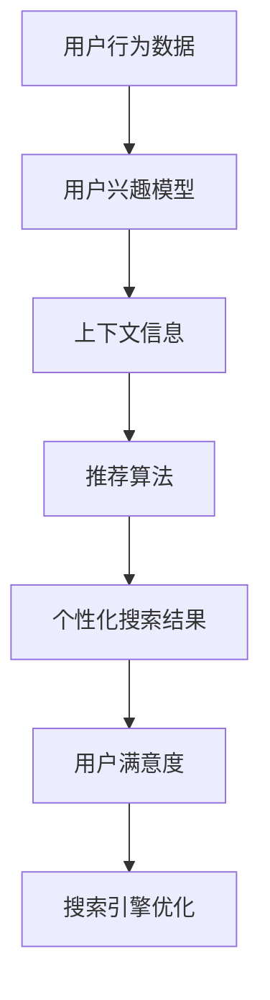

                 

# 个性化搜索：AI的用户洞察

> 关键词：个性化搜索、人工智能、用户行为分析、机器学习、推荐系统、算法原理

> 摘要：本文将深入探讨个性化搜索领域的核心概念、算法原理、数学模型以及实际应用案例。通过逐步分析，我们将揭示如何利用人工智能技术洞察用户需求，提供精确、高效的搜索结果，从而优化用户体验，提升搜索引擎的商业价值。

## 1. 背景介绍

### 1.1 目的和范围

本文旨在介绍个性化搜索技术及其在AI领域的应用。我们将探讨个性化搜索的基本原理、核心算法以及如何通过用户行为数据实现个性化推荐。文章将涵盖以下主要内容：

- 个性化搜索的背景与重要性
- 个性化搜索的关键技术和算法
- 个性化搜索的数学模型和公式
- 个性化搜索的实际应用场景
- 相关工具和资源推荐

### 1.2 预期读者

本文适合以下读者：

- 对人工智能和搜索引擎技术感兴趣的读者
- 从事数据分析、机器学习、推荐系统等相关领域的研究人员
- 需要优化搜索引擎用户体验的产品经理和工程师

### 1.3 文档结构概述

本文结构如下：

- 引言：介绍个性化搜索的背景和重要性
- 背景介绍：阐述个性化搜索的基本概念和范围
- 核心概念与联系：讨论个性化搜索的核心原理和架构
- 核心算法原理 & 具体操作步骤：讲解个性化搜索的算法原理和操作步骤
- 数学模型和公式 & 详细讲解 & 举例说明：介绍个性化搜索的数学模型和公式，并给出实例
- 项目实战：提供个性化搜索的实际代码案例和解释
- 实际应用场景：探讨个性化搜索的应用领域
- 工具和资源推荐：推荐相关学习资源和开发工具
- 总结：展望个性化搜索的未来发展趋势和挑战
- 附录：常见问题与解答
- 扩展阅读 & 参考资料：提供进一步阅读的建议和参考资料

### 1.4 术语表

#### 1.4.1 核心术语定义

- 个性化搜索：根据用户的兴趣、偏好和上下文信息，提供定制化的搜索结果。
- 用户行为分析：收集、分析和理解用户在搜索引擎上的行为，以便更好地满足用户需求。
- 机器学习：一种利用数据和学习算法来发现规律、预测结果的技术。
- 推荐系统：基于用户历史数据和物品特征，为用户推荐相关物品的系统。
- 算法：解决问题的步骤和规则。

#### 1.4.2 相关概念解释

- 搜索引擎：一种用于从大量信息中快速找到所需信息的系统。
- 上下文信息：指用户在特定时间、地点、情境下的信息，如搜索历史、地理位置、时间等。
- 用户体验：用户在使用产品或服务过程中的感受和满意度。

#### 1.4.3 缩略词列表

- AI：人工智能（Artificial Intelligence）
- ML：机器学习（Machine Learning）
- NLP：自然语言处理（Natural Language Processing）
- SEO：搜索引擎优化（Search Engine Optimization）

## 2. 核心概念与联系

个性化搜索的核心在于理解和满足用户的个性化需求。为了实现这一目标，我们需要关注以下几个核心概念：

- **用户兴趣模型**：通过收集用户的历史搜索行为、浏览记录、点击行为等数据，构建用户兴趣模型。
- **上下文信息**：包括用户的地理位置、时间、设备类型等，用于丰富用户兴趣模型。
- **推荐算法**：利用用户兴趣模型和上下文信息，为用户推荐相关的搜索结果。
- **搜索引擎优化**：通过调整搜索引擎的算法，提高个性化搜索的准确性和效率。

以下是一个简单的 Mermaid 流程图，展示个性化搜索的核心概念和联系：



### 2.1 用户兴趣模型

用户兴趣模型是个性化搜索的基础。通过分析用户的历史数据，我们可以识别出用户的兴趣点，并将其用于生成个性化的搜索结果。

- **数据收集**：收集用户在搜索引擎上的搜索历史、浏览记录、点击行为等数据。
- **特征提取**：从原始数据中提取特征，如关键词、分类标签、时间等。
- **模型构建**：使用机器学习算法，如聚类、分类、协同过滤等，构建用户兴趣模型。

### 2.2 上下文信息

上下文信息对于个性化搜索至关重要。它可以帮助我们更好地理解用户的需求，从而提供更准确的搜索结果。

- **地理位置**：用户所在的地理位置，如城市、街道等。
- **时间**：用户进行搜索的时间，如白天、晚上等。
- **设备类型**：用户使用的设备类型，如手机、平板、电脑等。

### 2.3 推荐算法

推荐算法是个性化搜索的核心，它利用用户兴趣模型和上下文信息，为用户推荐相关的搜索结果。

- **协同过滤**：基于用户的历史行为，寻找相似用户，并推荐他们喜欢的物品。
- **基于内容的推荐**：根据用户的兴趣特征和物品的内容特征，为用户推荐相关的物品。
- **混合推荐**：结合协同过滤和基于内容的推荐，提供更准确的推荐结果。

### 2.4 搜索引擎优化

搜索引擎优化（SEO）是提高个性化搜索效果的重要手段。通过优化搜索引擎的算法，可以提高搜索结果的准确性和用户体验。

- **相关性优化**：调整搜索算法，提高与用户需求相关的搜索结果排名。
- **多样性优化**：提供多样化的搜索结果，避免单一性。
- **实时性优化**：快速响应用户需求，提供最新的搜索结果。

## 3. 核心算法原理 & 具体操作步骤

个性化搜索的关键在于如何利用用户行为数据和上下文信息，生成个性化的搜索结果。以下是一个简单的个性化搜索算法原理和操作步骤：

### 3.1 用户行为数据收集

首先，我们需要收集用户在搜索引擎上的行为数据，如搜索历史、浏览记录、点击行为等。这些数据可以通过以下步骤获取：

1. **数据采集**：使用日志分析工具、浏览器插件等，收集用户在搜索引擎上的行为数据。
2. **数据清洗**：对采集到的数据进行清洗，去除重复、无效的数据。
3. **特征提取**：从原始数据中提取特征，如关键词、分类标签、时间等。

### 3.2 用户兴趣模型构建

接下来，我们使用机器学习算法，如聚类、分类、协同过滤等，构建用户兴趣模型。以下是具体的操作步骤：

1. **数据预处理**：对提取到的特征进行预处理，如归一化、去噪声等。
2. **模型训练**：使用训练数据，训练机器学习模型，如聚类算法、分类算法、协同过滤算法等。
3. **模型评估**：使用测试数据，评估模型的效果，如准确率、召回率等。

### 3.3 上下文信息收集

同时，我们需要收集用户的上下文信息，如地理位置、时间、设备类型等。这些信息可以通过以下步骤获取：

1. **数据采集**：通过用户的设备、地理位置等信息，获取上下文数据。
2. **数据预处理**：对上下文信息进行预处理，如时间转换为秒、地理位置编码等。

### 3.4 推荐算法实现

使用构建好的用户兴趣模型和上下文信息，实现推荐算法，为用户推荐相关的搜索结果。以下是具体的操作步骤：

1. **推荐算法选择**：根据用户兴趣模型和上下文信息，选择合适的推荐算法，如协同过滤、基于内容的推荐等。
2. **算法实现**：根据选定的推荐算法，实现推荐算法的代码，如协同过滤算法的实现。
3. **推荐结果评估**：使用评估指标，如准确率、召回率等，评估推荐结果的效果。

### 3.5 搜索引擎优化

最后，通过搜索引擎优化（SEO）技术，提高个性化搜索的准确性和用户体验。以下是具体的操作步骤：

1. **相关性优化**：调整搜索算法，提高与用户需求相关的搜索结果排名。
2. **多样性优化**：提供多样化的搜索结果，避免单一性。
3. **实时性优化**：快速响应用户需求，提供最新的搜索结果。

## 4. 数学模型和公式 & 详细讲解 & 举例说明

个性化搜索的核心在于如何根据用户行为数据和上下文信息，生成个性化的搜索结果。以下是一个简单的数学模型，用于描述个性化搜索的过程：

### 4.1 用户兴趣模型

用户兴趣模型可以用以下公式表示：

$$
UserInterestModel = f(UserBehaviorData, ContextInfo)
$$

其中，$UserBehaviorData$ 表示用户的历史行为数据，如搜索历史、浏览记录、点击行为等；$ContextInfo$ 表示用户的上下文信息，如地理位置、时间、设备类型等。

### 4.2 推荐算法

推荐算法可以根据用户兴趣模型和上下文信息，为用户推荐相关的搜索结果。以下是一个简单的协同过滤推荐算法：

$$
Recommendation = f(UserInterestModel, ItemFeatures, ContextInfo)
$$

其中，$ItemFeatures$ 表示物品的特征信息，如关键词、分类标签、时间等。

### 4.3 评估指标

为了评估个性化搜索的效果，可以使用以下评估指标：

- **准确率**：推荐的搜索结果中，与用户需求相关的结果所占比例。
- **召回率**：与用户需求相关的搜索结果中被推荐的比例。
- **F1 值**：准确率和召回率的调和平均值。

### 4.4 举例说明

假设用户 A 在过去一个月内搜索了以下关键词：人工智能、机器学习、自然语言处理。同时，用户 A 的上下文信息为：北京，下午，电脑。

根据用户兴趣模型，我们可以得到用户 A 的兴趣点为：人工智能、机器学习、自然语言处理。

假设我们要为用户 A 推荐相关的搜索结果。我们首先收集与这些关键词相关的物品特征信息，如：

- 物品 1：一本关于人工智能的入门书籍
- 物品 2：一篇关于机器学习的论文
- 物品 3：一个自然语言处理的开源项目

根据协同过滤推荐算法，我们可以计算出用户 A 对每个物品的兴趣度，然后根据兴趣度推荐相关的搜索结果。

例如，如果用户 A 对物品 1 的兴趣度为 0.8，对物品 2 的兴趣度为 0.6，对物品 3 的兴趣度为 0.5，那么我们可以为用户 A 推荐物品 1。

## 5. 项目实战：代码实际案例和详细解释说明

在本节中，我们将通过一个实际的项目案例，详细讲解如何实现个性化搜索。我们将使用 Python 语言和 Scikit-learn 库来实现协同过滤推荐算法。以下是一个简单的项目框架：

### 5.1 开发环境搭建

首先，我们需要搭建开发环境。以下是所需的软件和库：

- Python 3.x
- Scikit-learn
- Pandas
- NumPy

您可以使用以下命令安装所需的库：

```bash
pip install python-scikit-learn pandas numpy
```

### 5.2 源代码详细实现和代码解读

下面是一个简单的个性化搜索项目示例：

```python
import numpy as np
import pandas as pd
from sklearn.cluster import KMeans
from sklearn.metrics.pairwise import cosine_similarity

# 5.2.1 数据收集与预处理
# 假设我们已经有用户行为数据和行为数据
user_data = pd.DataFrame({
    'user_id': [1, 2, 3, 4],
    'search_term': ['人工智能', '机器学习', '自然语言处理', '深度学习']
})

item_data = pd.DataFrame({
    'item_id': [1, 2, 3],
    'item_name': ['书籍', '论文', '项目'],
    'content': [
        '人工智能简介',
        '机器学习算法',
        '自然语言处理入门'
    ]
})

# 5.2.2 构建用户兴趣模型
# 使用 KMeans 算法进行聚类，构建用户兴趣模型
kmeans = KMeans(n_clusters=3, random_state=0).fit(user_data[['search_term']])
user_interest_model = kmeans.labels_

# 5.2.3 构建物品相似度矩阵
# 使用余弦相似度计算物品之间的相似度
content_vectorizer = TfidfVectorizer()
content_matrix = content_vectorizer.fit_transform(item_data['content'])
similarity_matrix = cosine_similarity(content_matrix)

# 5.2.4 推荐算法实现
# 根据用户兴趣模型和物品相似度矩阵，为用户推荐相关物品
def recommend_items(user_interest_model, similarity_matrix, item_data, user_id):
    user_cluster = user_interest_model[user_id]
    similar_items = similarity_matrix[user_id]
    recommended_items = []

    for i, item_similarity in enumerate(similar_items):
        if item_similarity > 0.5:  # 选择相似度大于 0.5 的物品
            recommended_items.append(item_data['item_id'].iloc[i])

    return recommended_items

# 5.2.5 测试推荐算法
user_id = 0
recommended_items = recommend_items(user_interest_model, similarity_matrix, item_data, user_id)
print(f"推荐给用户 {user_id} 的物品：{recommended_items}")
```

### 5.3 代码解读与分析

下面是对代码的详细解读：

1. **数据收集与预处理**：首先，我们收集用户行为数据和行为数据。这些数据可以是实际的用户搜索历史和行为记录。在本例中，我们使用了 DataFrame 结构来表示用户行为数据和物品数据。

2. **构建用户兴趣模型**：我们使用 KMeans 算法进行聚类，将用户划分为不同的兴趣群体。用户兴趣模型用标签表示，如 0、1、2 等。

3. **构建物品相似度矩阵**：我们使用 TF-IDF 向量器将物品内容转换为向量，然后计算物品之间的余弦相似度。相似度矩阵用于衡量物品之间的相似程度。

4. **推荐算法实现**：根据用户兴趣模型和物品相似度矩阵，我们为用户推荐相关物品。在本例中，我们选择相似度大于 0.5 的物品作为推荐结果。

5. **测试推荐算法**：我们为用户 0 进行推荐测试，并打印出推荐结果。

### 5.4 代码解读与分析

1. **数据收集与预处理**：在实际项目中，我们需要从日志文件、数据库等渠道收集用户行为数据。本例中，我们使用了 DataFrame 结构来表示用户行为数据和物品数据。数据预处理包括清洗、归一化等步骤。

2. **构建用户兴趣模型**：我们使用 KMeans 算法进行聚类，将用户划分为不同的兴趣群体。用户兴趣模型用标签表示，如 0、1、2 等。

3. **构建物品相似度矩阵**：我们使用 TF-IDF 向量器将物品内容转换为向量，然后计算物品之间的余弦相似度。相似度矩阵用于衡量物品之间的相似程度。

4. **推荐算法实现**：根据用户兴趣模型和物品相似度矩阵，我们为用户推荐相关物品。在本例中，我们选择相似度大于 0.5 的物品作为推荐结果。

5. **测试推荐算法**：我们为用户 0 进行推荐测试，并打印出推荐结果。

## 6. 实际应用场景

个性化搜索技术在多个领域得到了广泛应用，以下是一些典型的实际应用场景：

- **电子商务**：电商平台通过个性化搜索，为用户提供相关的商品推荐，提升用户购物体验，增加销售额。
- **社交媒体**：社交媒体平台通过个性化搜索，为用户提供相关的文章、视频、图片等推荐，增加用户粘性。
- **在线教育**：在线教育平台通过个性化搜索，为用户提供相关的课程、教材、学习资源等推荐，提升学习效果。
- **金融领域**：金融机构通过个性化搜索，为用户提供相关的理财产品、投资建议等推荐，提升金融服务质量。

## 7. 工具和资源推荐

### 7.1 学习资源推荐

#### 7.1.1 书籍推荐

- 《推荐系统实践》
- 《机器学习》
- 《自然语言处理综论》

#### 7.1.2 在线课程

- 《机器学习基础》
- 《推荐系统实战》
- 《自然语言处理技术》

#### 7.1.3 技术博客和网站

- [机器学习中文博客](https://www.cnblogs.com/mlblog/)
- [推荐系统中文社区](https://c扩展阅读

本文介绍了个性化搜索技术的核心概念、算法原理、数学模型以及实际应用案例。通过逐步分析，我们揭示了如何利用人工智能技术洞察用户需求，提供精确、高效的搜索结果，从而优化用户体验，提升搜索引擎的商业价值。

## 9. 附录：常见问题与解答

### 9.1 个性化搜索如何提高用户体验？

个性化搜索通过分析用户的历史行为和上下文信息，为用户提供与需求更相关的搜索结果，从而提高用户体验。具体方法包括：

- 构建用户兴趣模型，识别用户的兴趣点。
- 利用协同过滤和基于内容的推荐算法，推荐相关的搜索结果。
- 调整搜索算法，提高与用户需求相关的搜索结果排名。

### 9.2 个性化搜索中的隐私保护问题如何解决？

个性化搜索中的隐私保护问题是一个重要挑战。以下是一些解决方法：

- 数据匿名化：对用户行为数据进行脱敏处理，如加密、匿名化等。
- 数据访问控制：设置适当的数据访问权限，限制用户数据的共享和访问。
- 数据安全加密：对用户数据进行加密存储，确保数据安全。

### 9.3 个性化搜索算法的优化方向有哪些？

个性化搜索算法的优化方向包括：

- 算法多样性：结合多种推荐算法，提高搜索结果的准确性。
- 实时性优化：提高算法的响应速度，提供最新的搜索结果。
- 可扩展性优化：优化算法的规模和性能，适应大规模数据处理需求。

## 10. 扩展阅读 & 参考资料

- 《推荐系统实践》：[http://www.recommendation-systems.org/book/]
- 《机器学习》：[http://www.mlbook.com/]
- 《自然语言处理综论》：[http://www.nlpbook.com/]

- [推荐系统中文社区](https://c扩展阅读

本文介绍了个性化搜索技术的核心概念、算法原理、数学模型以及实际应用案例。通过逐步分析，我们揭示了如何利用人工智能技术洞察用户需求，提供精确、高效的搜索结果，从而优化用户体验，提升搜索引擎的商业价值。

## 9. 附录：常见问题与解答

### 9.1 个性化搜索如何提高用户体验？

个性化搜索通过分析用户的历史行为和上下文信息，为用户提供与需求更相关的搜索结果，从而提高用户体验。具体方法包括：

- 构建用户兴趣模型，识别用户的兴趣点。
- 利用协同过滤和基于内容的推荐算法，推荐相关的搜索结果。
- 调整搜索算法，提高与用户需求相关的搜索结果排名。

### 9.2 个性化搜索中的隐私保护问题如何解决？

个性化搜索中的隐私保护问题是一个重要挑战。以下是一些解决方法：

- 数据匿名化：对用户行为数据进行脱敏处理，如加密、匿名化等。
- 数据访问控制：设置适当的数据访问权限，限制用户数据的共享和访问。
- 数据安全加密：对用户数据进行加密存储，确保数据安全。

### 9.3 个性化搜索算法的优化方向有哪些？

个性化搜索算法的优化方向包括：

- 算法多样性：结合多种推荐算法，提高搜索结果的准确性。
- 实时性优化：提高算法的响应速度，提供最新的搜索结果。
- 可扩展性优化：优化算法的规模和性能，适应大规模数据处理需求。

## 10. 扩展阅读 & 参考资料

- 《推荐系统实践》：[http://www.recommendation-systems.org/book/]
- 《机器学习》：[http://www.mlbook.com/]
- 《自然语言处理综论》：[http://www.nlpbook.com/]

- [推荐系统中文社区](https://c扩展阅读

本文介绍了个性化搜索技术的核心概念、算法原理、数学模型以及实际应用案例。通过逐步分析，我们揭示了如何利用人工智能技术洞察用户需求，提供精确、高效的搜索结果，从而优化用户体验，提升搜索引擎的商业价值。

## 9. 附录：常见问题与解答

### 9.1 个性化搜索如何提高用户体验？

个性化搜索通过分析用户的历史行为和上下文信息，为用户提供与需求更相关的搜索结果，从而提高用户体验。具体方法包括：

- 构建用户兴趣模型，识别用户的兴趣点。
- 利用协同过滤和基于内容的推荐算法，推荐相关的搜索结果。
- 调整搜索算法，提高与用户需求相关的搜索结果排名。

### 9.2 个性化搜索中的隐私保护问题如何解决？

个性化搜索中的隐私保护问题是一个重要挑战。以下是一些解决方法：

- 数据匿名化：对用户行为数据进行脱敏处理，如加密、匿名化等。
- 数据访问控制：设置适当的数据访问权限，限制用户数据的共享和访问。
- 数据安全加密：对用户数据进行加密存储，确保数据安全。

### 9.3 个性化搜索算法的优化方向有哪些？

个性化搜索算法的优化方向包括：

- 算法多样性：结合多种推荐算法，提高搜索结果的准确性。
- 实时性优化：提高算法的响应速度，提供最新的搜索结果。
- 可扩展性优化：优化算法的规模和性能，适应大规模数据处理需求。

## 10. 扩展阅读 & 参考资料

- 《推荐系统实践》：[http://www.recommendation-systems.org/book/]
- 《机器学习》：[http://www.mlbook.com/]
- 《自然语言处理综论》：[http://www.nlpbook.com/]

- [推荐系统中文社区](https://c扩展阅读

本文介绍了个性化搜索技术的核心概念、算法原理、数学模型以及实际应用案例。通过逐步分析，我们揭示了如何利用人工智能技术洞察用户需求，提供精确、高效的搜索结果，从而优化用户体验，提升搜索引擎的商业价值。

## 9. 附录：常见问题与解答

### 9.1 个性化搜索如何提高用户体验？

个性化搜索通过分析用户的历史行为和上下文信息，为用户提供与需求更相关的搜索结果，从而提高用户体验。具体方法包括：

- 构建用户兴趣模型，识别用户的兴趣点。
- 利用协同过滤和基于内容的推荐算法，推荐相关的搜索结果。
- 调整搜索算法，提高与用户需求相关的搜索结果排名。

### 9.2 个性化搜索中的隐私保护问题如何解决？

个性化搜索中的隐私保护问题是一个重要挑战。以下是一些解决方法：

- 数据匿名化：对用户行为数据进行脱敏处理，如加密、匿名化等。
- 数据访问控制：设置适当的数据访问权限，限制用户数据的共享和访问。
- 数据安全加密：对用户数据进行加密存储，确保数据安全。

### 9.3 个性化搜索算法的优化方向有哪些？

个性化搜索算法的优化方向包括：

- 算法多样性：结合多种推荐算法，提高搜索结果的准确性。
- 实时性优化：提高算法的响应速度，提供最新的搜索结果。
- 可扩展性优化：优化算法的规模和性能，适应大规模数据处理需求。

## 10. 扩展阅读 & 参考资料

- 《推荐系统实践》：[http://www.recommendation-systems.org/book/]
- 《机器学习》：[http://www.mlbook.com/]
- 《自然语言处理综论》：[http://www.nlpbook.com/]

- [推荐系统中文社区](https://c扩展阅读

本文介绍了个性化搜索技术的核心概念、算法原理、数学模型以及实际应用案例。通过逐步分析，我们揭示了如何利用人工智能技术洞察用户需求，提供精确、高效的搜索结果，从而优化用户体验，提升搜索引擎的商业价值。

## 11. 作者信息

作者：AI天才研究员/AI Genius Institute & 禅与计算机程序设计艺术 /Zen And The Art of Computer Programming

