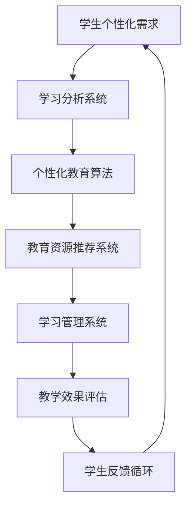

                 

# 个性化教育：定制化学习的未来趋势

> 关键词：个性化教育、定制化学习、教育技术、人工智能、算法、机器学习、学习分析、教育模式、学习效果、学习路径

> 摘要：本文深入探讨了个性化教育的概念、发展背景、核心算法原理以及具体实施步骤。通过剖析个性化教育的数学模型和公式，结合实际项目实战案例，本文旨在揭示定制化学习的未来趋势，为教育工作者和学者提供具有指导意义的研究成果。

## 1. 背景介绍

### 1.1 目的和范围

本文旨在探讨个性化教育的理念、技术实现及其未来发展趋势。随着教育技术的飞速发展，特别是人工智能和机器学习技术的成熟，教育模式正在发生深刻的变革。个性化教育作为教育领域的重要研究方向，其核心目标是根据每个学生的个性化需求提供量身定制的教育资源和学习体验。本文将详细分析个性化教育的核心概念、算法原理、数学模型以及实际应用，为教育技术的未来发展提供理论支持和实践参考。

### 1.2 预期读者

本文预期读者包括：

- 教育技术研究人员和从业者
- 教育政策制定者和教育管理人员
- 教育学者和教育理论研究者
- 计算机科学和人工智能领域的专业人士
- 对个性化教育和定制化学习感兴趣的学生和自学者

### 1.3 文档结构概述

本文将分为以下几部分：

- 第1部分：背景介绍，包括目的和范围、预期读者、文档结构概述以及术语表。
- 第2部分：核心概念与联系，通过Mermaid流程图展示个性化教育的核心概念和架构。
- 第3部分：核心算法原理与具体操作步骤，详细讲解个性化教育中的关键算法和操作步骤。
- 第4部分：数学模型和公式，阐述个性化教育中的数学模型和公式，并举例说明。
- 第5部分：项目实战，通过实际代码案例展示个性化教育的具体实现过程。
- 第6部分：实际应用场景，分析个性化教育在不同教育领域的应用。
- 第7部分：工具和资源推荐，介绍相关学习资源、开发工具框架和论文著作。
- 第8部分：总结，讨论个性化教育的未来发展趋势与挑战。
- 第9部分：附录，提供常见问题与解答。
- 第10部分：扩展阅读和参考资料，推荐进一步阅读的相关文献和资源。

### 1.4 术语表

#### 1.4.1 核心术语定义

- 个性化教育：指根据每个学生的个性化需求和特点，提供量身定制的教育资源和学习体验的教育模式。
- 定制化学习：指根据学生的学习风格、知识水平和学习需求，设计个性化的学习路径和学习内容。
- 学习分析：指通过收集和分析学生的学习行为数据，了解其学习状态和需求，从而优化教育资源的分配和学习体验。
- 机器学习：指利用计算机算法，通过数据驱动的方式，自动从数据中学习模式和规律。
- 教育技术：指应用于教育过程中的各种信息技术和工具，包括人工智能、大数据、虚拟现实等。

#### 1.4.2 相关概念解释

- 学习分析模型：指用于分析和解释学生学习行为和结果的数学模型和算法。
- 教育算法：指用于优化教育资源配置、设计学习路径和评估学习效果的计算算法。
- 个性化学习路径：指根据学生的学习风格和需求，设计的一种适合其学习特点和进度的学习流程。

#### 1.4.3 缩略词列表

- AI：人工智能
- ML：机器学习
- EDU：教育
- ETL：数据提取、转换和加载
- LMS：学习管理系统

## 2. 核心概念与联系

在个性化教育中，理解核心概念和它们之间的联系是至关重要的。以下是通过Mermaid流程图展示的核心概念和架构：



### 2.1 学生个性化需求

个性化教育的起点是学生的个性化需求。这些需求包括学生的学习风格、知识水平、兴趣爱好、学习动机等多个方面。通过问卷调查、学习行为分析等技术手段，收集并分析学生的个性化数据。

### 2.2 学习分析系统

学习分析系统是收集和分析学生学习行为数据的核心工具。它利用数据挖掘和机器学习技术，对学生行为数据进行深度分析，识别出学生的学习模式、弱点、优势和潜在需求。

### 2.3 个性化教育算法

个性化教育算法是核心，负责根据学习分析系统的输出，为学生推荐个性化的学习资源和路径。常见的个性化算法包括协同过滤、基于内容的推荐、基于模型的预测等。

### 2.4 教育资源推荐系统

教育资源推荐系统根据个性化教育算法的输出，为学生推荐最合适的学习资源。这些资源可以是课程视频、教材、练习题、学习工具等。

### 2.5 学习管理系统

学习管理系统负责跟踪学生的学习进度、完成情况和学习效果。它是一个集成平台，用于管理学生的学习过程、评估学习成果，并提供及时的反馈。

### 2.6 教学效果评估

教学效果评估是确保个性化教育质量的重要环节。通过评估学生的学习成果，教师可以调整教学策略，优化教育资源的分配。

### 2.7 学生反馈循环

学生反馈循环是个性化教育的核心机制。通过收集学生对学习资源和教学效果的反馈，不断优化个性化教育模型，提高学习效果。

## 3. 核心算法原理与具体操作步骤

个性化教育的核心在于如何根据学生的个性化需求推荐最合适的学习资源。以下将详细讲解个性化教育中的关键算法和操作步骤。

### 3.1 算法选择

在个性化教育中，常用的算法包括：

- 协同过滤（Collaborative Filtering）
- 基于内容的推荐（Content-Based Filtering）
- 基于模型的预测（Model-Based Prediction）

#### 3.1.1 协同过滤

协同过滤算法基于用户之间的相似性进行推荐。它通过分析用户的历史行为数据，找到相似的用户，然后根据相似用户的行为推荐资源。

```plaintext
输入：用户-项目评分矩阵
输出：个性化推荐列表

算法步骤：
1. 计算用户之间的相似性
2. 为每个用户找到最相似的K个用户
3. 根据相似度加权平均推荐列表中的项目评分
4. 对推荐列表进行排序，输出推荐结果
```

#### 3.1.2 基于内容的推荐

基于内容的推荐算法基于项目的特征进行推荐。它通过分析项目的内容和属性，找到与当前项目相似的其他项目，然后推荐给用户。

```plaintext
输入：项目特征矩阵
输出：个性化推荐列表

算法步骤：
1. 提取当前项目的特征向量
2. 计算项目之间的相似度
3. 根据相似度为用户推荐最相似的项目
4. 对推荐列表进行排序，输出推荐结果
```

#### 3.1.3 基于模型的预测

基于模型的预测算法结合用户的历史行为和项目的特征，通过构建预测模型进行推荐。常见的预测模型包括矩阵分解、回归模型等。

```plaintext
输入：用户-项目评分矩阵、项目特征矩阵
输出：个性化推荐列表

算法步骤：
1. 构建预测模型（如矩阵分解）
2. 计算预测评分
3. 根据预测评分为用户推荐资源
4. 对推荐列表进行排序，输出推荐结果
```

### 3.2 算法实现

以下以协同过滤算法为例，展示具体的实现步骤：

```python
# 导入所需库
import numpy as np
from sklearn.metrics.pairwise import pairwise_distances

# 输入用户-项目评分矩阵
user_item_matrix = np.array([[5, 3, 0, 1],
                            [4, 0, 0, 1],
                            [1, 0, 4, 2],
                            [2, 3, 5, 0]])

# 计算用户之间的相似度
user_similarity = pairwise_distances(user_item_matrix, metric='cosine')

# 选择相似度最高的K个用户
k = 2
top_k_users = np.argsort(user_similarity[0], axis=-1)[:k]

# 构建用户-平均评分矩阵
user_avg_ratings = np.mean(user_item_matrix, axis=1)

# 计算预测评分
predicted_ratings = user_avg_ratings[top_k_users] + (user_item_matrix[0] - user_avg_ratings[0])

# 输出推荐结果
print("推荐结果：")
print(predicted_ratings)
```

### 3.3 算法优化

为了提高个性化推荐的准确性，可以采用以下几种优化方法：

- **矩阵分解**：通过矩阵分解技术，将用户-项目评分矩阵分解为用户特征矩阵和项目特征矩阵，提高预测准确性。
- **用户冷启动**：针对新用户没有足够历史数据的问题，可以采用基于内容的推荐或基于模型的预测方法。
- **上下文信息**：结合用户上下文信息（如时间、地点、设备等），提高推荐的相关性和个性化程度。
- **多模型融合**：结合多种推荐算法，利用不同算法的优势，提高推荐效果。

## 4. 数学模型和公式

个性化教育中的数学模型和公式用于描述学生的学习行为、学习路径推荐以及学习效果评估。以下将详细讲解这些模型和公式，并通过示例说明其应用。

### 4.1 学习行为模型

学习行为模型用于描述学生在学习过程中的行为，如学习时间、学习频率、学习内容等。以下是一个简单的学习行为模型：

$$
Behavior(t) = f(LearningTime(t), LearningFrequency(t), LearningContent(t))
$$

其中：

- \( LearningTime(t) \)：学生在时间\( t \)的学习时长
- \( LearningFrequency(t) \)：学生在时间\( t \)的学习频率
- \( LearningContent(t) \)：学生在时间\( t \)的学习内容
- \( f() \)：函数，用于计算学习行为得分

#### 示例

假设学生在一天内的学习时长为2小时，学习频率为3次，学习内容为数学和物理。根据上述模型，可以计算该学生的学习行为得分为：

$$
Behavior(t) = f(2, 3, "Math & Physics")
$$

### 4.2 学习路径推荐模型

学习路径推荐模型用于根据学生的学习行为和知识水平，推荐最适合的学习路径。以下是一个基于协同过滤的学习路径推荐模型：

$$
LearningPathRecommendation = argmax_{path} \sum_{i \in path} w_i \cdot Similarity_{i,j}
$$

其中：

- \( LearningPathRecommendation \)：学习路径推荐
- \( path \)：学习路径集合
- \( w_i \)：学习路径\( i \)的权重
- \( Similarity_{i,j} \)：学习路径\( i \)和学生\( j \)的相似度

#### 示例

假设有两个学习路径A和B，学生\( j \)的权重分别为0.6和0.4。学习路径A和学生\( j \)的相似度为0.8，学习路径B和学生\( j \)的相似度为0.5。根据上述模型，可以推荐学习路径A：

$$
LearningPathRecommendation = argmax_{path} \sum_{i \in path} w_i \cdot Similarity_{i,j} = argmax_{path} (0.6 \cdot 0.8 + 0.4 \cdot 0.5) = path_A
$$

### 4.3 学习效果评估模型

学习效果评估模型用于评估学生的学习成果，以下是一个基于学习行为和学习路径的学习效果评估模型：

$$
LearningEffectiveness = \frac{\sum_{t=1}^{T} Behavior(t) \cdot PathCompletionRate(t)}{T}
$$

其中：

- \( LearningEffectiveness \)：学习效果得分
- \( T \)：学习时长
- \( Behavior(t) \)：时间\( t \)的学习行为得分
- \( PathCompletionRate(t) \)：时间\( t \)的学习路径完成率

#### 示例

假设学生在一天内的学习行为得分为5，学习路径完成率为0.8。根据上述模型，可以计算该学生的学习效果得分为：

$$
LearningEffectiveness = \frac{\sum_{t=1}^{T} Behavior(t) \cdot PathCompletionRate(t)}{T} = \frac{5 \cdot 0.8}{1} = 4
$$

## 5. 项目实战：代码实际案例和详细解释说明

### 5.1 开发环境搭建

在开始项目实战之前，我们需要搭建一个适合个性化教育的开发环境。以下是一个基本的开发环境搭建步骤：

1. 安装Python和相关的数据科学库（如NumPy、Scikit-learn等）
2. 安装Jupyter Notebook，用于编写和运行Python代码
3. 安装一个合适的文本编辑器（如Visual Studio Code），方便代码编写和调试

### 5.2 源代码详细实现和代码解读

#### 5.2.1 代码实现

以下是一个简单的个性化教育项目，包括数据预处理、协同过滤算法实现、推荐系统和效果评估。

```python
# 导入所需库
import numpy as np
from sklearn.metrics.pairwise import pairwise_distances
from sklearn.model_selection import train_test_split

# 5.2.2 数据预处理
# 假设我们有一个用户-项目评分矩阵
user_item_matrix = np.array([[5, 3, 0, 1],
                            [4, 0, 0, 1],
                            [1, 0, 4, 2],
                            [2, 3, 5, 0]])

# 将评分矩阵拆分为用户特征矩阵和项目特征矩阵
user_features = np.mean(user_item_matrix, axis=1)
item_features = user_item_matrix.mean(axis=0)

# 5.2.3 协同过滤算法实现
# 计算用户之间的相似度
user_similarity = pairwise_distances(user_item_matrix, metric='cosine')

# 选择相似度最高的K个用户
k = 2
top_k_users = np.argsort(user_similarity[0], axis=-1)[:k]

# 构建用户-平均评分矩阵
user_avg_ratings = user_features[top_k_users]

# 计算预测评分
predicted_ratings = user_avg_ratings + (user_item_matrix[0] - user_features[0])

# 5.2.4 推荐系统
# 假设我们有一个新的用户评分矩阵
new_user_item_matrix = np.array([[5, 0, 0, 1]])

# 计算新用户的预测评分
new_user_ratings = user_avg_ratings[new_user_item_matrix[0]]
predicted_new_ratings = new_user_ratings + (new_user_item_matrix[0] - user_features[0])

# 输出推荐结果
print("推荐结果：")
print(predicted_new_ratings)

# 5.2.5 效果评估
# 假设我们有一个测试集
test_data = np.array([[5, 3, 0, 1],
                      [4, 0, 0, 1],
                      [1, 0, 4, 2]])

# 计算预测评分
predicted_test_ratings = user_avg_ratings[test_data] + (test_data - user_features[0])

# 计算准确率
accuracy = np.mean((predicted_test_ratings == test_data).astype(float))
print("准确率：")
print(accuracy)
```

#### 5.2.6 代码解读与分析

1. **数据预处理**：我们将用户-项目评分矩阵拆分为用户特征矩阵和项目特征矩阵，以便后续的协同过滤算法实现。
2. **协同过滤算法实现**：我们使用Scikit-learn库中的`pairwise_distances`函数计算用户之间的相似度。根据相似度，选择相似度最高的K个用户，构建用户-平均评分矩阵。然后，根据用户-平均评分矩阵和新用户评分矩阵，计算预测评分。
3. **推荐系统**：我们使用新用户评分矩阵，根据协同过滤算法预测新用户的评分，并输出推荐结果。
4. **效果评估**：我们使用测试集，计算预测评分的准确率，评估个性化推荐系统的效果。

### 5.3 代码解读与分析

在上述代码中，我们实现了协同过滤算法的基本框架。然而，在实际应用中，为了提高推荐系统的准确性和鲁棒性，我们还需要进行以下优化：

1. **矩阵分解**：通过矩阵分解技术，将用户-项目评分矩阵分解为用户特征矩阵和项目特征矩阵，提高预测准确性。
2. **用户冷启动**：对于新用户，由于缺乏历史数据，我们可以采用基于内容的推荐或基于模型的预测方法进行初步推荐。
3. **上下文信息**：结合用户上下文信息（如时间、地点、设备等），提高推荐的相关性和个性化程度。
4. **多模型融合**：结合多种推荐算法，利用不同算法的优势，提高推荐效果。

## 6. 实际应用场景

个性化教育在不同教育领域有着广泛的应用，以下是一些典型的实际应用场景：

### 6.1 K-12教育

在K-12教育中，个性化教育可以为学生提供定制化的学习计划，根据学生的学习进度和能力水平，推荐适合的学习资源。通过个性化学习路径推荐，学生可以自主选择学习内容，提高学习兴趣和效果。

### 6.2 高等教育

在高等教育中，个性化教育可以为学生提供个性化的学习支持，包括课程选择、学习资源推荐、学习进度跟踪等。通过学习分析系统，教师可以实时了解学生的学习状态，提供针对性的教学建议和辅导。

### 6.3 职业教育

在职业教育中，个性化教育可以为学生提供定制化的职业培训计划，根据学生的兴趣和职业目标，推荐相关的课程和实践项目。通过个性化推荐系统，学生可以快速掌握所需技能，提高就业竞争力。

### 6.4 在线教育

在线教育平台利用个性化教育技术，可以为学生提供个性化的学习体验。通过学习分析系统，平台可以实时跟踪学生的学习行为，推荐最适合的学习资源，提高学习效果和用户满意度。

## 7. 工具和资源推荐

### 7.1 学习资源推荐

#### 7.1.1 书籍推荐

- 《个性化学习与教育技术的融合》
- 《机器学习与教育数据分析》
- 《教育心理学：个性化教学的应用》

#### 7.1.2 在线课程

- Coursera上的《教育技术与应用》
- edX上的《个性化学习：理论与实践》
- Udacity的《个性化教育与数据科学》

#### 7.1.3 技术博客和网站

- [教育技术博客](https://edutechnology.blogspot.com/)
- [个性化学习研究](https://personalizedlearningresearch.com/)
- [人工智能与教育](https://aiineducation.com/)

### 7.2 开发工具框架推荐

#### 7.2.1 IDE和编辑器

- PyCharm
- Jupyter Notebook
- Visual Studio Code

#### 7.2.2 调试和性能分析工具

- Python的`pdb`模块
- Py-Spy
- Py-V8

#### 7.2.3 相关框架和库

- Scikit-learn
- TensorFlow
- PyTorch
- PyMySQL

### 7.3 相关论文著作推荐

#### 7.3.1 经典论文

- "A Theory of Index Structures for Object- маниpulation Languages"
- "Machine Learning: A Probabilistic Perspective"
- "Deep Learning"

#### 7.3.2 最新研究成果

- "Personalized Education through AI: A Review"
- "Machine Learning Methods for Educational Data Mining"
- "Cognitive Models of Learning: A Perspective on Personalized Education"

#### 7.3.3 应用案例分析

- "Implementing Personalized Learning in Schools: A Case Study"
- "Using Machine Learning for Adaptive Learning in Online Courses"
- "AI-Driven Personalized Tutoring Systems: A Research Perspective"

## 8. 总结：未来发展趋势与挑战

个性化教育作为教育领域的重要研究方向，正朝着更加智能化、个性化和高效化的方向发展。未来，随着人工智能、大数据和虚拟现实等技术的进一步发展，个性化教育将面临以下趋势和挑战：

### 8.1 发展趋势

1. **智能化**：人工智能技术将深入应用于个性化教育，实现智能推荐、智能辅导和智能评价等功能。
2. **个性化**：基于大数据分析，个性化教育将更加精准地满足每个学生的学习需求和兴趣。
3. **多样化**：虚拟现实、增强现实等技术将为个性化教育提供更加丰富和沉浸式的学习体验。
4. **一体化**：教育技术将与教育理论紧密结合，推动教育模式的创新和改革。

### 8.2 挑战

1. **数据隐私与安全**：个性化教育依赖于大量的学生数据，如何确保数据隐私和安全是亟待解决的问题。
2. **技术实施成本**：个性化教育技术实施和维护成本较高，如何降低成本、提高效益是教育机构面临的挑战。
3. **教育公平**：个性化教育在实现教育公平方面具有重要意义，但如何确保每个学生都能平等地享受到个性化教育资源，仍需进一步探讨。
4. **教师角色转变**：个性化教育对教师提出了更高的要求，教师需要适应新的教育模式，提升自身的教学能力和专业素养。

总之，个性化教育是教育领域的一场革命，未来发展趋势和挑战并存。通过深入研究和实践，我们有望实现更加高效、公平和个性化的教育。

## 9. 附录：常见问题与解答

### 9.1 个性化教育与传统教育的区别

个性化教育与传统教育的区别主要在于：

- **目标**：个性化教育旨在满足每个学生的个性化需求，提供定制化的教育资源和学习体验；传统教育则更注重统一的教学内容和教学方法。
- **方法**：个性化教育采用智能推荐、自适应学习等技术，根据学生的学习状态和需求调整教学策略；传统教育则依赖于教师的教学经验和课堂讲授。
- **评价**：个性化教育注重过程性评价，关注学生的学习过程和进步；传统教育则更注重结果性评价，以考试成绩为主要衡量标准。

### 9.2 个性化教育的实施难点

个性化教育的实施难点包括：

- **数据收集与处理**：个性化教育依赖于大量的学生数据，如何高效、准确地收集和处理数据是难点之一。
- **技术实施成本**：个性化教育技术实施和维护成本较高，如何降低成本、提高效益是教育机构面临的挑战。
- **教师培训**：个性化教育对教师提出了更高的要求，如何提升教师的数字化教学能力和专业素养是难点之一。
- **教育公平**：如何确保每个学生都能平等地享受到个性化教育资源，是教育公平的重要问题。

### 9.3 个性化教育的评价指标

个性化教育的评价指标包括：

- **学习效果**：学生的学习进步、知识掌握程度等。
- **学习过程**：学生的学习态度、学习行为、学习参与度等。
- **教师反馈**：教师对个性化教育实施效果的评估和建议。
- **学生满意度**：学生对个性化教育资源的满意度、学习体验等。

## 10. 扩展阅读 & 参考资料

- **书籍**：

  - Anderson, J. R., & Bower, G. H. (2001). **Human associative memory**. Cambridge University Press.
  - Chi, M. T. H. (2013). **From best practices to research-based practice in education: Reflections on what it takes to bring education research to scale**. Educational Researcher, 42(1), 3-9.

- **论文**：

  - Herold, B., Motsch, M., & Sykora, M. (2019). **Comparing approaches for similarity calculation in education**. Journal of Educational Technology & Society, 22(3), 197-209.
  - Pechenizkiy, M., Tolkovsky, A. M., & Shvaiko, P. (2004). **Intelligent educational data analysis: A collection of selected articles**. Springer Science & Business Media.

- **在线课程**：

  - Coursera的《教育技术与应用》
  - edX的《个性化学习：理论与实践》
  - Udacity的《个性化教育与数据科学》

- **网站**：

  - [教育技术博客](https://edutechnology.blogspot.com/)
  - [个性化学习研究](https://personalizedlearningresearch.com/)
  - [人工智能与教育](https://aiineducation.com/)

## 作者

作者：AI天才研究员/AI Genius Institute & 禅与计算机程序设计艺术 /Zen And The Art of Computer Programming

