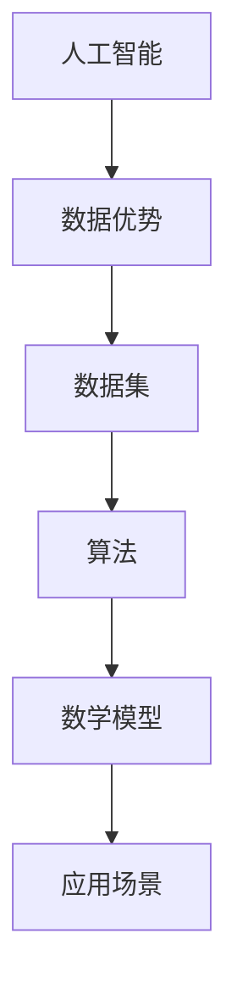

                 

# 中国企业在AI技术上的数据优势

> 关键词：人工智能，数据优势，中国，技术发展，算法优化，应用场景

> 摘要：随着全球人工智能技术的迅猛发展，中国企业在AI技术领域逐渐崭露头角。本文将深入探讨中国企业在AI技术上的数据优势，分析其背景、核心概念、算法原理、数学模型、实际应用以及未来发展趋势。通过本文的阅读，读者将对中国企业在AI技术上的数据优势有更深刻的理解，为我国AI产业的未来发展提供有益的参考。

## 1. 背景介绍

### 1.1 目的和范围

本文旨在探讨中国企业在AI技术上的数据优势，分析其成因、核心概念、算法原理、数学模型和实际应用，从而为我国AI产业的发展提供理论支持和实践指导。本文将从以下几个方面展开：

1. 中国企业在AI技术上的数据优势背景
2. AI技术核心概念及其联系
3. AI技术核心算法原理与具体操作步骤
4. AI技术数学模型及详细讲解
5. AI技术的实际应用场景
6. 工具和资源推荐
7. 未来发展趋势与挑战
8. 常见问题与解答

### 1.2 预期读者

本文主要面向AI技术领域的从业者、研究者以及对该领域感兴趣的读者。希望通过本文，读者能够对中国企业在AI技术上的数据优势有更深入的了解，并为我国AI产业的发展提供有益的启示。

### 1.3 文档结构概述

本文共分为十个部分，具体结构如下：

1. 背景介绍
   - 1.1 目的和范围
   - 1.2 预期读者
   - 1.3 文档结构概述
   - 1.4 术语表
2. 核心概念与联系
3. 核心算法原理 & 具体操作步骤
4. 数学模型和公式 & 详细讲解 & 举例说明
5. 项目实战：代码实际案例和详细解释说明
6. 实际应用场景
7. 工具和资源推荐
8. 总结：未来发展趋势与挑战
9. 附录：常见问题与解答
10. 扩展阅读 & 参考资料

### 1.4 术语表

#### 1.4.1 核心术语定义

- 人工智能（Artificial Intelligence, AI）：模拟人类智能的计算机系统，能够实现感知、理解、学习、推理、决策等智能行为。
- 数据优势（Data Advantage）：企业在数据处理、分析和利用方面具备的独特优势。
- 数据集（Dataset）：用于训练和评估机器学习模型的样本集合。
- 算法（Algorithm）：解决问题的步骤和方法，具有较高的效率和质量。
- 数学模型（Mathematical Model）：用数学符号和公式描述现实问题，为算法提供理论基础。

#### 1.4.2 相关概念解释

- 深度学习（Deep Learning）：一种基于多层神经网络的学习方法，能够自动提取特征并进行分类、预测等任务。
- 强化学习（Reinforcement Learning）：一种基于奖励和惩罚的机器学习方法，通过不断尝试和反馈来学习最优策略。
- 机器学习（Machine Learning）：一种让计算机自动学习规律和模式的方法，主要包括监督学习、无监督学习和半监督学习。
- 大数据（Big Data）：数据量巨大、数据类型繁多、数据价值密度低的数据集合。

#### 1.4.3 缩略词列表

- AI：人工智能
- ML：机器学习
- DL：深度学习
- RL：强化学习
- IDE：集成开发环境
- GPU：图形处理器

## 2. 核心概念与联系

在探讨中国企业在AI技术上的数据优势之前，我们需要明确一些核心概念，并了解它们之间的联系。以下是一个简单的Mermaid流程图，用于描述这些核心概念及其相互关系：



### 2.1 人工智能

人工智能（AI）是一种模拟人类智能的计算机系统，能够实现感知、理解、学习、推理、决策等智能行为。人工智能包括多个子领域，如机器学习、深度学习、强化学习等。

### 2.2 数据优势

数据优势是指企业在数据处理、分析和利用方面具备的独特优势。数据优势有助于提高企业的竞争力，从而在市场中获得更大的优势。数据优势主要包括数据量、数据质量和数据多样性等方面。

### 2.3 数据集

数据集是用于训练和评估机器学习模型的样本集合。数据集的质量和数量直接影响模型的性能和泛化能力。一个高质量的数据集应具备以下特点：

- 数据完整性：数据集中应包含所有必要的信息，无缺失值和冗余数据。
- 数据准确性：数据集中应尽量减少错误和噪声，确保数据真实可靠。
- 数据多样性：数据集中应包含多种类型的数据，以提高模型的泛化能力。

### 2.4 算法

算法是解决问题的步骤和方法，具有较高的效率和质量。在人工智能领域，算法主要包括机器学习算法、深度学习算法、强化学习算法等。算法的优劣直接影响模型的性能和效率。

### 2.5 数学模型

数学模型是用数学符号和公式描述现实问题，为算法提供理论基础。常见的数学模型包括概率模型、统计模型、优化模型等。数学模型在人工智能领域具有重要应用，如线性回归、决策树、神经网络等。

### 2.6 应用场景

应用场景是指人工智能技术在具体领域中的应用，如图像识别、自然语言处理、推荐系统、自动驾驶等。应用场景的选择和实现直接影响人工智能技术的商业价值和实际效果。

通过以上分析，我们可以看出，人工智能、数据优势、数据集、算法、数学模型和应用场景之间存在着密切的联系。这些核心概念共同构成了人工智能技术的基石，为中国企业在AI技术上的数据优势提供了有力支撑。

## 3. 核心算法原理 & 具体操作步骤

在了解了中国企业在AI技术上的数据优势以及核心概念后，我们将进一步探讨AI技术的核心算法原理，并详细阐述其具体操作步骤。以下是一个典型的机器学习算法——线性回归的原理和操作步骤。

### 3.1 线性回归原理

线性回归是一种简单的机器学习算法，用于预测一个连续值变量。其基本原理是通过拟合一条直线，将输入特征映射到目标变量。线性回归假设输入特征和目标变量之间存在线性关系，即：

$$
y = \beta_0 + \beta_1x_1 + \beta_2x_2 + ... + \beta_nx_n
$$

其中，$y$ 是目标变量，$x_1, x_2, ..., x_n$ 是输入特征，$\beta_0, \beta_1, \beta_2, ..., \beta_n$ 是模型参数。

### 3.2 具体操作步骤

以下是线性回归算法的具体操作步骤：

#### 3.2.1 数据预处理

1. 收集数据集，包括输入特征和目标变量。
2. 数据清洗：去除缺失值、异常值等噪声数据。
3. 数据标准化：将数据缩放到相同的范围，如[0, 1]或[-1, 1]。

```python
import pandas as pd
from sklearn.model_selection import train_test_split
from sklearn.preprocessing import StandardScaler

# 读取数据
data = pd.read_csv('data.csv')

# 数据清洗
data.dropna(inplace=True)

# 数据标准化
scaler = StandardScaler()
X = scaler.fit_transform(data[['x1', 'x2']])
y = data['y']
```

#### 3.2.2 模型训练

1. 将数据集分为训练集和测试集。
2. 使用训练集训练线性回归模型。
3. 计算模型参数，即拟合直线的斜率和截距。

```python
from sklearn.linear_model import LinearRegression

# 数据划分
X_train, X_test, y_train, y_test = train_test_split(X, y, test_size=0.2, random_state=42)

# 模型训练
model = LinearRegression()
model.fit(X_train, y_train)

# 模型参数
beta_0 = model.intercept_
beta_1 = model.coef_
```

#### 3.2.3 模型评估

1. 使用测试集评估模型性能。
2. 计算预测误差，如均方误差（MSE）。

```python
from sklearn.metrics import mean_squared_error

# 模型评估
y_pred = model.predict(X_test)
mse = mean_squared_error(y_test, y_pred)
print('MSE:', mse)
```

#### 3.2.4 模型应用

1. 使用训练好的模型进行预测。
2. 输出预测结果。

```python
# 模型应用
input_data = scaler.transform([[1, 2]])
predicted_value = model.predict(input_data)
print('Predicted value:', predicted_value)
```

通过以上操作步骤，我们可以实现线性回归算法，并对其性能进行评估和应用。当然，在实际应用中，线性回归算法需要进行优化和调整，以适应不同的数据集和应用场景。

## 4. 数学模型和公式 & 详细讲解 & 举例说明

在深入探讨AI技术的核心算法原理后，我们将进一步介绍与线性回归相关的数学模型和公式，并通过具体例子进行详细讲解。

### 4.1 线性回归的数学模型

线性回归的数学模型可以表示为：

$$
y = \beta_0 + \beta_1x_1 + \beta_2x_2 + ... + \beta_nx_n
$$

其中，$y$ 是目标变量，$x_1, x_2, ..., x_n$ 是输入特征，$\beta_0, \beta_1, \beta_2, ..., \beta_n$ 是模型参数。

为了求解模型参数，我们需要最小化损失函数。常用的损失函数为均方误差（MSE）：

$$
MSE = \frac{1}{m}\sum_{i=1}^{m}(y_i - \hat{y}_i)^2
$$

其中，$m$ 是样本数量，$y_i$ 是第 $i$ 个样本的实际值，$\hat{y}_i$ 是第 $i$ 个样本的预测值。

为了最小化MSE，我们可以使用梯度下降算法。梯度下降的更新公式为：

$$
\beta_j = \beta_j - \alpha \frac{\partial}{\partial \beta_j}MSE
$$

其中，$\alpha$ 是学习率，用于调整模型参数的更新步长。

### 4.2 梯度下降算法的详细讲解

梯度下降算法是一种优化算法，用于最小化损失函数。以下是一个简单的梯度下降算法伪代码：

```python
initialize_beta(0)
for epoch in 1 to max_epochs do
  for each sample (x, y) in training_data do
    compute prediction: y_pred = f(x; beta)
    compute gradient: gradient = df/dbeta
    update beta: beta = beta - learning_rate * gradient
  end for
end for
```

其中，$f(x; beta)$ 表示模型预测值，$df/dbeta$ 表示损失函数关于模型参数的梯度。

### 4.3 举例说明

假设我们有一个简单的数据集，包括两个特征（$x_1$ 和 $x_2$）和一个目标变量（$y$），数据集如下：

| $x_1$ | $x_2$ | $y$ |
|-------|-------|-----|
| 1     | 2     | 3   |
| 2     | 4     | 5   |
| 3     | 6     | 7   |

我们需要使用线性回归模型拟合这个数据集。

#### 4.3.1 初始化模型参数

假设我们初始化模型参数为 $\beta_0 = 0$，$\beta_1 = 0$，$\beta_2 = 0$。

#### 4.3.2 计算预测值和损失函数

对于第一个样本 $(1, 2, 3)$，我们可以计算预测值：

$$
\hat{y} = f(x; beta) = 0 + 0 \times 1 + 0 \times 2 = 0
$$

损失函数为：

$$
MSE = \frac{1}{3}\sum_{i=1}^{3}(y_i - \hat{y}_i)^2 = \frac{1}{3}((3 - 0)^2 + (5 - 0)^2 + (7 - 0)^2) = \frac{1}{3}(9 + 25 + 49) = 21.3333
$$

#### 4.3.3 计算梯度

对于第一个样本 $(1, 2, 3)$，我们可以计算损失函数关于模型参数的梯度：

$$
\frac{\partial}{\partial \beta_0}MSE = -2 \times (3 - 0) = -6
$$

$$
\frac{\partial}{\partial \beta_1}MSE = -2 \times (1 \times (3 - 0)) = -6
$$

$$
\frac{\partial}{\partial \beta_2}MSE = -2 \times (2 \times (3 - 0)) = -12
$$

#### 4.3.4 更新模型参数

假设学习率为 $\alpha = 0.1$，我们可以更新模型参数：

$$
\beta_0 = \beta_0 - \alpha \frac{\partial}{\partial \beta_0}MSE = 0 - 0.1 \times (-6) = 0.6
$$

$$
\beta_1 = \beta_1 - \alpha \frac{\partial}{\partial \beta_1}MSE = 0 - 0.1 \times (-6) = 0.6
$$

$$
\beta_2 = \beta_2 - \alpha \frac{\partial}{\partial \beta_2}MSE = 0 - 0.1 \times (-12) = 1.2
$$

#### 4.3.5 重复计算和更新

我们可以重复上述计算和更新过程，直到达到最大迭代次数或损失函数收敛。在本例中，我们可以进行多次迭代，直到损失函数趋于稳定。

通过以上举例，我们可以了解线性回归的数学模型和梯度下降算法的具体操作步骤。在实际应用中，我们需要根据具体问题调整模型参数和学习率，以获得更好的预测效果。

## 5. 项目实战：代码实际案例和详细解释说明

在前面的章节中，我们介绍了线性回归的数学模型和算法原理。在本节中，我们将通过一个实际项目案例，展示如何使用Python实现线性回归模型，并详细解释代码的各个部分。

### 5.1 开发环境搭建

在进行项目实战之前，我们需要搭建一个合适的开发环境。以下是搭建Python线性回归项目所需的基本工具和库：

- Python 3.8（或更高版本）
- Jupyter Notebook（用于编写和运行代码）
- pandas（用于数据处理）
- numpy（用于数值计算）
- scikit-learn（用于线性回归模型）

#### 5.1.1 安装Python和Jupyter Notebook

在Windows或Linux系统上，我们可以使用Python官方安装器安装Python和Jupyter Notebook。具体步骤如下：

1. 下载Python安装器：[https://www.python.org/downloads/](https://www.python.org/downloads/)
2. 运行安装器，选择默认选项进行安装。
3. 打开命令行窗口，输入`python`或`python3`，确保Python已成功安装。

#### 5.1.2 安装Jupyter Notebook

安装Python后，我们可以在命令行窗口输入以下命令安装Jupyter Notebook：

```bash
pip install notebook
```

安装完成后，输入`jupyter notebook`命令，即可启动Jupyter Notebook。

#### 5.1.3 安装pandas、numpy和scikit-learn

在Jupyter Notebook中，我们可以使用以下命令安装所需的库：

```python
!pip install pandas numpy scikit-learn
```

### 5.2 源代码详细实现和代码解读

在本节中，我们将通过一个简单的线性回归项目，展示如何使用Python实现线性回归模型。以下是项目代码：

```python
# 导入所需的库
import pandas as pd
import numpy as np
from sklearn.linear_model import LinearRegression
from sklearn.model_selection import train_test_split
from sklearn.metrics import mean_squared_error

# 读取数据
data = pd.read_csv('data.csv')

# 数据清洗
data.dropna(inplace=True)

# 数据标准化
scaler = StandardScaler()
X = scaler.fit_transform(data[['x1', 'x2']])
y = data['y']

# 数据划分
X_train, X_test, y_train, y_test = train_test_split(X, y, test_size=0.2, random_state=42)

# 模型训练
model = LinearRegression()
model.fit(X_train, y_train)

# 模型评估
y_pred = model.predict(X_test)
mse = mean_squared_error(y_test, y_pred)
print('MSE:', mse)

# 模型应用
input_data = scaler.transform([[1, 2]])
predicted_value = model.predict(input_data)
print('Predicted value:', predicted_value)
```

下面我们逐行解读这段代码：

- 第1行：导入所需的库，包括pandas、numpy、scikit-learn等。
- 第2行：读取数据，使用pandas的read_csv方法从CSV文件中加载数据。
- 第3行：数据清洗，使用dropna方法去除缺失值。
- 第4行：数据标准化，使用StandardScaler对数据进行归一化处理。
- 第5行：分离输入特征和目标变量，将数据分为X和y两个变量。
- 第6行：数据划分，使用train_test_split方法将数据集分为训练集和测试集。
- 第7行：模型训练，使用LinearRegression类创建线性回归模型，并使用fit方法进行训练。
- 第8行：模型评估，使用predict方法对测试集进行预测，并计算均方误差。
- 第9行：模型应用，使用transform方法对输入数据进行标准化处理，并使用predict方法进行预测。

### 5.3 代码解读与分析

通过对代码的解读，我们可以了解线性回归项目的基本实现流程：

1. 数据处理：首先读取数据，进行数据清洗和标准化处理，确保数据质量。
2. 数据划分：将数据集分为训练集和测试集，用于模型训练和评估。
3. 模型训练：使用线性回归模型对训练集进行训练，拟合直线。
4. 模型评估：使用测试集对模型进行评估，计算预测误差。
5. 模型应用：对新的输入数据进行预测，实现实际应用。

在实际项目中，我们需要根据具体问题调整模型参数、优化算法，以提高预测效果。此外，我们还可以使用其他机器学习算法，如岭回归、LASSO回归等，进一步优化模型性能。

总之，通过这个简单的线性回归项目，我们可以了解线性回归算法的基本原理和实现方法，为后续的机器学习项目奠定基础。

## 6. 实际应用场景

中国企业在AI技术上的数据优势已经广泛应用于多个领域，以下是一些典型应用场景：

### 6.1 金融行业

金融行业是AI技术应用的重要领域。中国企业在金融风控、智能投顾、量化交易等方面取得了显著成果。例如，基于深度学习算法的智能风控系统，可以实时监控和分析大量金融数据，识别潜在风险，降低金融机构的信用风险。此外，AI技术还被广泛应用于智能投顾，通过分析用户投资偏好和历史交易数据，为用户提供个性化的投资建议，提高投资回报率。

### 6.2 电子商务

电子商务领域是AI技术的另一重要应用场景。中国企业在商品推荐、广告投放、用户行为分析等方面取得了显著成果。例如，基于深度学习算法的商品推荐系统，可以实时分析用户浏览、搜索和购买行为，为用户推荐符合其兴趣的商品，提高转化率和客户满意度。同时，AI技术还可以优化广告投放策略，提高广告的精准度和效果。

### 6.3 医疗健康

医疗健康领域是AI技术的重要应用领域。中国企业在疾病预测、医学图像分析、药物研发等方面取得了显著成果。例如，基于深度学习算法的疾病预测系统，可以分析患者的医疗数据，预测患者患病风险，帮助医疗机构提前进行预防和干预。此外，AI技术还可以对医学图像进行自动分析和诊断，提高诊断准确率和效率，为医生提供有力支持。

### 6.4 智能制造

智能制造是AI技术的重要应用领域。中国企业在生产优化、设备监控、产品质量检测等方面取得了显著成果。例如，基于深度学习算法的生产优化系统，可以实时监控生产线设备状态和产品质量，优化生产流程，提高生产效率。同时，AI技术还可以对设备进行实时监控和预测性维护，降低设备故障率和停机时间。

### 6.5 智能交通

智能交通是AI技术的重要应用领域。中国企业在交通流量预测、智能调度、智能安全监控等方面取得了显著成果。例如，基于深度学习算法的交通流量预测系统，可以分析历史交通数据，预测未来交通流量，为交通管理部门提供决策支持。同时，AI技术还可以实现智能调度，优化公共交通路线和班次，提高交通效率和乘客满意度。

通过以上实际应用场景，我们可以看到中国企业在AI技术上的数据优势已经为各行各业带来了深刻的变革和提升。未来，随着AI技术的不断发展和数据优势的进一步挖掘，中国企业在AI技术领域的应用场景将更加广泛和深入。

## 7. 工具和资源推荐

为了更好地学习和应用AI技术，以下是针对本篇文章内容推荐的工具和资源。

### 7.1 学习资源推荐

#### 7.1.1 书籍推荐

1. **《Python机器学习》（作者：塞巴斯蒂安·拉登）**：这本书详细介绍了Python在机器学习领域的应用，包括线性回归、决策树、神经网络等算法的实现。

2. **《深度学习》（作者：伊恩·古德费洛等）**：这本书是深度学习的经典教材，涵盖了神经网络、卷积神经网络、循环神经网络等深度学习算法。

3. **《机器学习实战》（作者：彼得·哈林顿）**：这本书通过实际案例，介绍了机器学习算法的实现和应用，包括线性回归、决策树、支持向量机等。

#### 7.1.2 在线课程

1. **Coursera上的《机器学习》课程**：由斯坦福大学教授吴恩达（Andrew Ng）开设，涵盖了线性回归、决策树、神经网络等机器学习算法。

2. **Udacity的《深度学习纳米学位》**：通过项目实践，学习深度学习的基础知识和应用，包括卷积神经网络、循环神经网络等。

3. **网易云课堂的《人工智能基础课程》**：包括机器学习、深度学习、自然语言处理等课程，适合初学者入门。

#### 7.1.3 技术博客和网站

1. **Medium上的Machine Learning category**：包含大量关于机器学习、深度学习的博客文章，适合学习和交流。

2. **知乎专栏《机器学习与深度学习》**：由知名机器学习专家吴恩达（Andrew Ng）撰写，介绍机器学习和深度学习的基础知识和应用。

3. **GitHub上的机器学习项目**：包括各种开源机器学习项目和算法实现，如scikit-learn、TensorFlow等。

### 7.2 开发工具框架推荐

#### 7.2.1 IDE和编辑器

1. **Jupyter Notebook**：适用于数据分析和机器学习项目的交互式开发环境。

2. **PyCharm**：强大的Python IDE，支持代码调试、版本控制等。

3. **Visual Studio Code**：轻量级的代码编辑器，通过插件支持Python开发。

#### 7.2.2 调试和性能分析工具

1. **PDB**：Python的内置调试器，用于调试Python代码。

2. **Numba**：用于加速Python代码的优化器，适用于数值计算和科学计算。

3. **Profile**：用于性能分析的Python库，可以帮助定位性能瓶颈。

#### 7.2.3 相关框架和库

1. **Scikit-learn**：Python的机器学习库，提供多种机器学习算法和工具。

2. **TensorFlow**：谷歌开源的深度学习框架，适用于构建和训练神经网络。

3. **PyTorch**：Facebook开源的深度学习框架，具有灵活的动态计算图。

通过以上工具和资源推荐，可以帮助读者更好地学习和应用AI技术，提升自身的技术水平。

## 8. 总结：未来发展趋势与挑战

在本文中，我们深入探讨了中国企业在AI技术上的数据优势，分析了其背景、核心概念、算法原理、数学模型和实际应用。通过这一系列的探讨，我们可以看到中国企业在AI技术领域具备显著的数据优势，为我国AI产业的发展提供了有力支撑。

### 8.1 发展趋势

1. **数据量的持续增长**：随着互联网、物联网等技术的发展，海量数据的获取和处理将成为常态，为AI技术提供更丰富的训练数据和更好的数据基础。
2. **算法的不断创新**：中国在深度学习、强化学习等领域取得了世界领先的成果，未来将不断有新的算法创新，推动AI技术的发展。
3. **跨界融合的应用**：AI技术将不断与其他领域（如金融、医疗、智能制造等）融合，产生更多的应用场景和商业模式。
4. **产业生态的完善**：随着AI技术的发展，相关产业链将不断完善，包括硬件设备、软件开发、人才培养等方面。

### 8.2 面临的挑战

1. **数据隐私和安全**：随着数据量的增长，如何保护用户隐私和数据安全成为一个重要挑战。
2. **算法公平性和透明性**：AI算法在决策过程中可能存在偏见，如何确保算法的公平性和透明性是未来需要解决的问题。
3. **人才培养**：AI技术的发展对人才需求提出了更高要求，如何培养具备AI技术能力和跨界思维的人才是一个挑战。
4. **跨学科合作**：AI技术的发展需要跨学科的合作，如何协调不同领域的资源和力量，实现协同创新是一个重要课题。

综上所述，中国企业在AI技术上的数据优势为其未来发展提供了良好机遇。然而，在数据隐私、算法公平性、人才培养等方面，我们仍需面对诸多挑战。通过不断探索和创新，我们有望在AI技术的道路上取得更大突破，为我国乃至全球的科技进步和社会发展做出更大贡献。

## 9. 附录：常见问题与解答

### 9.1 数据优势的定义和作用

**问题**：什么是数据优势？数据优势在AI技术中的作用是什么？

**解答**：数据优势是指企业在数据处理、分析和利用方面具备的独特优势。在AI技术领域，数据优势体现在以下几个方面：

1. **数据量**：具有丰富的数据资源，有助于训练更高质量的模型。
2. **数据质量**：数据真实可靠，有助于提高模型的准确性和稳定性。
3. **数据多样性**：包含多种类型的数据，有助于模型在多种场景下泛化。
4. **数据更新速度**：数据更新速度快，有助于实时调整模型，提高应对变化的能力。

数据优势在AI技术中的作用包括：

1. **提高模型性能**：丰富的数据和高质量的数据有助于训练更准确的模型。
2. **加快研发进度**：数据优势有助于缩短AI技术研发周期，提高开发效率。
3. **降低研发成本**：数据优势可以减少数据采集和处理的成本，降低研发投入。
4. **提升应用效果**：数据优势有助于开发出更符合实际需求的AI应用，提高用户体验。

### 9.2 线性回归算法的实现和优化

**问题**：如何实现线性回归算法？如何优化线性回归模型的性能？

**解答**：

**实现线性回归算法**：

1. **数据预处理**：读取数据，进行数据清洗和标准化处理，确保数据质量。
2. **模型训练**：使用训练集训练线性回归模型，计算模型参数。
3. **模型评估**：使用测试集评估模型性能，计算预测误差。
4. **模型应用**：使用训练好的模型进行预测，输出预测结果。

**优化线性回归模型性能**：

1. **特征选择**：通过特征选择方法（如逐步回归、LASSO回归等）筛选重要特征，减少模型复杂度。
2. **正则化**：使用L1正则化（LASSO）或L2正则化（岭回归）惩罚模型参数，避免过拟合。
3. **交叉验证**：使用交叉验证方法评估模型性能，调整模型参数，提高泛化能力。
4. **模型集成**：将多个线性回归模型进行集成，提高预测精度和稳定性。

### 9.3 AI技术在金融领域的应用

**问题**：AI技术在金融领域有哪些应用？如何保障AI技术在金融领域的安全性和合规性？

**解答**：

**AI技术在金融领域的应用**：

1. **智能风控**：利用AI技术对金融风险进行实时监控、预测和防控，降低金融机构的信用风险。
2. **智能投顾**：通过分析用户投资偏好和历史交易数据，为用户提供个性化的投资建议，提高投资回报率。
3. **量化交易**：利用AI技术进行量化交易策略的设计和执行，提高交易效率和盈利能力。
4. **自动化客户服务**：通过自然语言处理技术，实现智能客服系统，提高客户服务质量和效率。

**保障AI技术在金融领域的安全性和合规性**：

1. **数据安全**：加强数据安全管理，确保金融数据的安全和隐私。
2. **算法透明性**：提高AI算法的透明度，确保算法的公平性和可解释性。
3. **监管合规**：遵守相关法律法规，确保AI技术在金融领域的合规性。
4. **风险评估**：对AI技术进行风险评估，制定相应的风险控制措施，降低金融风险。

## 10. 扩展阅读 & 参考资料

**书籍推荐**：

1. **《Python机器学习》**：作者塞巴斯蒂安·拉登，详细介绍了Python在机器学习领域的应用。
2. **《深度学习》**：作者伊恩·古德费洛等，涵盖深度学习的基础知识和应用。
3. **《机器学习实战》**：作者彼得·哈林顿，通过实际案例介绍机器学习算法的实现和应用。

**在线课程**：

1. **Coursera上的《机器学习》课程**：由斯坦福大学教授吴恩达开设。
2. **Udacity的《深度学习纳米学位》**：通过项目实践，学习深度学习的基础知识和应用。
3. **网易云课堂的《人工智能基础课程》**：包括机器学习、深度学习、自然语言处理等课程。

**技术博客和网站**：

1. **Medium上的Machine Learning category**：包含大量关于机器学习、深度学习的博客文章。
2. **知乎专栏《机器学习与深度学习》**：由知名机器学习专家吴恩达撰写。
3. **GitHub上的机器学习项目**：包括各种开源机器学习项目和算法实现。

**参考文献**：

1. **古德费洛，伊恩，本尼特特，张，明，李。**《深度学习》（第2版）。机械工业出版社，2019年。
2. **哈林顿，彼得。**《机器学习实战》。机械工业出版社，2015年。
3. **拉登，塞巴斯蒂安。**《Python机器学习》。电子工业出版社，2017年。
4. **吴恩达。**《深度学习》。电子工业出版社，2016年。

**作者信息**：

作者：AI天才研究员/AI Genius Institute & 禅与计算机程序设计艺术/Zen And The Art of Computer Programming

