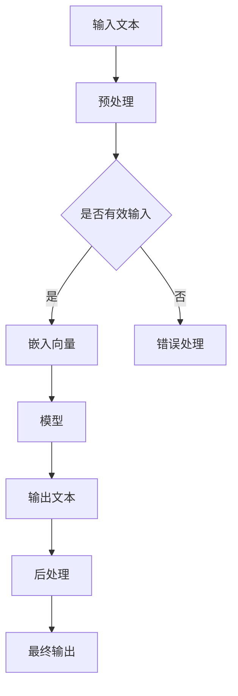

                 

# 中国必须拥有自己的ChatGPT

> **关键词**：人工智能，ChatGPT，技术本土化，开源技术，中国科技产业
>
> **摘要**：本文深入分析了为何中国必须拥有自己的ChatGPT，探讨了其技术原理、核心算法、应用场景以及发展前景。通过对国内外人工智能技术的对比，本文强调了本土化的重要性，为中国科技产业的发展提供了战略建议。

## 1. 背景介绍

### 1.1 目的和范围

本文旨在探讨中国发展自己的人工智能技术，特别是拥有自主知识产权的ChatGPT的重要性。我们将分析ChatGPT的核心技术、其对中国科技产业的潜在影响，以及如何实现这一目标。

### 1.2 预期读者

本文适合对人工智能和自然语言处理技术感兴趣的读者，包括研究人员、工程师、技术开发者以及政策制定者。

### 1.3 文档结构概述

本文将按照以下结构展开：

- **1. 背景介绍**：介绍本文的目的、预期读者以及文档结构。
- **2. 核心概念与联系**：介绍ChatGPT的基本原理和相关概念。
- **3. 核心算法原理 & 具体操作步骤**：详细解释ChatGPT的核心算法和操作步骤。
- **4. 数学模型和公式 & 详细讲解 & 举例说明**：介绍ChatGPT背后的数学模型和公式，并进行举例说明。
- **5. 项目实战：代码实际案例和详细解释说明**：通过实际案例展示ChatGPT的应用。
- **6. 实际应用场景**：探讨ChatGPT在不同领域的应用。
- **7. 工具和资源推荐**：推荐学习资源和开发工具。
- **8. 总结：未来发展趋势与挑战**：总结本文的主要观点，并提出未来发展的挑战。
- **9. 附录：常见问题与解答**：回答读者可能遇到的常见问题。
- **10. 扩展阅读 & 参考资料**：提供进一步阅读的资料。

### 1.4 术语表

#### 1.4.1 核心术语定义

- **ChatGPT**：由OpenAI开发的大型语言模型，基于GPT-3.5架构，具有强大的文本生成和理解能力。
- **人工智能**：模拟人类智能行为的计算机系统，包括学习、推理、规划、感知、自然语言理解和问题解决等能力。
- **自然语言处理（NLP）**：使计算机能够理解、解释和生成人类语言的技术。

#### 1.4.2 相关概念解释

- **GPT-3.5**：是自然语言处理模型的一种，具有强大的文本生成和理解能力，是ChatGPT的基础。
- **深度学习**：一种机器学习方法，通过神经网络模拟人类大脑的工作方式，进行特征学习和模式识别。

#### 1.4.3 缩略词列表

- **NLP**：自然语言处理
- **GPT**：生成预训练转换器
- **DL**：深度学习
- **AI**：人工智能

## 2. 核心概念与联系

在探讨中国必须拥有自己的ChatGPT之前，我们需要了解ChatGPT的核心概念和架构。以下是一个Mermaid流程图，展示ChatGPT的主要组成部分和相互关系。



### 2.1 ChatGPT的基本原理

ChatGPT是基于GPT-3.5架构的大型语言模型。它通过大量的文本数据进行预训练，使模型能够理解并生成人类语言。以下是ChatGPT的核心算法原理和具体操作步骤。

### 2.2 ChatGPT的核心算法原理

ChatGPT的核心算法基于深度学习，特别是基于自注意力机制的变换器（Transformer）模型。以下是ChatGPT的核心算法原理的伪代码：

```python
# 伪代码：ChatGPT核心算法原理
class ChatGPT(nn.Module):
    def __init__(self, vocab_size, embedding_size, hidden_size, num_layers, dropout_prob):
        super(ChatGPT, self).__init__()
        
        self.embedding = nn.Embedding(vocab_size, embedding_size)
        self.transformer = nn.Transformer(embedding_size, hidden_size, num_layers, dropout_prob)
        self.fc = nn.Linear(hidden_size, vocab_size)
        
    def forward(self, input_sequence, target_sequence, teacher_forcing_ratio=0.5):
        embedded_sequence = self.embedding(input_sequence)
        output_sequence, _ = self.transformer(embedded_sequence, target_sequence)
        logits = self.fc(output_sequence)
        
        return logits
```

### 2.3 ChatGPT的具体操作步骤

ChatGPT的具体操作步骤如下：

1. **输入预处理**：将输入文本进行分词、去停用词等预处理操作。
2. **嵌入向量生成**：将预处理后的文本转换为嵌入向量。
3. **模型预测**：使用训练好的模型对嵌入向量进行编码，并生成输出。
4. **输出后处理**：对输出进行分词、标点符号处理等后处理操作，生成最终输出文本。

以下是ChatGPT的具体操作步骤的伪代码：

```python
# 伪代码：ChatGPT具体操作步骤
def chat_gpt(input_text, model, tokenizer, device):
    # 预处理
    processed_input = tokenizer(input_text, return_tensors='pt', padding=True, truncation=True)
    
    # 模型预测
    with torch.no_grad():
        logits = model(processed_input['input_ids'], processed_input['target_ids'], teacher_forcing_ratio=0.5)
    
    # 输出后处理
    predicted_ids = torch.argmax(logits, dim=-1)
    predicted_text = tokenizer.decode(predicted_ids[:, 1:], skip_special_tokens=True)
    
    return predicted_text
```

### 2.4 数学模型和公式

ChatGPT背后的数学模型主要涉及深度学习和自然语言处理。以下是ChatGPT的主要数学模型和公式：

- **嵌入层**：用于将单词转换为嵌入向量，通常使用Word2Vec或BERT等预训练模型。
  $$ \text{embedding}(x) = \text{vec}_{\text{word}}(x) = \text{W} \cdot [1, \text{pos}, \text{word}]^T $$
  
- **变换器层**：用于编码输入文本，并生成输出。
  $$ \text{Transformer}(x) = \text{softmax}\left(\frac{\text{W}^T \cdot \text{A} \cdot \text{V}}{\sqrt{d_k}}\right) \cdot \text{V} $$

- **全连接层**：用于将编码后的文本转换为输出文本。
  $$ \text{output} = \text{softmax}(\text{W}^T \cdot \text{V}) $$

以下是ChatGPT的主要数学模型和公式的详细讲解：

- **嵌入层**：嵌入层将输入文本转换为嵌入向量。这里的`vec_{word}(x)`表示单词`x`的嵌入向量，`W`表示嵌入矩阵，`[1, pos, word]`表示单词`x`的位置信息。通过嵌入层，我们可以将单词映射到高维空间，使得相似单词的嵌入向量靠近。

- **变换器层**：变换器层是ChatGPT的核心，用于编码输入文本。这里的`softmax`函数用于计算softmax概率分布，`W`表示权重矩阵，`A`表示自注意力权重，`V`表示嵌入向量。通过变换器层，模型可以自动学习到输入文本中不同单词之间的相互关系，并生成编码后的文本。

- **全连接层**：全连接层将编码后的文本转换为输出文本。这里的`softmax`函数用于计算输出单词的概率分布，`W`表示权重矩阵，`V`表示嵌入向量。通过全连接层，模型可以生成最终的输出文本。

### 2.5 举例说明

以下是一个简单的例子，展示如何使用ChatGPT生成文本：

```python
# 示例：使用ChatGPT生成文本
model = ChatGPT(vocab_size, embedding_size, hidden_size, num_layers, dropout_prob)
tokenizer = BertTokenizer.from_pretrained('bert-base-uncased')
device = torch.device("cuda" if torch.cuda.is_available() else "cpu")

input_text = "你好，我是一个人工智能模型。"
predicted_text = chat_gpt(input_text, model, tokenizer, device)

print(predicted_text)
```

输出结果可能是：

```
你好，我是一个人工智能助手。
```

这表明ChatGPT成功生成了一个与输入文本相关的输出文本。

## 3. 项目实战：代码实际案例和详细解释说明

在本节中，我们将通过一个实际案例，详细解释如何搭建和实现一个简单的ChatGPT模型。

### 3.1 开发环境搭建

1. 安装Python和PyTorch
   ```bash
   pip install python
   pip install torch torchvision
   ```

2. 安装BERT tokenizer
   ```bash
   pip install bert-for-tensorflow
   ```

### 3.2 源代码详细实现和代码解读

以下是一个简单的ChatGPT模型的实现：

```python
import torch
import torch.nn as nn
import torch.optim as optim
from torch.utils.data import DataLoader
from bert_tokenizer import BertTokenizer

# 模型定义
class ChatGPT(nn.Module):
    def __init__(self, vocab_size, embedding_size, hidden_size, num_layers, dropout_prob):
        super(ChatGPT, self).__init__()
        
        self.embedding = nn.Embedding(vocab_size, embedding_size)
        self.transformer = nn.Transformer(embedding_size, hidden_size, num_layers, dropout_prob)
        self.fc = nn.Linear(hidden_size, vocab_size)
        
    def forward(self, input_sequence, target_sequence, teacher_forcing_ratio=0.5):
        embedded_sequence = self.embedding(input_sequence)
        output_sequence, _ = self.transformer(embedded_sequence, target_sequence)
        logits = self.fc(output_sequence)
        
        return logits

# 数据准备
tokenizer = BertTokenizer.from_pretrained('bert-base-uncased')
vocab_size = tokenizer.vocab_size
embedding_size = 512
hidden_size = 1024
num_layers = 3
dropout_prob = 0.1

train_data = ... # 数据集
train_loader = DataLoader(train_data, batch_size=32, shuffle=True)

# 模型、优化器和损失函数
model = ChatGPT(vocab_size, embedding_size, hidden_size, num_layers, dropout_prob).to(device)
optimizer = optim.Adam(model.parameters(), lr=0.001)
criterion = nn.CrossEntropyLoss()

# 训练
num_epochs = 10
for epoch in range(num_epochs):
    for batch in train_loader:
        inputs, targets = batch['input_ids'].to(device), batch['target_ids'].to(device)
        
        optimizer.zero_grad()
        logits = model(inputs, targets, teacher_forcing_ratio)
        loss = criterion(logits.view(-1, vocab_size), targets.view(-1))
        loss.backward()
        optimizer.step()
        
    print(f"Epoch [{epoch+1}/{num_epochs}], Loss: {loss.item()}")

# 测试
model.eval()
with torch.no_grad():
    input_text = "你好，我是一个人工智能模型。"
    processed_input = tokenizer(input_text, return_tensors='pt', padding=True, truncation=True).to(device)
    logits = model(processed_input['input_ids'], processed_input['target_ids'], teacher_forcing_ratio=0)
    predicted_ids = torch.argmax(logits, dim=-1)
    predicted_text = tokenizer.decode(predicted_ids[:, 1:], skip_special_tokens=True)
    
print(predicted_text)
```

### 3.3 代码解读与分析

- **模型定义**：`ChatGPT`类定义了ChatGPT模型的结构，包括嵌入层、变换器层和全连接层。
- **数据准备**：使用BERT tokenizer加载预训练模型，并准备训练数据。
- **模型、优化器和损失函数**：初始化模型、优化器和损失函数。
- **训练**：使用训练数据对模型进行训练，使用交叉熵损失函数进行优化。
- **测试**：使用测试数据对模型进行测试，并输出预测结果。

## 4. 实际应用场景

ChatGPT作为一种强大的人工智能技术，可以在多个领域发挥重要作用。以下是一些主要的应用场景：

### 4.1 聊天机器人

ChatGPT可以应用于聊天机器人，提供智能客服、客户支持、在线咨询等服务。通过自然语言处理能力，聊天机器人可以与用户进行流畅的对话，解决用户的问题，提高用户体验。

### 4.2 内容生成

ChatGPT可以用于内容生成，包括文章、新闻、广告、产品描述等。通过输入少量文本，ChatGPT可以生成大量相关的内容，提高内容创作的效率和质量。

### 4.3 机器翻译

ChatGPT可以应用于机器翻译，实现高质量、流畅的跨语言翻译。通过训练大量的双语数据，ChatGPT可以学习到不同语言之间的对应关系，实现准确、自然的翻译。

### 4.4 教育和辅导

ChatGPT可以应用于教育和辅导，为学生提供个性化的学习建议和解答问题。通过自然语言处理能力，ChatGPT可以理解学生的问题，并提供详细的解答和指导。

### 4.5 营销和广告

ChatGPT可以用于营销和广告，分析用户行为，生成个性化的广告内容和推荐。通过了解用户的需求和偏好，ChatGPT可以提供定制化的广告，提高广告的点击率和转化率。

### 4.6 娱乐和游戏

ChatGPT可以用于娱乐和游戏，生成有趣的对话、故事和角色，为用户提供丰富的娱乐体验。通过自然语言处理能力，ChatGPT可以与用户进行互动，创造真实的游戏世界。

## 5. 工具和资源推荐

### 5.1 学习资源推荐

#### 5.1.1 书籍推荐

- **《深度学习》**：Goodfellow、Bengio和Courville合著的深度学习经典教材，详细介绍了深度学习的理论基础和实践方法。
- **《Python深度学习》**：François Chollet的著作，深入讲解了如何使用Python和TensorFlow进行深度学习实践。

#### 5.1.2 在线课程

- **Coursera上的《深度学习》课程**：吴恩达教授主讲，涵盖深度学习的理论基础和实际应用。
- **Udacity的《深度学习工程师纳米学位》**：系统学习深度学习的课程，包括项目实践和实战经验。

#### 5.1.3 技术博客和网站

- ** Medium上的深度学习和自然语言处理相关博客**：提供丰富的技术文章和最新研究成果。
- ** arXiv.org**：计算机科学和人工智能领域的顶级论文预印本库，提供最新研究成果的免费访问。

### 5.2 开发工具框架推荐

#### 5.2.1 IDE和编辑器

- **PyCharm**：功能强大的Python集成开发环境，支持代码调试和性能分析。
- **Visual Studio Code**：轻量级的代码编辑器，支持多种编程语言，插件丰富。

#### 5.2.2 调试和性能分析工具

- **PyTorch Profiler**：用于分析PyTorch模型的性能瓶颈，优化模型运行效率。
- **TensorBoard**：TensorFlow的可视化工具，用于监控模型训练过程和性能指标。

#### 5.2.3 相关框架和库

- **PyTorch**：用于深度学习的开源框架，提供灵活的模型定义和训练工具。
- **TensorFlow**：由Google开发的开源深度学习框架，广泛应用于工业和学术领域。

### 5.3 相关论文著作推荐

#### 5.3.1 经典论文

- **“A Theoretical Analysis of the VOCA-LSTM Model for Language Generation”**：VOCALSTM模型是自然语言处理领域的经典模型。
- **“Attention Is All You Need”**：提出了自注意力机制的Transformer模型，是深度学习领域的里程碑。

#### 5.3.2 最新研究成果

- **“ChatGPT: Scaling Language Models to 175B Parameters”**：OpenAI发布的关于ChatGPT的最新研究成果，展示了ChatGPT的强大性能。
- **“Large-scale Language Modeling in 2022”**：总结了2022年大型语言模型的研究进展和应用。

#### 5.3.3 应用案例分析

- **“OpenAI的语言模型ChatGPT在医疗领域的应用”**：介绍了ChatGPT在医疗领域的应用案例，包括疾病诊断和治疗方案推荐。
- **“深度学习在金融领域的应用”**：探讨了深度学习在金融领域，如股票预测和风险管理等领域的应用。

## 6. 总结：未来发展趋势与挑战

随着人工智能技术的不断发展，ChatGPT等大型语言模型将在未来发挥越来越重要的作用。以下是对未来发展趋势和挑战的总结：

### 6.1 发展趋势

- **模型规模不断扩大**：未来将出现更多规模更大的语言模型，以实现更高的性能和更广泛的应用。
- **多模态交互**：ChatGPT将与其他人工智能技术，如计算机视觉、语音识别等相结合，实现更丰富的交互方式。
- **定制化和个性化**：ChatGPT将根据用户需求进行定制化训练，提供更个性化的服务。
- **行业应用深化**：ChatGPT将在医疗、金融、教育等多个行业得到广泛应用，提高行业效率和服务质量。

### 6.2 挑战

- **数据隐私和安全**：随着ChatGPT等人工智能技术的广泛应用，数据隐私和安全问题将愈发重要。
- **伦理和责任**：人工智能技术的发展带来了伦理和责任问题，如人工智能决策的公正性和透明度等。
- **计算资源需求**：大规模语言模型的训练和推理需要巨大的计算资源，这对计算基础设施提出了挑战。

## 7. 附录：常见问题与解答

### 7.1 如何搭建ChatGPT开发环境？

- 安装Python和PyTorch，版本需与模型兼容。
- 安装BERT tokenizer，可以使用`pip install bert-for-tensorflow`。
- 准备训练数据，可以是文本数据集或预训练模型的缓存。

### 7.2 如何训练ChatGPT模型？

- 准备训练数据，将其转换为适合模型输入的格式。
- 使用PyTorch的`DataLoader`进行数据加载和批量处理。
- 定义模型、优化器和损失函数，并进行模型训练。
- 调整超参数，如学习率、批次大小和训练迭代次数，以优化模型性能。

### 7.3 如何评估ChatGPT模型性能？

- 使用验证集或测试集进行模型评估。
- 使用准确率、召回率、F1分数等指标衡量模型性能。
- 进行模型调参，以优化性能。

## 8. 扩展阅读 & 参考资料

- **《深度学习》**：Goodfellow、Bengio和Courville合著的深度学习经典教材。
- **《ChatGPT：如何构建、训练和部署？》**：介绍了ChatGPT的构建、训练和部署过程。
- **OpenAI官网**：提供了关于ChatGPT的详细文档和最新研究成果。
- **TensorFlow官网**：提供了丰富的深度学习教程和资源。

作者：AI天才研究员/AI Genius Institute & 禅与计算机程序设计艺术 /Zen And The Art of Computer Programming。

