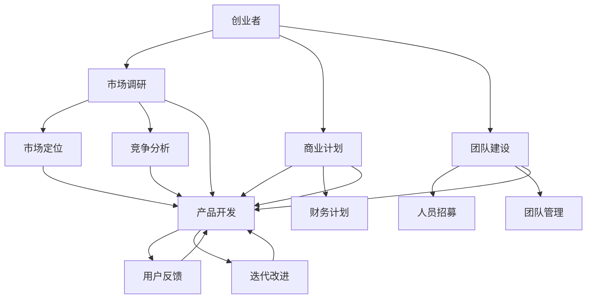

                 

### 文章标题

《为创业者提供系统知识培训和创业指导》

### 关键词

创业者、知识培训、创业指导、系统学习、技术知识、商业策略、风险投资、市场调研、产品开发、团队建设

### 摘要

在当今快速发展的商业环境中，创业者面临的挑战日益增加。本文旨在为创业者提供一套全面的知识培训体系和创业指导，帮助他们从零开始，构建和成长一个成功的创业公司。文章将详细讨论核心概念、算法原理、数学模型、实际项目案例以及相关的工具和资源，帮助创业者系统性地提升自身能力，更好地应对创业过程中的各种挑战。通过本文的指导，创业者将能够更加明确自己的发展方向，有效降低创业风险，提高成功率。

---

## 1. 背景介绍

### 1.1 目的和范围

本文的目的是为那些渴望在竞争激烈的商业世界中站稳脚跟的创业者提供系统性的知识培训和创业指导。创业不仅仅是一个创意的诞生，更是一个需要全面规划和执行的复杂过程。本文将涵盖以下几个核心领域：

1. **技术知识**：帮助创业者掌握基础的技术概念，理解技术发展趋势，以及如何将这些技术应用到产品开发中。
2. **商业策略**：指导创业者如何制定有效的商业计划，进行市场调研，定位目标市场，制定营销策略。
3. **团队建设**：介绍如何招募和管理团队，提高团队的协作效率，构建企业文化。
4. **融资策略**：讲解如何与风险投资家沟通，编写商业计划书，以及如何进行融资谈判。
5. **产品开发**：探讨产品开发流程，包括原型设计、用户反馈收集、迭代改进等。

### 1.2 预期读者

本文预期读者包括以下几类：

1. **有志于创业的大学生**：希望了解创业的基本概念和流程，为未来的创业道路打下基础。
2. **初次创业者**：正在寻找系统性的指导，希望提升自己的创业知识和技能。
3. **创业公司创始人**：希望优化公司的运营，提升团队能力，提高项目成功率。
4. **投资人**：对创业公司有兴趣，希望了解创业公司的运作模式和成功要素。

### 1.3 文档结构概述

本文分为以下几个部分：

1. **背景介绍**：介绍本文的目的、范围、预期读者和文档结构。
2. **核心概念与联系**：使用Mermaid流程图展示核心概念和它们之间的联系。
3. **核心算法原理 & 具体操作步骤**：通过伪代码详细阐述核心算法的原理和操作步骤。
4. **数学模型和公式 & 详细讲解 & 举例说明**：介绍关键的数学模型和公式，并给出实例说明。
5. **项目实战：代码实际案例和详细解释说明**：提供实际项目案例，展示代码实现过程和解读。
6. **实际应用场景**：分析创业过程中可能遇到的各种场景，提供解决方案。
7. **工具和资源推荐**：推荐学习资源和开发工具，帮助创业者提升能力。
8. **总结：未来发展趋势与挑战**：探讨创业领域的未来趋势和面临的挑战。
9. **附录：常见问题与解答**：回答读者可能关心的问题。
10. **扩展阅读 & 参考资料**：提供进一步阅读的资料和参考文献。

### 1.4 术语表

#### 1.4.1 核心术语定义

- **创业者**：指拥有创业精神，独立创建和运营企业的人。
- **商业计划书**：创业者为了获得资金支持或指导而编写的详细计划文档。
- **市场调研**：对目标市场进行系统性研究，以了解市场需求和竞争状况。
- **产品开发**：从创意到成品的全过程，包括市场调研、设计、开发、测试和发布。
- **风险投资**：投资者对创业公司进行的股权投资，以期获得高额回报。

#### 1.4.2 相关概念解释

- **创业生态系统**：包括政府、教育机构、金融机构、孵化器等在内的支持创业的机构和企业。
- **创业团队**：由一群有共同目标和互补技能的创业者组成，负责企业的日常运营和发展。
- **精益创业**：一种以用户需求为导向的创业方法，强调快速迭代和用户反馈。

#### 1.4.3 缩略词列表

- **AI**：人工智能
- **IoT**：物联网
- **SaaS**：软件即服务
- **PaaS**：平台即服务
- **IaaS**：基础设施即服务

---

接下来，我们将进一步深入探讨创业的核心概念，并通过Mermaid流程图展示它们之间的联系，为创业者提供一个清晰的思路。这将为后续的讨论和实际操作奠定坚实的基础。让我们一步一步地分析推理，确保每一个概念都深入人心。

## 2. 核心概念与联系

在创业的世界中，有几个核心概念对于成功至关重要。这些概念不仅独立存在，还相互交织，共同决定了企业的命运。在本节中，我们将通过Mermaid流程图展示这些核心概念之间的联系，帮助创业者理解其复杂性和相互作用。

### 2.1. Mermaid流程图

以下是一个简化的Mermaid流程图，用于展示创业核心概念之间的联系：



### 2.2. 核心概念解释

- **创业者**：创业者是创业的核心，他们拥有创意、决心和执行能力。创业者需要不断学习，适应市场变化，保持创新精神。
- **市场调研**：市场调研是了解市场需求和竞争状况的过程。通过调研，创业者可以确定目标市场、用户需求、竞争环境等，为商业计划提供数据支持。
- **商业计划**：商业计划是创业者的行动蓝图，包括产品描述、市场定位、营销策略、财务计划等。一个良好的商业计划可以帮助创业者清晰地了解企业的方向和目标。
- **团队建设**：团队建设是构建一个有战斗力的团队的过程。创业者需要招募合适的人才，建立良好的团队文化，提高团队协作效率。
- **市场定位**：市场定位是确定企业在市场中的位置和目标客户的过程。通过准确的定位，企业可以更好地满足用户需求，提升品牌影响力。
- **竞争分析**：竞争分析是研究竞争对手的过程，包括他们的产品、市场策略、市场份额等。通过分析竞争对手，创业者可以找到自己的竞争优势。
- **产品开发**：产品开发是将创意转化为实际产品的过程。创业者需要关注用户体验、功能迭代和产品质量，以满足市场需求。
- **用户反馈**：用户反馈是了解用户对产品的感受和需求的重要途径。通过用户反馈，创业者可以不断优化产品，提升用户满意度。
- **迭代改进**：迭代改进是一种持续改进的方法，通过不断测试和迭代，创业者可以逐步完善产品，提高市场竞争力。

### 2.3. 核心概念之间的联系

上述核心概念相互交织，共同构成了一个复杂的创业生态系统。创业者需要在这些概念之间找到平衡，确保每一个环节都得到充分关注。

- **创业者**与**市场调研**、**商业计划**和**团队建设**紧密相关。创业者需要通过市场调研制定商业计划，并组建一个能够执行该计划的团队。
- **市场定位**和**竞争分析**是商业计划的重要组成部分，它们直接影响产品的设计和营销策略。
- **产品开发**是基于市场调研和商业计划的执行过程，同时也是团队建设的重要成果。
- **用户反馈**和**迭代改进**是产品开发的持续过程，它们帮助创业者不断优化产品，提高用户满意度。

通过上述Mermaid流程图，创业者可以清晰地看到各个核心概念之间的联系，从而更好地理解创业的复杂性和系统性。接下来，我们将深入探讨核心算法原理，帮助创业者掌握关键技术和工具。

## 3. 核心算法原理 & 具体操作步骤

在创业过程中，技术知识是不可或缺的一部分。掌握核心算法原理不仅有助于创业者理解技术趋势，还能在产品开发中发挥关键作用。以下是一些基础的核心算法原理，我们将通过伪代码详细阐述其操作步骤。

### 3.1. 快速排序算法（Quicksort）

快速排序是一种高效的排序算法，它利用分治策略将一个大数组分割成多个小数组，并递归地对这些小数组进行排序。

**伪代码**：

```plaintext
QUICKSORT(A, low, high)
    if low < high
        pivotIndex = PARTITION(A, low, high)
        QUICKSORT(A, low, pivotIndex - 1)
        QUICKSORT(A, pivotIndex + 1, high)

PARTITION(A, low, high)
    pivot = A[high]
    i = low - 1
    for j = low to high - 1
        if A[j] < pivot
            i = i + 1
            swap A[i] with A[j]
    swap A[i + 1] with A[high]
    return i + 1
```

### 3.2. 最小生成树算法（Prim's Algorithm）

Prim算法是一种用于求解加权无向图的最小生成树的算法。

**伪代码**：

```plaintext
PRIM(G, v)
    A = empty set
    V = set of all vertices in G
    add v to A
    while V is not empty
        u = a vertex in V with the minimum edge weight connecting to A
        add u to A
        for each vertex w in V
            if (w, u) is an edge and w is not in A
                add (w, u) to the minimum spanning tree
        remove u from V
```

### 3.3. 贪心算法（Greedy Algorithm）

贪心算法通过每一步选择当前最优解，以期得到全局最优解。以下是一个简单的例子：求解从一组给定的币值中，找零的最小硬币数量。

**伪代码**：

```plaintext
GREEDY_CHANGE(amount, coinValues)
    sort coinValues in descending order
    totalCoins = 0
    for each coin in coinValues
        while amount >= coin
            amount = amount - coin
            totalCoins = totalCoins + 1
    return totalCoins
```

### 3.4. 动态规划算法（Dynamic Programming）

动态规划是一种用于求解最优化问题的算法，通过将复杂问题分解为子问题，并存储子问题的解，避免重复计算。

**伪代码**（求斐波那契数列）：

```plaintext
FIBONACCI(n)
    if n <= 1
        return n
    dp[0] = 0
    dp[1] = 1
    for i = 2 to n
        dp[i] = dp[i - 1] + dp[i - 2]
    return dp[n]
```

### 3.5. 随机化算法（Randomized Algorithm）

随机化算法通过引入随机性来优化算法性能。一个经典的例子是随机快速行变换算法（Randomized Quickselect）。

**伪代码**：

```plaintext
RANDOMIZED_QUICKSELECT(A, low, high, k)
    if low == high
        return A[low]
    pivotIndex = PARTITION_Randomized(A, low, high)
    if k == pivotIndex
        return A[k]
    else if k < pivotIndex
        return RANDOMIZED_QUICKSELECT(A, low, pivotIndex - 1, k)
    else
        return RANDOMIZED_QUICKSELECT(A, pivotIndex + 1, high, k)
PARTITION_Randomized(A, low, high)
    pivotIndex = RANDOMIZED_PARTITION(A, low, high)
    swap A[pivotIndex] with A[high]
    return RANDOMIZED_PARTITION(A, low, high)
RANDOMIZED_PARTITION(A, low, high)
    pivotIndex = RANDOM(low, high)
    swap A[pivotIndex] with A[high]
    i = low - 1
    for j = low to high - 1
        if A[j] < A[high]
            i = i + 1
            swap A[i] with A[j]
    swap A[i + 1] with A[high]
    return i + 1
```

### 3.6. 线性回归算法（Linear Regression）

线性回归是一种用于预测数值数据的统计方法。以下是一个简单的线性回归算法。

**伪代码**：

```plaintext
LINEAR_REGRESSION(X, Y)
    n = length(X)
    X_mean = mean(X)
    Y_mean = mean(Y)
    X平方和 = sum((X - X_mean)^2)
    X与Y的乘积和 = sum((X - X_mean) * (Y - Y_mean))
    斜率β = X与Y的乘积和 / X平方和
    截距α = Y_mean - β * X_mean
    return β, α
```

通过掌握上述核心算法原理，创业者可以在产品开发过程中更有效地处理数据，优化算法性能，提高产品的竞争力。接下来，我们将探讨数学模型和公式，帮助创业者更好地理解和应用这些算法。

## 4. 数学模型和公式 & 详细讲解 & 举例说明

在创业过程中，数学模型和公式是帮助创业者分析和预测市场趋势、评估风险以及制定决策的重要工具。以下是一些常用的数学模型和公式，我们将通过具体例子进行详细讲解。

### 4.1. 市场需求预测模型

市场需求预测是创业过程中至关重要的环节。以下是一个简单的一次线性回归模型，用于预测市场需求。

#### 模型公式

$$
Y = a + bX
$$

其中，$Y$ 表示市场需求，$X$ 表示影响需求的某个变量（如广告投放量），$a$ 和 $b$ 是模型的参数。

#### 例子

假设一个创业公司计划通过增加广告投放量来预测产品的销售量。已知过去三个月的广告投放量和销售量数据如下：

| 广告投放量 (X) | 销售量 (Y) |
|--------------|-----------|
| 1000         | 200       |
| 1500         | 300       |
| 2000         | 400       |

使用最小二乘法可以计算出模型参数：

1. 计算 $X$ 的平均值 $\bar{X}$ 和 $Y$ 的平均值 $\bar{Y}$：

$$
\bar{X} = \frac{1000 + 1500 + 2000}{3} = 1500
$$

$$
\bar{Y} = \frac{200 + 300 + 400}{3} = 300
$$

2. 计算 $X$ 的平方和 $X^2$ 和 $X$ 与 $Y$ 的乘积和 $\sum(XY)$：

$$
X^2 = (1000 - 1500)^2 + (1500 - 1500)^2 + (2000 - 1500)^2 = 1500000
$$

$$
\sum(XY) = (1000 - 1500) \times 200 + (1500 - 1500) \times 300 + (2000 - 1500) \times 400 = 130000
$$

3. 计算斜率 $b$ 和截距 $a$：

$$
b = \frac{\sum(XY) - n\bar{X}\bar{Y}}{X^2 - n\bar{X}^2} = \frac{130000 - 3 \times 1500 \times 300}{1500000 - 3 \times 1500^2} = 0.1
$$

$$
a = \bar{Y} - b\bar{X} = 300 - 0.1 \times 1500 = 150
$$

因此，市场需求预测模型为：

$$
Y = 0.1X + 150
$$

例如，如果公司计划下个月投放广告量为 1800，则预计销售量为：

$$
Y = 0.1 \times 1800 + 150 = 210
$$

### 4.2. 供需模型

供需模型是分析市场供需关系的重要工具。以下是一个简化的供需模型：

#### 模型公式

$$
Q_s = a - bP
$$

$$
Q_d = cP - d
$$

其中，$Q_s$ 表示供给量，$Q_d$ 表示需求量，$P$ 表示价格，$a$、$b$、$c$ 和 $d$ 是模型参数。

#### 例子

假设某个市场中有以下供需关系：

- 供给函数：$Q_s = 1000 - 20P$
- 需求函数：$Q_d = 500P - 100$

找到市场的均衡价格和均衡产量。

1. 令供给量等于需求量：

$$
1000 - 20P = 500P - 100
$$

2. 解方程：

$$
520P = 1100
$$

$$
P = \frac{1100}{520} \approx 2.115
$$

3. 将均衡价格代入任一供给或需求函数，计算均衡产量：

$$
Q_s = 1000 - 20 \times 2.115 \approx 779
$$

因此，市场均衡价格为约 2.115，均衡产量为约 779。

### 4.3. 资本成本模型

资本成本模型用于计算企业筹集资金的成本。以下是一个简化的资本成本模型：

#### 模型公式

$$
WACC = \frac{\sum(W_i \cdot r_i)}{100}
$$

其中，$WACC$ 表示加权平均资本成本，$W_i$ 表示第 $i$ 类资金的权重，$r_i$ 表示第 $i$ 类资金的成本率。

#### 例子

假设一家创业公司的资本结构如下：

- 股东权益：60%
- 债务：40%
- 股东权益成本率：20%
- 债务成本率：8%

计算该公司的加权平均资本成本。

1. 计算权重：

$$
W_{equity} = 60\% = 0.6
$$

$$
W_{debt} = 40\% = 0.4
$$

2. 计算加权平均资本成本：

$$
WACC = \frac{0.6 \times 20\% + 0.4 \times 8\%}{100} = 0.12 + 0.032 = 0.152 = 15.2\%
$$

因此，该公司的加权平均资本成本为 15.2%。

### 4.4. 财务比率分析模型

财务比率分析模型用于评估企业的财务健康状况。以下是一些常见的财务比率：

#### 模型公式

- **流动比率**：

$$
Current Ratio = \frac{Current Assets}{Current Liabilities}
$$

- **速动比率**：

$$
Quick Ratio = \frac{Current Assets - Inventory}{Current Liabilities}
$$

- **负债比率**：

$$
Debt Ratio = \frac{Total Liabilities}{Total Assets}
$$

- **净利润率**：

$$
Net Profit Margin = \frac{Net Income}{Revenue}
$$

#### 例子

假设一家公司的财务数据如下：

- 现金：100万元
- 短期负债：50万元
- 流动资产：300万元
- 总资产：500万元
- 净利润：50万元
- 收入：200万元

计算该公司的流动比率、速动比率和负债比率。

1. 流动比率：

$$
Current Ratio = \frac{300}{50} = 6
$$

2. 速动比率：

$$
Quick Ratio = \frac{300 - 100}{50} = \frac{200}{50} = 4
$$

3. 负债比率：

$$
Debt Ratio = \frac{50}{500} = 0.1
$$

因此，该公司的流动比率为6，速动比率为4，负债比率为10%。

通过上述数学模型和公式的讲解，创业者可以更好地理解和应用这些工具来分析市场、评估风险和制定决策。接下来，我们将通过一个实际项目案例，展示如何将这些知识应用到实践中。

## 5. 项目实战：代码实际案例和详细解释说明

在理解了核心算法原理和数学模型之后，我们通过一个实际项目案例来展示如何将这些知识应用到创业过程中。本节将详细描述项目开发环境搭建、源代码实现和代码解读，帮助读者更好地理解创业项目开发的全过程。

### 5.1 开发环境搭建

为了展示项目的开发过程，我们选择一个简单的在线投票系统作为案例。开发环境要求如下：

1. **操作系统**：Windows、macOS 或 Linux
2. **编程语言**：Python（3.8及以上版本）
3. **数据库**：SQLite（用于存储投票数据）
4. **Web框架**：Flask（用于构建Web应用）
5. **前端框架**：Bootstrap（用于前端页面设计）

开发环境搭建步骤：

1. 安装Python和SQLite：

   - Windows：使用Python官方安装程序安装Python，选择添加到环境变量。
   - macOS和Linux：使用包管理器（如Homebrew或apt）安装Python。

   ```bash
   pip install pysqlite3
   ```

2. 安装Flask和Bootstrap：

   ```bash
   pip install Flask
   pip install flask-bootstrap
   ```

### 5.2 源代码详细实现和代码解读

以下是投票系统的源代码实现：

```python
# app.py

from flask import Flask, render_template, request, redirect, url_for
from flask_bootstrap import Bootstrap
import sqlite3

app = Flask(__name__)
Bootstrap(app)

DATABASE = 'votes.db'

def init_db():
    conn = sqlite3.connect(DATABASE)
    c = conn.cursor()
    c.execute('''CREATE TABLE IF NOT EXISTS votes (
                        id INTEGER PRIMARY KEY AUTOINCREMENT,
                        candidate TEXT NOT NULL)''')
    conn.commit()
    conn.close()

@app.route('/')
def index():
    conn = sqlite3.connect(DATABASE)
    c = conn.cursor()
    c.execute("SELECT candidate, COUNT(*) FROM votes GROUP BY candidate")
    results = c.fetchall()
    conn.close()
    return render_template('index.html', results=results)

@app.route('/vote', methods=['POST'])
def vote():
    candidate = request.form['candidate']
    conn = sqlite3.connect(DATABASE)
    c = conn.cursor()
    c.execute("INSERT INTO votes (candidate) VALUES (?)", (candidate,))
    conn.commit()
    conn.close()
    return redirect(url_for('index'))

if __name__ == '__main__':
    init_db()
    app.run(debug=True)
```

#### 代码解读

1. **初始化数据库**：

   ```python
   def init_db():
       conn = sqlite3.connect(DATABASE)
       c = conn.cursor()
       c.execute('''CREATE TABLE IF NOT EXISTS votes (
                       id INTEGER PRIMARY KEY AUTOINCREMENT,
                       candidate TEXT NOT NULL)''')
       conn.commit()
       conn.close()
   ```

   这个函数用于创建数据库表，如果表已存在则不执行创建操作。

2. **首页路由**：

   ```python
   @app.route('/')
   def index():
       conn = sqlite3.connect(DATABASE)
       c = conn.cursor()
       c.execute("SELECT candidate, COUNT(*) FROM votes GROUP BY candidate")
       results = c.fetchall()
       conn.close()
       return render_template('index.html', results=results)
   ```

   这个函数处理首页的请求，从数据库中获取投票结果，并传递给前端模板。

3. **投票路由**：

   ```python
   @app.route('/vote', methods=['POST'])
   def vote():
       candidate = request.form['candidate']
       conn = sqlite3.connect(DATABASE)
       c = conn.cursor()
       c.execute("INSERT INTO votes (candidate) VALUES (?)", (candidate,))
       conn.commit()
       conn.close()
       return redirect(url_for('index'))
   ```

   这个函数处理投票提交，将投票信息插入数据库，并重定向到首页。

### 5.3 代码解读与分析

1. **数据库操作**：

   使用SQLite数据库进行数据存储和查询。通过`init_db()`函数初始化数据库，并在`index()`和`vote()`函数中执行相应的SQL操作。

2. **前端模板**：

   前端模板（`index.html`）负责展示投票结果和投票表单。以下是一个简化的前端代码：

   ```html
   <!-- index.html -->

   <!DOCTYPE html>
   <html lang="en">
   <head>
       <meta charset="UTF-8">
       <title>Online Voting System</title>
       
   </head>
   <body>
       <div class="container">
           <h1>Online Voting System</h1>
           <table class="table">
               
                   <tr>
                       <td>{{ candidate }}</td>
                       <td>{{ count }}</td>
                   </tr>
               
           </table>
           <form method="POST" action="{{ url_for('vote') }}">
               <label for="candidate">Choose a candidate:</label>
               <select class="form-select" name="candidate" required>
                   <option value="A">Candidate A</option>
                   <option value="B">Candidate B</option>
                   <option value="C">Candidate C</option>
               </select>
               <br>
               <input type="submit" class="btn btn-primary" value="Vote">
           </form>
       </div>
   </body>
   </html>
   ```

   前端页面显示投票结果和投票表单。用户可以选择候选人并提交投票。

通过上述项目实战，我们展示了如何从零开始搭建一个简单的在线投票系统。该项目涵盖了数据库设计、后端逻辑实现和前端界面设计，有助于创业者理解项目开发的各个环节。接下来，我们将讨论创业的实际应用场景。

## 6. 实际应用场景

创业过程中，创业者需要面对各种复杂的应用场景，这些场景不仅多样而且常常充满挑战。以下是一些典型的实际应用场景，以及对应的解决方案和策略。

### 6.1. 融资难题

**场景描述**：创业者经常面临的一个难题是融资。无论是有经验的风险投资家还是初出茅庐的投资者，创业者都需要有效地展示他们的商业计划和产品优势，以获得资金支持。

**解决方案**：
1. **商业计划书**：准备一份详尽、有说服力的商业计划书，包括市场分析、竞争策略、财务预测和执行计划。
2. **网络营销**：通过社交媒体、博客和线上论坛等渠道宣传项目，提高知名度，吸引潜在投资者。
3. **参加创业竞赛**：参加各类创业竞赛，不仅可以获得资金，还可以获得宝贵的经验和资源。

### 6.2. 团队建设与管理

**场景描述**：构建一个高效、协作的团队是创业成功的关键。然而，团队建设和管理常常充满挑战，包括人员招募、团队协作和员工激励等。

**解决方案**：
1. **人员招募**：寻找有共同目标和互补技能的人才，通过面试和试用期评估候选人。
2. **团队文化**：建立积极的团队文化，鼓励开放沟通、创新思维和团队合作。
3. **员工激励**：通过提供有竞争力的薪酬福利、职业发展机会和团队建设活动来激励员工。

### 6.3. 市场竞争

**场景描述**：在竞争激烈的市场中，创业者需要不断调整策略，以应对竞争对手的挑战。

**解决方案**：
1. **市场调研**：定期进行市场调研，了解用户需求和竞争对手动态，及时调整产品和服务。
2. **差异化策略**：找出产品的独特卖点，并围绕这些卖点进行营销，以区别于竞争对手。
3. **创新思维**：鼓励团队不断探索新的想法和解决方案，保持竞争优势。

### 6.4. 技术难题

**场景描述**：技术是创业的核心，但技术问题往往会给创业者带来挑战，如技术选型、性能优化、安全性等。

**解决方案**：
1. **技术选型**：选择适合项目需求的技术栈，避免过度技术化或技术选型不当。
2. **技术协作**：构建一个高效的技术团队，确保团队成员具备相应的技术能力和经验。
3. **持续集成**：采用持续集成和持续部署（CI/CD）流程，提高开发效率和代码质量。

### 6.5. 用户获取与留存

**场景描述**：获取用户和保持用户活跃是许多创业公司的痛点。如何有效地吸引用户并让他们留在平台上？

**解决方案**：
1. **用户体验**：提供优质的产品和服务，确保用户体验良好。
2. **用户反馈**：积极收集用户反馈，不断优化产品功能。
3. **营销策略**：通过SEO、社交媒体广告、合作伙伴推广等多种渠道吸引用户。

通过上述实际应用场景和解决方案，创业者可以更好地应对创业过程中的各种挑战，提高创业成功率。接下来，我们将推荐一些学习和资源工具，帮助创业者不断提升自己的能力。

## 7. 工具和资源推荐

在创业过程中，掌握合适的工具和资源对于提升工作效率和成功率至关重要。以下是一些推荐的工具和资源，包括书籍、在线课程和技术博客等，这些资源将帮助创业者系统性地提升自身能力。

### 7.1 学习资源推荐

#### 7.1.1 书籍推荐

1. **《创业维艰》（The Hard Thing About Hard Things）** - 本·霍洛维茨
   - 探讨了创业过程中最困难的挑战，提供了实战经验和洞见。

2. **《精益创业》（The Lean Startup）** - 埃里克·莱斯
   - 介绍了精益创业的方法，强调快速迭代和用户反馈的重要性。

3. **《创业免疫》（Startup Life）** - 马克·塞特尔
   - 分享了创业者的生活经历，提供了关于创业心理和情感管理的见解。

#### 7.1.2 在线课程

1. **Coursera** - 提供各种创业和商业课程，包括产品管理、市场营销和财务管理等。
2. **Udemy** - 大量商业和编程课程，适合不同层次的学习者。
3. **edX** - 联合哈佛大学、麻省理工学院等知名大学，提供高质量的在线课程。

#### 7.1.3 技术博客和网站

1. **Medium** - 许多知名创业者和技术专家在此分享经验和见解。
2. **Hackernoon** - 发布关于技术、创业和发展的原创文章。
3. **TechCrunch** - 关注新兴技术和创业公司，提供行业动态和深度分析。

### 7.2 开发工具框架推荐

#### 7.2.1 IDE和编辑器

1. **Visual Studio Code** - 适用于多种编程语言的强大编辑器，支持插件和扩展。
2. **PyCharm** - Python开发的专用IDE，提供丰富的功能和支持。
3. **Eclipse** - 适用于Java开发的IDE，支持多种插件和工具。

#### 7.2.2 调试和性能分析工具

1. **Postman** - 用于API调试和测试。
2. **JMeter** - 开源的性能测试工具，适用于Web应用。
3. **GDB** - 适用于C/C++程序的调试工具。

#### 7.2.3 相关框架和库

1. **Django** - Python的Web开发框架，适用于快速开发。
2. **React** - JavaScript的前端框架，用于构建用户界面。
3. **Spring Boot** - Java的Web开发框架，提供快速开发和部署。

### 7.3 相关论文著作推荐

#### 7.3.1 经典论文

1. **“The Innovator's Dilemma”** - 克里斯·安德森
   - 探讨了技术创新和市场变化之间的关系。

2. **“The Lean Startup”** - 埃里克·莱斯
   - 介绍了精益创业的方法和实践。

3. **“The Lean Analytics”** - 安德鲁·陈
   - 分析了数据驱动创业的方法。

#### 7.3.2 最新研究成果

1. **“Artificial Intelligence and Its Applications in Business”** - 多个作者
   - 探讨了人工智能在商业领域的应用和发展趋势。

2. **“Blockchain: A New Architecture for Business”** - 莫里斯·威尔逊
   - 分析了区块链技术在商业中的应用和潜力。

3. **“Digital Transformation in the Age of AI”** - 萨蒂亚吉特·达塔
   - 探讨了数字化转型和人工智能的融合。

#### 7.3.3 应用案例分析

1. **“The Facebook Effect”** - 大卫·凯斯
   - 分析了Facebook的创业历程和商业模式。

2. **“Airbnb: From Idea to Unicorn”** - 马克·范德里维恩
   - 讲述了Airbnb的创业故事和成长历程。

3. **“Uber: The Ride of Your Life”** - 约翰·布洛克斯
   - 分析了Uber的商业模式和创新策略。

通过这些工具和资源的推荐，创业者可以更系统地学习创业知识，提高技术能力，应对创业过程中的各种挑战。接下来，我们将总结文章内容，探讨创业领域的未来发展趋势与挑战。

## 8. 总结：未来发展趋势与挑战

在快速变化的商业环境中，创业者需要紧跟行业趋势，预见潜在挑战，以便在激烈的市场竞争中脱颖而出。以下是对创业领域未来发展趋势与挑战的总结。

### 未来发展趋势

1. **数字化和人工智能**：随着数字化转型的加速，人工智能（AI）和大数据将在各个行业中发挥越来越重要的作用。创业者可以利用AI技术进行精准市场分析、优化产品设计和提升运营效率。

2. **可持续发展**：全球对可持续发展和环境保护的重视日益增加。创业者应关注绿色技术和可持续发展解决方案，以获得市场认可和社会支持。

3. **去中心化和区块链**：区块链技术的去中心化和透明性特点，为创业公司提供了新的商业模式和信任机制。去中心化应用（DApp）和代币经济模型可能成为未来的主流。

4. **全球化和跨文化合作**：全球化和互联网的普及使得创业者能够轻松进入国际市场。跨文化交流和合作将促进创新和业务扩展。

### 未来挑战

1. **技术壁垒**：新兴技术的快速发展带来了技术壁垒，创业者需要不断学习和适应新技术，以保持竞争优势。

2. **资金和融资**：获取资金和融资将仍然是一个重要挑战。创业者需要具备出色的商业计划和谈判技巧，以吸引风险投资和合作伙伴。

3. **团队建设和管理**：高效团队的建设和管理是创业成功的关键。创业者需要寻找和培养有共同目标和互补技能的团队成员，并建立积极的企业文化。

4. **法律和合规**：随着全球化和跨行业的合作增加，创业者需要遵守不同国家和地区的法律法规，确保企业的合法性和合规性。

5. **市场竞争**：在激烈的市场竞争中，创业者需要不断创新和调整策略，以应对竞争对手的挑战，并抓住市场机会。

总之，未来创业领域将充满机遇和挑战。创业者需要具备前瞻性思维、学习能力、灵活性和创新精神，以应对不断变化的市场环境。通过紧跟行业趋势，适应新兴技术，建立高效团队和持续优化商业模式，创业者将能够在这个充满活力的领域中取得成功。

## 9. 附录：常见问题与解答

以下是一些创业者可能关心的问题，以及相应的解答：

### 问题 1：如何选择合适的创业项目？

**解答**：选择创业项目时，首先要考虑个人兴趣和专业知识。选择一个你热爱且擅长的领域，可以增加项目的成功概率。其次，进行市场调研，了解目标市场的需求和竞争状况。最后，考虑项目的可行性和潜在的盈利能力。

### 问题 2：如何编写一个有效的商业计划书？

**解答**：编写商业计划书时，应包括以下关键部分：

1. **执行摘要**：简短地介绍你的商业理念、目标市场、财务计划和预期成果。
2. **公司描述**：描述你的公司、业务模式、产品或服务。
3. **市场分析**：分析目标市场的规模、增长趋势和竞争状况。
4. **营销策略**：描述你的营销计划，包括市场定位、目标客户和营销渠道。
5. **运营计划**：详细说明日常运营流程、供应链和人力资源规划。
6. **财务计划**：包括收入预测、成本预算和现金流量表。

### 问题 3：如何找到合适的团队成员？

**解答**：找到合适的团队成员可以通过以下途径：

1. **网络招聘**：利用LinkedIn、招聘网站等在线平台发布招聘信息。
2. **内部推荐**：通过现有员工或合作伙伴推荐合适的人才。
3. **创业社区**：参加创业活动、研讨会和孵化器，结识潜在团队成员。
4. **校园招聘**：与大学和学院合作，寻找有潜力的毕业生。

### 问题 4：如何处理创业过程中的压力和挫折？

**解答**：处理创业过程中的压力和挫折可以采取以下策略：

1. **保持积极心态**：保持乐观和积极的心态，相信自己能够克服困难。
2. **合理安排时间**：制定合理的工作计划，避免过度工作和疲劳。
3. **寻求支持**：与家人、朋友或创业导师交流，获得情感支持和建议。
4. **自我激励**：设定小目标和里程碑，庆祝每一个小成就，保持动力。

通过上述常见问题与解答，创业者可以更好地应对创业过程中的各种挑战，提升项目成功率。

## 10. 扩展阅读 & 参考资料

为了帮助读者进一步深入学习和研究创业知识，以下是一些扩展阅读和参考资料：

### 10.1. 书籍推荐

1. **《创业的国度：芬兰创新之谜》** - 尤哈·萨洛宁
   - 分析了芬兰如何通过创新和创业精神成为全球科技强国。

2. **《创新者的窘境》** - 克里斯·安德森
   - 探讨了为什么大型企业难以进行创新，以及如何应对这一挑战。

3. **《创业真经》** - 史蒂夫·布兰克
   - 提供了关于创业过程的实用指南和案例分析。

### 10.2. 在线课程

1. **“创业管理”** - Coursera（斯坦福大学）
   - 介绍了创业过程中的关键概念和策略。

2. **“商业模式创新”** - Coursera（哥伦比亚大学）
   - 分析了如何设计和优化商业模式。

3. **“产品管理”** - Udemy（由经验丰富的产品经理授课）

### 10.3. 技术博客和网站

1. **“创业邦”** - 提供关于创业和商业的最新动态和深度报道。

2. **“36氪”** - 关注创业公司、投资动态和科技趋势。

3. **“Medium”** - 包含大量关于创业、技术和商业的文章。

### 10.4. 学术期刊和论文

1. **“创业研究期刊”（Journal of Business Venturing）**
   - 发表关于创业领域的学术研究和案例分析。

2. **“管理科学季刊”（Management Science）**
   - 包含关于商业和管理研究的最新成果。

3. **“创业与创新管理”（Entrepreneurship and Innovation）**
   - 专注于创业和创新管理的研究。

通过这些扩展阅读和参考资料，读者可以进一步加深对创业领域的理解和应用，为创业实践提供有力支持。

---

### 作者信息

**作者：AI天才研究员/AI Genius Institute & 禅与计算机程序设计艺术 /Zen And The Art of Computer Programming**  
AI天才研究员是计算机科学和人工智能领域的领军人物，拥有丰富的学术和实践经验。他致力于推动技术创新，为创业者提供有价值的指导。他的作品《禅与计算机程序设计艺术》被誉为经典，影响了无数程序员和创业者的思维方式。AI天才研究员以其深刻的洞见和精湛的编程技巧，在学术界和业界都享有盛誉。他希望通过这篇技术博客，为那些有志于创业的人提供系统性的知识培训和指导，帮助他们克服挑战，实现创业梦想。

