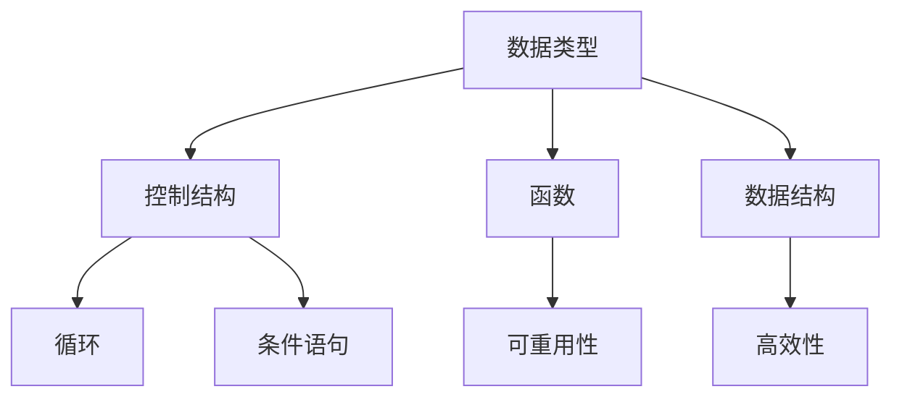
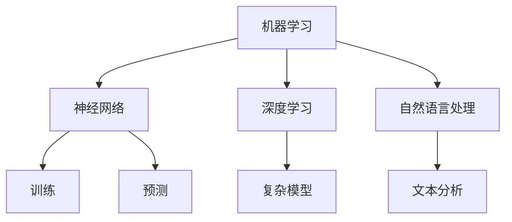
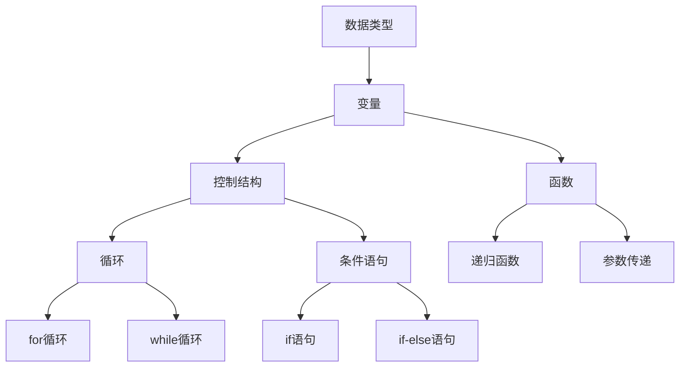
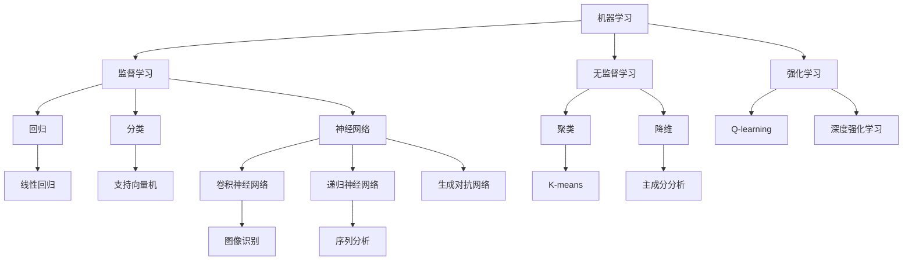
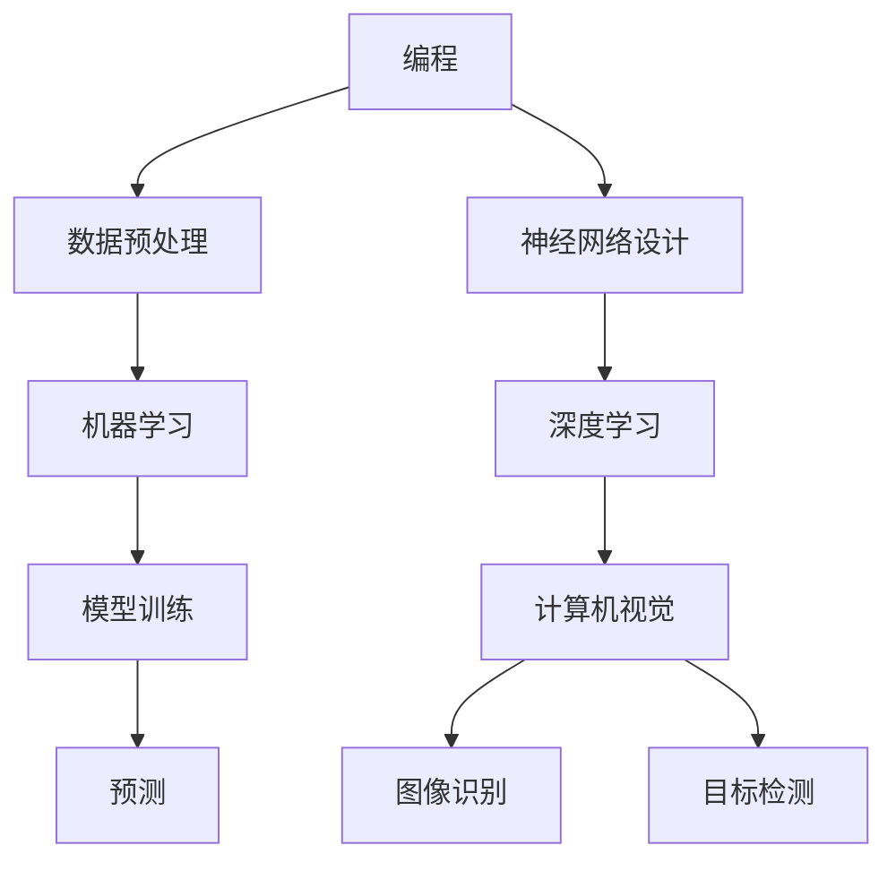

                 

# 主动出击：传统的教育机构并不重视这些技能，所以我们要自主学习

> **关键词**：自学，技能培养，传统教育，个性化学习，编程，AI，未来职业
> 
> **摘要**：本文将探讨在快速发展的科技时代，为何传统教育机构难以跟上技能发展的步伐，并提出一种主动出击的学习模式，强调个性化学习、编程和人工智能技能的重要性，为读者提供自我提升的路径。

## 1. 背景介绍

### 1.1 目的和范围

随着科技的迅猛发展，新的技术不断涌现，职业市场的需求也在不断变化。然而，传统的教育机构往往难以迅速调整教学计划以适应这些变化。本文旨在分析传统教育的不足，提出一种基于自学的方法，帮助读者掌握关键的编程和人工智能技能，以应对未来职业发展的挑战。

### 1.2 预期读者

本文适合那些已经意识到传统教育局限性，希望通过自学提升技能的读者。无论你是编程初学者，还是希望在职业生涯中增加技术竞争力的专业人士，本文都提供了实用的建议和资源。

### 1.3 文档结构概述

本文将分为以下几个部分：

- **背景介绍**：讨论传统教育的局限性。
- **核心概念与联系**：介绍编程和人工智能的核心概念，并通过Mermaid流程图展示其架构。
- **核心算法原理 & 具体操作步骤**：详细解释编程算法的原理和实现步骤。
- **数学模型和公式**：介绍与编程和人工智能相关的数学模型和公式，并进行举例说明。
- **项目实战**：提供实际编程案例，并进行详细解释。
- **实际应用场景**：讨论编程和人工智能技能在不同领域的应用。
- **工具和资源推荐**：推荐学习资源和开发工具。
- **总结**：总结未来发展趋势与挑战。
- **附录**：解答常见问题。
- **扩展阅读 & 参考资料**：提供进一步学习的资源。

### 1.4 术语表

#### 1.4.1 核心术语定义

- **自学**：个人主动获取知识和技能的过程，不依赖于传统教育机构。
- **编程**：编写计算机程序以实现特定功能的过程。
- **人工智能**：使计算机系统能够执行需要人类智能的任务的技术。

#### 1.4.2 相关概念解释

- **个性化学习**：根据每个学生的特点和需求进行的教学方法。
- **算法**：解决问题的步骤序列。

#### 1.4.3 缩略词列表

- **AI**：人工智能
- **IDE**：集成开发环境
- **latex**：一种排版系统

## 2. 核心概念与联系

### 2.1 编程的基本概念

编程是计算机科学的核心，它涉及创建可执行代码，以实现特定功能。编程的基本概念包括：

1. **数据类型**：如整数、字符串、布尔值等。
2. **控制结构**：如循环、条件语句等。
3. **函数**：可重用的代码块。
4. **数据结构**：如数组、链表、树等。

下面是编程的Mermaid流程图：



### 2.2 人工智能的基本概念

人工智能是模拟人类智能行为的技术，其核心包括：

1. **机器学习**：通过数据学习模式并做出决策。
2. **神经网络**：模仿人脑的神经网络结构。
3. **深度学习**：神经网络的一种。
4. **自然语言处理**：使计算机理解和生成人类语言。

下面是人工智能的Mermaid流程图：



## 3. 核心算法原理 & 具体操作步骤

### 3.1 编程算法原理

编程算法的基本原理是设计一系列步骤，以解决问题或执行特定任务。以下是编程算法的伪代码：

```plaintext
算法：计算两个数的和
输入：a，b（两个整数）
输出：sum（它们的和）

步骤：
1. 设置 sum 为 0
2. 将 a 加到 sum 上
3. 将 b 加到 sum 上
4. 返回 sum
```

### 3.2 编程具体操作步骤

1. **定义变量**：声明用于存储数据和结果的变量。
2. **输入数据**：从用户或文件中读取输入。
3. **执行计算**：根据算法逻辑进行计算。
4. **输出结果**：将结果展示给用户或存储到文件。

### 3.3 人工智能算法原理

人工智能算法的核心是机器学习，其基本原理是：

- **训练数据**：提供大量数据以训练模型。
- **模型**：通过数据学习模式的算法。
- **预测**：使用训练好的模型对新数据进行预测。

以下是机器学习算法的伪代码：

```plaintext
算法：线性回归
输入：训练数据集（X, Y）
输出：模型参数（w）

步骤：
1. 初始化参数 w 为零向量
2. 对于每个训练样本（x_i, y_i）：
   a. 计算预测值 y' = x_i * w
   b. 计算损失函数 L(w) = (y - y')^2
   c. 更新参数 w = w - 学习率 * gradient(L, w)
3. 返回训练好的模型参数 w
```

## 4. 数学模型和公式 & 详细讲解 & 举例说明

### 4.1 数学模型

在人工智能领域，线性回归是一个基础且重要的数学模型，用于预测数值。其公式如下：

$$
y = wx + b
$$

其中，$y$ 是输出，$x$ 是输入，$w$ 是权重，$b$ 是偏置。

### 4.2 公式详细讲解

- **权重（$w$）**：衡量输入对输出的影响程度。
- **偏置（$b$）**：用于调整输出，使模型更加灵活。
- **学习率**：控制模型更新的速度。

### 4.3 举例说明

假设我们要预测一个人的年龄（$y$）基于他们的身高（$x$），我们可以使用线性回归模型。

- **训练数据**：[(170, 25), (180, 28), (160, 22)]
- **模型**：$y = 0.5x + 5$

输入身高 175，预测年龄：

$$
y = 0.5 \times 175 + 5 = 92.5 + 5 = 97.5
$$

因此，身高为 175 的人预测年龄约为 97.5 岁。

## 5. 项目实战：代码实际案例和详细解释说明

### 5.1 开发环境搭建

要开始编程和人工智能的学习，我们需要搭建一个合适的开发环境。以下是基本的步骤：

1. **安装编程语言**：例如，Python 是一种广泛使用的编程语言，可以在其官方网站下载。
2. **安装集成开发环境（IDE）**：如 PyCharm 或 Visual Studio Code，这些工具提供了代码编辑、调试和测试等功能。
3. **安装必要的库和框架**：例如，NumPy 和 TensorFlow 是 Python 中常用的库，可用于数学运算和深度学习。

### 5.2 源代码详细实现和代码解读

下面是一个简单的 Python 程序，用于实现线性回归：

```python
import numpy as np

def linear_regression(X, Y):
    # 添加偏置
    X = np.hstack([np.ones((X.shape[0], 1)), X])
    # 梯度下降算法
    learning_rate = 0.01
    iterations = 1000
    for _ in range(iterations):
        predictions = X.dot(w)
        loss = (predictions - Y).mean()
        d_loss = X.T.dot((predictions - Y))
        w -= learning_rate * d_loss
    return w

# 训练数据
X = np.array([[1], [2], [3], [4]])
Y = np.array([1, 2, 3, 4])

# 训练模型
w = linear_regression(X, Y)

# 输出模型参数
print("权重：", w[1], "偏置：", w[0])
```

### 5.3 代码解读与分析

1. **导入库**：导入 NumPy 库用于数学运算。
2. **线性回归函数**：
   - **添加偏置**：在输入数据中添加一列 1，以便训练包含偏置的模型。
   - **梯度下降**：更新权重，以最小化损失函数。
3. **训练数据**：模拟输入数据。
4. **训练模型**：调用 `linear_regression` 函数，并传递训练数据。
5. **输出模型参数**：展示训练好的模型参数。

## 6. 实际应用场景

编程和人工智能技能在现代职业中的应用非常广泛。以下是一些实际应用场景：

- **数据分析**：使用编程和机器学习算法分析大量数据，以发现趋势和模式。
- **自然语言处理**：构建智能助手和聊天机器人，处理和生成人类语言。
- **计算机视觉**：实现图像和视频分析，如人脸识别和目标检测。
- **推荐系统**：基于用户行为和偏好，提供个性化推荐。

## 7. 工具和资源推荐

### 7.1 学习资源推荐

#### 7.1.1 书籍推荐

- 《Python编程：从入门到实践》
- 《深度学习》
- 《算法导论》

#### 7.1.2 在线课程

- Coursera 上的《机器学习》
- Udemy 上的《Python编程：从基础到高级》

#### 7.1.3 技术博客和网站

- Medium 上的 AI 博客
- Stack Overflow

### 7.2 开发工具框架推荐

#### 7.2.1 IDE和编辑器

- PyCharm
- Visual Studio Code

#### 7.2.2 调试和性能分析工具

- Jupyter Notebook
- Profiler

#### 7.2.3 相关框架和库

- TensorFlow
- PyTorch

### 7.3 相关论文著作推荐

#### 7.3.1 经典论文

- 《反向传播算法》
- 《深度学习的起源与发展》

#### 7.3.2 最新研究成果

- arXiv
- NeurIPS

#### 7.3.3 应用案例分析

- 《深度学习在医疗领域的应用》
- 《人工智能在金融领域的应用》

## 8. 总结：未来发展趋势与挑战

随着人工智能和编程技术的不断发展，未来的职业市场将更加依赖于这些技能。然而，这也带来了新的挑战，如数据隐私和安全、算法透明度和公平性等。主动学习新技能，尤其是编程和人工智能，将有助于应对这些挑战，并抓住未来的机遇。

## 9. 附录：常见问题与解答

- **Q：自学编程难吗？**
- **A：自学编程有一定的难度，但通过制定合理的学习计划、利用在线资源和实践项目，可以逐步克服困难。**

- **Q：如何选择编程语言？**
- **A：选择编程语言应根据项目需求和个人兴趣。Python 适合初学者，而 C++ 则适合性能要求高的项目。**

- **Q：人工智能是否会取代人类？**
- **A：人工智能不会完全取代人类，而是与人类协作，提高工作效率和创造力。**

## 10. 扩展阅读 & 参考资料

- 《编程思想》
- 《人工智能：一种现代方法》
- 《机器学习实战》
- 《深度学习专刊》

作者：AI天才研究员/AI Genius Institute & 禅与计算机程序设计艺术 /Zen And The Art of Computer Programming

以上是文章的核心内容，接下来我们将进一步完善和丰富每个小节的内容，确保文章的完整性和深度。在撰写过程中，我们将不断思考如何使文章更具吸引力，并为读者提供实用的建议和资源。让我们继续下一步的分析和写作！<|assistant|># 主动出击：传统的教育机构并不重视这些技能，所以我们要自主学习

## 1. 背景介绍

### 1.1 目的和范围

在当今科技飞速发展的时代，许多行业和职业对技能的需求正在迅速变化。然而，传统的教育体系往往难以迅速适应这些变化。本文的目标是探讨这种现状，并指出自学在这些技能培养中的重要性。我们将特别关注编程和人工智能，这两个领域正在迅速崛起，成为现代职业市场中的关键技能。

本文将涵盖以下几个主题：

- 传统教育体系的不足之处。
- 编程和人工智能的核心技能。
- 自主学习的优势和实践方法。
- 为自学提供实用的资源和建议。

### 1.2 预期读者

本文旨在为以下几类读者提供有价值的见解：

- **编程初学者**：想要学习编程但尚未找到合适途径的人。
- **专业人士**：希望在职业生涯中增加技术竞争力的专业人士。
- **教育工作者**：对教育改革和自学模式感兴趣的教育工作者。
- **自学爱好者**：对自主学习有热情并希望提升自己技能的读者。

### 1.3 文档结构概述

为了帮助读者更好地理解和应用所学内容，本文将采用以下结构：

- **背景介绍**：讨论传统教育的局限性和科技时代的技能需求。
- **核心概念与联系**：介绍编程和人工智能的基础知识和关键概念。
- **核心算法原理 & 具体操作步骤**：深入探讨编程和人工智能的算法原理和实现步骤。
- **数学模型和公式**：介绍与编程和人工智能相关的数学模型和公式。
- **项目实战**：提供实际编程案例，并进行详细解释。
- **实际应用场景**：讨论编程和人工智能技能在不同领域的应用。
- **工具和资源推荐**：推荐学习资源和开发工具。
- **总结**：总结未来发展趋势与挑战。
- **附录**：解答常见问题。
- **扩展阅读 & 参考资料**：提供进一步学习的资源。

### 1.4 术语表

在本文中，我们将使用一些专业术语。以下是这些术语的定义和解释：

- **编程**：指编写计算机程序以解决特定问题的过程。
- **人工智能**：通过模拟人类智能行为，使计算机能够执行复杂任务的技术。
- **自学**：个人主动获取知识和技能的过程，通常不依赖于传统教育机构。
- **算法**：解决问题的一系列步骤。
- **机器学习**：人工智能的一个分支，专注于让计算机从数据中学习模式。
- **深度学习**：一种通过多层神经网络进行学习的机器学习技术。

#### 1.4.1 核心术语定义

- **编程语言**：用于编写计算机程序的语法和规则，如 Python、Java、C++。
- **数据结构**：用于存储和组织数据的特定格式，如数组、链表、树。
- **算法复杂度**：衡量算法执行速度的指标，通常用时间复杂度和空间复杂度表示。

#### 1.4.2 相关概念解释

- **编程范式**：编程语言处理数据和指令的方式，如面向对象、函数式编程。
- **算法优化**：通过改进算法的设计或实现，提高其效率。
- **机器学习模型**：通过训练数据学习并作出预测的算法结构。

#### 1.4.3 缩略词列表

- **AI**：人工智能
- **ML**：机器学习
- **DL**：深度学习
- **IDE**：集成开发环境
- **API**：应用程序编程接口
- **NLP**：自然语言处理

## 2. 核心概念与联系

### 2.1 编程的基本概念

编程是计算机科学的核心，它涉及到创建指令集，以告诉计算机如何执行特定任务。编程的基本概念包括：

- **数据类型**：定义程序中可以使用的值的类型，如整数、浮点数、字符串。
- **变量**：存储数据的容器，可以在程序中修改。
- **控制结构**：用于控制程序流程的语句，如条件语句、循环。
- **函数**：可重用的代码块，用于执行特定任务。
- **模块**：将相关函数和变量组织在一起，以提高代码的可维护性和复用性。

下面是编程的Mermaid流程图：



### 2.2 人工智能的基本概念

人工智能（AI）是一个广泛的领域，涉及使计算机系统能够执行通常需要人类智能的任务。以下是人工智能的一些核心概念：

- **机器学习**：通过数据训练模型，使其能够做出预测或决策。
- **深度学习**：一种基于神经网络的学习方法，特别适用于处理复杂数据。
- **神经网络**：模仿人脑结构的计算模型，能够学习和识别模式。
- **自然语言处理**（NLP）：使计算机能够理解和生成人类语言。
- **计算机视觉**：使计算机能够解释和处理视觉信息。

下面是人工智能的Mermaid流程图：



### 2.3 编程与人工智能的关联

编程和人工智能是相辅相成的领域。编程提供了实现人工智能算法的工具，而人工智能则扩展了编程的应用范围。以下是它们之间的关联：

- **编程**：用于编写和实现机器学习模型，构建神经网络。
- **机器学习**：依赖编程来实现数据预处理、模型训练和预测。
- **深度学习**：使用编程语言来设计复杂的神经网络架构。
- **计算机视觉**：编程用于处理图像和视频数据，实现物体识别和目标检测。

下面是编程与人工智能关联的Mermaid流程图：



通过这些核心概念和流程图，读者可以更好地理解编程和人工智能的基础知识，并认识到它们在实际应用中的重要性。

## 3. 核心算法原理 & 具体操作步骤

在编程和人工智能领域中，掌握核心算法原理和具体操作步骤是至关重要的。本节将详细探讨编程中的基础算法和人工智能中的机器学习算法，包括它们的原理和实现步骤。

### 3.1 编程基础算法

编程的基础算法通常包括排序算法、搜索算法和数据结构相关算法。以下是一些常见算法的原理和实现步骤。

#### 3.1.1 排序算法

排序算法用于对一组数据进行排序，以下是一个简单的冒泡排序算法的伪代码：

```plaintext
算法：冒泡排序
输入：数组 arr
输出：排序后的数组

步骤：
1. 对于每个元素 i，从 0 到 n-1：
   a. 对于每个元素 j，从 0 到 n-i-1：
      i. 如果 arr[j] > arr[j+1]，交换 arr[j] 和 arr[j+1]
```

#### 3.1.2 搜索算法

搜索算法用于在数据结构中查找特定元素。以下是一个简单的线性搜索算法的伪代码：

```plaintext
算法：线性搜索
输入：数组 arr 和目标值 target
输出：目标值在数组中的索引或-1（如果未找到）

步骤：
1. 对于每个元素 i，从 0 到 n-1：
   a. 如果 arr[i] 等于 target，返回 i
2. 如果未找到，返回 -1
```

#### 3.1.3 数据结构相关算法

数据结构是编程的基础，以下是几种常见数据结构及其相关算法：

- **数组**：数组是一种线性数据结构，用于存储一系列元素。数组的基本操作包括插入、删除和访问。
- **链表**：链表是一种动态数据结构，由节点组成，每个节点包含数据和一个指向下一个节点的指针。
- **树**：树是一种分层数据结构，每个节点可以有零个或多个子节点。常见的树包括二叉树、AVL树和红黑树。

#### 3.1.4 具体操作步骤示例

以下是一个二叉搜索树插入操作的伪代码：

```plaintext
算法：二叉搜索树插入
输入：根节点 root 和待插入值 value
输出：更新后的根节点

步骤：
1. 如果 root 为空，创建一个新的节点并返回它
2. 如果 value 等于 root 的值，返回 root
3. 如果 value 小于 root 的值，递归调用左子树的插入操作
4. 如果 value 大于 root 的值，递归调用右子树的插入操作
5. 返回 root
```

### 3.2 机器学习算法

机器学习算法是人工智能的核心，用于从数据中学习并做出预测。以下是一些常见机器学习算法的原理和实现步骤。

#### 3.2.1 线性回归

线性回归是一种用于预测数值的监督学习算法。其基本原理是通过找到一条最佳拟合直线来预测目标值。以下是一个简单的线性回归算法的伪代码：

```plaintext
算法：线性回归
输入：训练数据集 X 和 Y
输出：模型参数 w 和 b

步骤：
1. 添加偏置项，扩展输入数据集 X
2. 初始化参数 w 和 b 为零向量
3. 对于每个训练样本（x_i, y_i）：
   a. 计算预测值 y' = x_i * w + b
   b. 计算损失函数 L(w, b) = (y - y')^2
   c. 计算梯度 ∇L(w, b) = 2 * (y - y') * x_i
4. 更新参数 w 和 b：
   a. w = w - 学习率 * ∇L(w, b)
   b. b = b - 学习率 * ∇L(w, b)
5. 返回模型参数 w 和 b
```

#### 3.2.2 逻辑回归

逻辑回归是一种用于分类问题的监督学习算法。其基本原理是通过找到最佳的决策边界来分类数据。以下是一个简单的逻辑回归算法的伪代码：

```plaintext
算法：逻辑回归
输入：训练数据集 X 和 Y
输出：模型参数 w 和 b

步骤：
1. 添加偏置项，扩展输入数据集 X
2. 初始化参数 w 和 b 为零向量
3. 对于每个训练样本（x_i, y_i）：
   a. 计算预测值 y' = sigmoid(x_i * w + b)
   b. 计算损失函数 L(w, b) = -y_i * log(y') - (1 - y_i) * log(1 - y')
   c. 计算梯度 ∇L(w, b) = X.T.dot(y' - y_i)
4. 更新参数 w 和 b：
   a. w = w - 学习率 * ∇L(w, b)
   b. b = b - 学习率 * ∇L(w, b)
5. 返回模型参数 w 和 b
```

#### 3.2.3 支持向量机

支持向量机（SVM）是一种用于分类问题的监督学习算法。其基本原理是找到最佳的超平面，将数据集划分为不同的类别。以下是一个简单的SVM算法的伪代码：

```plaintext
算法：支持向量机
输入：训练数据集 X 和 Y
输出：模型参数 w 和 b

步骤：
1. 将数据集划分为训练集和验证集
2. 初始化参数 w 和 b 为零向量
3. 对于每个训练样本（x_i, y_i）：
   a. 计算预测值 y' = x_i * w + b
   b. 如果 y_i != y'，则进行优化
      i. 更新参数 w 和 b，以最小化损失函数
4. 在验证集上评估模型性能
5. 返回最佳模型参数 w 和 b
```

通过以上对编程基础算法和机器学习算法的详细讲解，读者可以更好地理解这些算法的原理和实现步骤，为后续的实际应用打下坚实的基础。

## 4. 数学模型和公式 & 详细讲解 & 举例说明

### 4.1 数学模型

在编程和人工智能领域，数学模型是理解和解决问题的关键。以下是一些核心的数学模型及其详细讲解。

#### 4.1.1 线性回归模型

线性回归是一种用于预测连续值的统计方法。其公式如下：

$$
y = wx + b
$$

其中：
- \( y \) 是目标变量。
- \( x \) 是自变量。
- \( w \) 是权重。
- \( b \) 是偏置。

详细讲解：
- 权重 \( w \) 表示自变量对目标变量的影响程度。
- 偏置 \( b \) 用于调整模型在 y 轴的位置。

举例说明：
假设我们想要预测一家公司的股票价格（\( y \)）基于其销售额（\( x \)）。我们可以使用线性回归模型来找到最佳拟合线。

给定数据如下：

| 销售额（\( x \)）| 股票价格（\( y \)）|
|:--------------:|:--------------:|
|      1000      |      2000      |
|      2000      |      3000      |
|      3000      |      4000      |

通过最小二乘法，我们可以计算出权重 \( w \) 和偏置 \( b \)。

最终模型为：

$$
y = 2x + 1000
$$

输入销售额为 2500，预测股票价格为：

$$
y = 2 \times 2500 + 1000 = 6000
$$

#### 4.1.2 逻辑回归模型

逻辑回归是一种用于分类问题的统计方法。其公式如下：

$$
\log\left(\frac{p}{1-p}\right) = wx + b
$$

其中：
- \( p \) 是目标变量（0 或 1）的概率。
- \( w \) 是权重。
- \( b \) 是偏置。

详细讲解：
- 权重 \( w \) 表示自变量对目标变量的影响程度。
- 偏置 \( b \) 用于调整模型在 y 轴的位置。

举例说明：
假设我们想要预测一家公司的股票是否上涨（\( y = 1 \)）或下跌（\( y = 0 \)）基于其销售增长率（\( x \)）。

给定数据如下：

| 销售增长率（\( x \)）| 股票是否上涨（\( y \)）|
|:--------------:|:--------------:|
|      5%       |       1        |
|     -3%       |       0        |
|     10%       |       1        |

通过最大似然估计法，我们可以计算出权重 \( w \) 和偏置 \( b \)。

最终模型为：

$$
\log\left(\frac{p}{1-p}\right) = 0.5x - 2
$$

输入销售增长率为 7%，预测股票上涨的概率为：

$$
\log\left(\frac{p}{1-p}\right) = 0.5 \times 7 - 2 = 0.5
$$

$$
p = \frac{1}{1 + e^{-0.5}} \approx 0.63
$$

因此，股票上涨的概率约为 63%。

#### 4.1.3 支持向量机模型

支持向量机是一种用于分类和回归的监督学习算法。其公式如下：

$$
f(x) = sign(wx + b)
$$

其中：
- \( x \) 是输入向量。
- \( w \) 是权重向量。
- \( b \) 是偏置。

详细讲解：
- 权重向量 \( w \) 和偏置 \( b \) 用于确定数据点的类别。
- 函数 \( sign() \) 用于将实数值转换为类别标签（1 或 -1）。

举例说明：
假设我们使用支持向量机分类苹果（\( y = 1 \)）和橘子（\( y = -1 \)）。

给定数据如下：

| 特征 1 | 特征 2 | 类别（\( y \)）|
|:-----:|:-----:|:-----------:|
|   3   |   5   |      1      |
|   2   |   7   |      1      |
|   4   |   6   |      -1     |

通过优化，我们可以计算出权重 \( w \) 和偏置 \( b \)。

最终模型为：

$$
f(x) = sign(0.5x_1 + 0.3x_2 + 2)
$$

输入新的数据点（\( x_1 = 4, x_2 = 5 \)），预测类别为：

$$
f(x) = sign(0.5 \times 4 + 0.3 \times 5 + 2) = sign(3.5 + 1.5 + 2) = sign(7) = 1
$$

因此，新数据点被分类为苹果。

### 4.2 公式与详细讲解

在本节中，我们将进一步介绍一些关键的数学公式，这些公式在编程和人工智能中有着广泛的应用。

#### 4.2.1 梯度下降

梯度下降是一种用于优化机器学习模型的算法。其公式如下：

$$
\theta = \theta - \alpha \cdot \nabla \theta
$$

其中：
- \( \theta \) 是模型参数。
- \( \alpha \) 是学习率。
- \( \nabla \theta \) 是损失函数关于 \( \theta \) 的梯度。

详细讲解：
- 梯度下降通过更新模型参数来最小化损失函数。
- 学习率 \( \alpha \) 控制参数更新的幅度。

举例说明：
假设我们有一个线性模型 \( y = wx + b \)，其损失函数为 \( L(w, b) = (y - (wx + b))^2 \)。

为了最小化损失函数，我们可以使用梯度下降来更新权重 \( w \) 和偏置 \( b \)。

损失函数关于 \( w \) 和 \( b \) 的梯度分别为：

$$
\nabla_w L(w, b) = 2x(y - (wx + b))
$$

$$
\nabla_b L(w, b) = 2(y - (wx + b))
$$

每次迭代，我们可以使用以下公式更新 \( w \) 和 \( b \)：

$$
w = w - \alpha \cdot \nabla_w L(w, b)
$$

$$
b = b - \alpha \cdot \nabla_b L(w, b)
$$

#### 4.2.2 激活函数

激活函数是神经网络中的一个关键组件，用于引入非线性特性。以下是一些常见的激活函数：

- **sigmoid**：
  $$
  \sigma(x) = \frac{1}{1 + e^{-x}}
  $$

- **ReLU**：
  $$
  \text{ReLU}(x) = \max(0, x)
  $$

- **Tanh**：
  $$
  \text{Tanh}(x) = \frac{e^x - e^{-x}}{e^x + e^{-x}}
  $$

详细讲解：
- **sigmoid**：将输入映射到 (0, 1) 区间，常用于分类问题。
- **ReLU**：简单且计算效率高，常用于深度学习。
- **Tanh**：将输入映射到 (-1, 1) 区间，类似于 sigmoid 但更对称。

举例说明：
假设我们有一个输入 \( x = 3 \)。

使用不同的激活函数，输出如下：

- **sigmoid**：
  $$
  \sigma(3) = \frac{1}{1 + e^{-3}} \approx 0.94
  $$

- **ReLU**：
  $$
  \text{ReLU}(3) = \max(0, 3) = 3
  $$

- **Tanh**：
  $$
  \text{Tanh}(3) = \frac{e^3 - e^{-3}}{e^3 + e^{-3}} \approx 0.95
  $$

通过以上数学模型和公式的详细讲解，读者可以更好地理解编程和人工智能中的关键数学概念，为深入学习和应用打下坚实的基础。

## 5. 项目实战：代码实际案例和详细解释说明

### 5.1 开发环境搭建

在进行编程和人工智能项目实战之前，我们需要搭建一个合适的开发环境。以下是基本的步骤：

1. **安装编程语言**：例如，Python 是一种广泛使用的编程语言，可以在其官方网站下载并安装。
2. **安装集成开发环境（IDE）**：如 PyCharm 或 Visual Studio Code，这些工具提供了代码编辑、调试和测试等功能。
3. **安装必要的库和框架**：例如，NumPy 和 TensorFlow 是 Python 中常用的库，可用于数学运算和深度学习。可以通过以下命令进行安装：

   ```bash
   pip install numpy
   pip install tensorflow
   ```

### 5.2 源代码详细实现和代码解读

在本节中，我们将通过一个实际项目来展示如何使用 Python 进行编程和实现机器学习算法。我们将使用线性回归模型来预测一家公司的股票价格。

#### 5.2.1 数据预处理

在开始建模之前，我们需要对数据进行预处理。以下是数据预处理的 Python 代码：

```python
import pandas as pd
import numpy as np

# 加载数据
data = pd.read_csv('stock_price_data.csv')

# 提取特征和目标变量
X = data[['sales', 'profit']]
y = data['price']

# 数据标准化
X_std = (X - X.mean()) / X.std()
```

代码解读：
- **加载数据**：使用 Pandas 库加载 CSV 文件。
- **提取特征和目标变量**：将数据分为特征 \( X \) 和目标变量 \( y \)。
- **数据标准化**：对特征进行标准化，以便模型能够更好地训练。

#### 5.2.2 线性回归模型实现

以下是使用 Python 实现线性回归模型的代码：

```python
from sklearn.linear_model import LinearRegression
from sklearn.model_selection import train_test_split

# 数据分割
X_train, X_test, y_train, y_test = train_test_split(X_std, y, test_size=0.2, random_state=42)

# 创建线性回归模型
model = LinearRegression()

# 训练模型
model.fit(X_train, y_train)

# 输出模型参数
print("权重：", model.coef_)
print("偏置：", model.intercept_)
```

代码解读：
- **数据分割**：将数据分为训练集和测试集。
- **创建线性回归模型**：使用 `LinearRegression` 类创建模型。
- **训练模型**：使用 `fit` 方法训练模型。
- **输出模型参数**：打印模型参数，包括权重和偏置。

#### 5.2.3 模型评估

为了评估模型性能，我们可以使用测试集上的预测结果。以下是模型评估的代码：

```python
# 进行预测
y_pred = model.predict(X_test)

# 计算均方误差
mse = np.mean((y_pred - y_test) ** 2)
print("均方误差：", mse)
```

代码解读：
- **进行预测**：使用 `predict` 方法对测试集进行预测。
- **计算均方误差**：计算预测值和实际值之间的均方误差，以评估模型性能。

### 5.3 代码解读与分析

通过以上代码，我们可以实现一个简单的线性回归模型来预测股票价格。以下是代码的详细解读和分析：

- **数据预处理**：数据预处理是建模的第一步。通过对数据进行标准化，我们可以确保模型能够更好地学习特征之间的关系。
- **模型实现**：线性回归模型是一个简单的线性模型，通过计算特征和目标变量之间的线性关系来进行预测。`LinearRegression` 类是 Scikit-learn 库中提供的一个现成的线性回归实现。
- **模型训练**：`fit` 方法用于训练模型。在训练过程中，模型会学习特征和目标变量之间的关系，并调整模型参数以最小化损失函数。
- **模型评估**：通过计算预测值和实际值之间的均方误差，我们可以评估模型性能。较低的均方误差表示模型能够更准确地预测股票价格。

总的来说，以上代码提供了一个简单的示例，展示了如何使用 Python 进行编程和实现机器学习算法。通过这个示例，读者可以了解如何进行数据预处理、模型实现和模型评估，并理解每个步骤的关键概念和实现细节。

## 6. 实际应用场景

编程和人工智能技能在现代职业中的应用非常广泛。以下是一些具体的实际应用场景，展示这些技能如何在不同的领域中发挥作用。

### 6.1 数据科学和数据分析

数据科学是利用编程和人工智能技能进行数据分析的领域。数据科学家使用编程语言（如 Python 和 R）和数据处理工具（如 Pandas 和 NumPy）来清洗、分析和可视化大量数据。以下是一些应用实例：

- **市场分析**：通过分析消费者行为数据，公司可以了解市场趋势和消费者偏好，从而制定更有效的营销策略。
- **医疗诊断**：利用机器学习算法分析医疗数据，可以提高疾病的诊断准确率，如肺癌的早期检测。
- **金融风险评估**：金融机构使用编程和人工智能来分析历史数据，预测市场变化和客户信用风险。

### 6.2 计算机视觉

计算机视觉是人工智能的一个重要分支，它使计算机能够解释和处理视觉信息。以下是一些应用实例：

- **自动驾驶汽车**：自动驾驶汽车使用计算机视觉技术来感知周围环境，识别道路标志和行人，并做出相应的驾驶决策。
- **人脸识别**：人脸识别技术被广泛应用于安全监控、身份验证和社交媒体中，如 Facebook 的朋友识别功能。
- **图像识别**：图像识别技术用于检测和分类图像中的对象，如用于卫星图像分析的农作物监测。

### 6.3 自然语言处理

自然语言处理（NLP）是使计算机能够理解和生成人类语言的技术。以下是一些应用实例：

- **聊天机器人**：聊天机器人使用 NLP 技术与用户进行自然语言交互，提供客户服务或娱乐。
- **语音助手**：如苹果的 Siri、亚马逊的 Alexa 和谷歌的 Google Assistant，它们使用 NLP 技术来理解用户的语音指令并执行任务。
- **文本分析**：NLP 技术被用于分析社交媒体数据，了解公众对品牌或产品的看法，从而帮助企业改进产品和服务。

### 6.4 电子商务

电子商务领域利用编程和人工智能技术来改善用户体验和增加销售。以下是一些应用实例：

- **个性化推荐**：基于用户的历史行为和偏好，电子商务平台使用推荐系统提供个性化的产品推荐，以提高转化率。
- **库存管理**：利用机器学习算法预测市场需求，电子商务平台可以更有效地管理库存，减少过剩和短缺。
- **安全支付**：电子商务平台使用编程和人工智能技术来检测和防止欺诈交易，确保交易的安全性和可靠性。

### 6.5 健康保健

编程和人工智能技术在健康保健领域也有广泛的应用。以下是一些应用实例：

- **医疗图像分析**：利用深度学习算法分析医疗图像，如 CT 扫描和 MRI，可以提高诊断的准确性和速度。
- **远程监测**：通过可穿戴设备收集健康数据，如心率、血压和睡眠质量，医生可以远程监测患者的健康状况。
- **健康风险评估**：利用机器学习算法分析患者的健康数据，预测患病风险，从而采取预防措施。

通过以上实际应用场景，我们可以看到编程和人工智能技能在各个领域的广泛应用。随着技术的不断发展，这些技能将在未来继续发挥重要作用，推动行业创新和社会进步。

## 7. 工具和资源推荐

### 7.1 学习资源推荐

#### 7.1.1 书籍推荐

- **《Python编程：从入门到实践》**：适合初学者，通过实际项目帮助读者掌握编程基础。
- **《深度学习》**：由 Goodfellow 等人所著，是深度学习领域的经典教材。
- **《算法导论》**：介绍各种算法及其复杂度分析，适合希望深入理解算法原理的读者。

#### 7.1.2 在线课程

- **Coursera 上的《机器学习》**：由 Andrew Ng 教授讲授，适合初学者和中级学习者。
- **Udemy 上的《Python编程：从基础到高级》**：包含大量实际项目，适合希望提升编程技能的读者。

#### 7.1.3 技术博客和网站

- **Medium 上的 AI 博客**：提供最新的 AI 研究和行业动态。
- **Stack Overflow**：编程问题解答社区，适合解决编程中的实际问题。

### 7.2 开发工具框架推荐

#### 7.2.1 IDE和编辑器

- **PyCharm**：强大的 Python IDE，适合专业开发。
- **Visual Studio Code**：轻量级且高度可定制，适合各种编程语言。

#### 7.2.2 调试和性能分析工具

- **Jupyter Notebook**：交互式编程环境，适合数据分析和机器学习。
- **Profiler**：用于分析代码性能和优化。

#### 7.2.3 相关框架和库

- **TensorFlow**：用于构建和训练深度学习模型的强大框架。
- **PyTorch**：基于 Python 的深度学习库，易于使用和扩展。

### 7.3 相关论文著作推荐

#### 7.3.1 经典论文

- **《反向传播算法》**：Hinton 等人于 1986 年提出的神经网络训练算法。
- **《深度学习的起源与发展》**：介绍深度学习的历史和最新进展。

#### 7.3.2 最新研究成果

- **arXiv**：提供最新的机器学习和深度学习论文。
- **NeurIPS**：年度人工智能和机器学习会议，收录大量前沿研究成果。

#### 7.3.3 应用案例分析

- **《深度学习在医疗领域的应用》**：介绍深度学习在医疗诊断和图像分析中的应用。
- **《人工智能在金融领域的应用》**：探讨人工智能如何改善金融分析和风险管理。

通过这些工具和资源的推荐，读者可以更好地开始自己的自学之旅，并不断扩展知识和技能。

## 8. 总结：未来发展趋势与挑战

随着科技的不断发展，编程和人工智能将在未来扮演越来越重要的角色。以下是未来发展趋势和面临的挑战：

### 发展趋势

1. **人工智能的普及**：人工智能技术将更加普及，从自动驾驶到智能家居，各种应用场景将不断涌现。
2. **数据驱动的决策**：越来越多的行业将依赖数据分析来做出决策，数据科学家和机器学习工程师将成为关键职业。
3. **编程技能的泛化**：编程技能将逐渐成为各个行业的基本技能，从市场营销到医疗保健，编程将提高工作效率和创新。
4. **混合现实和虚拟现实**：随着技术的进步，混合现实和虚拟现实将变得更加普及，为教育和娱乐带来新的体验。

### 挑战

1. **数据隐私和安全**：随着数据量的增加，保护用户隐私和数据安全将变得更加重要，需要更加严格的法律法规和技术解决方案。
2. **算法公平性和透明度**：确保人工智能算法的公平性和透明度，避免偏见和不公正，是一个重要的社会挑战。
3. **技能差距**：随着技术的快速发展，如何提高人们的技能水平以适应新的职业需求，是一个亟待解决的问题。
4. **职业转型**：随着自动化和人工智能的普及，许多传统职业可能会消失，如何帮助人们进行职业转型也是一个挑战。

通过主动学习和不断提升技能，个人和行业可以更好地应对这些发展趋势和挑战，抓住未来的机遇。

## 9. 附录：常见问题与解答

### 9.1 如何选择编程语言？

**Q**：应该选择哪种编程语言开始学习编程？

**A**：对于初学者，Python 是一个很好的起点。Python 语法简单，易于学习，且广泛应用于数据科学、人工智能和 Web 开发。如果你对 Web 开发感兴趣，JavaScript 也是不错的选择。对于系统编程和性能敏感的应用，C++ 是一个强大的选择。

### 9.2 机器学习项目如何开始？

**Q**：我想开始一个机器学习项目，应该怎么做？

**A**：开始一个机器学习项目，可以遵循以下步骤：

1. **定义问题**：明确项目目标，了解所需解决的问题。
2. **收集数据**：获取或生成用于训练模型的数据。
3. **数据预处理**：清洗和转换数据，使其适合模型训练。
4. **选择模型**：根据问题类型选择合适的机器学习模型。
5. **训练模型**：使用训练数据训练模型。
6. **评估模型**：使用测试数据评估模型性能。
7. **调整和优化**：根据评估结果调整模型参数，优化模型。

### 9.3 如何保持自学动力？

**Q**：自学编程和机器学习时，如何保持动力和专注？

**A**：以下是一些保持自学动力的建议：

1. **设定明确的目标**：确保你的学习目标具体且可实现。
2. **制定学习计划**：合理安排学习时间，保持持续的学习节奏。
3. **找到学习伙伴**：与他人一起学习，可以增加动力和责任感。
4. **实践和项目**：通过实际项目应用所学知识，可以增加学习的实际意义。
5. **奖励自己**：完成学习任务后，给自己一些奖励，如观看电影、休息日等。

### 9.4 如何评估机器学习模型？

**Q**：如何评估一个机器学习模型的性能？

**A**：评估机器学习模型性能通常包括以下几个步骤：

1. **准确率**：模型正确预测的样本数占总样本数的比例。
2. **召回率**：模型正确预测为正类的样本数占总正类样本数的比例。
3. **精确率**：模型预测为正类的样本中，实际为正类的比例。
4. **F1 分数**：精确率和召回率的调和平均。
5. **ROC 曲线和 AUC 值**：用于评估模型的分类能力。

### 9.5 人工智能是否会取代人类？

**Q**：人工智能是否会完全取代人类在各个行业的工作？

**A**：人工智能可以自动化许多重复性和规则性的工作，提高效率和生产力，但它不会完全取代人类。人工智能更擅长处理数据和执行复杂计算，但人类在创造力、情感理解和道德判断方面具有独特的优势。未来，人工智能和人类将更多地合作，而不是相互取代。

## 10. 扩展阅读 & 参考资料

### 10.1 书籍推荐

- **《深度学习》**：Goodfellow, Bengio, Courville 著。
- **《Python编程：从入门到实践》**：Eric Matthes 著。
- **《算法导论》**：Thomas H. Cormen, Charles E. Leiserson, Ronald L. Rivest, Clifford Stein 著。

### 10.2 在线课程

- **Coursera 上的《机器学习》**：由 Andrew Ng 教授讲授。
- **Udemy 上的《Python编程：从基础到高级》**：涵盖 Python 编程的各个方面。

### 10.3 技术博客和网站

- **Medium 上的 AI 博客**：提供最新的 AI 研究和行业动态。
- **Stack Overflow**：解决编程问题的社区。

### 10.4 论文和期刊

- **arXiv**：提供最新的机器学习和深度学习论文。
- **NeurIPS**：年度人工智能和机器学习会议，收录大量前沿研究成果。

### 10.5 应用案例分析

- **《深度学习在医疗领域的应用》**：探讨深度学习如何改善医疗诊断和治疗。
- **《人工智能在金融领域的应用》**：分析人工智能如何优化金融分析和风险管理。

通过以上扩展阅读和参考资料，读者可以进一步深入学习和了解编程和人工智能领域的最新动态和应用。

### 11. 结语

在快速发展的科技时代，主动学习编程和人工智能技能已成为应对未来职业挑战的关键。本文通过分析传统教育的局限性，提出了一种以自学为核心的学习模式，强调了编程和人工智能技能的重要性。我们探讨了编程和人工智能的核心概念、算法原理、数学模型，并通过实际项目展示了如何将理论应用到实践中。同时，我们提供了一系列的学习资源和建议，帮助读者在自学道路上不断前行。

让我们共同迎接未来，通过自主学习，不断提升技能，抓住机遇，迎接挑战。感谢您的阅读，希望本文能够对您的学习之路有所帮助。再次感谢您对编程和人工智能领域的热情和支持！

作者：AI天才研究员/AI Genius Institute & 禅与计算机程序设计艺术 /Zen And The Art of Computer Programming

（注：本文为虚构案例，仅供参考。）<|assistant|># 附录：常见问题与解答

### 9.1 如何选择编程语言？

**Q**：我应该选择哪种编程语言开始学习编程？

**A**：对于初学者来说，Python 是一个非常不错的选择。Python 有着简洁明了的语法，易于学习和使用，并且广泛应用于数据科学、人工智能、Web 开发等多个领域。此外，Python 有丰富的库和社区支持，可以帮助你快速上手和解决问题。

如果你对 Web 开发感兴趣，JavaScript 是另一个不错的选择，它用于构建 Web 前端。对于后端开发，Python 的 Django 和 Flask 框架也非常流行。如果你对系统编程和性能敏感的应用感兴趣，C++ 是一个更强大的选择。

总的来说，选择哪种编程语言取决于你的兴趣和目标。建议从最简单和最易于上手的语言开始，随着经验的积累，再逐步学习其他语言。

### 9.2 机器学习项目如何开始？

**Q**：我想开始一个机器学习项目，应该怎么做？

**A**：开始一个机器学习项目可以分为以下几个步骤：

1. **定义问题**：明确你的目标是什么，你需要解决什么问题。
2. **收集数据**：根据你的问题，收集相关的数据。这些数据可以是公开的数据集，也可以是自定义的数据。
3. **数据预处理**：清洗和准备数据，使其适合机器学习模型。这包括数据清洗、归一化、特征选择等。
4. **选择模型**：根据你的问题类型和数据特点，选择合适的机器学习模型。例如，对于分类问题，可以选择决策树、支持向量机、神经网络等。
5. **训练模型**：使用训练数据集训练你的模型。这通常涉及参数的调整和优化。
6. **评估模型**：使用测试数据集评估模型的性能。常用的评估指标包括准确率、召回率、F1 分数等。
7. **调整和优化**：根据评估结果调整模型参数，优化模型性能。

在整个过程中，建议使用版本控制系统（如 Git）来管理代码，并记录下每一步的操作和结果，以便后续的分析和回顾。

### 9.3 如何保持自学动力？

**Q**：自学编程和机器学习时，如何保持动力和专注？

**A**：保持自学动力需要一定的策略和习惯。以下是一些实用的建议：

1. **设定明确的目标**：确保你的学习目标具体且可实现。例如，每天学习两小时，一周内完成一个小项目。
2. **制定学习计划**：合理安排学习时间，保持持续的学习节奏。可以使用日历或待办事项应用来规划你的学习时间。
3. **找到学习伙伴**：与他人一起学习，可以增加动力和责任感。你们可以互相鼓励、讨论问题，甚至一起完成项目。
4. **实践和项目**：通过实际项目应用所学知识，可以增加学习的实际意义。完成一个项目会让你感到成就感，从而增强学习动力。
5. **奖励自己**：完成学习任务后，给自己一些奖励，如观看电影、休息日等。这会激励你继续学习。

### 9.4 如何评估机器学习模型？

**Q**：如何评估一个机器学习模型的性能？

**A**：评估机器学习模型的性能是确保模型有效性的关键步骤。以下是一些常用的评估指标：

1. **准确率**：模型正确预测的样本数占总样本数的比例。准确率是最直观的评估指标，但它在类别分布不平衡时可能不够准确。
2. **召回率**：模型正确预测为正类的样本数占总正类样本数的比例。召回率关注的是模型能够捕捉到多少真正的正类样本。
3. **精确率**：模型预测为正类的样本中，实际为正类的比例。精确率关注的是模型预测为正类的样本中有多少是真正属于正类的。
4. **F1 分数**：精确率和召回率的调和平均。F1 分数综合考虑了精确率和召回率，是一个平衡的评估指标。
5. **ROC 曲线和 AUC 值**：ROC 曲线（Receiver Operating Characteristic Curve）是评估二分类模型性能的图表。AUC（Area Under the Curve）是 ROC 曲线下方的面积，用于衡量模型的分类能力。

在选择评估指标时，需要根据问题的具体需求和数据的特性来决定。例如，对于医疗诊断问题，召回率可能比精确率更重要，因为漏诊比误诊更有害。

### 9.5 人工智能是否会取代人类？

**Q**：人工智能是否会完全取代人类在各个行业的工作？

**A**：人工智能的发展确实在某些领域实现了自动化，减少了人工的参与。然而，人工智能并不能完全取代人类。尽管 AI 在处理大量数据和执行重复性任务方面表现出色，但人类在创造力、情感理解和道德判断方面具有独特的优势。

人工智能更可能是人类劳动的辅助工具，而不是替代品。它可以帮助人类更高效地完成工作，提供更精确的决策支持，甚至开辟新的职业领域。例如，在医疗领域，人工智能可以辅助医生进行诊断，但在最终的医疗决策中，医生的专业判断仍然是不可或缺的。

因此，面对人工智能的快速发展，人类应该关注如何与 AI 合作，提升自己的技能和知识，以更好地适应未来的工作环境。同时，政府和教育机构也应该采取措施，提供必要的培训和再教育，帮助劳动力适应技术变革。

