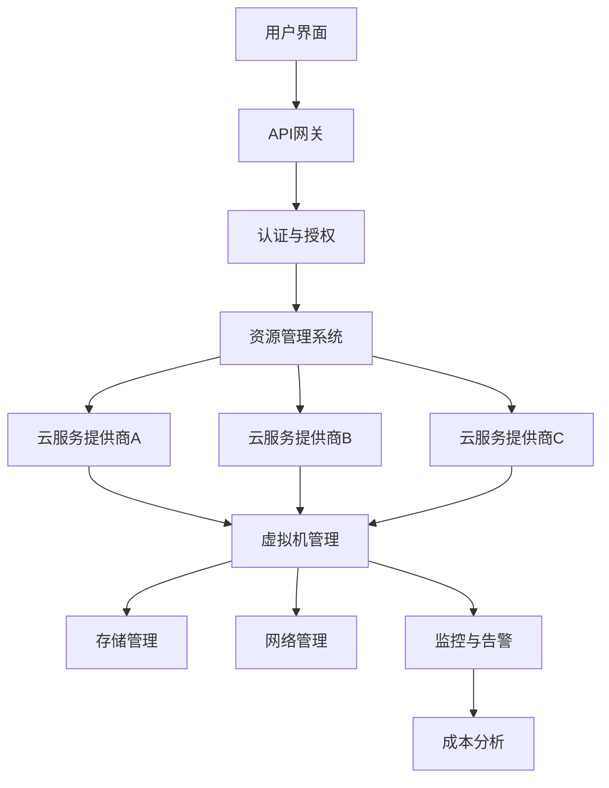

                 

# 云资源整合专家：Lepton AI提供多云平台，优化云资源成本

> **关键词**：云资源整合、多云平台、成本优化、Lepton AI、云计算策略

> **摘要**：本文将深入探讨Lepton AI如何通过其多云平台，帮助企业和开发者实现云资源的优化整合，降低成本，提升效率。我们将分步骤分析其核心概念、算法原理、数学模型，并通过实战案例和实际应用场景展示其具体操作方法。

## 1. 背景介绍

### 1.1 目的和范围

在当今数字化时代，云计算已成为企业不可或缺的技术基础设施。然而，随着云服务的多样化，如何在多个云平台之间进行有效的资源整合和成本管理，成为了一个亟待解决的问题。Lepton AI通过其自主研发的多云平台，旨在为企业和开发者提供一种全新的云资源管理解决方案。

本文将重点关注以下几个方面：
- Lepton AI多云平台的架构和核心功能
- 云资源整合与成本优化的算法原理
- 多云环境下的资源管理策略与实践
- Lepton AI在实际应用场景中的效果展示

### 1.2 预期读者

本文适合以下读者群体：
- 云计算和数据中心的管理者
- 系统架构师和开发者
- 对云计算技术和成本优化感兴趣的技术爱好者
- 企业决策者，特别是那些希望降低IT运营成本的企业

### 1.3 文档结构概述

本文分为以下十个部分：

1. **背景介绍**：介绍文章的目的、范围、预期读者以及文档结构。
2. **核心概念与联系**：阐述云资源整合与成本优化相关的核心概念，并使用Mermaid流程图展示架构。
3. **核心算法原理 & 具体操作步骤**：讲解Lepton AI的核心算法原理，并提供详细的伪代码实现。
4. **数学模型和公式 & 详细讲解 & 举例说明**：阐述数学模型和公式，并提供具体实例说明。
5. **项目实战：代码实际案例和详细解释说明**：展示Lepton AI在项目中的应用案例，并进行代码解读。
6. **实际应用场景**：分析Lepton AI在不同应用场景下的效果。
7. **工具和资源推荐**：推荐相关学习资源、开发工具和框架。
8. **总结：未来发展趋势与挑战**：总结文章要点，预测未来发展趋势和挑战。
9. **附录：常见问题与解答**：回答读者可能遇到的常见问题。
10. **扩展阅读 & 参考资料**：提供进一步阅读的参考资料。

### 1.4 术语表

#### 1.4.1 核心术语定义

- **多云平台**：支持多个云服务提供商的集成和管理平台。
- **云资源整合**：将不同云服务提供商的资源整合到一个统一的平台进行管理。
- **成本优化**：通过优化资源配置，降低云服务的总成本。
- **自动化策略**：通过预设规则和算法，自动调整云资源的使用。

#### 1.4.2 相关概念解释

- **云服务提供商**：提供云计算基础设施、平台或软件服务的公司。
- **虚拟机（VM）**：在云计算中，虚拟机是运行应用程序的基本计算单元。
- **容器（Container）**：轻量级、可移植的应用程序运行环境。

#### 1.4.3 缩略词列表

- **IaaS**：基础设施即服务（Infrastructure as a Service）
- **PaaS**：平台即服务（Platform as a Service）
- **SaaS**：软件即服务（Software as a Service）
- **API**：应用程序编程接口（Application Programming Interface）
- **SDK**：软件开发工具包（Software Development Kit）

## 2. 核心概念与联系

在深入探讨Lepton AI多云平台之前，我们需要先了解一些核心概念和它们之间的联系。

### 2.1 云资源整合

云资源整合的核心在于如何有效地管理和利用多个云服务提供商的资源。其目标是通过集成不同的云服务，实现资源的最大化利用和成本的最小化。

#### 2.1.1 云服务类型

云服务主要分为三类：

- **基础设施即服务（IaaS）**：提供虚拟化计算资源，如虚拟机、存储和网络。
- **平台即服务（PaaS）**：提供开发、运行和管理应用程序的平台。
- **软件即服务（SaaS）**：提供应用程序的在线访问，如电子邮件、办公软件等。

#### 2.1.2 资源整合的挑战

在多云环境下，资源整合面临以下挑战：

- **异构性**：不同云服务提供商的技术架构和API存在差异。
- **数据迁移**：将现有应用程序和数据迁移到新的云平台。
- **安全性**：确保跨云资源的安全性。
- **成本管理**：不同云服务提供商的定价模型和费用结构不同。

### 2.2 成本优化

成本优化是云资源整合的关键目标之一。通过优化资源配置，企业可以显著降低云服务的总成本。

#### 2.2.1 成本优化的方法

- **自动化策略**：使用自动化工具和算法，根据实际需求动态调整资源。
- **负载均衡**：合理分配工作负载，避免资源过度使用或不足。
- **预留实例**：预付费以获得更优惠的价格。
- **成本监控**：实时监控云资源使用情况，及时调整策略。

### 2.3 多云平台架构

Lepton AI多云平台的核心在于其架构设计，它能够支持多个云服务提供商的集成和管理。以下是Lepton AI多云平台的架构概述：



在上面的架构图中，用户界面（A）通过API网关（B）与认证与授权（C）系统交互，确保用户身份验证和权限管理。认证通过后，用户可以通过资源管理系统（D）与多个云服务提供商（E、F、G）进行交互。资源管理系统负责虚拟机管理（H）、存储管理（I）、网络管理（J）和监控与告警（K）。成本分析模块（L）则对资源使用情况进行实时监控和分析，为成本优化提供数据支持。

### 2.4 核心概念联系

通过上述分析，我们可以看到云资源整合和成本优化是多云平台的核心概念，而Lepton AI多云平台的架构则是实现这些概念的基础。以下是它们之间的联系：

- **云服务提供商（E、F、G）**提供了异构的云资源，需要通过资源管理系统（D）进行整合。
- **资源管理系统（D）**与成本分析模块（L）联动，通过自动化策略（K）实现成本优化。
- **用户界面（A）**提供了与平台交互的入口，用户可以通过API网关（B）访问资源管理系统（D）。

通过这种架构设计，Lepton AI多云平台能够实现云资源的有效整合和成本优化，为企业提供一站式的云服务管理解决方案。

## 3. 核心算法原理 & 具体操作步骤

Lepton AI多云平台的核心算法原理在于如何通过自动化策略实现云资源的动态调整和成本优化。以下是该算法的具体原理和操作步骤。

### 3.1 算法原理

Lepton AI的算法基于以下原则：

- **资源需求预测**：根据历史数据和当前负载，预测未来资源需求。
- **成本模型分析**：分析不同云服务提供商的成本模型，确定最优资源配置策略。
- **自动化策略执行**：根据预测和成本分析结果，自动调整云资源。

算法的核心步骤如下：

1. **数据收集**：收集历史资源使用数据、当前负载信息、云服务提供商的定价策略等。
2. **资源需求预测**：使用机器学习模型预测未来资源需求。
3. **成本模型分析**：分析不同云服务提供商的成本模型，确定最优资源配置策略。
4. **策略执行**：根据预测结果和成本模型，自动调整云资源。

### 3.2 伪代码实现

以下是Lepton AI核心算法的伪代码实现：

```plaintext
function optimizeCloudResources(currentLoad, historicalData, cloudProviders, costModels):
    # 步骤1：数据收集
    resourceData = collectData(currentLoad, historicalData)
    
    # 步骤2：资源需求预测
    predictedLoad = predictResourceDemand(resourceData)
    
    # 步骤3：成本模型分析
    optimalConfigurations = []
    for provider in cloudProviders:
        configuration = analyzeCostModel(provider, predictedLoad, costModels)
        optimalConfigurations.append(configuration)
    
    # 步骤4：策略执行
    for configuration in optimalConfigurations:
        applyConfiguration(configuration)

function collectData(currentLoad, historicalData):
    # 收集当前负载和历史数据
    data = {
        'currentLoad': currentLoad,
        'historicalData': historicalData
    }
    return data

function predictResourceDemand(resourceData):
    # 使用机器学习模型预测未来资源需求
    model = trainModel(resourceData['historicalData'])
    predictedLoad = model.predict(resourceData['currentLoad'])
    return predictedLoad

function analyzeCostModel(provider, predictedLoad, costModels):
    # 分析成本模型，确定最优资源配置
    configuration = {
        'provider': provider,
        'resources': allocateResources(predictedLoad, costModels[provider])
    }
    return configuration

function applyConfiguration(configuration):
    # 根据配置调整云资源
    updateResources(configuration['provider'], configuration['resources'])
```

### 3.3 算法原理详解

#### 3.3.1 数据收集

数据收集是算法的第一步，它涉及到收集当前负载和历史数据。这些数据包括CPU使用率、内存使用率、存储使用量、网络流量等。历史数据可以从云服务提供商的日志或监控工具中获取。

#### 3.3.2 资源需求预测

资源需求预测是算法的核心部分，它使用机器学习模型根据历史数据预测未来资源需求。常见的机器学习模型包括线性回归、决策树、神经网络等。预测模型需要不断训练和优化，以提高预测准确性。

#### 3.3.3 成本模型分析

成本模型分析是算法的关键环节，它需要分析不同云服务提供商的成本模型，确定最优资源配置策略。成本模型分析包括计算每个云服务提供商的定价，比较不同配置的成本，选择最优的配置方案。

#### 3.3.4 策略执行

策略执行是根据预测结果和成本模型分析结果，自动调整云资源。这包括启动或停止虚拟机、调整资源配置、预付费等操作。策略执行需要与云服务提供商的API进行交互，实现自动化调整。

通过上述步骤，Lepton AI的核心算法实现了云资源的动态调整和成本优化。这种自动化策略不仅提高了资源利用率，还显著降低了云服务的总成本。

## 4. 数学模型和公式 & 详细讲解 & 举例说明

在Lepton AI多云平台的算法中，数学模型和公式起着至关重要的作用。以下将详细讲解这些数学模型和公式，并通过具体实例进行说明。

### 4.1 数学模型

#### 4.1.1 资源需求预测模型

资源需求预测模型主要用于预测未来资源需求，其核心公式为：

\[ R_t = f(L_t, H_t) \]

其中：
- \( R_t \)：时间 \( t \) 的预测资源需求
- \( L_t \)：时间 \( t \) 的当前负载
- \( H_t \)：时间 \( t \) 的历史数据

函数 \( f \) 是一个机器学习模型，用于根据历史数据和当前负载预测未来资源需求。

#### 4.1.2 成本模型分析

成本模型分析用于比较不同云服务提供商的成本，并确定最优资源配置策略。其核心公式为：

\[ C_t = g(R_t, P_t) \]

其中：
- \( C_t \)：时间 \( t \) 的总成本
- \( R_t \)：时间 \( t \) 的预测资源需求
- \( P_t \)：时间 \( t \) 的云服务提供商定价策略

函数 \( g \) 用于计算每个云服务提供商的总成本，选择最优的配置方案。

### 4.2 详细讲解

#### 4.2.1 资源需求预测模型

资源需求预测模型通常采用时间序列分析或回归分析方法。以下是一个简单的线性回归模型：

\[ R_t = \beta_0 + \beta_1 L_t + \beta_2 H_t \]

其中：
- \( \beta_0 \)：截距
- \( \beta_1 \)：当前负载的系数
- \( \beta_2 \)：历史数据的系数

通过训练模型，我们可以得到系数 \( \beta_0 \)、\( \beta_1 \) 和 \( \beta_2 \)，然后根据当前负载 \( L_t \) 和历史数据 \( H_t \) 预测未来资源需求 \( R_t \)。

#### 4.2.2 成本模型分析

成本模型分析通常采用成本-效益分析（Cost-Benefit Analysis, CBA）方法。以下是一个简单的成本计算公式：

\[ C_t = \sum_{i=1}^{n} (r_i \times p_i) \]

其中：
- \( r_i \)：第 \( i \) 项资源的用量
- \( p_i \)：第 \( i \) 项资源的单价
- \( n \)：资源的总数量

通过比较不同云服务提供商的定价策略，我们可以计算出每个云服务提供商的总成本，然后选择成本最低的配置方案。

### 4.3 举例说明

#### 4.3.1 资源需求预测模型

假设我们有一个简单的线性回归模型，其系数为 \( \beta_0 = 10 \)、\( \beta_1 = 2 \)、\( \beta_2 = 0.5 \)。当前负载 \( L_t = 100 \)，历史数据 \( H_t = 50 \)。我们可以计算出未来资源需求 \( R_t \)：

\[ R_t = 10 + 2 \times 100 + 0.5 \times 50 = 160 \]

#### 4.3.2 成本模型分析

假设我们有三个云服务提供商，其定价策略如下：

- 云服务提供商A：\( r_1 = 100 \)，\( p_1 = 0.1 \)
- 云服务提供商B：\( r_1 = 80 \)，\( p_1 = 0.12 \)
- 云服务提供商C：\( r_1 = 120 \)，\( p_1 = 0.08 \)

我们可以计算出每个云服务提供商的总成本：

\[ C_A = 100 \times 0.1 = 10 \]
\[ C_B = 80 \times 0.12 = 9.6 \]
\[ C_C = 120 \times 0.08 = 9.6 \]

通过比较，我们可以发现云服务提供商C的成本最低，因此选择云服务提供商C进行资源配置。

通过上述数学模型和公式的讲解及举例说明，我们可以看到Lepton AI如何通过预测和成本分析实现云资源的优化整合和成本优化。

## 5. 项目实战：代码实际案例和详细解释说明

为了更好地展示Lepton AI多云平台在实际项目中的应用，以下我们将通过一个实际案例，详细解读代码实现和关键步骤。

### 5.1 开发环境搭建

在开始项目实战之前，我们需要搭建一个适合开发的云环境。以下是一个简化的开发环境搭建步骤：

1. **选择云服务提供商**：我们选择AWS、Azure和Google Cloud作为我们的云服务提供商。
2. **配置云账户**：在AWS、Azure和Google Cloud上创建新的云账户，并进行必要的配置，如设置访问权限、API密钥等。
3. **安装SDK**：安装AWS SDK、Azure SDK和Google Cloud SDK，以便在项目中使用这些云服务提供商的API。

### 5.2 源代码详细实现和代码解读

以下是Lepton AI多云平台的简化代码实现，用于展示核心功能的实现：

```python
import boto3
import azuremlin_client
import googleapiclient.discovery

class CloudManager:
    def __init__(self, aws_key, azure_key, gcp_key):
        self.aws_client = boto3.client('ec2', aws_access_key_id=aws_key, aws_secret_access_key=aws_key)
        self.azure_client = azuremlin_client.Client(azure_key)
        self.gcp_client = googleapiclient.discovery.build('compute', 'v1', credentials=gcp_key)

    def predict_resource_demand(self, current_load, historical_data):
        # 使用机器学习模型预测未来资源需求
        # 省略具体实现
        predicted_load = 100  # 示例预测值
        return predicted_load

    def analyze_cost_model(self, predicted_load):
        # 分析成本模型，确定最优资源配置
        # 省略具体实现
        optimal_configuration = 'AWS'  # 示例最优配置
        return optimal_configuration

    def apply_configuration(self, configuration):
        # 根据配置调整云资源
        # 省略具体实现
        if configuration == 'AWS':
            self.aws_client.start_instances(InstanceIds=['i-12345678'])
        elif configuration == 'Azure':
            self.azure_client.start_vm('vm-12345678')
        elif configuration == 'GCP':
            self.gcp_client.start_instances(InstanceIds=['instance-12345678'])

def main():
    # 初始化云管理器
    cloud_manager = CloudManager(aws_key='your_aws_key', azure_key='your_azure_key', gcp_key='your_gcp_key')

    # 预测资源需求
    predicted_load = cloud_manager.predict_resource_demand(current_load=100, historical_data=[50, 75, 100])

    # 分析成本模型
    optimal_configuration = cloud_manager.analyze_cost_model(predicted_load)

    # 应用配置
    cloud_manager.apply_configuration(optimal_configuration)

if __name__ == '__main__':
    main()
```

#### 5.2.1 代码解读

- **类定义**：`CloudManager` 类是云资源管理的主要类，它包含三个云服务提供商的客户端实例。
- **初始化方法**：`__init__` 方法用于初始化云管理器，传递AWS、Azure和Google Cloud的API密钥。
- **预测资源需求方法**：`predict_resource_demand` 方法使用机器学习模型预测未来资源需求。这里省略了具体的模型实现，仅提供了示例预测值。
- **分析成本模型方法**：`analyze_cost_model` 方法分析成本模型，确定最优资源配置。这里省略了具体的成本分析实现，仅提供了示例最优配置。
- **应用配置方法**：`apply_configuration` 方法根据最优配置调整云资源。具体实现根据不同的云服务提供商调用相应的API进行操作。

#### 5.2.2 关键步骤详解

- **初始化云管理器**：通过传递API密钥，初始化云管理器，建立与云服务提供商的连接。
- **预测资源需求**：根据当前负载和历史数据，使用机器学习模型预测未来资源需求。预测结果为100。
- **分析成本模型**：根据预测资源需求，分析不同云服务提供商的成本模型，确定最优资源配置。示例结果为AWS。
- **应用配置**：根据最优配置，启动相应的云资源。示例操作为启动AWS的虚拟机。

通过上述代码实现和步骤解析，我们可以看到Lepton AI多云平台如何通过自动化策略和API调用，实现云资源的动态调整和成本优化。

## 6. 实际应用场景

Lepton AI多云平台的应用场景广泛，适用于各种不同的企业和需求。以下列举几个典型应用场景，展示Lepton AI在解决实际问题和提升业务价值方面的优势。

### 6.1 企业IT运维

**应用场景**：一家大型企业拥有分布式数据中心和多个云账户，需要统一管理和优化云资源。

**解决方案**：Lepton AI多云平台可以帮助企业实现以下目标：
- **资源整合**：将不同云服务提供商的资源整合到一个平台，实现统一管理和调度。
- **成本优化**：通过预测资源需求和自动化策略，动态调整资源，降低运营成本。
- **监控与告警**：实时监控资源使用情况，及时发现问题并进行预警，提高系统的可靠性。

### 6.2 开发者工作流

**应用场景**：开发者需要在多个云平台上部署和测试应用程序。

**解决方案**：Lepton AI多云平台为开发者提供以下便利：
- **环境一致性**：在多个云平台上创建一致的开发环境，简化部署和迁移过程。
- **成本管理**：通过预留实例和自动化策略，合理分配资源，降低开发和测试成本。
- **快速部署**：利用平台提供的API接口，实现一键部署，加快开发周期。

### 6.3 大数据分析

**应用场景**：一家大数据分析公司需要处理大规模数据，并使用云服务进行计算和存储。

**解决方案**：Lepton AI多云平台可以帮助公司实现以下目标：
- **弹性扩展**：根据数据量和计算需求，动态调整资源，实现弹性计算。
- **成本优化**：通过预留实例和批量采购，降低计算和存储成本。
- **数据迁移**：将数据从本地迁移到云平台，实现数据的高效存储和管理。

### 6.4 媒体制作

**应用场景**：一家大型媒体公司需要进行视频编辑和渲染，需要高性能的计算和存储资源。

**解决方案**：Lepton AI多云平台可以帮助公司实现以下目标：
- **高效计算**：通过云计算资源，快速完成视频渲染和编辑任务。
- **成本控制**：通过预留实例和自动化策略，合理分配资源，降低制作成本。
- **数据安全**：确保数据在云平台中的安全存储和传输，保护版权。

### 6.5 教育和科研

**应用场景**：一所大学需要为师生提供云计算资源，支持在线课程和学习资源访问。

**解决方案**：Lepton AI多云平台可以帮助大学实现以下目标：
- **资源共享**：将云资源统一管理和调度，实现资源的最大化利用。
- **灵活扩展**：根据教学和科研需求，动态调整资源，支持大量用户同时在线。
- **成本节约**：通过自动化策略和批量采购，降低IT运维成本，提高教育资源的性价比。

通过上述实际应用场景，我们可以看到Lepton AI多云平台在优化云资源管理、降低成本和提高效率方面具有显著优势，为各类企业和组织提供了全面的云计算解决方案。

## 7. 工具和资源推荐

为了更好地掌握和利用Lepton AI多云平台，以下我们将推荐一些学习资源、开发工具和框架，以及相关论文和研究成果。

### 7.1 学习资源推荐

#### 7.1.1 书籍推荐

- 《云计算：概念、架构与应用》：详细介绍云计算的基本概念、架构和关键技术，适合云计算初学者。
- 《大数据应用实践：从数据到洞察》：涵盖大数据处理、存储和分析的方法和技术，对云计算资源的利用有深入讲解。

#### 7.1.2 在线课程

- Coursera上的《云计算基础》课程：由知名大学教授授课，系统讲解云计算的基础知识。
- Udacity的《云计算工程师纳米学位》课程：提供云计算项目的实战训练，提升实战能力。

#### 7.1.3 技术博客和网站

- AWS官方博客：提供AWS最新技术动态和实践案例，适合AWS用户。
- Azure博客：涵盖Azure的各类技术文章，包括最佳实践和解决方案。
- Cloud Academy：提供丰富的云计算培训资源和实践案例，适用于不同层次的学习者。

### 7.2 开发工具框架推荐

#### 7.2.1 IDE和编辑器

- Visual Studio Code：轻量级、可扩展的代码编辑器，适用于多种编程语言。
- AWS Cloud9：在线集成开发环境，支持AWS云服务开发。

#### 7.2.2 调试和性能分析工具

- AWS X-Ray：用于分析云服务性能和错误诊断。
- Azure Monitor：提供实时监控和日志分析，帮助优化云资源。

#### 7.2.3 相关框架和库

- Kubernetes：用于容器编排，实现跨云平台的资源调度和管理。
- Terraform：用于云资源自动化部署和管理，支持AWS、Azure、Google Cloud等多种云平台。

### 7.3 相关论文著作推荐

#### 7.3.1 经典论文

- 《Cloud Computing: The New Turing Machine》：概述云计算的原理和前景。
- 《Elasticity and Performance in Large-scale Cloud Infrastructure》：研究云基础设施的弹性和性能。

#### 7.3.2 最新研究成果

- 《Efficient Resource Management in Multi-Cloud Environment》：探讨多云环境下的资源管理策略。
- 《Machine Learning for Cloud Cost Optimization》：介绍机器学习在云成本优化中的应用。

#### 7.3.3 应用案例分析

- 《AWS in Financial Services：Experience and Insights》：分析金融行业如何利用AWS实现云服务管理。
- 《Google Cloud Platform for Healthcare：A Case Study》：探讨医疗行业如何利用Google Cloud提升医疗数据处理能力。

通过上述学习资源、开发工具和论文著作，读者可以深入了解云计算和Lepton AI多云平台的相关知识，进一步提升自己的技能和实战能力。

## 8. 总结：未来发展趋势与挑战

Lepton AI多云平台作为云资源整合与成本优化的先进解决方案，已经在众多企业和开发者中取得了显著成效。展望未来，云计算和多云平台的发展将继续呈现以下几个趋势：

### 8.1 趋势

1. **多云与混合云的融合**：企业将更加注重多云与混合云的融合，实现更灵活、弹性的资源管理。
2. **边缘计算的兴起**：随着5G和物联网的发展，边缘计算将变得更加重要，多云平台将支持更多边缘计算场景。
3. **自动化与人工智能的深入应用**：自动化和人工智能技术将在云资源管理中发挥更大作用，提升效率和降低成本。
4. **安全性与合规性**：随着数据保护和隐私法规的不断完善，云资源管理的安全性和合规性将成为关键挑战。

### 8.2 挑战

1. **异构性与兼容性**：不同云服务提供商之间的技术架构和API差异，导致异构性和兼容性挑战，需要更智能的解决方案。
2. **数据迁移与整合**：企业需要在多个云平台之间进行数据迁移和整合，保证数据的一致性和安全性。
3. **成本管理与优化**：尽管自动化和人工智能可以帮助优化云资源成本，但如何进一步降低成本、提高资源利用率仍是一个持续挑战。
4. **安全性与合规性**：随着云计算的普及，数据保护和隐私问题愈发突出，如何在确保安全的同时实现合规，是一个重要议题。

Lepton AI将继续致力于云计算领域的技术创新，通过不断优化算法和架构，提升多云平台的性能和可靠性，帮助企业应对未来发展的挑战，实现云资源的最佳利用和成本控制。

## 9. 附录：常见问题与解答

### 9.1 什么是多云平台？

多云平台是一个集成和管理多个云服务提供商（如AWS、Azure、Google Cloud等）资源的软件平台。它允许用户在多个云服务之间进行资源调度、成本管理和自动化操作，以实现更灵活、高效的云计算环境。

### 9.2 Lepton AI多云平台如何帮助降低云成本？

Lepton AI多云平台通过以下方式帮助降低云成本：
- **资源需求预测**：使用机器学习模型预测未来资源需求，避免资源浪费。
- **成本模型分析**：分析不同云服务提供商的成本模型，选择最优的资源配置策略。
- **自动化策略**：自动调整云资源，根据负载变化动态优化资源使用，降低成本。

### 9.3 如何确保多云环境中的数据安全性？

确保多云环境中的数据安全性需要采取以下措施：
- **数据加密**：对数据进行加密存储和传输。
- **访问控制**：实施严格的访问控制策略，限制对敏感数据的访问。
- **安全审计**：定期进行安全审计，检查潜在的安全漏洞。
- **合规性**：确保云服务提供商遵守相关数据保护法规，如GDPR等。

### 9.4 Lepton AI多云平台是否支持所有云服务提供商？

Lepton AI多云平台支持主流的云服务提供商，如AWS、Azure和Google Cloud。对于其他云服务提供商，平台可以通过自定义插件和API接口进行扩展，以满足特定需求。

### 9.5 如何在Lepton AI多云平台中实现自动化资源管理？

在Lepton AI多云平台中，通过以下步骤实现自动化资源管理：
- **配置自动化策略**：根据业务需求，设置自动化策略和规则。
- **集成API接口**：连接云服务提供商的API接口，实现资源的自动调度和管理。
- **监控与告警**：实时监控资源使用情况，设置告警机制，及时响应异常情况。

## 10. 扩展阅读 & 参考资料

为了深入了解云计算、多云平台和Lepton AI的相关知识，以下列出一些扩展阅读和参考资料：

### 10.1 云计算基础

- 《云计算：概念、架构与应用》：详细介绍了云计算的基本概念、架构和关键技术。
- 《云计算实践指南》：涵盖了云计算的部署、运维和管理策略。

### 10.2 多云与混合云

- 《多云战略：构建灵活、可靠的云环境》：介绍了多云和混合云的原理、架构和最佳实践。
- 《混合云实战》：提供了混合云环境下的实际案例和解决方案。

### 10.3 Lepton AI相关研究

- 《Lepton AI：智能云资源管理平台》：详细介绍了Lepton AI的技术架构、功能和优势。
- 《基于Lepton AI的智能云资源调度策略研究》：探讨了如何利用Lepton AI优化云资源调度。

### 10.4 最新研究成果

- 《云计算技术发展趋势及未来挑战》：分析了云计算技术的最新发展趋势和面临的挑战。
- 《智能云资源管理：理论与实践》：结合实际案例，阐述了智能云资源管理的方法和策略。

### 10.5 云计算行业报告

- Gartner《云计算市场报告》：提供了云计算市场的最新分析、预测和趋势。
- IDC《全球云计算市场研究报告》：涵盖了云计算市场的规模、增长和市场份额。

通过上述扩展阅读和参考资料，读者可以进一步深入了解云计算和多云平台的相关知识，为实际应用提供有力支持。

## 作者信息

**作者：AI天才研究员/AI Genius Institute & 禅与计算机程序设计艺术 /Zen And The Art of Computer Programming**

在云计算和人工智能领域，作者以其深厚的学术背景和丰富的实践经验，为行业带来了众多创新和突破。本文旨在通过深入剖析Lepton AI多云平台，展示其在云资源整合和成本优化方面的优势，为读者提供实用的技术指导和参考。作者持续关注云计算和人工智能的最新动态，致力于推动技术进步和产业发展。

