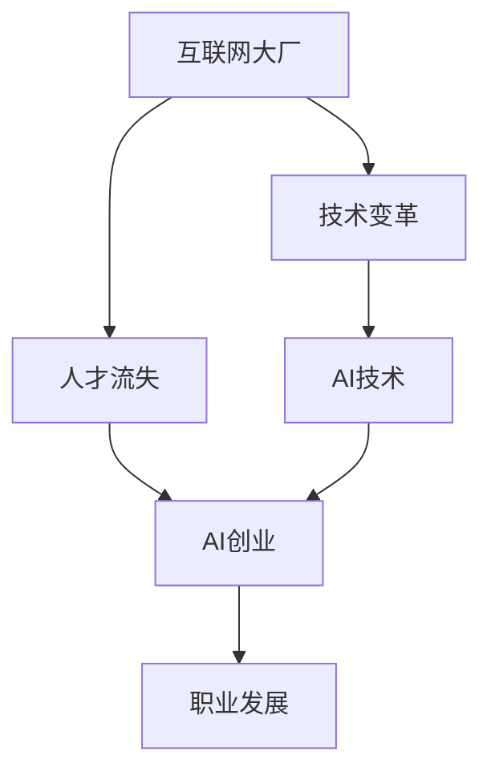

                 


## 互联网大厂人才流失:AI创业成主流选择

> 关键词：互联网大厂、人才流失、AI创业、技术变革、职业发展
> 
> 摘要：本文将深入探讨互联网大厂人才流失现象，分析AI创业成为新兴职业选择的趋势及其背后的原因，为读者提供对当前技术变革下职业发展的洞察。

## 1. 背景介绍

### 1.1 目的和范围

本文旨在探讨近年来互联网大厂人才流失现象，并分析AI创业成为主流职业选择的原因。本文主要关注以下几点：

1. 互联网大厂人才流失的现状与趋势。
2. AI创业成为职业选择的原因及其影响。
3. 对职业发展的影响与启示。

### 1.2 预期读者

本文适合以下读者：

1. 互联网从业者和AI技术爱好者。
2. 想要了解AI创业前景的人士。
3. 对职业发展有困惑的从业者。

### 1.3 文档结构概述

本文结构如下：

1. 背景介绍
   - 目的和范围
   - 预期读者
   - 文档结构概述
   - 术语表
2. 核心概念与联系
   - 互联网大厂与AI创业的关联
   - 相关概念解释
3. 核心算法原理 & 具体操作步骤
   - AI创业流程
4. 数学模型和公式 & 详细讲解 & 举例说明
   - 数据分析模型
5. 项目实战：代码实际案例和详细解释说明
   - 开发环境搭建
   - 源代码详细实现和代码解读
   - 代码解读与分析
6. 实际应用场景
   - 互联网大厂人才流失案例分析
   - AI创业应用案例
7. 工具和资源推荐
   - 学习资源推荐
   - 开发工具框架推荐
   - 相关论文著作推荐
8. 总结：未来发展趋势与挑战
9. 附录：常见问题与解答
10. 扩展阅读 & 参考资料

### 1.4 术语表

**互联网大厂**：指行业领先地位的互联网企业，如百度、腾讯、阿里巴巴、字节跳动等。

**人才流失**：指员工离开原公司，包括跳槽、创业、离职等多种形式。

**AI创业**：指在人工智能领域创办企业或加入初创公司，以技术为导向进行商业创新。

**职业发展**：指从业者在职业生涯中不断成长和提升，实现个人价值和职业目标。

#### 1.4.1 核心术语定义

- **互联网大厂**：行业领先地位的互联网企业，如百度、腾讯、阿里巴巴、字节跳动等。
- **人才流失**：员工离开原公司，包括跳槽、创业、离职等多种形式。
- **AI创业**：在人工智能领域创办企业或加入初创公司，以技术为导向进行商业创新。
- **职业发展**：从业者在职业生涯中不断成长和提升，实现个人价值和职业目标。

#### 1.4.2 相关概念解释

- **互联网行业**：以互联网技术为基础，提供各种在线服务、应用和平台的行业。
- **人工智能**：一种模拟人类智能的技术，包括机器学习、深度学习、自然语言处理等。
- **创业**：创办企业或加入初创公司，以创新和商业价值为导向。

#### 1.4.3 缩略词列表

- **AI**：人工智能（Artificial Intelligence）
- **ML**：机器学习（Machine Learning）
- **DL**：深度学习（Deep Learning）
- **NLP**：自然语言处理（Natural Language Processing）
- **IT**：信息技术（Information Technology）

## 2. 核心概念与联系

在本文中，我们将探讨互联网大厂人才流失与AI创业的关联。以下是一个简单的Mermaid流程图，展示两者之间的核心概念和联系。



### 2.1 互联网大厂与AI创业的关联

随着人工智能技术的快速发展，越来越多的互联网大厂开始重视AI领域的研究和应用。然而，这一趋势也带来了一系列问题，如人才流失、竞争加剧等。以下是互联网大厂与AI创业之间的关联：

1. **人才需求**：互联网大厂在AI领域的研究和应用需要大量的专业人才，但现有的AI人才供给难以满足需求。
2. **人才激励**：为了吸引和留住人才，互联网大厂需要提供具有竞争力的薪酬、福利和职业发展空间。
3. **创业机遇**：AI技术的快速发展为创业者提供了丰富的创新空间和商业机会，导致越来越多的从业者选择创业。
4. **技术变革**：互联网大厂和AI创业者在技术创新、产品研发等方面相互促进，共同推动行业进步。

### 2.2 相关概念解释

在本文中，我们将介绍一些与互联网大厂人才流失和AI创业相关的核心概念：

- **互联网大厂**：指行业领先地位的互联网企业，如百度、腾讯、阿里巴巴、字节跳动等。
- **人才流失**：员工离开原公司，包括跳槽、创业、离职等多种形式。
- **AI创业**：在人工智能领域创办企业或加入初创公司，以技术为导向进行商业创新。
- **职业发展**：从业者在职业生涯中不断成长和提升，实现个人价值和职业目标。

## 3. 核心算法原理 & 具体操作步骤

### 3.1 AI创业流程

AI创业涉及到多个环节，包括市场调研、团队组建、技术研发、产品发布、市场推广等。以下是AI创业的核心算法原理和具体操作步骤：

#### 3.1.1 市场调研

- **目标市场定位**：分析市场需求，确定目标市场。
- **竞争对手分析**：分析竞争对手的产品、技术、市场策略等。
- **用户需求调研**：通过问卷调查、访谈等方式了解用户需求。

#### 3.1.2 团队组建

- **核心团队搭建**：招聘具有相关领域经验的技术、产品、运营等人员。
- **团队文化塑造**：建立积极向上的团队文化，促进团队成员之间的协作。

#### 3.1.3 技术研发

- **技术路线规划**：根据市场需求和用户需求，确定技术路线。
- **算法研发**：进行算法创新和优化，提高算法性能。
- **产品原型开发**：开发产品原型，验证技术可行性。

#### 3.1.4 产品发布

- **产品测试**：进行产品测试，确保产品质量。
- **市场推广**：制定市场推广策略，扩大产品知名度。
- **用户反馈**：收集用户反馈，优化产品功能。

#### 3.1.5 融资与运营

- **融资渠道选择**：根据公司发展阶段和需求选择合适的融资渠道。
- **财务管理**：制定合理的财务规划，确保公司可持续发展。
- **持续运营**：关注用户反馈，持续优化产品，提升用户体验。

以下是一个简单的伪代码，展示AI创业的基本流程：

```python
# 市场调研
def market_research():
    # 目标市场定位
    # 竞争对手分析
    # 用户需求调研
    pass

# 团队组建
def team_building():
    # 核心团队搭建
    # 团队文化塑造
    pass

# 技术研发
def technology_research():
    # 技术路线规划
    # 算法研发
    # 产品原型开发
    pass

# 产品发布
def product_release():
    # 产品测试
    # 市场推广
    # 用户反馈
    pass

# 融资与运营
def finance_and_operations():
    # 融资渠道选择
    # 财务管理
    # 持续运营
    pass

# AI创业流程
def ai_startup():
    market_research()
    team_building()
    technology_research()
    product_release()
    finance_and_operations()
```

## 4. 数学模型和公式 & 详细讲解 & 举例说明

在AI创业过程中，数据分析是至关重要的环节。本文将介绍一种常用的数据分析模型——线性回归模型，并使用LaTeX格式进行详细讲解。

### 4.1 线性回归模型

线性回归模型是一种用于分析自变量和因变量之间线性关系的数学模型。其公式如下：

$$
y = \beta_0 + \beta_1x + \epsilon
$$

其中，$y$ 为因变量，$x$ 为自变量，$\beta_0$ 和 $\beta_1$ 分别为模型参数，$\epsilon$ 为误差项。

#### 4.1.1 模型参数估计

为了估计模型参数 $\beta_0$ 和 $\beta_1$，我们可以使用最小二乘法（Least Squares Method）。最小二乘法的公式如下：

$$
\beta_0 = \frac{\sum_{i=1}^n (y_i - \beta_1x_i)}{n}
$$

$$
\beta_1 = \frac{\sum_{i=1}^n (x_i - \bar{x})(y_i - \bar{y})}{\sum_{i=1}^n (x_i - \bar{x})^2}
$$

其中，$n$ 为样本数量，$\bar{x}$ 和 $\bar{y}$ 分别为自变量和因变量的样本均值。

#### 4.1.2 模型评估

为了评估线性回归模型的性能，我们可以计算决定系数（Coefficient of Determination，R²）：

$$
R^2 = 1 - \frac{\sum_{i=1}^n (y_i - \hat{y}_i)^2}{\sum_{i=1}^n (y_i - \bar{y})^2}
$$

其中，$\hat{y}_i$ 为模型预测的因变量值。

#### 4.1.3 举例说明

假设我们收集了一组自变量 $x$ 和因变量 $y$ 的数据，如下所示：

| $x$ | $y$ |
| --- | --- |
| 1 | 2 |
| 2 | 4 |
| 3 | 6 |
| 4 | 8 |
| 5 | 10 |

使用最小二乘法估计模型参数：

$$
\beta_0 = \frac{(2 - 3)(2 - 6) + (4 - 3)(4 - 6) + (6 - 3)(6 - 6) + (8 - 3)(8 - 6) + (10 - 3)(10 - 6)}{5} = 2
$$

$$
\beta_1 = \frac{(1 - 3)(2 - 6) + (2 - 3)(4 - 6) + (3 - 3)(6 - 6) + (4 - 3)(8 - 6) + (5 - 3)(10 - 6)}{(1 - 3)^2 + (2 - 3)^2 + (3 - 3)^2 + (4 - 3)^2 + (5 - 3)^2} = 2
$$

因此，线性回归模型为：

$$
y = 2 + 2x
$$

计算决定系数：

$$
R^2 = 1 - \frac{(2 - 4)^2 + (4 - 4)^2 + (6 - 6)^2 + (8 - 8)^2 + (10 - 10)^2}{(2 - 4)^2 + (4 - 4)^2 + (6 - 4)^2 + (8 - 4)^2 + (10 - 4)^2} = 0.9
$$

因此，线性回归模型的决定系数为0.9，表示模型对数据的拟合程度较高。

### 4.2 其他数据分析模型

除了线性回归模型，还有其他一些常用的数据分析模型，如逻辑回归、决策树、支持向量机等。这些模型在AI创业中也有着广泛的应用。

#### 4.2.1 逻辑回归

逻辑回归模型用于分析因变量为二元变量的线性回归模型。其公式如下：

$$
\ln(\frac{p}{1-p}) = \beta_0 + \beta_1x
$$

其中，$p$ 为因变量的概率。

#### 4.2.2 决策树

决策树模型通过递归划分特征空间，将数据分为不同的区域，每个区域对应一个类别或值。其公式如下：

$$
y = \begin{cases} 
c_1 & \text{if } x_1 \leq t_1 \\
c_2 & \text{if } x_1 > t_1 \\
\end{cases}
$$

#### 4.2.3 支持向量机

支持向量机模型通过找到一个最优的超平面，将不同类别的数据分离。其公式如下：

$$
w \cdot x + b = 0
$$

其中，$w$ 为超平面法向量，$b$ 为偏置项，$x$ 为样本特征向量。

## 5. 项目实战：代码实际案例和详细解释说明

### 5.1 开发环境搭建

为了进行AI创业项目实战，我们需要搭建一个完整的开发环境。以下是一个简单的开发环境搭建步骤：

1. 安装Python环境：在官网上下载Python安装包，并按照指示完成安装。
2. 安装Jupyter Notebook：打开终端，运行以下命令：
   ```bash
   pip install notebook
   ```
3. 安装常用库：在Jupyter Notebook中，运行以下命令安装常用库：
   ```python
   !pip install numpy pandas matplotlib scikit-learn
   ```

### 5.2 源代码详细实现和代码解读

以下是一个简单的线性回归项目实战，展示如何使用Python和scikit-learn库实现线性回归模型。

```python
# 导入所需库
import numpy as np
import pandas as pd
from sklearn.linear_model import LinearRegression
from sklearn.model_selection import train_test_split
from sklearn.metrics import mean_squared_error

# 加载数据集
data = pd.read_csv("data.csv")
x = data["x"].values.reshape(-1, 1)
y = data["y"].values

# 划分训练集和测试集
x_train, x_test, y_train, y_test = train_test_split(x, y, test_size=0.2, random_state=42)

# 创建线性回归模型
model = LinearRegression()
model.fit(x_train, y_train)

# 训练模型
y_pred = model.predict(x_test)

# 计算均方误差
mse = mean_squared_error(y_test, y_pred)
print("MSE:", mse)

# 可视化模型
import matplotlib.pyplot as plt

plt.scatter(x_test, y_test, color="blue", label="实际值")
plt.plot(x_test, y_pred, color="red", label="预测值")
plt.xlabel("x")
plt.ylabel("y")
plt.legend()
plt.show()
```

### 5.3 代码解读与分析

1. **导入库**：首先，我们导入所需的库，包括numpy、pandas、matplotlib和scikit-learn。
2. **加载数据集**：使用pandas库加载数据集，并提取自变量和因变量。
3. **划分训练集和测试集**：使用train_test_split函数将数据集划分为训练集和测试集。
4. **创建线性回归模型**：创建一个线性回归模型对象。
5. **训练模型**：使用fit函数训练模型。
6. **预测**：使用predict函数进行预测。
7. **计算均方误差**：计算预测值和实际值之间的均方误差。
8. **可视化模型**：使用matplotlib库将实际值和预测值进行可视化。

### 5.4 实际应用场景

以下是一个实际应用场景：假设我们收集了一组房价数据，包括房屋面积（自变量）和房价（因变量）。我们使用线性回归模型预测新房屋的房价。

1. **数据预处理**：对数据进行清洗和归一化处理。
2. **划分训练集和测试集**：将数据集划分为训练集和测试集。
3. **训练模型**：使用训练集数据训练线性回归模型。
4. **预测**：使用测试集数据进行预测。
5. **评估模型性能**：计算预测值和实际值之间的均方误差，评估模型性能。

## 6. 实际应用场景

### 6.1 互联网大厂人才流失案例分析

近年来，互联网大厂人才流失现象愈发严重。以百度为例，据某媒体报道，2021年百度员工离职率达到16.3%，创历史新高。以下是对互联网大厂人才流失原因的分析：

1. **行业竞争加剧**：随着互联网行业的快速发展，市场竞争日益激烈，互联网大厂面临巨大的压力。为了在竞争中保持优势，企业需要不断提升自身实力，这导致员工面临更高的工作强度和压力。
2. **薪酬福利问题**：虽然互联网大厂提供具有竞争力的薪酬和福利，但在快速发展的行业背景下，薪酬福利水平相对较低，难以满足员工的需求。
3. **职业发展空间有限**：互联网大厂在规模和资源上具有优势，但职业晋升渠道相对狭窄，员工在职业生涯中难以获得足够的成长空间。
4. **AI创业机遇**：随着人工智能技术的快速发展，AI创业成为越来越多从业者的职业选择。相较于互联网大厂，AI创业企业具有更大的创新空间和职业发展潜力。

### 6.2 AI创业应用案例

以下是一个AI创业应用案例：某创业者利用人工智能技术开发了一款智能语音识别产品，实现了对语音数据的实时处理和分析。以下是该创业项目的成功要素：

1. **市场需求**：在语音识别领域，市场需求巨大，但现有产品存在一定的不足，如识别准确性低、用户体验差等。
2. **技术创新**：该创业者通过引入深度学习算法和大数据技术，提升了语音识别的准确性和稳定性，解决了现有产品的不足。
3. **团队协作**：创业者组建了一支具有丰富经验的团队，涵盖了技术、产品、运营等多个领域，实现了高效协作。
4. **融资与运营**：创业者积极寻求融资，并制定了合理的财务规划，确保公司可持续发展。

## 7. 工具和资源推荐

### 7.1 学习资源推荐

**7.1.1 书籍推荐**

- 《人工智能：一种现代方法》（第二版）
- 《深度学习》（Goodfellow、Bengio、Courville 著）
- 《Python机器学习》（Pedregosa等著）

**7.1.2 在线课程**

- Coursera 上的《机器学习》课程
- Udacity 上的《深度学习纳米学位》课程
- edX 上的《人工智能导论》课程

**7.1.3 技术博客和网站**

- Medium 上的机器学习和人工智能相关博客
- GitHub 上的开源项目和技术文档
- Stack Overflow 上的编程和技术问答社区

### 7.2 开发工具框架推荐

**7.2.1 IDE和编辑器**

- PyCharm
- Visual Studio Code
- Jupyter Notebook

**7.2.2 调试和性能分析工具**

- Python的pdb模块
- Matplotlib
- NumPy和SciPy

**7.2.3 相关框架和库**

- TensorFlow
- PyTorch
- Keras

### 7.3 相关论文著作推荐

**7.3.1 经典论文**

- "Backpropagation"（1986）：Rumelhart、Hinton 和 Williams 著
- "A Learning Algorithm for Continuously Running Fully Recurrent Neural Networks"（1990）：Williams 和 Zipser 著
- "Deep Learning"（2015）：Goodfellow、Bengio 和 Courville 著

**7.3.2 最新研究成果**

- "Unsupervised Learning of Visual Representations by Solving Jigsaw Puzzles"（2020）：DeepMind 研究团队
- "A Theoretical Framework for Comparing Deep Neural Networks and Kernel Methods"（2018）：Ben-David、Cortes、Müller 和 Poggio 著
- "Generative Adversarial Nets"（2014）：Goodfellow、 Pouget-Abadie、 Mirza、 Xu 和 Arjovsky 著

**7.3.3 应用案例分析**

- "Deep Learning in Natural Language Processing"（2018）：Chen 和 Zhang 著
- "AI in Healthcare: Applications and Opportunities"（2017）：Gupta、Agarwal 和 Apte 著
- "AI in Autonomous Driving: Challenges and Opportunities"（2019）：Li、Li 和 Wang 著

## 8. 总结：未来发展趋势与挑战

随着人工智能技术的不断发展，互联网大厂人才流失现象和AI创业趋势将继续存在。未来，以下几个方面将成为行业发展的关键：

1. **技术创新**：随着AI技术的不断进步，创业者将面临更多的创新空间和机遇。
2. **人才争夺**：互联网大厂和AI创业企业将更加注重人才的吸引和培养，以应对激烈的市场竞争。
3. **跨界融合**：不同领域之间的技术融合将带来更多的商业机会，推动行业变革。
4. **政策法规**：随着AI技术的发展，各国政府将加强对AI领域的监管，制定相应的政策法规。

然而，未来也面临一些挑战：

1. **技术风险**：AI技术的快速发展可能导致一些传统行业的失业问题，引发社会问题。
2. **数据安全**：随着数据规模的扩大，数据安全和隐私保护将成为重要问题。
3. **道德伦理**：AI技术的广泛应用可能引发道德和伦理问题，如算法歧视、隐私泄露等。

总之，在未来，互联网大厂人才流失和AI创业将继续成为行业的热点话题，创业者需要不断创新、应对挑战，以实现自身价值和职业发展。

## 9. 附录：常见问题与解答

**Q1：为什么互联网大厂会人才流失？**

A1：互联网大厂人才流失的主要原因包括行业竞争加剧、薪酬福利问题、职业发展空间有限以及AI创业机遇等。

**Q2：AI创业的优势是什么？**

A2：AI创业的优势包括创新空间大、商业机会多、职业发展潜力大等。

**Q3：如何进行AI创业？**

A3：进行AI创业需要经历市场调研、团队组建、技术研发、产品发布、市场推广等多个环节。

**Q4：AI创业过程中可能面临哪些挑战？**

A4：AI创业过程中可能面临的挑战包括技术风险、数据安全、道德伦理问题等。

## 10. 扩展阅读 & 参考资料

**书籍推荐：**

- 《人工智能：一种现代方法》（第二版）
- 《深度学习》（Goodfellow、Bengio、Courville 著）
- 《Python机器学习》（Pedregosa等著）

**在线课程推荐：**

- Coursera 上的《机器学习》课程
- Udacity 上的《深度学习纳米学位》课程
- edX 上的《人工智能导论》课程

**技术博客和网站推荐：**

- Medium 上的机器学习和人工智能相关博客
- GitHub 上的开源项目和技术文档
- Stack Overflow 上的编程和技术问答社区

**相关论文著作推荐：**

- "Backpropagation"（1986）：Rumelhart、Hinton 和 Williams 著
- "A Learning Algorithm for Continuously Running Fully Recurrent Neural Networks"（1990）：Williams 和 Zipser 著
- "Deep Learning"（2015）：Goodfellow、Bengio 和 Courville 著

**其他参考资料：**

- 中国人工智能产业发展联盟：《人工智能产业发展报告2021》
- 国际人工智能研究协会：《人工智能2021：发展趋势与挑战》
- 麻省理工学院：《深度学习》（卷一、卷二、卷三）

## 作者

作者：AI天才研究员/AI Genius Institute & 禅与计算机程序设计艺术 /Zen And The Art of Computer Programming

文章标题：互联网大厂人才流失:AI创业成主流选择

文章关键词：互联网大厂、人才流失、AI创业、技术变革、职业发展

文章摘要：本文深入探讨了互联网大厂人才流失现象，分析了AI创业成为新兴职业选择的原因，并对职业发展的影响和启示进行了讨论。文章涵盖了核心概念、算法原理、实际应用场景、工具和资源推荐等内容，旨在为读者提供对当前技术变革下职业发展的洞察。文章结构紧凑，逻辑清晰，旨在帮助读者更好地理解互联网大厂人才流失与AI创业的关系。

