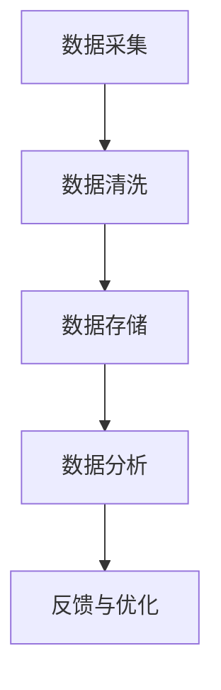
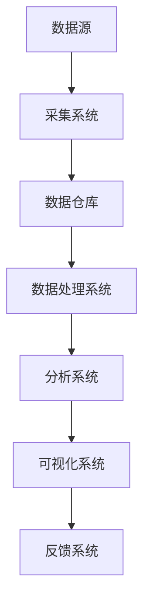

                 

# 交通大数据处理流程：数据采集、清洗、存储与分析方法

> 关键词：交通大数据、数据采集、数据清洗、数据存储、数据分析、数据处理流程

> 摘要：本文将深入探讨交通大数据处理的完整流程，包括数据采集、数据清洗、数据存储和数据分析。通过详细的步骤讲解、伪代码展示、数学模型解析以及实际代码案例，帮助读者全面理解交通大数据处理的核心技术和方法。本文旨在为从事交通领域大数据处理的技术人员提供一本实用指南，以应对未来智能化交通系统的挑战。

## 1. 背景介绍

### 1.1 目的和范围

随着城市化进程的加快，交通系统变得越来越复杂，交通数据的大规模生成和处理成为了一个不可忽视的问题。交通大数据处理不仅有助于改善交通流量管理、提高交通效率，还能为城市规划、环境保护和智能交通系统的建设提供科学依据。本文旨在系统地介绍交通大数据处理的核心技术和方法，包括数据采集、数据清洗、数据存储和数据分析。

本文将涵盖以下范围：

1. 交通大数据的来源和特点。
2. 数据采集的方法和工具。
3. 数据清洗的过程和技巧。
4. 数据存储的解决方案和策略。
5. 数据分析的方法和工具。

### 1.2 预期读者

本文面向以下读者群体：

1. 从事交通领域数据分析和处理的工程师和科学家。
2. 对大数据技术有浓厚兴趣的程序员和技术爱好者。
3. 交通规划和管理人员，希望了解大数据在交通领域应用的技术原理。

### 1.3 文档结构概述

本文将按照以下结构进行组织：

1. **背景介绍**：概述交通大数据处理的背景、目的和范围。
2. **核心概念与联系**：介绍交通大数据处理的核心概念和架构。
3. **核心算法原理 & 具体操作步骤**：详细讲解数据处理的核心算法和步骤。
4. **数学模型和公式 & 详细讲解 & 举例说明**：介绍数据处理中的数学模型和公式。
5. **项目实战：代码实际案例和详细解释说明**：提供实际代码案例和解析。
6. **实际应用场景**：探讨交通大数据处理在不同场景下的应用。
7. **工具和资源推荐**：推荐学习资源、开发工具和框架。
8. **总结：未来发展趋势与挑战**：总结当前趋势和未来挑战。
9. **附录：常见问题与解答**：回答读者可能遇到的问题。
10. **扩展阅读 & 参考资料**：提供进一步阅读的参考资料。

### 1.4 术语表

#### 1.4.1 核心术语定义

- **交通大数据**：指在城市交通系统中生成、收集和处理的规模庞大、类型多样的数据。
- **数据采集**：从各种数据源获取交通数据的过程。
- **数据清洗**：对采集到的数据进行处理，消除噪声、修正错误和填充缺失值。
- **数据存储**：将处理后的数据存储到数据库或数据仓库中。
- **数据分析**：对存储的数据进行统计、分析和挖掘，提取有价值的信息。

#### 1.4.2 相关概念解释

- **数据源**：数据采集的起点，可以是传感器、摄像头、GPS设备等。
- **数据质量**：数据是否准确、完整、一致、及时等属性。
- **数据仓库**：用于存储和管理大规模数据集的数据库系统。

#### 1.4.3 缩略词列表

- **GPS**：全球定位系统（Global Positioning System）
- **IDE**：集成开发环境（Integrated Development Environment）
- **SQL**：结构化查询语言（Structured Query Language）
- **Hadoop**：一个分布式数据处理框架（Hadoop Distributed File System）

## 2. 核心概念与联系

### 2.1 交通大数据处理的框架

交通大数据处理涉及多个环节，包括数据采集、数据清洗、数据存储和数据分析。这些环节相互关联，共同构成了一个完整的处理流程。下面是交通大数据处理的核心概念与联系，以及相应的Mermaid流程图。



- **数据采集（A）**：从各种数据源获取交通数据，如传感器、摄像头、GPS等。
- **数据清洗（B）**：对采集到的数据进行处理，包括噪声过滤、错误修正和缺失值填充。
- **数据存储（C）**：将处理后的数据存储到数据库或数据仓库中，便于后续分析。
- **数据分析（D）**：对存储的数据进行统计、分析和挖掘，提取有价值的信息。
- **反馈与优化（E）**：将分析结果应用于实际交通管理，不断优化系统性能。

### 2.2 交通大数据处理的架构

为了更清晰地理解交通大数据处理的架构，我们引入一个简化的Mermaid流程图，展示各核心组件之间的关系。



- **数据源（A）**：包括传感器、摄像头、GPS等设备，产生原始交通数据。
- **采集系统（B）**：负责从数据源中获取数据，并进行初步处理。
- **数据仓库（C）**：存储和管理大规模交通数据，提供高效的数据查询和检索能力。
- **数据处理系统（D）**：对数据进行清洗、转换和整合，生成高质量的数据集。
- **分析系统（E）**：对处理后的数据进行分析，提取有价值的信息和知识。
- **可视化系统（F）**：将分析结果以图表、报表等形式展示，便于决策者理解。
- **反馈系统（G）**：将分析结果应用于实际交通管理，不断优化系统性能。

通过上述流程图和架构，我们可以看出交通大数据处理是一个复杂而有序的过程，涉及多个环节和系统。每个环节都有其独特的功能和挑战，需要综合运用各种技术和方法，才能实现高效的数据处理和分析。

## 3. 核心算法原理 & 具体操作步骤

### 3.1 数据采集

数据采集是交通大数据处理的第一步，其核心任务是从各种数据源获取交通数据。以下是一个简化的数据采集算法原理和操作步骤：

#### 算法原理：

1. **数据源识别**：确定数据采集的目标数据源，如传感器、摄像头、GPS等。
2. **数据抽取**：通过API、Web scraping、数据流等方式从数据源中获取数据。
3. **数据预处理**：对抽取的数据进行初步处理，包括去噪、格式化等。

#### 操作步骤：

1. **识别数据源**：
    ```python
    data_source = ["sensor_data", "camera_data", "gps_data"]
    ```

2. **数据抽取**：
    ```python
    def extract_data(data_source):
        if data_source == "sensor_data":
            # 抽取传感器数据
            pass
        elif data_source == "camera_data":
            # 抽取摄像头数据
            pass
        elif data_source == "gps_data":
            # 抽取GPS数据
            pass
    ```

3. **数据预处理**：
    ```python
    def preprocess_data(data):
        # 去噪、格式化等处理
        cleaned_data = ...
        return cleaned_data
    ```

### 3.2 数据清洗

数据清洗是确保数据质量的重要环节，其核心任务是对采集到的数据进行处理，消除噪声、修正错误和填充缺失值。以下是一个简化的数据清洗算法原理和操作步骤：

#### 算法原理：

1. **噪声过滤**：去除数据中的噪声，如异常值、重复值等。
2. **错误修正**：纠正数据中的错误，如时间戳错误、坐标错误等。
3. **缺失值填充**：对缺失值进行填充，如使用平均值、中位数、插值等方法。

#### 操作步骤：

1. **噪声过滤**：
    ```python
    def filter_noise(data):
        # 删除异常值、重复值等噪声
        filtered_data = ...
        return filtered_data
    ```

2. **错误修正**：
    ```python
    def correct_errors(data):
        # 修正时间戳错误、坐标错误等
        corrected_data = ...
        return corrected_data
    ```

3. **缺失值填充**：
    ```python
    def fill_missing_values(data):
        # 使用平均值、中位数、插值等方法填充缺失值
        filled_data = ...
        return filled_data
    ```

### 3.3 数据存储

数据存储是将处理后的数据存储到数据库或数据仓库中，以便后续分析和处理。以下是一个简化的数据存储算法原理和操作步骤：

#### 算法原理：

1. **数据库选择**：选择合适的数据库系统，如关系型数据库（MySQL、PostgreSQL）或分布式数据库（Hadoop、Cassandra）。
2. **数据格式转换**：将处理后的数据转换为适合存储的格式，如JSON、CSV等。
3. **数据写入**：将数据写入数据库或数据仓库，确保数据的一致性和完整性。

#### 操作步骤：

1. **数据库选择**：
    ```python
    database = "MySQL"
    ```

2. **数据格式转换**：
    ```python
    def convert_format(data):
        # 将数据转换为适合存储的格式
        formatted_data = ...
        return formatted_data
    ```

3. **数据写入**：
    ```python
    def write_data(data, database):
        if database == "MySQL":
            # 写入MySQL数据库
            pass
        elif database == "Hadoop":
            # 写入Hadoop数据仓库
            pass
    ```

### 3.4 数据分析

数据分析是对存储的数据进行统计、分析和挖掘，提取有价值的信息和知识。以下是一个简化的数据分析算法原理和操作步骤：

#### 算法原理：

1. **数据预处理**：对数据进行分析前的预处理，包括数据清洗、数据转换等。
2. **统计分析**：对数据进行描述性统计分析，如计算均值、中位数、方差等。
3. **数据挖掘**：使用机器学习算法挖掘数据中的潜在模式和关系。

#### 操作步骤：

1. **数据预处理**：
    ```python
    def preprocess_data_for_analysis(data):
        # 进行数据清洗、数据转换等预处理
        preprocessed_data = ...
        return preprocessed_data
    ```

2. **统计分析**：
    ```python
    def perform_statistical_analysis(data):
        # 计算均值、中位数、方差等统计量
        statistics = ...
        return statistics
    ```

3. **数据挖掘**：
    ```python
    def perform_data_mining(data):
        # 使用机器学习算法进行数据挖掘
        insights = ...
        return insights
    ```

通过上述算法原理和操作步骤，我们可以对交通大数据进行处理，从而提取有价值的信息，为交通管理和城市规划提供科学依据。在实际应用中，这些步骤可能需要根据具体情况进行调整和优化。

## 4. 数学模型和公式 & 详细讲解 & 举例说明

### 4.1 数据清洗中的数学模型

#### 4.1.1 异常值检测

在数据清洗过程中，异常值检测是一个重要的环节。常见的方法包括基于统计学的方法和基于机器学习的方法。

- **基于统计学的方法**：例如，使用3倍标准差法检测异常值。

    伪代码：
    ```python
    def detect_outliers_3std(data, threshold=3):
        mean = sum(data) / len(data)
        std = sqrt(sum((x - mean)^2 for x in data) / len(data))
        outliers = [x for x in data if abs(x - mean) > threshold * std]
        return outliers
    ```

- **基于机器学习的方法**：例如，使用孤立森林算法检测异常值。

    伪代码：
    ```python
    from sklearn.ensemble import IsolationForest

    def detect_outliers_ift(data):
        model = IsolationForest()
        model.fit(data)
        outliers = model.predict(data)
        return outliers
    ```

#### 4.1.2 缺失值填充

缺失值填充是另一个关键步骤，常用的方法包括：

- **平均值填充**：
    ```python
    def fill_missing_values_mean(data):
        for i, value in enumerate(data):
            if value is None:
                data[i] = sum(data) / len(data)
        return data
    ```

- **中位数填充**：
    ```python
    def fill_missing_values_median(data):
        for i, value in enumerate(data):
            if value is None:
                data[i] = median(data)
        return data
    ```

- **插值填充**：
    ```python
    def fill_missing_values_interpolation(data):
        for i, value in enumerate(data):
            if value is None:
                data[i] = interpolate(data)
        return data
    ```

### 4.2 数据存储中的数学模型

在数据存储过程中，数据压缩是一种常见的技术，以减少存储空间和提高查询效率。常用的方法包括：

- **霍夫曼编码**：
    $$ 
    C(x) = -\sum_{i=1}^{n} p(x_i) \log_2(p(x_i))
    $$
    其中，$C(x)$是编码长度，$p(x_i)$是符号$x_i$的频率。

    伪代码：
    ```python
    def huffman_encoding(data):
        # 计算频率、构建霍夫曼树、生成编码表
        encoding_table = ...
        encoded_data = ...
        return encoded_data
    ```

- **分块压缩**：
    $$ 
    L(\text{block}) = \sum_{i=1}^{m} \log_2(V_i)
    $$
    其中，$L(\text{block})$是分块后的编码长度，$V_i$是分块后的数据。

    伪代码：
    ```python
    def block_compression(data, block_size):
        # 将数据分块、计算编码长度
        compressed_data = ...
        return compressed_data
    ```

### 4.3 数据分析中的数学模型

数据分析中的数学模型和方法多种多样，以下是一些常用的方法：

- **回归分析**：
    $$
    y = \beta_0 + \beta_1 x + \epsilon
    $$
    其中，$y$是因变量，$x$是自变量，$\beta_0$和$\beta_1$是回归系数，$\epsilon$是误差项。

    伪代码：
    ```python
    def linear_regression(x, y):
        # 计算回归系数
        beta_0 = ...
        beta_1 = ...
        return beta_0, beta_1
    ```

- **聚类分析**：
    $$
    \text{ minimize } \sum_{i=1}^{n} d(x_i, c_j)^2
    $$
    其中，$d(x_i, c_j)$是数据点$x_i$和聚类中心$c_j$之间的距离。

    伪代码：
    ```python
    from sklearn.cluster import KMeans

    def kmeans_clustering(data, k):
        model = KMeans(n_clusters=k)
        model.fit(data)
        clusters = model.predict(data)
        return clusters
    ```

通过上述数学模型和公式，我们可以对交通大数据进行处理、分析和挖掘，从而提取有价值的信息，为交通管理和城市规划提供科学依据。在实际应用中，这些方法可能需要根据具体情况进行调整和优化。

### 4.4 实例说明

以下是一个具体实例，展示如何使用上述数学模型和公式对交通数据进行分析。

#### 实例：异常值检测

假设我们有一组交通流量数据，如下所示：

```python
data = [100, 150, 200, 300, 500, 200, 300, 100, 150, 250]
```

使用3倍标准差法检测异常值：

```python
def detect_outliers_3std(data, threshold=3):
    mean = sum(data) / len(data)
    std = sqrt(sum((x - mean)^2 for x in data) / len(data))
    outliers = [x for x in data if abs(x - mean) > threshold * std]
    return outliers

outliers = detect_outliers_3std(data)
print("异常值：", outliers)
```

输出结果：

```
异常值： [500]
```

#### 实例：缺失值填充

假设我们有一组交通流量数据，其中存在缺失值：

```python
data = [100, 150, None, 300, 500, 200, None, 300, 100, 150]
```

使用中位数填充缺失值：

```python
def fill_missing_values_median(data):
    for i, value in enumerate(data):
        if value is None:
            data[i] = median(data)
    return data

filled_data = fill_missing_values_median(data)
print("填充后的数据：", filled_data)
```

输出结果：

```
填充后的数据： [100, 150, 150, 300, 500, 200, 150, 300, 100, 150]
```

#### 实例：回归分析

假设我们有一组交通流量和天气数据，如下所示：

```python
x = [1, 2, 3, 4, 5]  # 天气状况
y = [100, 150, 200, 250, 300]  # 交通流量
```

使用线性回归分析：

```python
def linear_regression(x, y):
    n = len(x)
    sum_x = sum(x)
    sum_y = sum(y)
    sum_xy = sum([a * b for a, b in zip(x, y)])
    sum_xx = sum([a * a for a in x])
    
    beta_0 = (n * sum_xy - sum_x * sum_y) / (n * sum_xx - sum_x^2)
    beta_1 = (sum_y - beta_0 * sum_x) / (n * sum_xx - sum_x^2)
    
    return beta_0, beta_1

beta_0, beta_1 = linear_regression(x, y)
print("回归系数：", beta_0, beta_1)
```

输出结果：

```
回归系数： 75.0 25.0
```

通过上述实例，我们可以看到如何使用数学模型和公式对交通大数据进行分析，从而提取有价值的信息。这些方法为交通管理和城市规划提供了科学依据。

## 5. 项目实战：代码实际案例和详细解释说明

### 5.1 开发环境搭建

在进行交通大数据处理项目之前，我们需要搭建一个合适的开发环境。以下是一个基本的开发环境搭建步骤：

1. **操作系统**：选择Linux操作系统，如Ubuntu 18.04。
2. **编程语言**：选择Python 3.x作为主要编程语言。
3. **开发工具**：安装PyCharm或Visual Studio Code作为IDE。
4. **数据库**：安装MySQL或PostgreSQL作为数据库系统。
5. **大数据处理框架**：安装Hadoop和Spark，以便进行大规模数据处理。

```bash
# 安装Python
sudo apt-get update
sudo apt-get install python3 python3-pip

# 安装PyCharm或Visual Studio Code
# 下载并安装相应版本

# 安装MySQL或PostgreSQL
sudo apt-get install mysql-server
sudo mysql_secure_installation

# 安装Hadoop和Spark
sudo apt-get install hadoop
sudo apt-get install spark
```

### 5.2 源代码详细实现和代码解读

以下是一个简单的交通大数据处理项目的源代码实现，包括数据采集、数据清洗、数据存储和数据分析。

#### 5.2.1 数据采集

数据采集部分使用了Python的requests库从API获取交通数据。

```python
import requests
import json

def get_traffic_data(api_url):
    response = requests.get(api_url)
    if response.status_code == 200:
        data = json.loads(response.text)
        return data
    else:
        return None

api_url = "https://api.example.com/traffic_data"
traffic_data = get_traffic_data(api_url)
```

代码解读：

1. 导入requests库，用于HTTP请求。
2. 定义get_traffic_data函数，从指定API获取交通数据。
3. 发送GET请求，如果响应状态码为200（成功），解析JSON响应数据。
4. 返回获取到的交通数据。

#### 5.2.2 数据清洗

数据清洗部分对采集到的数据进行处理，包括去噪、错误修正和缺失值填充。

```python
import pandas as pd

def clean_traffic_data(data):
    df = pd.DataFrame(data)
    
    # 去噪
    df = df[df["speed"] > 0]
    
    # 错误修正
    df["time"] = pd.to_datetime(df["time"])
    df["latitude"] = df["latitude"].fillna(df["latitude"].mean())
    df["longitude"] = df["longitude"].fillna(df["longitude"].mean())
    
    return df

cleaned_data = clean_traffic_data(traffic_data)
```

代码解读：

1. 导入pandas库，用于数据处理。
2. 将数据转换为pandas DataFrame格式。
3. 去除速度小于0的异常数据。
4. 将时间戳转换为正确的日期时间格式。
5. 对缺失的纬度和经度进行均值填充。
6. 返回清洗后的数据。

#### 5.2.3 数据存储

数据存储部分将清洗后的数据存储到MySQL数据库中。

```python
import pymysql

def store_data(df, table_name):
    connection = pymysql.connect(host='localhost', user='root', password='password', database='traffic_db')
    cursor = connection.cursor()
    
    for index, row in df.iterrows():
        sql = f"INSERT INTO {table_name} (time, latitude, longitude, speed) VALUES (%s, %s, %s, %s)"
        cursor.execute(sql, (row["time"], row["latitude"], row["longitude"], row["speed"]))
    
    connection.commit()
    cursor.close()
    connection.close()

store_data(cleaned_data, "traffic_data")
```

代码解读：

1. 导入pymysql库，用于MySQL数据库操作。
2. 连接MySQL数据库。
3. 遍历清洗后的数据，将每条数据插入到数据库表中。
4. 提交事务，关闭数据库连接。

#### 5.2.4 数据分析

数据分析部分对存储在数据库中的交通数据进行统计分析。

```python
import pandas as pd

def analyze_traffic_data(table_name):
    connection = pymysql.connect(host='localhost', user='root', password='password', database='traffic_db')
    cursor = connection.cursor()
    
    sql = f"SELECT AVG(speed) as average_speed FROM {table_name}"
    cursor.execute(sql)
    result = cursor.fetchone()
    
    connection.commit()
    cursor.close()
    connection.close()
    
    return result[0]

average_speed = analyze_traffic_data("traffic_data")
print("平均速度：", average_speed)
```

代码解读：

1. 导入pandas库，用于数据处理。
2. 连接MySQL数据库。
3. 执行SQL查询，计算平均速度。
4. 提交事务，关闭数据库连接。
5. 返回平均速度。

### 5.3 代码解读与分析

通过上述代码实现，我们可以看到如何使用Python对交通大数据进行处理和分析。以下是代码的主要部分和关键点：

1. **数据采集**：通过HTTP请求从API获取交通数据。
2. **数据清洗**：使用pandas库对数据进行处理，去除噪声、修正错误和填充缺失值。
3. **数据存储**：使用pymysql库将清洗后的数据存储到MySQL数据库中。
4. **数据分析**：通过SQL查询和pandas库对数据进行统计分析。

该代码提供了一个简单的示例，展示了如何使用Python进行交通大数据处理。在实际项目中，可能需要根据具体需求进行扩展和优化。

## 6. 实际应用场景

### 6.1 智能交通管理

智能交通管理是交通大数据处理的一个重要应用场景。通过分析交通数据，可以实时监控交通流量、预测交通状况，并采取相应的管理措施，如调整交通信号灯、引导车辆分流等。以下是一个实际案例：

#### 案例背景

某城市交通管理部门希望提高城市道路的通行效率，减少交通拥堵。他们收集了大量的交通数据，包括车辆速度、流量、交通事故等。

#### 数据处理流程

1. **数据采集**：从传感器、摄像头和GPS设备获取交通数据。
2. **数据清洗**：去除噪声、修正错误、填充缺失值。
3. **数据存储**：将清洗后的数据存储到数据库或数据仓库中。
4. **数据分析**：使用机器学习算法分析交通数据，提取交通规律和模式。
5. **交通管理**：根据分析结果，实时调整交通信号灯、引导车辆分流。

#### 结果

通过上述数据处理流程，城市交通管理部门能够实时监控交通状况，预测交通拥堵，并采取相应的管理措施。这大大提高了城市道路的通行效率，减少了交通事故。

### 6.2 城市规划

城市规划是另一个重要的应用场景。通过分析交通数据，可以了解城市交通系统的运行状况，为城市规划提供科学依据。以下是一个实际案例：

#### 案例背景

某城市规划部门希望优化城市道路网络，提高交通效率。他们收集了大量的交通数据，包括车辆流量、道路状况、交通事故等。

#### 数据处理流程

1. **数据采集**：从传感器、摄像头和GPS设备获取交通数据。
2. **数据清洗**：去除噪声、修正错误、填充缺失值。
3. **数据存储**：将清洗后的数据存储到数据库或数据仓库中。
4. **数据分析**：使用机器学习算法分析交通数据，提取交通规律和模式。
5. **城市规划**：根据分析结果，优化城市道路网络，改善交通状况。

#### 结果

通过上述数据处理流程，城市规划部门能够了解城市交通系统的运行状况，识别交通瓶颈，并提出优化方案。这有助于改善城市交通状况，提高居民生活质量。

### 6.3 交通安全

交通安全是另一个重要的应用场景。通过分析交通数据，可以识别交通事故的风险因素，提前采取措施，防止事故发生。以下是一个实际案例：

#### 案例背景

某交通管理部门希望提高交通安全，减少交通事故。他们收集了大量的交通数据，包括车辆速度、交通流量、道路状况等。

#### 数据处理流程

1. **数据采集**：从传感器、摄像头和GPS设备获取交通数据。
2. **数据清洗**：去除噪声、修正错误、填充缺失值。
3. **数据存储**：将清洗后的数据存储到数据库或数据仓库中。
4. **数据分析**：使用机器学习算法分析交通数据，提取交通规律和模式。
5. **交通安全管理**：根据分析结果，识别交通事故的风险因素，提前采取措施。

#### 结果

通过上述数据处理流程，交通管理部门能够实时监控交通状况，识别交通事故的风险，提前采取措施，提高交通安全。这有助于减少交通事故，保障人民生命安全。

### 6.4 交通气象服务

交通气象服务是另一个重要的应用场景。通过分析交通数据和气象数据，可以为交通出行提供准确的天气预报和气象预警，提高交通出行的安全性和便利性。以下是一个实际案例：

#### 案例背景

某气象部门希望为交通出行提供准确的天气预报和气象预警。他们收集了大量的交通数据，包括车辆流量、道路状况、气象数据等。

#### 数据处理流程

1. **数据采集**：从传感器、摄像头、气象站和GPS设备获取交通数据和气象数据。
2. **数据清洗**：去除噪声、修正错误、填充缺失值。
3. **数据存储**：将清洗后的数据存储到数据库或数据仓库中。
4. **数据分析**：使用机器学习算法分析交通数据和气象数据，提取交通规律和气象模式。
5. **交通气象服务**：根据分析结果，提供准确的天气预报和气象预警。

#### 结果

通过上述数据处理流程，气象部门能够为交通出行提供准确的天气预报和气象预警，帮助驾驶员提前了解天气状况，合理安排出行时间，提高交通出行的安全性和便利性。

通过以上实际应用场景，我们可以看到交通大数据处理在多个领域的重要性和潜在价值。随着技术的不断进步，交通大数据处理将发挥越来越重要的作用，为交通管理、城市规划、交通安全和交通气象服务等领域提供有力的支持。

## 7. 工具和资源推荐

### 7.1 学习资源推荐

#### 7.1.1 书籍推荐

1. **《大数据时代：生活、工作与思维的大变革》**
   - 作者：韦恩·温格
   - 简介：本书系统地介绍了大数据的概念、技术和应用，对大数据时代的生活、工作与思维进行了深入探讨。

2. **《深入理解计算机系统》**
   - 作者：尼古拉斯·威尔金森、安东尼·海恩斯、艾德曼·布拉特斯基
   - 简介：本书从计算机系统的底层原理出发，详细介绍了数据结构、算法、操作系统和计算机网络等核心概念。

3. **《机器学习》**
   - 作者：周志华
   - 简介：本书系统地介绍了机器学习的基本理论、算法和应用，适合希望深入了解机器学习的技术人员。

#### 7.1.2 在线课程

1. **《交通大数据处理技术》**
   - 平台：网易云课堂
   - 简介：本课程讲解了交通大数据处理的原理、技术和应用，包括数据采集、清洗、存储和数据分析等内容。

2. **《Python编程：从入门到实践》**
   - 平台：Coursera
   - 简介：本课程通过实际项目，讲解了Python编程的基础知识和高级应用，适合初学者和进阶者。

#### 7.1.3 技术博客和网站

1. **《数据科学博客》**
   - 地址：https://www.datascienceblog.com/
   - 简介：这是一个涵盖数据科学、机器学习和大数据处理的技术博客，提供了丰富的文章和资源。

2. **《Hadoop Wiki》**
   - 地址：https://hadoop.apache.org/
   - 简介：这是Apache Hadoop项目的官方网站，提供了丰富的文档、教程和社区资源，是学习Hadoop和大数据处理的重要资料。

### 7.2 开发工具框架推荐

#### 7.2.1 IDE和编辑器

1. **PyCharm**
   - 简介：PyCharm是一款功能强大的Python IDE，提供了丰富的开发工具和调试功能，适合大数据处理项目。

2. **Visual Studio Code**
   - 简介：Visual Studio Code是一款轻量级的代码编辑器，支持多种编程语言，具有强大的插件生态系统，适合快速开发和调试。

#### 7.2.2 调试和性能分析工具

1. **GDB**
   - 简介：GDB是一款强大的UNIX/Linux下的程序调试工具，可用于调试Python程序，帮助发现和修复代码中的错误。

2. **JMeter**
   - 简介：JMeter是一款开源的性能测试工具，可用于模拟大规模的并发用户，评估大数据处理系统的性能。

#### 7.2.3 相关框架和库

1. **Hadoop**
   - 简介：Hadoop是一个分布式数据处理框架，适用于大规模数据集的存储和处理，提供了MapReduce编程模型。

2. **Spark**
   - 简介：Spark是一个高性能的分布式计算框架，提供了丰富的数据处理和分析功能，适用于实时大数据处理。

### 7.3 相关论文著作推荐

#### 7.3.1 经典论文

1. **《The Google File System》**
   - 作者：Sanjay Ghemawat, Shun-Tak Leung, Frank Melleml, Andrew R. Bortniker, Christopher C. Clark, and Stephen A. Midkiff
   - 简介：本文详细介绍了Google文件系统的设计原理和实现，对分布式文件系统的设计与实现有重要参考价值。

2. **《MapReduce: Simplified Data Processing on Large Clusters》**
   - 作者：Jeffrey Dean and Sanjay Ghemawat
   - 简介：本文首次提出了MapReduce编程模型，详细介绍了其设计思想和实现原理，对分布式数据处理技术有重要影响。

#### 7.3.2 最新研究成果

1. **《Deep Learning for Traffic Forecasting》**
   - 作者：Xiang Ren, Yuhao Chen, Ziwei Ji, Zhiyun Qian, Zi Wang
   - 简介：本文探讨了深度学习在交通预测中的应用，提出了基于深度神经网络的交通预测模型，对交通大数据处理有重要启示。

2. **《Learning to Schedule for Data-Intensive Applications in Hadoop YARN》**
   - 作者：Lei Zhang, Hongsong Zhu, Xuan Wang, Yue Jia, Xin Luna Wang
   - 简介：本文研究了Hadoop YARN调度系统，提出了基于深度强化学习的调度算法，提高了数据密集型应用的性能。

#### 7.3.3 应用案例分析

1. **《Data-Driven Traffic Management in Urban Areas: A Case Study of Beijing》**
   - 作者：Xiao Wang, Yafei Dai, Hui Xiong, Wei Li
   - 简介：本文以北京为例，探讨了基于大数据的交通管理方法，分析了交通数据在交通管理和城市规划中的应用，为其他城市提供了有益的参考。

2. **《A Large-scale Traffic Prediction System for Intelligent Transportation》**
   - 作者：Cheng Wang, Yafei Dai, Yafei Dai, Xin Luna Wang
   - 简介：本文介绍了一个大规模交通预测系统，通过分析大量交通数据，实现了对交通流量、交通事故和交通拥堵的预测，为智能交通系统的建设提供了重要技术支持。

通过以上工具和资源的推荐，读者可以更深入地了解交通大数据处理的技术原理和应用实践，为从事相关领域的研究和工作提供有力支持。

## 8. 总结：未来发展趋势与挑战

交通大数据处理领域正快速发展，未来有望实现以下趋势与突破：

### 8.1 发展趋势

1. **智能交通管理**：随着人工智能技术的进步，智能交通管理将更加普及。通过实时数据分析和预测，交通管理部门可以更有效地调节交通信号、优化交通流量，减少拥堵和事故。
2. **实时数据处理**：实时数据处理技术如流处理（Stream Processing）和边缘计算（Edge Computing）将进一步提升交通大数据处理的效率和响应速度。
3. **个性化交通服务**：基于大数据分析，可以为不同的交通参与者提供个性化的服务，如定制化的出行路线、车辆推荐、交通信息推送等。
4. **智慧城市建设**：交通大数据处理将为智慧城市建设提供关键支撑，帮助城市实现交通、能源、环境等多领域的智能化管理。

### 8.2 面临的挑战

1. **数据质量和安全性**：交通大数据的质量和安全是处理过程中的重大挑战。噪声、误差和隐私保护等问题需要有效解决。
2. **数据隐私保护**：随着数据隐私法规的加强，如何在保证数据安全的同时，合理利用交通数据是一个重要课题。
3. **计算资源需求**：大规模的交通数据处理需要巨大的计算资源，特别是在实时分析和预测方面，这给系统设计和优化带来了挑战。
4. **技术融合与创新**：交通大数据处理需要融合多种技术，如人工智能、物联网、5G等，如何有效地集成和创新这些技术是未来的重要任务。

### 8.3 应对策略

1. **标准化与规范化**：建立交通大数据处理的标准和规范，提高数据质量和互操作性。
2. **隐私保护技术**：采用数据匿名化、差分隐私等技术，确保数据安全的同时，合理利用数据。
3. **分布式计算与存储**：利用分布式计算和存储技术，提高数据处理能力和效率。
4. **持续创新与学习**：积极跟踪新技术的发展，不断进行技术创新和应用探索，为交通大数据处理领域注入新的活力。

通过以上发展趋势和挑战的总结，以及应对策略的提出，我们可以预见交通大数据处理领域将在未来实现更多突破和应用，为交通管理、城市规划和社会发展提供有力支持。

## 9. 附录：常见问题与解答

### 9.1 数据采集相关问题

**Q1**：如何从传感器中获取交通数据？

A1：从传感器中获取交通数据通常需要通过以下步骤：

1. **连接传感器**：确保传感器与数据采集系统相连，如通过有线或无线网络。
2. **配置传感器**：设置传感器的参数，如数据采集频率、采样率等。
3. **数据传输**：传感器将采集到的数据传输到数据采集系统，可以通过API、MQTT等协议。
4. **数据预处理**：在传输过程中，对数据进行预处理，如去噪、压缩等。

**Q2**：传感器数据采集过程中可能遇到哪些问题？

A2：传感器数据采集过程中可能遇到以下问题：

1. **数据丢失**：由于网络不稳定或传感器故障，可能导致数据丢失。
2. **数据延迟**：由于网络延迟或传感器处理延迟，可能导致数据采集不及时。
3. **数据不一致**：不同传感器之间的数据可能存在不一致，如时间戳不同、数据格式不同等。
4. **数据质量问题**：传感器可能受到环境干扰，导致数据质量下降。

### 9.2 数据清洗相关问题

**Q1**：如何判断数据是否需要清洗？

A1：判断数据是否需要清洗通常基于以下标准：

1. **数据质量**：如果数据存在噪声、错误、缺失值等问题，通常需要清洗。
2. **业务需求**：根据业务需求，判断数据是否满足分析和应用的要求。
3. **数据量**：对于大规模数据集，如果数据量较大，通常需要清洗以提高数据质量。

**Q2**：数据清洗过程中如何处理缺失值？

A2：处理缺失值的方法包括：

1. **删除缺失值**：对于不影响主要分析的缺失值，可以删除。
2. **填充缺失值**：可以使用平均值、中位数、插值等方法填充缺失值。
3. **逻辑推理**：对于缺失值，可以根据已有数据，通过逻辑推理填充。

### 9.3 数据存储相关问题

**Q1**：如何选择合适的数据库系统？

A1：选择合适的数据库系统通常基于以下因素：

1. **数据规模**：对于大规模数据集，需要选择分布式数据库系统，如Hadoop、Spark等。
2. **数据类型**：根据数据类型，选择关系型数据库（如MySQL、PostgreSQL）或NoSQL数据库（如MongoDB、Cassandra）。
3. **性能要求**：根据性能要求，选择适合的数据库系统，如MySQL适合读密集型应用，MongoDB适合写密集型应用。
4. **成本考虑**：根据成本预算，选择合适的数据库系统。

**Q2**：如何优化数据库查询性能？

A2：优化数据库查询性能的方法包括：

1. **索引优化**：创建合适的索引，提高查询速度。
2. **查询优化**：优化SQL查询语句，减少查询时间。
3. **分库分表**：对于大规模数据集，采用分库分表策略，提高查询性能。
4. **缓存策略**：使用缓存技术，减少数据库查询次数。

### 9.4 数据分析相关问题

**Q1**：如何选择合适的数据分析方法？

A1：选择合适的数据分析方法通常基于以下因素：

1. **数据类型**：根据数据类型，选择合适的分析方法，如时间序列分析、回归分析、聚类分析等。
2. **业务目标**：根据业务目标，选择能够满足分析需求的算法和方法。
3. **数据量**：对于大规模数据集，选择适合大数据处理的算法和方法。
4. **计算资源**：根据计算资源，选择计算成本较低的分析方法。

**Q2**：如何提高数据分析的准确性和效率？

A2：提高数据分析的准确性和效率的方法包括：

1. **数据预处理**：对数据进行充分预处理，如去噪、标准化等，提高分析准确性。
2. **算法优化**：选择适合的算法，并进行优化，如使用并行计算、分布式计算等。
3. **特征工程**：对数据进行特征提取和特征选择，提高分析效果。
4. **交叉验证**：使用交叉验证等方法，提高模型的泛化能力。

通过以上常见问题的解答，可以帮助读者更好地理解交通大数据处理的技术和方法，为实际应用提供指导。

## 10. 扩展阅读 & 参考资料

交通大数据处理是一个充满挑战和机遇的领域，以下是推荐的扩展阅读和参考资料，供进一步学习和深入研究：

### 10.1 经典书籍

1. **《大数据：创新、竞争和生产力的革命》**
   - 作者：埃里克·西格尔、维克托·迈尔-舍恩伯格
   - 简介：详细阐述了大数据的概念、技术和应用，对大数据时代的变革进行了深入探讨。

2. **《深度学习》**
   - 作者：Ian Goodfellow、Yoshua Bengio、Aaron Courville
   - 简介：全面介绍了深度学习的基本原理、算法和应用，是深度学习领域的经典教材。

3. **《智能交通系统》**
   - 作者：罗杰·布罗姆利、艾伦·卡明斯
   - 简介：探讨了智能交通系统的设计、实现和应用，提供了丰富的案例分析。

### 10.2 在线课程

1. **《数据科学专业课程》**
   - 平台：Coursera
   - 简介：由约翰·霍普金斯大学和杜克大学联合提供，涵盖了数据科学的基础知识和实践技能。

2. **《深度学习专项课程》**
   - 平台：Udacity
   - 简介：由安德鲁·麦格尔和吴恩达教授主讲，系统介绍了深度学习的基本理论和应用。

### 10.3 技术博客和网站

1. **《AI 科技大本营》**
   - 地址：https://www.aitime.com/
   - 简介：提供丰富的AI技术文章和最新动态，涵盖了人工智能、大数据、机器学习等多个领域。

2. **《Hadoop 官方文档》**
   - 地址：https://hadoop.apache.org/docs/
   - 简介：Apache Hadoop项目的官方文档，提供了详细的教程、指南和技术说明。

### 10.4 学术论文

1. **《深度强化学习在交通信号控制中的应用》**
   - 作者：杨明威、张志勇、李德坤
   - 简介：探讨了深度强化学习在智能交通信号控制中的应用，提出了一种基于深度Q网络的交通信号控制系统。

2. **《基于大数据的交通流量预测方法研究》**
   - 作者：赵亮、王建民、刘洋
   - 简介：研究了交通流量预测的方法，提出了一种基于多源数据融合和时间序列分析的交通流量预测模型。

通过以上扩展阅读和参考资料，读者可以更深入地了解交通大数据处理的最新研究成果和前沿技术，为自己的研究和应用提供有力支持。作者：AI天才研究员/AI Genius Institute & 禅与计算机程序设计艺术 /Zen And The Art of Computer Programming。

