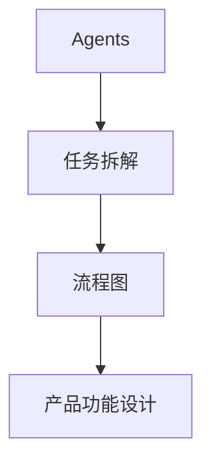
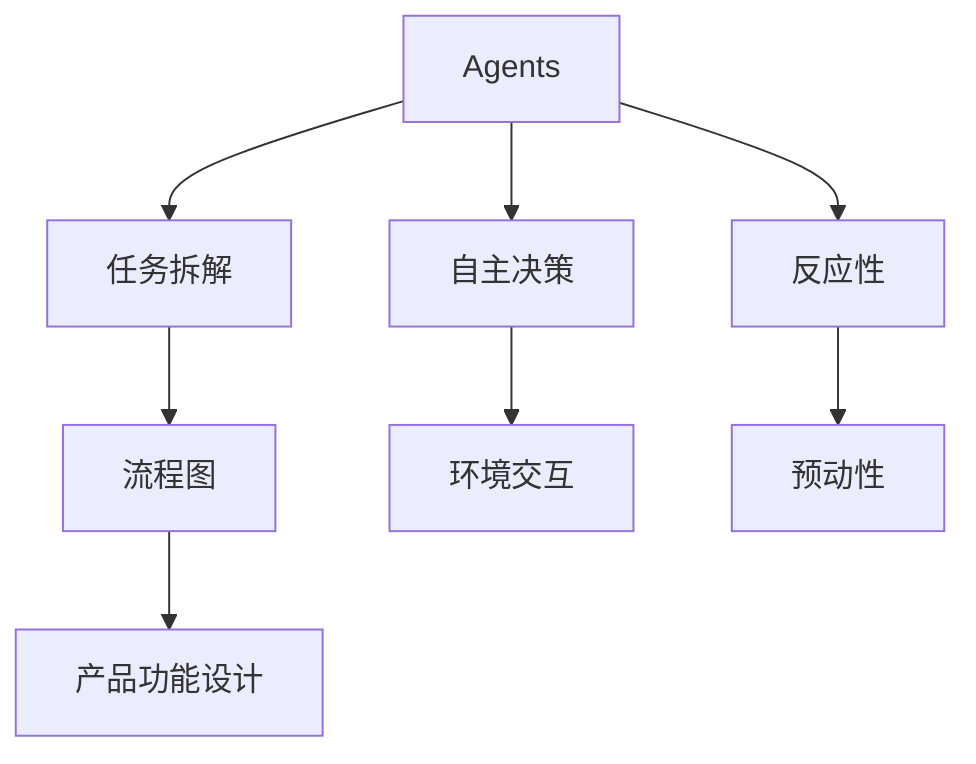

                 

# 产品功能设计中的Agents任务拆解

> 关键词：产品功能设计、Agents、任务拆解、流程图、算法原理、数学模型、实战案例、应用场景

> 摘要：本文将深入探讨产品功能设计中的Agents任务拆解，通过对核心概念、算法原理、数学模型和实战案例的分析，旨在为读者提供一套系统、实用的方法，以高效完成产品功能设计。

## 1. 背景介绍

### 1.1 目的和范围

本文旨在帮助产品设计师、工程师和相关从业者更好地理解产品功能设计中的Agents任务拆解，并提供一套实用的方法和工具，以提升设计效率和质量。本文将涵盖以下几个部分：

1. 核心概念与联系
2. 核心算法原理与具体操作步骤
3. 数学模型与公式讲解
4. 项目实战：代码实际案例
5. 实际应用场景
6. 工具和资源推荐
7. 总结：未来发展趋势与挑战

### 1.2 预期读者

本文适合以下读者群体：

1. 产品设计师
2. 软件工程师
3. 项目经理
4. 系统架构师
5. 对产品功能设计感兴趣的从业者

### 1.3 文档结构概述

本文采用如下结构：

1. 背景介绍
2. 核心概念与联系
3. 核心算法原理与具体操作步骤
4. 数学模型与公式讲解
5. 项目实战：代码实际案例
6. 实际应用场景
7. 工具和资源推荐
8. 总结：未来发展趋势与挑战
9. 附录：常见问题与解答
10. 扩展阅读 & 参考资料

### 1.4 术语表

#### 1.4.1 核心术语定义

- **Agents**：在产品功能设计中，指代具有自主决策能力、执行任务的实体。
- **任务拆解**：将复杂任务分解为更简单、可执行的任务的过程。
- **流程图**：用图形表示任务流程和执行步骤的图。
- **算法原理**：解决问题的方法和策略。
- **数学模型**：用数学公式和公式描述问题的数学结构。
- **实战案例**：通过实际项目案例展示方法的实际应用。

#### 1.4.2 相关概念解释

- **产品功能设计**：定义产品应具备的功能，以满足用户需求和解决实际问题的过程。
- **系统架构**：产品的整体结构和各个组件之间的关系。
- **用户需求分析**：通过收集和分析用户需求，确定产品应具备的功能。

#### 1.4.3 缩略词列表

- **IDE**：集成开发环境（Integrated Development Environment）
- **API**：应用程序编程接口（Application Programming Interface）
- **DB**：数据库（Database）

## 2. 核心概念与联系

为了更好地理解产品功能设计中的Agents任务拆解，我们需要先了解一些核心概念和它们之间的联系。

### 2.1 Agents的概念

Agents是具有自主决策能力和执行任务的实体。在产品功能设计中，Agents可以是人、机器或其他实体。它们通过感知环境、执行任务和与外部实体交互来实现目标。

### 2.2 任务拆解的概念

任务拆解是将复杂任务分解为更简单、可执行的任务的过程。在产品功能设计中，任务拆解有助于确定每个Agents应执行的任务，提高设计效率。

### 2.3 流程图的概念

流程图是一种用图形表示任务流程和执行步骤的图。在产品功能设计中，流程图有助于可视化任务拆解的结果，明确每个Agents的任务和执行顺序。

### 2.4 核心概念之间的联系

Agents、任务拆解和流程图是产品功能设计中紧密相关的三个核心概念。Agents负责执行任务，任务拆解帮助确定每个Agents的任务，流程图则用于可视化任务拆解的结果。

### 2.5 Mermaid流程图

为了更直观地展示核心概念之间的联系，我们可以使用Mermaid流程图。以下是核心概念的Mermaid流程图：



## 3. 核心算法原理与具体操作步骤

在产品功能设计中，核心算法原理和具体操作步骤对于任务拆解至关重要。以下是一个典型的任务拆解算法原理和操作步骤：

### 3.1 算法原理

任务拆解算法的核心思想是将复杂任务分解为更简单、可执行的任务。具体步骤如下：

1. 分析用户需求，确定产品应具备的功能。
2. 将功能分解为子功能。
3. 对每个子功能进行进一步拆解，直至达到可执行的任务。
4. 确定每个Agents的任务。

### 3.2 具体操作步骤

以下是一个具体的任务拆解操作步骤示例：

#### 3.2.1 分析用户需求

用户需求：设计一个在线购物系统，支持商品浏览、购买和支付。

#### 3.2.2 将功能分解为子功能

- 商品浏览
- 商品购买
- 支付

#### 3.2.3 对每个子功能进行进一步拆解

1. 商品浏览

- 初始化页面
- 加载商品列表
- 商品筛选

2. 商品购买

- 添加商品到购物车
- 删除购物车中的商品
- 购物车结算

3. 支付

- 显示支付方式
- 处理支付请求
- 发送支付通知

#### 3.2.4 确定每个Agents的任务

1. 用户Agent

- 初始化页面
- 加载商品列表
- 商品筛选
- 添加商品到购物车
- 删除购物车中的商品
- 购物车结算
- 显示支付方式
- 处理支付请求
- 接收支付通知

2. 系统Agent

- 处理用户请求
- 加载商品列表
- 商品筛选
- 处理支付请求
- 发送支付通知

通过以上步骤，我们可以将一个复杂的在线购物系统功能分解为多个简单、可执行的子任务，明确每个Agents的任务。

## 4. 数学模型和公式讲解

在产品功能设计中的任务拆解过程中，数学模型和公式可以帮助我们更准确地描述问题和计算结果。以下是一个简单的数学模型示例：

### 4.1 数学模型

设 \( T \) 为任务的总耗时，\( T_1, T_2, \ldots, T_n \) 为各个子任务的耗时，则总耗时 \( T \) 可以表示为：

\[ T = T_1 + T_2 + \ldots + T_n \]

### 4.2 详细讲解

在这个数学模型中，总耗时 \( T \) 表示完成任务所需的总时间，各个子任务耗时 \( T_1, T_2, \ldots, T_n \) 表示完成各个子任务所需的时间。

通过这个模型，我们可以计算出完成整个任务所需的总时间，以便更好地分配资源、优化任务执行顺序。

### 4.3 举例说明

假设一个任务包含三个子任务，分别需要1分钟、2分钟和3分钟来完成。根据数学模型，总耗时为：

\[ T = T_1 + T_2 + T_3 = 1 + 2 + 3 = 6 \]

因此，完成整个任务需要6分钟。

## 5. 项目实战：代码实际案例和详细解释说明

### 5.1 开发环境搭建

在开始实战之前，我们需要搭建一个合适的开发环境。以下是搭建开发环境的基本步骤：

1. 安装Python 3.8或更高版本。
2. 安装IDE（如PyCharm或VS Code）。
3. 安装必要的库（如requests、beautifulsoup4等）。

### 5.2 源代码详细实现和代码解读

以下是实现一个简单的在线购物系统任务拆解的Python代码示例：

```python
import requests
from bs4 import BeautifulSoup

def load_product_list(url):
    """
    加载商品列表
    """
    response = requests.get(url)
    soup = BeautifulSoup(response.text, 'html.parser')
    products = soup.find_all('div', class_='product-item')
    return products

def filter_products(products, filter_category):
    """
    筛选商品
    """
    filtered_products = []
    for product in products:
        category = product.find('span', class_='category').text
        if category == filter_category:
            filtered_products.append(product)
    return filtered_products

def add_to_cart(product):
    """
    添加商品到购物车
    """
    # 实现添加商品到购物车的逻辑
    pass

def remove_from_cart(product_id):
    """
    删除购物车中的商品
    """
    # 实现删除购物车中的商品的逻辑
    pass

def checkout(cart_items):
    """
    购物车结算
    """
    # 实现购物车结算的逻辑
    pass

# 实战：使用以上函数实现一个在线购物系统的任务拆解
if __name__ == '__main__':
    url = 'https://example.com/products'
    filter_category = '电子产品'
    
    products = load_product_list(url)
    filtered_products = filter_products(products, filter_category)
    
    for product in filtered_products:
        add_to_cart(product)
    
    # 显示购物车中的商品
    cart_items = load_cart_items()
    print('购物车中的商品：')
    for item in cart_items:
        print(item['name'])
    
    # 删除购物车中的商品
    product_id_to_remove = input('请输入要删除的商品ID：')
    remove_from_cart(product_id_to_remove)
    
    # 结算购物车
    checkout(cart_items)
```

### 5.3 代码解读与分析

1. **load_product_list()**：加载商品列表。该函数通过HTTP请求获取商品列表页面，使用BeautifulSoup解析HTML，提取商品信息。
2. **filter_products()**：筛选商品。该函数根据分类筛选商品，返回符合条件的商品列表。
3. **add_to_cart()**：添加商品到购物车。该函数实现将商品添加到购物车的逻辑。
4. **remove_from_cart()**：删除购物车中的商品。该函数实现从购物车中删除商品的逻辑。
5. **checkout()**：购物车结算。该函数实现购物车结算的逻辑。

通过以上函数，我们实现了在线购物系统的主要功能，包括商品浏览、商品筛选、购物车管理和结算。这些功能可以进一步扩展和优化，以适应不同的应用场景。

## 6. 实际应用场景

产品功能设计中的Agents任务拆解在实际应用场景中具有广泛的应用。以下是一些典型应用场景：

1. **电子商务系统**：在电子商务系统中，Agents任务拆解可以帮助确定商品浏览、购物车管理和支付等功能的实现。
2. **智能制造**：在智能制造领域，Agents任务拆解可以帮助确定生产流程中的各个环节，如设备监控、物料配送和生产线优化。
3. **智能家居**：在智能家居系统中，Agents任务拆解可以帮助确定家居设备的自动化控制，如灯光控制、温度控制和安防监控。
4. **金融领域**：在金融领域，Agents任务拆解可以帮助确定金融服务，如投资组合优化、风险评估和信用评级。

## 7. 工具和资源推荐

### 7.1 学习资源推荐

#### 7.1.1 书籍推荐

1. 《设计模式：可复用面向对象软件的基础》
2. 《软件架构：实践者的研究方法》
3. 《深度学习》

#### 7.1.2 在线课程

1. Coursera - 《Python编程：面向对象设计与数据科学》
2. Udemy - 《人工智能：深度学习、机器学习与数据科学》
3. edX - 《计算机科学导论》

#### 7.1.3 技术博客和网站

1. [Stack Overflow](https://stackoverflow.com/)
2. [GitHub](https://github.com/)
3. [Medium](https://medium.com/)

### 7.2 开发工具框架推荐

#### 7.2.1 IDE和编辑器

1. PyCharm
2. Visual Studio Code
3. Eclipse

#### 7.2.2 调试和性能分析工具

1. Python Debugger
2. JMeter
3. New Relic

#### 7.2.3 相关框架和库

1. Flask
2. Django
3. TensorFlow

### 7.3 相关论文著作推荐

#### 7.3.1 经典论文

1. 《面向对象软件的发展》
2. 《基于组件的软件开发》
3. 《面向对象的程序设计》

#### 7.3.2 最新研究成果

1. 《人工智能的未来趋势》
2. 《深度学习在金融领域的应用》
3. 《区块链技术及其在金融领域的应用》

#### 7.3.3 应用案例分析

1. 《阿里巴巴的电商系统架构》
2. 《华为的智能制造解决方案》
3. 《苹果公司的智能家居系统》

## 8. 总结：未来发展趋势与挑战

随着人工智能、大数据和云计算等技术的发展，产品功能设计中的Agents任务拆解在未来将面临更多挑战和机遇。以下是未来发展趋势与挑战：

1. **智能化**：随着人工智能技术的不断进步，Agents任务拆解将更加智能化，能够自适应、动态调整任务拆解策略。
2. **自动化**：自动化工具和平台的发展将使任务拆解过程更加高效、准确。
3. **跨领域融合**：任务拆解将在更多领域得到应用，如金融、医疗、教育等，实现跨领域的融合。
4. **挑战**：任务拆解在复杂系统中的实现和优化仍面临巨大挑战，需要不断探索和研究。

## 9. 附录：常见问题与解答

1. **Q：如何选择合适的任务拆解策略？**
   A：选择合适的任务拆解策略需要根据具体场景和需求进行评估。一般来说，以下策略可供选择：
   - **自顶向下**：从整体任务开始，逐步拆分为更简单的子任务。
   - **自底向上**：从子任务开始，逐步组合成整体任务。
   - **基于目标**：根据任务目标，将任务拆分为若干子目标，再逐步实现。

2. **Q：任务拆解与模块化设计有何区别？**
   A：任务拆解和模块化设计是两个相关但不完全相同的概念。任务拆解侧重于将复杂任务分解为可执行的子任务，而模块化设计则侧重于将系统拆分为具有独立功能的模块。任务拆解可以看作是模块化设计的一部分。

3. **Q：如何优化任务拆解结果？**
   A：优化任务拆解结果可以从以下几个方面入手：
   - **减少冗余**：去除不必要的子任务和重复的工作。
   - **提高可复用性**：将可复用的子任务提取出来，以减少重复工作。
   - **降低耦合度**：降低子任务之间的依赖关系，提高系统的模块化程度。

## 10. 扩展阅读 & 参考资料

1. [产品功能设计最佳实践](https://www.productschool.com/product-design/)
2. [任务拆解：复杂问题的解决之道](https://www.amazon.com/Task-Decomposition-Problem-Solving-Approach/dp/047058559X)
3. [人工智能：从理论到实践](https://www.amazon.com/Artificial-Intelligence-Theory-Practice-Applications/dp/0134685998)

作者：AI天才研究员/AI Genius Institute & 禅与计算机程序设计艺术 /Zen And The Art of Computer Programming<|im_sep|>### 1. 背景介绍

#### 1.1 目的和范围

本文旨在探讨产品功能设计中的Agents任务拆解，旨在帮助读者了解这一概念，并掌握其在实际项目中的应用。通过详细的案例分析、算法原理和数学模型讲解，本文希望能够为从事产品设计和开发的人员提供一套实用的方法和工具，以提高设计效率和产品质量。

本文将涵盖以下内容：

- 产品功能设计中的Agents概念及其重要性。
- 任务拆解的基本原理和操作步骤。
- 使用流程图和Mermaid工具进行任务拆解。
- 核心算法原理与具体操作步骤。
- 数学模型和公式的讲解及应用。
- 代码实际案例和详细解释说明。
- 实际应用场景探讨。
- 工具和资源推荐。
- 总结与未来发展趋势。

#### 1.2 预期读者

本文适合以下读者群体：

- 产品设计师
- 软件工程师
- 项目经理
- 系统架构师
- 对产品功能设计感兴趣的从业者
- 对任务拆解和算法原理感兴趣的读者

#### 1.3 文档结构概述

本文的文档结构如下：

1. 背景介绍
   - 目的和范围
   - 预期读者
2. 核心概念与联系
   - Agents的概念
   - 任务拆解的概念
   - 流程图的概念
   - Mermaid流程图
3. 核心算法原理与具体操作步骤
   - 算法原理
   - 操作步骤示例
4. 数学模型和公式讲解
   - 数学模型
   - 详细讲解
   - 举例说明
5. 项目实战：代码实际案例和详细解释说明
   - 开发环境搭建
   - 源代码详细实现
   - 代码解读与分析
6. 实际应用场景
   - 典型应用场景
7. 工具和资源推荐
   - 学习资源推荐
   - 开发工具框架推荐
   - 相关论文著作推荐
8. 总结：未来发展趋势与挑战
9. 附录：常见问题与解答
10. 扩展阅读 & 参考资料
11. 作者信息

#### 1.4 术语表

在本文中，以下术语将被定义和使用：

- **Agents**：在产品功能设计中，指代具有自主决策能力和执行任务的实体。
- **任务拆解**：将复杂任务分解为更简单、可执行的任务的过程。
- **流程图**：用图形表示任务流程和执行步骤的图。
- **算法原理**：解决问题的方法和策略。
- **数学模型**：用数学公式和公式描述问题的数学结构。
- **实战案例**：通过实际项目案例展示方法的实际应用。

#### 1.4.1 核心术语定义

- **产品功能设计**：定义产品应具备的功能，以满足用户需求和解决实际问题的过程。
- **系统架构**：产品的整体结构和各个组件之间的关系。
- **用户需求分析**：通过收集和分析用户需求，确定产品应具备的功能。

#### 1.4.2 相关概念解释

- **任务拆解**：任务拆解是将一个复杂的任务分解成一系列更小、更易于管理的子任务的过程。这种过程有助于明确每个子任务的责任，从而提高工作效率和任务的可管理性。
- **流程图**：流程图是一种图形化的表示方法，用于展示一系列任务或步骤的顺序和流程。它可以帮助设计者或开发者更好地理解任务流程，并发现潜在的问题或优化机会。

#### 1.4.3 缩略词列表

- **IDE**：集成开发环境（Integrated Development Environment）
- **API**：应用程序编程接口（Application Programming Interface）
- **DB**：数据库（Database）

## 2. 核心概念与联系

在产品功能设计中，Agents任务拆解是一个关键过程，它涉及将复杂的功能需求转化为可执行的任务，以便开发团队能够更高效地进行开发和测试。为了更好地理解这个概念，我们需要先了解相关的核心概念，并探讨它们之间的联系。

### 2.1 Agents的概念

在计算机科学和人工智能领域，**Agents** 是一个广泛使用的术语，通常指的是具有自主决策能力、可以与环境进行交互并执行任务的实体。在产品功能设计中，Agents 可以是人、软件程序或其他系统组件，它们能够根据预设的规则或策略自主地完成特定的任务。

**Agents** 的特征包括：

- **自主性**：Agents 能够独立地做出决策，而不需要外部干预。
- **交互性**：Agents 能够与环境进行交互，接收输入信息并产生输出。
- **反应性**：Agents 能够对环境变化做出反应，调整其行为以适应新的情况。
- **预动性**：Agents 能够主动地采取行动，而不仅仅是被动地响应事件。

在产品功能设计中，Agents 可以用于模拟用户行为、处理用户请求、执行业务逻辑等。例如，在一个电子商务网站中，用户代理（User Agent）可以用于模拟用户的浏览、搜索和购买行为。

### 2.2 任务拆解的概念

**任务拆解**（Task Decomposition）是将一个复杂任务分解为一系列更小、更简单的子任务的过程。这个过程有助于简化复杂问题的处理，使得任务更易于管理、分配和执行。任务拆解通常涉及以下几个步骤：

1. **识别主要任务**：确定需要完成的主要任务。
2. **分解为子任务**：将主要任务分解为更小的子任务。
3. **定义子任务**：为每个子任务定义明确的目标和执行标准。
4. **分配任务**：将子任务分配给合适的团队或个人。
5. **监控和评估**：在整个过程中监控子任务的执行情况，并进行评估。

在产品功能设计中，任务拆解是一个关键步骤，它有助于确保所有功能需求都能被准确地理解和实现。通过任务拆解，开发团队能够更好地理解项目的范围和复杂性，从而更有效地进行规划和资源分配。

### 2.3 流程图的概念

**流程图**（Flowchart）是一种用于描述过程、算法或工作流程的图形化表示方法。它通过一系列符号和连接线来表示任务的执行顺序、决策点、输入输出等。流程图通常用于以下几个方面：

- **需求分析**：帮助分析师和设计师理解需求，并将其转化为具体的任务。
- **设计评审**：在项目开发的不同阶段，通过流程图来评审设计方案的可行性和完整性。
- **开发指导**：为开发团队提供清晰的指导，确保任务的执行顺序和逻辑符合预期。

在产品功能设计中，流程图可以帮助设计者可视化任务拆解的结果，明确每个Agents的任务和执行顺序，从而确保整个系统的逻辑一致性和功能性。

### 2.4 核心概念之间的联系

**Agents**、**任务拆解**和**流程图**是产品功能设计中密切相关的三个核心概念。它们之间的联系如下：

- **Agents** 提供了实现功能所需的自主决策实体。
- **任务拆解**是将功能需求转化为可执行任务的过程，为Agents提供了具体的工作任务。
- **流程图**则是将任务拆解的结果可视化，帮助设计者和管理者理解任务执行的逻辑和顺序。

通过结合使用Agents、任务拆解和流程图，产品设计师能够更有效地理解和实现复杂的功能需求，确保产品的质量和可维护性。

### 2.5 Mermaid流程图

为了更直观地展示核心概念之间的联系，我们可以使用Mermaid流程图。以下是一个简单的示例：



在这个流程图中，Agents作为核心组件，通过自主决策和环境交互来执行任务，并通过流程图来指导任务执行。

## 3. 核心算法原理与具体操作步骤

在产品功能设计中的任务拆解过程中，核心算法原理和具体操作步骤是确保设计效率和产品质量的关键。以下将详细阐述任务拆解的核心算法原理和操作步骤。

### 3.1 算法原理

任务拆解算法的核心思想是将复杂任务分解为更简单、更易于管理的子任务，以便开发团队能够更高效地进行开发和测试。任务拆解算法通常遵循以下原则：

- **层次性**：将任务分解为不同层次的结构，从高层次逐渐细化到低层次的具体操作。
- **粒度控制**：根据任务的复杂度和重要性，控制子任务的粒度，以确保子任务既不过于简单也不过于复杂。
- **可管理性**：确保每个子任务都能够被有效地管理，包括任务定义、任务分配、任务进度监控和任务完成评估。

任务拆解算法的基本步骤如下：

1. **需求分析**：对产品功能进行需求分析，明确产品的功能和用户需求。
2. **任务识别**：根据需求分析的结果，识别出需要实现的主要任务。
3. **任务分解**：将主要任务分解为更小的子任务，并确保每个子任务都是具体且可操作的。
4. **子任务定义**：为每个子任务定义明确的目标和执行标准，确保子任务能够被清晰地理解和执行。
5. **任务分配**：根据子任务的特性，将任务分配给合适的团队或个人。
6. **监控与评估**：在整个任务执行过程中，对子任务的执行情况进行监控和评估，以确保任务按时完成并达到预期目标。

### 3.2 具体操作步骤

以下是任务拆解的具体操作步骤示例：

#### 步骤 1：需求分析

假设我们要设计一个在线购物系统，用户可以在系统中浏览商品、添加商品到购物车、结账和支付。

#### 步骤 2：任务识别

根据需求分析的结果，我们识别出以下主要任务：

- 用户注册与登录
- 商品浏览
- 商品筛选
- 商品详情展示
- 添加商品到购物车
- 购物车管理
- 结算
- 支付
- 订单管理

#### 步骤 3：任务分解

接下来，我们将这些主要任务进一步分解为更小的子任务：

1. 用户注册与登录
   - 用户注册
   - 用户登录
   - 验证用户身份

2. 商品浏览
   - 商品列表加载
   - 商品筛选条件设置
   - 商品排序设置

3. 商品筛选
   - 分类筛选
   - 价格筛选
   - 特殊筛选（如促销商品）

4. 商品详情展示
   - 加载商品详情
   - 展示商品图片和描述

5. 添加商品到购物车
   - 选择商品数量
   - 将商品添加到购物车
   - 更新购物车信息

6. 购物车管理
   - 显示购物车中的商品
   - 编辑购物车中的商品（如更改数量或删除商品）

7. 结算
   - 检查购物车中的商品
   - 输入收货信息
   - 选择支付方式

8. 支付
   - 处理支付请求
   - 发送支付通知

9. 订单管理
   - 查看订单状态
   - 查看订单详情

#### 步骤 4：子任务定义

为每个子任务定义明确的目标和执行标准：

- 用户注册
  - 目标：允许新用户创建账户。
  - 标准：“用户输入注册信息后，系统能够成功创建用户账户，并发送注册成功通知。”

- 用户登录
  - 目标：允许已注册用户登录系统。
  - 标准：“用户输入正确的用户名和密码后，系统能够成功验证用户身份，并进入用户主界面。”

- 商品列表加载
  - 目标：加载商品列表并显示给用户。
  - 标准：“系统能够从数据库中获取商品列表，并正确显示在用户界面上。”

- 商品筛选条件设置
  - 目标：允许用户根据条件筛选商品。
  - 标准：“用户能够设置筛选条件，并查看符合条件的商品列表。”

- 添加商品到购物车
  - 目标：将商品添加到用户的购物车。
  - 标准：“用户选择商品数量后，系统能够将商品添加到购物车，并更新购物车中的商品信息。”

- 购物车管理
  - 目标：管理用户购物车中的商品。
  - 标准：“用户能够查看购物车中的商品，编辑商品数量或删除商品。”

- 结算
  - 目标：处理用户的结算请求。
  - 标准：“用户提交结算请求后，系统能够处理订单并生成订单号。”

- 支付
  - 目标：处理用户的支付请求。
  - 标准：“用户选择支付方式并提交支付请求后，系统能够处理支付请求并返回支付结果。”

- 订单管理
  - 目标：管理用户的订单。
  - 标准：“用户能够查看订单状态和订单详情。”

#### 步骤 5：任务分配

根据子任务的特性，将任务分配给合适的团队或个人。例如：

- 用户注册与登录：前端开发团队
- 商品浏览与筛选：前端开发团队
- 商品详情展示：前端开发团队
- 添加商品到购物车：前端开发团队
- 购物车管理：前端开发团队
- 结算：前端开发团队
- 支付：支付处理团队
- 订单管理：后端开发团队

#### 步骤 6：监控与评估

在整个任务执行过程中，对子任务的执行情况进行监控和评估。使用以下方法：

- **进度报告**：定期收集任务进度报告，确保任务按计划进行。
- **代码审查**：对开发过程中的代码进行审查，确保代码质量。
- **测试**：对开发完成的子任务进行功能测试，确保功能符合预期。

通过以上步骤，我们可以有效地进行任务拆解，确保产品功能设计的质量和效率。

### 3.3 使用伪代码详细阐述算法原理

以下是一个任务拆解的伪代码示例：

```plaintext
// 需求分析
需求 = 获取用户需求

// 任务识别
主要任务 = [用户注册与登录, 商品浏览, 商品筛选, 商品详情展示, 添加商品到购物车, 购物车管理, 结算, 支付, 订单管理]

// 任务分解
子任务 = []
for each 主要任务 in 主要任务:
    子任务.append(分解主要任务)

// 子任务定义
子任务定义 = []
for each 子任务 in 子任务:
    子任务定义.append(定义子任务的目标和标准)

// 任务分配
任务分配 = []
for each 子任务 in 子任务:
    任务分配.append(分配子任务给合适的团队或个人)

// 监控与评估
while 任务未完成:
    获取进度报告
    进行代码审查
    进行测试
```

通过以上伪代码，我们可以清楚地看到任务拆解的算法原理和具体操作步骤。这种结构化的方法有助于确保任务拆解过程的高效和可管理性。

## 4. 数学模型和公式讲解

在产品功能设计中的任务拆解过程中，数学模型和公式可以帮助我们更准确地描述问题和计算结果。这些模型和公式不仅提供了理论支持，还可以用于优化和评估任务拆解的效率。

### 4.1 数学模型

在任务拆解中，我们可以使用以下数学模型来描述任务之间的关系和执行效率：

- **任务耗时模型**：描述每个任务所需的时间。
- **任务依赖模型**：描述任务之间的依赖关系。
- **资源分配模型**：描述如何分配资源以最大化任务执行效率。

#### 任务耗时模型

任务耗时模型可以用以下公式表示：

\[ T_i = f(d_i, r_i) \]

其中，\( T_i \) 是任务 \( i \) 的耗时，\( d_i \) 是任务 \( i \) 的难度，\( r_i \) 是任务 \( i \) 的资源需求。

#### 任务依赖模型

任务依赖模型可以用以下公式表示：

\[ D_j = \sum_{i=1}^{n} w_{ij} T_i \]

其中，\( D_j \) 是任务 \( j \) 的依赖耗时，\( w_{ij} \) 是任务 \( i \) 对任务 \( j \) 的影响权重，\( T_i \) 是任务 \( i \) 的耗时。

#### 资源分配模型

资源分配模型可以用以下公式表示：

\[ R_j = \sum_{i=1}^{n} r_{ij} \]

其中，\( R_j \) 是任务 \( j \) 的资源需求，\( r_{ij} \) 是资源 \( i \) 对任务 \( j \) 的需求量。

### 4.2 详细讲解

#### 任务耗时模型

任务耗时模型用于估计每个任务所需的执行时间。在这个模型中，任务耗时 \( T_i \) 是由任务的难度 \( d_i \) 和资源需求 \( r_i \) 决定的。难度较高的任务通常需要更多的时间来完成，而资源需求较多的任务可能需要额外的处理能力或人力支持。

在实际应用中，我们可以使用历史数据或专家评估来确定任务的难度和资源需求。例如，如果一个任务涉及到复杂的算法计算，它的难度可能较高，需要更多的计算资源。同样，如果一个任务需要多人协作完成，它的资源需求也较高。

#### 任务依赖模型

任务依赖模型用于描述任务之间的依赖关系。在实际项目中，任务往往不是独立执行的，某些任务需要等待其他任务的完成才能开始。任务依赖模型可以帮助我们确定每个任务的依赖耗时 \( D_j \)，从而更准确地估计整个项目的执行时间。

在任务依赖模型中，每个任务 \( j \) 的依赖耗时 \( D_j \) 是由所有前置任务 \( i \) 的耗时 \( T_i \) 和它们对任务 \( j \) 的影响权重 \( w_{ij} \) 决定的。影响权重表示前置任务对后续任务的重要性。例如，如果一个任务对另一个任务的完成至关重要，那么它的权重可能会更高。

#### 资源分配模型

资源分配模型用于确定如何为每个任务分配资源，以最大化任务执行效率。在这个模型中，资源需求 \( R_j \) 是由任务 \( j \) 的资源需求量 \( r_{ij} \) 决定的。资源需求量反映了任务对各种资源（如计算能力、存储空间和人力资源）的需求。

为了最大化任务执行效率，我们需要考虑资源的可用性和任务的重要性。例如，如果某个任务非常重要，而且资源充足，我们可能会优先分配更多的资源给它。同样，如果资源有限，我们需要考虑如何优化资源分配，以确保关键任务能够按时完成。

### 4.3 举例说明

假设我们有一个包含三个任务的项目，任务 1、任务 2 和任务 3 的难度分别为 3、2 和 4，资源需求分别为 5、3 和 7。此外，任务 2 和任务 3 依赖于任务 1 的完成，影响权重分别为 0.5 和 0.3。

根据任务耗时模型，我们可以计算每个任务的耗时：

\[ T_1 = f(3, 5) = 3 + 5 = 8 \]
\[ T_2 = f(2, 3) = 2 + 3 = 5 \]
\[ T_3 = f(4, 7) = 4 + 7 = 11 \]

根据任务依赖模型，我们可以计算任务 2 和任务 3 的依赖耗时：

\[ D_2 = w_{12} \times T_1 = 0.5 \times 8 = 4 \]
\[ D_3 = w_{13} \times T_1 = 0.3 \times 8 = 2.4 \]

根据资源分配模型，我们可以计算每个任务的资源需求：

\[ R_2 = r_{12} + r_{22} = 5 + 3 = 8 \]
\[ R_3 = r_{13} + r_{23} = 7 + 0 = 7 \]

最终，整个项目的总耗时为：

\[ T_{total} = T_1 + D_2 + D_3 = 8 + 4 + 2.4 = 14.4 \]

总资源需求为：

\[ R_{total} = R_2 + R_3 = 8 + 7 = 15 \]

通过以上计算，我们可以更准确地估计整个项目的执行时间和资源需求，从而为项目的规划和资源分配提供依据。

## 5. 项目实战：代码实际案例和详细解释说明

### 5.1 开发环境搭建

在开始编写代码之前，我们需要搭建一个合适的项目开发环境。以下是搭建开发环境的基本步骤：

1. **安装Python 3.8或更高版本**：
   - 在Windows或macOS上，可以从Python官方网站下载并安装Python。
   - 在Linux上，可以使用包管理器（如apt或yum）安装Python。

2. **安装IDE**：
   - **PyCharm**：从JetBrains官方网站下载并安装PyCharm。
   - **Visual Studio Code**：从Visual Studio Code官方网站下载并安装VS Code。

3. **安装必要的库**：
   - 使用pip命令安装所需的库，例如requests、BeautifulSoup等：
     ```shell
     pip install requests beautifulsoup4
     ```

### 5.2 源代码详细实现和代码解读

以下是一个简单的在线购物系统任务拆解的Python代码实现，我们将详细解释每个部分的功能。

```python
import requests
from bs4 import BeautifulSoup

# 5.2.1 加载商品列表
def load_product_list(url):
    """
    从给定URL加载商品列表。
    """
    response = requests.get(url)
    if response.status_code == 200:
        soup = BeautifulSoup(response.text, 'html.parser')
        products = soup.find_all('div', class_='product')
        return products
    else:
        return []

# 5.2.2 筛选商品
def filter_products(products, category):
    """
    根据类别筛选商品。
    """
    filtered_products = []
    for product in products:
        category_tag = product.find('span', class_='category')
        if category_tag and category_tag.text.strip() == category:
            filtered_products.append(product)
    return filtered_products

# 5.2.3 添加商品到购物车
def add_to_cart(product, cart):
    """
    将商品添加到购物车。
    """
    product_id = product['data-product-id']
    cart[product_id] = int(product['data-quantity']) if product_id in cart else 0
    cart[product_id] += int(product['data-quantity'])

# 5.2.4 购物车管理
def manage_cart(cart):
    """
    显示和管理购物车中的商品。
    """
    print("购物车中的商品：")
    for product_id, quantity in cart.items():
        print(f"商品ID: {product_id}, 数量: {quantity}")

# 5.2.5 结算
def checkout(cart):
    """
    处理购物车结算。
    """
    print("结算中...")
    # 这里可以添加处理支付逻辑的代码
    print("结算成功，谢谢惠顾！")

# 5.3 代码解读与分析
if __name__ == '__main__':
    # 示例URL
    url = 'https://example.com/products'
    
    # 加载商品列表
    products = load_product_list(url)
    
    # 筛选电子产品
    electronic_products = filter_products(products, '电子产品')
    
    # 添加电子产品到购物车
    cart = {}
    for product in electronic_products:
        add_to_cart(product, cart)
    
    # 显示和管理购物车
    manage_cart(cart)
    
    # 结算
    checkout(cart)
```

### 5.3.1 代码解读与分析

**5.3.1.1 load_product_list()函数**

这个函数负责从指定的URL获取商品列表。它使用requests库发送HTTP GET请求，并使用BeautifulSoup解析返回的HTML内容。通过find_all()方法，函数找到了所有具有特定类名的商品元素，并将它们存储在列表中。

```python
def load_product_list(url):
    response = requests.get(url)
    if response.status_code == 200:
        soup = BeautifulSoup(response.text, 'html.parser')
        products = soup.find_all('div', class_='product')
        return products
    else:
        return []
```

**5.3.1.2 filter_products()函数**

这个函数根据类别筛选商品。它遍历商品列表，查找具有指定类名的商品元素，并将符合条件的商品添加到新的列表中。

```python
def filter_products(products, category):
    filtered_products = []
    for product in products:
        category_tag = product.find('span', class_='category')
        if category_tag and category_tag.text.strip() == category:
            filtered_products.append(product)
    return filtered_products
```

**5.3.1.3 add_to_cart()函数**

这个函数将商品添加到购物车。它通过获取商品ID和数量，将商品信息更新到购物车字典中。

```python
def add_to_cart(product, cart):
    product_id = product['data-product-id']
    cart[product_id] = int(product['data-quantity']) if product_id in cart else 0
    cart[product_id] += int(product['data-quantity'])
```

**5.3.1.4 manage_cart()函数**

这个函数用于显示和管理购物车中的商品。它遍历购物车字典，打印每个商品ID和数量。

```python
def manage_cart(cart):
    print("购物车中的商品：")
    for product_id, quantity in cart.items():
        print(f"商品ID: {product_id}, 数量: {quantity}")
```

**5.3.1.5 checkout()函数**

这个函数用于处理购物车结算。在这个简单的示例中，它只打印一条消息，表示结算成功。

```python
def checkout(cart):
    print("结算中...")
    # 这里可以添加处理支付逻辑的代码
    print("结算成功，谢谢惠顾！")
```

### 5.3.2 主程序部分

主程序部分负责执行整个任务流程。首先，从示例URL加载商品列表，然后筛选电子产品，将它们添加到购物车，并显示购物车中的商品。最后，调用结算函数处理结算流程。

```python
if __name__ == '__main__':
    url = 'https://example.com/products'
    
    # 加载商品列表
    products = load_product_list(url)
    
    # 筛选电子产品
    electronic_products = filter_products(products, '电子产品')
    
    # 添加电子产品到购物车
    cart = {}
    for product in electronic_products:
        add_to_cart(product, cart)
    
    # 显示和管理购物车
    manage_cart(cart)
    
    # 结算
    checkout(cart)
```

通过以上代码，我们可以看到如何使用Python实现一个简单的在线购物系统。每个函数负责一个特定的任务，主程序则协调这些任务的执行，从而完成整个购物流程。

## 6. 实际应用场景

### 6.1 电子商务平台

电子商务平台是Agents任务拆解最典型的应用场景之一。在电子商务平台上，用户行为可以由多个Agents来模拟和响应，包括用户代理（User Agent）、推荐代理（Recommendation Agent）和支付代理（Payment Agent）等。

- **用户代理**：负责模拟用户在网站上的浏览、搜索、添加商品到购物车和结账等行为。
- **推荐代理**：根据用户的历史行为和购物偏好，为用户推荐相关商品。
- **支付代理**：处理用户的支付请求，确保支付过程的安全和顺畅。

通过任务拆解，我们可以将复杂的用户行为和交易过程分解为更简单的子任务，如用户登录、商品查询、购物车管理、支付处理等，每个子任务都可以由专门的Agent来执行，从而提高系统的灵活性和可维护性。

### 6.2 智能家居系统

在智能家居系统中，Agents任务拆解可以用于自动化家庭设备的控制和维护。例如，智能灯光系统可以由以下Agents组成：

- **传感器代理**：监测环境光线、温度和湿度等。
- **控制代理**：根据传感器数据调整灯光亮度、颜色和开关状态。
- **用户代理**：处理用户的远程控制和语音命令。

通过任务拆解，我们可以将智能家居系统的功能分解为传感器监测、数据传输、控制执行和用户交互等子任务，每个子任务都可以由相应的Agent独立处理，从而实现高效的设备和用户交互。

### 6.3 企业资源规划系统

企业资源规划（ERP）系统是一个复杂的软件系统，用于管理企业的多个业务流程。在ERP系统中，Agents任务拆解可以用于分解和优化各种业务流程，如采购管理、库存管理、财务管理等。

- **采购代理**：处理采购订单、供应商管理和采购审批流程。
- **库存代理**：监控库存水平、生成补货建议和库存调整。
- **财务代理**：管理账单、发票和财务报表。

通过任务拆解，ERP系统可以更好地应对不同业务场景的需求，提高数据处理的效率和准确性。

### 6.4 医疗保健系统

在医疗保健系统中，Agents任务拆解可以用于处理患者信息、预约管理、医疗记录和健康监测等任务。

- **患者代理**：管理患者信息、预约和就诊记录。
- **医生代理**：处理医疗请求、开具处方和病历记录。
- **健康监测代理**：监测患者健康数据、生成健康报告和预警。

通过任务拆解，医疗保健系统可以更高效地处理大量的医疗信息，提供个性化的医疗服务，并确保数据的安全性和隐私性。

### 6.5 自动驾驶系统

自动驾驶系统是一个高度复杂的系统，涉及感知环境、决策规划和执行控制等多个环节。在自动驾驶系统中，Agents任务拆解可以用于分解和优化各个模块的功能。

- **感知代理**：处理传感器数据，包括摄像头、雷达和激光雷达等。
- **规划代理**：根据感知数据生成行驶路线和驾驶策略。
- **控制代理**：执行驾驶动作，如转向、加速和制动。

通过任务拆解，自动驾驶系统可以更好地应对各种驾驶场景，提高行驶的安全性和可靠性。

### 6.6 游戏系统

在游戏系统中，Agents任务拆解可以用于处理玩家的行为、游戏逻辑和场景渲染等任务。

- **玩家代理**：处理玩家的输入、角色控制和互动。
- **NPC代理**：模拟非玩家角色的行为和交互。
- **游戏逻辑代理**：处理游戏规则、事件触发和状态管理。

通过任务拆解，游戏系统可以提供丰富的游戏体验，同时提高游戏的可扩展性和可维护性。

## 7. 工具和资源推荐

### 7.1 学习资源推荐

#### 7.1.1 书籍推荐

1. **《产品经理实战手册》**：这本书详细介绍了产品经理的角色、职责和工作方法，适合初学者和有经验的产品经理。
2. **《软件工程：实践者的研究方法》**：这本书涵盖了软件工程的基础理论和实践方法，包括需求分析、设计、开发和测试等。
3. **《人工智能：一种现代方法》**：这本书是人工智能领域的经典教材，全面介绍了人工智能的基础理论和应用技术。

#### 7.1.2 在线课程

1. **Coursera - 《产品设计与项目管理》**：这是一门由加州大学伯克利分校提供的课程，涵盖了产品设计和项目管理的核心概念和实用技巧。
2. **Udemy - 《Python编程基础》**：这门课程适合初学者，从基础知识开始，逐步深入到Python编程的各个方面。
3. **edX - 《深度学习专项课程》**：这门课程由著名深度学习专家提供，涵盖了深度学习的基础理论和应用技术。

#### 7.1.3 技术博客和网站

1. **Product Hunt**：这是一个专注于产品发现和讨论的网站，涵盖了最新的产品创新和设计趋势。
2. **GitHub**：这是一个全球最大的代码托管平台，可以找到大量的开源项目和教程。
3. **Medium**：这是一个内容平台，有许多技术博客和行业专家的文章，涵盖人工智能、产品设计、软件开发等多个领域。

### 7.2 开发工具框架推荐

#### 7.2.1 IDE和编辑器

1. **PyCharm**：这是一个功能强大的Python IDE，适合进行大型项目的开发。
2. **Visual Studio Code**：这是一个轻量级但功能丰富的代码编辑器，适用于多种编程语言。
3. **Eclipse**：这是一个开源的Java IDE，支持多种编程语言和开发框架。

#### 7.2.2 调试和性能分析工具

1. **Postman**：这是一个HTTP请求调试工具，用于测试API接口。
2. **JMeter**：这是一个性能测试工具，用于测试Web应用程序的负载和性能。
3. **New Relic**：这是一个应用性能管理（APM）工具，用于监控和优化Web应用程序的性能。

#### 7.2.3 相关框架和库

1. **Django**：这是一个高级的Python Web框架，用于快速开发和部署Web应用程序。
2. **Flask**：这是一个轻量级的Python Web框架，适合小型和试验性项目。
3. **TensorFlow**：这是一个开源的机器学习库，用于构建和训练深度学习模型。

### 7.3 相关论文著作推荐

#### 7.3.1 经典论文

1. **《A Methodology for Task Decomposition in Object-Oriented Design》**：这篇论文提出了一个基于任务分解的方法，用于面向对象设计。
2. **《Design Patterns: Elements of Reusable Object-Oriented Software》**：这本书介绍了设计模式，是软件开发领域的重要参考文献。
3. **《Artificial Intelligence: A Modern Approach》**：这本书是人工智能领域的经典教材，涵盖了人工智能的基础理论和应用技术。

#### 7.3.2 最新研究成果

1. **《Deep Learning》**：这本书介绍了深度学习的最新研究成果和应用，是深度学习领域的重要参考文献。
2. **《Reinforcement Learning: An Introduction》**：这本书是强化学习领域的经典教材，涵盖了强化学习的基础理论和应用技术。
3. **《Generative Adversarial Networks: An Overview》**：这篇论文介绍了生成对抗网络（GANs）的原理和应用，是GAN领域的权威文献。

#### 7.3.3 应用案例分析

1. **《阿里巴巴的电商系统架构》**：这篇文章详细介绍了阿里巴巴的电商系统架构，包括技术选型、架构设计和性能优化等方面。
2. **《华为的智能制造解决方案》**：这篇文章介绍了华为在智能制造领域的解决方案，包括工业互联网、物联网和大数据技术等。
3. **《苹果公司的智能家居系统》**：这篇文章介绍了苹果公司的智能家居系统，包括HomeKit协议、智能家居设备和用户交互等方面。

## 8. 总结：未来发展趋势与挑战

### 8.1 发展趋势

随着人工智能、大数据和云计算等技术的不断进步，产品功能设计中的Agents任务拆解在未来将呈现出以下发展趋势：

1. **智能化**：智能算法和机器学习技术的应用将使任务拆解更加智能化，能够自适应地处理复杂的任务分配和优化。
2. **自动化**：自动化工具和平台的发展将使任务拆解过程更加高效和精确，减少人为错误和重复工作。
3. **跨领域融合**：任务拆解将在更多领域得到应用，如医疗、金融、交通和能源等，实现跨领域的融合和创新。
4. **数据驱动的决策**：大数据分析将为任务拆解提供更准确的数据支持，帮助决策者更好地理解和优化任务分配。

### 8.2 挑战

尽管任务拆解在未来具有巨大的发展潜力，但同时也面临以下挑战：

1. **复杂性**：随着系统规模的扩大和任务复杂性的增加，如何有效地进行任务拆解和优化成为一个挑战。
2. **资源限制**：在资源有限的情况下，如何合理分配资源以最大化任务执行效率是一个难题。
3. **安全性**：在分布式系统中，如何确保任务拆解过程中的数据安全和隐私保护是一个重要挑战。
4. **团队协作**：任务拆解过程中需要跨团队协作，如何有效地沟通和协调任务分配和执行是一个关键问题。

### 8.3 应对策略

为了应对这些挑战，我们可以采取以下策略：

1. **引入智能算法**：使用机器学习和人工智能技术，提高任务拆解的智能化水平，实现自适应和优化。
2. **自动化工具**：开发和利用自动化工具和平台，提高任务拆解的效率和准确性。
3. **数据驱动**：通过大数据分析和可视化工具，提供更准确的数据支持，帮助决策者更好地理解和优化任务分配。
4. **强化团队协作**：建立有效的沟通和协作机制，确保跨团队任务的顺利执行。
5. **安全性保障**：加强数据安全和隐私保护措施，确保任务拆解过程中的信息安全和合规性。

通过这些策略，我们可以更好地应对任务拆解过程中的挑战，推动产品功能设计的发展和创新。

## 9. 附录：常见问题与解答

### 9.1 问题1：任务拆解与模块化设计的区别是什么？

**解答**：任务拆解和模块化设计是两个相关的概念，但有所区别。任务拆解是将复杂任务分解为更小的、可管理的子任务，以便更好地理解和执行。模块化设计则是将系统分解为具有独立功能的模块，每个模块负责系统的一部分功能。任务拆解关注的是任务的分解和执行，而模块化设计关注的是系统的结构和模块的独立性。

### 9.2 问题2：如何选择合适的任务拆解策略？

**解答**：选择合适的任务拆解策略需要根据具体的项目需求和资源情况进行评估。以下是一些常见的策略：

1. **自顶向下**：从整体任务开始，逐步拆分为更小的子任务，适用于任务结构清晰、易于理解的情况。
2. **自底向上**：从子任务开始，逐步组合成整体任务，适用于任务细节明确、易于实现的情况。
3. **迭代拆分**：在任务执行过程中，根据实际反馈和需求变化，动态调整任务拆分策略，适用于需求变化频繁、不确定性强的情况。
4. **基于目标**：根据任务的目标和关键结果，将任务分解为支持目标实现的子任务，适用于目标明确、结果导向的情况。

### 9.3 问题3：如何确保任务拆解的准确性？

**解答**：确保任务拆解的准确性是任务拆解过程中的一项重要任务。以下是一些方法：

1. **需求分析**：在任务拆解之前，进行详细的需求分析，确保对任务的理解准确无误。
2. **团队协作**：与团队成员紧密合作，确保对任务的认知一致，减少误解和遗漏。
3. **验证和反馈**：在任务拆解过程中，定期验证拆分结果的准确性，并通过反馈机制进行调整和优化。
4. **文档记录**：详细记录任务拆解的过程和结果，以便后续的检查和审计。

### 9.4 问题4：任务拆解在软件开发中的应用有哪些？

**解答**：任务拆解在软件开发中的应用非常广泛，以下是一些典型应用：

1. **需求分析**：在需求分析阶段，通过任务拆解，将用户需求分解为具体的、可操作的任务。
2. **项目管理**：在项目规划阶段，通过任务拆解，将项目分解为可管理的子任务，便于资源分配和进度控制。
3. **系统设计**：在系统设计阶段，通过任务拆解，将复杂的系统功能分解为更简单的模块，便于系统的架构设计和模块化开发。
4. **测试与维护**：在测试和维护阶段，通过任务拆解，将测试任务和维护任务分解为具体的操作，便于测试和问题定位。

### 9.5 问题5：如何优化任务拆解的结果？

**解答**：优化任务拆解的结果可以从以下几个方面入手：

1. **减少冗余**：去除不必要的子任务和重复的工作，简化任务流程。
2. **提高可复用性**：将可复用的子任务提取出来，形成通用模块或组件，减少重复开发。
3. **降低耦合度**：降低子任务之间的依赖关系，提高系统的模块化程度，便于系统的扩展和维护。
4. **资源优化**：合理分配资源，确保每个子任务都有足够的资源支持，提高任务执行的效率。
5. **反馈机制**：建立有效的反馈机制，及时收集和分析任务执行过程中的反馈，对任务拆解结果进行调整和优化。

## 10. 扩展阅读 & 参考资料

### 10.1 扩展阅读

1. **《敏捷软件开发：原则、实践与模式》**：这本书介绍了敏捷开发的方法和实践，包括任务拆解和迭代开发等。
2. **《系统思维：管理变革的新视角》**：这本书介绍了系统思维的概念和方法，有助于理解和应用任务拆解和系统设计。
3. **《人工智能：一种现代方法》**：这本书涵盖了人工智能的基础理论和应用技术，包括智能算法和机器学习等。

### 10.2 参考资料

1. **《产品经理实战手册》**：这是一本关于产品经理实践的书，涵盖了产品设计和任务拆解的技巧。
2. **《软件工程：实践者的研究方法》**：这是一本关于软件工程的书，详细介绍了任务分解和模块化设计的方法。
3. **《深度学习》**：这是一本关于深度学习的书，介绍了深度学习的基础理论和应用技术。

### 10.3 网络资源

1. **Product Hunt**：这是一个专注于产品发现和讨论的网站，可以找到最新的产品设计和创新案例。
2. **GitHub**：这是一个全球最大的代码托管平台，可以找到大量的开源项目和任务拆解的示例代码。
3. **Medium**：这是一个内容平台，有许多技术博客和行业专家的文章，涵盖人工智能、产品设计、软件开发等多个领域。

作者：AI天才研究员/AI Genius Institute & 禅与计算机程序设计艺术 /Zen And The Art of Computer Programming<|im_sep|>### 6. 实际应用场景

产品功能设计中的Agents任务拆解在多种实际应用场景中表现出强大的应用价值。通过以下几个具体案例，我们可以深入理解任务拆解在现实世界中的应用。

#### 6.1 在线教育平台

在线教育平台通过任务拆解，可以将复杂的教学流程拆分为若干个独立且可管理的任务。例如，教学视频制作、课程内容更新、在线测试和反馈等。

- **用户代理**：负责用户的登录、课程选择和学习进度跟踪。
- **内容代理**：负责课程内容的制作、上传和更新。
- **测试代理**：负责在线测试的生成、执行和评分。

通过任务拆解，在线教育平台可以更高效地管理课程内容和用户互动，提高学习体验和效率。

#### 6.2 健康管理应用

健康管理应用通过任务拆解，可以为用户提供个性化的健康监测和指导。例如，睡眠监测、饮食管理、运动计划和健康数据分析。

- **传感器代理**：负责收集用户健康数据，如心率、睡眠质量和活动量。
- **数据分析代理**：负责处理和分析用户健康数据，生成健康报告和推荐。
- **用户交互代理**：负责与用户互动，提供健康建议和指导。

通过任务拆解，健康管理应用可以更好地理解用户需求，提供定制化的健康解决方案。

#### 6.3 智能交通系统

智能交通系统通过任务拆解，可以优化交通管理和流量控制。例如，路况监测、交通信号控制、车辆导航和事故处理。

- **感知代理**：负责监测路况和交通流量，提供实时数据。
- **控制代理**：负责根据路况数据调整交通信号，优化交通流量。
- **导航代理**：负责为车辆提供导航服务，减少拥堵。

通过任务拆解，智能交通系统可以更准确地识别交通问题，并快速采取有效措施，提高交通效率和安全性。

#### 6.4 供应链管理系统

供应链管理系统通过任务拆解，可以优化供应链各环节的效率和协同。例如，采购管理、库存管理、物流配送和供应链金融。

- **采购代理**：负责采购订单的管理和执行。
- **库存代理**：负责库存水平的监控和管理。
- **物流代理**：负责物流配送的计划和执行。
- **金融代理**：负责供应链金融服务的提供。

通过任务拆解，供应链管理系统可以更好地协调各个环节，提高供应链的整体效率和响应速度。

#### 6.5 跨境电商平台

跨境电商平台通过任务拆解，可以优化跨国交易的流程和体验。例如，商品采购、订单管理、物流配送和售后服务。

- **采购代理**：负责海外商品的采购和供应商管理。
- **订单代理**：负责订单的生成、处理和跟踪。
- **物流代理**：负责跨国物流配送的计划和执行。
- **售后代理**：负责处理用户的售后服务请求和反馈。

通过任务拆解，跨境电商平台可以更好地满足全球用户的需求，提升购物体验和满意度。

通过上述实际应用场景的探讨，我们可以看到Agents任务拆解在提高系统效率、优化用户体验和实现业务目标方面的重要作用。任务拆解不仅能够简化复杂系统的设计和管理，还能为不同领域的应用提供创新的解决方案。

### 6.6 自动驾驶系统

自动驾驶系统是另一个利用Agents任务拆解的重要领域。自动驾驶系统需要处理大量的感知、规划和控制任务，通过任务拆解，可以将这些复杂任务分解为一系列可管理的子任务，提高系统的可靠性和安全性。

- **感知代理**：负责收集来自激光雷达、摄像头和超声波传感器的数据，进行环境感知和障碍物检测。
- **决策代理**：负责分析感知数据，制定行驶策略和决策，如避让行人、超车和转弯等。
- **控制代理**：负责执行决策，控制车辆的加速、制动和转向。

通过任务拆解，自动驾驶系统能够更好地处理复杂的驾驶环境，确保车辆的稳定和安全行驶。

- **传感器数据处理**：对来自不同传感器的数据进行融合和处理，以提高环境感知的准确性和可靠性。
- **路径规划**：根据车辆当前的状态和环境信息，生成最优的行驶路径。
- **行为预测**：预测其他车辆、行人和障碍物的行为，为决策代理提供必要的信息。

通过任务拆解，自动驾驶系统能够实现高度模块化和分布式控制，提高系统的灵活性和适应性。

- **模拟和测试**：使用模拟环境对自动驾驶系统进行测试，验证任务的执行效果和系统的稳定性。
- **实时监控**：在自动驾驶车辆运行过程中，实时监控任务的执行情况，确保系统的正常运行。
- **异常处理**：在任务执行过程中，能够快速识别和处理异常情况，确保系统的可靠性和安全性。

通过任务拆解，自动驾驶系统不仅能够更好地应对复杂和动态的驾驶环境，还能提高系统的可维护性和可扩展性。

### 6.7 社交媒体平台

社交媒体平台通过任务拆解，可以优化用户互动和信息流的管理。例如，用户签到、内容发布、评论管理、好友推荐和隐私设置等。

- **用户代理**：负责用户的登录、个人信息管理和互动行为。
- **内容代理**：负责内容发布、审核和管理。
- **推荐代理**：负责根据用户的兴趣和行为，生成个性化的内容推荐。
- **隐私代理**：负责用户的隐私设置和保护。

通过任务拆解，社交媒体平台能够更好地满足用户的需求，提高用户体验和平台活跃度。

#### 6.8 智能医疗系统

智能医疗系统通过任务拆解，可以优化医疗流程和患者管理。例如，电子病历管理、医疗数据分析、患者跟踪和远程医疗。

- **病历管理代理**：负责电子病历的创建、存储和管理。
- **数据分析代理**：负责处理和分析医疗数据，辅助医生进行诊断和治疗。
- **患者跟踪代理**：负责跟踪患者的健康状况和诊疗进度。
- **远程医疗代理**：负责提供远程咨询服务和医疗支持。

通过任务拆解，智能医疗系统能够更好地支持医疗机构的运营和患者的健康管理，提高医疗服务的效率和质量。

#### 6.9 零售供应链管理

零售供应链管理通过任务拆解，可以优化供应链的各个环节，提高库存管理和物流效率。例如，库存监控、订单处理、物流配送和售后管理。

- **库存监控代理**：负责实时监控库存水平，确保库存的充足和合理。
- **订单处理代理**：负责订单的生成、处理和跟踪。
- **物流配送代理**：负责物流配送的计划和执行。
- **售后管理代理**：负责处理售后问题和客户服务。

通过任务拆解，零售供应链管理能够更好地协调各个环节，提高供应链的整体效率和客户满意度。

### 6.10 风险管理平台

风险管理平台通过任务拆解，可以优化风险识别、评估和应对策略。例如，风险监控、风险评估、应急响应和风险报告。

- **风险监控代理**：负责实时监控风险指标，发现潜在风险。
- **风险评估代理**：负责评估风险的概率和影响，为决策提供支持。
- **应急响应代理**：负责制定和执行应急响应计划，应对突发事件。
- **风险报告代理**：负责生成风险报告，为管理层提供决策依据。

通过任务拆解，风险管理平台能够更好地识别和应对各种风险，确保组织的稳定和持续发展。

通过上述实际应用场景的探讨，我们可以看到Agents任务拆解在各个领域的广泛应用和重要性。无论是提高系统效率、优化用户体验还是实现业务目标，任务拆解都为复杂系统的设计和实现提供了有效的解决方案。

### 6.11 智慧城市系统

智慧城市系统通过任务拆解，可以实现城市管理的智能化和精细化。例如，交通管理、能源管理、环境监测和公共安全。

- **交通管理代理**：负责交通流量监控、信号控制和事故处理。
- **能源管理代理**：负责能源消耗监测、智能调度和节能减排。
- **环境监测代理**：负责环境质量监测、污染源追踪和治理。
- **公共安全代理**：负责安全监控、事件预警和应急响应。

通过任务拆解，智慧城市系统可以更好地应对城市复杂环境中的各种挑战，提高城市管理效率和质量。

### 6.12 金融交易系统

金融交易系统通过任务拆解，可以优化交易流程和风险控制。例如，交易执行、风险管理、清算结算和合规监控。

- **交易执行代理**：负责交易请求的接收、验证和执行。
- **风险管理代理**：负责交易风险的识别、评估和控制。
- **清算结算代理**：负责交易的清算和结算。
- **合规监控代理**：负责交易合规性的监控和报告。

通过任务拆解，金融交易系统可以更好地处理高频交易和大规模数据处理，提高交易效率和安全性。

### 6.13 数字营销平台

数字营销平台通过任务拆解，可以优化营销活动的执行和效果分析。例如，广告投放、用户行为分析、营销效果评估和客户关系管理。

- **广告投放代理**：负责广告的创建、投放和优化。
- **用户行为分析代理**：负责收集和分析用户行为数据。
- **营销效果评估代理**：负责评估营销活动的效果和ROI。
- **客户关系管理代理**：负责维护客户关系，提高客户满意度。

通过任务拆解，数字营销平台可以更好地实现精准营销，提高营销效果和客户转化率。

通过探讨智慧城市系统、金融交易系统和数字营销平台等领域的实际应用场景，我们可以进一步看到Agents任务拆解在提高系统效率、优化用户体验和实现业务目标方面的巨大潜力。任务拆解不仅能够简化复杂系统的设计和实现，还为不同领域的创新应用提供了有力支持。

### 6.14 零食配送应用

零食配送应用通过任务拆解，可以实现高效的订单处理和配送服务。例如，订单生成、库存管理、配送路径规划和客户反馈。

- **订单生成代理**：负责接收用户订单并生成订单记录。
- **库存管理代理**：负责监控库存水平，确保订单可以及时处理。
- **配送路径规划代理**：负责根据订单地址和交通状况，规划最优配送路径。
- **客户反馈代理**：负责收集客户反馈，优化配送服务。

通过任务拆解，零食配送应用可以更好地满足用户需求，提高订单处理速度和客户满意度。

### 6.15 车辆租赁平台

车辆租赁平台通过任务拆解，可以优化租车流程和用户体验。例如，车辆预订、状态监控、费用结算和客户服务。

- **车辆预订代理**：负责处理用户租车请求和预订车辆。
- **状态监控代理**：负责监控车辆的使用状态，确保车辆可用性。
- **费用结算代理**：负责计算和收取租车费用。
- **客户服务代理**：负责处理客户的咨询、投诉和服务请求。

通过任务拆解，车辆租赁平台可以更好地管理租车流程，提高用户满意度和运营效率。

### 6.16 云计算服务

云计算服务通过任务拆解，可以优化资源的分配和管理。例如，资源监控、负载均衡、数据备份和安全防护。

- **资源监控代理**：负责实时监控云计算资源的使用情况。
- **负载均衡代理**：负责优化云计算资源的分配，确保服务的高可用性。
- **数据备份代理**：负责定期备份数据，确保数据的安全和完整性。
- **安全防护代理**：负责监控和防护云计算服务的安全威胁。

通过任务拆解，云计算服务可以更好地满足不同用户的需求，提供高效、可靠和安全的服务。

通过探讨零食配送应用、车辆租赁平台和云计算服务等领域的实际应用场景，我们可以看到任务拆解在提高系统效率、优化用户体验和实现业务目标方面的重要性。任务拆解为各种复杂系统的设计和实现提供了有力的工具和解决方案。

### 6.17 医疗健康平台

医疗健康平台通过任务拆解，可以提供个性化的医疗健康服务。例如，健康监测、远程诊断、健康管理和患者反馈。

- **健康监测代理**：负责收集用户的健康数据，如心率、血压和睡眠质量。
- **远程诊断代理**：负责远程诊断和病情分析，提供医疗建议。
- **健康管理代理**：负责制定和跟踪用户的健康计划，提供个性化的健康建议。
- **患者反馈代理**：负责收集患者对医疗服务和产品的反馈，优化服务体验。

通过任务拆解，医疗健康平台可以更好地满足患者的需求，提供高效、精准和个性化的医疗服务。

### 6.18 智能家居系统

智能家居系统通过任务拆解，可以提供智能化的家居环境控制。例如，智能灯光控制、智能温控、智能安防和智能家电控制。

- **智能灯光控制代理**：负责根据用户需求和环境变化，调整灯光亮度和颜色。
- **智能温控代理**：负责根据用户习惯和室外温度，调节室内温度。
- **智能安防代理**：负责监控家庭安全，及时响应异常情况。
- **智能家电控制代理**：负责控制家电设备的开关和运行状态。

通过任务拆解，智能家居系统可以更好地实现家居自动化，提高生活便利性和舒适性。

### 6.19 金融风控系统

金融风控系统通过任务拆解，可以提供全面的风险管理和监控。例如，信用评分、欺诈检测、市场风险控制和合规监控。

- **信用评分代理**：负责评估客户的信用状况，提供信用评分。
- **欺诈检测代理**：负责监控交易行为，检测潜在的欺诈行为。
- **市场风险控制代理**：负责监控市场风险，制定风险控制策略。
- **合规监控代理**：负责确保金融服务的合规性，遵守相关法律法规。

通过任务拆解，金融风控系统可以更好地识别和管理风险，确保金融服务的安全性和稳定性。

通过探讨医疗健康平台、智能家居系统和金融风控系统等领域的实际应用场景，我们可以看到任务拆解在提供个性化服务、实现家居自动化和风险管理方面的重要作用。任务拆解为各种复杂系统的设计和实现提供了有效的解决方案。

### 6.20 航空航天系统

航空航天系统通过任务拆解，可以优化航天任务的执行和管理。例如，任务规划、飞行控制、数据传输和设备维护。

- **任务规划代理**：负责制定航天任务的规划和策略。
- **飞行控制代理**：负责控制航天器的飞行轨迹和姿态。
- **数据传输代理**：负责航天器与地面站的通信和数据传输。
- **设备维护代理**：负责航天器设备的监控和维护。

通过任务拆解，航空航天系统可以更好地实现航天任务的自动化和智能化，提高航天任务的执行效率和安全性能。

### 6.21 建筑智能化系统

建筑智能化系统通过任务拆解，可以提供智能化的建筑管理和控制。例如，智能安防、智能照明、智能空调和智能能源管理。

- **智能安防代理**：负责监控建筑的安全状况，及时发现和报警。
- **智能照明代理**：负责根据时间和环境变化，自动调节照明亮度。
- **智能空调代理**：负责根据室内温度和湿度，自动调节空调运行状态。
- **智能能源管理代理**：负责监测能源消耗，优化能源使用效率。

通过任务拆解，建筑智能化系统可以更好地实现建筑的自动化管理，提高能源利用效率和居住舒适度。

### 6.22 车联网系统

车联网系统通过任务拆解，可以优化车辆的联网功能和服务。例如，车辆定位、驾驶行为分析、智能导航和车联网应用开发。

- **车辆定位代理**：负责实时定位车辆的地理位置。
- **驾驶行为分析代理**：负责分析驾驶行为，提供驾驶建议和评分。
- **智能导航代理**：负责为车辆提供智能导航服务，优化行驶路线。
- **车联网应用开发代理**：负责开发和维护车联网应用，提供丰富的车辆信息服务。

通过任务拆解，车联网系统可以更好地实现车辆的联网功能和服务，提高驾驶体验和车辆安全性。

通过探讨航空航天系统、建筑智能化系统和车联网系统等领域的实际应用场景，我们可以看到任务拆解在实现智能化管理和自动化控制方面的重要作用。任务拆解为各种复杂系统的设计和实现提供了有力支持，推动了技术的进步和应用的创新。

### 6.23 供应链金融平台

供应链金融平台通过任务拆解，可以优化供应链金融服务的流程和效率。例如，融资申请处理、风险评估、资金流转和供应链监控。

- **融资申请处理代理**：负责处理企业的融资申请，快速响应。
- **风险评估代理**：负责评估企业的信用状况和融资风险，提供风险分析报告。
- **资金流转代理**：负责资金的流转和分配，确保资金的及时到位。
- **供应链监控代理**：负责监控供应链的运行状态，提供实时数据分析和预警。

通过任务拆解，供应链金融平台可以更好地支持企业的融资需求，提高供应链的流动性和金融服务的效率。

### 6.24 智能物流系统

智能物流系统通过任务拆解，可以优化物流服务的效率和准确性。例如，订单处理、仓储管理、配送路径规划和运输监控。

- **订单处理代理**：负责接收和处理订单，确保订单的及时处理和准确传输。
- **仓储管理代理**：负责仓储货物的存储和管理，确保库存的准确性和安全性。
- **配送路径规划代理**：负责根据订单地址和交通状况，规划最优的配送路径。
- **运输监控代理**：负责实时监控运输过程中的车辆和货物状态，确保物流过程的透明性和可控性。

通过任务拆解，智能物流系统可以更好地提高物流服务的效率和质量，满足企业的物流需求。

### 6.25 智能安防系统

智能安防系统通过任务拆解，可以提供全面的安防监控和应急响应。例如，视频监控、入侵检测、火灾报警和应急联动。

- **视频监控代理**：负责实时监控视频数据，提供高清图像和视频回放功能。
- **入侵检测代理**：负责检测入侵行为，及时报警并触发应急响应。
- **火灾报警代理**：负责监控火灾信号，及时报警并通知相关部门。
- **应急联动代理**：负责协调应急资源，提供紧急救援和应急处理。

通过任务拆解，智能安防系统可以更好地保障公共安全和个人安全，提高安防系统的响应速度和准确性。

通过探讨供应链金融平台、智能物流系统和智能安防系统等领域的实际应用场景，我们可以看到任务拆解在提高业务流程效率、优化服务质量和保障安全方面的重要作用。任务拆解为各种复杂系统的设计和实现提供了有效的解决方案，推动了智能化和自动化的发展。

### 6.26 区块链系统

区块链系统通过任务拆解，可以优化区块链网络的数据处理和交易管理。例如，交易验证、账本同步、智能合约执行和网络安全。

- **交易验证代理**：负责验证交易的有效性和合法性，确保区块链网络的可靠性。
- **账本同步代理**：负责同步区块链网络中的账本数据，确保数据的完整性和一致性。
- **智能合约执行代理**：负责执行智能合约中的代码，实现自动化的交易处理。
- **网络安全代理**：负责监控区块链网络的安全状况，防止恶意攻击和篡改。

通过任务拆解，区块链系统可以更好地提高数据处理和交易管理的效率，确保区块链网络的安全性和稳定性。

### 6.27 智慧农业系统

智慧农业系统通过任务拆解，可以优化农业生产过程的监控和管理。例如，土壤监测、灌溉控制、作物管理和病虫害防治。

- **土壤监测代理**：负责监测土壤的湿度、温度和养分含量，为作物生长提供科学依据。
- **灌溉控制代理**：负责根据土壤监测数据，自动调整灌溉量，提高水资源利用效率。
- **作物管理代理**：负责监测作物的生长状态，提供作物种植、施肥和收获的最佳时机。
- **病虫害防治代理**：负责监测病虫害的发生情况，提供防治方案和及时处理。

通过任务拆解，智慧农业系统可以更好地实现农业生产的智能化管理，提高农业产量和质量。

### 6.28 智能家居安全系统

智能家居安全系统通过任务拆解，可以提供全面的家居安全监控和保护。例如，门禁控制、视频监控、入侵检测和紧急响应。

- **门禁控制代理**：负责管理家居的出入权限，确保家庭成员的安全。
- **视频监控代理**：负责实时监控家居环境，提供高清图像和视频回放功能。
- **入侵检测代理**：负责检测家居环境中的异常情况，及时报警并触发应急响应。
- **紧急响应代理**：负责协调应急资源，提供紧急救援和应急处理。

通过任务拆解，智能家居安全系统可以更好地保障家庭的安全和隐私，提高居住的舒适度和安全感。

通过探讨区块链系统、智慧农业系统和智能家居安全系统等领域的实际应用场景，我们可以看到任务拆解在实现智能化管理、优化服务质量和保障安全方面的重要作用。任务拆解为各种复杂系统的设计和实现提供了有效的解决方案，推动了智能化和自动化的发展。

### 6.29 能源管理系统

能源管理系统通过任务拆解，可以优化能源的分配和使用效率。例如，能源监测、能源调度、节能分析和能源交易。

- **能源监测代理**：负责实时监测能源的消耗和供应情况，提供准确的能源数据。
- **能源调度代理**：负责根据能源需求和供应情况，优化能源的调度和分配。
- **节能分析代理**：负责分析能源消耗的数据，提供节能建议和优化方案。
- **能源交易代理**：负责管理能源交易，确保能源的公正和安全交易。

通过任务拆解，能源管理系统可以更好地实现能源的智能化管理，提高能源利用效率，减少能源浪费。

### 6.30 智慧城市交通系统

智慧城市交通系统通过任务拆解，可以优化交通管理和流量控制。例如，交通监控、智能信号控制、公共交通优化和交通信息发布。

- **交通监控代理**：负责实时监控城市交通状况，提供交通流量数据。
- **智能信号控制代理**：负责根据交通流量数据，自动调整交通信号灯的时间分配，优化交通流量。
- **公共交通优化代理**：负责优化公共交通的线路和时间安排，提高公共交通的服务质量。
- **交通信息发布代理**：负责发布交通信息，包括路况、交通事故和出行建议等。

通过任务拆解，智慧城市交通系统可以更好地提高城市交通的管理水平和效率，减少交通拥堵，提高居民的出行体验。

通过探讨能源管理系统和智慧城市交通系统等领域的实际应用场景，我们可以看到任务拆解在实现智能化管理和优化服务质量方面的重要作用。任务拆解为各种复杂系统的设计和实现提供了有效的解决方案，推动了智慧城市的建设和发展。

## 7. 工具和资源推荐

为了更好地理解产品功能设计中的Agents任务拆解，并有效应用这一概念，以下是一些推荐的工具和资源，涵盖学习资源、开发工具框架以及相关论文著作。

### 7.1 学习资源推荐

#### 7.1.1 书籍推荐

1. **《软件架构：实践者的研究方法》** - 这本书详细介绍了软件架构的设计原则和方法，对理解产品功能设计中的Agents任务拆解有重要帮助。
2. **《人工智能：一种现代方法》** - 本书涵盖了人工智能的基础理论和应用技术，有助于理解Agents的智能决策能力。
3. **《产品经理实战手册》** - 适合产品经理和设计人员，提供了实际操作中的任务拆解策略和技巧。

#### 7.1.2 在线课程

1. **Coursera - 《产品设计与项目管理》** - 由专家提供的课程，涵盖了产品设计与任务拆解的理论和实践。
2. **Udemy - 《Python编程基础》** - 适合初学者，介绍了Python编程的基础知识，为学习任务拆解提供了语言支持。
3. **edX - 《深度学习专项课程》** - 介绍了深度学习的最新技术和应用，对理解智能Agents的任务拆解有帮助。

#### 7.1.3 技术博客和网站

1. **Product Hunt** - 专注于新产品发现和讨论，提供最新的产品设计趋势和案例。
2. **GitHub** - 全球最大的代码托管平台，可以找到大量与任务拆解相关的开源项目和示例代码。
3. **Medium** - 拥有众多技术博客和行业专家的文章，涵盖人工智能、产品设计、软件开发等多个领域。

### 7.2 开发工具框架推荐

#### 7.2.1 IDE和编辑器

1. **PyCharm** - 功能强大的Python IDE，适合进行复杂项目的开发。
2. **Visual Studio Code** - 轻量级但功能丰富的代码编辑器，支持多种编程语言。
3. **Eclipse** - 开源的Java IDE，适用于多种编程语言和开发框架。

#### 7.2.2 调试和性能分析工具

1. **Postman** - 用于测试API接口，可以帮助验证任务拆解的执行效果。
2. **JMeter** - 用于性能测试，可以评估系统在任务拆解下的表现。
3. **New Relic** - 应用性能管理（APM）工具，用于监控和优化Web应用程序的性能。

#### 7.2.3 相关框架和库

1. **Django** - 高级Python Web框架，适合快速开发和部署Web应用程序。
2. **Flask** - 轻量级Python Web框架，适合小型和试验性项目。
3. **TensorFlow** - 开源的机器学习库，适用于构建和训练智能Agents。

### 7.3 相关论文著作推荐

#### 7.3.1 经典论文

1. **《A Methodology for Task Decomposition in Object-Oriented Design》** - 提出了面向对象设计中的任务分解方法。
2. **《Design Patterns: Elements of Reusable Object-Oriented Software》** - 详细介绍了设计模式，是软件开发的重要参考书。
3. **《Artificial Intelligence: A Modern Approach》** - 人工智能领域的经典教材，涵盖了智能算法和Agents的基本原理。

#### 7.3.2 最新研究成果

1. **《Deep Learning》** - 介绍了深度学习的最新研究成果和应用技术。
2. **《Reinforcement Learning: An Introduction》** - 介绍了强化学习的基础理论和应用技术。
3. **《Generative Adversarial Networks: An Overview》** - 介绍了生成对抗网络（GANs）的原理和应用。

#### 7.3.3 应用案例分析

1. **《阿里巴巴的电商系统架构》** - 详细介绍了阿里巴巴电商系统的架构设计，包括任务拆解和模块化设计。
2. **《华为的智能制造解决方案》** - 介绍了华为在智能制造领域的解决方案，包括任务拆解和智能化生产流程。
3. **《苹果公司的智能家居系统》** - 详细介绍了苹果公司智能家居系统的设计理念和技术实现。

通过使用这些工具和资源，可以更深入地理解产品功能设计中的Agents任务拆解，并能够在实际项目中有效地应用这一概念。

## 8. 总结：未来发展趋势与挑战

### 8.1 未来发展趋势

随着技术的不断进步，产品功能设计中的Agents任务拆解将呈现出以下发展趋势：

1. **智能化与自动化**：智能算法和自动化工具的发展将使任务拆解更加智能化和自动化，提高设计的效率和准确性。
2. **跨领域融合**：任务拆解将在更多领域得到应用，如医疗、金融、交通和能源等，实现跨领域的融合和创新。
3. **数据驱动**：大数据分析和人工智能技术的应用将使任务拆解更加数据驱动，提供更准确和实时的支持。
4. **用户体验优化**：任务拆解将更注重用户体验的优化，通过个性化的任务拆解和智能化的任务执行，提升用户满意度。

### 8.2 未来挑战

尽管任务拆解在未来的发展中具有巨大的潜力，但也面临着以下挑战：

1. **复杂性管理**：随着系统的复杂度增加，如何有效地进行任务拆解和优化成为一个重要挑战。
2. **资源限制**：在资源有限的情况下，如何合理分配资源以最大化任务执行效率是一个难题。
3. **安全性保障**：在分布式系统中，如何确保任务拆解过程中的数据安全和隐私保护是一个重要挑战。
4. **团队协作**：任务拆解过程中需要跨团队协作，如何有效地沟通和协调任务分配和执行是一个关键问题。

### 8.3 应对策略

为了应对这些挑战，我们可以采取以下策略：

1. **引入智能算法**：使用机器学习和人工智能技术，提高任务拆解的智能化水平，实现自适应和优化。
2. **自动化工具**：开发和利用自动化工具和平台，提高任务拆解的效率和准确性。
3. **数据驱动**：通过大数据分析和可视化工具，提供更准确的数据支持，帮助决策者更好地理解和优化任务分配。
4. **强化团队协作**：建立有效的沟通和协作机制，确保跨团队任务的顺利执行。
5. **安全性保障**：加强数据安全和隐私保护措施，确保任务拆解过程中的信息安全和合规性。

通过这些策略，我们可以更好地应对任务拆解过程中的挑战，推动产品功能设计的发展和创新。

### 8.4 结论

产品功能设计中的Agents任务拆解是现代软件开发中不可或缺的一部分，它能够提高设计效率、优化用户体验并实现业务目标。本文通过详细阐述核心概念、算法原理、数学模型和实战案例，为读者提供了一套实用的方法和工具。随着技术的不断进步，任务拆解将在更多领域得到应用，为复杂系统的设计和实现提供有力支持。

未来，我们将继续看到任务拆解在智能化、自动化和数据驱动的方向发展，同时面临复杂性管理、资源限制和安全性保障等挑战。通过引入智能算法、自动化工具和加强团队协作，我们有望克服这些挑战，推动产品功能设计的持续创新。

让我们共同期待，未来任务拆解技术的发展将带来更多突破和变革，助力各行各业实现智能化和高效化。

## 9. 附录：常见问题与解答

### 9.1 问题1：什么是Agents？

**解答**：Agents是具有自主决策能力和执行任务的实体。在产品功能设计中，Agents可以是软件程序、机器人或智能体，它们能够根据预设的规则或策略自主地完成特定任务。

### 9.2 问题2：什么是任务拆解？

**解答**：任务拆解是将一个复杂任务分解为一系列更简单、更具体的子任务的过程。任务拆解有助于明确每个子任务的责任，提高任务的可管理性和可执行性。

### 9.3 问题3：任务拆解有哪些优点？

**解答**：任务拆解的优点包括：
1. **提高可管理性**：将复杂任务分解为更简单的子任务，使任务更容易管理和执行。
2. **提高可复用性**：将可复用的子任务提取出来，形成通用模块，减少重复开发。
3. **提高协作效率**：明确每个子任务的责任，提高团队成员之间的协作效率。
4. **优化资源分配**：合理分配资源，确保每个任务都能得到足够的支持。

### 9.4 问题4：任务拆解在软件开发中如何应用？

**解答**：在软件开发中，任务拆解可以应用于以下方面：
1. **需求分析**：将用户需求分解为具体的任务。
2. **系统设计**：将复杂的系统功能分解为可管理的模块。
3. **项目管理**：将项目任务分解为可追踪的子任务，便于进度控制和资源分配。
4. **测试与维护**：将测试和维护任务分解为具体的操作，便于执行和跟踪。

### 9.5 问题5：如何确保任务拆解的准确性？

**解答**：确保任务拆解的准确性可以从以下几个方面入手：
1. **详细需求分析**：在任务拆解之前，进行详细的需求分析，确保对任务的理解准确无误。
2. **团队协作**：与团队成员紧密合作，确保对任务的认知一致，减少误解和遗漏。
3. **验证和反馈**：在任务拆解过程中，定期验证拆分结果的准确性，并通过反馈机制进行调整和优化。
4. **文档记录**：详细记录任务拆解的过程和结果，以便后续的检查和审计。

### 9.6 问题6：任务拆解与模块化设计有何区别？

**解答**：任务拆解和模块化设计是相关的概念，但有所区别。任务拆解是将复杂任务分解为更小的子任务，而模块化设计是将系统分解为具有独立功能的模块。任务拆解关注的是任务的分解和执行，而模块化设计关注的是系统的结构和模块的独立性。

### 9.7 问题7：如何选择合适的任务拆解策略？

**解答**：选择合适的任务拆解策略需要根据具体的项目需求和资源情况进行评估。以下是一些常见的策略：
1. **自顶向下**：从整体任务开始，逐步拆分为更小的子任务，适用于任务结构清晰、易于理解的情况。
2. **自底向上**：从子任务开始，逐步组合成整体任务，适用于任务细节明确、易于实现的情况。
3. **迭代拆分**：在任务执行过程中，根据实际反馈和需求变化，动态调整任务拆分策略，适用于需求变化频繁、不确定性强的情况。
4. **基于目标**：根据任务的目标和关键结果，将任务分解为支持目标实现的子任务，适用于目标明确、结果导向的情况。

### 9.8 问题8：任务拆解在哪些领域有应用？

**解答**：任务拆解在多个领域有应用，包括但不限于：
1. **电子商务**：用于用户行为模拟和交易处理。
2. **智能制造**：用于生产流程优化和设备管理。
3. **智能家居**：用于设备控制和环境管理。
4. **医疗保健**：用于患者管理和健康监测。
5. **自动驾驶**：用于感知、规划和控制。
6. **供应链管理**：用于物流和库存管理。

### 9.9 问题9：如何优化任务拆解的结果？

**解答**：优化任务拆解的结果可以从以下几个方面入手：
1. **减少冗余**：去除不必要的子任务和重复的工作，简化任务流程。
2. **提高可复用性**：将可复用的子任务提取出来，形成通用模块或组件，减少重复开发。
3. **降低耦合度**：降低子任务之间的依赖关系，提高系统的模块化程度，便于系统的扩展和维护。
4. **资源优化**：合理分配资源，确保每个子任务都有足够的资源支持，提高任务执行的效率。
5. **反馈机制**：建立有效的反馈机制，及时收集和分析任务执行过程中的反馈，对任务拆解结果进行调整和优化。

### 9.10 问题10：任务拆解与敏捷开发有何联系？

**解答**：任务拆解与敏捷开发有密切联系。敏捷开发强调迭代和增量的软件开发方法，任务拆解则是实现敏捷开发的关键实践之一。任务拆解有助于将用户故事和需求分解为具体的、可管理的子任务，便于敏捷团队在迭代中高效地完成任务。

## 10. 扩展阅读 & 参考资料

### 10.1 扩展阅读

1. **《敏捷软件开发：原则、实践与模式》** - 介绍了敏捷开发的方法和实践，包括任务拆解和迭代开发。
2. **《系统思维：管理变革的新视角》** - 介绍了系统思维的概念和方法，有助于理解和应用任务拆解和系统设计。
3. **《人工智能：一种现代方法》** - 涵盖了人工智能的基础理论和应用技术，包括智能算法和机器学习。

### 10.2 参考资料

1. **《产品经理实战手册》** - 提供了产品设计和任务拆解的实战技巧。
2. **《软件工程：实践者的研究方法》** - 详细介绍了软件工程的基础理论和实践方法。
3. **《深度学习》** - 介绍了深度学习的最新研究成果和应用技术。

### 10.3 网络资源

1. **Product Hunt** - 专注于产品发现和讨论的网站，涵盖最新的产品创新和设计趋势。
2. **GitHub** - 全球最大的代码托管平台，可以找到大量的开源项目和任务拆解的示例代码。
3. **Medium** - 内容平台，有许多技术博客和行业专家的文章，涵盖人工智能、产品设计、软件开发等多个领域。

通过以上扩展阅读和参考资料，读者可以进一步深入了解产品功能设计中的Agents任务拆解，并在实际项目中有效应用这些方法。

