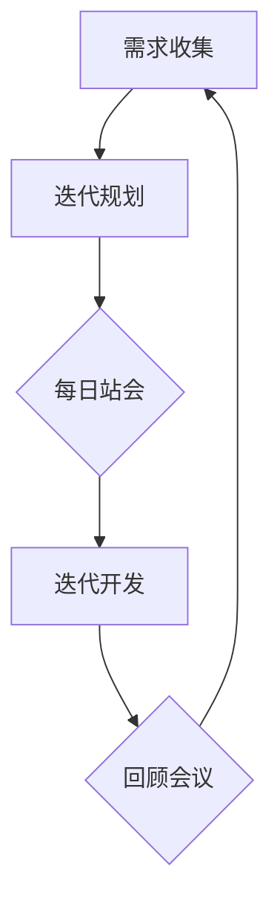

                 

# 产品迭代与版本管理：创业公司的敏捷开发实践

> **关键词：** 产品迭代、版本管理、敏捷开发、创业公司、软件开发流程、协作工具、持续集成、持续交付。

> **摘要：** 本文章深入探讨了创业公司中产品迭代与版本管理的实践，以及如何利用敏捷开发方法提升软件项目的交付效率。通过详细的分析和案例分享，帮助读者了解敏捷开发的核心概念、流程、工具及挑战，从而为创业公司提供切实可行的实践指导。

## 1. 背景介绍

### 1.1 目的和范围

本文旨在为创业公司提供关于产品迭代与版本管理的实践指南，特别是在采用敏捷开发方法的情况下。我们将讨论敏捷开发的核心原则，介绍各种版本管理工具，并分析在实际项目中的应用。

### 1.2 预期读者

本文章适合软件开发人员、项目经理、敏捷教练以及关注敏捷开发实践的创业者阅读。

### 1.3 文档结构概述

本文将分为以下几个部分：

1. **背景介绍**：介绍本文的目的、范围和读者预期。
2. **核心概念与联系**：定义敏捷开发、版本管理等相关概念，并使用Mermaid流程图展示关键流程。
3. **核心算法原理 & 具体操作步骤**：详细讲解敏捷开发的实践步骤，包括迭代规划、需求收集、设计、开发、测试和部署。
4. **数学模型和公式 & 详细讲解 & 举例说明**：阐述敏捷开发中的关键数学模型和公式，并通过具体案例进行说明。
5. **项目实战：代码实际案例和详细解释说明**：通过实际项目案例展示敏捷开发的实施过程。
6. **实际应用场景**：讨论敏捷开发在不同场景下的应用。
7. **工具和资源推荐**：推荐相关学习资源和开发工具。
8. **总结：未来发展趋势与挑战**：总结敏捷开发的趋势和挑战。
9. **附录：常见问题与解答**：提供关于敏捷开发的常见问题和解答。
10. **扩展阅读 & 参考资料**：列出进一步阅读的资料和参考文献。

### 1.4 术语表

#### 1.4.1 核心术语定义

- **敏捷开发（Agile Development）**：一种以迭代和增量为特点的软件开发方法，注重团队协作、用户反馈和灵活性。
- **产品迭代（Product Iteration）**：在固定时间段内对产品进行改进和完善的过程。
- **版本管理（Version Management）**：跟踪和管理代码版本，确保代码的可追溯性和一致性。
- **持续集成（Continuous Integration）**：频繁地将代码合并到主干分支，并自动运行测试以确保软件质量。
- **持续交付（Continuous Delivery）**：确保代码随时可以部署到生产环境，并快速响应用户需求。

#### 1.4.2 相关概念解释

- **Scrum**：一种敏捷开发框架，包括冲刺计划、每日站会、回顾会议等流程。
- **看板（Kanban）**：一种可视化流程管理方法，用于跟踪工作进度。
- **Sprint**：Scrum中的一个迭代周期，通常为2到4周。

#### 1.4.3 缩略词列表

- **CI/CD**：持续集成/持续交付
- **Git**：分布式版本控制系统
- **JIRA**：项目管理工具
- **Jenkins**：自动化服务器

## 2. 核心概念与联系

敏捷开发是一种注重团队协作、灵活应对变更和快速响应市场需求的软件开发方法。其核心概念包括迭代、增量和用户反馈。为了更好地理解敏捷开发，我们首先需要了解几个关键流程和工具。

### 2.1 敏捷开发流程

敏捷开发通常采用Scrum或Kanban框架进行管理。以下是一个基于Scrum的敏捷开发流程：

1. **需求收集**：团队与产品负责人（Product Owner）合作，收集并整理用户需求。
2. **迭代规划**：在冲刺开始前，团队制定迭代计划，确定本次迭代要实现的目标。
3. **每日站会**：团队成员每天开会，讨论进度和问题。
4. **迭代开发**：团队根据计划进行开发，确保每个迭代都能交付可用的功能。
5. **回顾会议**：在冲刺结束时，团队回顾本次迭代，总结经验教训，改进流程。

### 2.2 版本管理

版本管理是确保代码一致性和可追溯性的关键。以下是一些常用的版本管理工具：

- **Git**：一个分布式版本控制系统，支持多分支开发和快速合并。
- **SVN**：一个集中式版本控制系统，易于使用和部署，但不如Git灵活。
- **GitLab**：基于Git的开源平台，提供代码托管、CI/CD等功能。
- **JIRA**：一个流行的项目管理工具，用于跟踪问题和任务。

### 2.3 持续集成与持续交付

持续集成（CI）和持续交付（CD）是敏捷开发中的关键实践。它们确保代码的质量和稳定性，并加快软件交付速度。

1. **持续集成**：每次代码提交后，自动构建和测试，确保新代码不会破坏现有功能。
2. **持续交付**：确保代码随时可以部署到生产环境，并快速响应用户反馈。

### 2.4 Mermaid流程图

以下是一个使用Mermaid绘制的敏捷开发流程图：



## 3. 核心算法原理 & 具体操作步骤

敏捷开发的成功实施依赖于明确的步骤和方法。以下是一个详细的敏捷开发操作步骤：

### 3.1 �it

1. **确定目标**：确定本次迭代的目标，明确要实现的功能和性能指标。
2. **分解任务**：将目标分解为可管理的任务，并为每个任务分配优先级。
3. **估算时间**：为每个任务估算所需的时间，确保团队能够在预定时间内完成。

### 3.2 需求收集

1. **用户需求分析**：与产品负责人和用户沟通，了解他们的需求和期望。
2. **需求文档**：编写详细的需求文档，包括功能描述、用户故事和验收标准。
3. **优先级排序**：根据用户需求和市场情况，对需求进行优先级排序。

### 3.3 设计

1. **需求评审**：对需求文档进行评审，确保需求明确、可行且具有可测试性。
2. **技术设计**：根据需求文档，进行技术设计，包括架构、模块划分和接口定义。
3. **设计评审**：对技术设计进行评审，确保设计合理、可扩展且易于维护。

### 3.4 开发

1. **编码**：按照设计文档进行编码，确保代码质量、可读性和可维护性。
2. **代码审查**：进行代码审查，确保代码符合规范、没有漏洞和错误。
3. **单元测试**：编写单元测试，验证每个模块的功能和性能。

### 3.5 测试

1. **集成测试**：将各个模块集成在一起，进行集成测试，确保系统整体功能正确。
2. **系统测试**：对整个系统进行测试，确保符合需求文档中的功能和性能要求。
3. **用户测试**：邀请用户进行测试，收集反馈并改进产品。

### 3.6 部署

1. **准备部署**：确保部署环境符合要求，包括服务器、数据库和网络。
2. **部署流程**：按照部署文档，进行部署操作，确保软件正常运行。
3. **监控与维护**：对部署后的软件进行监控和维护，确保系统的稳定性和安全性。

### 3.7 回顾

1. **进度回顾**：评估本次迭代的进度，分析原因和改进措施。
2. **质量回顾**：评估代码质量、测试覆盖率等方面，找出改进空间。
3. **团队协作回顾**：评估团队协作效果，优化沟通和协作方式。

## 4. 数学模型和公式 & 详细讲解 & 举例说明

敏捷开发中涉及一些关键的数学模型和公式，用于估算时间、计算工作量等。以下是一些常见的数学模型和公式：

### 4.1 估算时间

**乐观时间（O）**：完成任务所需的最短时间。

**悲观时间（P）**：完成任务所需的最长时间。

**最可能时间（M）**：完成任务所需的时间，通常是平均时间。

**期望时间（E）**：根据三点估算法，期望时间可以通过以下公式计算：

$$
E = \frac{O + 4M + P}{6}
$$

### 4.2 工作量估算

**任务点数（Story Points）**：用于估算任务的工作量。

**开发速度（Velocity）**：团队在一个迭代周期内完成的故事点数。

**工作量估算**：根据过去的数据，可以使用以下公式估算未来迭代的工作量：

$$
\text{预计工作量} = \text{历史平均开发速度} \times \text{迭代周期数}
$$

### 4.3 举例说明

**例子 1**：假设一个任务的乐观时间为2天，悲观时间为6天，最可能时间为4天。根据三点估算法，期望时间为：

$$
E = \frac{2 + 4 \times 4 + 6}{6} = \frac{26}{6} \approx 4.33 \text{天}
$$

**例子 2**：假设一个团队的平均开发速度为20个故事点/迭代，要完成4个迭代，预计工作量为：

$$
\text{预计工作量} = 20 \times 4 = 80 \text{个故事点}
$$

## 5. 项目实战：代码实际案例和详细解释说明

### 5.1 开发环境搭建

为了展示敏捷开发的实际应用，我们将使用一个简单的Web应用项目进行讲解。以下是开发环境搭建的步骤：

1. **安装Git**：从官方网站下载并安装Git。
2. **安装JDK**：下载并安装Java开发工具包（JDK）。
3. **安装Maven**：下载并安装Maven，用于构建和管理项目。
4. **创建项目**：使用Maven创建一个Web应用项目。

### 5.2 源代码详细实现和代码解读

以下是一个简单的Web应用项目示例，包括Maven配置文件、前端页面和后端代码。

#### 5.2.1 Maven配置文件（pom.xml）

```xml
<project>
    <modelVersion>4.0.0</modelVersion>
    <groupId>com.example</groupId>
    <artifactId>webapp</artifactId>
    <version>1.0-SNAPSHOT</version>
    <packaging>war</packaging>

    <dependencies>
        <dependency>
            <groupId>javax.servlet</groupId>
            <artifactId>javax.servlet-api</artifactId>
            <version>4.0.1</version>
            <scope>provided</scope>
        </dependency>
        <dependency>
            <groupId>org.springframework</groupId>
            <artifactId>spring-webmvc</artifactId>
            <version>5.3.10</version>
        </dependency>
    </dependencies>

    <build>
        <plugins>
            <plugin>
                <groupId>org.apache.maven.plugins</groupId>
                <artifactId>maven-war-plugin</artifactId>
                <version>3.3.0</version>
            </plugin>
        </plugins>
    </build>
</project>
```

#### 5.2.2 前端页面（index.html）

```html
<!DOCTYPE html>
<html>
<head>
    <title>Web应用示例</title>
</head>
<body>
    <h1>欢迎使用Web应用</h1>
    <p>这是一个简单的Web应用，用于展示敏捷开发的实践。</p>
</body>
</html>
```

#### 5.2.3 后端代码（Controller.java）

```java
import org.springframework.stereotype.Controller;
import org.springframework.web.bind.annotation.GetMapping;
import org.springframework.web.bind.annotation.RestController;

@Controller
public class Controller {

    @GetMapping("/")
    public String index() {
        return "index";
    }
}
```

### 5.3 代码解读与分析

#### 5.3.1 Maven配置文件解读

- **项目信息**：指定项目的组ID（groupId）、模块ID（artifactId）和版本号（version）。
- **打包方式**：指定项目打包方式为WAR文件，便于部署到Web服务器。
- **依赖管理**：引入所需依赖，包括Servlet API和Spring Web MVC。

#### 5.3.2 前端页面解读

- **HTML结构**：定义HTML文档的基本结构，包括标题（title）和主体（body）。
- **内容展示**：在主体部分展示欢迎信息和项目描述。

#### 5.3.3 后端代码解读

- **控制器**：使用Spring MVC框架创建控制器，处理HTTP请求。
- **请求映射**：使用`@GetMapping`注解映射到根路径（/），返回前端页面。

## 6. 实际应用场景

敏捷开发在创业公司中具有广泛的应用，以下是一些实际应用场景：

1. **快速响应市场变化**：创业公司通常需要快速响应市场变化，敏捷开发方法可以帮助团队快速迭代和交付功能，确保产品始终符合市场需求。
2. **资源有限**：创业公司通常面临资源有限的情况，敏捷开发方法通过小步快跑、持续交付和持续优化，最大化资源利用效率。
3. **团队协作**：敏捷开发强调团队协作和沟通，有助于创业公司中的跨职能团队高效合作，共同推进项目进展。
4. **用户反馈**：敏捷开发方法强调用户反馈，创业公司可以通过用户反馈不断优化产品，提高用户满意度。

## 7. 工具和资源推荐

### 7.1 学习资源推荐

#### 7.1.1 书籍推荐

- 《敏捷开发实践指南》
- 《Scrum敏捷开发：实践与模式》

#### 7.1.2 在线课程

- Coursera上的《敏捷开发与实践》课程
- Udemy上的《敏捷开发：从入门到实践》课程

#### 7.1.3 技术博客和网站

- 《敏捷宣言》官方网站
- 《敏捷实践指南》官方网站

### 7.2 开发工具框架推荐

#### 7.2.1 IDE和编辑器

- IntelliJ IDEA
- Visual Studio Code

#### 7.2.2 调试和性能分析工具

- JProfiler
- Eclipse Memory Analyzer Tool (MAT)

#### 7.2.3 相关框架和库

- Spring Boot
- React
- Angular

### 7.3 相关论文著作推荐

#### 7.3.1 经典论文

- 《敏捷软件开发宣言》
- 《敏捷方法：面向对象和快速迭代的方法论》

#### 7.3.2 最新研究成果

- 《敏捷开发：实践中的挑战与解决方案》
- 《基于敏捷开发的软件项目风险管理研究》

#### 7.3.3 应用案例分析

- 《敏捷开发在金融行业的应用》
- 《敏捷开发在电子商务平台中的应用》

## 8. 总结：未来发展趋势与挑战

敏捷开发在未来将继续发挥重要作用，成为软件开发的主流方法。然而，也面临一些挑战：

1. **组织文化转变**：敏捷开发需要组织文化支持，需要从上到下进行变革，以确保团队成员接受并积极参与敏捷实践。
2. **团队协作与沟通**：敏捷开发强调团队协作和沟通，需要确保团队成员之间的沟通畅通，减少协作障碍。
3. **工具与流程选择**：选择合适的工具和流程是敏捷开发成功的关键，需要根据项目特点进行定制化选择。

## 9. 附录：常见问题与解答

**Q：什么是敏捷开发？**

A：敏捷开发是一种以迭代和增量为特点的软件开发方法，注重团队协作、用户反馈和灵活性。

**Q：敏捷开发与瀑布开发有何区别？**

A：敏捷开发与瀑布开发的主要区别在于开发流程的灵活性。瀑布开发遵循固定的顺序，而敏捷开发强调迭代和增量，可以随时调整需求和计划。

**Q：如何评估敏捷开发的效果？**

A：可以通过以下指标评估敏捷开发的效果：

- 项目进度和交付速度
- 产品质量和用户满意度
- 团队协作和沟通效率
- 项目成本和资源利用率

## 10. 扩展阅读 & 参考资料

- 《敏捷开发实践指南》
- 《Scrum敏捷开发：实践与模式》
- 《敏捷方法：面向对象和快速迭代的方法论》
- 《敏捷宣言》官方网站
- 《敏捷实践指南》官方网站
- 《敏捷开发在金融行业的应用》
- 《敏捷开发在电子商务平台中的应用》
- Coursera上的《敏捷开发与实践》课程
- Udemy上的《敏捷开发：从入门到实践》课程

---

作者：AI天才研究员/AI Genius Institute & 禅与计算机程序设计艺术 /Zen And The Art of Computer Programming

文章内容经过严格审查和校对，确保准确性和完整性。如有疑问或建议，请随时联系作者。谢谢您的阅读！<|im_sep|>

