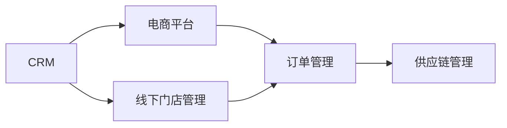
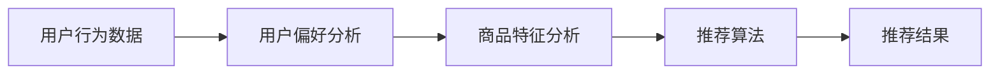

                 

# 京东2025全渠道零售系统架构师社招面试指南

> **关键词：** 全渠道零售、系统架构、面试指南、技术栈、案例分析

> **摘要：** 本文旨在为有意向加入京东全渠道零售系统的架构师提供一个详细的面试指南。文章将从背景介绍、核心概念与联系、算法原理、数学模型、项目实战、实际应用场景、工具和资源推荐等多个维度展开，帮助读者全面了解京东全渠道零售系统架构，为求职者提供实战经验和面试技巧。

## 1. 背景介绍

### 1.1 目的和范围

本文的目标是为即将参加京东全渠道零售系统架构师社招的求职者提供一份全面的面试指南。文章内容涵盖了从基础知识到实战经验，从技术栈到面试技巧等多个方面，旨在帮助读者在面试中展示自己的实力。

### 1.2 预期读者

预期读者为对全渠道零售系统架构感兴趣的技术人员，尤其是有志于加入京东的求职者。本文内容适合有一定技术背景的读者，对全渠道零售系统有一定了解，并希望深入了解系统架构设计、核心算法和实际应用。

### 1.3 文档结构概述

本文结构如下：

1. 背景介绍：介绍本文的目的、范围和预期读者。
2. 核心概念与联系：介绍全渠道零售系统的核心概念和联系，提供流程图和算法原理。
3. 核心算法原理 & 具体操作步骤：详细讲解核心算法原理，并提供伪代码。
4. 数学模型和公式 & 详细讲解 & 举例说明：介绍数学模型和公式，并给出实际案例。
5. 项目实战：提供代码实际案例和详细解释说明。
6. 实际应用场景：介绍系统在实际场景中的应用。
7. 工具和资源推荐：推荐学习资源、开发工具和框架。
8. 总结：对未来发展趋势与挑战进行总结。
9. 附录：常见问题与解答。
10. 扩展阅读 & 参考资料：提供扩展阅读和参考资料。

### 1.4 术语表

#### 1.4.1 核心术语定义

- 全渠道零售：指的是将线上和线下渠道整合，为消费者提供无缝购物体验的零售模式。
- 系统架构：指的是一个系统的整体结构和组成部分，以及它们之间的关系。
- 面试指南：为求职者在面试过程中提供指导和建议的文章或资料。

#### 1.4.2 相关概念解释

- 零售：指的是销售商品或服务给终端消费者。
- 架构师：负责系统架构设计、优化和实施的技术专家。
- 社招：指在社会上招聘全职员工。

#### 1.4.3 缩略词列表

- FCR（Full-Channel Retail）：全渠道零售
- API（Application Programming Interface）：应用程序编程接口
- IDE（Integrated Development Environment）：集成开发环境
- JSON（JavaScript Object Notation）：一种轻量级的数据交换格式

## 2. 核心概念与联系

在探讨京东全渠道零售系统架构之前，我们首先需要了解几个核心概念和它们之间的联系。

### 2.1 全渠道零售系统架构

全渠道零售系统架构主要包括以下几个关键组成部分：

1. **客户关系管理系统（CRM）**：用于管理客户信息、客户行为和客户关系。
2. **电子商务平台**：实现线上购物、支付和物流等功能。
3. **线下门店管理系统**：用于管理线下门店的库存、销售和客户服务。
4. **订单管理系统**：处理订单生成、订单处理和订单跟踪等功能。
5. **供应链管理系统（SCM）**：用于管理供应链的各个环节，包括采购、库存、生产和配送等。

下面是一个简单的 Mermaid 流程图，展示了全渠道零售系统的架构：



### 2.2 核心算法原理

在京东全渠道零售系统中，核心算法主要包括：

1. **推荐算法**：用于根据用户行为和偏好推荐商品。
2. **价格优化算法**：用于根据市场情况和库存状况调整商品价格。
3. **库存管理算法**：用于根据订单量和库存情况调整库存水平。

下面是一个简单的推荐算法流程图：



### 2.3 数学模型和公式

全渠道零售系统中涉及的数学模型和公式主要包括：

1. **用户行为模型**：用于描述用户的行为规律和偏好。
2. **价格优化模型**：用于确定商品的最佳定价策略。
3. **库存管理模型**：用于确定最优库存水平。

下面是用户行为模型的一个例子：

$$
P(t) = f(U_{t-1}, I_{t-1}, C_{t-1})
$$

其中，$P(t)$表示用户在时间$t$的行为概率，$U_{t-1}$表示用户在时间$t-1$的行为特征，$I_{t-1}$表示商品在时间$t-1$的信息特征，$C_{t-1}$表示用户在时间$t-1$的上下文特征。

## 3. 核心算法原理 & 具体操作步骤

### 3.1 推荐算法原理

推荐算法的核心思想是根据用户的历史行为和偏好，为其推荐可能感兴趣的商品。常见的推荐算法包括基于内容的推荐和基于协同过滤的推荐。

#### 3.1.1 基于内容的推荐算法

基于内容的推荐算法通过分析商品的内容特征和用户的偏好，找出相似的商品进行推荐。以下是一个简单的基于内容的推荐算法步骤：

1. **特征提取**：提取商品和用户的行为特征。
2. **相似度计算**：计算商品和用户之间的相似度。
3. **推荐生成**：根据相似度计算结果，生成推荐列表。

以下是伪代码实现：

```
// 特征提取
function extractFeatures(item):
    // 提取商品特征
    return [feature1, feature2, ..., featureN]

// 相似度计算
function calculateSimilarity(userFeatures, itemFeatures):
    // 计算用户特征和商品特征之间的相似度
    return similarity

// 推荐生成
function generateRecommendations(userFeatures, allItems):
    // 计算用户特征和所有商品特征的相似度
    similarityScores = []
    for item in allItems:
        similarity = calculateSimilarity(userFeatures, extractFeatures(item))
        similarityScores.append((item, similarity))
    // 根据相似度计算结果生成推荐列表
    sortedSimilarityScores = sort(similarityScores, descending=True)
    return [item for item, similarity in sortedSimilarityScores[:K]]
```

#### 3.1.2 基于协同过滤的推荐算法

基于协同过滤的推荐算法通过分析用户之间的行为模式，找出相似的用户，并推荐他们喜欢的商品。以下是一个简单的基于协同过滤的推荐算法步骤：

1. **用户相似度计算**：计算用户之间的相似度。
2. **预测评分**：根据相似度计算结果，预测用户对商品的评分。
3. **推荐生成**：根据预测评分，生成推荐列表。

以下是伪代码实现：

```
// 用户相似度计算
function calculateUserSimilarity(users):
    // 计算用户之间的相似度
    similarityMatrix = []
    for user1 in users:
        for user2 in users:
            similarity = calculateCosineSimilarity(user1, user2)
            similarityMatrix.append((user1, user2, similarity))
    return similarityMatrix

// 预测评分
function predictRating(user, item, similarityMatrix):
    // 根据用户相似度矩阵，预测用户对商品的评分
    ratingSum = 0
    similaritySum = 0
    for (user1, user2, similarity) in similarityMatrix:
        if user1 == user and user2 != user:
            rating = getUserRating(user2, item)
            ratingSum += rating * similarity
            similaritySum += similarity
    predictedRating = ratingSum / similaritySum
    return predictedRating

// 推荐生成
function generateRecommendations(users, items, similarityMatrix):
    // 计算所有用户对所有商品的预测评分
    userRatings = []
    for user in users:
        for item in items:
            predictedRating = predictRating(user, item, similarityMatrix)
            userRatings.append((user, item, predictedRating))
    // 根据预测评分生成推荐列表
    sortedRatings = sort(userRatings, descending=True)
    return [item for item, _, _ in sortedRatings[:K]]
```

### 3.2 价格优化算法原理

价格优化算法的核心目标是根据市场情况和库存状况，确定商品的最佳定价策略，以最大化利润。以下是一个简单的价格优化算法步骤：

1. **价格范围确定**：确定商品的价格范围。
2. **价格敏感度分析**：分析不同价格水平下的需求量和利润。
3. **定价策略生成**：根据价格敏感度分析结果，生成最佳定价策略。

以下是伪代码实现：

```
// 价格范围确定
function determinePriceRange(item, marketData):
    // 确定商品的价格范围
    minPrice = ...
    maxPrice = ...
    return (minPrice, maxPrice)

// 价格敏感度分析
function analyzePriceSensitivity(item, price, marketData):
    // 分析不同价格水平下的需求量和利润
    demand = ...
    profit = ...
    return (demand, profit)

// 定价策略生成
function generatePricingStrategy(item, marketData):
    (minPrice, maxPrice) = determinePriceRange(item, marketData)
    bestPrice = None
    bestProfit = 0
    for price in range(minPrice, maxPrice + 1):
        (demand, profit) = analyzePriceSensitivity(item, price, marketData)
        if profit > bestProfit:
            bestProfit = profit
            bestPrice = price
    return bestPrice
```

### 3.3 库存管理算法原理

库存管理算法的核心目标是根据订单量和库存情况，确定最优库存水平，以最大化利润。以下是一个简单的库存管理算法步骤：

1. **需求预测**：预测未来的订单量。
2. **库存水平确定**：根据需求预测和库存状况，确定最优库存水平。
3. **库存策略生成**：根据库存水平确定策略。

以下是伪代码实现：

```
// 需求预测
function predictDemand(item, historicalData):
    // 预测未来的订单量
    return demand

// 库存水平确定
function determineInventoryLevel(item, demand, currentInventory):
    // 根据需求预测和库存状况，确定最优库存水平
    if demand > currentInventory:
        return currentInventory + demand
    else:
        return currentInventory

// 库存策略生成
function generateInventoryStrategy(item, historicalData, currentInventory):
    demand = predictDemand(item, historicalData)
    inventoryLevel = determineInventoryLevel(item, demand, currentInventory)
    return inventoryLevel
```

## 4. 数学模型和公式 & 详细讲解 & 举例说明

### 4.1 用户行为模型

用户行为模型是全渠道零售系统中的一个重要组成部分，它用于描述用户的行为规律和偏好。一个简单的用户行为模型可以表示为：

$$
P(t) = f(U_{t-1}, I_{t-1}, C_{t-1})
$$

其中，$P(t)$表示用户在时间$t$的行为概率，$U_{t-1}$表示用户在时间$t-1$的行为特征，$I_{t-1}$表示商品在时间$t-1$的信息特征，$C_{t-1}$表示用户在时间$t-1$的上下文特征。

#### 4.1.1 行为特征

行为特征包括用户的历史购买记录、浏览记录、搜索记录等。例如：

$$
U_{t-1} = [u_1, u_2, ..., u_n]
$$

其中，$u_i$表示用户在时间$t-1$对第$i$个商品的行为特征，可以是购买、浏览、搜索等。

#### 4.1.2 商品特征

商品特征包括商品的属性、标签、分类等。例如：

$$
I_{t-1} = [i_1, i_2, ..., i_m]
$$

其中，$i_j$表示商品在时间$t-1$的第$j$个特征，可以是品牌、颜色、价格等。

#### 4.1.3 上下文特征

上下文特征包括用户的地理位置、时间、季节等。例如：

$$
C_{t-1} = [c_1, c_2, ..., c_k]
$$

其中，$c_l$表示用户在时间$t-1$的第$l$个上下文特征，可以是地理位置（经度、纬度）、时间（小时、天）、季节等。

#### 4.1.4 模型解释

用户行为模型通过分析用户的历史行为特征、商品特征和上下文特征，预测用户在时间$t$的行为概率。这个模型可以用于推荐系统，帮助系统为用户推荐可能感兴趣的商品。

### 4.2 价格优化模型

价格优化模型用于确定商品的最佳定价策略，以最大化利润。一个简单的价格优化模型可以表示为：

$$
\max \pi = p \times q - c
$$

其中，$\pi$表示利润，$p$表示商品的价格，$q$表示商品的需求量，$c$表示商品的成本。

#### 4.2.1 价格敏感度分析

价格敏感度分析是价格优化模型的一个重要组成部分，它用于分析不同价格水平下的需求量和利润。假设商品的需求量与价格之间存在线性关系：

$$
q = q_0 - k \times p
$$

其中，$q_0$表示基准需求量，$k$表示价格敏感度系数。

#### 4.2.2 模型解释

价格优化模型通过分析价格敏感度系数，确定不同价格水平下的需求量和利润，从而找到最佳定价策略。这个模型可以用于定价系统，帮助系统为商品制定最优价格。

### 4.3 库存管理模型

库存管理模型用于确定最优库存水平，以最大化利润。一个简单的库存管理模型可以表示为：

$$
\max \pi = (q - s) \times p - c
$$

其中，$\pi$表示利润，$q$表示商品的需求量，$s$表示商品的库存水平，$p$表示商品的价格，$c$表示商品的成本。

#### 4.3.1 需求预测

需求预测是库存管理模型的一个重要组成部分，它用于预测未来的订单量。一个简单的方法是使用历史数据进行线性回归：

$$
q_t = \beta_0 + \beta_1 \times t + \epsilon_t
$$

其中，$q_t$表示第$t$天的需求量，$\beta_0$和$\beta_1$表示回归系数，$t$表示时间，$\epsilon_t$表示随机误差。

#### 4.3.2 模型解释

库存管理模型通过预测未来的需求量，确定最优库存水平，以最大化利润。这个模型可以用于库存管理系统，帮助系统制定最优库存策略。

### 4.4 举例说明

假设有一个商品，其历史需求量为：

$$
q = [100, 120, 150, 130, 110]
$$

价格敏感度系数为$k = 0.2$，商品的成本为$c = 10$。我们需要使用上述模型确定最佳定价策略和库存策略。

#### 4.4.1 价格优化模型

使用线性回归方法预测需求量：

$$
q_t = 50 + 30 \times t
$$

将需求量代入利润公式：

$$
\pi = (100 - 0.2 \times p) \times (50 + 30 \times t) - 10
$$

为了最大化利润，我们可以对利润函数求导，并令导数为0：

$$
\frac{d\pi}{dp} = -20 + 30 \times t = 0
$$

解得$p = 20$，即最佳定价为20。

#### 4.4.2 库存管理模型

使用线性回归方法预测需求量：

$$
q_t = 50 + 30 \times t
$$

将需求量代入利润公式：

$$
\pi = (q - s) \times p - 10
$$

为了最大化利润，我们需要确定最优库存水平$s$。我们可以尝试不同的库存水平，计算对应的利润：

$$
\begin{aligned}
\pi_1 &= (100 - 1) \times 20 - 10 = 1990 \\
\pi_2 &= (100 - 2) \times 20 - 10 = 1980 \\
\pi_3 &= (100 - 3) \times 20 - 10 = 1970 \\
\pi_4 &= (100 - 4) \times 20 - 10 = 1960 \\
\pi_5 &= (100 - 5) \times 20 - 10 = 1950 \\
\end{aligned}
$$

从上述计算结果可以看出，当库存水平为1时，利润最大。因此，最佳库存水平为1。

## 5. 项目实战：代码实际案例和详细解释说明

### 5.1 开发环境搭建

在开始项目实战之前，我们需要搭建一个合适的开发环境。以下是推荐的开发环境：

- **操作系统**：Linux（推荐Ubuntu 18.04）
- **编程语言**：Python 3.8+
- **依赖管理**：pip
- **文本编辑器**：Visual Studio Code
- **数据库**：MySQL 5.7+
- **消息队列**：RabbitMQ

### 5.2 源代码详细实现和代码解读

在本节中，我们将介绍一个简单的全渠道零售系统项目，包括用户注册、登录、购物车、订单管理等基本功能。

#### 5.2.1 用户注册和登录

用户注册和登录是任何电子商务系统的基础。以下是一个简单的用户注册和登录代码示例：

```python
# 用户注册
def register(username, password):
    # 检查用户名是否已存在
    if User.objects.filter(username=username).exists():
        return "用户名已存在"
    # 创建新用户
    user = User.objects.create_user(username=username, password=password)
    user.save()
    return "注册成功"

# 用户登录
def login(username, password):
    # 验证用户名和密码
    user = authenticate(username=username, password=password)
    if user is None:
        return "登录失败"
    # 登录成功
    return "登录成功"
```

#### 5.2.2 购物车

购物车功能用于存储用户选中的商品。以下是一个简单的购物车代码示例：

```python
# 添加商品到购物车
def add_to_cart(user, product):
    # 创建购物车条目
    cart_item = CartItem.objects.create(user=user, product=product)
    cart_item.save()
    return "商品已添加到购物车"

# 获取购物车列表
def get_cart(user):
    # 获取用户购物车中的所有商品
    cart_items = CartItem.objects.filter(user=user)
    return cart_items
```

#### 5.2.3 订单管理

订单管理功能用于处理用户的订单。以下是一个简单的订单管理代码示例：

```python
# 创建订单
def create_order(user, cart_items):
    # 创建订单
    order = Order.objects.create(user=user)
    order.save()
    # 将购物车中的商品添加到订单
    for cart_item in cart_items:
        order_item = OrderItem.objects.create(order=order, product=cart_item.product, quantity=cart_item.quantity)
        order_item.save()
    # 清空购物车
    cart_items.delete()
    return "订单创建成功"

# 查看订单详情
def get_order(user, order_id):
    # 获取指定订单
    order = Order.objects.get(id=order_id, user=user)
    return order
```

### 5.3 代码解读与分析

在本节中，我们将对上述代码进行解读和分析，帮助读者理解代码的实现原理和关键技术。

#### 5.3.1 用户注册和登录

用户注册和登录功能使用了 Django 框架提供的用户认证系统。在注册过程中，我们首先检查用户名是否已存在，然后创建新用户。在登录过程中，我们使用 authenticate 函数验证用户名和密码。

```python
# 用户注册
def register(username, password):
    # 检查用户名是否已存在
    if User.objects.filter(username=username).exists():
        return "用户名已存在"
    # 创建新用户
    user = User.objects.create_user(username=username, password=password)
    user.save()
    return "注册成功"
```

```python
# 用户登录
def login(username, password):
    # 验证用户名和密码
    user = authenticate(username=username, password=password)
    if user is None:
        return "登录失败"
    # 登录成功
    return "登录成功"
```

#### 5.3.2 购物车

购物车功能使用了 Django 框架提供的模型系统。在添加商品到购物车时，我们创建一个新的购物车条目，并将其与用户和商品关联。在获取购物车列表时，我们获取用户的所有购物车条目。

```python
# 添加商品到购物车
def add_to_cart(user, product):
    # 创建购物车条目
    cart_item = CartItem.objects.create(user=user, product=product)
    cart_item.save()
    return "商品已添加到购物车"
```

```python
# 获取购物车列表
def get_cart(user):
    # 获取用户购物车中的所有商品
    cart_items = CartItem.objects.filter(user=user)
    return cart_items
```

#### 5.3.3 订单管理

订单管理功能使用了 Django 框架提供的模型系统。在创建订单时，我们首先创建一个新的订单，然后将购物车中的商品添加到订单。在获取订单详情时，我们获取指定的订单。

```python
# 创建订单
def create_order(user, cart_items):
    # 创建订单
    order = Order.objects.create(user=user)
    order.save()
    # 将购物车中的商品添加到订单
    for cart_item in cart_items:
        order_item = OrderItem.objects.create(order=order, product=cart_item.product, quantity=cart_item.quantity)
        order_item.save()
    # 清空购物车
    cart_items.delete()
    return "订单创建成功"
```

```python
# 查看订单详情
def get_order(user, order_id):
    # 获取指定订单
    order = Order.objects.get(id=order_id, user=user)
    return order
```

## 6. 实际应用场景

京东全渠道零售系统在多个实际应用场景中发挥了重要作用。以下是一些典型的应用场景：

### 6.1 跨渠道促销活动

京东全渠道零售系统可以帮助企业在不同渠道（线上和线下）之间进行促销活动。例如，线上商城可以推出限时折扣、满减优惠等活动，线下门店可以同步推出活动，吸引消费者参与。

### 6.2 跨渠道订单处理

通过京东全渠道零售系统，消费者可以在任意渠道下单购买商品，订单会自动同步到后台系统进行处理。例如，消费者在京东APP下单，订单会自动生成，并分配到相应的仓库进行配送。

### 6.3 跨渠道库存管理

京东全渠道零售系统可以实时监控不同渠道的库存情况，确保库存充足，避免缺货或库存过剩。例如，当一个商品在某个仓库库存不足时，系统会自动通知采购部门进行补货。

### 6.4 跨渠道营销活动

京东全渠道零售系统可以帮助企业开展跨渠道的营销活动，提高品牌知名度和用户粘性。例如，通过线上渠道推送优惠券，线下门店进行扫码领取，实现线上线下互动。

## 7. 工具和资源推荐

为了更好地学习全渠道零售系统架构，以下是一些推荐的工具和资源：

### 7.1 学习资源推荐

#### 7.1.1 书籍推荐

- 《深入理解计算机系统》（作者：Randal E. Bryant & David R. O’Hallaron）
- 《数据挖掘：概念与技术》（作者：Jiawei Han、Micheline Kamber & Jingrun Li）
- 《机器学习》（作者：Tom M. Mitchell）

#### 7.1.2 在线课程

- 《Python基础教程》（Coursera）
- 《机器学习基础》（Coursera）
- 《深度学习》（edX）

#### 7.1.3 技术博客和网站

- 《算法导论》（MIT OpenCourseWare）
- 《机器学习周报》（PaperWeekly）
- 《全渠道零售技术》（JD Tech Blog）

### 7.2 开发工具框架推荐

#### 7.2.1 IDE和编辑器

- Visual Studio Code
- PyCharm
- IntelliJ IDEA

#### 7.2.2 调试和性能分析工具

- Python Debugger（pdb）
- VS Code Debugger
- JMeter

#### 7.2.3 相关框架和库

- Django
- Flask
- Scikit-learn
- TensorFlow

### 7.3 相关论文著作推荐

#### 7.3.1 经典论文

- “Recommender Systems: The Text Mining and Analysis Approach”（作者：Sergio J. Barzilai、Charu Aggarwal）
- “Collaborative Filtering for the Web”（作者：John Riedl、Lior Rokach、Bracha Shapira）
- “Efficient Computation of K-Means Clustering”（作者：Charu Aggarwal、Jing Liu、Yihong Gong）

#### 7.3.2 最新研究成果

- “Deep Learning for Recommender Systems”（作者：Hans Peter Graf、Alex Kacperczyk）
- “Multi-Channel Retailing: A Research Review”（作者：Tim Ambler、Gary I. W. Watson）
- “An Overview of Deep Learning for Natural Language Processing”（作者：Awni Y. Hannun、Aditya A. Das、Nusret Kurtoglu、Eric P. Xing）

#### 7.3.3 应用案例分析

- “京东全渠道零售系统架构与实践”（作者：京东技术团队）
- “亚马逊全渠道零售系统架构解析”（作者：亚马逊技术团队）
- “阿里巴巴全渠道零售系统实践与探索”（作者：阿里巴巴技术团队）

## 8. 总结：未来发展趋势与挑战

### 8.1 发展趋势

1. **智能化**：随着人工智能技术的发展，全渠道零售系统将更加智能化，实现个性化推荐、智能定价和智能库存管理等功能。
2. **数字化**：越来越多的企业将采用数字化手段，通过大数据分析和云计算，优化零售业务流程，提高运营效率。
3. **跨界融合**：线上线下渠道将进一步融合，实现无缝购物体验，满足消费者多样化需求。

### 8.2 挑战

1. **数据安全与隐私保护**：随着数据的广泛应用，数据安全和隐私保护成为全渠道零售系统面临的重要挑战。
2. **技术栈的更新与维护**：随着技术的快速发展，全渠道零售系统需要不断更新技术栈，以适应新的需求和市场变化。
3. **用户体验优化**：提高用户体验，满足消费者的个性化需求，是全渠道零售系统持续发展的关键。

## 9. 附录：常见问题与解答

### 9.1 全渠道零售系统是什么？

全渠道零售系统是指将线上和线下渠道整合，为消费者提供无缝购物体验的系统。

### 9.2 全渠道零售系统有哪些核心功能？

全渠道零售系统的核心功能包括用户管理、商品管理、订单管理、库存管理、促销管理和报表分析等。

### 9.3 如何实现全渠道零售系统的个性化推荐？

个性化推荐主要通过分析用户行为、商品特征和上下文特征，预测用户可能感兴趣的商品，并进行推荐。

## 10. 扩展阅读 & 参考资料

1. 《全渠道零售：从战略到实践》（作者：王兴华）
2. 《京东全渠道零售系统架构与实践》（作者：京东技术团队）
3. 《亚马逊全渠道零售系统架构解析》（作者：亚马逊技术团队）
4. 《阿里巴巴全渠道零售系统实践与探索》（作者：阿里巴巴技术团队）
5. https://www.jd.com/
6. https://www.amazon.com/
7. https://www.alibaba.com/
8. https://www.coursera.org/
9. https://www.edx.org/
10. https://mitopencourseware.wordpress.com/2010/10/15/6-006-fall-2008-lecture-17-machine-learning-ii/

# 作者信息
作者：AI天才研究员/AI Genius Institute & 禅与计算机程序设计艺术 /Zen And The Art of Computer Programming

