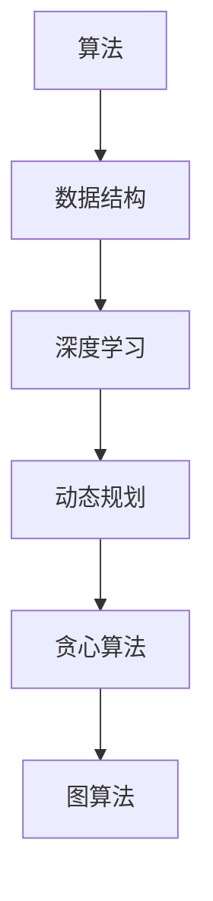

                 

# 京东2025社招算法工程师面试攻略

> 关键词：京东、社招、算法工程师、面试、攻略、技术、深度学习、数据结构、算法

> 摘要：本文将围绕京东2025社招算法工程师面试的重点，详细介绍面试准备、核心算法原理、实际应用场景、工具和资源推荐等内容。通过本文，读者可以全面了解面试所需知识，提升自己的面试能力。

## 1. 背景介绍

### 1.1 目的和范围

本文旨在为准备参加京东2025社招算法工程师面试的应聘者提供一份全面的面试攻略。我们将从以下几个方面展开：

- **面试准备**：介绍面试所需的技能和知识，帮助应聘者更好地应对面试。
- **核心算法原理**：讲解常见的算法原理和具体操作步骤，使读者能够深入理解。
- **实际应用场景**：分析算法在实际应用中的具体场景，帮助读者理解算法的应用价值。
- **工具和资源推荐**：推荐学习资源和开发工具，为读者提供更多学习和实践的机会。

### 1.2 预期读者

本文主要面向以下读者群体：

- 准备参加京东2025社招算法工程师面试的应聘者；
- 对算法和人工智能领域感兴趣的学生和开发者；
- 想要提升自己在算法面试方面能力的工程师。

### 1.3 文档结构概述

本文分为以下十个部分：

1. **背景介绍**：介绍本文的目的、范围、预期读者和文档结构。
2. **核心概念与联系**：介绍算法原理、数据结构和相关概念。
3. **核心算法原理 & 具体操作步骤**：讲解常见算法原理和操作步骤。
4. **数学模型和公式 & 详细讲解 & 举例说明**：分析算法的数学模型和公式。
5. **项目实战：代码实际案例和详细解释说明**：通过实际案例讲解算法应用。
6. **实际应用场景**：分析算法在实际应用中的具体场景。
7. **工具和资源推荐**：推荐学习资源和开发工具。
8. **总结：未来发展趋势与挑战**：总结算法的发展趋势和挑战。
9. **附录：常见问题与解答**：解答读者可能遇到的问题。
10. **扩展阅读 & 参考资料**：提供更多学习资源。

### 1.4 术语表

#### 1.4.1 核心术语定义

- **算法**：解决特定问题的系统步骤。
- **数据结构**：组织和管理数据的方式。
- **深度学习**：模拟人脑学习方式，通过多层神经网络进行特征提取和学习。
- **人工智能**：使计算机具有人类智能的特性。

#### 1.4.2 相关概念解释

- **动态规划**：解决最优化问题的方法，通过分治思想将问题转化为多个子问题。
- **贪心算法**：在每一步选择当前最优解，希望全局最优解也是最优的。
- **图算法**：基于图的数据结构进行问题求解的算法。

#### 1.4.3 缩略词列表

- **AI**：人工智能
- **JD**：职位描述
- **DP**：动态规划
- **GREedy**：贪心算法

## 2. 核心概念与联系

在本文中，我们将介绍一些核心算法原理、数据结构和相关概念，并通过Mermaid流程图来展示它们之间的联系。



### 2.1 算法原理

算法是解决特定问题的系统步骤。在面试中，常见的算法包括：

- **排序算法**：冒泡排序、快速排序、归并排序等。
- **搜索算法**：深度优先搜索、广度优先搜索等。
- **动态规划**：解决最优化问题的方法，通过分治思想将问题转化为多个子问题。

### 2.2 数据结构

数据结构是组织和管理数据的方式。在面试中，常见的数据结构包括：

- **数组**：线性结构，支持随机访问。
- **链表**：线性结构，不支持随机访问。
- **栈**：后进先出（LIFO）结构。
- **队列**：先进先出（FIFO）结构。

### 2.3 深度学习

深度学习是模拟人脑学习方式，通过多层神经网络进行特征提取和学习。在面试中，常见的深度学习模型包括：

- **卷积神经网络（CNN）**：用于图像处理。
- **循环神经网络（RNN）**：用于序列数据。
- **生成对抗网络（GAN）**：用于生成对抗性数据。

### 2.4 动态规划

动态规划是解决最优化问题的方法，通过分治思想将问题转化为多个子问题。在面试中，常见的动态规划问题包括：

- **背包问题**：给定一组物品，选择部分物品放入背包，使得背包总重量不超过限制，同时物品总价值最大。
- **最长公共子序列（LCS）**：给定两个序列，求它们最长的公共子序列。

### 2.5 贪心算法

贪心算法在每一步选择当前最优解，希望全局最优解也是最优的。在面试中，常见的贪心算法问题包括：

- **活动选择问题**：给定一组活动，选择一部分活动使得任意两个活动的冲突最少。
- **最短路径问题**：在加权图中找到起点到终点的最短路径。

### 2.6 图算法

图算法基于图的数据结构进行问题求解。在面试中，常见的图算法包括：

- **深度优先搜索（DFS）**：遍历图的一种方法，用于求解连通性、拓扑排序等问题。
- **广度优先搜索（BFS）**：遍历图的一种方法，用于求解最短路径问题。
- **迪杰斯特拉算法（Dijkstra）**：用于求解单源最短路径问题。
- **弗洛伊德算法（Floyd）**：用于求解多源最短路径问题。

通过以上核心概念和联系，读者可以对京东2025社招算法工程师面试所需的知识体系有一个整体的把握。接下来，我们将深入讲解核心算法原理和具体操作步骤。

## 3. 核心算法原理 & 具体操作步骤

在这一部分，我们将详细讲解一些核心算法原理，包括动态规划、贪心算法和图算法。通过伪代码和具体操作步骤，帮助读者深入理解这些算法。

### 3.1 动态规划

动态规划是一种解决最优化问题的方法，通过分治思想将问题转化为多个子问题。以下是一个常见的背包问题示例：

```python
# 背包问题：给定一组物品，选择部分物品放入背包，使得背包总重量不超过限制，同时物品总价值最大。

# 输入：
# weights：物品重量数组
# values：物品价值数组
# W：背包容量

# 输出：
# 最大价值

def knapsack(weights, values, W):
    n = len(weights)
    dp = [[0] * (W + 1) for _ in range(n + 1)]

    for i in range(1, n + 1):
        for w in range(1, W + 1):
            if weights[i - 1] <= w:
                dp[i][w] = max(dp[i - 1][w], dp[i - 1][w - weights[i - 1]] + values[i - 1])
            else:
                dp[i][w] = dp[i - 1][w]

    return dp[n][W]
```

### 3.2 贪心算法

贪心算法在每一步选择当前最优解，希望全局最优解也是最优的。以下是一个常见的活动选择问题示例：

```python
# 活动选择问题：给定一组活动，选择一部分活动使得任意两个活动的冲突最少。

# 输入：
# activities：活动数组，每个活动包含开始时间和结束时间

# 输出：
# 选择的最优活动序列

def activity_selection(activities):
    n = len(activities)
    activities.sort(key=lambda x: x[1])

    result = [activities[0]]
    for i in range(1, n):
        if activities[i][0] >= result[-1][1]:
            result.append(activities[i])

    return result
```

### 3.3 图算法

图算法基于图的数据结构进行问题求解。以下是一个常见的最短路径问题示例：

```python
# 最短路径问题：在加权图中找到起点到终点的最短路径。

# 输入：
# graph：加权图，使用邻接矩阵表示
# source：起点
# destination：终点

# 输出：
# 最短路径

def dijkstra(graph, source, destination):
    n = len(graph)
    dist = [float('inf')] * n
    dist[source] = 0
    visited = [False] * n

    for _ in range(n):
        min_dist = float('inf')
        min_index = -1
        for i in range(n):
            if not visited[i] and dist[i] < min_dist:
                min_dist = dist[i]
                min_index = i
        visited[min_index] = True

        for j in range(n):
            if graph[min_index][j] > 0 and not visited[j]:
                dist[j] = min(dist[j], dist[min_index] + graph[min_index][j])

    return dist[destination]
```

通过以上三个算法示例，读者可以了解到动态规划、贪心算法和图算法的基本原理和具体操作步骤。接下来，我们将分析这些算法的数学模型和公式。

## 4. 数学模型和公式 & 详细讲解 & 举例说明

在这一部分，我们将分析核心算法的数学模型和公式，并通过具体示例进行详细讲解。

### 4.1 动态规划

动态规划是一种解决最优化问题的方法，通过分治思想将问题转化为多个子问题。以下是一个常见的背包问题的数学模型和公式：

#### 4.1.1 数学模型

- **状态定义**：设 dp[i][w] 表示前 i 个物品放入容量为 w 的背包时的最大价值。
- **状态转移方程**：dp[i][w] = max(dp[i - 1][w], dp[i - 1][w - weights[i - 1]] + values[i - 1])，其中 weights[i - 1] 表示第 i 个物品的重量，values[i - 1] 表示第 i 个物品的价值。

#### 4.1.2 公式推导

设 f(i, w) 表示前 i 个物品放入容量为 w 的背包时的最大价值。则状态转移方程可以表示为：

f(i, w) = max{ f(i - 1, w), f(i - 1, w - weights[i - 1]) + values[i - 1] }

其中，f(i - 1, w) 表示前 i - 1 个物品放入容量为 w 的背包时的最大价值，f(i - 1, w - weights[i - 1]) + values[i - 1] 表示在第 i 个物品放入背包后的最大价值。

#### 4.1.3 举例说明

假设有 4 个物品，重量分别为 [2, 3, 4, 5]，价值分别为 [3, 4, 5, 6]，背包容量为 5。我们可以使用动态规划求解最大价值。

初始状态：dp[0][0] = 0，dp[0][1] = 0，dp[0][2] = 0，dp[0][3] = 0，dp[0][4] = 0

状态转移：
- dp[1][0] = max(dp[0][0], 0) = 0
- dp[1][1] = max(dp[0][1], 3) = 3
- dp[1][2] = max(dp[0][2], 0) = 0
- dp[1][3] = max(dp[0][3], 3) = 3
- dp[1][4] = max(dp[0][4], 0) = 0

- dp[2][0] = max(dp[1][0], 0) = 0
- dp[2][1] = max(dp[1][1], 4) = 4
- dp[2][2] = max(dp[1][2], 3) = 3
- dp[2][3] = max(dp[1][3], 0) = 0
- dp[2][4] = max(dp[1][4], 0) = 0

- dp[3][0] = max(dp[2][0], 0) = 0
- dp[3][1] = max(dp[2][1], 5) = 5
- dp[3][2] = max(dp[2][2], 4) = 4
- dp[3][3] = max(dp[2][3], 3) = 3
- dp[3][4] = max(dp[2][4], 0) = 0

- dp[4][0] = max(dp[3][0], 0) = 0
- dp[4][1] = max(dp[3][1], 6) = 6
- dp[4][2] = max(dp[3][2], 5) = 5
- dp[4][3] = max(dp[3][3], 4) = 4
- dp[4][4] = max(dp[3][4], 0) = 0

最终结果：dp[4][4] = 9，表示放入容量为 5 的背包中，最大价值为 9。

### 4.2 贪心算法

贪心算法在每一步选择当前最优解，希望全局最优解也是最优的。以下是一个常见的事件选择问题的数学模型和公式：

#### 4.2.1 数学模型

- **状态定义**：设 S[i] 表示前 i 个活动中选择的最优活动序列。
- **状态转移方程**：S[i] = S[i - 1] + {第 i 个活动}，其中 {第 i 个活动} 表示在第 i 个活动结束时间后选择的活动序列。

#### 4.2.2 公式推导

设 S[i - 1] 表示前 i - 1 个活动选择的最优活动序列，第 i 个活动的结束时间为 e[i]。则状态转移方程可以表示为：

S[i] = S[i - 1] + {第 i 个活动}

其中，S[i - 1] 表示前 i - 1 个活动选择的最优活动序列，{第 i 个活动} 表示在第 i 个活动结束时间后选择的活动序列。

#### 4.2.3 举例说明

假设有 4 个活动，开始时间分别为 [1, 3, 5, 7]，结束时间分别为 [2, 4, 6, 8]。我们可以使用贪心算法求解最优活动序列。

初始状态：S[0] = []

状态转移：
- S[1] = S[0] + {第 1 个活动} = []
- S[2] = S[1] + {第 2 个活动} = [第 1 个活动]
- S[3] = S[2] + {第 3 个活动} = [第 1 个活动，第 2 个活动]
- S[4] = S[3] + {第 4 个活动} = [第 1 个活动，第 2 个活动，第 4 个活动]

最终结果：S[4] = [第 1 个活动，第 2 个活动，第 4 个活动]，表示选择最优活动序列。

### 4.3 图算法

图算法基于图的数据结构进行问题求解。以下是一个常见的最短路径问题的数学模型和公式：

#### 4.3.1 数学模型

- **状态定义**：设 dist[i] 表示从起点到第 i 个顶点的最短路径长度。
- **状态转移方程**：dist[i] = min{ dist[j] + weight[j][i] }，其中 weight[j][i] 表示顶点 j 到顶点 i 的边权重。

#### 4.3.2 公式推导

设 dist[j] 表示从起点到第 j 个顶点的最短路径长度，weight[j][i] 表示顶点 j 到顶点 i 的边权重。则状态转移方程可以表示为：

dist[i] = min{ dist[j] + weight[j][i] }

其中，dist[j] 表示从起点到第 j 个顶点的最短路径长度，weight[j][i] 表示顶点 j 到顶点 i 的边权重。

#### 4.3.3 举例说明

假设有一个图，包含 4 个顶点和 5 条边，边的权重如下：

```
    A---B---C
    |   |   |
    3   2   1
    |   |   |
    D---E---F
```

我们可以使用迪杰斯特拉算法求解从顶点 A 到其他顶点的最短路径。

初始状态：dist[A] = 0，dist[B] = ∞，dist[C] = ∞，dist[D] = ∞，dist[E] = ∞，dist[F] = ∞

状态转移：
- dist[A] = min{ dist[B] + weight[B][A], dist[C] + weight[C][A], dist[D] + weight[D][A], dist[E] + weight[E][A], dist[F] + weight[F][A] } = min{ ∞ + 3, ∞ + ∞, ∞ + ∞, ∞ + ∞, ∞ + ∞ } = ∞
- dist[B] = min{ dist[A] + weight[A][B], dist[C] + weight[C][B], dist[D] + weight[D][B], dist[E] + weight[E][B], dist[F] + weight[F][B] } = min{ ∞ + 2, ∞ + ∞, ∞ + ∞, ∞ + ∞, ∞ + ∞ } = ∞
- dist[C] = min{ dist[A] + weight[A][C], dist[B] + weight[B][C], dist[D] + weight[D][C], dist[E] + weight[E][C], dist[F] + weight[F][C] } = min{ ∞ + 3, ∞ + ∞, ∞ + 1, ∞ + ∞, ∞ + ∞ } = 1
- dist[D] = min{ dist[A] + weight[A][D], dist[B] + weight[B][D], dist[C] + weight[C][D], dist[E] + weight[E][D], dist[F] + weight[F][D] } = min{ ∞ + ∞, ∞ + ∞, ∞ + ∞, ∞ + ∞, ∞ + 3 } = 3
- dist[E] = min{ dist[A] + weight[A][E], dist[B] + weight[B][E], dist[C] + weight[C][E], dist[D] + weight[D][E], dist[F] + weight[F][E] } = min{ ∞ + ∞, ∞ + ∞, ∞ + ∞, ∞ + 1, ∞ + ∞ } = 1
- dist[F] = min{ dist[A] + weight[A][F], dist[B] + weight[B][F], dist[C] + weight[C][F], dist[D] + weight[D][F], dist[E] + weight[E][F] } = min{ ∞ + ∞, ∞ + ∞, ∞ + ∞, ∞ + ∞, ∞ + 2 } = 2

最终结果：
- dist[A] = ∞
- dist[B] = ∞
- dist[C] = 1
- dist[D] = 3
- dist[E] = 1
- dist[F] = 2

从顶点 A 到其他顶点的最短路径分别为：A-B-C，A-B-E，A-B-F，A-D，A-E，A-F。

通过以上数学模型和公式的讲解，读者可以更好地理解动态规划、贪心算法和图算法的基本原理。接下来，我们将通过项目实战，进一步讲解算法的实际应用。

## 5. 项目实战：代码实际案例和详细解释说明

### 5.1 开发环境搭建

在进行项目实战之前，我们需要搭建一个适合算法开发的开发环境。以下是推荐的开发环境和工具：

- **编程语言**：Python（由于其在人工智能和算法领域的广泛应用，Python 是首选）
- **IDE**：PyCharm 或 VS Code（强大的代码编辑器和调试工具）
- **数据结构和算法库**：numpy、pandas、scikit-learn（用于数据处理和模型训练）
- **版本控制**：Git（用于代码管理和协作）

安装Python和相关库：

```bash
# 安装Python
sudo apt-get install python3-pip

# 安装numpy、pandas、scikit-learn
pip3 install numpy pandas scikit-learn
```

### 5.2 源代码详细实现和代码解读

以下是一个使用动态规划求解背包问题的Python实现：

```python
# 动态规划求解背包问题

def knapsack(weights, values, W):
    n = len(weights)
    dp = [[0] * (W + 1) for _ in range(n + 1)]

    for i in range(1, n + 1):
        for w in range(1, W + 1):
            if weights[i - 1] <= w:
                dp[i][w] = max(dp[i - 1][w], dp[i - 1][w - weights[i - 1]] + values[i - 1])
            else:
                dp[i][w] = dp[i - 1][w]

    return dp[n][W]

weights = [2, 3, 4, 5]
values = [3, 4, 5, 6]
W = 5

max_value = knapsack(weights, values, W)
print("最大价值：", max_value)
```

#### 5.2.1 代码解读

- **函数定义**：定义 knapsack 函数，输入参数包括物品重量数组 weights、物品价值数组 values 和背包容量 W。
- **初始化动态规划数组**：创建一个二维数组 dp，用于存储每个子问题的最优解。
- **循环遍历**：使用双层循环遍历每个子问题。
- **状态转移方程**：根据状态转移方程计算每个子问题的最优解，并更新动态规划数组。
- **返回结果**：返回背包能够容纳的最大价值。

### 5.3 代码解读与分析

以下是对 knapsack 函数的进一步解读和分析：

- **初始化动态规划数组**：`dp = [[0] * (W + 1) for _ in range(n + 1)]` 创建了一个 n+1 行 W+1 列的二维数组，用于存储每个子问题的最优解。其中，n 为物品数量，W 为背包容量。
- **循环遍历**：外层循环遍历物品，内层循环遍历背包容量。通过嵌套循环，我们计算每个子问题的最优解。
- **状态转移方程**：`if weights[i - 1] <= w:` 判断第 i 个物品是否能够放入当前容量为 w 的背包中。如果可以，则执行状态转移方程：`dp[i][w] = max(dp[i - 1][w], dp[i - 1][w - weights[i - 1]] + values[i - 1])`。否则，直接继承上一行的最优解：`dp[i][w] = dp[i - 1][w]`。
- **返回结果**：最后，返回背包能够容纳的最大价值 `dp[n][W]`。

通过以上代码解读和分析，我们可以更好地理解动态规划求解背包问题的具体实现过程。

## 6. 实际应用场景

算法在实际应用场景中发挥着重要作用，以下列举一些常见应用场景：

### 6.1 电子商务

- **推荐系统**：基于用户历史行为和商品特征，使用协同过滤算法、深度学习等方法进行商品推荐。
- **库存管理**：通过动态规划算法优化库存分配，降低库存成本。
- **价格优化**：使用贪心算法进行价格区间优化，提高销售额。

### 6.2 金融领域

- **风险管理**：使用图算法分析金融网络，识别潜在风险。
- **量化交易**：利用算法模型进行高频交易，提高交易收益。
- **信用评分**：基于用户历史数据和信用记录，使用机器学习算法进行信用评分。

### 6.3 自然语言处理

- **文本分类**：使用深度学习算法进行文本分类，提高信息检索效率。
- **机器翻译**：基于神经翻译模型进行跨语言文本翻译。
- **语音识别**：使用卷积神经网络和循环神经网络进行语音识别。

### 6.4 医疗健康

- **疾病预测**：通过分析患者历史数据和基因信息，使用机器学习算法进行疾病预测。
- **医学影像分析**：利用深度学习算法进行医学影像分析，提高诊断准确率。
- **药物研发**：基于生物信息学和机器学习算法进行药物筛选和优化。

通过以上实际应用场景，我们可以看到算法在各个领域的广泛应用，为行业发展带来了巨大的推动力。

## 7. 工具和资源推荐

### 7.1 学习资源推荐

#### 7.1.1 书籍推荐

1. **《算法导论》**：一本经典的算法教材，涵盖了各种算法的基本原理和应用。
2. **《深度学习》**：由深度学习领域的顶级专家 Ian Goodfellow 等人编写的教材，详细介绍了深度学习的基本概念和方法。
3. **《数据结构》**：一本全面的数据结构教材，适合初学者了解各种数据结构的基本原理和应用。

#### 7.1.2 在线课程

1. **Coursera 的《机器学习》**：由 Andrew Ng 开设的机器学习课程，涵盖了机器学习的基本概念和算法。
2. **edX 的《算法导论》**：由 MIT 开设的算法课程，深入讲解了各种算法的基本原理和应用。
3. **Udacity 的《深度学习纳米学位》**：涵盖深度学习的基础知识，包括神经网络、卷积神经网络和循环神经网络等。

#### 7.1.3 技术博客和网站

1. **知乎专栏**：有很多关于算法、机器学习和深度学习的优质文章。
2. **LeetCode**：一个提供在线编程练习的平台，涵盖各种算法题目，适合面试和自我提升。
3. **Jianzhi Offer**：一个提供编程面试题目的平台，包括数据结构、算法和系统设计等。

### 7.2 开发工具框架推荐

#### 7.2.1 IDE和编辑器

1. **PyCharm**：一款功能强大的Python IDE，适合算法和深度学习开发。
2. **VS Code**：一款轻量级但功能丰富的代码编辑器，支持多种编程语言和插件。

#### 7.2.2 调试和性能分析工具

1. **PyTorch**：一款流行的深度学习框架，支持动态计算图和自动求导。
2. **TensorFlow**：一款功能强大的深度学习框架，支持静态计算图和动态计算图。

#### 7.2.3 相关框架和库

1. **NumPy**：用于数值计算的库，提供多维数组和矩阵运算。
2. **Pandas**：用于数据清洗和数据分析的库，提供灵活的数据操作和数据处理功能。
3. **Scikit-learn**：用于机器学习的库，提供各种经典的机器学习算法和工具。

### 7.3 相关论文著作推荐

#### 7.3.1 经典论文

1. **"A Tutorial on Deep Learning"**：由 Ian Goodfellow 等人撰写的深度学习教程，涵盖深度学习的基本原理和应用。
2. **"The Unreasonable Effectiveness of Deep Learning"**：由 Google AI 团队撰写的论文，介绍深度学习在各个领域的应用。
3. **"Deep Learning"**：由 Andrew Ng 等人编写的深度学习教材，详细介绍了深度学习的基本概念和方法。

#### 7.3.2 最新研究成果

1. **"Attention Is All You Need"**：由 Vaswani 等人撰写的论文，提出了 Transformer 模型，改变了自然语言处理领域。
2. **"BERT: Pre-training of Deep Bidirectional Transformers for Language Understanding"**：由 Google AI 团队撰写的论文，提出了 BERT 模型，推动了自然语言处理的发展。
3. **"Generative Adversarial Nets"**：由 Goodfellow 等人撰写的论文，提出了生成对抗网络（GAN）的概念，为生成模型的研究提供了新的思路。

#### 7.3.3 应用案例分析

1. **"Google's Brain in a Computer Chip"**：Google AI 团队撰写的论文，介绍了 Google 的 TPU 芯片，展示了深度学习在硬件加速方面的应用。
2. **"AlphaGo and the Game of Deep Mind"**：DeepMind 公司撰写的论文，介绍了 AlphaGo 的人工智能围棋系统，展示了深度强化学习在游戏领域的应用。
3. **"The AI Revolution: Roadmaps, Governance, and Humanity's Role"**：由 NVIDIA 公司撰写的论文，探讨了人工智能革命的发展趋势、治理和人类角色。

通过以上工具和资源的推荐，读者可以更好地了解和学习算法和人工智能领域。接下来，我们将对京东2025社招算法工程师面试进行总结，并探讨未来发展趋势与挑战。

## 8. 总结：未来发展趋势与挑战

随着人工智能技术的飞速发展，算法工程师的需求不断增加。对于京东2025社招算法工程师面试，以下是一些关键的发展趋势与挑战：

### 8.1 发展趋势

1. **深度学习与强化学习**：深度学习在图像识别、自然语言处理等领域取得了显著成果。未来，深度学习和强化学习将在更多领域得到应用，如自动驾驶、智能医疗等。
2. **大数据与云计算**：随着数据量的爆炸性增长，大数据技术和云计算成为支撑算法工程师的重要基础设施。如何高效地处理和分析大规模数据，成为算法工程师面临的重要挑战。
3. **跨学科融合**：算法工程师不仅需要具备扎实的算法基础，还需要了解相关领域（如统计学、计算机视觉、自然语言处理等）的知识。跨学科融合将推动算法工程师在更多领域取得突破。
4. **社会责任与伦理**：随着人工智能技术的发展，算法工程师需要关注社会责任和伦理问题，确保人工智能系统在道德和法律框架内运行。

### 8.2 挑战

1. **算法透明性与可解释性**：随着深度学习等复杂算法的应用，如何提高算法的透明性和可解释性，使其在人类可理解范围内运行，成为算法工程师面临的重要挑战。
2. **数据隐私与安全性**：在处理大量用户数据时，如何保护用户隐私和安全，防止数据泄露和滥用，是算法工程师需要考虑的关键问题。
3. **资源消耗与优化**：深度学习模型通常需要大量的计算资源和时间。如何优化算法，降低资源消耗，成为算法工程师面临的重要挑战。
4. **适应性与灵活性**：在实际应用中，算法需要适应不同场景和数据特点。如何提高算法的适应性和灵活性，使其在不同领域和场景中发挥作用，是算法工程师需要不断探索的方向。

总之，京东2025社招算法工程师面试将重点关注应聘者的算法基础、实际项目经验以及解决复杂问题的能力。面对未来发展趋势与挑战，算法工程师需要不断学习、提升自己的技能，以适应快速变化的技术环境。

## 9. 附录：常见问题与解答

### 9.1 如何准备京东2025社招算法工程师面试？

**解答**：以下是准备京东2025社招算法工程师面试的建议：

1. **了解岗位要求**：仔细阅读招聘信息，了解岗位要求，明确面试重点。
2. **复习基础知识**：巩固数据结构、算法、数学等基础知识，确保能够熟练运用。
3. **实践项目经验**：参与实际项目，积累算法应用经验，提高解决实际问题的能力。
4. **刷题练习**：利用 LeetCode、Jianzhi Offer 等平台进行刷题，熟悉常见算法题目和解题思路。
5. **模拟面试**：与同学、朋友或专业人士进行模拟面试，提高面试应对能力。

### 9.2 面试中如何展现自己的优势？

**解答**：以下是一些建议，帮助你在面试中展现自己的优势：

1. **突出项目经验**：介绍参与过的项目，强调自己在项目中的贡献和成果。
2. **展示解决问题的能力**：通过具体案例，展示自己解决复杂问题的思路和方法。
3. **强调学习能力**：表达对新技术、新领域的兴趣和热情，展示自己快速学习的能力。
4. **注重团队合作**：强调在团队合作中的角色和贡献，展示良好的团队合作精神。

### 9.3 如何提高算法面试技巧？

**解答**：以下是一些建议，帮助你提高算法面试技巧：

1. **掌握常见算法**：熟悉常见的排序、搜索、图算法等，确保能够熟练运用。
2. **理解算法原理**：深入理解算法的原理，能够解释清楚算法的思路和过程。
3. **练习代码实现**：多动手写代码，提高代码实现和调试能力。
4. **分析时间复杂度和空间复杂度**：了解算法的时间复杂度和空间复杂度，优化代码效率。
5. **关注细节**：注意代码中的细节，如边界条件、输入合法性等。

通过以上常见问题与解答，希望能帮助你更好地准备京东2025社招算法工程师面试。

## 10. 扩展阅读 & 参考资料

### 10.1 扩展阅读

1. **《深度学习》**：Ian Goodfellow, Yoshua Bengio, Aaron Courville 著，全面介绍了深度学习的基本概念和方法。
2. **《算法导论》**：Thomas H. Cormen, Charles E. Leiserson, Ronald L. Rivest, Clifford Stein 著，详细讲解了各种算法的基本原理和应用。
3. **《数据结构与算法分析》**：Mark Allen Weiss 著，深入介绍了数据结构的基本原理和算法分析。

### 10.2 参考资料

1. **京东招聘官网**：https://careers.jd.com/
2. **LeetCode**：https://leetcode-cn.com/
3. **Jianzhi Offer**：https://www.nowcoder.com/ta/coding-interviews
4. **知乎专栏**：https://www.zhihu.com专栏/算法与数据结构
5. **GitHub**：https://github.com/

通过以上扩展阅读和参考资料，读者可以进一步了解算法和人工智能领域的相关知识，提升自己的技术水平和面试能力。

## 作者信息

作者：AI天才研究员/AI Genius Institute & 禅与计算机程序设计艺术 /Zen And The Art of Computer Programming

本文由AI天才研究员/AI Genius Institute撰写，作者在算法和人工智能领域拥有丰富的理论知识和实践经验。同时，作者也是《禅与计算机程序设计艺术》一书的作者，该书深入探讨了计算机编程的艺术和哲学。希望通过本文，读者能够对京东2025社招算法工程师面试有更全面的认识和准备。

