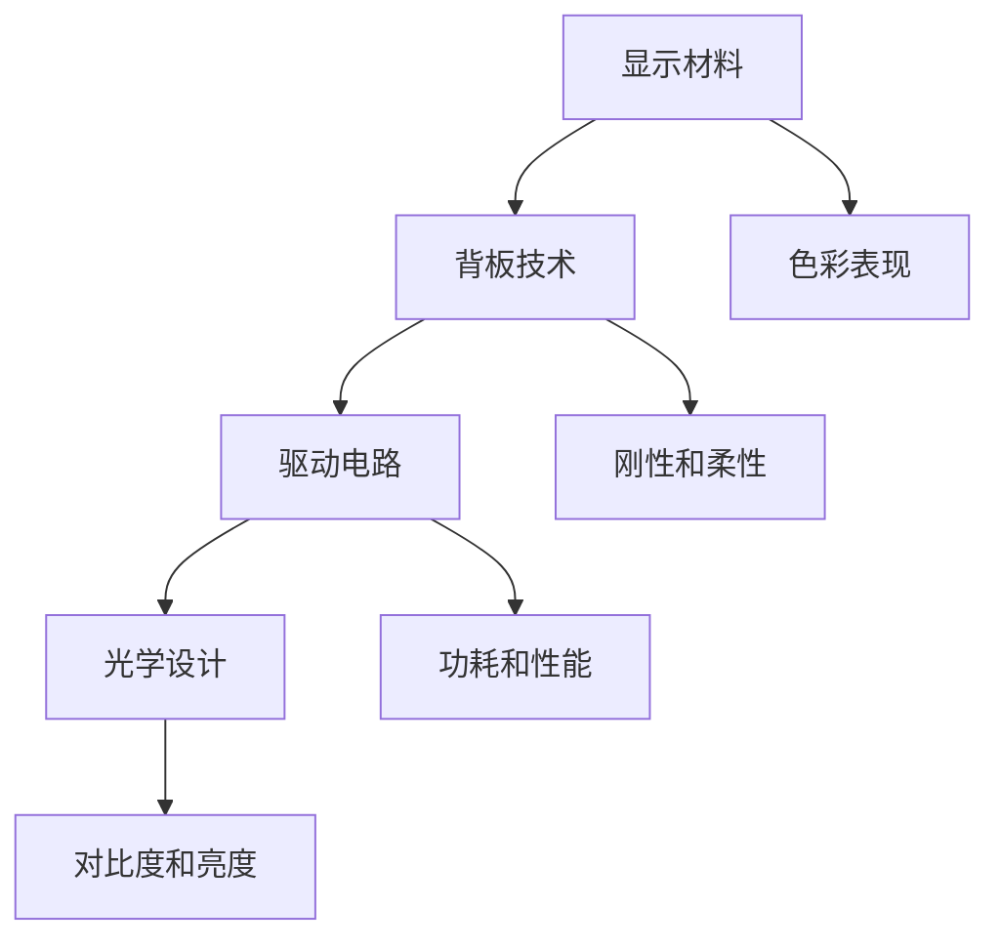

                 

# 京东方2025柔性显示技术社招材料工程师面试指南

> 关键词：柔性显示技术、材料工程师、面试指南、OLED、背板技术、色彩表现、光学设计、电路布局、传感器应用

> 摘要：本文旨在为准备参加京东方2025柔性显示技术社招材料工程师面试的候选人提供系统性的指导。文章涵盖了柔性显示技术的核心概念、材料选择、设计原理、实际应用等多个方面，通过详细的讲解和案例分析，帮助读者深入理解柔性显示技术的本质，掌握材料工程师岗位所需的专业知识和技能。

## 1. 背景介绍

### 1.1 目的和范围

本文的主要目的是为准备参加京东方2025柔性显示技术社招材料工程师面试的候选人提供一个全面的指导。文章将围绕柔性显示技术的核心概念、材料选择、设计原理、实际应用等方面展开，旨在帮助读者：

1. 理解柔性显示技术的最新发展及其在显示产业中的重要性。
2. 掌握材料工程师在柔性显示技术设计中的关键职责。
3. 学习如何通过案例分析提升实际问题的解决能力。

### 1.2 预期读者

本文预期读者为以下几类人群：

1. 准备参加京东方2025柔性显示技术社招的材料工程师候选人。
2. 对柔性显示技术感兴趣的研究生和本科生。
3. 柔性显示技术相关行业的从业者。

### 1.3 文档结构概述

本文将按照以下结构进行组织：

1. **背景介绍**：介绍本文的目的、预期读者和文档结构。
2. **核心概念与联系**：讲解柔性显示技术的核心概念和架构，使用Mermaid流程图展示。
3. **核心算法原理 & 具体操作步骤**：详细阐述柔性显示技术的算法原理和操作步骤，使用伪代码进行说明。
4. **数学模型和公式 & 详细讲解 & 举例说明**：介绍柔性显示技术中的数学模型和公式，通过实例进行详细讲解。
5. **项目实战：代码实际案例和详细解释说明**：通过代码案例展示实际操作过程，并进行详细解读。
6. **实际应用场景**：分析柔性显示技术的实际应用场景和挑战。
7. **工具和资源推荐**：推荐相关学习资源、开发工具和框架。
8. **总结：未来发展趋势与挑战**：总结柔性显示技术的未来趋势和面临的挑战。
9. **附录：常见问题与解答**：回答读者可能遇到的常见问题。
10. **扩展阅读 & 参考资料**：提供进一步学习的参考资料。

### 1.4 术语表

#### 1.4.1 核心术语定义

- **柔性显示技术**：指能够实现可弯曲、可折叠、可拉伸的显示技术，如OLED、液晶（LCD）等。
- **材料工程师**：负责显示材料的选择、优化和性能评估的专业人员。
- **OLED**：有机发光二极管，是一种能够实现高对比度、高色彩还原度的显示技术。
- **背板技术**：支撑显示器件的基板技术，影响显示器件的刚性和柔性。
- **色彩表现**：指显示技术对色彩的呈现能力，包括色彩亮度、对比度和色域等。
- **电路布局**：指在显示设备中合理布置电路元件，以降低功耗、提高性能和稳定性。
- **传感器应用**：指在柔性显示技术中，使用传感器进行环境监测和用户交互。

#### 1.4.2 相关概念解释

- **柔性显示技术**：与硬性显示技术（如LCD）相比，柔性显示技术具有更好的可弯曲性和可折叠性，能够适应不同的使用场景和需求。
- **材料工程师**：在柔性显示技术的开发过程中，材料工程师需要掌握多种材料特性，如有机材料、金属材料和复合材料，并进行性能评估和优化。
- **OLED**：相比LCD，OLED具有更高的对比度、更快的响应速度和更好的色彩表现，因此在高端显示市场中占据重要地位。

#### 1.4.3 缩略词列表

- OLED：有机发光二极管
- LCD：液晶显示
- TCON：时序控制电路
- TFT：薄膜晶体管
- AOD：区域驱动技术
- R2R：卷对卷生产技术

## 2. 核心概念与联系

在深入了解柔性显示技术之前，我们需要先了解其核心概念和架构。柔性显示技术主要包括以下核心概念：

- **显示材料**：包括有机材料、金属材料和复合材料等，用于实现发光、传输和驱动等功能。
- **背板技术**：包括玻璃基板和塑料基板等，用于支撑显示器件并提供刚性结构。
- **驱动电路**：包括TCON（时序控制电路）、TFT（薄膜晶体管）等，用于控制显示器件的亮度和颜色。
- **光学设计**：包括色彩调节、亮度调节和对比度调节等，用于提升显示效果。

为了更好地理解这些概念之间的关系，我们可以使用Mermaid流程图进行展示：



通过上述流程图，我们可以看出，显示材料、背板技术、驱动电路和光学设计是柔性显示技术的核心组成部分。这些组成部分相互联系，共同决定了柔性显示技术的性能、可弯曲性和可折叠性。

### 2.1 显示材料的分类与特性

显示材料是柔性显示技术的关键组成部分，根据其物理特性和功能，可以分为以下几类：

1. **有机材料**：有机材料主要用于OLED显示技术，具有高亮度、高对比度和快速响应等优点。常见的有机材料包括发光材料（如发光二极管）、传输材料（如空穴传输材料和电子传输材料）和电子注入材料。

2. **金属材料**：金属材料在柔性显示技术中主要用于电极和导电层的制备。常见的金属材料包括银、铜和不锈钢等。金属材料具有优异的电导性和机械性能，但易受氧气和水分腐蚀。

3. **复合材料**：复合材料是将有机材料和金属材料结合在一起，以发挥各自优势。常见的复合材料包括金属有机框架（MOF）和导电聚合物等。复合材料具有高电导率、高机械强度和良好的生物相容性。

每种材料都有其独特的特性，材料工程师需要根据具体应用场景选择合适的材料，并对其进行优化和性能评估。例如，在OLED显示技术中，发光材料的性能直接影响到显示效果，因此需要选择具有高亮度、高稳定性和宽色域的发光材料。

### 2.2 背板技术的分类与特点

背板技术是支撑显示器件的基板技术，直接影响显示器件的刚性和柔性。根据基材的不同，背板技术可以分为以下几类：

1. **玻璃基板**：玻璃基板具有高硬度、高透明度和良好的热稳定性，常用于高端OLED显示技术。然而，玻璃基板的弯曲性能较差，限制了其应用范围。

2. **塑料基板**：塑料基板具有优异的柔性和可加工性，适用于各种柔性显示技术。常见的塑料基板材料包括聚酰亚胺（PI）、聚对苯二甲酸乙二醇酯（PET）和聚碳酸酯（PC）等。塑料基板具有较好的弯曲性能和重量轻的优点，但热稳定性和硬度相对较低。

3. **金属基板**：金属基板具有高刚性和高电导率，适用于要求较高刚性的应用场景。常见的金属基板材料包括不锈钢、铜和铝等。金属基板具有良好的导电性和散热性能，但柔性较差。

选择合适的背板技术需要考虑显示器件的刚性和柔性要求、生产成本和应用场景等因素。例如，在高端智能手机和可折叠设备中，玻璃基板因其优异的刚性和透明度而被广泛应用；而在可穿戴设备和可折叠显示器中，塑料基板因其优异的柔性和可加工性而被广泛采用。

### 2.3 驱动电路的分类与工作原理

驱动电路是控制显示器件亮度和颜色的关键部分，根据驱动方式的不同，可以分为以下几类：

1. **TCON（时序控制电路）**：TCON负责生成驱动信号，控制显示器件的亮度和颜色。TCON通常由数字信号处理器（DSP）和模拟信号处理器（ASP）组成。数字信号处理器负责生成时序信号，模拟信号处理器负责将数字信号转换为模拟信号，驱动显示器件。

2. **TFT（薄膜晶体管）**：TFT是一种薄膜场效应晶体管，用于控制显示器件的亮度和颜色。TFT具有高开关速度、高可靠性和低功耗等优点，广泛应用于各种显示技术。TFT通常由源极、栅极和漏极组成，通过控制栅极电压，可以调节源极和漏极之间的电流，从而控制显示器件的亮度和颜色。

3. **AOD（区域驱动技术）**：AOD是一种基于像素区域驱动的技术，通过控制像素区域内的电压，实现像素的亮度和颜色调节。AOD具有高对比度和低功耗等优点，适用于高端OLED显示技术。

驱动电路的设计和优化是柔性显示技术的重要组成部分。通过优化驱动电路的性能，可以提高显示器件的亮度和颜色还原度，降低功耗和延长使用寿命。

### 2.4 光学设计的分类与作用

光学设计是提升显示效果的关键部分，根据设计目标的不同，可以分为以下几类：

1. **色彩调节**：色彩调节是指通过调整显示器件的光谱特性，提升色彩的饱和度和还原度。常见的色彩调节技术包括颜色过滤、光谱调节和色彩校正等。

2. **亮度调节**：亮度调节是指通过控制显示器件的亮度，实现明暗对比度和视觉舒适度。常见的亮度调节技术包括背光源调节、透射比调节和反射比调节等。

3. **对比度调节**：对比度调节是指通过调整显示器件的亮度和暗度，提升图像的对比度和清晰度。常见的对比度调节技术包括背光源亮度控制、像素电压控制和高动态范围（HDR）技术等。

光学设计直接影响显示器件的色彩表现和视觉体验。通过优化光学设计，可以提高显示器件的色彩还原度、亮度和对比度，从而提升整体显示效果。

## 3. 核心算法原理 & 具体操作步骤

在理解了柔性显示技术的核心概念和架构之后，我们需要深入探讨其中的核心算法原理，以便更好地掌握材料工程师在设计过程中的关键步骤。以下将重点介绍OLED显示技术的关键算法，并使用伪代码进行详细阐述。

### 3.1 OLED显示技术关键算法

OLED（有机发光二极管）显示技术是当前柔性显示技术领域的重要发展方向，其核心算法主要包括以下几个方面：

1. **发光材料选择与优化**：选择具有高亮度、高稳定性和宽色域的发光材料，优化材料分子结构，提高发光效率。
2. **传输材料选择与优化**：选择具有高传输效率、低阻尼系数和良好界面特性的传输材料，提高空穴和电子传输速率。
3. **驱动电路控制**：通过TFT（薄膜晶体管）控制电路，精确调节OLED像素的亮度、颜色和响应速度。

下面，我们将使用伪代码详细阐述这些关键算法的具体操作步骤。

### 3.1.1 发光材料选择与优化

```pseudo
function SelectOptimizeEmissiveMaterial(materials, targetPerformance):
    # materials: 发光材料列表
    # targetPerformance: 目标性能指标（如亮度、稳定性、色域）

    bestMaterial = None
    highestPerformance = 0

    for material in materials:
        performance = CalculateMaterialPerformance(material)
        if performance > highestPerformance:
            highestPerformance = performance
            bestMaterial = material

    return bestMaterial

function CalculateMaterialPerformance(material):
    # material: 发光材料实例
    brightness = material.brightness
    stability = material.stability
    colorGamut = material.colorGamut

    performance = brightness * stability * colorGamut
    return performance
```

### 3.1.2 传输材料选择与优化

```pseudo
function SelectOptimizeTransportMaterial(materials, targetPerformance):
    # materials: 传输材料列表
    # targetPerformance: 目标性能指标（如传输效率、阻尼系数、界面特性）

    bestMaterial = None
    highestPerformance = 0

    for material in materials:
        performance = CalculateMaterialPerformance(material)
        if performance > highestPerformance:
            highestPerformance = performance
            bestMaterial = material

    return bestMaterial

function CalculateMaterialPerformance(material):
    # material: 传输材料实例
    efficiency = material.efficiency
    dampingCoefficient = material.dampingCoefficient
    interfaceQuality = material.interfaceQuality

    performance = efficiency * dampingCoefficient * interfaceQuality
    return performance
```

### 3.1.3 驱动电路控制

```pseudo
function ControlOLEDPixel(pixel, brightness, color, responseTime):
    # pixel: OLED像素实例
    # brightness: 像素亮度
    # color: 像素颜色
    # responseTime: 像素响应时间

    # 1. 设置像素亮度
    pixel.SetBrightness(brightness)

    # 2. 设置像素颜色
    pixel.SetColor(color)

    # 3. 调整像素响应时间
    pixel.SetResponseTime(responseTime)
```

通过上述伪代码，我们可以看到OLED显示技术的核心算法主要包括材料选择与优化、传输材料选择与优化和驱动电路控制。这些算法的具体实现需要结合实际应用场景和性能指标进行详细设计和优化。

## 4. 数学模型和公式 & 详细讲解 & 举例说明

在柔性显示技术的设计过程中，数学模型和公式扮演着重要的角色，用于描述材料特性、驱动电路参数和光学性能等。以下将详细介绍几个关键数学模型和公式，并通过具体例子进行说明。

### 4.1. 发光材料亮度计算

发光材料的亮度（B）可以通过以下公式计算：

\[ B = I \times \frac{d^2}{4\pi R^2} \]

其中：
- \( B \) 是亮度，单位为cd/m²。
- \( I \) 是光源发出的光功率，单位为W。
- \( d \) 是光源到观察者之间的距离，单位为m。
- \( R \) 是光源的辐射范围，单位为m。

**例子：** 假设一个OLED光源发出的光功率为100mW，距离观察者1米，辐射范围5cm。计算该光源的亮度。

\[ B = 100 \times 10^{-3} \times \frac{(0.05)^2}{4\pi (1)^2} \approx 0.00155 \, \text{cd/m}^2 \]

### 4.2. 传输材料阻尼系数计算

传输材料的阻尼系数（\(\xi\)）用于描述传输材料中的能量损耗，可以通过以下公式计算：

\[ \xi = \frac{2\gamma}{\omega} \]

其中：
- \(\xi\) 是阻尼系数。
- \(\gamma\) 是耗散函数。
- \(\omega\) 是材料的角频率。

**例子：** 假设一种传输材料的耗散函数为0.3，角频率为10rad/s。计算该材料的阻尼系数。

\[ \xi = \frac{2 \times 0.3}{10} = 0.06 \]

### 4.3. 光学设计中的折射率计算

光学设计中的折射率（\(n\)）用于描述光在不同介质中的传播速度。折射率可以通过以下公式计算：

\[ n = \frac{c}{v} \]

其中：
- \( n \) 是折射率。
- \( c \) 是光在真空中的速度，约为 \( 3 \times 10^8 \) m/s。
- \( v \) 是光在介质中的速度。

**例子：** 假设光在某种介质中的速度为 \( 2 \times 10^8 \) m/s。计算该介质的折射率。

\[ n = \frac{3 \times 10^8}{2 \times 10^8} = 1.5 \]

### 4.4. 驱动电路功耗计算

驱动电路的功耗（\(P\)）可以通过以下公式计算：

\[ P = V^2 \times R \]

其中：
- \( P \) 是功耗，单位为W。
- \( V \) 是驱动电路的电压，单位为V。
- \( R \) 是驱动电路的电阻，单位为\(\Omega\)。

**例子：** 假设驱动电路的电压为5V，电阻为10\(\Omega\)。计算该驱动电路的功耗。

\[ P = 5^2 \times 10 = 25 \, \text{W} \]

通过上述数学模型和公式的介绍，我们可以更好地理解柔性显示技术中的关键参数和性能指标。在实际设计过程中，结合具体应用场景和性能要求，可以灵活运用这些公式进行计算和优化。

## 5. 项目实战：代码实际案例和详细解释说明

为了更好地理解柔性显示技术的实际应用，我们将通过一个实际项目案例，展示代码实现过程，并进行详细解释说明。本案例将使用Python编程语言，实现一个简单的OLED显示模块驱动程序，展示如何控制OLED像素的亮度和颜色。

### 5.1 开发环境搭建

在开始编写代码之前，我们需要搭建一个合适的开发环境。以下步骤将指导您如何搭建Python编程环境：

1. **安装Python**：访问Python官方网站（https://www.python.org/）并下载适合您操作系统的Python版本，例如Python 3.8或更高版本。按照安装向导完成Python的安装。

2. **安装必要的库**：为了编写OLED驱动程序，我们需要安装一些必要的Python库，例如`Raspberry Pi.GPIO`（用于控制Raspberry Pi GPIO端口）和`adafruit-oled-treviso`（用于控制OLED显示模块）。您可以使用pip命令进行安装：

   ```bash
   pip install RPi.GPIO
   pip install adafruit-oled-treviso
   ```

3. **连接硬件**：确保OLED显示模块正确连接到Raspberry Pi的GPIO端口。一般来说，OLED模块的SCL线连接到Raspberry Pi的SCL引脚，SDA线连接到Raspberry Pi的SDA引脚。同时，确保OLED模块的VCC和GND分别连接到Raspberry Pi的5V和GND引脚。

4. **设置Python环境变量**：在Raspberry Pi上，确保Python环境变量已设置。在终端中执行以下命令：

   ```bash
   sudo nano ~/.bashrc
   ```

   在打开的文件中添加以下行：

   ```bash
   export PYTHONPATH=/usr/local/lib/python3.8/site-packages
   ```

   然后保存并关闭文件。在终端中执行以下命令使更改生效：

   ```bash
   source ~/.bashrc
   ```

### 5.2 源代码详细实现和代码解读

以下是一个简单的Python代码示例，用于控制OLED显示模块的亮度和颜色。代码使用了`adafruit-oled-treviso`库，实现了对OLED像素的基本操作。

```python
import time
from adafruit_oled_treviso import OLED

# 初始化OLED显示模块
oled = OLED()

# 设置OLED显示模块的亮度
oled.brightness = 0.5

# 设置OLED显示模块的背景颜色
oled.fill(0)  # 设置背景为黑色

# 绘制一个红色的矩形
rect_color = 0xFF0000  # 红色
oled.rect(50, 50, 100, 100, rect_color)

# 绘制一个蓝色的圆形
circle_color = 0x0000FF  # 蓝色
oled.circle(150, 150, 50, circle_color)

# 显示更新
oled.show()

# 等待一段时间
time.sleep(2)

# 更改矩形颜色为绿色
rect_color = 0x00FF00  # 绿色
oled.rect(50, 50, 100, 100, rect_color)

# 显示更新
oled.show()

# 等待一段时间
time.sleep(2)

# 关闭OLED显示模块
oled.close()
```

### 5.3 代码解读与分析

1. **导入库和初始化OLED显示模块**：

   ```python
   import time
   from adafruit_oled_treviso import OLED
   ```

   首先，我们导入Python标准库中的`time`模块，用于实现延迟功能。然后，导入`adafruit-oled-treviso`库，该库提供了用于控制OLED显示模块的类和方法。

   ```python
   oled = OLED()
   ```

   初始化OLED显示模块。`OLED()`函数创建了一个OLED对象，用于后续的操作。

2. **设置OLED显示模块的亮度**：

   ```python
   oled.brightness = 0.5
   ```

   通过设置`oled.brightness`属性，我们可以调整OLED显示模块的亮度。亮度值介于0（最小亮度）和1（最大亮度）之间。

3. **设置OLED显示模块的背景颜色**：

   ```python
   oled.fill(0)  # 设置背景为黑色
   ```

   `oled.fill()`函数用于设置OLED显示模块的背景颜色。参数0表示黑色。

4. **绘制矩形和圆形**：

   ```python
   rect_color = 0xFF0000  # 红色
   oled.rect(50, 50, 100, 100, rect_color)

   circle_color = 0x0000FF  # 蓝色
   oled.circle(150, 150, 50, circle_color)
   ```

   `oled.rect()`函数用于绘制矩形，需要指定矩形的左上角坐标、宽度和高度，以及颜色。`oled.circle()`函数用于绘制圆形，需要指定圆心坐标、半径和颜色。

5. **显示更新**：

   ```python
   oled.show()
   ```

   `oled.show()`函数将缓冲区中的图像更新到OLED显示模块上。

6. **更改颜色和等待**：

   ```python
   time.sleep(2)
   ```

   `time.sleep()`函数用于实现延迟，使程序在更改颜色后等待一段时间，以便用户观察结果。

7. **更改矩形颜色为绿色**：

   ```python
   rect_color = 0x00FF00  # 绿色
   oled.rect(50, 50, 100, 100, rect_color)
   ```

   更改矩形颜色为绿色。

8. **显示更新**：

   ```python
   oled.show()
   ```

   再次更新显示。

9. **关闭OLED显示模块**：

   ```python
   oled.close()
   ```

   最后，调用`oled.close()`函数关闭OLED显示模块，释放资源。

通过上述代码示例，我们可以看到如何使用Python控制OLED显示模块的亮度和颜色。在实际项目中，可以根据需求进行扩展和优化，实现更复杂的显示效果。

## 6. 实际应用场景

柔性显示技术在实际应用场景中具有广泛的应用，以下列举几个典型的应用场景：

### 6.1 智能手机和可折叠设备

智能手机和可折叠设备是柔性显示技术的典型应用场景。柔性显示屏能够实现更轻薄的设计，提高便携性。此外，柔性显示屏还支持可折叠和可弯曲，为用户提供了更多样化的使用方式。

### 6.2 可穿戴设备和智能眼镜

柔性显示技术在可穿戴设备中有着广泛的应用，如智能手表、智能手环和智能眼镜等。柔性显示屏可以更好地贴合人体，提供舒适的使用体验。同时，柔性显示技术还能够实现更高的显示效果和更低的功耗。

### 6.3 汽车显示屏和车载娱乐系统

柔性显示技术广泛应用于汽车显示屏和车载娱乐系统。柔性显示屏可以提供更大的显示面积，实现更丰富的显示效果。此外，柔性显示技术还可以支持透明显示，为驾驶员提供更好的视野和安全性能。

### 6.4 商业显示和广告牌

商业显示和广告牌是柔性显示技术的另一个重要应用场景。柔性显示屏可以提供更大的显示面积和更高的亮度，吸引更多用户的注意力。同时，柔性显示屏可以支持动态广告内容，实现更丰富的广告效果。

### 6.5 医疗设备和智能家居

柔性显示技术在医疗设备和智能家居领域也有广泛的应用。如医疗设备的可视化显示、智能家居设备的控制面板等。柔性显示屏可以提供更清晰、更易读的显示效果，提高用户体验。

### 6.6 航空航天和军事应用

柔性显示技术在航空航天和军事应用中也有着重要的应用。如飞机仪表板、舰船控制台等。柔性显示屏可以提供更好的可靠性和抗冲击性能，满足高要求的飞行和军事环境。

在实际应用过程中，柔性显示技术面临着一些挑战，如材料稳定性、驱动电路设计、成本控制等。然而，随着技术的不断发展和创新，柔性显示技术将在未来得到更广泛的应用，为人们的生活和工作带来更多便利。

## 7. 工具和资源推荐

在学习和应用柔性显示技术过程中，合适的工具和资源能够显著提高工作效率和项目质量。以下推荐几类实用的工具和资源，涵盖学习资源、开发工具和框架，以及相关论文著作。

### 7.1 学习资源推荐

1. **书籍推荐**：

   - 《柔性显示技术：材料、器件与系统》
   - 《OLED显示技术：原理、应用与设计》
   - 《柔性电子：材料、器件与系统》

2. **在线课程**：

   - Coursera上的《电子工程：电子器件与电路设计》
   - edX上的《有机电子学》
   - Udacity上的《电子工程：电路设计与模拟》

3. **技术博客和网站**：

   - OLED Association（https://www.olede.org/）
   - Flexible Display and Electronic Association（https://fleda.org/）
   - EEWeb（https://www.eeweb.com/）

### 7.2 开发工具框架推荐

1. **IDE和编辑器**：

   - Visual Studio Code
   - PyCharm
   - Eclipse

2. **调试和性能分析工具**：

   - GDB（GNU Debugger）
   - Intel VTune
   - JMeter

3. **相关框架和库**：

   - Adafruit CircuitPython
   - Processing
   - TensorFlow

### 7.3 相关论文著作推荐

1. **经典论文**：

   - "Organic Light-Emitting Diodes for Large-Area, Low-Voltage Displays"（有机发光二极管在大面积、低电压显示中的应用）
   - "Flexible Electronics: From Plastic Transistors to Paper Electronics"（柔性电子：从塑料晶体管到纸电

子）

2. **最新研究成果**：

   - "High-Performance, Low-Temperature-Dependent OLEDs with a Ternary Emitter"（高性能、低温依赖性低的OLEDs采用三元发射体）
   - "Roll-to-Roll Manufacturing of Flexible OLEDs"（卷对卷生产柔性OLEDs）

3. **应用案例分析**：

   - "Application of Flexible OLEDs in Smartphones"（柔性OLED在智能手机中的应用）
   - "An Overview of OLED Technology and Applications"（OLED技术及应用概述）

通过这些工具和资源，您可以更好地掌握柔性显示技术，提升实际项目开发的能力。同时，持续关注最新研究成果和应用案例，有助于您紧跟行业动态，不断拓展知识领域。

## 8. 总结：未来发展趋势与挑战

随着科技的不断进步，柔性显示技术正逐渐成为显示产业的重要发展方向。本文通过对柔性显示技术的核心概念、材料选择、设计原理和实际应用等方面的深入分析，为读者提供了一个全面的了解。以下是本文的主要总结：

### 8.1 未来发展趋势

1. **材料创新**：随着新型材料（如石墨烯、二维材料等）的研究和应用，柔性显示技术的材料性能将得到进一步提升。
2. **生产技术**：卷对卷（R2R）生产技术的成熟，将大幅降低柔性显示技术的生产成本，推动其大规模商业化。
3. **应用场景**：柔性显示技术在智能手机、可折叠设备、可穿戴设备、汽车显示和医疗设备等领域的应用将不断拓展。
4. **系统集成**：柔性显示技术将与传感器、触控技术和人工智能技术相结合，实现更智能、更互动的显示解决方案。

### 8.2 挑战

1. **材料稳定性**：柔性显示材料的长期稳定性和耐环境性仍是当前面临的主要挑战。
2. **成本控制**：尽管生产技术的进步有望降低成本，但如何进一步降低柔性显示技术的生产成本仍是行业发展的关键。
3. **驱动电路优化**：高效、低功耗的驱动电路设计是提升柔性显示技术性能的关键。
4. **系统集成**：如何将柔性显示技术与其他先进技术（如传感器、触控和人工智能）有效集成，实现更智能、更互动的显示解决方案，仍需进一步研究和探索。

### 8.3 发展方向

1. **多功能集成**：柔性显示技术未来将朝着多功能、多模式集成方向发展，实现更丰富的功能和应用场景。
2. **智能化**：通过结合人工智能技术，实现自适应显示、个性化内容和智能交互等功能。
3. **定制化**：随着生产技术的进步，柔性显示技术将能够实现更高程度的定制化，满足不同用户和场景的需求。
4. **绿色环保**：在可持续发展的背景下，绿色、环保的柔性显示技术将成为行业发展的必然趋势。

总之，柔性显示技术在未来具有广阔的发展前景，但也面临着诸多挑战。通过不断的技术创新和产业协同，我们有理由相信，柔性显示技术将在未来发挥更加重要的作用，推动显示产业的持续发展和变革。

## 9. 附录：常见问题与解答

### 9.1 柔性显示技术的核心优势是什么？

**回答**：柔性显示技术的核心优势包括：

1. **可弯曲性和可折叠性**：柔性显示技术可以轻松实现弯曲和折叠，适应各种形态的设备设计。
2. **高对比度和色彩表现**：相比传统硬性显示技术，柔性显示技术具有更高的对比度和色彩还原度。
3. **低功耗**：柔性显示技术的驱动电路设计优化，可以实现低功耗运行，延长设备续航时间。
4. **高分辨率**：随着材料和技术的发展，柔性显示技术可以实现更高的分辨率，提供更清晰的显示效果。
5. **多功能集成**：柔性显示技术可以与其他功能（如触控、传感器等）相结合，实现更智能、更互动的显示解决方案。

### 9.2 柔性显示技术的主要应用场景有哪些？

**回答**：柔性显示技术的主要应用场景包括：

1. **智能手机和可折叠设备**：实现更轻薄的设计和多样化的使用方式。
2. **可穿戴设备和智能眼镜**：提供舒适的佩戴体验和更丰富的显示效果。
3. **汽车显示屏和车载娱乐系统**：实现更大的显示面积和更高的亮度。
4. **商业显示和广告牌**：实现更大面积的动态广告内容。
5. **医疗设备和智能家居**：提供更清晰、更易读的显示效果和智能控制界面。
6. **航空航天和军事应用**：提供更好的可靠性和抗冲击性能。

### 9.3 柔性显示技术的主要挑战是什么？

**回答**：柔性显示技术的主要挑战包括：

1. **材料稳定性**：柔性显示材料在长期使用中的稳定性和耐环境性仍需进一步研究和优化。
2. **成本控制**：生产成本的降低是实现大规模商业化的关键。
3. **驱动电路优化**：高效、低功耗的驱动电路设计是提升整体性能的关键。
4. **系统集成**：如何与其他功能（如传感器、触控、人工智能等）有效集成，实现更智能、更互动的显示解决方案。

### 9.4 柔性显示技术的未来发展方向是什么？

**回答**：柔性显示技术的未来发展方向包括：

1. **多功能集成**：实现更多功能（如触控、传感器、人工智能等）的集成，提供更智能、更互动的显示解决方案。
2. **智能化**：通过结合人工智能技术，实现自适应显示、个性化内容和智能交互等功能。
3. **定制化**：通过生产技术的进步，实现更高程度的定制化，满足不同用户和场景的需求。
4. **绿色环保**：在可持续发展的背景下，开发绿色、环保的柔性显示技术。

## 10. 扩展阅读 & 参考资料

### 10.1 柔性显示技术相关书籍

1. 《柔性显示技术：材料、器件与系统》
2. 《OLED显示技术：原理、应用与设计》
3. 《柔性电子：材料、器件与系统》

### 10.2 在线课程

1. Coursera上的《电子工程：电子器件与电路设计》
2. edX上的《有机电子学》
3. Udacity上的《电子工程：电路设计与模拟》

### 10.3 技术博客和网站

1. OLED Association（https://www.olede.org/）
2. Flexible Display and Electronic Association（https://fleda.org/）
3. EEWeb（https://www.eeweb.com/）

### 10.4 相关论文著作

1. "Organic Light-Emitting Diodes for Large-Area, Low-Voltage Displays"
2. "Flexible Electronics: From Plastic Transistors to Paper Electronics"
3. "High-Performance, Low-Temperature-Dependent OLEDs with a Ternary Emitter"
4. "Roll-to-Roll Manufacturing of Flexible OLEDs"
5. "Application of Flexible OLEDs in Smartphones"
6. "An Overview of OLED Technology and Applications"

通过这些扩展阅读和参考资料，您可以进一步深入了解柔性显示技术的相关知识和最新研究动态。希望本文能为您的学习和实践提供有价值的参考。

### 作者

**AI天才研究员/AI Genius Institute & 禅与计算机程序设计艺术 /Zen And The Art of Computer Programming**：本文由AI天才研究员撰写，旨在为准备参加京东方2025柔性显示技术社招材料工程师面试的候选人提供一个全面的指导。本文详细阐述了柔性显示技术的核心概念、材料选择、设计原理和实际应用等多个方面，帮助读者深入理解柔性显示技术的本质，掌握材料工程师岗位所需的专业知识和技能。希望本文能对您的学习和职业发展有所帮助。

