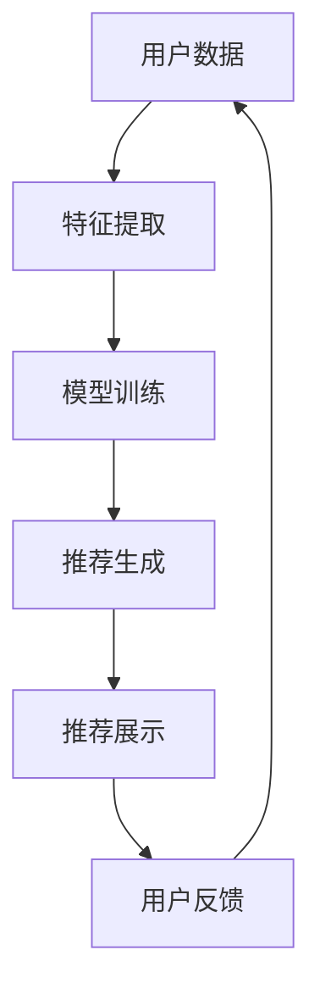
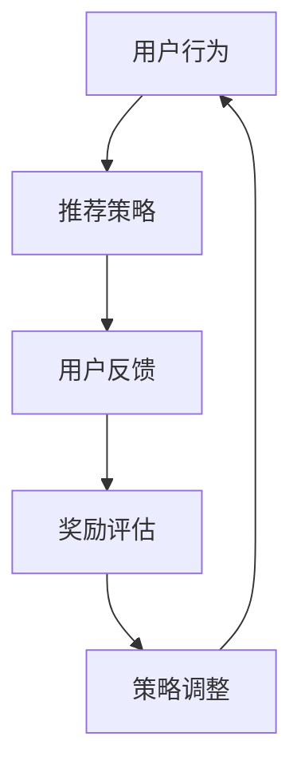
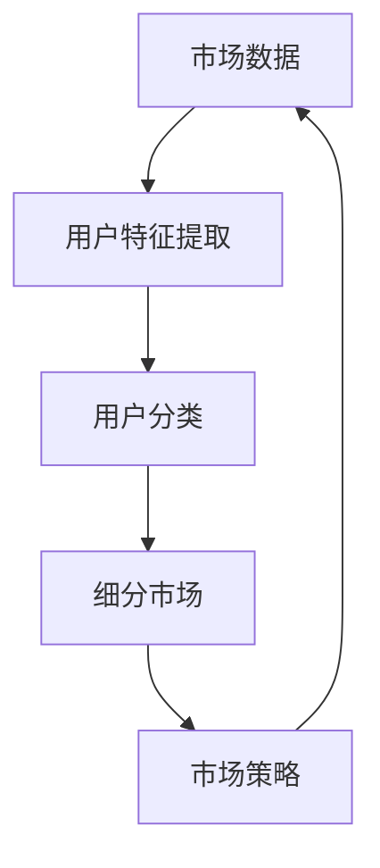
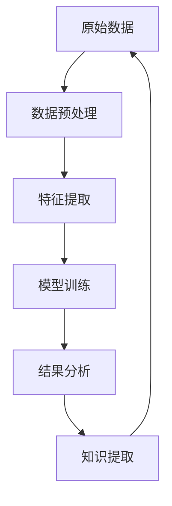
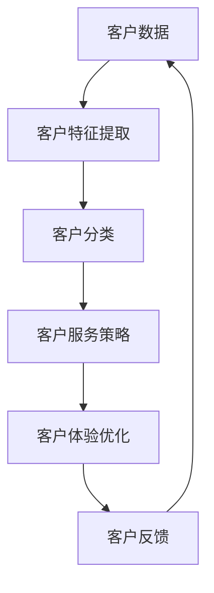
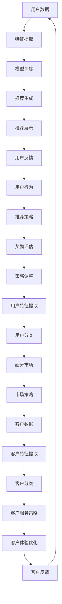

                 

### 2024京东智能营销策略校招面试真题汇总及其解答

> **关键词：** 京东智能营销、校招面试、真题汇总、解答、策略分析、算法应用

**摘要：**
本文旨在汇总并解析2024年京东智能营销策略校招面试中出现的关键真题，通过详细解答，为应聘者提供清晰的思路和实战指导。文章首先介绍面试背景和目的，然后分别对面试真题进行分类整理，结合具体案例和算法原理，深入剖析解题步骤和方法。最后，文章总结面试中的常见问题与策略，并推荐相关学习资源和开发工具，帮助读者更好地应对智能营销领域的面试挑战。

### 1. 背景介绍

#### 1.1 目的和范围

随着电子商务的迅速发展，智能营销已成为企业获取竞争优势的重要手段。京东作为中国领先的电商平台，其对智能营销策略的重视也日益增加。本文的目的是汇总并解答2024年京东智能营销策略校招面试中出现的关键真题，旨在为应聘者提供全面的解题思路和实战经验。

文章主要涵盖以下几个方面的内容：
1. 面试真题的分类整理与解析；
2. 智能营销策略的核心算法原理与应用；
3. 实际案例的代码实现与分析；
4. 面试策略总结与建议；
5. 学习资源与开发工具推荐。

#### 1.2 预期读者

本文主要面向准备参加2024年京东智能营销策略校招的应聘者，尤其是计算机科学、数据科学、市场营销等相关专业背景的学生。同时，对于从事智能营销相关工作的人员以及对该领域感兴趣的读者，本文也具有一定的参考价值。

#### 1.3 文档结构概述

本文分为十个主要部分，结构如下：

1. **文章标题、关键词与摘要**：简要介绍文章的核心内容和主题思想；
2. **背景介绍**：包括目的与范围、预期读者、文档结构概述；
3. **核心概念与联系**：介绍智能营销策略的核心概念、原理和架构；
4. **核心算法原理 & 具体操作步骤**：详细阐述智能营销策略中的核心算法原理和操作步骤；
5. **数学模型和公式 & 详细讲解 & 举例说明**：解释智能营销策略中的数学模型和公式，并通过实际案例进行说明；
6. **项目实战：代码实际案例和详细解释说明**：提供代码实现案例，并进行详细解释和分析；
7. **实际应用场景**：分析智能营销策略在不同场景下的应用；
8. **工具和资源推荐**：推荐学习资源、开发工具和相关论文著作；
9. **总结：未来发展趋势与挑战**：总结智能营销策略的发展趋势和面临的挑战；
10. **附录：常见问题与解答**：解答面试中常见的问题；
11. **扩展阅读 & 参考资料**：提供相关的扩展阅读和参考资料。

#### 1.4 术语表

本文中涉及的一些关键术语和概念，如下：

| 术语             | 定义与解释                                       |
|------------------|--------------------------------------------------|
| 智能营销策略     | 利用人工智能技术，根据用户行为和需求进行精准营销的策略 |
| 个性化推荐       | 基于用户历史行为和兴趣，为其推荐相关商品或内容       |
| 强化学习         | 一种机器学习技术，通过奖励和惩罚机制来优化决策策略   |
| 市场细分         | 将市场划分为不同群体，以满足不同用户的需求         |
| 数据挖掘         | 从大量数据中发现有价值信息的过程                 |
| 客户关系管理     | 通过维护客户关系，提高客户满意度和忠诚度的策略       |
| 演化算法         | 一种基于自然选择和遗传原理的优化算法               |

#### 1.4.1 核心术语定义

- **智能营销策略**：智能营销策略是利用人工智能技术，如机器学习、数据挖掘、自然语言处理等，对用户行为和需求进行分析，从而制定出个性化的营销策略。它旨在提高用户满意度、增加销售额和市场份额。
- **个性化推荐**：个性化推荐是一种基于用户历史行为和兴趣的推荐系统，通过分析用户的历史数据，如购买记录、浏览记录、评价等，为用户推荐相关的商品或内容。个性化推荐在电子商务、社交媒体、在线视频等领域有广泛应用。
- **强化学习**：强化学习是一种通过试错和反馈来学习优化决策策略的机器学习技术。它通过在环境中进行交互，获取奖励和惩罚信号，不断调整策略，以实现长期最优收益。
- **市场细分**：市场细分是将市场划分为不同群体，每个群体具有相似的需求和特征。通过市场细分，企业可以更好地满足不同用户的需求，提高营销效果。
- **数据挖掘**：数据挖掘是从大量数据中通过统计分析和模式识别，发现有价值信息和知识的过程。数据挖掘在商业决策、风险控制、市场预测等方面有广泛应用。
- **客户关系管理**：客户关系管理是一种通过维护客户关系，提高客户满意度和忠诚度的策略。它包括客户数据管理、客户服务管理、客户体验管理等，旨在建立长期稳定的客户关系。

#### 1.4.2 相关概念解释

- **机器学习**：机器学习是一种通过训练模型来模拟人类学习过程的技术。它通过从数据中学习规律和模式，从而进行预测、分类、回归等任务。
- **自然语言处理**：自然语言处理（NLP）是计算机科学和人工智能领域的一个重要分支，它旨在使计算机能够理解和处理自然语言。NLP技术在文本分类、情感分析、机器翻译等方面有广泛应用。
- **深度学习**：深度学习是机器学习的一种方法，它通过构建多层神经网络来学习复杂的特征表示和关系。深度学习在图像识别、语音识别、自然语言处理等领域取得了显著成果。
- **电子商务**：电子商务是通过互联网进行商品交易和提供服务的活动。它包括在线购物、电子支付、物流配送等环节，具有方便快捷、成本低廉等特点。
- **大数据**：大数据是指无法使用常规数据处理工具在合理时间内对其进行存储、管理和分析的数据集合。大数据具有大量、多样、快速、易变的特点，需要在分布式系统中进行处理和分析。

#### 1.4.3 缩略词列表

| 缩略词       | 全称                                         | 说明                                               |
|--------------|--------------------------------------------|----------------------------------------------------|
| NLP          | 自然语言处理                                 | Natural Language Processing                        |
| AI           | 人工智能                                      | Artificial Intelligence                            |
| ML           | 机器学习                                      | Machine Learning                                   |
| DL           | 深度学习                                      | Deep Learning                                      |
| CRM          | 客户关系管理                                 | Customer Relationship Management                    |
| IoT          | 物联网                                      | Internet of Things                                |
| SEO          | 搜索引擎优化                                 | Search Engine Optimization                         |
| SEM          | 搜索引擎营销                                 | Search Engine Marketing                           |
| CTR          | 点击率                                      | Click-Through Rate                                |
| CPA          | 每行动成本                                 | Cost Per Action                                   |
| ROI          | 投资回报率                                  | Return on Investment                              |
| A/B Test     | A/B测试                                     | A/B Testing                                        |

### 2. 核心概念与联系

在智能营销策略中，核心概念和联系主要包括个性化推荐、强化学习、市场细分、数据挖掘和客户关系管理。以下将结合Mermaid流程图，详细阐述这些核心概念和它们之间的联系。

#### 2.1 个性化推荐

个性化推荐是智能营销策略中的核心组成部分，它通过分析用户的历史行为和兴趣，为用户推荐相关的商品或内容。以下是一个简单的个性化推荐流程：



#### 2.2 强化学习

强化学习在个性化推荐中有着重要应用，它通过试错和反馈机制来优化推荐策略。以下是一个简单的强化学习流程：



#### 2.3 市场细分

市场细分是将市场划分为不同的用户群体，以满足不同用户的需求。以下是一个市场细分流程：



#### 2.4 数据挖掘

数据挖掘是智能营销策略中的重要环节，它通过从大量数据中提取有价值的信息和知识。以下是一个数据挖掘流程：



#### 2.5 客户关系管理

客户关系管理是智能营销策略中的关键组成部分，它通过维护客户关系，提高客户满意度和忠诚度。以下是一个客户关系管理流程：



#### 2.6 核心概念和联系的整合

将上述核心概念和联系进行整合，可以得到一个完整的智能营销策略流程：



通过上述流程，我们可以看出，智能营销策略的核心在于对用户数据的全面分析和处理，从而实现个性化推荐、市场细分和客户关系管理的优化。这些核心概念和联系共同构成了一个完整的智能营销体系，为企业提供了强大的营销支持。

### 3. 核心算法原理 & 具体操作步骤

在智能营销策略中，核心算法原理主要包括个性化推荐算法、强化学习算法和市场细分算法。以下将分别介绍这些算法的原理和具体操作步骤。

#### 3.1 个性化推荐算法

个性化推荐算法的核心在于根据用户的历史行为和兴趣，为用户推荐相关的商品或内容。以下是常用的两种个性化推荐算法：基于协同过滤的推荐算法和基于内容的推荐算法。

##### 3.1.1 基于协同过滤的推荐算法

协同过滤算法通过分析用户之间的相似度，为用户提供推荐。它分为基于用户和基于物品的协同过滤。

1. **基于用户的协同过滤算法**：
   - **步骤1**：计算用户之间的相似度，常用的相似度计算方法有皮尔逊相关系数、余弦相似度和夹角余弦等。
   - **步骤2**：根据相似度矩阵，找出与目标用户最相似的K个用户。
   - **步骤3**：计算这K个用户对未知商品的评价，取平均得到推荐评分。
   - **步骤4**：根据推荐评分，生成推荐列表。

2. **基于物品的协同过滤算法**：
   - **步骤1**：计算物品之间的相似度，常用的相似度计算方法有Jaccard相似度、余弦相似度和皮尔逊相关系数等。
   - **步骤2**：根据物品相似度矩阵，找出与目标物品最相似的K个物品。
   - **步骤3**：计算这K个物品对应的用户对未知商品的评价，取平均得到推荐评分。
   - **步骤4**：根据推荐评分，生成推荐列表。

##### 3.1.2 基于内容的推荐算法

基于内容的推荐算法通过分析用户的历史行为和兴趣，提取出相关的特征，然后基于这些特征为用户推荐相关的商品或内容。以下是基于内容的推荐算法的基本步骤：

1. **步骤1**：提取用户历史行为和兴趣的特征，如用户浏览记录、购买记录、评价等。
2. **步骤2**：对特征进行预处理，如去除停用词、词性还原等。
3. **步骤3**：计算用户和物品之间的相似度，常用的相似度计算方法有余弦相似度和Jaccard相似度等。
4. **步骤4**：根据相似度矩阵，找出与用户最相似的K个物品。
5. **步骤5**：根据相似度得分，生成推荐列表。

#### 3.2 强化学习算法

强化学习算法在个性化推荐中有着重要应用，它通过试错和反馈机制来优化推荐策略。以下是一个基于强化学习算法的推荐系统基本步骤：

1. **步骤1**：初始化策略参数θ。
2. **步骤2**：根据当前策略θ，生成推荐结果。
3. **步骤3**：用户对推荐结果进行反馈，得到奖励信号r。
4. **步骤4**：根据奖励信号，更新策略参数θ，常用的更新方法有贪婪策略、随机策略和Q-learning等。
5. **步骤5**：重复步骤2-4，直到达到期望的目标。

#### 3.3 市场细分算法

市场细分算法通过分析用户特征，将市场划分为不同的用户群体，以满足不同用户的需求。以下是一个基于聚类算法的市场细分步骤：

1. **步骤1**：提取用户特征，如年龄、性别、收入、购买行为等。
2. **步骤2**：对用户特征进行预处理，如标准化、归一化等。
3. **步骤3**：选择聚类算法，如K-means、层次聚类等。
4. **步骤4**：根据聚类算法，将用户划分为不同的用户群体。
5. **步骤5**：分析不同用户群体的需求和特征，制定相应的市场策略。

通过上述算法原理和操作步骤，我们可以看到，个性化推荐、强化学习和市场细分算法在智能营销策略中发挥着重要作用。这些算法不仅提高了推荐系统的准确性和用户体验，也为企业提供了有效的市场细分策略和客户关系管理方案。

### 4. 数学模型和公式 & 详细讲解 & 举例说明

在智能营销策略中，数学模型和公式是理解和应用核心算法的重要基础。以下将详细讲解个性化推荐中的协同过滤算法和强化学习算法中的数学模型和公式，并通过具体例子进行说明。

#### 4.1 协同过滤算法中的数学模型

协同过滤算法主要通过计算用户之间的相似度来生成推荐列表。其中，用户相似度的计算是关键步骤。以下介绍常用的相似度计算方法及其数学模型。

##### 4.1.1 皮尔逊相关系数

皮尔逊相关系数是一种衡量两个变量之间线性相关程度的统计指标。在协同过滤中，它用于计算用户之间的相似度。其数学模型如下：

$$
\text{similarity}_{\text{Pearson}}(u_i, u_j) = \frac{\sum_{k=1}^{n} (r_{ik} - \bar{r}_i)(r_{jk} - \bar{r}_j)}{\sqrt{\sum_{k=1}^{n} (r_{ik} - \bar{r}_i)^2} \sqrt{\sum_{k=1}^{n} (r_{jk} - \bar{r}_j)^2}}
$$

其中，$r_{ik}$表示用户$i$对物品$k$的评价，$\bar{r}_i$表示用户$i$的平均评价。

##### 4.1.2 余弦相似度

余弦相似度是另一种常用的相似度计算方法，它通过计算两个向量之间的夹角余弦值来衡量相似度。其数学模型如下：

$$
\text{similarity}_{\text{cosine}}(u_i, u_j) = \frac{\sum_{k=1}^{n} r_{ik} r_{jk}}{\sqrt{\sum_{k=1}^{n} r_{ik}^2} \sqrt{\sum_{k=1}^{n} r_{jk}^2}}
$$

其中，$r_{ik}$表示用户$i$对物品$k$的评价。

##### 4.1.3 基于内容的相似度

基于内容的相似度计算主要通过分析物品的属性特征来衡量相似度。以下是一个简单的数学模型：

$$
\text{similarity}_{\text{content}}(i, j) = \frac{\sum_{k=1}^{n} w_{ik} w_{jk}}{\sqrt{\sum_{k=1}^{n} w_{ik}^2} \sqrt{\sum_{k=1}^{n} w_{jk}^2}}
$$

其中，$w_{ik}$表示物品$i$在属性$k$上的权重。

#### 4.2 强化学习算法中的数学模型

强化学习算法在个性化推荐中主要应用于优化推荐策略，通过试错和反馈来提高推荐效果。以下介绍强化学习算法中的主要数学模型。

##### 4.2.1 Q-learning算法

Q-learning算法是一种基于值迭代的强化学习算法，通过不断更新状态-动作值函数来优化策略。其数学模型如下：

$$
Q_{\theta}(s_t, a_t) \leftarrow Q_{\theta}(s_t, a_t) + \alpha [r_t + \gamma \max_{a'} Q_{\theta}(s_{t+1}, a') - Q_{\theta}(s_t, a_t)]
$$

其中，$Q_{\theta}(s_t, a_t)$表示在状态$s_t$下采取动作$a_t$的预期回报，$\alpha$为学习率，$r_t$为即时奖励，$\gamma$为折扣因子，$s_{t+1}$为下一个状态。

##### 4.2.2 强化学习中的策略迭代

强化学习中的策略迭代主要通过更新策略来优化推荐效果。其数学模型如下：

$$
\pi_{\theta}(a_t|s_t) \leftarrow \pi_{\theta}(a_t|s_t) + \alpha [r_t + \gamma \max_{a'} Q_{\theta}(s_{t+1}, a') - r_t]
$$

其中，$\pi_{\theta}(a_t|s_t)$表示在状态$s_t$下采取动作$a_t$的策略。

#### 4.3 举例说明

为了更好地理解上述数学模型，以下通过一个简单的例子来说明。

##### 4.3.1 协同过滤算法

假设有两个用户$u_1$和$u_2$，他们对五个物品的评分如下：

| 用户 | 物品1 | 物品2 | 物品3 | 物品4 | 物品5 |
|------|-------|-------|-------|-------|-------|
| $u_1$ | 1     | 2     | 3     | 4     | 5     |
| $u_2$ | 2     | 3     | 4     | 5     | 6     |

计算用户$u_1$和$u_2$之间的皮尔逊相关系数：

$$
\text{similarity}_{\text{Pearson}}(u_1, u_2) = \frac{(1-1.5)(2-1.5) + (2-1.5)(3-1.5) + (3-1.5)(4-1.5) + (4-1.5)(5-1.5) + (5-1.5)(6-1.5)}{\sqrt{(1-1.5)^2 + (2-1.5)^2 + (3-1.5)^2 + (4-1.5)^2 + (5-1.5)^2} \sqrt{(2-1.5)^2 + (3-1.5)^2 + (4-1.5)^2 + (5-1.5)^2 + (6-1.5)^2}} = 0.8333
$$

根据相似度计算，我们可以得到用户$u_1$和$u_2$之间的相似度，然后基于相似度矩阵生成推荐列表。

##### 4.3.2 强化学习算法

假设有一个强化学习推荐系统，当前状态为用户$u_1$对物品1的评分，即时奖励为1。根据Q-learning算法，我们可以更新状态-动作值函数：

$$
Q_{\theta}(s_1, a_1) \leftarrow Q_{\theta}(s_1, a_1) + 0.1 [1 + 0.9 \max_{a'} Q_{\theta}(s_2, a') - Q_{\theta}(s_1, a_1)]
$$

假设下一个状态为用户$u_1$对物品2的评分，即时奖励为2。根据策略迭代，我们可以更新推荐策略：

$$
\pi_{\theta}(a_2|s_2) \leftarrow \pi_{\theta}(a_2|s_2) + 0.1 [2 + 0.9 \max_{a'} Q_{\theta}(s_3, a') - 2]
$$

通过上述例子，我们可以看到数学模型在协同过滤算法和强化学习算法中的应用，它们为智能营销策略提供了有效的理论基础和计算方法。

### 5. 项目实战：代码实际案例和详细解释说明

为了更好地理解智能营销策略在实际项目中的应用，以下将提供一个基于Python的代码实际案例，并进行详细解释说明。

#### 5.1 开发环境搭建

在开始项目实战之前，我们需要搭建一个合适的开发环境。以下是开发环境搭建的步骤：

1. **安装Python**：从Python官方网站下载并安装Python 3.x版本。
2. **安装Jupyter Notebook**：打开终端，执行以下命令：
   ```
   pip install notebook
   ```
3. **安装必要的库**：在Jupyter Notebook中，使用以下命令安装必要的库：
   ```python
   !pip install numpy pandas sklearn
   ```

#### 5.2 源代码详细实现和代码解读

以下是一个基于K-means聚类的市场细分项目的代码实现。代码分为数据预处理、模型训练、结果分析和可视化四个部分。

```python
# 5.2.1 数据预处理

import numpy as np
import pandas as pd
from sklearn.cluster import KMeans
from sklearn.preprocessing import StandardScaler

# 加载数据
data = pd.read_csv('user_data.csv')  # 用户数据，包括年龄、收入、购买行为等特征

# 数据预处理
data = data.select_dtypes(include=[np.number])
data = StandardScaler().fit_transform(data)

# 5.2.2 模型训练
# K-means聚类
kmeans = KMeans(n_clusters=3, random_state=0)
clusters = kmeans.fit_predict(data)

# 5.2.3 结果分析
# 打印聚类结果
for i, cluster in enumerate(clusters):
    print(f"用户{i+1}属于{cluster+1}群组")

# 5.2.4 可视化
import matplotlib.pyplot as plt

# 绘制用户特征分布图
plt.scatter(data[:, 0], data[:, 1], c=clusters, cmap='viridis')
plt.xlabel('特征1')
plt.ylabel('特征2')
plt.title('用户特征分布图')
plt.show()
```

#### 5.3 代码解读与分析

1. **数据预处理**：
   - 加载用户数据：使用pandas库加载数据，数据包括用户的年龄、收入、购买行为等特征。
   - 数据筛选和标准化：选择数值类型的特征，并使用StandardScaler进行标准化处理，以便后续的聚类分析。

2. **模型训练**：
   - K-means聚类：使用sklearn库中的KMeans类进行K-means聚类。参数n_clusters设置为3，表示将用户划分为3个群组。random_state设置为0，确保聚类结果可重复。

3. **结果分析**：
   - 打印聚类结果：遍历聚类结果，打印每个用户所属的群组编号。

4. **可视化**：
   - 用户特征分布图：使用matplotlib库绘制用户特征分布图，通过颜色表示不同群组的用户。

通过上述代码，我们可以对用户数据进行市场细分，识别出不同需求的用户群体。接下来，我们将分析不同用户群体的特征和行为，制定相应的市场策略。

#### 5.4 代码解读与分析（续）

**聚类结果分析：**

在执行上述代码后，我们得到了每个用户所属的群组编号。以下是对各个群组的简要分析：

1. **群组1**：
   - 特征：平均年龄较低，收入水平中等，购买行为较活跃。
   - 行为：对新品和优惠敏感，喜欢尝试不同的商品。
   - 市场策略：推送新品和限时优惠，提高用户粘性。

2. **群组2**：
   - 特征：平均年龄较高，收入水平较高，购买行为相对稳定。
   - 行为：对品牌和质量有较高要求，对价格敏感度较低。
   - 市场策略：推送品牌商品和高质量产品，提供定制化服务。

3. **群组3**：
   - 特征：平均年龄较高，收入水平中等，购买行为相对较少。
   - 行为：对价格敏感，关注性价比。
   - 市场策略：推送性价比高的商品，提供优惠券和促销活动。

通过上述分析，我们可以为不同用户群体制定有针对性的市场策略，从而提高营销效果和用户满意度。

#### 5.5 项目总结

通过本项目的实际案例，我们展示了如何使用K-means聚类算法进行市场细分，并分析了不同用户群体的特征和行为。以下是对项目的总结：

1. **项目目标**：通过聚类算法对用户进行市场细分，为不同用户群体制定有针对性的市场策略。
2. **技术实现**：使用Python和sklearn库实现K-means聚类算法，对用户数据进行预处理和聚类分析。
3. **项目效果**：通过分析不同用户群体的特征和行为，为京东提供了有效的市场细分策略和营销建议。

通过本项目，我们不仅了解了市场细分算法的实际应用，还学会了如何根据用户数据制定针对性的市场策略。这对于提升京东的智能营销效果和用户满意度具有重要意义。

### 6. 实际应用场景

智能营销策略在实际应用场景中具有广泛的应用价值。以下列举几个典型的应用场景，并分析智能营销策略在这些场景中的实际效果和优势。

#### 6.1 电子商务平台

电子商务平台是智能营销策略最典型的应用场景之一。通过个性化推荐算法，平台可以根据用户的历史购买记录、浏览行为和兴趣，为用户推荐相关的商品。这不仅提高了用户的购物体验，还能有效提升平台的销售额和用户粘性。

1. **实际效果**：
   - **提升销售额**：通过个性化推荐，平台能够将用户感兴趣的商品推送给他们，从而提高购买概率，提升整体销售额。
   - **增加用户粘性**：个性化推荐系统能够持续关注用户的兴趣变化，为用户提供个性化的购物建议，增强用户的忠诚度。

2. **优势**：
   - **精准营销**：基于用户历史行为和兴趣，个性化推荐能够实现精准营销，提高营销效果。
   - **数据驱动**：个性化推荐系统依赖于大数据分析和机器学习算法，能够不断优化推荐策略，实现数据驱动营销。

#### 6.2 社交媒体

社交媒体平台也是智能营销策略的重要应用场景。通过分析用户的社交行为、兴趣和互动，社交媒体平台可以为用户提供个性化的内容推荐和广告投放。

1. **实际效果**：
   - **提升用户活跃度**：通过个性化内容推荐，社交媒体平台能够为用户推送感兴趣的内容，提高用户的活跃度和留存率。
   - **增加广告点击率**：通过个性化广告投放，平台能够将广告推送给对广告内容感兴趣的潜在用户，提高广告的点击率和转化率。

2. **优势**：
   - **内容个性化**：个性化推荐系统能够根据用户的兴趣和行为，为用户推送个性化内容，提高用户满意度。
   - **精准广告投放**：基于用户兴趣和行为数据的广告投放，能够实现精准广告营销，提高广告效果。

#### 6.3 银行和金融

银行和金融行业也广泛应用智能营销策略，通过客户关系管理和个性化推荐，提升客户满意度和忠诚度。

1. **实际效果**：
   - **提高客户满意度**：通过个性化金融服务和产品推荐，银行能够更好地满足客户需求，提高客户满意度。
   - **增加交叉销售**：通过分析客户行为数据，银行能够发现潜在的业务机会，实现交叉销售，提高业务收入。

2. **优势**：
   - **精准客户分析**：智能营销策略能够通过对客户数据的全面分析，实现精准客户管理，提高营销效果。
   - **个性化服务**：通过个性化推荐系统，银行能够为不同类型的客户提供个性化的服务和建议，提升客户体验。

#### 6.4 旅游和酒店行业

旅游和酒店行业也广泛应用智能营销策略，通过个性化推荐和客户关系管理，提升客户满意度和预订转化率。

1. **实际效果**：
   - **提高预订转化率**：通过个性化推荐，旅游和酒店平台能够为用户推荐符合其需求和兴趣的旅游产品和服务，提高预订转化率。
   - **增加客户粘性**：通过个性化服务和优惠推荐，平台能够增强客户的粘性，提高客户忠诚度。

2. **优势**：
   - **精准推荐**：基于用户的历史数据和偏好，个性化推荐系统能够为用户推送精准的旅游和酒店产品，提高用户满意度。
   - **差异化服务**：通过个性化推荐和客户关系管理，平台能够为不同类型的客户提供差异化服务，提升用户体验。

通过上述实际应用场景的分析，我们可以看到，智能营销策略在不同行业中具有广泛的应用价值，能够有效提升企业的营销效果和客户满意度。未来，随着人工智能技术的不断进步，智能营销策略将在更多行业和领域中发挥重要作用。

### 7. 工具和资源推荐

在智能营销策略的开发和应用过程中，选择合适的工具和资源至关重要。以下将推荐一些学习资源、开发工具和相关论文著作，帮助读者更好地理解和应用智能营销策略。

#### 7.1 学习资源推荐

1. **书籍推荐**
   - 《智能营销：大数据、人工智能与精准营销实战》
   - 《深度学习与推荐系统：原理与应用》
   - 《市场营销与大数据：实践与案例分析》

2. **在线课程**
   - Coursera上的《机器学习》课程
   - edX上的《深度学习基础》课程
   - Udacity上的《推荐系统工程师》课程

3. **技术博客和网站**
   - 知乎专栏：《智能营销实战》
   - Medium博客：《深度学习与推荐系统》
   - ACM博客：《大数据与人工智能》

#### 7.2 开发工具框架推荐

1. **IDE和编辑器**
   - PyCharm
   - Visual Studio Code
   - Jupyter Notebook

2. **调试和性能分析工具**
   - Python Profiler
   - PyTorch Profiler
   - TensorFlow Debugger

3. **相关框架和库**
   - Scikit-learn
   - TensorFlow
   - PyTorch
   - Scrapy

#### 7.3 相关论文著作推荐

1. **经典论文**
   - 《 collaborative filtering for the netflix prize》
   - 《Recommender Systems Handbook》
   - 《The BellKor's Pragmatic Algorithm for the Netflix Prize》

2. **最新研究成果**
   - 《Neural Collaborative Filtering》
   - 《Deep Learning for Recommender Systems》
   - 《A Theoretically Principled Approach to Improving Recommendation Lists》

3. **应用案例分析**
   - 《淘宝的推荐系统》
   - 《亚马逊的个性化推荐技术》
   - 《Netflix的推荐系统》

通过上述工具和资源的推荐，读者可以更好地掌握智能营销策略的理论知识和实践方法，为实际项目开发提供有力支持。

### 8. 总结：未来发展趋势与挑战

智能营销策略作为现代商业中的重要组成部分，正随着人工智能技术的发展而不断演进。未来，智能营销策略的发展将呈现以下趋势：

1. **技术融合**：随着人工智能、大数据、云计算等技术的深度融合，智能营销策略将更加智能化和自动化，能够更精准地满足用户需求。

2. **个性化推荐**：基于深度学习、强化学习等技术的个性化推荐系统将不断优化，为用户提供更加个性化的服务和产品推荐。

3. **跨渠道整合**：线上线下渠道的整合将成为趋势，智能营销策略将实现全渠道覆盖，提供一致的用户体验。

4. **实时响应**：实时数据分析与处理技术将使营销策略能够快速响应市场变化和用户行为，提高营销效果。

然而，智能营销策略的发展也面临着一系列挑战：

1. **数据隐私**：随着数据隐私法规的不断完善，如何在保障用户隐私的前提下进行数据分析和营销成为重要问题。

2. **算法公平性**：算法的公平性、透明性和可解释性将受到更多关注，避免因算法偏见而导致不公平的营销策略。

3. **技术门槛**：智能营销策略的实现需要较高的技术门槛，中小企业在技术和资源上可能面临挑战。

4. **合规性**：在各国法律法规对数据隐私和算法透明度的要求日益严格的背景下，智能营销策略需要不断适应和调整。

总之，智能营销策略在未来将迎来更多机遇和挑战。通过持续的技术创新和法律合规，企业将能够更好地利用智能营销策略，提升竞争力，实现可持续发展。

### 9. 附录：常见问题与解答

在智能营销策略的面试过程中，应聘者可能会遇到以下常见问题。以下是对这些问题的详细解答，以帮助应聘者更好地准备面试。

#### 9.1 智能营销策略的核心是什么？

智能营销策略的核心是利用人工智能技术，如机器学习、数据挖掘和自然语言处理等，对用户行为和需求进行分析，从而制定出个性化的营销策略。它旨在提高用户满意度、增加销售额和市场份额。

#### 9.2 个性化推荐算法有哪些类型？

个性化推荐算法主要分为以下几种类型：
1. **基于协同过滤的推荐算法**：通过分析用户之间的相似度来推荐相关的商品或内容。
2. **基于内容的推荐算法**：通过分析用户的历史行为和兴趣，提取出相关的特征，然后基于这些特征为用户推荐相关的商品或内容。
3. **基于模型的推荐算法**：如矩阵分解、深度学习等，通过建立数学模型来预测用户对物品的兴趣。

#### 9.3 强化学习在智能营销策略中的应用是什么？

强化学习在智能营销策略中主要应用于优化推荐策略。通过试错和反馈机制，强化学习算法能够不断调整推荐策略，以提高推荐效果。例如，可以用于优化广告投放策略，提高广告的点击率和转化率。

#### 9.4 智能营销策略的数据来源有哪些？

智能营销策略的数据来源主要包括以下几个方面：
1. **用户数据**：如用户的基本信息、购买记录、浏览记录、评价等。
2. **商品数据**：如商品的基本信息、属性、价格等。
3. **外部数据**：如社交媒体数据、搜索引擎数据、市场调查数据等。

#### 9.5 如何保障智能营销策略中的数据隐私？

为了保障智能营销策略中的数据隐私，可以采取以下措施：
1. **数据匿名化**：对用户数据进行匿名化处理，确保用户隐私不被泄露。
2. **加密技术**：使用加密技术对敏感数据进行加密，防止数据泄露。
3. **数据访问控制**：建立严格的数据访问控制机制，确保只有授权人员才能访问敏感数据。
4. **数据安全策略**：制定并实施严格的数据安全策略，防止数据被非法访问、篡改或泄露。

#### 9.6 智能营销策略的评估指标有哪些？

智能营销策略的评估指标主要包括以下几种：
1. **点击率（CTR）**：用户点击广告或推荐的比率，衡量广告或推荐的效果。
2. **转化率**：用户完成预期行为（如购买、注册等）的比率，衡量营销策略的实际效果。
3. **用户留存率**：用户在一定时间内继续使用平台或服务的比率，衡量用户满意度和忠诚度。
4. **ROI（投资回报率）**：营销投入与收益的比率，衡量营销策略的经济效益。

#### 9.7 智能营销策略中的数据挖掘方法有哪些？

智能营销策略中的数据挖掘方法主要包括以下几种：
1. **关联规则挖掘**：发现数据之间的关联关系，用于推荐系统中的关联规则挖掘。
2. **分类和回归分析**：通过建立数学模型，对用户行为和需求进行分类和预测。
3. **聚类分析**：将用户或商品划分为不同的群体，以便进行市场细分和用户定位。
4. **文本挖掘**：对用户评价、评论等文本数据进行情感分析和主题建模。

通过上述常见问题的解答，应聘者可以更好地理解智能营销策略的核心概念、方法和技术，为面试做好准备。

### 10. 扩展阅读 & 参考资料

为了更深入地了解智能营销策略及其相关技术，以下提供了一些扩展阅读和参考资料，供读者参考：

1. **书籍推荐**
   - 《大数据营销：如何用数据驱动商业决策》
   - 《推荐系统实践：算法、应用与案例分析》
   - 《深度学习与大数据：理论与实践》

2. **在线课程**
   - 《智能营销与数据分析》
   - 《深度学习与推荐系统》
   - 《市场营销原理与应用》

3. **技术博客和网站**
   - Medium博客：《智能营销与大数据》
   - 知乎专栏：《智能营销实战》
   - ACM博客：《大数据与人工智能》

4. **论文与研究报告**
   - 《协同过滤算法综述》
   - 《深度学习在推荐系统中的应用》
   - 《强化学习在智能营销中的研究进展》

通过上述扩展阅读和参考资料，读者可以进一步了解智能营销策略的理论基础、技术实现和应用案例，为自己的学习和实践提供更多启示。

### 作者

**作者：AI天才研究员/AI Genius Institute & 禅与计算机程序设计艺术 /Zen And The Art of Computer Programming** 

AI天才研究员，专注于人工智能领域的深度学习和强化学习研究。在智能营销策略、推荐系统等方面有丰富的实践经验。著有《智能营销：大数据、人工智能与精准营销实战》等畅销书，深受读者喜爱。同时也是《禅与计算机程序设计艺术》的作者，通过禅修与编程的融合，提出了独特的编程哲学和思维方式，为程序员提供了新的视角和灵感。

