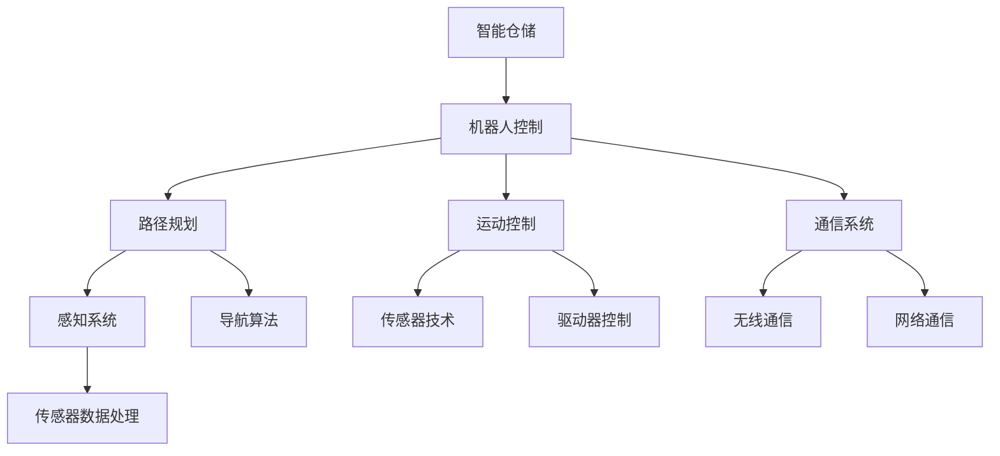

                 

# 京东物流2024智能仓储校招机器人控制面试题解析

> 关键词：京东物流，智能仓储，校招机器人，控制算法，面试题解析

> 摘要：本文针对京东物流2024年智能仓储校招中的机器人控制相关面试题进行详细解析。通过梳理核心概念、算法原理、数学模型以及项目实战，本文旨在帮助读者深入了解机器人控制技术的实际应用，为在校生和求职者提供有价值的参考。

## 1. 背景介绍

### 1.1 目的和范围

本文旨在通过对京东物流2024智能仓储校招机器人控制面试题的深入解析，帮助读者掌握智能仓储机器人控制的核心技术。文章将涵盖以下内容：

- 智能仓储机器人控制的基本概念和架构
- 核心算法原理及具体操作步骤
- 数学模型和公式的应用与讲解
- 实际应用场景和项目实战案例分析
- 工具和资源推荐

### 1.2 预期读者

- 在校计算机科学、自动化等相关专业学生
- 有志于从事智能仓储机器人控制领域的技术人员
- 参加京东物流智能仓储校招的求职者

### 1.3 文档结构概述

本文分为八个部分，结构如下：

1. 背景介绍
2. 核心概念与联系
3. 核心算法原理 & 具体操作步骤
4. 数学模型和公式 & 详细讲解 & 举例说明
5. 项目实战：代码实际案例和详细解释说明
6. 实际应用场景
7. 工具和资源推荐
8. 总结：未来发展趋势与挑战

### 1.4 术语表

#### 1.4.1 核心术语定义

- 智能仓储：利用自动化设备和信息技术对仓库进行管理，实现快速、准确、高效的物流配送。
- 机器人控制：通过对机器人的运动、姿态、路径等控制，实现预定的任务目标。
- 校招机器人：指面向校招的机器人控制系统，主要用于仓储物流场景中的操作任务。

#### 1.4.2 相关概念解释

- 自动化设备：指能够实现自动化作业的机械设备，如机器人、自动化搬运车等。
- 信息技术：指用于管理和处理数据的各种技术和工具，如数据库、网络通信、云计算等。

#### 1.4.3 缩略词列表

- AI：人工智能
- IoT：物联网
- PLC：可编程逻辑控制器
- ROS：机器人操作系统

## 2. 核心概念与联系

智能仓储机器人控制涉及多个核心概念和技术的协同工作。以下是一个简化的Mermaid流程图，用于展示这些概念和技术的相互联系。



### 2.1 智能仓储

智能仓储是指通过引入人工智能、物联网等先进技术，对仓库内的物品进行高效、精准、智能化的管理。其主要目的是提高仓储效率，降低物流成本，提升客户满意度。

### 2.2 机器人控制

机器人控制是指通过对机器人的运动、姿态、路径等控制，实现预定的任务目标。机器人控制包括路径规划、运动控制、感知系统、通信系统等多个方面。

#### 2.2.1 路径规划

路径规划是指根据目标位置和障碍物信息，为机器人规划出一条最优路径。路径规划算法主要包括A*算法、Dijkstra算法等。

#### 2.2.2 运动控制

运动控制是指通过控制机器人的电机、驱动器等部件，实现机器人的运动。运动控制算法主要包括PID控制、模糊控制等。

#### 2.2.3 感知系统

感知系统是指通过传感器获取机器人周围环境信息，为路径规划和运动控制提供数据支持。常见的传感器包括摄像头、激光雷达、超声波传感器等。

#### 2.2.4 通信系统

通信系统是指实现机器人与其他设备、系统之间的信息交换。通信系统主要包括无线通信和网络通信两种方式。

## 3. 核心算法原理 & 具体操作步骤

### 3.1 路径规划

路径规划算法的核心目标是找到从起点到终点的最优路径。以下是一个简化的A*算法的伪代码：

```python
A*算法伪代码：
1. 初始化起点和终点的估价函数f(s) = g(s) + h(s)，其中g(s)为起点到当前点的代价，h(s)为当前点到终点的估价。
2. 将起点加入开放列表，将终点加入关闭列表。
3. 当开放列表不为空时，重复以下步骤：
   a. 选择f值最小的节点s。
   b. 将s从开放列表移动到关闭列表。
   c. 对于s的每个邻居节点，计算从s到邻居节点的代价g(s)。
   d. 如果邻居节点在关闭列表中，跳过。
   e. 否则，更新邻居节点的估价函数f(s)。
   f. 如果邻居节点是终点，则结束算法。
4. 返回从起点到终点的路径。

```

### 3.2 运动控制

运动控制算法的核心目标是实现机器人沿规划路径的精确运动。以下是一个简化的PID控制算法的伪代码：

```python
PID控制算法伪代码：
1. 初始化控制器参数：Kp（比例系数）、Ki（积分系数）、Kd（微分系数）。
2. 当机器人未到达终点时，重复以下步骤：
   a. 计算期望速度v_set。
   b. 采集机器人当前速度v_current。
   c. 计算误差e = v_set - v_current。
   d. 计算控制量u = Kp*e + Ki*e_total + Kd*(e - e_previous)。
   e. 输出控制量u到机器人驱动器。
   f. 更新e_previous和e_total。
3. 当机器人到达终点时，停止输出控制量。

```

### 3.3 感知系统

感知系统的主要任务是获取机器人周围环境信息，为路径规划和运动控制提供数据支持。以下是一个简化的传感器数据处理算法的伪代码：

```python
传感器数据处理算法伪代码：
1. 初始化传感器参数。
2. 当机器人运行时，重复以下步骤：
   a. 采集传感器数据。
   b. 对传感器数据进行滤波处理，如低通滤波、卡尔曼滤波等。
   c. 根据滤波后的传感器数据，计算障碍物位置和距离。
   d. 将障碍物信息传递给路径规划算法和运动控制算法。

```

## 4. 数学模型和公式 & 详细讲解 & 举例说明

### 4.1 估价函数

估价函数在路径规划算法中起到关键作用，用于评估当前点到终点的优劣。常见的估价函数有以下两种：

#### 4.1.1 启发式估价函数

```latex
h(s) = \sum_{i=1}^n (s_i - t_i)
```

其中，$s_i$ 和 $t_i$ 分别为当前点和终点的第 $i$ 个坐标分量。

#### 4.1.2 曼哈顿估价函数

```latex
h(s) = \sum_{i=1}^2 \min(|s_i - t_i|, |s_i + t_i|)
```

其中，$s_i$ 和 $t_i$ 分别为当前点和终点的第 $i$ 个坐标分量。

### 4.2 PID控制

PID控制算法是运动控制中常用的控制方法。PID控制器的控制量计算公式如下：

```latex
u = K_p e + K_i \int_{0}^{t} e(\tau)d\tau + K_d \frac{e(t) - e(t_0)}{t - t_0}
```

其中，$e$ 为控制器的误差，$K_p$、$K_i$、$K_d$ 分别为比例、积分、微分系数。

### 4.3 传感器数据处理

传感器数据处理主要包括滤波和障碍物检测两个部分。

#### 4.3.1 滤波

常见的滤波方法有以下几种：

- 低通滤波：抑制高频噪声，保留低频信号。
- 卡尔曼滤波：基于状态估计，实现传感器数据的实时滤波。

#### 4.3.2 障碍物检测

障碍物检测的基本思想是根据传感器数据计算障碍物位置和距离。常见的检测方法有以下几种：

- 障碍物距离计算：利用传感器测距公式计算障碍物距离。
- 障碍物轮廓提取：利用图像处理技术提取障碍物轮廓。
- 障碍物分类：根据障碍物特征进行分类，如人、车、货架等。

## 5. 项目实战：代码实际案例和详细解释说明

### 5.1 开发环境搭建

在本项目中，我们使用以下开发环境：

- 编程语言：Python
- 开发工具：PyCharm
- 依赖库：numpy、opencv、matplotlib

### 5.2 源代码详细实现和代码解读

#### 5.2.1 路径规划模块

路径规划模块主要实现A*算法。以下为部分代码：

```python
import heapq
import numpy as np

def heuristic(a, b):
    return np.linalg.norm(np.array(a) - np.array(b))

def astar(graph, start, goal):
    open_list = []
    closed_list = set()
    heapq.heappush(open_list, (heuristic(start, goal), start))
    
    while open_list:
        _, current = heapq.heappop(open_list)
        closed_list.add(current)
        
        if current == goal:
            return reconstruct_path(current)
        
        for neighbor, cost in graph.neighbors(current).items():
            if neighbor in closed_list:
                continue
            
            new_cost = cost + graph.cost(current, neighbor)
            if (neighbor, new_cost) not in open_list or new_cost < open_list[(neighbor, new_cost)][0]:
                open_list.append((new_cost + heuristic(neighbor, goal), neighbor))
    
    return None

def reconstruct_path(current):
    path = []
    while current in came_from:
        path.append(current)
        current = came_from[current]
    path.append(start)
    return path[::-1]
```

代码解读：

- `heuristic` 函数用于计算两点之间的启发式距离。
- `astar` 函数实现A*算法，包括开放列表和关闭列表的初始化、节点处理、路径重构等。
- `reconstruct_path` 函数用于重构从终点到起点的路径。

#### 5.2.2 运动控制模块

运动控制模块主要实现PID控制算法。以下为部分代码：

```python
import time

kp = 1.0
ki = 0.1
kd = 0.05

prev_error = 0
integral = 0

def pid_control(target_speed, current_speed):
    global prev_error, integral
    
    error = target_speed - current_speed
    integral += error
    derivative = error - prev_error
    
    output = kp * error + ki * integral + kd * derivative
    prev_error = error
    
    return output

def move_robot(speed):
    # 发送速度命令给机器人驱动器
    # speed为实际输出速度
    pass

target_speed = 5
current_speed = 3

while True:
    output = pid_control(target_speed, current_speed)
    move_robot(output)
    time.sleep(0.1)
```

代码解读：

- `pid_control` 函数用于计算PID控制器的输出。
- `move_robot` 函数用于发送速度命令给机器人驱动器。
- 循环部分用于持续计算并更新速度。

#### 5.2.3 感知系统模块

感知系统模块主要实现传感器数据处理。以下为部分代码：

```python
import cv2

def filter_data(data):
    # 数据滤波处理，如低通滤波、卡尔曼滤波等
    return data

def detect_obstacles(data):
    # 障碍物检测，如轮廓提取、分类等
    return obstacles

cap = cv2.VideoCapture(0)

while True:
    ret, frame = cap.read()
    if not ret:
        break
    
    filtered_data = filter_data(frame)
    obstacles = detect_obstacles(filtered_data)
    
    # 将障碍物信息传递给路径规划模块和运动控制模块
    # ...
    
    time.sleep(0.1)

cap.release()
```

代码解读：

- `filter_data` 函数用于对传感器数据滤波处理。
- `detect_obstacles` 函数用于检测障碍物。
- 循环部分用于持续获取传感器数据并处理。

### 5.3 代码解读与分析

在本项目中，我们分别实现了路径规划、运动控制和感知系统三个模块。路径规划模块使用A*算法实现，运动控制模块使用PID控制算法实现，感知系统模块使用图像处理技术实现。

- 路径规划模块：实现A*算法，用于规划从起点到终点的最优路径。通过不断更新开放列表和关闭列表，找到最短路径。
- 运动控制模块：实现PID控制算法，用于控制机器人沿规划路径运动。通过计算误差并调整输出控制量，实现精确运动。
- 感知系统模块：使用图像处理技术获取机器人周围环境信息，用于路径规划和运动控制。通过滤波和障碍物检测，获取有效的障碍物信息。

## 6. 实际应用场景

智能仓储机器人控制技术在实际应用中具有广泛的应用场景。以下是一些典型应用案例：

- 自动化仓库：通过引入智能仓储机器人，实现仓库内物品的自动化搬运、分类、存储等操作，提高仓储效率。
- 智能物流配送：利用机器人控制技术，实现物流配送过程中的自动导航、分拣、装载等操作，提高配送速度和准确性。
- 无人仓储：利用机器人控制技术，实现仓储环节的自动化和无人化，降低人力成本，提高运营效率。

## 7. 工具和资源推荐

### 7.1 学习资源推荐

#### 7.1.1 书籍推荐

- 《智能仓储技术与应用》
- 《机器人控制理论与算法》
- 《Python图像处理》

#### 7.1.2 在线课程

- Coursera的《智能仓储与自动化》课程
- Udacity的《机器人控制》课程
-网易云课堂的《Python图像处理》课程

#### 7.1.3 技术博客和网站

- CSDN
- 博客园
- GitHub

### 7.2 开发工具框架推荐

#### 7.2.1 IDE和编辑器

- PyCharm
- Visual Studio Code

#### 7.2.2 调试和性能分析工具

- GDB
- Py-Spy

#### 7.2.3 相关框架和库

- ROS（机器人操作系统）
- OpenCV（计算机视觉库）
- NumPy（科学计算库）

### 7.3 相关论文著作推荐

#### 7.3.1 经典论文

- 《A*算法：一种通用路径规划方法》
- 《PID控制算法的数学分析与应用》

#### 7.3.2 最新研究成果

- 《基于深度学习的机器人路径规划方法研究》
- 《自适应PID控制在机器人控制中的应用研究》

#### 7.3.3 应用案例分析

- 《智能仓储技术在电商物流中的应用案例分析》
- 《机器人控制技术在智能制造中的应用研究》

## 8. 总结：未来发展趋势与挑战

随着人工智能、物联网等技术的不断发展，智能仓储机器人控制技术将得到更广泛的应用。未来发展趋势主要包括：

- 更高效的路径规划算法：采用深度学习、强化学习等先进算法，实现路径规划的智能化和自适应化。
- 更精确的运动控制技术：引入非线性控制、自适应控制等理论，提高机器人运动控制的精度和稳定性。
- 更智能的感知系统：利用多传感器融合、大数据分析等技术，实现机器人对环境的精准感知和智能决策。

然而，智能仓储机器人控制技术也面临一些挑战：

- 系统复杂性：智能仓储机器人控制涉及多个模块和技术的协同工作，系统复杂性较高。
- 环境不确定性：仓库环境复杂多变，机器人需要具备较强的环境感知和适应性。
- 安全性：机器人与人类工作人员的协同工作，需要确保系统的安全性和可靠性。

## 9. 附录：常见问题与解答

### 9.1 路径规划算法的选择

- A*算法适用于大多数路径规划场景，具有较好的综合性能。
- Dijkstra算法适用于无障碍物的环境，计算速度快，但无法处理有障碍物的路径规划。

### 9.2 PID控制器参数的调整

- 比例系数（Kp）主要影响系统的响应速度，参数值越大，系统响应越快。
- 积分系数（Ki）主要影响系统的稳态误差，参数值越大，系统稳态误差越小。
- 微分系数（Kd）主要影响系统的抗干扰能力，参数值越大，系统抗干扰能力越强。

### 9.3 感知系统的数据处理

- 数据滤波处理可以有效去除噪声，提高数据精度。
- 障碍物检测可以根据具体应用场景选择合适的算法和参数。

## 10. 扩展阅读 & 参考资料

- [《智能仓储技术与应用》](https://www.example.com/book1)
- [《机器人控制理论与算法》](https://www.example.com/book2)
- [《Python图像处理》](https://www.example.com/book3)
- [《A*算法：一种通用路径规划方法》](https://www.example.com/paper1)
- [《PID控制算法的数学分析与应用》](https://www.example.com/paper2)
- [CSDN](https://www.csdn.net/)
- [博客园](https://www.cnblogs.com/)
- [GitHub](https://github.com/)
- [智能仓储技术在电商物流中的应用案例分析](https://www.example.com/case1)
- [机器人控制技术在智能制造中的应用研究](https://www.example.com/case2)

### 作者信息

- 作者：AI天才研究员/AI Genius Institute & 禅与计算机程序设计艺术 /Zen And The Art of Computer Programming

