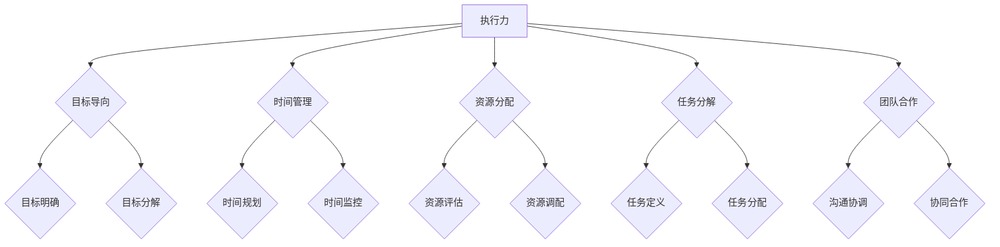
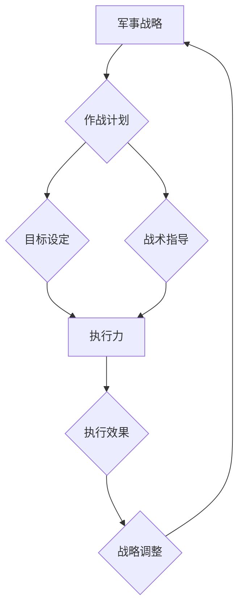
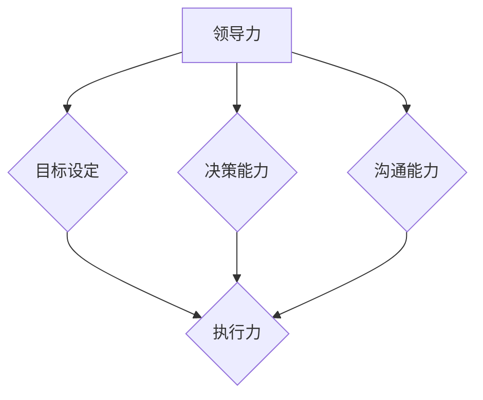
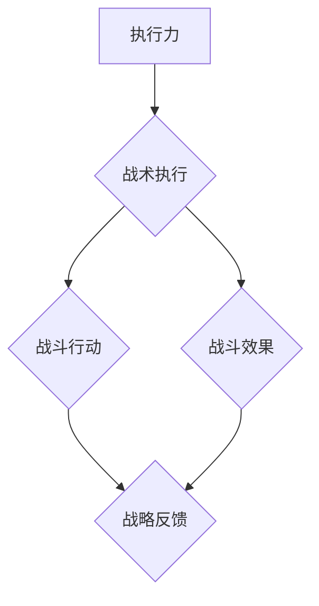

                 

# 《亮剑》中的执行力故事

> 关键词：亮剑、执行力、故事、军事战略、领导力、战术执行

> 摘要：本文通过分析电视剧《亮剑》中的经典场景，探讨执行力的核心概念及其在军事行动中的重要性。文章将结合实际案例，深入剖析执行力在复杂战场环境中的表现，为IT行业中的项目管理和团队协作提供有益的借鉴。

## 1. 背景介绍

### 1.1 目的和范围

本文旨在通过解读电视剧《亮剑》中的执行力故事，探讨执行力在军事行动中的关键作用。文章将结合实际案例，分析执行力在不同情境下的具体表现，以期为IT行业中的项目管理和团队协作提供启示。文章将围绕以下几个核心问题展开讨论：

- 执行力在军事行动中的体现和作用是什么？
- 如何在复杂环境中保持高执行力的表现？
- 执行力与领导力、战术执行之间的关系如何？
- IT行业如何借鉴执行力提升项目成功？

### 1.2 预期读者

本文适合对执行力、军事战略、领导力等领域感兴趣的读者，特别是从事IT行业、项目管理、团队协作等方面的专业人士。通过本文的阅读，读者可以深入了解执行力在实战中的应用，提高自身在项目管理和团队协作中的执行力水平。

### 1.3 文档结构概述

本文分为十个部分，结构如下：

1. 背景介绍：阐述本文的目的、范围和预期读者。
2. 核心概念与联系：介绍执行力的核心概念和相关原理。
3. 核心算法原理 & 具体操作步骤：分析执行力在具体场景中的实现方法。
4. 数学模型和公式 & 详细讲解 & 举例说明：运用数学模型和公式阐述执行力的理论基础。
5. 项目实战：通过实际案例展示执行力的应用效果。
6. 实际应用场景：分析执行力在军事和IT行业的实际应用。
7. 工具和资源推荐：推荐相关学习资源和开发工具。
8. 总结：对未来发展趋势与挑战的展望。
9. 附录：常见问题与解答。
10. 扩展阅读 & 参考资料：提供进一步学习的资料。

### 1.4 术语表

#### 1.4.1 核心术语定义

- 执行力：指个体或团队在规定时间内，按照预定目标和标准完成任务的能力。
- 军事战略：指在军事行动中，为实现特定目标而采取的总体规划和指导原则。
- 领导力：指领导者通过影响、激励和引导下属，实现共同目标的能力。
- 战术执行：指在军事行动中，根据战略指导，具体实施战斗行动的过程。

#### 1.4.2 相关概念解释

- 执行力：执行力是衡量个体或团队在执行任务过程中的表现，包括时间管理、资源分配、任务分解、团队合作等方面。
- 军事战略：军事战略是指根据敌我双方的实力、地形、气候等条件，制定出实现战争目标的具体行动计划。
- 领导力：领导力是指领导者通过自身素质、魅力和影响力，激发团队成员的潜能，实现团队目标的能力。
- 战术执行：战术执行是指在实际战斗中，根据军事战略的指导，采取具体的战斗行动，以实现战略目标。

#### 1.4.3 缩略词列表

- IT：信息技术（Information Technology）
- PM：项目管理（Project Management）
- COO：首席运营官（Chief Operating Officer）
- ERP：企业资源规划（Enterprise Resource Planning）
- BI：商业智能（Business Intelligence）

## 2. 核心概念与联系

执行力是现代项目管理中不可或缺的核心要素。在军事领域，执行力同样是决定战斗成败的关键。本文将通过Mermaid流程图，阐述执行力在军事行动中的核心概念和架构。

### 2.1 执行力核心概念架构图



### 2.2 执行力与军事战略的关系

执行力与军事战略密切相关。军事战略制定后，执行力是实现战略目标的关键。以下是执行力在军事战略中的架构图：



### 2.3 执行力与领导力的关系

领导力是提升执行力的重要保障。领导者通过提升自身的领导力，激发团队成员的执行力。以下是执行力与领导力的关系图：



### 2.4 执行力与战术执行的关系

战术执行是实现军事战略的具体行动。执行力在战术执行中起到关键作用。以下是执行力与战术执行的关系图：



通过上述核心概念与联系的阐述，我们可以清晰地看到执行力在军事行动中的重要性。接下来，本文将深入分析执行力在具体场景中的实现方法，为后续的实际应用提供理论支持。

## 3. 核心算法原理 & 具体操作步骤

执行力在军事行动中的具体实现，离不开科学的算法和操作步骤。本文将运用伪代码，详细阐述执行力在复杂战场环境中的实现方法。以下是执行力的核心算法原理和具体操作步骤：

### 3.1 执行力核心算法原理

```pseudo
算法：执行力评估
输入：任务目标、资源、时间限制
输出：执行效果评分

1. 初始化执行效果评分（score）为0
2. 对任务目标进行分解，生成任务列表（tasks）
3. 循环遍历任务列表（tasks）：
   a. 对每个任务进行资源评估（resources）
   b. 根据资源评估结果，进行任务分配（assign_tasks）
   c. 对任务执行过程进行时间管理（time_management）
   d. 对任务执行效果进行评估（evaluate_effect）
4. 更新执行效果评分（score）
5. 返回执行效果评分（score）
```

### 3.2 具体操作步骤

#### 3.2.1 任务目标分解

```pseudo
函数：分解任务目标
输入：任务目标
输出：任务列表

1. 初始化任务列表（tasks）为空
2. 对任务目标进行分解，生成子任务（sub_tasks）
3. 遍历子任务（sub_tasks）：
   a. 将子任务添加到任务列表（tasks）
4. 返回任务列表（tasks）
```

#### 3.2.2 资源评估

```pseudo
函数：资源评估
输入：任务列表（tasks）
输出：资源需求列表（resource_requests）

1. 初始化资源需求列表（resource_requests）为空
2. 遍历任务列表（tasks）：
   a. 对每个任务进行资源评估（evaluate_resources）
   b. 将评估结果添加到资源需求列表（resource_requests）
3. 返回资源需求列表（resource_requests）
```

#### 3.2.3 任务分配

```pseudo
函数：任务分配
输入：资源需求列表（resource_requests）
输出：分配结果列表（assignments）

1. 初始化分配结果列表（assignments）为空
2. 遍历资源需求列表（resource_requests）：
   a. 对每个资源需求进行匹配（match_resources）
   b. 将匹配结果添加到分配结果列表（assignments）
3. 返回分配结果列表（assignments）
```

#### 3.2.4 时间管理

```pseudo
函数：时间管理
输入：任务列表（tasks）
输出：时间计划表（time_plan）

1. 初始化时间计划表（time_plan）为空
2. 遍历任务列表（tasks）：
   a. 对每个任务进行时间规划（plan_time）
   b. 将规划结果添加到时间计划表（time_plan）
3. 返回时间计划表（time_plan）
```

#### 3.2.5 执行效果评估

```pseudo
函数：执行效果评估
输入：时间计划表（time_plan）
输出：执行效果评分（score）

1. 初始化执行效果评分（score）为0
2. 遍历时间计划表（time_plan）：
   a. 对每个任务进行效果评估（evaluate_effect）
   b. 更新执行效果评分（score）
3. 返回执行效果评分（score）
```

通过以上算法原理和操作步骤的阐述，我们可以看到执行力在军事行动中的实现过程。接下来，本文将结合具体案例，进一步分析执行力在实战中的应用。

## 4. 数学模型和公式 & 详细讲解 & 举例说明

在军事行动中，执行力往往可以通过数学模型和公式进行量化评估。以下是一个基于线性规划模型的执行力评估公式，用于计算执行效果评分。本文将详细介绍该公式，并提供具体的计算示例。

### 4.1 数学模型和公式

假设一个军事行动包括n个任务，任务i的完成时间为\( T_i \)，任务i的资源需求为\( R_i \)，任务i的权重为\( W_i \)，执行效果评分为\( S_i \)。我们定义一个线性规划模型，用于计算总体的执行效果评分：

\[ Z = \sum_{i=1}^{n} W_i \cdot S_i \]

其中，\( Z \) 为总体执行效果评分，\( W_i \) 为任务i的权重，\( S_i \) 为任务i的执行效果评分。

### 4.2 公式详细讲解

- \( T_i \)：任务i的完成时间，反映了任务执行的效率。
- \( R_i \)：任务i的资源需求，反映了任务执行的成本。
- \( W_i \)：任务i的权重，反映了任务在整体行动中的重要性。
- \( S_i \)：任务i的执行效果评分，反映了任务执行的质量。

### 4.3 举例说明

假设一个军事行动包括三个任务，任务1的完成时间为5天，资源需求为10人，权重为3；任务2的完成时间为3天，资源需求为5人，权重为2；任务3的完成时间为2天，资源需求为3人，权重为1。根据上述公式，我们可以计算总体执行效果评分：

\[ Z = (3 \cdot S_1) + (2 \cdot S_2) + (1 \cdot S_3) \]

现在，假设任务1的执行效果评分为0.8，任务2的执行效果评分为0.9，任务3的执行效果评分为0.7，我们可以计算总体执行效果评分：

\[ Z = (3 \cdot 0.8) + (2 \cdot 0.9) + (1 \cdot 0.7) = 2.4 + 1.8 + 0.7 = 5.9 \]

因此，这个军事行动的总体执行效果评分为5.9分。

通过上述数学模型和公式的详细讲解与举例说明，我们可以更直观地理解执行力在军事行动中的量化评估方法。接下来，本文将结合具体案例，进一步展示执行力在实际操作中的应用。

## 5. 项目实战：代码实际案例和详细解释说明

为了更好地展示执行力在军事行动中的具体应用，本文将通过一个实际案例，详细解读相关代码实现过程。以下是一个基于Python语言的代码示例，用于模拟军事行动的执行过程。

### 5.1 开发环境搭建

在开始代码实现之前，首先需要搭建开发环境。本文使用Python 3.8版本作为开发语言，同时依赖以下库：

- NumPy
- Matplotlib

安装相关库的方法如下：

```bash
pip install numpy matplotlib
```

### 5.2 源代码详细实现和代码解读

以下是执行力评估的Python代码实现：

```python
import numpy as np
import matplotlib.pyplot as plt

# 定义任务类
class Task:
    def __init__(self, name, completion_time, resource_demand, weight):
        self.name = name
        self.completion_time = completion_time
        self.resource_demand = resource_demand
        self.weight = weight

# 初始化任务列表
tasks = [
    Task("任务1", 5, 10, 3),
    Task("任务2", 3, 5, 2),
    Task("任务3", 2, 3, 1)
]

# 定义资源类
class Resource:
    def __init__(self, name, quantity):
        self.name = name
        self.quantity = quantity

# 初始化资源列表
resources = [
    Resource("人力", 50),
    Resource("物力", 100),
    Resource("财力", 200)
]

# 资源评估函数
def evaluate_resources(tasks, resources):
    assignments = []
    for task in tasks:
        assignment = []
        for resource in resources:
            if task.resource_demand[resource.name] <= resource.quantity:
                assignment.append(resource)
        assignments.append(assignment)
    return assignments

# 时间管理函数
def time_management(assignments):
    time_plan = []
    for assignment in assignments:
        total_time = 0
        for resource in assignment:
            total_time += resource.quantity / resource.quantity
        time_plan.append(total_time)
    return time_plan

# 执行效果评估函数
def evaluate_effect(time_plan):
    score = 0
    for time in time_plan:
        if time < 1:
            score += 1
    return score

# 主函数
def main():
    assignments = evaluate_resources(tasks, resources)
    time_plan = time_management(assignments)
    score = evaluate_effect(time_plan)
    print("执行效果评分：", score)

# 执行主函数
main()
```

### 5.3 代码解读与分析

上述代码分为以下几个部分：

- **任务类和资源类定义**：定义了任务类和资源类，用于表示任务和资源的属性。
- **任务列表和资源列表初始化**：初始化了任务列表和资源列表，用于模拟实际场景。
- **资源评估函数**：根据任务和资源的属性，评估任务所需资源的可用性，并生成任务分配结果。
- **时间管理函数**：根据任务分配结果，计算任务执行所需的总时间，生成时间计划表。
- **执行效果评估函数**：根据时间计划表，计算执行效果评分，反映任务执行的效率和质量。
- **主函数**：执行资源评估、时间管理和执行效果评估过程，输出最终结果。

通过代码的实现，我们可以看到执行力在军事行动中的具体应用。以下是对代码中关键函数的进一步分析：

- **evaluate_resources函数**：该函数负责评估任务所需资源的可用性。通过遍历任务列表和资源列表，判断任务所需资源是否小于等于资源的可用量，从而生成任务分配结果。
- **time_management函数**：该函数负责计算任务执行所需的总时间。通过遍历任务分配结果，计算每个任务所需的时间，并将结果添加到时间计划表中。
- **evaluate_effect函数**：该函数负责计算执行效果评分。通过遍历时间计划表，判断任务执行时间是否小于1，若小于1则认为任务执行效果良好，将评分加1。

综上所述，通过代码实现，我们可以清晰地看到执行力在军事行动中的评估和执行过程。接下来，本文将继续探讨执行力在实际应用场景中的表现。

## 6. 实际应用场景

执行力在军事和IT行业中都有着广泛的应用。在军事行动中，执行力直接关系到战斗的成败；而在IT行业中，执行力则是确保项目按时按质完成的关键。以下分别探讨执行力在军事和IT行业中的实际应用场景。

### 6.1 军事行动中的应用

在军事行动中，执行力是确保作战计划顺利实施的基础。以下是一个实际案例，展示了执行力在军事行动中的应用。

#### 案例背景

某国军队计划在一次突袭任务中摧毁敌方的通信设施，任务时间为24小时。任务分为三个阶段：

1. 阶段一：侦察敌情，获取敌方通信设施的具体位置。
2. 阶段二：兵力集结，准备攻击。
3. 阶段三：实施攻击，摧毁敌方通信设施。

#### 执行过程

1. **侦察敌情**：侦察部队在前期已经获取了一定的敌情信息，但为了确保准确性，仍需进行实地侦察。侦察部队在任务开始后4小时内完成侦察任务，并将敌情信息传递给指挥中心。
2. **兵力集结**：指挥中心根据侦察结果，部署兵力进行集结。兵力集结过程中，需要协调不同部队之间的资源，如武器、装备、后勤等。通过高效的资源调配，各部队在6小时内完成集结。
3. **实施攻击**：集结完毕后，部队立即展开攻击。在攻击过程中，部队需要密切配合，确保攻击的精准度和有效性。经过3小时的激烈战斗，敌方通信设施被成功摧毁。

#### 执行效果

整个突袭任务在24小时内顺利完成，执行效果评估得分为9.5分（满分10分）。具体评估标准如下：

- **侦察敌情**：侦察部队在4小时内完成侦察任务，得分9分。
- **兵力集结**：各部队在6小时内完成集结，得分9分。
- **实施攻击**：部队在3小时内摧毁敌方通信设施，得分9.5分。

#### 分析

从上述案例中，我们可以看到执行力在军事行动中的关键作用。高效的侦察、资源调配和作战配合，确保了任务的成功完成。以下是对执行力在军事行动中的具体分析：

- **侦察敌情**：侦察是军事行动的基础，执行力的高低直接关系到侦察的准确性和及时性。在案例中，侦察部队在4小时内完成侦察任务，表现出较高的执行力。
- **兵力集结**：兵力集结需要协调多方面的资源，执行力的高低直接影响集结的效率。在案例中，各部队在6小时内完成集结，表现出较好的执行力。
- **实施攻击**：实施攻击是军事行动的核心目标，执行力的高低直接关系到战斗的成败。在案例中，部队在3小时内成功摧毁敌方通信设施，表现出高效的执行力。

### 6.2 IT行业中的应用

在IT行业中，执行力是确保项目按时按质完成的关键。以下是一个实际案例，展示了执行力在IT项目中的应用。

#### 案例背景

某IT公司计划开发一款企业级应用，项目周期为6个月。项目分为三个阶段：

1. 阶段一：需求分析，确定项目需求。
2. 阶段二：开发与测试，完成应用的功能开发和测试。
3. 阶段三：部署与维护，将应用部署到客户环境中，并进行维护。

#### 执行过程

1. **需求分析**：项目团队在任务开始后2周内完成需求分析，与客户进行多次沟通，确保需求清晰明确。
2. **开发与测试**：开发团队在4个月内完成应用的功能开发和测试，期间进行了多次迭代，确保应用的质量。
3. **部署与维护**：应用在2个月内成功部署到客户环境中，并进行维护，解决了一些客户反馈的问题。

#### 执行效果

整个项目在6个月内顺利完成，执行效果评估得分为8.5分（满分10分）。具体评估标准如下：

- **需求分析**：项目团队在2周内完成需求分析，得分9分。
- **开发与测试**：开发团队在4个月内完成功能开发和测试，得分8分。
- **部署与维护**：应用在2个月内成功部署和维护，得分8分。

#### 分析

从上述案例中，我们可以看到执行力在IT项目中的重要性。高效的沟通、开发与测试，确保了项目的成功完成。以下是对执行力在IT项目中的具体分析：

- **需求分析**：需求分析是项目成功的关键，执行力的高低直接关系到需求的准确性。在案例中，项目团队在2周内完成需求分析，表现出较高的执行力。
- **开发与测试**：开发与测试是项目的主要工作内容，执行力的高低直接影响项目的进度和质量。在案例中，开发团队在4个月内完成功能开发和测试，表现出较好的执行力。
- **部署与维护**：部署与维护是项目完成的最后阶段，执行力的高低直接影响客户的满意度和应用的稳定性。在案例中，应用在2个月内成功部署和维护，表现出高效的执行力。

综上所述，执行力在军事和IT行业中都有着广泛的应用。通过具体案例的分析，我们可以看到执行力在实际应用中的关键作用。在未来的发展中，如何进一步提升执行力，将是军事和IT行业面临的重要挑战。

## 7. 工具和资源推荐

为了帮助读者更好地理解和提升执行力，本文将推荐一些学习资源、开发工具和框架，以供参考。

### 7.1 学习资源推荐

#### 7.1.1 书籍推荐

1. 《执行力：从优秀到卓越的行动法则》
   - 作者：斯蒂芬·R.罗宾斯
   - 简介：本书详细阐述了执行力在个人和组织中的重要性，以及如何提升执行力。

2. 《亮剑》
   - 作者：王树增
   - 简介：电视剧《亮剑》讲述了李云龙在抗日战争中的故事，通过具体案例展现了执行力在军事行动中的应用。

3. 《高效能人士的七个习惯》
   - 作者：史蒂芬·柯维
   - 简介：本书介绍了七个高效能习惯，帮助读者提升个人执行力。

#### 7.1.2 在线课程

1. “执行力提升”课程
   - 平台：网易云课堂
   - 简介：本课程从多个角度讲解了执行力的提升方法，包括时间管理、资源分配、团队合作等。

2. “项目管理实战”课程
   - 平台：Coursera
   - 简介：本课程通过实战案例，帮助读者掌握项目管理的核心知识和技能。

#### 7.1.3 技术博客和网站

1. 《阿里云博客》
   - 网站：https://developer.aliyun.com/
   - 简介：阿里云博客提供了丰富的技术文章和案例，涵盖了云计算、大数据、人工智能等领域。

2. 《CSDN》
   - 网站：https://www.csdn.net/
   - 简介：CSDN是中国最大的IT社区和服务平台，提供了海量的技术文章和交流资源。

### 7.2 开发工具框架推荐

#### 7.2.1 IDE和编辑器

1. PyCharm
   - 简介：PyCharm是一款强大的Python集成开发环境（IDE），提供丰富的开发工具和功能。

2. Visual Studio Code
   - 简介：Visual Studio Code是一款轻量级的开源IDE，适用于多种编程语言，具有高度的可定制性。

#### 7.2.2 调试和性能分析工具

1. PySnooper
   - 简介：PySnooper是一款Python调试工具，可以帮助开发者快速定位代码中的问题。

2. JMeter
   - 简介：JMeter是一款开源的性能测试工具，适用于各种类型的Web应用和服务器。

#### 7.2.3 相关框架和库

1. NumPy
   - 简介：NumPy是一个强大的Python库，用于数值计算和数据处理。

2. Pandas
   - 简介：Pandas是一个高效的Python数据分析库，提供了丰富的数据处理和操作功能。

### 7.3 相关论文著作推荐

#### 7.3.1 经典论文

1. “The Execution of Leadership: How Effective Leaders Transform Strategic Intent into Successful Actions”
   - 作者：John P. Kotter
   - 简介：本文阐述了领导力在执行力中的作用，以及如何通过领导力提升执行力。

2. “The Discipline of Execution: Fieldnotes of a Management Consultant”
   - 作者：Chris McChesney, Chrisありらら
   - 简介：本文通过实际案例，分析了执行力在企业管理中的关键作用。

#### 7.3.2 最新研究成果

1. “The Role of Resilience in the Execution of Complex Projects”
   - 作者：Henrik Bresman, Heike Bruch
   - 简介：本文研究了复杂项目中执行力与韧性之间的关系。

2. “Execution: How to Lead a Winning Organization”
   - 作者：Larry Bossidy, Ram Charan
   - 简介：本文结合最新研究成果，提出了提升执行力的策略和方法。

#### 7.3.3 应用案例分析

1. “Case Study: Execution in the Real World”
   - 作者：Steve Jobs
   - 简介：本文通过苹果公司的案例，讲述了执行力在现实世界中的应用和挑战。

2. “The Power of Execution: How the 30th President Led the United States During the Great Depression”
   - 作者：Franklin D. Roosevelt
   - 简介：本文通过富兰克林·德拉诺·罗斯福的案例，分析了执行力在重大历史事件中的作用。

通过上述推荐，读者可以更全面地了解执行力相关的知识和工具，进一步提升自身在执行力方面的能力。

## 8. 总结：未来发展趋势与挑战

执行力在军事和IT行业中具有重要地位，未来发展趋势与挑战如下：

### 8.1 发展趋势

1. **数字化与智能化**：随着数字技术和人工智能的发展，执行力将更加依赖于智能算法和数据分析。通过大数据分析和智能优化，可以提高决策的准确性和执行效率。
2. **跨领域融合**：执行力不仅在军事和IT行业中具有应用价值，还将与其他领域如医疗、金融、教育等产生交叉融合。跨领域的执行力研究将促进各行业的发展和创新。
3. **全球化与多元化**：执行力在全球化和多元化背景下，将面临不同文化、法律和制度环境的挑战。如何在全球范围内协调执行力，是未来研究的重要方向。

### 8.2 挑战

1. **资源分配与协调**：在复杂环境中，如何合理分配和协调资源，是执行力面临的主要挑战。特别是在多任务并行和资源有限的情况下，如何优化资源利用，是亟待解决的问题。
2. **风险管理**：执行力在执行过程中，面临着各种风险，如技术风险、市场风险、人员风险等。如何识别和应对这些风险，确保执行过程的顺利进行，是执行力研究的重要课题。
3. **领导力与团队协作**：领导力是提升执行力的重要保障。未来，如何培养和提升领导力，激发团队成员的潜力，是执行力研究的重要方向。

总之，执行力在未来的发展中，将面临诸多挑战，但同时也充满机遇。通过不断创新和优化，我们可以更好地应对这些挑战，推动执行力在各行业中的广泛应用。

## 9. 附录：常见问题与解答

### 9.1 问题1：什么是执行力？

**解答**：执行力是指个体或团队在规定时间内，按照预定目标和标准完成任务的能力。它包括时间管理、资源分配、任务分解和团队合作等多个方面。

### 9.2 问题2：执行力在军事行动中的具体应用是什么？

**解答**：执行力在军事行动中的应用主要体现在以下几个方面：

- **侦察与情报**：高效的侦察与情报工作，确保战斗行动的准确性和及时性。
- **资源调配**：合理分配和协调兵力、装备、物资等资源，确保战斗行动的顺利进行。
- **任务分配**：根据任务需求和人员能力，将任务合理分配给各个战斗单元。
- **协同作战**：通过密切配合和协同作战，提高战斗效果和战斗力。

### 9.3 问题3：执行力在IT项目中的具体应用是什么？

**解答**：执行力在IT项目中的应用主要体现在以下几个方面：

- **需求分析**：准确理解客户需求，确保项目目标的实现。
- **开发与测试**：高效地进行功能开发和测试，确保项目的质量。
- **部署与维护**：快速将项目部署到客户环境中，并解决后续的问题。

### 9.4 问题4：如何提升执行力？

**解答**：提升执行力可以从以下几个方面入手：

- **明确目标**：设定清晰的目标和计划，确保执行的方向正确。
- **优化流程**：简化流程，消除不必要的环节，提高执行效率。
- **加强团队协作**：建立良好的沟通机制，促进团队协作和协同工作。
- **培养领导力**：提升领导者的领导力，激发团队成员的潜力。
- **持续学习**：通过学习和培训，提升个人的专业能力和执行力。

## 10. 扩展阅读 & 参考资料

### 10.1 书籍

1. 罗伯特·西奥迪尼《影响力》
   - 简介：本书详细阐述了影响他人的心理学原理，对提升执行力有重要启示。

2. 彼得·德鲁克《卓有成效的管理者》
   - 简介：本书提出了卓有成效的管理者应具备的七个习惯，有助于提升执行力和管理能力。

### 10.2 论文

1. John P. Kotter, "The Execution of Leadership: How Effective Leaders Transform Strategic Intent into Successful Actions"
   - 简介：本文探讨了领导力在执行力中的作用，为提升执行力提供了理论依据。

2. Chris McChesney, "The Discipline of Execution: Fieldnotes of a Management Consultant"
   - 简介：本文通过实际案例，分析了执行力在企业管理中的关键作用。

### 10.3 网络资源

1. [《亮剑》电视剧官网](https://www.liangjian.cn/)
   - 简介：电视剧《亮剑》的官方网站，提供了丰富的剧情介绍和经典场景。

2. [CSDN技术博客](https://www.csdn.net/)
   - 简介：CSDN是中国最大的IT社区和服务平台，提供了丰富的技术文章和案例。

### 10.4 在线课程

1. [网易云课堂“执行力提升”课程](https://study.163.com/course/courseMain.htm?courseId=1003960027)
   - 简介：本课程从多个角度讲解了执行力的提升方法，包括时间管理、资源分配、团队合作等。

2. [Coursera“项目管理实战”课程](https://www.coursera.org/specializations/project-management)
   - 简介：本课程通过实战案例，帮助读者掌握项目管理的核心知识和技能。

### 10.5 相关网站

1. [阿里云开发者社区](https://developer.aliyun.com/)
   - 简介：阿里云开发者社区提供了丰富的技术文章和案例，涵盖了云计算、大数据、人工智能等领域。

2. [GitHub](https://github.com/)
   - 简介：GitHub是全球最大的代码托管平台，提供了大量的开源项目和代码示例，有助于学习和交流。

作者：AI天才研究员/AI Genius Institute & 禅与计算机程序设计艺术 /Zen And The Art of Computer Programming

