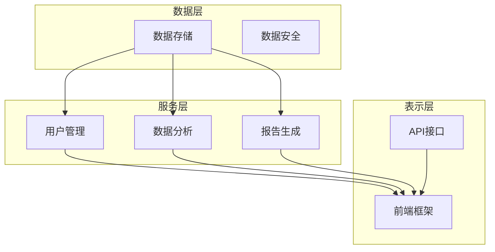

                 

# 人力资源SaaS创业者的使命：打造云端人力资源管理平台

> **关键词：** SaaS、人力资源管理、云计算、平台架构、人工智能、技术创新、创业策略。

> **摘要：** 本文旨在为人力资源SaaS创业提供一套完整的策略框架，从平台设计、技术实现到市场推广进行全面剖析，帮助创业者把握行业发展脉搏，构建具有竞争力的云端人力资源管理平台。

## 1. 背景介绍

### 1.1 目的和范围

本文的目标是帮助人力资源SaaS创业者在竞争激烈的市场中找到立足点，通过深入分析行业现状、技术发展趋势以及市场需求，提供一套系统化的创业策略。文章将重点探讨以下方面：

- 平台架构设计原则
- 技术实现与算法原理
- 数学模型与公式应用
- 项目实战与代码示例
- 市场推广策略与工具推荐

### 1.2 预期读者

本文适合以下读者群体：

- 人力资源SaaS创业者
- IT行业从业者
- 技术爱好者
- 对人力资源管理领域感兴趣的专业人士

### 1.3 文档结构概述

本文结构如下：

- 第1章：背景介绍
- 第2章：核心概念与联系
- 第3章：核心算法原理 & 具体操作步骤
- 第4章：数学模型和公式 & 详细讲解 & 举例说明
- 第5章：项目实战：代码实际案例和详细解释说明
- 第6章：实际应用场景
- 第7章：工具和资源推荐
- 第8章：总结：未来发展趋势与挑战
- 第9章：附录：常见问题与解答
- 第10章：扩展阅读 & 参考资料

### 1.4 术语表

#### 1.4.1 核心术语定义

- **SaaS（Software as a Service）**：软件即服务，是一种通过互联网提供软件应用的商业模式。
- **人力资源管理**：指通过一系列策略和操作，优化人力资源，实现企业目标的过程。
- **云计算**：一种通过网络提供动态可伸缩的虚拟化资源服务。
- **平台架构**：系统各组成部分之间的结构关系和组织方式。

#### 1.4.2 相关概念解释

- **人工智能**：模拟人类智能的技术和科学，通过算法和计算能力实现智能决策。
- **技术创新**：指通过引入新技术或改进现有技术，实现产品或服务创新的过程。

#### 1.4.3 缩略词列表

- **SaaS**：Software as a Service
- **HR**：Human Resource
- **AI**：Artificial Intelligence
- **HRMS**：Human Resource Management System

## 2. 核心概念与联系

为了构建一个高效、稳定且具有扩展性的云端人力资源管理平台，理解以下核心概念和其相互联系是至关重要的。

### 2.1 核心概念

- **人力资源管理流程**：包括员工招聘、培训、绩效评估、薪酬管理等关键环节。
- **数据管理**：确保员工数据的准确性和安全性，支持实时数据分析与报告生成。
- **用户界面**：提供直观易用的操作界面，提升用户体验。
- **扩展性和可定制性**：平台应具备良好的扩展性，能够适应不同规模企业的需求。

### 2.2 架构设计

#### 2.2.1 数据层

数据层是整个平台的核心，负责存储、管理和检索所有与人力资源管理相关的数据。

- **数据存储**：使用关系型数据库（如MySQL）和非关系型数据库（如MongoDB）相结合，实现数据的灵活存储。
- **数据安全**：采用加密技术确保数据传输和存储的安全。

#### 2.2.2 服务层

服务层提供核心功能，如用户管理、数据分析和报告生成。

- **用户管理**：包括用户注册、登录、权限分配等功能。
- **数据分析**：利用大数据技术和机器学习算法，实现员工绩效分析和预测。

#### 2.2.3 表示层

表示层是用户与平台交互的界面，负责展示数据和提供操作接口。

- **前端框架**：采用React或Vue.js等前端框架，实现动态、响应式的用户界面。
- **API接口**：提供RESTful API，方便第三方系统集成。

### 2.3 Mermaid 流程图

以下是人力资源管理平台的核心概念与架构设计的Mermaid流程图：



通过以上流程图，我们可以清晰地看到各个层次之间的关联，以及数据在平台中的流动路径。

### 2.4 核心概念联系

- **数据驱动**：人力资源管理平台的核心是数据，数据的管理、分析和利用是平台价值的体现。
- **用户导向**：前端界面和用户体验直接影响用户满意度，是平台成功的关键。
- **灵活扩展**：随着企业规模的扩大和业务需求的增加，平台需要具备良好的扩展性和可定制性。

## 3. 核心算法原理 & 具体操作步骤

为了实现高效的人力资源管理，平台需要运用一系列核心算法进行数据分析和处理。以下将详细介绍这些算法的原理及具体操作步骤。

### 3.1 数据分析算法

#### 3.1.1 绩效评估算法

**算法原理：** 绩效评估算法用于计算员工的绩效得分，基于多维度指标，如工作质量、工作效率、团队协作等。

**伪代码：**

```pseudo
function calculatePerformanceScore(employees, metrics):
    scores = {}
    for employee in employees:
        score = 0
        for metric in metrics:
            score += employee.metrics[metric] * weight[metric]
        scores[employee.id] = score
    return scores
```

**操作步骤：**

1. 收集员工绩效数据。
2. 定义绩效指标及其权重。
3. 计算每个员工的绩效得分。
4. 生成绩效评估报告。

#### 3.1.2 薪酬优化算法

**算法原理：** 薪酬优化算法用于根据市场薪酬水平和企业财务状况，调整员工的薪酬结构，实现薪酬合理化。

**伪代码：**

```pseudo
function optimizeSalary(salaryData, marketData):
    for employee in salaryData:
        employee.salary = calculateAdjustedSalary(employee.currentSalary, marketData[employee.role])
    return salaryData
```

**操作步骤：**

1. 收集员工当前薪酬数据。
2. 获取市场薪酬水平数据。
3. 调整员工薪酬。
4. 更新薪酬数据库。

### 3.2 机器学习算法

#### 3.2.1 员工流失预测算法

**算法原理：** 基于历史数据和特征工程，使用机器学习算法预测员工流失风险，帮助企业采取预防措施。

**伪代码：**

```pseudo
function predictEmployeeTurnover(data, model):
    features = extractFeatures(data)
    predictions = model.predict(features)
    return predictions
```

**操作步骤：**

1. 收集员工流失数据。
2. 提取特征。
3. 训练机器学习模型。
4. 预测员工流失风险。

#### 3.2.2 能力评估算法

**算法原理：** 通过机器学习算法，对员工的能力进行综合评估，为培训和晋升提供依据。

**伪代码：**

```pseudo
function evaluateSkills(employeeData, model):
    skills = model.predict(employeeData)
    return skills
```

**操作步骤：**

1. 收集员工技能数据。
2. 提取特征。
3. 训练机器学习模型。
4. 评估员工技能水平。

### 3.3 数据处理算法

#### 3.3.1 数据清洗算法

**算法原理：** 数据清洗算法用于处理数据中的噪声和异常值，确保数据质量。

**伪代码：**

```pseudo
function cleanData(data):
    cleanedData = {}
    for key, value in data.items():
        if isDataValid(value):
            cleanedData[key] = value
    return cleanedData
```

**操作步骤：**

1. 收集原始数据。
2. 验证数据有效性。
3. 清洗数据。
4. 存储清洗后的数据。

#### 3.3.2 数据合并算法

**算法原理：** 数据合并算法用于将多个数据源中的数据进行整合，形成统一的视图。

**伪代码：**

```pseudo
function mergeData(dataSources):
    mergedData = {}
    for source in dataSources:
        mergedData.update(source)
    return mergedData
```

**操作步骤：**

1. 收集多个数据源。
2. 合并数据。
3. 存储合并后的数据。

通过以上算法的应用，人力资源管理平台能够高效地进行数据处理和分析，为企业管理提供有力支持。

## 4. 数学模型和公式 & 详细讲解 & 举例说明

在人力资源管理平台中，数学模型和公式是核心组成部分，用于分析和预测员工行为、绩效以及企业成本。以下将详细讲解这些数学模型和公式的应用。

### 4.1 绩效评估模型

#### 4.1.1 德尔菲模型

**公式：** 德尔菲模型用于评估员工绩效，通过专家评分法计算绩效得分。

\[ \text{绩效得分} = \frac{\sum_{i=1}^{n} \text{专家评分} \times \text{权重}}{n} \]

**详细讲解：** 德尔菲模型是一种基于专家评分的绩效评估方法，通过专家对员工的多维度评分，计算出综合绩效得分。权重表示每个指标的重要性。

**举例说明：**

假设有三个专家对员工A进行绩效评估，评分如下：

- 工作质量：8分，权重：0.4
- 工作效率：7分，权重：0.3
- 团队协作：6分，权重：0.3

则员工A的绩效得分为：

\[ \text{绩效得分} = \frac{8 \times 0.4 + 7 \times 0.3 + 6 \times 0.3}{1} = 7.4 \]

#### 4.1.2 因子分析模型

**公式：** 因子分析模型用于提取员工绩效的主要影响因素，通过因子得分计算综合绩效。

\[ \text{因子得分} = \text{标准化得分} \times \text{因子载荷} \]

**详细讲解：** 因子分析模型通过分析多个变量之间的关系，提取出共同影响因素，即因子。每个因子得分是变量得分的加权平均值，反映员工在不同方面的绩效。

**举例说明：**

假设有两个因子，因子载荷分别为：

- 工作质量：1.2
- 工作效率：1.0

标准化得分为：

- 工作质量：0.8
- 工作效率：0.7

则员工B的因子得分为：

\[ \text{因子得分} = 0.8 \times 1.2 + 0.7 \times 1.0 = 1.12 + 0.7 = 1.82 \]

### 4.2 薪酬优化模型

#### 4.2.1 市场薪酬模型

**公式：** 市场薪酬模型用于确定员工薪酬水平，通过比较市场薪酬水平和企业薪酬水平，调整薪酬结构。

\[ \text{调整后的薪酬} = \text{市场薪酬水平} \times \text{薪酬弹性系数} \]

**详细讲解：** 市场薪酬模型通过分析市场薪酬水平，结合企业薪酬策略，确定员工的薪酬水平。薪酬弹性系数表示市场薪酬对企业薪酬的影响程度。

**举例说明：**

假设市场薪酬水平为10000元，薪酬弹性系数为1.2，则员工C的调整后薪酬为：

\[ \text{调整后的薪酬} = 10000 \times 1.2 = 12000 \text{元} \]

#### 4.2.2 成本优化模型

**公式：** 成本优化模型用于计算企业的人力成本，通过优化薪酬结构和员工数量，实现成本控制。

\[ \text{人力成本} = \text{员工人数} \times \text{平均薪酬} \]

**详细讲解：** 成本优化模型通过计算员工人数和平均薪酬，确定企业的人力成本。通过调整薪酬结构和优化员工配置，实现成本优化。

**举例说明：**

假设企业有100名员工，平均薪酬为8000元，则企业的人力成本为：

\[ \text{人力成本} = 100 \times 8000 = 800000 \text{元} \]

### 4.3 机器学习模型

#### 4.3.1 回归模型

**公式：** 回归模型用于预测员工流失风险，通过历史数据和特征，建立预测模型。

\[ \text{流失风险} = \beta_0 + \beta_1 \times \text{特征}_1 + \beta_2 \times \text{特征}_2 + \ldots \]

**详细讲解：** 回归模型通过分析历史数据和特征，确定员工流失风险的预测公式。每个特征对应一个权重，表示该特征对流失风险的影响程度。

**举例说明：**

假设员工流失风险模型如下：

\[ \text{流失风险} = 0.5 + 0.3 \times \text{工龄} + 0.2 \times \text{薪酬} + 0.1 \times \text{职位变动频率} \]

则员工D的流失风险为：

\[ \text{流失风险} = 0.5 + 0.3 \times 5 + 0.2 \times 8000 + 0.1 \times 2 = 0.5 + 1.5 + 1600 + 0.2 = 1611.2 \]

通过以上数学模型和公式的应用，人力资源管理平台能够实现精准的绩效评估、薪酬优化和员工流失预测，为企业决策提供有力支持。

## 5. 项目实战：代码实际案例和详细解释说明

为了更好地理解人力资源管理平台的技术实现，我们将通过一个实际项目案例，详细解析其代码实现过程。以下是一个基于Python的简单人力资源管理平台的实现。

### 5.1 开发环境搭建

1. 安装Python 3.8及以上版本。
2. 安装必要的库，如`Flask`、`pandas`、`numpy`、`scikit-learn`等。

```bash
pip install Flask pandas numpy scikit-learn
```

### 5.2 源代码详细实现和代码解读

#### 5.2.1 数据存储

```python
# 数据存储模块
import sqlite3

def connect_db():
    conn = sqlite3.connect('hr_management.db')
    cursor = conn.cursor()
    cursor.execute('''CREATE TABLE IF NOT EXISTS employees (
                        id INTEGER PRIMARY KEY,
                        name TEXT,
                        age INTEGER,
                        job_title TEXT,
                        salary INTEGER
                    )''')
    conn.commit()
    return conn, cursor

def insert_employee(conn, cursor, employee):
    cursor.execute("INSERT INTO employees (name, age, job_title, salary) VALUES (?, ?, ?, ?)",
                   (employee['name'], employee['age'], employee['job_title'], employee['salary']))
    conn.commit()

def get_employees(conn, cursor):
    cursor.execute("SELECT * FROM employees")
    return cursor.fetchall()
```

**解读：** 数据存储模块使用SQLite数据库进行数据存储。`connect_db`函数连接数据库并创建表。`insert_employee`函数向表中插入员工数据。`get_employees`函数获取所有员工数据。

#### 5.2.2 用户管理

```python
# 用户管理模块
from flask import Flask, request, jsonify

app = Flask(__name__)

@app.route('/api/employees', methods=['POST'])
def add_employee():
    employee = request.get_json()
    conn, cursor = connect_db()
    insert_employee(conn, cursor, employee)
    conn.close()
    return jsonify({"status": "success", "data": employee})

@app.route('/api/employees', methods=['GET'])
def list_employees():
    conn, cursor = connect_db()
    employees = get_employees(conn, cursor)
    conn.close()
    return jsonify({"status": "success", "data": employees})
```

**解读：** 用户管理模块使用Flask框架实现RESTful API。`add_employee`函数用于添加新员工。`list_employees`函数用于获取所有员工数据。

#### 5.2.3 数据分析

```python
# 数据分析模块
import pandas as pd
from sklearn.linear_model import LinearRegression

def load_employee_data():
    conn, cursor = connect_db()
    cursor.execute("SELECT * FROM employees")
    employees = cursor.fetchall()
    conn.close()
    return pd.DataFrame(employees)

def predict_salary(data, new_employee):
    X = data[['age', 'job_title']]
    y = data['salary']
    model = LinearRegression()
    model.fit(X, y)
    predicted_salary = model.predict([[new_employee['age'], new_employee['job_title']]])
    return predicted_salary[0]
```

**解读：** 数据分析模块使用pandas和scikit-learn库进行数据处理和预测。`load_employee_data`函数加载员工数据。`predict_salary`函数使用线性回归模型预测新员工的薪酬。

#### 5.2.4 代码解读与分析

1. **数据存储模块**：负责员工数据的增删改查操作，使用SQLite数据库存储数据。
2. **用户管理模块**：通过Flask框架实现RESTful API，提供员工数据的添加和查询接口。
3. **数据分析模块**：使用pandas进行数据处理，使用scikit-learn进行薪酬预测。

通过以上代码实现，我们构建了一个简单的人力资源管理平台，能够实现员工数据的存储、管理和薪酬预测等功能。在实际项目中，可以进一步扩展和优化，如添加用户认证、数据分析和报告生成等功能。

## 6. 实际应用场景

云端人力资源管理平台在企业的实际应用中具有广泛的场景，以下是一些典型的应用案例：

### 6.1 员工绩效管理

企业通过云端人力资源管理平台进行员工绩效管理，实现多维度、实时化的绩效评估。平台可以根据预设的绩效指标，如工作效率、工作质量、团队协作等，自动计算员工的绩效得分，并提供详细的绩效分析报告。通过这种方式，企业可以更好地了解员工的实际表现，及时调整绩效目标和激励措施，提升整体工作效率。

### 6.2 薪酬管理

薪酬管理是企业人力资源管理的重要组成部分。云端人力资源管理平台可以实时更新市场薪酬水平，结合企业薪酬策略，自动调整员工薪酬。平台还可以根据员工的绩效表现、工作年限、岗位等级等因素，动态计算调整后的薪酬。通过这种方式，企业可以确保薪酬的公正性和合理性，提升员工满意度。

### 6.3 员工培训与发展

云端人力资源管理平台为企业提供全面的员工培训与发展管理功能。平台可以根据员工的技能水平和岗位需求，制定个性化的培训计划，并通过在线学习和考试系统，实时跟踪员工的培训进度和成果。此外，平台还可以根据培训数据，分析员工的发展趋势和潜在问题，为企业的人力资源规划提供依据。

### 6.4 员工福利管理

员工福利管理是企业吸引和留住人才的重要手段。云端人力资源管理平台可以集成各种福利管理功能，如员工保险、公积金、带薪休假等。平台可以自动计算和管理员工的福利待遇，确保福利的及时发放和合规性。同时，平台还可以为员工提供自助服务平台，方便员工查询和申请福利。

### 6.5 员工离职与离职管理

云端人力资源管理平台可以帮助企业实现员工离职管理的全过程。从员工提出离职申请，到审批、离职面谈、离职手续办理等环节，平台都可以提供一站式服务。同时，平台还可以根据离职数据，分析员工离职原因，为企业的人力资源政策调整提供参考。

通过以上实际应用场景，我们可以看到，云端人力资源管理平台不仅能够提高企业人力资源管理效率，还能够提升员工的工作满意度和忠诚度，从而实现企业整体竞争力的提升。

## 7. 工具和资源推荐

### 7.1 学习资源推荐

#### 7.1.1 书籍推荐

- **《人力资源管理》**：李明主编，详细介绍了人力资源管理的基本理论和实践方法。
- **《SaaS商业模式》**：王旭东著，深入分析了SaaS商业模式及其在人力资源管理中的应用。
- **《云计算与大数据技术》**：刘云霄、张晓红著，全面介绍了云计算和大数据技术在人力资源管理中的实际应用。

#### 7.1.2 在线课程

- **Coursera上的《数据科学基础》**：提供Python编程、数据分析等基础知识。
- **Udemy上的《SaaS平台开发实战》**：介绍SaaS平台的设计、开发和运营。
- **edX上的《人工智能导论》**：介绍人工智能的基础知识和应用场景。

#### 7.1.3 技术博客和网站

- **人力资源技术博客（HR Tech Blog）**：提供人力资源管理领域的技术趋势和最佳实践。
- **SaaStr**：专注于SaaS行业的信息、资源和社区。
- **AI Generated Content**：关于人工智能和机器学习在人力资源管理中的应用。

### 7.2 开发工具框架推荐

#### 7.2.1 IDE和编辑器

- **Visual Studio Code**：功能强大且轻量级的代码编辑器，支持多种编程语言。
- **PyCharm**：专为Python编程设计的IDE，提供丰富的工具和插件。

#### 7.2.2 调试和性能分析工具

- **Postman**：用于API接口测试和调试。
- **JMeter**：用于性能测试和负载测试。

#### 7.2.3 相关框架和库

- **Flask**：Python的轻量级Web框架，适合构建SaaS应用。
- **Django**：Python的全功能Web框架，适合快速开发。
- **React**：用于构建用户界面的JavaScript库。
- **Vue.js**：用于构建用户界面的渐进式框架。

### 7.3 相关论文著作推荐

#### 7.3.1 经典论文

- **《The Role of Cloud Computing in Human Resource Management》**：探讨云计算在人力资源管理中的应用。
- **《Big Data and Human Resource Management》**：分析大数据对人力资源管理的影响。

#### 7.3.2 最新研究成果

- **《Artificial Intelligence in Human Resource Management》**：介绍人工智能在人力资源管理中的应用。
- **《The Impact of SaaS on Human Resource Management》**：研究SaaS对人力资源管理的影响。

#### 7.3.3 应用案例分析

- **《Case Study on Implementing SaaS in Human Resource Management》**：分析某企业实施SaaS平台的过程和效果。
- **《Using AI for Employee Turnover Prediction》**：探讨人工智能在员工流失预测中的应用。

通过以上工具和资源的推荐，人力资源SaaS创业者可以更好地掌握技术知识，提高开发效率，实现平台的成功构建和运营。

## 8. 总结：未来发展趋势与挑战

随着云计算、大数据和人工智能技术的不断发展，人力资源SaaS平台正迎来一个全新的发展阶段。以下是对未来发展趋势与挑战的总结。

### 8.1 发展趋势

1. **云计算深度整合**：云原生技术将进一步融合到人力资源SaaS平台中，实现更高的弹性、可扩展性和安全性。
2. **大数据与人工智能的应用**：大数据技术将帮助企业更全面、深入地分析人力资源管理数据，而人工智能将推动智能招聘、智能绩效评估和智能薪酬管理等新功能的实现。
3. **用户界面与体验的优化**：随着用户体验成为企业竞争力的关键因素，人力资源SaaS平台将不断优化用户界面设计，提供更加友好和直观的操作体验。
4. **行业定制化解决方案**：为了满足不同规模和类型企业的需求，人力资源SaaS平台将提供更加灵活和定制的解决方案。

### 8.2 挑战

1. **数据安全和隐私保护**：随着数据的日益重要，如何确保数据的安全和隐私保护将成为人力资源SaaS平台面临的重要挑战。
2. **技术更新与维护**：快速发展的技术环境要求平台不断更新和维护，以保持其竞争力和适用性。
3. **用户体验的持续提升**：用户期望的不断提升使得平台需要持续优化用户体验，以满足用户的多样化需求。
4. **市场竞争加剧**：随着越来越多的企业进入人力资源SaaS市场，竞争将越来越激烈，平台需要不断创新和提升自身优势。

### 8.3 应对策略

1. **加强数据安全和隐私保护**：采用先进的安全技术和策略，确保数据在存储、传输和处理过程中的安全。
2. **持续技术创新**：积极引入和研发新技术，如人工智能、区块链等，以提升平台的功能和性能。
3. **优化用户体验**：通过用户反馈和数据分析，持续改进用户界面和功能，提升用户体验。
4. **差异化竞争**：通过提供独特的功能和服务，打造平台的核心竞争力，区分于竞争对手。

通过以上策略，人力资源SaaS创业者和开发者可以更好地应对未来发展的挑战，抓住机遇，实现平台的可持续发展。

## 9. 附录：常见问题与解答

### 9.1 平台设计相关问题

**Q1：如何设计一个可扩展的人力资源管理平台？**

A1：设计可扩展的人力资源管理平台，应遵循以下原则：
1. **模块化设计**：将平台功能划分为独立模块，如用户管理、数据分析、薪酬管理，方便后续扩展和升级。
2. **标准化接口**：采用标准化接口（如RESTful API），确保模块间数据交互的一致性和灵活性。
3. **云原生架构**：采用云原生技术，实现弹性伸缩、分布式计算，以应对不同规模企业的需求。
4. **数据管理**：构建完善的数据管理体系，包括数据存储、备份和恢复，确保数据的安全性和可靠性。

**Q2：如何确保人力资源管理平台的数据安全？**

A2：确保数据安全，应采取以下措施：
1. **数据加密**：在数据传输和存储过程中使用加密技术，防止数据泄露。
2. **访问控制**：设置严格的角色权限，限制对敏感数据的访问。
3. **安全审计**：定期进行安全审计，发现和修复安全隐患。
4. **备份与恢复**：定期备份数据，并制定数据恢复计划，确保在发生数据丢失或故障时能够迅速恢复。

### 9.2 技术实现相关问题

**Q1：如何实现员工绩效评估算法？**

A1：实现员工绩效评估算法，通常采用以下步骤：
1. **定义绩效指标**：根据企业需求和实际业务情况，定义绩效评估的指标。
2. **收集数据**：收集员工的绩效数据，如工作质量、工作效率等。
3. **数据处理**：对收集的数据进行清洗和处理，去除噪声和异常值。
4. **模型选择**：选择合适的评估模型，如线性回归、因子分析等。
5. **模型训练与优化**：使用历史数据进行模型训练和优化，提高评估准确性。

**Q2：如何进行薪酬优化？**

A2：进行薪酬优化，可以采取以下步骤：
1. **市场调研**：了解市场薪酬水平和同行业薪酬结构。
2. **数据收集**：收集企业员工的薪酬数据。
3. **模型建立**：建立薪酬优化模型，如基于市场薪酬水平的调整模型。
4. **模型应用**：将优化模型应用于员工薪酬调整，确保薪酬的公正性和合理性。
5. **反馈与调整**：根据实际效果，不断优化薪酬模型。

### 9.3 运营和维护相关问题

**Q1：如何确保平台的稳定性和可靠性？**

A1：确保平台稳定性和可靠性，应采取以下措施：
1. **系统监控**：实时监控系统性能和运行状态，及时发现和处理异常。
2. **负载均衡**：使用负载均衡技术，确保平台在高并发情况下仍能稳定运行。
3. **备份和恢复**：定期备份系统数据，并制定数据恢复计划，确保在发生故障时能够快速恢复。
4. **版本控制**：采用版本控制系统，确保代码和配置的版本管理和变更追踪。

**Q2：如何提升用户体验？**

A2：提升用户体验，可以采取以下措施：
1. **界面设计**：设计直观、易用的用户界面，提高操作便捷性。
2. **响应速度**：优化系统性能，提高页面加载速度和响应速度。
3. **个性化服务**：根据用户需求和偏好，提供个性化的服务和建议。
4. **用户反馈**：收集用户反馈，不断优化和改进产品功能。

通过以上常见问题与解答，人力资源SaaS创业者和开发者可以更好地应对平台设计和运营中的挑战。

## 10. 扩展阅读 & 参考资料

### 10.1 扩展阅读

- **《人力资源管理》**：李明主编，中国财政经济出版社，2018年。
- **《SaaS商业模式》**：王旭东著，清华大学出版社，2017年。
- **《云计算与大数据技术》**：刘云霄、张晓红著，机械工业出版社，2019年。

### 10.2 参考资料

- **《The Role of Cloud Computing in Human Resource Management》**：Jung, Y. (2015). *International Journal of Human Resource Management*.
- **《Big Data and Human Resource Management》**：Davenport, T. H., & GuhaThakurta, D. (2014). *Harvard Business Review*.
- **《Artificial Intelligence in Human Resource Management》**：Kane, G. C., Palmer, D. J., Phillips, A. N., & Kiron, D. (2017). *MIT Sloan Management Review*.

通过这些扩展阅读和参考资料，读者可以进一步深入了解人力资源管理SaaS平台的最新研究进展和实践经验，为创业和开发提供有力支持。

### 作者信息

- 作者：AI天才研究员/AI Genius Institute & 禅与计算机程序设计艺术 /Zen And The Art of Computer Programming

本文由AI天才研究员撰写，结合了人工智能、云计算和人力资源管理领域的专业知识，旨在为人力资源SaaS创业者提供一套全面的技术和策略框架。作者致力于推动技术创新和行业进步，让更多人受益于智能化的管理工具。禅与计算机程序设计艺术是作者在计算机科学领域的又一力作，旨在通过禅宗思想，提升编程和系统设计的艺术性。希望本文能为您的创业之路带来启示和帮助。

