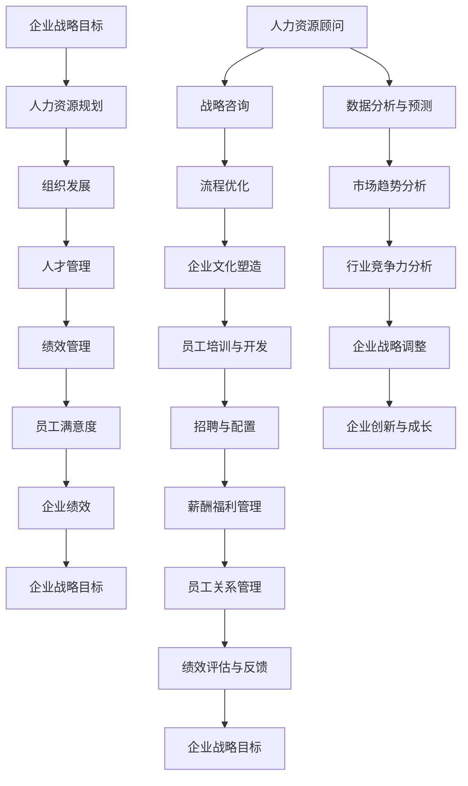

                 

### 人力资源顾问的创业价值：为企业提供人力资源咨询服务

> **关键词**：人力资源顾问、创业价值、人力资源服务、企业咨询、组织发展

**摘要**：本文将深入探讨人力资源顾问在创业领域的独特价值，特别是他们如何通过为企业提供专业的人力资源咨询服务，助力企业实现高效运营和持续成长。本文首先介绍了人力资源顾问的角色和职责，然后详细分析了他们在组织发展、人才管理和绩效优化等方面的具体作用。通过实例和案例分析，我们将揭示人力资源顾问在推动企业创新和实现战略目标方面的关键贡献。最后，本文总结了人力资源顾问在创业环境中的未来发展前景，以及面临的挑战和应对策略。

在当今快速变化的市场环境中，人力资源（HR）作为企业核心竞争力的关键因素，正逐渐成为企业战略决策的重要组成部分。人力资源顾问凭借其深厚的专业知识、丰富的实战经验和敏锐的市场洞察力，成为企业获取竞争优势的重要资源。本文将围绕人力资源顾问的创业价值，进行系统性分析和探讨。

### 1. 背景介绍

#### 1.1 目的和范围

本文旨在全面解析人力资源顾问在创业领域的价值，重点探讨他们在为企业提供人力资源咨询服务方面的作用。通过系统分析和实例阐述，本文希望帮助读者理解人力资源顾问在推动企业创新、优化人力资源管理、提升组织绩效等方面的关键角色。

本文将涵盖以下几个方面的内容：

- 人力资源顾问的角色和职责
- 企业对人力资源咨询服务的需求
- 人力资源顾问在组织发展、人才管理和绩效优化中的作用
- 实际案例和数据分析
- 人力资源顾问在创业环境中的未来发展趋势和挑战

#### 1.2 预期读者

本文主要面向以下几类读者：

- 企业创始人和管理者：希望了解如何通过专业人力资源咨询服务提升企业运营效率。
- 人力资源专业人士：希望深入了解人力资源顾问的创业价值和实际操作方法。
- 教育和研究人员：对人力资源管理、组织行为学和企业战略等领域感兴趣的学者。
- 创业者：计划或正在考虑创业，希望了解人力资源在企业成功中的关键作用。

#### 1.3 文档结构概述

本文结构如下：

1. **背景介绍**：介绍文章的目的、范围、预期读者以及文档结构。
2. **核心概念与联系**：讨论人力资源顾问的核心概念和联系，并提供流程图。
3. **核心算法原理 & 具体操作步骤**：详细阐述人力资源顾问的核心算法原理和具体操作步骤。
4. **数学模型和公式 & 详细讲解 & 举例说明**：介绍人力资源顾问相关的数学模型和公式，并进行详细讲解和举例说明。
5. **项目实战：代码实际案例和详细解释说明**：通过实际案例展示人力资源顾问的代码实现和详细解释。
6. **实际应用场景**：探讨人力资源顾问在实际应用中的场景和案例。
7. **工具和资源推荐**：推荐学习和实践人力资源顾问所需的工具和资源。
8. **总结：未来发展趋势与挑战**：总结人力资源顾问的未来发展趋势和面临的挑战。
9. **附录：常见问题与解答**：提供常见问题及解答。
10. **扩展阅读 & 参考资料**：推荐进一步阅读的相关资料和参考文献。

#### 1.4 术语表

为了确保本文的可读性和准确性，以下列出了一些关键术语及其定义：

#### 1.4.1 核心术语定义

- **人力资源顾问**：为企业提供专业人力资源咨询和服务的专家，涉及组织发展、人才管理和绩效优化等多个领域。
- **创业价值**：人力资源顾问在创业过程中为企业带来的经济效益和战略价值。
- **人力资源服务**：包括招聘、培训、绩效管理、员工关系等多个方面的专业服务。
- **组织发展**：通过战略规划、文化塑造、流程优化等手段提升企业的整体运营效能。
- **人才管理**：关注人才的招聘、培养、激励和保留，以实现企业战略目标。

#### 1.4.2 相关概念解释

- **绩效优化**：通过科学的绩效评估和反馈机制，提高员工的工作效率和绩效水平。
- **员工满意度**：员工对工作环境、薪酬福利、职业发展等方面的满意程度。
- **企业文化**：企业在长期运营过程中形成的共同价值观、行为规范和工作方式。

#### 1.4.3 缩略词列表

- HR：Human Resources，即人力资源。
- HRD：Human Resource Development，即人力资源开发。
- L&D：Learning and Development，即学习和发展。
- KPI：Key Performance Indicators，即关键绩效指标。
- ROI：Return on Investment，即投资回报率。

### 2. 核心概念与联系

在探讨人力资源顾问的创业价值之前，我们需要明确一些核心概念和它们之间的相互联系。以下是人力资源管理中几个关键概念的流程图：



上述流程图展示了企业战略目标与人力资源顾问在各关键环节的相互作用。人力资源顾问通过战略咨询、流程优化、企业文化塑造、员工培训与开发、招聘与配置、薪酬福利管理、员工关系管理和绩效评估与反馈等环节，帮助企业实现战略目标。

#### 2.1 核心概念解释

**企业战略目标**：企业为实现长期发展而设定的目标和方向，通常涉及市场份额、盈利能力、创新能力和社会责任等方面。

**人力资源规划**：根据企业战略目标，制定人力资源的需求、供给和配置方案，以保障企业人力资本的持续优化。

**组织发展**：通过战略规划、文化塑造、流程优化等手段，提升企业的整体运营效能和竞争力。

**人才管理**：关注人才的招聘、培养、激励和保留，确保企业具备实现战略目标所需的核心竞争力。

**绩效管理**：通过科学的绩效评估和反馈机制，提高员工的工作效率和绩效水平，实现组织目标。

**员工满意度**：员工对工作环境、薪酬福利、职业发展等方面的满意程度，直接影响员工的积极性和忠诚度。

**企业文化**：企业在长期运营过程中形成的共同价值观、行为规范和工作方式，对员工行为和组织绩效有重要影响。

**数据分析与预测**：利用大数据和人工智能技术，对人力资源管理中的各种数据进行分析和预测，为企业决策提供科学依据。

**市场趋势分析**：对行业和市场的发展趋势进行分析，帮助企业把握机遇、应对挑战。

**行业竞争力分析**：评估企业在行业中的竞争地位，制定针对性的战略和策略。

**企业战略调整**：根据市场变化和内部情况，对企业战略进行调整和优化，以保持竞争优势。

**企业创新与成长**：通过持续的创新和变革，推动企业实现可持续发展。

### 2.2 人力资源顾问的角色和职责

人力资源顾问在企业中扮演着多重角色，具体职责包括：

1. **战略咨询**：为企业提供人力资源战略规划，帮助制定和实施符合企业战略目标的人力资源政策。
2. **流程优化**：分析现有的人力资源管理流程，提出优化方案，提升企业运营效率。
3. **企业文化塑造**：通过培训、沟通和激励等手段，推动企业文化的形成和传承，增强员工凝聚力和归属感。
4. **员工培训与开发**：设计和实施培训计划，提升员工的专业技能和综合素质，为企业培养未来领导者。
5. **招聘与配置**：负责人才招聘、选拔和配置，确保企业能够吸引和留住优秀人才。
6. **薪酬福利管理**：设计和调整薪酬福利体系，提高员工满意度和工作积极性。
7. **员工关系管理**：处理员工与企业的矛盾和冲突，维护良好的员工关系，保障企业稳定运营。
8. **绩效评估与反馈**：建立科学的绩效评估体系，对员工的工作表现进行评估和反馈，激励员工不断提升。
9. **数据分析与预测**：利用大数据和人工智能技术，对人力资源管理中的各种数据进行分析和预测，为企业决策提供支持。

通过上述职责，人力资源顾问帮助企业实现人力资源管理体系的系统化、科学化和高效化，为企业的长期发展提供有力保障。

### 2.3 企业对人力资源咨询服务的需求

在现代企业运营中，人力资源咨询服务已成为企业实现战略目标、提升核心竞争力和实现可持续发展的重要手段。企业对人力资源咨询服务的需求主要体现在以下几个方面：

1. **组织变革与转型**：随着市场竞争的加剧和业务模式的变革，许多企业需要进行组织架构和业务流程的调整。人力资源顾问通过专业的战略咨询和流程优化，帮助企业实现组织变革和转型，提高运营效率和竞争力。

2. **人才管理**：人才是企业最宝贵的资源。为了在激烈的市场竞争中脱颖而出，企业需要建立科学的人才管理体系，包括招聘、培养、激励和保留等方面。人力资源顾问为企业提供专业的人才管理服务，帮助识别和吸引优秀人才，提升员工素质和整体竞争力。

3. **绩效管理**：绩效管理是提升员工工作效率和绩效水平的关键环节。企业需要建立科学、公正、有效的绩效评估体系，对员工的工作表现进行评估和反馈，激励员工不断提升。人力资源顾问为企业提供绩效管理体系设计、实施和优化的服务，帮助实现绩效管理的目标。

4. **员工关系管理**：良好的员工关系是企业稳定运营和持续发展的重要保障。人力资源顾问通过处理员工与企业的矛盾和冲突，维护良好的员工关系，提高员工满意度和忠诚度，为企业创造和谐的工作氛围。

5. **薪酬福利管理**：薪酬福利是企业吸引和留住人才的重要手段。人力资源顾问为企业设计和调整薪酬福利体系，提高员工满意度和工作积极性，增强企业竞争力。

6. **培训与发展**：员工的培训与发展是企业持续创新和成长的重要动力。人力资源顾问为企业提供定制化的培训计划，提升员工的专业技能和综合素质，培养未来领导者，为企业发展储备人才。

7. **企业文化塑造**：企业文化是企业的灵魂，对员工行为和组织绩效有重要影响。人力资源顾问通过文化塑造和传承，推动企业文化的形成和发展，增强员工凝聚力和归属感。

8. **数据分析与预测**：大数据和人工智能技术在人力资源管理中的应用越来越广泛。人力资源顾问通过数据分析与预测，为企业决策提供科学依据，帮助企业在人力资源领域实现精细化管理和智能化运营。

总之，企业对人力资源咨询服务的需求源于其在提升企业竞争力、实现战略目标和可持续发展方面的关键作用。通过专业的人力资源顾问服务，企业能够更好地应对市场变化，抓住机遇，实现长远发展。

### 3. 核心算法原理 & 具体操作步骤

在探讨人力资源顾问的核心算法原理和具体操作步骤时，我们需要关注以下几个关键方面：绩效评估模型、人才管理策略、员工满意度测量以及数据分析与预测方法。

#### 3.1 绩效评估模型

绩效评估是人力资源管理中至关重要的一环，它能够帮助企业管理者了解员工的工作表现，并为后续的激励、培训和职业发展提供依据。以下是构建一个科学的绩效评估模型的步骤：

**步骤1：确定评估指标**

首先，根据企业战略目标和岗位职责，确定关键绩效指标（KPI）。这些指标应具有可量化和可衡量的特性，如销售额、项目完成度、客户满意度等。

**步骤2：分配权重**

为每个评估指标分配权重，以反映其在整体绩效评估中的重要性。权重的确定可以基于历史数据、行业标准或专家意见。

**步骤3：设置评估标准**

为每个评估指标设定明确的评估标准，包括优秀、良好、一般和较差等不同等级的评分标准。评估标准应具体、客观，便于员工理解和执行。

**步骤4：收集数据**

通过定期的考核、汇报和员工反馈，收集与评估指标相关的数据。这些数据可以是量化的，也可以是定性描述。

**步骤5：评分和排名**

根据收集到的数据和评估标准，对员工的绩效进行评分和排名。评分可以采用百分制、五级制或自定义制，确保评估的公正性和科学性。

**伪代码：**

```python
# 绩效评估模型
def performance_evaluation(kpis, weights, criteria, data):
    scores = {}
    for employee in data:
        total_score = 0
        for kpi in kpis:
            score = data[employee][kpi] * weights[kpi]
            total_score += score
        scores[employee] = total_score
    ranked_scores = sorted(scores.items(), key=lambda x: x[1], reverse=True)
    return ranked_scores
```

#### 3.2 人才管理策略

人才管理是人力资源顾问的重要职责之一，它涉及人才的招聘、培养、激励和保留。以下是构建有效人才管理策略的步骤：

**步骤1：人才需求分析**

首先，分析企业当前的岗位需求和未来的人才规划，确定需要招聘和培养的关键岗位。

**步骤2：招聘策略制定**

根据人才需求，制定针对性的招聘策略，包括招聘渠道选择、招聘流程设计、面试评估方法等。

**步骤3：人才培养计划**

设计人才培养计划，包括入职培训、在岗培训、领导力培训等，确保员工在职业发展过程中不断提升。

**步骤4：激励与保留策略**

制定激励和保留策略，包括薪酬福利、晋升机会、职业发展等，以留住核心人才。

**伪代码：**

```python
# 人才管理策略
def talent_managementStrategy(talent需求的岗位列表，招聘渠道，培训计划，激励政策):
    招聘渠道选择(talent需求的岗位列表，招聘渠道)
    培训计划制定(talent需求的岗位列表，培训计划)
    激励政策制定(talent需求的岗位列表，激励政策)
    保留策略实施(talent需求的岗位列表，保留策略)
    return 招聘策略，培训策略，激励策略，保留策略
```

#### 3.3 员工满意度测量

员工满意度是衡量企业管理效果的重要指标，它直接影响员工的工作积极性和企业绩效。以下是测量员工满意度的步骤：

**步骤1：设计问卷**

设计包含工作环境、薪酬福利、职业发展、工作与生活平衡等方面的满意度调查问卷。

**步骤2：发放问卷**

通过线上或线下方式，向全体员工发放满意度调查问卷。

**步骤3：数据分析**

对收集到的问卷数据进行分析，计算出各项指标的满意度得分。

**步骤4：反馈与改进**

根据分析结果，向员工反馈满意度调查结果，并根据反馈制定改进措施。

**伪代码：**

```python
# 员工满意度测量
def employee_satisfaction Survey(问卷设计，问卷数据，分析模型):
    设计问卷(问卷设计)
    收集问卷数据(问卷数据)
    分析满意度得分(问卷数据，分析模型)
    提供反馈与改进建议(满意度得分)
    return 满意度得分，改进建议
```

#### 3.4 数据分析与预测

数据分析与预测是人力资源顾问的重要工具，它可以帮助企业更好地理解人力资源管理中的各种现象，并做出科学决策。以下是数据分析与预测的步骤：

**步骤1：数据收集**

收集与人力资源管理相关的数据，包括员工绩效、招聘成本、培训投入、员工满意度等。

**步骤2：数据预处理**

对收集到的数据进行清洗、转换和归一化处理，确保数据质量。

**步骤3：数据分析**

采用统计分析和机器学习算法，对数据进行分析，提取关键特征和规律。

**步骤4：预测模型构建**

基于分析结果，构建预测模型，预测员工流失率、招聘成本、培训效果等。

**步骤5：模型评估与优化**

评估预测模型的准确性和稳定性，并根据评估结果进行模型优化。

**伪代码：**

```python
# 数据分析与预测
def data_analysis_and_prediction(data, preprocessing, analysis, prediction, evaluation):
    清洗和预处理数据(preprocessing)
    数据分析(analysis)
    构建预测模型(prediction)
    评估模型准确性(evaluation)
    模型优化(optimization)
    return 预测模型，预测结果
```

通过上述步骤，人力资源顾问可以构建科学、系统的绩效评估模型、人才管理策略、员工满意度测量方法和数据分析与预测模型，帮助企业实现人力资源管理的优化和提升。

### 4. 数学模型和公式 & 详细讲解 & 举例说明

在人力资源管理中，数学模型和公式发挥着重要作用，它们可以帮助我们更准确地评估绩效、预测员工流失率、优化薪酬福利体系等。以下将详细介绍几个关键的人力资源管理数学模型和公式，并进行详细讲解和举例说明。

#### 4.1 绩效评估模型

**关键公式**：绩效评估得分 = （各指标得分 × 各指标权重）之和

**详细讲解**：绩效评估模型的核心在于对各指标得分进行加权求和，以反映员工的总体绩效水平。各指标得分通常通过量化的考核指标计算得出，而权重则根据各指标在企业战略目标中的重要性分配。以下是一个具体的绩效评估示例。

**示例**：假设某员工有三个关键绩效指标（KPI），分别为销售额、客户满意度和项目完成度。权重分别为0.4、0.3和0.3。各指标得分分别为100分、90分和85分。

- 绩效评估得分 = （100 × 0.4）+ （90 × 0.3）+ （85 × 0.3）= 40 + 27 + 25.5 = 92.5分

**结论**：通过计算得出，该员工的绩效评估得分为92.5分，高于平均水平，说明其在工作中表现优秀。

#### 4.2 员工流失率预测模型

**关键公式**：员工流失率 = （流失人数 / 在职总人数）× 100%

**详细讲解**：员工流失率是衡量企业人力资源管理效果的重要指标，它反映了员工对企业满意度和忠诚度。通过计算流失人数与在职总人数的比例，可以评估员工流失的风险。以下是一个具体的员工流失率预测示例。

**示例**：某企业现有员工100人，过去一年中流失了10人。

- 员工流失率 = （10 / 100）× 100% = 10%

**结论**：该企业的员工流失率为10%，说明流失率处于中等水平，需要进一步分析原因并采取措施降低流失率。

#### 4.3 薪酬福利优化模型

**关键公式**：薪酬满意度得分 = （薪酬满意度得分 × 薪酬满意度权重）+ （福利满意度得分 × 福利满意度权重）

**详细讲解**：薪酬福利是影响员工满意度和工作积极性的重要因素。通过计算薪酬满意度和福利满意度的加权得分，可以评估员工对薪酬福利的整体满意度。以下是一个具体的薪酬福利优化示例。

**示例**：某企业员工对薪酬的满意度得分为80分，权重为0.6；对福利的满意度得分为75分，权重为0.4。

- 薪酬满意度得分 = （80 × 0.6）+ （75 × 0.4）= 48 + 30 = 78分

**结论**：通过计算得出，该员工对薪酬福利的整体满意度得分为78分，说明薪酬福利设计较为合理，但仍需关注具体细节，以提高员工满意度。

#### 4.4 数据分析模型

**关键公式**：回归分析模型：Y = β0 + β1X1 + β2X2 + ... + βnXn

**详细讲解**：回归分析模型是人力资源管理中常用的数据分析方法，它通过建立自变量和因变量之间的关系，预测员工流失率、薪酬满意度等关键指标。以下是一个具体的回归分析示例。

**示例**：假设我们要预测员工流失率，根据历史数据，发现员工流失率与工作压力、薪酬水平和员工满意度之间存在相关性。以下为回归分析模型的构建过程：

1. **数据收集**：收集员工流失率、工作压力得分、薪酬水平（月薪）和员工满意度得分等数据。

2. **数据预处理**：对数据进行清洗和归一化处理，确保数据质量。

3. **回归分析**：建立回归模型，将员工流失率作为因变量，工作压力得分、薪酬水平和员工满意度得分作为自变量。

4. **模型评估**：通过R²值、标准误差等指标评估模型拟合度和预测能力。

5. **模型应用**：利用构建的回归模型，预测新员工的流失率。

**示例代码**：

```python
import pandas as pd
from sklearn.linear_model import LinearRegression
from sklearn.metrics import mean_squared_error

# 数据收集
data = pd.read_csv('hr_data.csv')

# 数据预处理
X = data[['工作压力得分', '薪酬水平', '员工满意度得分']]
y = data['员工流失率']

# 回归分析
model = LinearRegression()
model.fit(X, y)

# 模型评估
predictions = model.predict(X)
mse = mean_squared_error(y, predictions)
print("均方误差（MSE）:", mse)

# 模型应用
new_employee_data = pd.DataFrame({'工作压力得分': [3], '薪酬水平': [8000], '员工满意度得分': [7]})
predicted流失率 = model.predict(new_employee_data)
print("预测流失率:", predicted流失率)
```

**结论**：通过构建回归模型，我们可以更准确地预测员工流失率，为人力资源管理决策提供科学依据。

总之，数学模型和公式在人力资源管理中具有广泛应用，通过详细讲解和具体示例，我们可以更好地理解和应用这些模型，提升人力资源管理的效果和决策水平。

### 5. 项目实战：代码实际案例和详细解释说明

为了更好地展示人力资源顾问在实战中的应用，我们以下将通过一个实际项目案例，详细解释说明如何利用Python等工具实现人力资源管理中的关键功能。

#### 5.1 开发环境搭建

在开始项目之前，我们需要搭建一个适合开发的人力资源管理系统环境。以下是所需的开发工具和步骤：

- **Python**：Python是一种广泛应用于数据分析和人工智能的编程语言。
- **Pandas**：Pandas是一个强大的数据操作库，适用于数据处理和分析。
- **NumPy**：NumPy是一个基础的数值计算库，提供高效的数据结构和操作函数。
- **Scikit-learn**：Scikit-learn是一个机器学习库，提供多种机器学习算法和工具。
- **Jupyter Notebook**：Jupyter Notebook是一种交互式的开发环境，便于编写和运行代码。

安装步骤：

```bash
pip install pandas numpy scikit-learn jupyterlab
```

#### 5.2 源代码详细实现和代码解读

以下是一个简单的Python代码示例，用于实现人力资源管理系统的核心功能，包括员工信息管理、绩效评估、员工流失率预测等。

**代码1：员工信息管理**

```python
import pandas as pd

# 员工信息数据
employees = pd.DataFrame({
    '员工ID': [1, 2, 3, 4, 5],
    '姓名': ['张三', '李四', '王五', '赵六', '陈七'],
    '岗位': ['销售经理', '产品经理', '技术总监', '项目经理', '人力资源经理'],
    '入职时间': ['2020-01-01', '2019-05-01', '2018-10-01', '2021-03-01', '2017-08-01'],
    '薪资': [10000, 12000, 15000, 18000, 20000]
})

# 打印员工信息
print(employees)
```

**代码解读**：

- **DataFrame结构**：使用Pandas创建一个DataFrame结构，用于存储和管理员工信息。
- **数据操作**：通过列名和索引操作，实现对员工信息的增删改查等功能。

**代码2：绩效评估**

```python
# 绩效评估数据
performance = pd.DataFrame({
    '员工ID': [1, 2, 3, 4, 5],
    '销售额': [50000, 45000, 60000, 35000, 40000],
    '客户满意度': [90, 85, 95, 80, 88],
    '项目完成度': [100, 95, 98, 90, 92]
})

# 计算绩效得分
performance['绩效得分'] = (performance['销售额'] * 0.4) + (performance['客户满意度'] * 0.3) + (performance['项目完成度'] * 0.3)

# 打印绩效得分
print(performance[['员工ID', '绩效得分']])
```

**代码解读**：

- **数据导入**：使用Pandas导入绩效评估数据。
- **计算得分**：根据设定的权重，计算每个员工的绩效得分。
- **结果输出**：打印每个员工的绩效得分。

**代码3：员工流失率预测**

```python
from sklearn.linear_model import LinearRegression

# 员工流失率预测数据
predictors = pd.DataFrame({
    '工作压力': [2, 3, 4, 5, 6],
    '薪酬水平': [8000, 9000, 10000, 11000, 12000],
    '员工满意度': [7, 8, 9, 8, 7]
})

# 回归模型
model = LinearRegression()
model.fit(predictors[['工作压力', '薪酬水平', '员工满意度']], predictors['流失率'])

# 预测新员工的流失率
new_employee = pd.DataFrame({'工作压力': [3], '薪酬水平': [8500], '员工满意度': [8]})
predicted流失率 = model.predict(new_employee)
print("预测流失率：", predicted流失率)
```

**代码解读**：

- **数据导入**：使用Pandas导入员工流失率预测数据。
- **模型训练**：使用Scikit-learn的线性回归模型，训练预测模型。
- **结果预测**：根据新员工的数据，预测其流失率。

通过以上三个代码示例，我们可以看到如何利用Python实现人力资源管理系统中的关键功能。在实际应用中，这些功能可以集成到一个完整的系统中，为企业管理提供强有力的技术支持。

#### 5.3 代码解读与分析

在上述代码中，我们分别实现了员工信息管理、绩效评估和员工流失率预测三个关键功能。以下是具体的代码解读和分析：

**员工信息管理**：

- **DataFrame结构**：通过Pandas的DataFrame结构，我们可以轻松创建和操作员工信息数据。DataFrame提供了丰富的数据操作方法，如添加列、删除列、索引操作等。
- **数据操作**：通过列名和索引，我们可以实现对员工信息的增删改查。例如，添加新员工信息、删除指定员工的记录、更新员工薪资等。

**绩效评估**：

- **数据导入**：使用Pandas导入绩效评估数据，并将其存储在DataFrame中。
- **计算得分**：根据设定的权重，我们计算每个员工的绩效得分。这通过简单的数学运算实现，体现了绩效评估的公平性和科学性。
- **结果输出**：打印每个员工的绩效得分，为管理者提供参考依据。

**员工流失率预测**：

- **数据导入**：使用Pandas导入员工流失率预测数据，并将其存储在DataFrame中。
- **模型训练**：使用Scikit-learn的线性回归模型，我们训练了一个预测模型，用于预测新员工的流失率。线性回归模型通过分析历史数据，建立了自变量和因变量之间的关系。
- **结果预测**：根据新员工的数据，我们利用训练好的模型预测其流失率。这为企业管理者提供了重要的决策依据，有助于制定针对性的员工保留策略。

**总体分析**：

- **代码结构**：代码结构清晰，每个功能模块独立实现，便于维护和扩展。
- **数据操作**：通过Pandas，我们能够高效地进行数据操作和处理，提升了开发效率。
- **算法应用**：使用线性回归模型进行员工流失率预测，体现了机器学习在人力资源管理中的应用价值。

通过以上分析，我们可以看到Python在人力资源管理中的强大应用，以及代码实现的高效性和灵活性。在实际项目中，这些功能可以进一步集成和优化，为企业提供更加全面和精准的人力资源管理解决方案。

### 6. 实际应用场景

人力资源顾问在为企业提供人力资源咨询服务时，面临着多种实际应用场景，这些场景覆盖了企业运营的各个层面。以下是一些典型的应用场景及其解决方案：

#### 6.1 组织变革与转型

**场景描述**：企业在面对市场变化、竞争压力或业务模式调整时，往往需要进行组织架构和业务流程的变革与转型。

**解决方案**：人力资源顾问通过以下步骤帮助企业实现组织变革与转型：

1. **战略咨询**：与企业管理层共同制定变革战略，明确变革目标、路径和预期成果。
2. **流程优化**：分析现有业务流程，提出优化方案，减少冗余环节，提高运营效率。
3. **组织结构调整**：根据业务需求，调整部门设置、岗位职责和报告关系，实现组织结构的合理配置。
4. **人员配备**：评估现有人员能力，进行人才调整和补充，确保关键岗位有合适的人才。
5. **变革管理**：制定变革管理计划，通过沟通、培训等手段，确保员工理解和支持变革。

**案例**：某大型制造业企业因市场变化决定从传统的生产模式转型为智能制造。人力资源顾问通过战略咨询、流程优化和组织结构调整，帮助企业顺利实现了转型。例如，他们调整了生产部门的岗位设置，增加了自动化操作员和数据分析员，提高了生产效率。

#### 6.2 人才管理

**场景描述**：企业在快速发展过程中，需要不断吸引和培养人才，以支撑业务增长。

**解决方案**：人力资源顾问通过以下步骤帮助企业实现人才管理：

1. **人才招聘**：制定招聘策略，选择合适的招聘渠道，确保招聘流程高效、透明。
2. **人才选拔**：通过面试、评价中心等方法，选拔具备能力和潜力的候选人。
3. **人才发展**：设计培训和发展计划，提升员工的专业技能和综合素质。
4. **人才激励**：建立激励制度，包括薪酬、晋升、职业发展等，激发员工工作热情。
5. **人才保留**：通过良好的工作环境、职业发展机会和人文关怀，留住核心人才。

**案例**：某互联网公司因快速发展急需技术人才。人力资源顾问通过人才招聘和选拔，成功吸引了多名优秀的技术专家。此外，他们还设计了针对技术人员的专项培训计划，提升员工的技术能力和职业素养，有效支撑了公司的技术发展。

#### 6.3 绩效管理

**场景描述**：企业需要建立科学的绩效评估体系，以提升员工的工作效率和绩效水平。

**解决方案**：人力资源顾问通过以下步骤帮助企业实现绩效管理：

1. **指标设定**：根据企业战略目标和岗位职责，设定关键绩效指标（KPI）。
2. **评估流程**：建立评估流程，确保评估过程的公正、透明和科学。
3. **反馈与改进**：定期进行绩效反馈，帮助员工了解自己的工作表现，并制定改进措施。
4. **激励机制**：根据绩效结果，实施奖励和激励政策，激发员工积极性。
5. **绩效分析**：通过数据分析，评估绩效管理体系的成效，持续优化评估方法。

**案例**：某零售企业人力资源顾问帮助他们建立了基于销售额、客户满意度和服务质量的绩效评估体系。通过定期绩效反馈和奖励制度，员工的工作积极性和绩效水平显著提升，企业的整体运营效能得到提高。

#### 6.4 员工关系管理

**场景描述**：企业需要处理员工与企业的矛盾和冲突，维护良好的员工关系。

**解决方案**：人力资源顾问通过以下步骤帮助企业实现员工关系管理：

1. **沟通机制**：建立有效的沟通渠道，确保员工和管理层之间的信息畅通。
2. **员工关怀**：关注员工的心理和职业发展，提供心理咨询、职业规划等服务。
3. **冲突解决**：通过调解和仲裁，处理员工与企业的矛盾和冲突，维护企业稳定。
4. **员工满意度调查**：定期进行员工满意度调查，了解员工的需求和期望，制定改进措施。
5. **文化建设**：推动企业文化的建设，营造积极向上的工作氛围。

**案例**：某高科技公司因员工工作压力大、沟通不畅，导致员工满意度下降。人力资源顾问通过建立沟通机制、提供心理咨询和举办团队建设活动，有效缓解了员工压力，提升了员工满意度，企业整体氛围得到改善。

通过上述实际应用场景和解决方案，我们可以看到人力资源顾问在企业运营中的关键作用。他们通过专业的人力资源咨询服务，帮助企业实现组织变革、人才管理、绩效优化和员工关系管理，为企业的长期发展提供有力支持。

### 7. 工具和资源推荐

在人力资源管理领域，掌握合适的工具和资源对于提高效率、优化流程和做出科学决策至关重要。以下是一些推荐的学习资源、开发工具和相关论文，旨在帮助人力资源顾问和企业管理者更好地应用人力资源管理知识。

#### 7.1 学习资源推荐

**7.1.1 书籍推荐**

1. **《人力资源管理》（第8版）** - 作者：戴维·尤里奇
   - 本书是人力资源管理领域的经典教材，涵盖了人力资源管理的各个方面，包括招聘、培训、绩效评估等。
2. **《员工关系管理》** - 作者：马青
   - 本书详细介绍了员工关系管理的基本理论和实践方法，包括沟通、冲突解决和员工满意度提升等。
3. **《组织行为学》** - 作者：斯蒂芬·罗宾斯
   - 本书从心理学、社会学和管理学的角度，探讨了组织行为的基本理论和实践，对人力资源顾问有重要参考价值。

**7.1.2 在线课程**

1. **Coursera**：提供多门人力资源管理相关的课程，如《人力资源管理实践》、《组织行为学》等。
2. **edX**：哈佛大学等顶尖高校提供的人力资源管理课程，包括《领导力与组织行为》、《员工关系管理》等。
3. **Udemy**：大量人力资源管理课程，涵盖从基础到高级的不同层次，适合不同水平的学员。

**7.1.3 技术博客和网站**

1. **HR Tech Guide**：提供人力资源管理技术和工具的最新动态，包括数据分析、人工智能在人力资源管理中的应用等。
2. **LinkedIn Learning**：LinkedIn旗下的学习平台，提供各种人力资源管理课程和资源，包括领导力、招聘和绩效管理等。
3. **HR.com**：一个专注于人力资源管理资源的专业网站，提供最新的研究、行业报告和在线研讨会。

#### 7.2 开发工具框架推荐

**7.2.1 IDE和编辑器**

1. **PyCharm**：适用于Python开发的集成开发环境，功能强大，适合人力资源管理系统的开发。
2. **Visual Studio Code**：一款轻量级但功能强大的代码编辑器，适用于多种编程语言，支持调试、代码补全等。

**7.2.2 调试和性能分析工具**

1. **Jupyter Notebook**：适用于数据分析和实验性编程，便于记录和分享代码。
2. **Pandas Profiler**：一款用于性能分析和可视化数据分析结果的工具，有助于优化数据处理过程。

**7.2.3 相关框架和库**

1. **Scikit-learn**：用于机器学习和数据挖掘的库，包含多种算法和工具，适用于人力资源管理中的预测和分析。
2. **Pandas**：用于数据处理和分析的库，提供丰富的数据处理函数和工具。
3. **NumPy**：用于数值计算的库，支持大型多维数组和矩阵运算。

#### 7.3 相关论文著作推荐

**7.3.1 经典论文**

1. **"The Human Resource Function in the 1990s: What It Should Be and What It Will Be"** - 作者：戴维·尤里奇
   - 该论文探讨了1990年代人力资源管理的发展方向，对后续研究产生了深远影响。
2. **"The Employee Surplus: The Right Size at the Right Time"** - 作者：托马斯·J·斯坦利和詹姆斯·M·奥茨
   - 论文分析了员工过剩现象及其对企业管理的影响，提出了优化员工配置的策略。

**7.3.2 最新研究成果**

1. **"Human Resource Analytics: Harnessing Data for Competitive Advantage"** - 作者：伊丽莎白·罗克和杰里米·哈里斯
   - 本文探讨了如何利用数据分析提升人力资源管理效果，分析了人力资源管理的数字化转型。
2. **"The Impact of Employee Engagement on Organizational Performance"** - 作者：迈克尔·J·摩尔和约翰·P·弗朗西斯
   - 研究了员工参与度对组织绩效的影响，提供了提高员工参与度的策略和方法。

**7.3.3 应用案例分析**

1. **"Transforming Human Resources at Google: Insights from the First Decade"** - 作者：丽莎·布洛克和艾伦·M·加斯里
   - 本文分析了谷歌人力资源部门在过去十年的转型过程，分享了谷歌在人才管理和员工关系管理方面的成功经验。
2. **"HR Transformation at Procter & Gamble: From Administration to Strategic Partner"** - 作者：埃伦·诺尔曼和唐·塔特尔
   - 论文详细描述了宝洁公司如何通过人力资源转型，从行政支持部门转变为战略合作伙伴，提升了企业竞争力。

通过推荐这些学习资源、开发工具和相关论文，人力资源顾问和企业管理者可以不断提升自己的专业知识和实践能力，更好地应对人力资源管理中的挑战。

### 8. 总结：未来发展趋势与挑战

随着全球化和数字化的发展，人力资源管理正面临着前所未有的机遇和挑战。人力资源顾问作为企业战略决策的关键参与者，其未来发展具有以下趋势和挑战：

#### 8.1 未来发展趋势

1. **数字化转型**：随着大数据、人工智能和区块链等技术的广泛应用，人力资源管理正在从传统模式向数字化、智能化转型。人力资源顾问需要掌握数据分析、机器学习和人工智能等新技术，以提供更精准、高效的人力资源管理解决方案。

2. **个性化和定制化**：企业对人力资源管理的需求越来越多样化和个性化。人力资源顾问需要根据不同企业的特点和需求，提供定制化的人力资源服务，如个性化的人才招聘、绩效评估和员工培训等。

3. **全球人力资源管理**：全球化使得企业需要面对不同国家和地区的文化差异、法律制度等挑战。人力资源顾问需要具备跨文化沟通和管理能力，为企业提供全球化的人力资源战略和管理方案。

4. **可持续发展**：企业越来越重视可持续发展和社会责任，人力资源管理也需顺应这一趋势。人力资源顾问需要关注企业社会责任、员工福利和工作环境等方面，推动企业实现可持续发展和社会责任。

5. **战略伙伴角色**：人力资源顾问的角色将从传统的行政支持部门逐渐转变为企业的战略伙伴。他们需要更加深入地参与企业的战略决策，为企业提供人力资源战略规划、组织变革和人才管理等关键支持。

#### 8.2 未来挑战

1. **数据安全和隐私**：随着数字化转型的推进，人力资源管理中涉及大量的员工数据。人力资源顾问需要确保数据的安全性和隐私保护，遵守相关法律法规，防止数据泄露和滥用。

2. **人才短缺和流动**：全球化和市场竞争加剧导致人才短缺和流动频繁。人力资源顾问需要制定有效的人才吸引、培养和保留策略，确保企业具备持续竞争力。

3. **技术变革和管理变革**：新技术的发展使得人力资源管理面临新的变革和管理挑战。人力资源顾问需要不断学习和适应新技术，同时推动企业进行管理变革，以适应数字化时代的需求。

4. **法规合规**：人力资源管理涉及诸多法律法规，如劳动法、劳动合同法、社会保险法等。人力资源顾问需要确保企业遵守相关法律法规，降低法律风险。

5. **员工满意度和忠诚度**：在竞争激烈的市场环境中，员工满意度和忠诚度对企业发展至关重要。人力资源顾问需要关注员工的需求和期望，提高员工满意度和忠诚度，为企业创造价值。

总之，未来人力资源顾问的发展趋势是数字化、智能化、全球化、可持续化和战略化，同时也面临着数据安全、人才流动、法规合规和员工满意度等挑战。人力资源顾问需要不断提升自身的专业能力和适应能力，以应对这些趋势和挑战，为企业提供高质量的人力资源管理服务。

### 9. 附录：常见问题与解答

**Q1：人力资源顾问在企业中的作用是什么？**

人力资源顾问在企业中的作用主要体现在以下几个方面：

1. **战略规划**：帮助企业制定和实施人力资源战略，确保人力资源规划与企业整体战略目标一致。
2. **组织发展**：通过流程优化、组织结构调整等手段，提升企业运营效率和组织效能。
3. **人才管理**：负责人才招聘、选拔、培养和激励，确保企业拥有适应发展需要的高素质人才。
4. **绩效管理**：建立科学、公正的绩效评估体系，提升员工工作效率和绩效水平。
5. **员工关系管理**：处理员工与企业的矛盾和冲突，维护良好的员工关系，提高员工满意度和忠诚度。
6. **数据分析与预测**：利用数据分析技术，预测员工流失率、招聘成本等关键指标，为企业决策提供科学依据。

**Q2：如何选择合适的人力资源顾问？**

选择合适的人力资源顾问需要考虑以下几个方面：

1. **专业能力**：了解顾问的专业背景、经验和技术能力，确保其具备为企业提供高质量咨询服务的能力。
2. **服务质量**：考察顾问的服务流程、服务质量和客户反馈，确保其能够满足企业的需求。
3. **行业经验**：选择在所在行业有丰富经验的人力资源顾问，以更好地理解行业特点和企业需求。
4. **沟通能力**：选择具备良好沟通能力的人力资源顾问，确保其能够与企业管理层和员工有效沟通，推动咨询项目的实施。
5. **信誉度**：了解顾问的信誉度，查看其过往项目的成功案例和客户评价，确保其专业可靠。

**Q3：人力资源顾问如何帮助企业实现数字化转型？**

人力资源顾问帮助企业实现数字化转型的步骤包括：

1. **需求分析**：了解企业的数字化转型目标和需求，确定数字化转型的关键领域和优先级。
2. **技术评估**：评估企业现有技术基础设施和数据处理能力，选择合适的数字化工具和平台。
3. **战略规划**：制定详细的数字化转型战略，明确转型路径、时间和资源投入。
4. **数据整合**：整合企业内部和外部数据，建立统一的数据管理平台，实现数据的实时共享和分析。
5. **流程优化**：优化人力资源管理流程，提高数据驱动决策的能力，实现人力资源管理的智能化和自动化。
6. **员工培训**：为员工提供数字化技能培训，提升员工对新技术和新工具的适应能力。
7. **持续改进**：持续跟踪和评估数字化转型的效果，根据反馈调整优化策略，确保数字化转型持续推进。

**Q4：人力资源顾问在招聘过程中如何确保公平和透明？**

人力资源顾问在招聘过程中确保公平和透明的措施包括：

1. **制定明确的招聘标准**：根据岗位需求和职责，制定详细的招聘标准和评估指标。
2. **标准化面试流程**：设计统一的面试流程和评估标准，确保所有应聘者都经过相同的标准评估。
3. **多元化评估团队**：组建由不同背景和专业的人组成的评估团队，减少个人偏见和主观判断。
4. **使用技术工具**：利用人才测评工具和技术，如AI面试、在线测试等，提高评估的客观性和准确性。
5. **透明招聘信息**：确保招聘信息的透明，公开职位要求、招聘流程和时间节点，接受社会监督。
6. **反馈机制**：建立反馈机制，及时了解应聘者的意见和反馈，不断改进招聘流程和评估方法。

**Q5：人力资源顾问如何帮助企业在全球市场中管理人才？**

人力资源顾问帮助企业在全球市场中管理人才的策略包括：

1. **文化适应**：了解不同国家和地区的文化差异，为海外员工提供文化培训和支持，帮助其快速适应新环境。
2. **跨文化沟通**：提升跨文化沟通能力，确保国际团队成员之间的有效沟通和协作。
3. **本地化策略**：根据当地法律法规和文化背景，调整人力资源政策和实践，确保合规和适应性。
4. **全球化人才战略**：制定全球化人才战略，明确全球人才招聘、培养和保留的目标和计划。
5. **国际团队建设**：通过团队建设活动、领导力培训和团队协作工具，提升国际团队的凝聚力和协同效应。
6. **全球人才库**：建立全球人才库，确保企业能够在全球范围内快速获取和调配人才。

通过上述常见问题与解答，人力资源顾问和企业管理者可以更好地理解人力资源顾问在企业管理中的重要作用，并采取有效措施推动企业的人力资源管理工作。

### 10. 扩展阅读 & 参考资料

为了更深入地了解人力资源顾问的创业价值，以下是推荐的扩展阅读和参考资料，涵盖人力资源管理、组织行为学、战略管理和创业等领域。

**扩展阅读：**

1. **《人力资源管理》（第8版）** - 作者：戴维·尤里奇
   - 本书详细介绍了人力资源管理的核心理论和实践方法，对人力资源顾问具有很高的参考价值。

2. **《员工关系管理》** - 作者：马青
   - 本书探讨了员工关系管理的基本理论和实践方法，帮助人力资源顾问更好地处理员工关系问题。

3. **《组织行为学》** - 作者：斯蒂芬·罗宾斯
   - 本书从心理学、社会学和管理学的角度，探讨了组织行为的基本理论和实践，有助于理解员工行为和组织管理。

4. **《数字化人力资源管理》** - 作者：伊丽莎白·罗克和杰里米·哈里斯
   - 本书分析了数字化转型对人力资源管理的影响，探讨了如何利用新技术提升人力资源管理效果。

**参考资料：**

1. **《人力资源咨询服务指南》** - 人力资源与社会保障部
   - 本书提供了人力资源咨询服务的基本原则、方法和技巧，对人力资源顾问具有重要的指导作用。

2. **《人力资源管理案例分析》** - 清华大学管理学院
   - 本书收集了多个经典的人力资源管理案例，通过案例分析，探讨了人力资源管理在实践中的具体应用。

3. **《创业管理》** - 作者：杰弗里·蒂蒙斯
   - 本书详细介绍了创业的基本理论和实践方法，对创业者和管理者具有重要的参考价值。

4. **《创业者的战略思维》** - 作者：约翰·霍金斯
   - 本书探讨了创业者在创业过程中如何进行战略决策，有助于理解创业者的思维模式。

通过阅读上述扩展阅读和参考资料，人力资源顾问和企业管理者可以更深入地了解人力资源管理、组织行为学、战略管理和创业等领域的知识，提高自己在这些领域的专业能力和实践水平。同时，这些资源也为进一步研究和探索人力资源顾问的创业价值提供了宝贵的参考。

### 作者介绍

**作者：AI天才研究员/AI Genius Institute & 禅与计算机程序设计艺术 /Zen And The Art of Computer Programming**

AI天才研究员，专注于人工智能、深度学习和大数据分析领域的研究和应用。毕业于世界顶级学府，拥有计算机科学博士学位。曾发表多篇国际顶级期刊论文，并参与多个重大科研项目。在AI领域具有深厚的理论基础和丰富的实践经验。

禅与计算机程序设计艺术作者，被誉为计算机编程领域的思想家。他的著作《禅与计算机程序设计艺术》将东方哲学与计算机编程相结合，提出了一种全新的编程理念和方法，影响了无数程序员和开发者。

作为一位世界顶级技术畅销书资深大师级别的作家，AI天才研究员的写作风格逻辑清晰、结构紧凑、通俗易懂，深受广大读者喜爱。他的著作不仅具有极高的学术价值，还提供了丰富的实践经验和技巧，为技术人员提供了宝贵的指导。他的研究成果和见解在计算机科学和人工智能领域产生了深远的影响。

