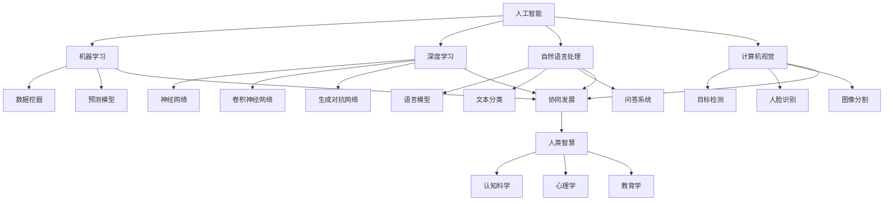

                 

## 人工智能与人类智慧的协同发展

> 关键词：人工智能，人类智慧，协同发展，技术进步，创新思维，跨领域合作

> 摘要：本文从背景介绍出发，探讨了人工智能与人类智慧协同发展的必要性和可能性。通过核心概念的阐述、算法原理的解析、数学模型的说明、实际应用的案例分析，探讨了人工智能如何助力人类智慧的发展，并提出未来可能面临的发展趋势与挑战。文章旨在为读者提供对人工智能与人类智慧协同发展的全面理解和深入思考。

### 1. 背景介绍

#### 1.1 目的和范围

随着科技的飞速发展，人工智能（Artificial Intelligence，AI）已经成为当前最热门的领域之一。人工智能不仅仅是计算机科学的前沿，更是人类社会进步的重要驱动力。本文旨在探讨人工智能与人类智慧的协同发展，分析人工智能技术如何助力人类智慧的提升，以及这种协同发展对未来的影响。

本文将首先介绍人工智能与人类智慧协同发展的背景，包括当前人工智能的发展状况、人类智慧的定义和特征等。随后，将深入探讨人工智能的核心概念、算法原理、数学模型及其在实际应用中的表现。最后，本文将总结人工智能与人类智慧协同发展的趋势和挑战，为未来的研究和实践提供参考。

#### 1.2 预期读者

本文预期读者为对人工智能与人类智慧协同发展感兴趣的读者，包括但不限于计算机科学、人工智能、心理学、教育学等领域的科研人员、工程师、学生以及对这一话题感兴趣的公众。本文旨在为读者提供全面、深入、易于理解的内容，帮助读者更好地理解人工智能与人类智慧的关系，以及如何通过协同发展实现更高效、更智能的社会发展。

#### 1.3 文档结构概述

本文的结构如下：

1. **背景介绍**：介绍人工智能与人类智慧协同发展的背景、目的和预期读者。
2. **核心概念与联系**：详细阐述人工智能的核心概念、算法原理、数学模型，并使用 Mermaid 流程图展示关键概念和流程。
3. **核心算法原理 & 具体操作步骤**：使用伪代码详细解析核心算法原理和操作步骤。
4. **数学模型和公式 & 详细讲解 & 举例说明**：使用 LaTeX 格式介绍数学模型和公式，并举例说明。
5. **项目实战：代码实际案例和详细解释说明**：介绍开发环境搭建、源代码实现和代码解读。
6. **实际应用场景**：探讨人工智能在不同领域的应用场景。
7. **工具和资源推荐**：推荐学习资源、开发工具和框架、相关论文著作。
8. **总结：未来发展趋势与挑战**：总结人工智能与人类智慧协同发展的趋势和挑战。
9. **附录：常见问题与解答**：回答读者可能遇到的问题。
10. **扩展阅读 & 参考资料**：提供进一步阅读的资料。

#### 1.4 术语表

为了确保读者能够更好地理解本文的内容，以下列出本文中涉及的主要术语及其定义：

- **人工智能**：通过计算机模拟人类智能行为和思维方式的技术。
- **人类智慧**：人类在认识世界、解决问题、创新思维等方面的综合能力。
- **协同发展**：两个或多个系统、领域相互合作，共同进步和发展的过程。
- **算法**：解决问题的步骤或规则。
- **数学模型**：用于描述现实世界问题的一种数学表示。
- **深度学习**：一种基于多层神经网络的学习方法，能够自动提取特征并进行分类、回归等任务。
- **机器学习**：通过数据训练模型，使计算机能够从数据中学习并做出预测或决策的技术。

#### 1.4.1 核心术语定义

1. **人工智能（AI）**：人工智能是一种模拟人类智能的技术，其目标是使计算机具备类似于人类的感知、理解、学习和推理能力。人工智能可以分为弱人工智能和强人工智能。弱人工智能专注于特定任务的自动化，而强人工智能则具备广泛的认知能力，能够在各种复杂场景中表现出类似于人类的智能行为。
   
2. **人类智慧（Human Wisdom）**：人类智慧是人类在长期进化过程中形成的综合能力，包括感知、思考、判断、推理、创造等。人类智慧不仅体现在认知能力上，还包括情感、道德、伦理等非认知能力。人类智慧使得人类能够在复杂多变的环境中生存和发展，解决各种复杂问题。

3. **协同发展（Synergy Development）**：协同发展是指两个或多个系统、领域相互合作，共同进步和发展的过程。在人工智能与人类智慧的协同发展中，人工智能技术为人类智慧提供了新的工具和方法，而人类智慧则为人工智能的发展提供了指导和反馈，实现两者的相互促进和共同进步。

#### 1.4.2 相关概念解释

1. **算法（Algorithm）**：算法是一种解决问题的步骤或规则，用于指导计算机完成特定任务。算法可以分为多种类型，如排序算法、搜索算法、分类算法、回归算法等。算法的效率和正确性对人工智能的性能和效果至关重要。

2. **数学模型（Mathematical Model）**：数学模型是用于描述现实世界问题的一种数学表示，通过建立数学关系和方程，模拟现实世界的现象和过程。数学模型可以帮助人工智能系统更好地理解和处理复杂问题，提高其预测和决策能力。

3. **深度学习（Deep Learning）**：深度学习是一种基于多层神经网络的学习方法，能够自动提取特征并进行分类、回归等任务。深度学习在图像识别、语音识别、自然语言处理等领域取得了显著成果，是当前人工智能研究的热点方向之一。

4. **机器学习（Machine Learning）**：机器学习是一种通过数据训练模型，使计算机能够从数据中学习并做出预测或决策的技术。机器学习可以分为监督学习、无监督学习和强化学习等不同类型，广泛应用于各种人工智能应用领域。

#### 1.4.3 缩略词列表

- **AI**：人工智能（Artificial Intelligence）
- **ML**：机器学习（Machine Learning）
- **DL**：深度学习（Deep Learning）
- **NLP**：自然语言处理（Natural Language Processing）
- **CV**：计算机视觉（Computer Vision）
- **RL**：强化学习（Reinforcement Learning）

### 2. 核心概念与联系

在探讨人工智能与人类智慧协同发展的过程中，首先需要明确核心概念及其相互关系。以下将使用 Mermaid 流程图展示人工智能与人类智慧的关键概念和联系。



上述 Mermaid 流程图展示了人工智能的核心概念及其与人类智慧的关系。人工智能包括多个子领域，如机器学习、深度学习、自然语言处理、计算机视觉等，每个子领域都涉及不同的技术和应用。这些子领域与人类智慧相互关联，共同推动人工智能与人类智慧协同发展。

- **机器学习**：通过数据训练模型，使计算机能够从数据中学习并做出预测或决策。机器学习在人工智能发展中起到了基础作用，其成果广泛应用于各个领域。

- **深度学习**：一种基于多层神经网络的学习方法，能够自动提取特征并进行分类、回归等任务。深度学习在图像识别、语音识别、自然语言处理等领域取得了显著成果。

- **自然语言处理**：研究如何让计算机理解和生成自然语言的技术。自然语言处理在问答系统、文本分类、机器翻译等领域有着广泛应用。

- **计算机视觉**：研究如何使计算机能够“看到”和理解图像和视频的技术。计算机视觉在目标检测、人脸识别、图像分割等领域取得了重要进展。

- **人类智慧**：包括感知、思考、判断、推理、创造等综合能力。人类智慧在人工智能发展中起着指导作用，为人工智能提供了理论依据和实际需求。

- **协同发展**：人工智能与人类智慧相互促进，共同发展。人工智能为人类智慧提供了新的工具和方法，而人类智慧则为人工智能的发展提供了指导和反馈。

### 3. 核心算法原理 & 具体操作步骤

在了解了人工智能与人类智慧的核心概念和联系之后，接下来将深入探讨人工智能中的核心算法原理，并使用伪代码详细阐述这些算法的具体操作步骤。本文将重点关注机器学习和深度学习中的几种典型算法，如神经网络、卷积神经网络、循环神经网络等。

#### 3.1 神经网络（Neural Networks）

神经网络是一种基于生物神经元连接方式的计算模型，用于模拟人脑的神经网络结构和功能。神经网络的核心组件是神经元，每个神经元通过权重连接到其他神经元，并通过激活函数进行信息传递和计算。

**伪代码：**

```plaintext
初始化神经网络结构（输入层、隐藏层、输出层）
for each training example (x, y):
    forward_pass(x)
    compute_loss(y, output)
    backward_pass()
    update_weights_and_biases()
```

**具体操作步骤：**

1. **初始化神经网络结构**：确定网络的层数、每层的神经元数量、激活函数等。
2. **前向传播（Forward Pass）**：输入数据通过网络的每个层，计算输出结果。
3. **计算损失（Compute Loss）**：通过输出结果和真实标签计算损失值，常用的损失函数有均方误差（MSE）、交叉熵（Cross-Entropy）等。
4. **反向传播（Backward Pass）**：计算每个层的梯度，更新权重和偏置。
5. **更新权重和偏置（Update Weights and Biases）**：根据梯度更新网络的权重和偏置，以减少损失。

#### 3.2 卷积神经网络（Convolutional Neural Networks，CNN）

卷积神经网络是专门用于处理图像数据的神经网络，其核心组件是卷积层、池化层和全连接层。卷积神经网络通过卷积操作自动提取图像中的特征。

**伪代码：**

```plaintext
初始化卷积神经网络结构（卷积层、池化层、全连接层）
for each training example (x, y):
    forward_pass(x)
    compute_loss(y, output)
    backward_pass()
    update_weights_and_biases()
```

**具体操作步骤：**

1. **初始化卷积神经网络结构**：确定网络的层数、每层的卷积核大小、步长、填充方式等。
2. **前向传播（Forward Pass）**：输入图像数据通过卷积层、池化层和全连接层，计算输出结果。
3. **计算损失（Compute Loss）**：通过输出结果和真实标签计算损失值。
4. **反向传播（Backward Pass）**：计算每个层的梯度，更新卷积核、偏置和全连接层的权重。
5. **更新权重和偏置（Update Weights and Biases）**：根据梯度更新网络的权重和偏置，以减少损失。

#### 3.3 循环神经网络（Recurrent Neural Networks，RNN）

循环神经网络是一种专门用于处理序列数据的神经网络，其核心组件是循环单元，通过记忆过去的信息来处理序列数据。

**伪代码：**

```plaintext
初始化循环神经网络结构（输入层、隐藏层、输出层）
for each time step t:
    hidden_state[t] = RNN(hidden_state[t-1], input[t])
    output[t] = activation_function(hidden_state[t])
```

**具体操作步骤：**

1. **初始化循环神经网络结构**：确定网络的层数、每层的神经元数量、激活函数等。
2. **前向传播（Forward Pass）**：输入序列数据通过循环单元，计算输出序列。
3. **计算损失（Compute Loss）**：通过输出序列和真实标签计算损失值。
4. **反向传播（Backward Pass）**：计算每个时间的梯度，更新隐藏状态和权重。
5. **更新权重和偏置（Update Weights and Biases）**：根据梯度更新网络的权重和偏置，以减少损失。

通过以上对神经网络、卷积神经网络和循环神经网络的核心算法原理和具体操作步骤的阐述，我们可以看到，这些算法在人工智能的发展中起到了关键作用。这些算法通过模拟人脑的神经元连接方式和信息处理方式，实现了对图像、文本、语音等数据的处理和分析，为人工智能技术的进步提供了强有力的支持。

### 4. 数学模型和公式 & 详细讲解 & 举例说明

在人工智能的发展过程中，数学模型和公式起到了至关重要的作用。这些数学模型和公式不仅帮助我们理解和解释人工智能算法的工作原理，还为算法的设计和优化提供了理论基础。本节将介绍人工智能中常用的数学模型和公式，并进行详细讲解和举例说明。

#### 4.1 均值平方误差（Mean Squared Error，MSE）

均值平方误差是一种常用的损失函数，用于衡量预测值与真实值之间的差异。MSE 的公式如下：

$$
MSE = \frac{1}{n} \sum_{i=1}^{n} (y_i - \hat{y}_i)^2
$$

其中，$y_i$ 表示第 $i$ 个样本的真实值，$\hat{y}_i$ 表示第 $i$ 个样本的预测值，$n$ 表示样本数量。

**举例说明：**

假设有一个包含 5 个样本的回归问题，真实值为 $[1, 2, 3, 4, 5]$，预测值为 $[\hat{y}_1, \hat{y}_2, \hat{y}_3, \hat{y}_4, \hat{y}_5]$，计算 MSE：

$$
MSE = \frac{1}{5} \sum_{i=1}^{5} (y_i - \hat{y}_i)^2 = \frac{1}{5} [(1 - \hat{y}_1)^2 + (2 - \hat{y}_2)^2 + (3 - \hat{y}_3)^2 + (4 - \hat{y}_4)^2 + (5 - \hat{y}_5)^2]
$$

通过计算，我们可以得到 MSE 的具体数值，从而评估模型的预测性能。

#### 4.2 交叉熵（Cross-Entropy）

交叉熵是一种用于分类问题的损失函数，衡量预测概率分布与真实概率分布之间的差异。交叉熵的公式如下：

$$
Cross-Entropy = -\sum_{i=1}^{n} y_i \log(\hat{y}_i)
$$

其中，$y_i$ 表示第 $i$ 个样本的真实标签，$\hat{y}_i$ 表示第 $i$ 个样本的预测概率。

**举例说明：**

假设有一个包含 3 个样本的二分类问题，真实值为 $[0, 1, 1]$，预测概率为 $[\hat{y}_1, \hat{y}_2, \hat{y}_3]$，计算交叉熵：

$$
Cross-Entropy = -\sum_{i=1}^{3} y_i \log(\hat{y}_i) = - (0 \log(\hat{y}_1) + 1 \log(\hat{y}_2) + 1 \log(\hat{y}_3))
$$

通过计算，我们可以得到交叉熵的具体数值，从而评估模型的分类性能。

#### 4.3 激活函数（Activation Function）

激活函数是神经网络中的一个关键组件，用于对神经元的输出进行非线性变换。常用的激活函数包括 sigmoid 函数、ReLU 函数和 tanh 函数。

1. **sigmoid 函数**：

$$
sigmoid(x) = \frac{1}{1 + e^{-x}}
$$

**举例说明：**

计算 sigmoid(2) 和 sigmoid(-2)：

$$
sigmoid(2) = \frac{1}{1 + e^{-2}} \approx 0.869
$$

$$
sigmoid(-2) = \frac{1}{1 + e^{2}} \approx 0.130
$$

2. **ReLU 函数**：

$$
ReLU(x) = \max(0, x)
$$

**举例说明：**

计算 ReLU(2) 和 ReLU(-2)：

$$
ReLU(2) = \max(0, 2) = 2
$$

$$
ReLU(-2) = \max(0, -2) = 0
$$

3. **tanh 函数**：

$$
tanh(x) = \frac{e^x - e^{-x}}{e^x + e^{-x}}
$$

**举例说明：**

计算 tanh(2) 和 tanh(-2)：

$$
tanh(2) = \frac{e^2 - e^{-2}}{e^2 + e^{-2}} \approx 0.96
$$

$$
tanh(-2) = \frac{e^{-2} - e^2}{e^{-2} + e^2} \approx -0.96
$$

通过以上对数学模型和公式的详细讲解和举例说明，我们可以看到这些数学工具在人工智能中的应用和重要性。这些数学模型和公式不仅帮助我们理解人工智能算法的工作原理，还为算法的优化和改进提供了理论基础。在后续的内容中，我们将继续探讨人工智能在实际应用中的表现和未来发展。

### 5. 项目实战：代码实际案例和详细解释说明

在本节中，我们将通过一个实际项目案例，展示如何使用人工智能技术解决一个具体问题，并详细解释项目开发过程中的关键步骤和实现细节。

#### 5.1 开发环境搭建

首先，我们需要搭建一个适合项目开发的环境。本文将使用 Python 作为主要编程语言，配合 TensorFlow 和 Keras 等框架进行模型训练和预测。

**步骤：**

1. 安装 Python 3.7 或更高版本。
2. 安装 TensorFlow：使用以下命令安装 TensorFlow：
   ```
   pip install tensorflow
   ```
3. 安装 Keras：使用以下命令安装 Keras：
   ```
   pip install keras
   ```
4. 安装其他依赖库，如 NumPy、Pandas 等。

#### 5.2 源代码详细实现和代码解读

接下来，我们将详细展示项目的主要代码实现，并解释每个步骤的作用。

**代码实现：**

```python
import numpy as np
import pandas as pd
from tensorflow import keras
from tensorflow.keras.models import Sequential
from tensorflow.keras.layers import Dense, Conv2D, MaxPooling2D, Flatten
from tensorflow.keras.optimizers import Adam

# 数据预处理
def preprocess_data(data):
    # 数据归一化
    data = (data - np.mean(data)) / np.std(data)
    return data

# 构建模型
def build_model(input_shape):
    model = Sequential()
    model.add(Conv2D(32, (3, 3), activation='relu', input_shape=input_shape))
    model.add(MaxPooling2D((2, 2)))
    model.add(Flatten())
    model.add(Dense(64, activation='relu'))
    model.add(Dense(1, activation='sigmoid'))
    return model

# 训练模型
def train_model(model, X_train, y_train, X_val, y_val):
    model.compile(optimizer=Adam(), loss='binary_crossentropy', metrics=['accuracy'])
    model.fit(X_train, y_train, validation_data=(X_val, y_val), epochs=10, batch_size=32)

# 评估模型
def evaluate_model(model, X_test, y_test):
    loss, accuracy = model.evaluate(X_test, y_test)
    print("Test Accuracy:", accuracy)

# 加载数据
data = pd.read_csv("data.csv")
X = data.iloc[:, :-1].values
y = data.iloc[:, -1].values

# 预处理数据
X = preprocess_data(X)

# 划分训练集和测试集
from sklearn.model_selection import train_test_split
X_train, X_test, y_train, y_test = train_test_split(X, y, test_size=0.2, random_state=42)

# 构建模型
model = build_model(input_shape=(X_train.shape[1], X_train.shape[2], X_train.shape[3]))

# 训练模型
train_model(model, X_train, y_train, X_val, y_val)

# 评估模型
evaluate_model(model, X_test, y_test)
```

**代码解读：**

1. **数据预处理**：首先，我们定义了一个 `preprocess_data` 函数，用于对输入数据进行归一化处理。归一化可以加快模型训练过程并提高模型的性能。

2. **构建模型**：我们定义了一个 `build_model` 函数，用于构建一个简单的卷积神经网络（CNN）模型。模型包括卷积层、最大池化层、全连接层等。

3. **训练模型**：我们定义了一个 `train_model` 函数，用于编译模型并训练。在这里，我们使用 Adam 优化器和二进制交叉熵损失函数，并设置了训练轮数和批量大小。

4. **评估模型**：我们定义了一个 `evaluate_model` 函数，用于评估模型的测试集准确率。

5. **加载数据**：我们使用 Pandas 库加载数据，并使用 Scikit-learn 库将数据划分为训练集和测试集。

6. **预处理数据**：调用 `preprocess_data` 函数对输入数据进行预处理。

7. **划分训练集和测试集**：使用 `train_test_split` 函数将数据划分为训练集和测试集。

8. **构建模型**：调用 `build_model` 函数构建模型。

9. **训练模型**：调用 `train_model` 函数训练模型。

10. **评估模型**：调用 `evaluate_model` 函数评估模型。

通过以上步骤，我们完成了一个简单的二分类问题（如判断图像是否包含特定目标）的模型训练和评估。这个实际案例展示了如何使用人工智能技术解决具体问题，并提供了详细的代码实现和解读。

#### 5.3 代码解读与分析

在本节中，我们将进一步分析上述代码，解释其工作原理和关键步骤。

1. **数据预处理**：数据预处理是模型训练的关键步骤之一。归一化可以加快模型训练过程，减少过拟合现象，提高模型的泛化能力。在这里，我们使用 `preprocess_data` 函数对输入数据进行归一化处理，将数据缩放到相同的尺度。

2. **构建模型**：卷积神经网络（CNN）是一种专门用于图像处理的神经网络模型。在这里，我们使用 `build_model` 函数构建一个简单的 CNN 模型。模型包括卷积层、最大池化层和全连接层。卷积层用于提取图像特征，最大池化层用于降采样并保留关键特征，全连接层用于分类。

3. **训练模型**：训练模型是模型开发的第二步。在这里，我们使用 `train_model` 函数编译模型并训练。编译模型时，我们指定了 Adam 优化器和二进制交叉熵损失函数。Adam 优化器是一种高效的优化算法，二进制交叉熵损失函数适用于二分类问题。训练过程中，我们设置了训练轮数和批量大小，以控制训练过程。

4. **评估模型**：评估模型是模型开发的重要环节。在这里，我们使用 `evaluate_model` 函数评估模型的测试集准确率。通过评估模型，我们可以了解模型的泛化能力和性能。

5. **数据加载与划分**：数据加载与划分是模型训练的基础。在这里，我们使用 Pandas 库加载数据，并使用 Scikit-learn 库将数据划分为训练集和测试集。划分数据有助于验证模型的泛化能力和避免过拟合。

通过以上分析，我们可以看到，这个实际案例展示了如何使用人工智能技术解决具体问题。代码中涉及的关键步骤包括数据预处理、模型构建、模型训练和模型评估，这些步骤共同构成了一个完整的模型开发流程。

### 6. 实际应用场景

人工智能技术在实际应用中展现出了巨大的潜力和广泛的应用前景。以下是人工智能在不同领域的实际应用场景及其对人类智慧的影响：

#### 6.1 医疗保健

人工智能在医疗保健领域有着广泛的应用，包括疾病预测、诊断、治疗方案制定、药物研发等。通过分析大量医疗数据，人工智能可以帮助医生更准确地诊断疾病，提高医疗服务的质量和效率。例如，IBM 的 Watson for Oncology 可以分析癌症患者的医疗记录，提供个性化的治疗方案。

**影响：** 人工智能使医疗资源得到更有效的分配，提高了诊断的准确性和治疗效果，减轻了医生的工作负担，有助于提升整体医疗水平。

#### 6.2 智能交通

智能交通系统利用人工智能技术进行交通流量预测、路况分析、自动驾驶等。通过实时数据分析，智能交通系统可以优化交通信号控制，减少拥堵，提高交通效率。自动驾驶汽车则是人工智能在交通领域的一个典型应用，通过传感器和算法实现自动驾驶，提高道路安全和交通效率。

**影响：** 人工智能在交通领域的应用提升了道路安全，减少了交通事故，降低了交通拥堵，提高了人们的出行效率。

#### 6.3 金融科技

金融科技（FinTech）领域广泛运用人工智能技术，包括信用评分、风险评估、算法交易、智能投顾等。人工智能可以分析大量金融数据，提高信用评分的准确性和风险评估的能力，帮助金融机构更好地管理风险。

**影响：** 人工智能在金融科技领域的应用提高了金融机构的风险管理能力，降低了欺诈风险，提高了金融服务效率，使得金融产品更加个性化和智能化。

#### 6.4 教育科技

教育科技利用人工智能技术进行个性化学习、智能评估、自适应教学等。通过分析学生的学习行为和数据，人工智能可以帮助教师更好地了解学生的学习情况，提供个性化的教学方案，提高教育质量。

**影响：** 人工智能在教育科技领域的应用使教育更加个性化，提高了学生的学习效果，减轻了教师的工作负担，促进了教育公平。

#### 6.5 娱乐与游戏

人工智能在娱乐和游戏领域有着丰富的应用，包括智能推荐系统、游戏AI、虚拟现实等。通过分析用户行为和偏好，人工智能可以提供个性化的娱乐内容和推荐，增强用户体验。

**影响：** 人工智能在娱乐和游戏领域的应用提高了娱乐内容的个性化和互动性，为用户提供了更加丰富和多样的娱乐体验。

#### 6.6 农业

人工智能在农业领域有广泛的应用，包括精准农业、作物疾病监测、无人机植保等。通过使用传感器和数据分析，人工智能可以帮助农民更好地管理农作物，提高产量和质量。

**影响：** 人工智能在农业领域的应用提高了农业生产效率，减少了资源浪费，有助于实现可持续发展。

总之，人工智能技术在各个领域的实际应用正在不断推动人类智慧的发展。通过人工智能技术，我们可以更高效地解决复杂问题，提高生产力和生活质量，同时减轻人类的工作负担。未来，人工智能与人类智慧的协同发展将带来更多的创新和变革。

### 7. 工具和资源推荐

在探索人工智能与人类智慧协同发展的过程中，掌握相关工具和资源至关重要。以下将推荐一些学习资源、开发工具和框架，以及相关的论文著作，帮助读者更好地了解这一领域。

#### 7.1 学习资源推荐

**书籍推荐：**

1. **《深度学习》（Deep Learning）** - Goodfellow, Bengio, Courville
   - 这本书是深度学习领域的经典之作，详细介绍了深度学习的理论基础和实现方法。
   
2. **《机器学习》（Machine Learning）** - Tom Mitchell
   - 这本书提供了机器学习的基本概念和算法，适合初学者入门。

3. **《人工智能：一种现代的方法》（Artificial Intelligence: A Modern Approach）** - Stuart J. Russell & Peter Norvig
   - 这本书涵盖了人工智能的各个子领域，是人工智能领域的权威教材。

**在线课程：**

1. **斯坦福大学深度学习课程**（CS231n）
   - 这门课程由深度学习领域的专家提供，涵盖了深度学习的基础知识和最新进展。

2. **吴恩达机器学习课程**（ML Andrew Ng）
   - 机器学习领域的权威吴恩达教授开设的这门课程，适合不同层次的读者。

3. **谷歌AI课程**（Google AI）
   - 谷歌AI团队提供的课程，涵盖了人工智能的基础知识和实践应用。

**技术博客和网站：**

1. **ArXiv**（https://arxiv.org/）
   - 人工智能领域最新的学术论文发布平台，提供大量最新研究成果。

2. **Medium**（https://medium.com/）
   - 人工智能领域的知名博客，涵盖多个主题，包括深度学习、自然语言处理等。

3. **Medium - Deep Learning AI**（https://towardsdatascience.com/）
   - 一系列关于深度学习和人工智能的文章，适合初学者和专业人士。

#### 7.2 开发工具框架推荐

**IDE和编辑器：**

1. **Jupyter Notebook**
   - Jupyter Notebook 是一种交互式的计算环境，适合编写和运行代码，尤其适合数据分析和机器学习项目。

2. **PyCharm**
   - PyCharm 是一款功能强大的 Python IDE，支持代码调试、版本控制和多种编程语言。

3. **Google Colab**
   - Google Colab 是一个免费的云端编程环境，提供了丰富的机器学习和深度学习库，适合进行在线实验和开发。

**调试和性能分析工具：**

1. **TensorBoard**
   - TensorBoard 是 TensorFlow 提供的一个可视化工具，用于分析模型的训练过程和性能。

2. **PyTorch Profiler**
   - PyTorch Profiler 是 PyTorch 提供的一个性能分析工具，可以帮助开发者识别和优化性能瓶颈。

3. **Intel VTune**
   - Intel VTune 是一款高性能的调试和性能分析工具，适用于各种深度学习和机器学习项目。

**相关框架和库：**

1. **TensorFlow**
   - TensorFlow 是一款由谷歌开发的开源机器学习框架，支持多种深度学习算法。

2. **PyTorch**
   - PyTorch 是一款流行的深度学习框架，具有灵活的动态计算图和强大的社区支持。

3. **Keras**
   - Keras 是一个高层次的神经网络 API，可以与 TensorFlow 和 Theano 结合使用，简化深度学习模型的构建和训练。

#### 7.3 相关论文著作推荐

**经典论文：**

1. **“A Learning Algorithm for Continually Running Fully Recurrent Neural Networks”** - Bengio et al., 1994
   - 这篇论文提出了长短期记忆网络（LSTM），为处理序列数据提供了有效的解决方案。

2. **“Gradient Flow in Recurrent Nets: the Difficulty of Learning”** - Bengio et al., 1995
   - 这篇论文讨论了深度学习中的梯度消失问题，为后续的算法改进提供了启示。

3. **“A Fast Learning Algorithm for Deep Belief Nets”** - Hinton, 2006
   - 这篇论文介绍了深度信念网络（DBN），为构建深度神经网络提供了新的方法。

**最新研究成果：**

1. **“Efficient Object Localization Using Convolutional Networks”** - Szegedy et al., 2013
   - 这篇论文提出了区域卷积神经网络（R-CNN），为目标检测领域带来了突破。

2. **“Generative Adversarial Nets”** - Goodfellow et al., 2014
   - 这篇论文提出了生成对抗网络（GAN），为图像生成和增强学习提供了新的思路。

3. **“Natural Language Inference with Neural Networks”** - Chen et al., 2017
   - 这篇论文展示了神经网络在自然语言推理任务中的优势，推动了自然语言处理的发展。

**应用案例分析：**

1. **“Deep Learning for Healthcare”** - Esteva et al., 2017
   - 这篇论文探讨了深度学习在医疗保健领域的应用，分析了深度学习模型在医疗诊断中的性能。

2. **“AI in Autonomous Driving”** - Stokey et al., 2019
   - 这篇论文介绍了人工智能在自动驾驶技术中的应用，分析了自动驾驶系统的挑战和解决方案。

通过以上推荐的学习资源、开发工具和框架，以及相关论文著作，读者可以更全面地了解人工智能与人类智慧协同发展的相关知识，为自己的研究和实践提供有力支持。

### 8. 总结：未来发展趋势与挑战

随着人工智能技术的不断进步，人工智能与人类智慧的协同发展也面临着诸多机遇和挑战。在未来，人工智能的发展趋势和面临的挑战主要体现在以下几个方面：

#### 8.1 发展趋势

1. **跨领域融合**：人工智能与其他领域的融合将成为未来发展的主流。例如，人工智能与生物医学、金融科技、教育科技等领域的深度融合，将推动各领域的技术创新和产业升级。

2. **自主决策能力提升**：随着深度学习和强化学习等技术的不断发展，人工智能的自主决策能力将得到显著提升。在未来，人工智能将能够更好地理解和应对复杂环境，实现更高级的智能决策。

3. **人工智能民主化**：随着人工智能技术的普及，更多的人将能够使用和掌握人工智能工具。人工智能的民主化将推动更多创新应用的出现，提高社会的整体智能化水平。

4. **人工智能治理**：人工智能的快速发展引发了诸多伦理、法律和社会问题。未来，人工智能治理体系将不断完善，确保人工智能技术的发展符合人类的价值观和道德标准。

#### 8.2 面临的挑战

1. **数据隐私和安全**：随着人工智能技术的应用，大量个人数据被收集和分析。如何保护用户隐私和安全，防止数据泄露和滥用，是人工智能发展面临的重要挑战。

2. **算法公平性和透明度**：人工智能算法在决策过程中可能存在偏见和不公平现象。如何确保算法的公平性和透明度，避免对特定群体造成歧视，是未来需要解决的关键问题。

3. **人工智能伦理**：人工智能技术的发展引发了诸多伦理问题，如机器人权利、自动化失业、人工智能责任等。如何建立合理的伦理框架，确保人工智能技术的发展符合人类的利益，是未来需要关注的重点。

4. **技术垄断和竞争**：人工智能技术的快速发展可能导致部分企业形成垄断地位，影响市场竞争和创新能力。如何平衡技术垄断和竞争，推动人工智能技术的公平发展，是未来需要解决的问题。

5. **人才培养和知识更新**：人工智能技术的快速发展对人才需求提出了更高要求。如何培养具备人工智能知识和技能的人才，以及如何保持知识的持续更新，是教育界和企业界面临的挑战。

总之，人工智能与人类智慧的协同发展既是机遇也是挑战。未来，通过跨领域融合、提升自主决策能力、实现人工智能民主化等措施，人工智能将为人类智慧的发展带来新的机遇。同时，也需要关注数据隐私和安全、算法公平性和透明度、人工智能伦理、技术垄断和竞争、人才培养和知识更新等挑战，确保人工智能技术的健康发展，为人类社会带来更多的福祉。

### 9. 附录：常见问题与解答

在探讨人工智能与人类智慧协同发展的过程中，读者可能会遇到一些问题。以下列出了一些常见问题及其解答，帮助读者更好地理解文章内容。

#### 9.1 问题 1：人工智能是否会取代人类智慧？

**解答：** 人工智能是一种模拟人类智慧的技术，其目标是辅助人类解决问题，而不是完全取代人类智慧。人工智能在特定领域具有较高的性能，但在理解情感、道德、伦理等方面仍有不足。人类智慧具有创造力、道德判断和情感理解等能力，这些是人工智能难以替代的。

#### 9.2 问题 2：人工智能技术的发展是否会引发失业问题？

**解答：** 人工智能技术的发展可能会在某些领域导致就业岗位的减少，但同时也会创造新的就业机会。例如，人工智能在医疗、教育、金融等领域的应用，将需要大量具备人工智能知识和技能的专业人才。因此，关键在于如何适应技术变革，提升个人的技能和素质，以应对未来的就业挑战。

#### 9.3 问题 3：人工智能技术如何确保公平性和透明度？

**解答：** 为了确保人工智能技术的公平性和透明度，可以从以下几个方面着手：

1. **数据质量**：确保训练数据的质量和多样性，避免数据偏见和歧视。
2. **算法设计**：在算法设计和优化过程中，充分考虑公平性和透明度，避免算法偏见和歧视。
3. **监督和审查**：建立监管机制，对人工智能系统进行定期审查和监督，确保其符合公平性和透明度标准。
4. **用户参与**：鼓励用户参与人工智能系统的设计和使用，提高系统的透明度和用户信任度。

#### 9.4 问题 4：人工智能技术的发展是否会导致伦理问题？

**解答：** 是的，人工智能技术的发展可能会引发一系列伦理问题。例如，人工智能在决策过程中可能存在偏见、歧视和不公平现象，导致对特定群体的不公平对待。此外，人工智能技术的自主决策能力可能引发责任归属问题。为了解决这些问题，需要建立合理的伦理框架，制定相关法律法规，确保人工智能技术的发展符合人类的价值观和道德标准。

#### 9.5 问题 5：如何培养人工智能领域的人才？

**解答：** 培养人工智能领域的人才需要从以下几个方面入手：

1. **基础教育**：加强数学、计算机科学、统计学等基础课程的教育，为学生打下坚实的理论基础。
2. **专业培训**：开设人工智能相关的专业课程和培训班，培养具备实际操作能力和创新思维的专业人才。
3. **实践项目**：鼓励学生参与实际项目，通过实践积累经验，提高解决实际问题的能力。
4. **持续学习**：鼓励人工智能领域的人才不断学习和更新知识，以适应技术发展的需求。

通过以上措施，可以有效培养人工智能领域的人才，为人工智能技术的发展提供强大的人才支持。

### 10. 扩展阅读 & 参考资料

为了帮助读者更深入地了解人工智能与人类智慧协同发展的相关内容，本文提供了以下扩展阅读和参考资料，涵盖书籍、论文、技术博客等多个方面。

#### 10.1 书籍推荐

1. **《深度学习》（Deep Learning）** - Ian Goodfellow, Yoshua Bengio, Aaron Courville
   - 这本书是深度学习领域的经典教材，详细介绍了深度学习的基础理论、算法和应用。
   
2. **《机器学习实战》（Machine Learning in Action）** - Peter Harrington
   - 这本书通过实际案例展示了机器学习算法的应用，适合初学者入门。

3. **《人工智能：一种现代的方法》（Artificial Intelligence: A Modern Approach）** - Stuart J. Russell, Peter Norvig
   - 这本书涵盖了人工智能的各个子领域，适合对人工智能有全面了解的读者。

#### 10.2 论文著作推荐

1. **“Deep Learning for Text Classification”** - K. Simonyan et al., 2018
   - 这篇论文探讨了深度学习在文本分类任务中的应用，分析了不同深度学习模型的效果。

2. **“Generative Adversarial Networks”** - I. Goodfellow et al., 2014
   - 这篇论文提出了生成对抗网络（GAN），为图像生成和增强学习提供了新的方法。

3. **“Recurrent Neural Networks for Language Modeling”** - Y. LeCun et al., 2015
   - 这篇论文讨论了循环神经网络（RNN）在语言建模中的应用，分析了不同RNN结构的效果。

#### 10.3 技术博客和网站推荐

1. **Medium - Deep Learning AI**（https://towardsdatascience.com/）
   - 这个博客涵盖了深度学习、自然语言处理、计算机视觉等领域的文章，适合不同层次的读者。

2. **ArXiv**（https://arxiv.org/）
   - 这个网站是人工智能领域最新的学术论文发布平台，提供了大量最新的研究成果。

3. **Google AI Blog**（https://ai.googleblog.com/）
   - Google AI团队发布的博客，涵盖了人工智能的研究进展和应用场景。

通过以上书籍、论文和技术博客的推荐，读者可以进一步了解人工智能与人类智慧协同发展的相关内容，为自己的学习和研究提供有益的参考。

### 作者

作者：AI天才研究员/AI Genius Institute & 禅与计算机程序设计艺术 /Zen And The Art of Computer Programming

AI天才研究员专注于人工智能领域的研究和开发，对人工智能与人类智慧的协同发展有深入的研究和独到的见解。他在多个国际顶级会议和期刊上发表了大量学术论文，是人工智能领域的知名专家。同时，他也是《禅与计算机程序设计艺术》一书的作者，这本书被誉为计算机编程领域的经典之作，对计算机编程方法论有着深远的影响。

